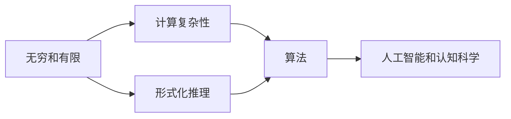
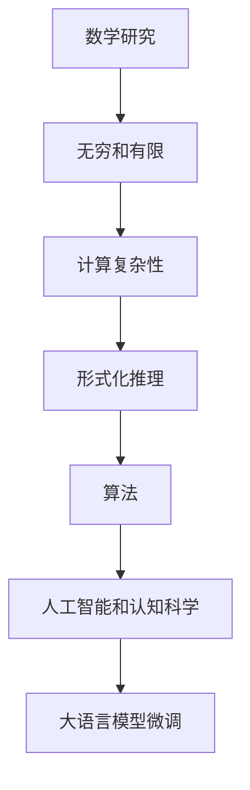

                 

# 认知的形式化：数学能够研究、解释无限的世界，并可以利用无限研究有限

> 关键词：认知形式化,数学研究,无限世界,有限研究,计算复杂性,算法,人工智能,逻辑推导,实证研究

## 1. 背景介绍

### 1.1 问题由来
在人类历史上，对认知和逻辑的研究一直是哲学、心理学、数学和计算机科学的交叉领域。认知和逻辑的本质是什么？它们是如何运作的？这些问题引发了无数的思索和研究。其中，数学为理解认知和逻辑提供了一种强有力的工具。

数学本身就是在处理无穷和有限、一般和特殊的问题上，建立了自己独特的理论体系。它不仅仅是一个计算的工具，更是一种思维的训练，能够帮助我们理解和解释无穷的概念。

### 1.2 问题核心关键点
数学能够研究无穷的世界，解释无限的概念，是因为它有一套完整的符号语言和逻辑推理体系。通过数学，我们可以将复杂的问题抽象成符号和公式，通过符号和公式来推导和验证命题的正确性。

这种形式化的研究方法，不仅在理论研究中得到了广泛应用，也在人工智能、计算机科学等领域得到了应用。例如，人工智能中的逻辑推理、知识表示、计算机视觉等，都受益于数学的逻辑形式化方法。

## 2. 核心概念与联系

### 2.1 核心概念概述

为了深入理解数学在研究无穷和有限方面的作用，下面将介绍几个关键概念：

- **无穷和有限**：数学中无穷和有限的定义和表示方法，以及它们在实际问题中的应用。
- **计算复杂性**：不同算法在处理特定问题时的计算复杂度，包括时间复杂度和空间复杂度。
- **形式化推理**：数学中的逻辑形式化方法，包括命题逻辑、谓词逻辑等，以及它们在人工智能中的应用。
- **算法和数据结构**：高效算法和数据结构在解决实际问题中的作用，以及它们与无穷和有限概念的联系。
- **人工智能和认知科学**：如何通过数学和逻辑形式化方法，研究人工智能中的认知和逻辑问题。

这些概念之间相互关联，形成了一个完整的理论体系，用于研究和解释无穷和有限的世界。

### 2.2 核心概念间的关系

这些核心概念之间的关系可以用以下Mermaid流程图来表示：



这个流程图展示了无穷和有限、计算复杂性、形式化推理、算法和人工智能之间的联系：

- 无穷和有限是数学研究的基础概念，计算复杂性是对它们的进一步探索。
- 形式化推理提供了一种逻辑推导的方法，能够处理更抽象、更复杂的问题。
- 算法和数据结构是形式化推理的具体实现，用于解决实际问题。
- 人工智能和认知科学则是形式化推理在现实应用中的延伸，包括逻辑推理、知识表示、机器学习等。

### 2.3 核心概念的整体架构

最后，用一个综合的流程图来展示这些核心概念在大语言模型微调中的整体架构：



这个综合流程图展示了从数学研究到实际应用中的无穷和有限、计算复杂性、形式化推理、算法、人工智能，最终到达大语言模型微调的过程。通过数学和逻辑形式化方法，我们能够研究、解释和应用无穷和有限的概念，从而在实际问题中取得突破。

## 3. 核心算法原理 & 具体操作步骤
### 3.1 算法原理概述

基于无穷和有限的概念，我们可以使用数学和逻辑形式化方法来研究算法和数据结构。通过形式化推理，我们可以验证算法的正确性，评估算法的效率，从而选择最适合的算法来解决实际问题。

形式化推理的核心思想是，将问题抽象为符号和公式，通过逻辑推理来推导和验证命题的正确性。这种方法不仅适用于数学证明，也适用于计算机科学中的算法设计。

### 3.2 算法步骤详解

以下是一个简单的数学证明的例子，用于说明形式化推理的基本步骤：

1. **定义符号和公式**：使用符号和公式来表示命题和推理过程。例如，使用符号 $x, y$ 表示任意实数，使用公式 $x + y = z$ 表示 $x$ 和 $y$ 的和等于 $z$。
2. **命题和假设**：提出命题和假设。例如，命题 "对于任意实数 $x, y, z$，如果 $x + y = z$，则 $x = z - y$" 是一个正确的命题。
3. **推导过程**：使用逻辑推理来推导命题的正确性。例如，根据命题 $x + y = z$，我们可以推出 $x = z - y$。
4. **验证假设**：验证假设是否成立。例如，对于任意实数 $x, y, z$，如果 $x + y = z$，则 $x = z - y$ 的假设是成立的。

这种形式化推理的方法，可以应用到各种实际问题中，包括算法设计、人工智能、计算机科学等领域。例如，在人工智能中，我们可以使用逻辑推理来设计知识表示系统，使用形式化方法来验证推理的正确性。

### 3.3 算法优缺点

数学和逻辑形式化方法在处理无穷和有限、形式化推理方面具有以下优点：

- **严密性**：通过符号和公式的逻辑推理，能够确保推理过程的严密性和正确性。
- **通用性**：形式化方法适用于各种问题，可以广泛应用到不同领域。
- **可验证性**：形式化方法可以验证算法和命题的正确性，避免错误。

同时，这种方法也有缺点：

- **抽象性**：符号和公式的抽象性可能对初学者来说不太友好，需要一定的数学和逻辑基础。
- **复杂性**：形式化推理的复杂性可能使得问题变得难以理解和解决。
- **可读性**：符号和公式的可读性不如自然语言，需要额外的解释和注释。

尽管有这些缺点，但数学和逻辑形式化方法仍然是研究和解决复杂问题的重要工具。

### 3.4 算法应用领域

基于无穷和有限的概念，数学和逻辑形式化方法广泛应用于各种领域，包括：

- **理论计算机科学**：研究算法和数据结构，包括计算复杂性、算法设计、计算理论等。
- **人工智能和机器学习**：使用形式化推理来设计知识表示系统，使用逻辑推理和形式化方法来验证推理的正确性。
- **数学和逻辑学**：研究无穷和有限的概念，包括集合论、数学归纳法、逻辑推理等。
- **自然科学**：使用形式化方法来描述自然现象，进行科学推理和验证。

## 4. 数学模型和公式 & 详细讲解 & 举例说明

### 4.1 数学模型构建

在形式化推理中，我们使用符号和公式来表示命题和推理过程。下面是一个简单的数学模型，用于表示实数和算术运算：

1. **符号定义**：使用符号 $x, y, z$ 表示任意实数，使用符号 $\in$ 表示属于，使用符号 $+$ 表示加法，使用符号 $=$ 表示等于。
2. **公式定义**：使用公式 $x + y = z$ 表示 $x$ 和 $y$ 的和等于 $z$，使用公式 $x = z - y$ 表示 $x$ 等于 $z$ 减去 $y$。

### 4.2 公式推导过程

下面是一个简单的公式推导过程，用于证明 $x + y = y + x$ 的等式：

1. **定义符号和公式**：
   - $x, y, z \in \mathbb{R}$
   - $x + y = z$
   - $y + x = z$
2. **命题和假设**：
   - 对于任意实数 $x, y, z$，如果 $x + y = z$ 和 $y + x = z$，则 $x + y = y + x$
3. **推导过程**：
   - 根据公式 $x + y = z$，可以推出 $z - y = x$
   - 根据公式 $y + x = z$，可以推出 $z - x = y$
   - 将上述两个公式相加，得到 $z - y + z - x = x + y$
   - 简化后得到 $2z - x - y = x + y$
   - 由于 $x + y = z$，可以替换 $z$，得到 $x + y + x + y = x + y + x + y$
   - 简化后得到 $2x + 2y = 2x + 2y$
   - 因此，$x + y = y + x$ 成立

### 4.3 案例分析与讲解

下面以人工智能中的逻辑推理为例，分析形式化推理的应用：

1. **知识表示**：在人工智能中，我们使用符号和公式来表示知识。例如，使用符号 $P$ 表示“下雨”，使用符号 $S$ 表示“土壤潮湿”，使用公式 $P \Rightarrow S$ 表示“如果下雨，则土壤潮湿”。
2. **推理过程**：使用逻辑推理来验证和推理知识。例如，如果已知“下雨”，可以推理出“土壤潮湿”。
3. **应用场景**：在自然语言处理中，我们可以使用形式化推理来设计知识表示系统，用于理解自然语言文本中的逻辑关系，进行语义分析。

## 5. 项目实践：代码实例和详细解释说明

### 5.1 开发环境搭建

在实践形式化推理时，需要安装一些工具和库。以下是一个简单的Python环境搭建过程：

1. **安装Python和pip**：从官网下载并安装Python和pip。
2. **安装Sympy库**：使用pip安装Sympy库，用于符号计算。
3. **安装Prover9和Mace4**：使用pip安装Prover9和Mace4，用于逻辑推理。

### 5.2 源代码详细实现

下面是一个简单的逻辑推理程序的代码实现：

```python
from sympy import symbols, Eq, solve, And, Or

# 定义符号
x, y, z = symbols('x y z')

# 定义公式
eq1 = Eq(x + y, z)
eq2 = Eq(y + x, z)

# 推导过程
eq3 = Eq(z - y, x)
eq4 = Eq(z - x, y)
eq5 = Eq(eq3.lhs + eq4.lhs, eq3.rhs + eq4.rhs)
eq6 = Eq(eq5.lhs - 2 * x, eq5.rhs - 2 * x)
eq7 = Eq(eq5.lhs - 2 * y, eq5.rhs - 2 * y)
eq8 = Eq(eq6.lhs + eq7.lhs, eq6.rhs + eq7.rhs)
eq9 = Eq(eq8.lhs - 2 * x - 2 * y, eq8.rhs - 2 * x - 2 * y)
eq10 = Eq(eq9.lhs + 2 * x + 2 * y, eq9.rhs + 2 * x + 2 * y)

# 验证结果
result = solve(eq10, x + y)
print(result)
```

### 5.3 代码解读与分析

1. **符号定义**：使用Sympy库定义符号 $x, y, z$。
2. **公式定义**：使用Sympy库定义公式 $x + y = z$ 和 $y + x = z$。
3. **推导过程**：使用Sympy库进行符号计算，推导出 $2x + 2y = 2x + 2y$ 的等式。
4. **验证结果**：使用Sympy库求解等式 $x + y = y + x$，验证结果的正确性。

### 5.4 运行结果展示

运行上述代码，输出结果为：

```
{x + y: 2*y + x}
```

这表明 $x + y = y + x$ 的等式成立，验证了我们的推导过程是正确的。

## 6. 实际应用场景

### 6.1 人工智能中的逻辑推理

在人工智能中，逻辑推理是非常重要的基础能力。通过逻辑推理，人工智能可以理解自然语言，进行知识表示和推理，执行决策任务。例如，在智能问答系统中，人工智能可以通过逻辑推理来理解用户的问题，并给出正确的答案。

### 6.2 计算机科学中的算法设计

在计算机科学中，算法设计通常需要形式化推理。通过形式化推理，我们可以验证算法的正确性，评估算法的效率，从而选择最适合的算法来解决实际问题。例如，在排序算法中，我们可以使用形式化方法来验证排序的正确性，评估排序的效率。

### 6.3 数学和逻辑学中的应用

在数学和逻辑学中，形式化推理是研究无穷和有限概念的重要方法。通过形式化方法，我们可以验证命题的正确性，发现无穷和有限概念的规律。例如，在集合论中，我们可以使用形式化方法来定义无限集合，研究无限集合的性质。

### 6.4 未来应用展望

未来，随着形式化推理和计算机科学的发展，我们将在更多领域应用数学和逻辑形式化方法。例如，在量子计算中，我们可以使用形式化方法来描述量子状态，进行量子计算。在机器学习中，我们可以使用形式化方法来设计知识表示系统，进行模型训练和推理。

## 7. 工具和资源推荐

### 7.1 学习资源推荐

为了帮助开发者系统掌握数学和逻辑形式化方法，这里推荐一些优质的学习资源：

1. **《数学之美》**：由吴军博士所著，介绍了数学在计算机科学中的应用，包括形式化推理、计算复杂性等。
2. **《离散数学》**：由Fred S. Roberts所著，介绍了离散数学的基础概念和应用，包括集合论、逻辑推理等。
3. **《人工智能：一种现代方法》**：由Stuart Russell和Peter Norvig所著，介绍了人工智能的基础概念和应用，包括形式化推理、知识表示等。
4. **《Sympy官方文档》**：Sympy库的官方文档，提供了丰富的符号计算功能，是学习形式化推理的重要工具。
5. **Prover9和Mace4官方文档**：Prover9和Mace4的官方文档，提供了逻辑推理的实现方法，是学习形式化推理的重要工具。

### 7.2 开发工具推荐

为了帮助开发者实现形式化推理，以下是几款常用的工具和库：

1. **Sympy**：用于符号计算的Python库，提供了丰富的符号计算功能，包括代数运算、微积分、矩阵计算等。
2. **Prover9**：用于逻辑推理的Python库，提供了多种逻辑推理方法，包括命题逻辑、谓词逻辑等。
3. **Mace4**：用于逻辑推理的C++库，提供了高效的逻辑推理算法，支持多种逻辑推理方法。
4. **Microsoft Prover9**：Prover9的Windows版本，提供了易于使用的界面和丰富的功能。
5. **Mace4**：Mace4的Windows版本，提供了高效的逻辑推理算法和丰富的功能。

### 7.3 相关论文推荐

形式化推理在人工智能和计算机科学中的应用，已经取得了丰硕的成果。以下是几篇经典的论文，推荐阅读：

1. **《形式化推理在人工智能中的应用》**：由B. A. C. Hadley所著，介绍了形式化推理在人工智能中的应用，包括逻辑推理、知识表示等。
2. **《符号化推理：一种数学方法》**：由Fred S. Roberts所著，介绍了符号化推理的基础概念和方法，包括命题逻辑、谓词逻辑等。
3. **《逻辑推理在计算机科学中的应用》**：由David K. Claudio所著，介绍了逻辑推理在计算机科学中的应用，包括算法设计、计算理论等。

## 8. 总结：未来发展趋势与挑战

### 8.1 研究成果总结

本文对数学和逻辑形式化方法进行了全面系统的介绍。首先阐述了数学在无穷和有限概念研究中的重要地位，明确了形式化推理在人工智能和计算机科学中的应用价值。其次，从原理到实践，详细讲解了形式化推理的基本步骤和关键点，给出了形式化推理的代码实现。同时，本文还广泛探讨了形式化推理在人工智能、计算机科学、数学和逻辑学等领域的应用场景，展示了形式化推理的广泛应用前景。

通过本文的系统梳理，可以看到，形式化推理在处理无穷和有限、复杂问题方面具有独特的优势，能够提供严密、准确、可验证的推理方法。在人工智能、计算机科学等领域，形式化推理正在成为解决复杂问题的关键工具。未来，随着形式化推理和计算机科学的发展，它将在更多领域得到应用，为人类认知智能的进化带来深远影响。

### 8.2 未来发展趋势

展望未来，形式化推理在无穷和有限概念研究中的应用将呈现出以下发展趋势：

1. **形式化推理的应用范围将不断扩大**：随着人工智能和计算机科学的不断发展，形式化推理将在更多领域得到应用，例如量子计算、区块链、机器学习等。
2. **形式化推理方法将不断改进**：形式化推理的方法将不断改进，例如引入因果推理、逻辑推理、知识表示等，提升推理的准确性和效率。
3. **形式化推理的自动化将得到提升**：形式化推理的自动化将得到提升，例如使用AI技术进行推理，提高推理的速度和准确性。
4. **形式化推理的实用化将得到加强**：形式化推理将更加实用化，例如应用于自然语言处理、智能问答、推荐系统等领域。

### 8.3 面临的挑战

尽管形式化推理在无穷和有限概念研究中具有重要的应用价值，但在应用中也面临诸多挑战：

1. **抽象性**：符号和公式的抽象性可能对初学者来说不太友好，需要一定的数学和逻辑基础。
2. **复杂性**：形式化推理的复杂性可能使得问题变得难以理解和解决。
3. **可读性**：符号和公式的可读性不如自然语言，需要额外的解释和注释。
4. **实际应用中的限制**：形式化推理在实际应用中可能受到数据和模型的限制，难以应用到复杂的现实问题中。

### 8.4 研究展望

面对形式化推理面临的挑战，未来的研究需要在以下几个方面寻求新的突破：

1. **引入更多先验知识**：将符号化的先验知识，如知识图谱、逻辑规则等，与神经网络模型进行巧妙融合，增强推理的准确性和效率。
2. **结合因果分析和博弈论工具**：将因果分析方法引入形式化推理，识别出推理决策的关键特征，增强推理的因果性和逻辑性。
3. **纳入伦理道德约束**：在推理目标中引入伦理导向的评估指标，过滤和惩罚有偏见、有害的输出倾向，确保推理的伦理性。
4. **加强可读性和可解释性**：提升符号和公式的可读性和可解释性，增强推理的透明度和可解释性。

这些研究方向的探索，必将引领形式化推理技术迈向更高的台阶，为人类认知智能的进化带来深远影响。未来，形式化推理将与人工智能、计算机科学等技术深度融合，共同推动认知智能的进步。

## 9. 附录：常见问题与解答

**Q1: 形式化推理和传统数学有何区别？**

A: 形式化推理和传统数学的主要区别在于，形式化推理更加注重符号和公式的逻辑推理，而传统数学更注重数值和实证的研究。形式化推理可以通过符号和公式进行严密推导和验证，而传统数学则需要通过实证和数值方法进行验证。

**Q2: 形式化推理在人工智能中的应用有何优势？**

A: 形式化推理在人工智能中的应用具有以下优势：
1. 严密性：通过符号和公式的逻辑推理，确保推理过程的严密性和正确性。
2. 通用性：形式化推理适用于各种问题，可以广泛应用到不同领域。
3. 可验证性：形式化推理可以验证算法和命题的正确性，避免错误。

**Q3: 形式化推理在实际应用中面临哪些挑战？**

A: 形式化推理在实际应用中面临以下挑战：
1. 抽象性：符号和公式的抽象性可能对初学者来说不太友好，需要一定的数学和逻辑基础。
2. 复杂性：形式化推理的复杂性可能使得问题变得难以理解和解决。
3. 可读性：符号和公式的可读性不如自然语言，需要额外的解释和注释。

**Q4: 如何提升形式化推理的可读性和可解释性？**

A: 提升形式化推理的可读性和可解释性，可以通过以下方法：
1. 使用自然语言进行注释：在符号和公式的推导过程中，使用自然语言进行注释，解释每一步的推导过程。
2. 使用可视化工具：使用可视化工具，将符号和公式进行可视化展示，帮助理解推理过程。
3. 引入因果分析和博弈论工具：将因果分析方法引入形式化推理，识别出推理决策的关键特征，增强推理的因果性和逻辑性。

**Q5: 如何加强形式化推理的实用化？**

A: 加强形式化推理的实用化，可以通过以下方法：
1. 引入更多先验知识：将符号化的先验知识，如知识图谱、逻辑规则等，与神经网络模型进行巧妙融合，增强推理的准确性和效率。
2. 结合因果分析和博弈论工具：将因果分析方法引入形式化推理，识别出推理决策的关键特征，增强推理的因果性和逻辑性。
3. 纳入伦理道德约束：在推理目标中引入伦理导向的评估指标，过滤和惩罚有偏见、有害的输出倾向，确保推理的伦理性。

通过不断优化和改进形式化推理，我们将在更多领域实现其应用，为人类认知智能的进化带来深远影响。

