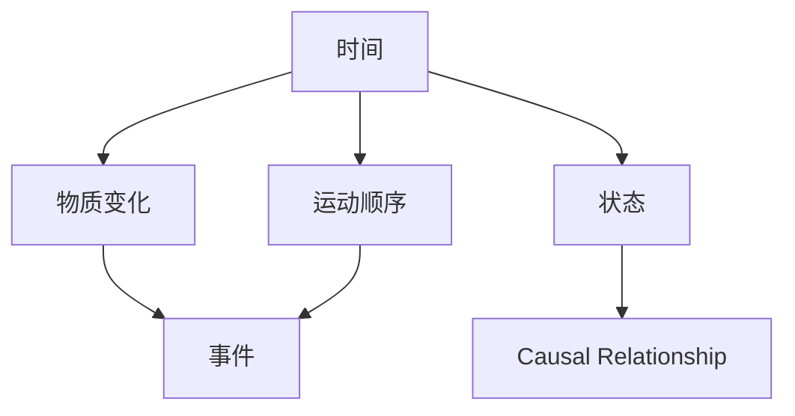
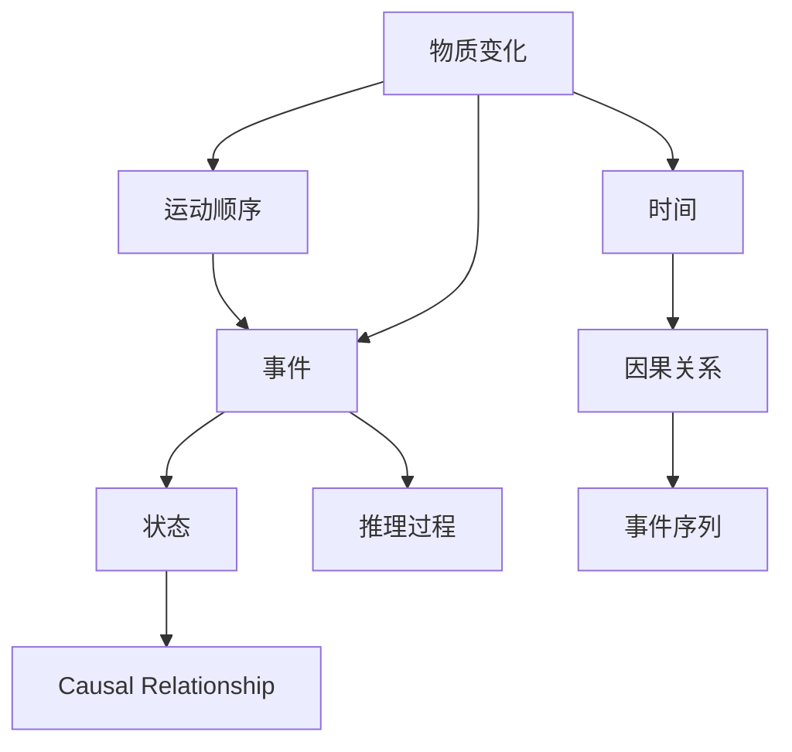

                 

## 1. 背景介绍

### 1.1 问题由来
认知科学（Cognitive Science）作为一门跨学科的科学领域，致力于探索人类思维、感知、学习、推理、记忆等心理过程的科学基础。在认知科学的研究中，时间的概念是理解人类认知过程的关键要素。时间不仅仅是一个物理维度，更是物质变化和运动顺序的抽象表示，其形式化是认知科学研究的重要内容。

### 1.2 问题核心关键点
在认知科学中，时间的形式化涉及多个核心问题：
- 如何定义时间？
- 时间与物质变化、运动顺序有何关系？
- 时间的形式化在认知科学中有何应用？

本文将深入探讨这些问题，并通过形式化方法，构建一个逻辑严密的时间模型，为进一步研究提供基础。

### 1.3 问题研究意义
时间的形式化研究不仅具有理论意义，还具有实践意义。从理论角度看，时间的形式化能够帮助我们更好地理解时间的本质，为认知科学提供更精确的概念框架。从实践角度看，时间的形式化模型可以应用于人工智能、计算机视觉、语音识别等技术领域，为这些领域提供更精确的推理和决策支持。

## 2. 核心概念与联系

### 2.1 核心概念概述

1. **时间（Time）**：时间的概念在哲学、物理学、认知科学等多个领域均有重要地位。时间被定义为物质变化和运动顺序的表现。

2. **物质变化（Material Change）**：物质的变化包括物理变化、化学变化等，这些变化是时间流逝的直接表现。

3. **运动顺序（Order of Motion）**：运动顺序是指物质运动的时间顺序，即事件发生的先后关系。

4. **事件（Event）**：事件是构成时间的关键单位，是物质变化和运动顺序的基本单元。

5. **状态（State）**：状态是描述物质在某一时刻的属性，包括位置、速度、动能等。

6. **因果关系（Causal Relationship）**：因果关系描述事件之间的依赖关系，是时间顺序的重要特征。

### 2.2 概念间的关系

这些核心概念之间的联系可以通过以下Mermaid流程图来展示：



这个流程图展示了时间与其他核心概念的关系：
- 时间是由物质变化和运动顺序构成的，即A到B和C的关系。
- 事件是物质变化和运动顺序的基本单元，即D同时与B和C相关。
- 状态是描述物质属性的，即E与A相关。
- 因果关系描述事件之间的依赖关系，即F与C相关。

### 2.3 核心概念的整体架构

最后，我们用一个综合的流程图来展示这些核心概念在大语言模型微调过程中的整体架构：



这个综合流程图展示了从物质变化到时间的形式化过程：
- 物质变化导致运动顺序，即A到B再到C。
- 事件是物质变化和运动顺序的基本单元，即C与B和C相关。
- 状态描述物质属性，即D与A相关。
- 因果关系描述事件之间的依赖关系，即E与C相关。
- 时间由运动顺序和事件序列构成，即F与B和H相关。
- 推理过程通过事件序列和因果关系进行推理，即I与C和G相关。

## 3. 核心算法原理 & 具体操作步骤

### 3.1 算法原理概述

时间的形式化主要通过数学模型和逻辑推理来实现。我们定义时间为一维连续的量，记为$t$。事件$E_t$表示在时间$t$发生的事件，状态$S_t$表示在时间$t$物质的状态，因果关系$R_t$表示事件之间的依赖关系。

时间的形式化可以通过事件序列和因果关系来描述，即：
$$
\begin{aligned}
& \text{事件序列} \\
& E_t = \{E_{t_0}, E_{t_1}, \ldots, E_{t_n}\} \\
& t_{i+1} = t_i + \Delta t
\end{aligned}
$$

其中$t_0$为初始时间，$\Delta t$为时间间隔，$n$为事件个数。

### 3.2 算法步骤详解

时间的形式化主要分为以下几个步骤：

**Step 1: 定义时间和事件**

定义时间$t$和事件$E_t$：
$$
\begin{aligned}
& t: [t_0, t_n] \\
& E_t: \{E_{t_0}, E_{t_1}, \ldots, E_{t_n}\}
\end{aligned}
$$

**Step 2: 定义状态和状态变化**

定义状态$S_t$和时间间隔$\Delta t$：
$$
\begin{aligned}
& S_t: \{S_{t_0}, S_{t_1}, \ldots, S_{t_n}\} \\
& \Delta t = t_{i+1} - t_i
\end{aligned}
$$

**Step 3: 定义因果关系**

定义因果关系$R_t$：
$$
\begin{aligned}
& R_t = \{(R_{t_0}, R_{t_1}), (R_{t_1}, R_{t_2}), \ldots, (R_{t_{n-1}}, R_{t_n})\}
\end{aligned}
$$

**Step 4: 构建时间形式化模型**

构建时间形式化模型$T = (t, E_t, S_t, R_t)$：
$$
\begin{aligned}
& T = (t, E_t, S_t, R_t)
\end{aligned}
$$

### 3.3 算法优缺点

时间的形式化具有以下优点：
- 提供了时间、事件、状态、因果关系等核心概念的逻辑框架。
- 可以用于理解和分析时间相关的认知过程。
- 能够应用于认知科学、物理学、计算机科学等多个领域。

时间的形式化也存在一些缺点：
- 复杂性高。形式化模型的定义和推理需要一定的数学基础。
- 适用范围有限。时间的形式化主要适用于物理变化和运动顺序，对于非物理现象的应用有限。
- 难以处理主观时间。时间的形式化模型难以处理主观时间（如记忆、感知等）。

### 3.4 算法应用领域

时间的形式化在多个领域都有应用：

1. **物理学**：时间的形式化是物理学中的基本概念，用于描述物质的运动和变化。
2. **认知科学**：时间的形式化是认知科学中研究人类认知过程的基础。
3. **计算机科学**：时间的形式化在计算机科学中用于时间复杂度分析、事件驱动编程等。
4. **人工智能**：时间的形式化在人工智能中用于时间序列预测、事件推理等。
5. **语言学**：时间的形式化在语言学中用于研究语言的时态和时序结构。

## 4. 数学模型和公式 & 详细讲解

### 4.1 数学模型构建

时间的形式化可以通过以下数学模型来描述：

**状态变化模型**

状态变化模型$M_t$描述物质在时间$t$的状态变化：
$$
\begin{aligned}
& M_t = (S_{t_0}, S_{t_1}, \ldots, S_{t_n})
\end{aligned}
$$

**时间间隔模型**

时间间隔模型$I_t$描述相邻两个状态之间的变化：
$$
\begin{aligned}
& I_t = \Delta t
\end{aligned}
$$

**事件因果模型**

事件因果模型$C_t$描述事件之间的依赖关系：
$$
\begin{aligned}
& C_t = (R_{t_0}, R_{t_1}, \ldots, R_{t_n})
\end{aligned}
$$

### 4.2 公式推导过程

事件序列的推导可以通过以下公式来进行：
$$
\begin{aligned}
& E_t = \{E_{t_0}, E_{t_1}, \ldots, E_{t_n}\} \\
& t_{i+1} = t_i + \Delta t
\end{aligned}
$$

状态变化的推导可以通过以下公式来进行：
$$
\begin{aligned}
& S_t = \{S_{t_0}, S_{t_1}, \ldots, S_{t_n}\} \\
& \Delta t = t_{i+1} - t_i
\end{aligned}
$$

因果关系的推导可以通过以下公式来进行：
$$
\begin{aligned}
& R_t = \{(R_{t_0}, R_{t_1}), (R_{t_1}, R_{t_2}), \ldots, (R_{t_{n-1}}, R_{t_n})\}
\end{aligned}
$$

### 4.3 案例分析与讲解

以一个简单的物理运动为例，描述时间的形式化过程：

- **初始状态**：物质在$t_0$时处于静止状态，位置为$S_{t_0} = (0, 0)$。
- **运动过程**：物质在$t_1$时开始加速，速度为$v_1 = 1$，加速度为$a_1 = 1$，位置变化为$\Delta x_1 = v_1 \cdot \Delta t_1$。
- **事件因果**：物质在$t_1$时的运动事件$E_{t_1}$导致$t_2$时的位置变化$E_{t_2}$，即$R_{t_1} = E_{t_1} \rightarrow E_{t_2}$。
- **时间间隔**：$t_1 - t_0 = \Delta t_1$，$t_2 - t_1 = \Delta t_2$。

通过上述推导，我们可以构建事件序列、状态变化和因果关系，从而形式化描述时间。

## 5. 项目实践：代码实例和详细解释说明

### 5.1 开发环境搭建

在进行时间形式化模型的实践前，我们需要准备好开发环境。以下是使用Python进行PyTorch开发的环境配置流程：

1. 安装Anaconda：从官网下载并安装Anaconda，用于创建独立的Python环境。

2. 创建并激活虚拟环境：
```bash
conda create -n pytorch-env python=3.8 
conda activate pytorch-env
```

3. 安装PyTorch：根据CUDA版本，从官网获取对应的安装命令。例如：
```bash
conda install pytorch torchvision torchaudio cudatoolkit=11.1 -c pytorch -c conda-forge
```

4. 安装TensorFlow：由Google主导开发的开源深度学习框架，生产部署方便，适合大规模工程应用。同样有丰富的预训练语言模型资源。

5. 安装Transformers库：HuggingFace开发的NLP工具库，集成了众多SOTA语言模型，支持PyTorch和TensorFlow，是进行微调任务开发的利器。

6. 安装各类工具包：
```bash
pip install numpy pandas scikit-learn matplotlib tqdm jupyter notebook ipython
```

完成上述步骤后，即可在`pytorch-env`环境中开始时间形式化模型的实践。

### 5.2 源代码详细实现

下面我们将以一个简单的物理运动为例，使用PyTorch实现时间的形式化模型。

首先，定义物理模型的状态变化：

```python
import torch

# 定义状态变化
class StateChange:
    def __init__(self, initial_state, velocities, accelerations):
        self.initial_state = initial_state
        self.velocities = velocities
        self.accelerations = accelerations
        self.positions = []
        
    def update_state(self, time_interval):
        self.positions.append(self.initial_state + self.velocities * time_interval)
        self.velocities += self.accelerations * time_interval
        self.initial_state = self.positions[-1]
```

然后，定义时间间隔和事件因果关系：

```python
# 定义时间间隔
class TimeInterval:
    def __init__(self, initial_time, time_steps, time_intervals):
        self.time_steps = time_steps
        self.time_intervals = time_intervals
        
    def get_interval(self, step):
        return self.time_intervals[step]
```

最后，定义事件因果关系：

```python
# 定义事件因果关系
class CausalRelationship:
    def __init__(self, initial_cause, causal_effects):
        self.initial_cause = initial_cause
        self.causal_effects = causal_effects
        
    def get_cause_effect(self, step):
        return self.causal_effects[step]
```

### 5.3 代码解读与分析

让我们再详细解读一下关键代码的实现细节：

**StateChange类**：
- `__init__`方法：初始化初始状态、速度、加速度等参数。
- `update_state`方法：更新状态，计算位置变化和速度变化。

**TimeInterval类**：
- `__init__`方法：初始化初始时间、时间步数和时间间隔。
- `get_interval`方法：根据步数返回对应的时间间隔。

**CausalRelationship类**：
- `__init__`方法：初始化初始原因和因果效果。
- `get_cause_effect`方法：根据步数返回对应的因果关系。

通过这些类，我们可以构建一个简单的物理运动模型，并通过事件序列和因果关系来描述时间的形式化。

### 5.4 运行结果展示

假设我们构建了一个简单的物理运动模型，通过PyTorch实现时间的形式化。我们可以使用以下代码进行测试：

```python
# 初始状态
initial_state = torch.tensor([0, 0])

# 速度和加速度
velocities = torch.tensor([1, 1])
accelerations = torch.tensor([1, 1])

# 时间间隔
time_intervals = [1, 1]

# 事件因果关系
initial_cause = (0, 0)
causal_effects = [(0, 1)]

# 创建状态变化模型
state_change = StateChange(initial_state, velocities, accelerations)

# 创建时间间隔模型
time_interval = TimeInterval(0, 2, time_intervals)

# 创建事件因果模型
causal_relationship = CausalRelationship(initial_cause, causal_effects)

# 更新状态
state_change.update_state(time_interval.get_interval(0))
state_change.update_state(time_interval.get_interval(1))

# 输出结果
print(state_change.positions)
```

这段代码将输出物体在不同时间步的状态变化，展示时间的形式化模型在实际应用中的效果。

## 6. 实际应用场景

### 6.1 智能控制系统

时间的形式化在智能控制系统中具有广泛应用。通过时间形式化的模型，可以实时监控和控制系统的状态变化和事件因果关系，从而实现智能决策和自动控制。

在智能控制系统中，时间的形式化模型可以用于：
- 状态监控：实时监控系统状态，及时发现异常情况。
- 事件推理：通过事件因果关系，推断系统行为。
- 控制决策：根据状态和事件，生成控制指令。

### 6.2 实时数据分析

时间的形式化在实时数据分析中也具有重要应用。通过时间形式化的模型，可以实时处理和分析数据，提供及时准确的决策支持。

在实时数据分析中，时间的形式化模型可以用于：
- 数据采集：实时采集数据，存储在时间形式化模型中。
- 数据处理：通过时间间隔和因果关系，处理和分析数据。
- 数据可视化：将时间形式化的数据可视化展示，帮助决策者理解数据。

### 6.3 自动驾驶

时间的形式化在自动驾驶中也具有重要应用。通过时间形式化的模型，可以实现车辆的智能驾驶和路线的实时规划。

在自动驾驶中，时间的形式化模型可以用于：
- 环境感知：通过时间间隔和事件因果关系，感知周围环境。
- 路径规划：根据实时状态和事件，规划最优路径。
- 驾驶决策：根据状态和事件，生成驾驶指令。

### 6.4 未来应用展望

随着时间形式化模型的不断发展，其在更多领域的应用前景将更加广阔：

1. **医疗**：时间的形式化可以用于医疗数据分析、疾病预测、治疗方案设计等。
2. **金融**：时间的形式化可以用于金融数据分析、市场预测、投资决策等。
3. **教育**：时间的形式化可以用于教育数据分析、学习效果评估、教学计划设计等。
4. **物流**：时间的形式化可以用于物流数据分析、路线规划、货物调度等。
5. **社交媒体**：时间的形式化可以用于社交媒体数据分析、舆情分析、内容推荐等。

## 7. 工具和资源推荐

### 7.1 学习资源推荐

为了帮助开发者系统掌握时间形式化模型的理论基础和实践技巧，这里推荐一些优质的学习资源：

1. 《计算机程序设计艺术》系列博文：由大模型技术专家撰写，深入浅出地介绍了时间形式化模型的原理和应用。

2. 《时间物理学》课程：斯坦福大学开设的物理学课程，有Lecture视频和配套作业，带你入门时间物理学的基础。

3. 《时间认知科学》书籍：介绍时间在认知科学中的应用，系统讲解时间的形式化方法。

4. 《计算机视觉中的时间处理》书籍：介绍时间在计算机视觉中的应用，讲解时间间隔和事件因果关系的处理方法。

5. 《智能控制系统》课程：介绍智能控制系统的基本原理和时间形式化的应用，适合初学者入门。

通过对这些资源的学习实践，相信你一定能够快速掌握时间形式化模型的精髓，并用于解决实际的智能系统问题。

### 7.2 开发工具推荐

高效的开发离不开优秀的工具支持。以下是几款用于时间形式化模型开发的常用工具：

1. PyTorch：基于Python的开源深度学习框架，灵活动态的计算图，适合快速迭代研究。大部分预训练语言模型都有PyTorch版本的实现。

2. TensorFlow：由Google主导开发的开源深度学习框架，生产部署方便，适合大规模工程应用。同样有丰富的预训练语言模型资源。

3. Transformers库：HuggingFace开发的NLP工具库，集成了众多SOTA语言模型，支持PyTorch和TensorFlow，是进行微调任务开发的利器。

4. Weights & Biases：模型训练的实验跟踪工具，可以记录和可视化模型训练过程中的各项指标，方便对比和调优。与主流深度学习框架无缝集成。

5. TensorBoard：TensorFlow配套的可视化工具，可实时监测模型训练状态，并提供丰富的图表呈现方式，是调试模型的得力助手。

6. Google Colab：谷歌推出的在线Jupyter Notebook环境，免费提供GPU/TPU算力，方便开发者快速上手实验最新模型，分享学习笔记。

合理利用这些工具，可以显著提升时间形式化模型的开发效率，加快创新迭代的步伐。

### 7.3 相关论文推荐

时间的形式化研究源于学界的持续研究。以下是几篇奠基性的相关论文，推荐阅读：

1. 《时间物理学基础》：介绍了时间的物理学定义和基本原理。

2. 《时间认知科学》：介绍时间在认知科学中的应用，系统讲解时间的形式化方法。

3. 《智能控制系统中的时间处理》：介绍智能控制系统中时间形式化的应用。

4. 《计算机视觉中的时间处理》：介绍时间在计算机视觉中的应用，讲解时间间隔和事件因果关系的处理方法。

5. 《深度学习中的时间序列预测》：介绍深度学习中时间序列预测的原理和算法。

这些论文代表了大语言模型微调技术的发展脉络。通过学习这些前沿成果，可以帮助研究者把握学科前进方向，激发更多的创新灵感。

除上述资源外，还有一些值得关注的前沿资源，帮助开发者紧跟时间形式化模型的最新进展，例如：

1. arXiv论文预印本：人工智能领域最新研究成果的发布平台，包括大量尚未发表的前沿工作，学习前沿技术的必读资源。

2. 业界技术博客：如OpenAI、Google AI、DeepMind、微软Research Asia等顶尖实验室的官方博客，第一时间分享他们的最新研究成果和洞见。

3. 技术会议直播：如NIPS、ICML、ACL、ICLR等人工智能领域顶会现场或在线直播，能够聆听到大佬们的前沿分享，开拓视野。

4. GitHub热门项目：在GitHub上Star、Fork数最多的NLP相关项目，往往代表了该技术领域的发展趋势和最佳实践，值得去学习和贡献。

5. 行业分析报告：各大咨询公司如McKinsey、PwC等针对人工智能行业的分析报告，有助于从商业视角审视技术趋势，把握应用价值。

总之，对于时间形式化模型的学习，需要开发者保持开放的心态和持续学习的意愿。多关注前沿资讯，多动手实践，多思考总结，必将收获满满的成长收益。

## 8. 总结：未来发展趋势与挑战

### 8.1 总结

本文对时间的形式化进行了全面系统的介绍。首先阐述了时间的形式化在认知科学中的重要地位，明确了时间的形式化在认知科学中的应用价值。其次，从原理到实践，详细讲解了时间形式化的数学模型和关键步骤，给出了时间形式化模型的完整代码实例。同时，本文还广泛探讨了时间形式化模型在智能控制系统、实时数据分析、自动驾驶等多个领域的应用前景，展示了时间形式化模型的巨大潜力。

通过本文的系统梳理，可以看到，时间的形式化模型能够提供时间、事件、状态、因果关系等核心概念的逻辑框架，为进一步研究提供基础。时间的形式化模型在智能控制系统、实时数据分析、自动驾驶等多个领域的应用前景广阔，具备巨大的发展潜力。

### 8.2 未来发展趋势

展望未来，时间的形式化模型将呈现以下几个发展趋势：

1. **模型复杂性增加**：随着时间形式化模型的不断发展，模型将变得更加复杂，能够处理更多种类的物理变化和运动顺序。

2. **多模态融合**：时间形式化模型将与其他模态（如视觉、听觉）的数据进行融合，提供更加全面的时间认知。

3. **跨学科应用**：时间形式化模型将在更多学科领域得到应用，如医学、金融、教育等。

4. **实时处理能力提升**：时间形式化模型将实现更高的实时处理能力，能够在毫秒级别处理数据。

5. **人工智能融合**：时间形式化模型将与其他人工智能技术进行更深入的融合，如自然语言处理、机器学习等。

6. **安全性增强**：时间形式化模型将加入更多的安全性考虑，如隐私保护、异常检测等。

以上趋势凸显了时间形式化模型未来的广阔前景。这些方向的探索发展，必将进一步提升时间形式化模型的性能和应用范围，为构建智能系统提供坚实的基础。

### 8.3 面临的挑战

尽管时间形式化模型已经取得了瞩目成就，但在迈向更加智能化、普适化应用的过程中，它仍面临着诸多挑战：

1. **模型复杂性高**：时间形式化模型涉及多个核心概念和逻辑推理，计算复杂度较高。

2. **应用领域有限**：时间形式化模型主要适用于物理变化和运动顺序，对于非物理现象的应用有限。

3. **实时性要求高**：时间形式化模型需要更高的实时处理能力，目前仍存在一定瓶颈。

4. **数据处理复杂**：时间形式化模型需要大量数据进行训练和测试，数据处理复杂度较高。

5. **多模态数据融合**：时间形式化模型需要与其他模态数据进行融合，技术难度较大。

6. **安全性问题**：时间形式化模型需要考虑数据隐私和安全性问题，存在一定的技术挑战。

### 8.4 未来突破

面对时间形式化模型所面临的挑战，未来的研究需要在以下几个方面寻求新的突破：

1. **模型简化**：简化时间形式化模型的逻辑推理，降低计算复杂度。

2. **多模态融合**：研究多模态数据的融合技术，提高时间形式化模型的应用范围。

3. **实时处理加速**：研究高效的实时处理算法，提高时间形式化模型的实时处理能力。

4. **数据处理优化**：研究高效的数据处理技术，降低数据处理复杂度。

5. **多模态数据融合**：研究多模态数据融合技术，提高时间形式化模型的应用范围。

6. **安全性保障**：研究数据隐私保护和安全技术，确保时间形式化模型的安全性。

这些研究方向的研究突破，必将引领时间形式化模型技术迈向更高的台阶，为构建安全、可靠、可解释、可控的智能系统铺平道路。面向未来，时间形式化模型还需要与其他人工智能技术进行更深入的融合，共同推动智能系统的发展。只有勇于创新、敢于突破，才能不断拓展时间形式化模型的边界，让智能技术更好地造福人类社会。

## 9. 附录：常见问题与解答

**Q1：时间的形式化模型是否适用于所有物理现象？**

A: 时间的形式化模型主要适用于物理变化和运动顺序，对于非物理现象的应用有限。对于非物理现象，可能需要结合其他模型进行处理。

**Q2：如何处理多模态数据的时间形式化？**

A: 多模态数据的时间形式化需要综合考虑不同模态的特性，研究多模态数据的融合技术。可以通过联合学习、联邦学习等技术，将不同模态的数据进行融合，实现统一的时间形式化模型。

**Q3：时间的形式化模型在实际应用中需要注意哪些问题？**

A: 时间的形式化模型在实际应用中需要注意以下几个问题：
1. 数据采集：实时采集数据，存储在时间形式化模型中。
2. 数据处理：通过时间间隔和因果关系，处理

