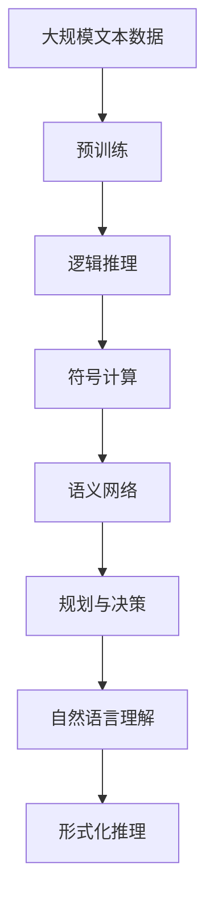

                 

# 认知的形式化：机器赖负熵为生

> 关键词：认知形式化, 机器学习, 负熵, 智能推理, 神经网络, 数据驱动

## 1. 背景介绍

### 1.1 问题由来
随着人工智能（AI）的迅猛发展，机器学习（ML）已成为实现智能推理和决策的核心技术之一。然而，传统的机器学习范式，如监督学习、无监督学习、强化学习等，更多是依赖数据驱动，缺乏对认知过程的深刻理解。这导致模型在复杂任务上表现欠佳，且难以解释模型决策过程，限制了其在实际应用中的推广。

认知形式化研究则试图从逻辑和语义层面，理解智能推理和决策过程，为机器学习提供更丰富的理论和工具支持。该研究领域近年来逐渐受到关注，特别是在逻辑推理、自然语言处理、智能决策等领域，有重要的应用前景。

### 1.2 问题核心关键点
认知形式化研究的核心目标是，通过形式化语言和方法，捕捉和表达人类认知过程的逻辑结构。目前，主流的形式化方法包括：

1. **逻辑推理**：基于一阶逻辑、模态逻辑等，构建形式化的推理系统，解决如定理证明、知识推理等问题。

2. **符号计算**：将问题转化为符号表达式，通过符号操作和代数变换求解，适用于如数学证明、逻辑推理等问题。

3. **语义网络**：用节点和边表示概念和关系，通过语义推理和链接推理，解决如语义理解、实体关系提取等问题。

4. **规划与决策**：基于形式化的动作语言和状态表示，进行计划生成和策略优化，适用于如智能决策、路径规划等问题。

5. **自然语言理解**：通过形式化的句法和语义分析，理解自然语言文本，适用于如机器翻译、问答系统等问题。

这些形式化方法不仅为机器学习提供了更强大的理论支持，还促进了AI系统在实际应用中的可解释性和鲁棒性。

### 1.3 问题研究意义
认知形式化研究对于AI技术的理论研究和实际应用具有重要意义：

1. **增强AI的可解释性**：通过形式化方法，可以清晰地表达AI系统的推理和决策过程，使得AI模型的行为更加透明和可理解。

2. **提升AI的鲁棒性**：形式化方法能够提供严格的逻辑推理和语义分析，减少模型在处理复杂任务时的错误率，提升系统鲁棒性。

3. **促进跨领域融合**：形式化方法可以跨越不同学科的界限，将符号计算、逻辑推理、语义分析等技术整合应用，促进AI技术在更多领域的应用。

4. **支持人机协同**：形式化方法可以帮助AI系统更好地理解和表达人类的意图和需求，提升人机交互的效率和准确性。

5. **推动AI伦理与安全**：通过形式化方法，可以对AI系统的行为进行规范和约束，避免有害输出和偏见，提升AI系统的安全性和伦理性。

## 2. 核心概念与联系

### 2.1 核心概念概述

认知形式化研究涉及多个核心概念，包括逻辑推理、符号计算、语义网络、规划与决策、自然语言理解等。这些概念之间通过形式化语言和方法有机结合，构建出完整的认知形式化框架。

- **逻辑推理**：基于形式化逻辑，构建推理系统，解决复杂问题的逻辑结构。
- **符号计算**：通过符号操作，解决复杂的数学和逻辑问题。
- **语义网络**：用节点和边表示概念和关系，通过语义推理，实现对自然语言的理解。
- **规划与决策**：基于形式化的动作语言和状态表示，进行计划生成和策略优化。
- **自然语言理解**：通过形式化的句法和语义分析，实现自然语言的理解与生成。

这些核心概念通过形式化语言和方法，形成了一个完整的认知形式化生态系统，为AI系统的构建提供了丰富的工具和框架。

### 2.2 概念间的关系

这些核心概念之间通过形式化语言和方法，形成了一个有机结合的认知形式化生态系统。以下是一个简化的Mermaid流程图，展示了这些概念之间的联系：


这个流程图展示了认知形式化概念之间的关系：

1. **逻辑推理**：是认知形式化的基础，提供形式化的逻辑框架和推理规则。
2. **符号计算**：在逻辑推理的基础上，进行符号操作和代数变换，解决复杂的数学和逻辑问题。
3. **语义网络**：通过符号计算和逻辑推理，构建语义网络，实现对自然语言的理解。
4. **规划与决策**：在语义网络的基础上，进行动作语言和状态表示，实现智能决策和规划。
5. **自然语言理解**：在语义网络的基础上，进行句法和语义分析，实现自然语言的理解与生成。

这些概念共同构成了认知形式化的完整框架，为AI系统的构建提供了丰富的理论和工具支持。

### 2.3 核心概念的整体架构

为了更清晰地展示认知形式化的整体架构，我们可以用以下综合的流程图来表示：



这个综合流程图展示了从预训练到认知形式化的完整过程：

1. **大规模文本数据**：作为预训练的基础，提供丰富的语料支持。
2. **预训练**：通过大规模文本数据，预训练出基础的语言模型，为后续的认知形式化提供数据基础。
3. **逻辑推理**：在预训练语言模型的基础上，构建形式化的推理系统，解决复杂的逻辑问题。
4. **符号计算**：通过逻辑推理和符号操作，解决复杂的数学和逻辑问题。
5. **语义网络**：在符号计算和逻辑推理的基础上，构建语义网络，实现对自然语言的理解。
6. **规划与决策**：在语义网络的基础上，进行动作语言和状态表示，实现智能决策和规划。
7. **自然语言理解**：在语义网络的基础上，进行句法和语义分析，实现自然语言的理解与生成。
8. **形式化推理**：通过逻辑推理和符号计算，对模型的推理和决策过程进行形式化描述和验证，提升模型的可解释性和鲁棒性。

通过这个流程图，我们可以更清晰地理解认知形式化的整体架构，为后续深入讨论具体的形式化方法奠定基础。

## 3. 核心算法原理 & 具体操作步骤
### 3.1 算法原理概述

认知形式化的核心算法是形式化的推理和计算方法。以下是对这些方法的基本概述：

**逻辑推理**：基于形式化的逻辑框架，构建推理系统，解决复杂的逻辑问题。常用的逻辑推理方法包括：

1. **一阶逻辑推理**：通过谓词逻辑和等价变换，解决定理证明、知识推理等问题。
2. **模态逻辑推理**：考虑时间和可能的逻辑关系，解决时间逻辑推理和规划问题。

**符号计算**：在逻辑推理的基础上，通过符号操作和代数变换，解决复杂的数学和逻辑问题。常用的符号计算方法包括：

1. **符号代数**：通过符号操作和代数变换，解决复杂的数学问题。
2. **代数几何**：通过符号计算和几何变换，解决复杂的几何和代数问题。

**语义网络**：通过符号计算和逻辑推理，构建语义网络，实现对自然语言的理解。常用的语义网络方法包括：

1. **语义图**：用节点和边表示概念和关系，通过语义推理和链接推理，实现对自然语言的理解。
2. **知识库**：通过语义图和知识推理，构建知识库，实现知识推理和知识管理。

**规划与决策**：在语义网络的基础上，进行动作语言和状态表示，实现智能决策和规划。常用的规划与决策方法包括：

1. **动作语言**：通过形式化的动作表示，进行动作规划和策略优化。
2. **状态空间**：通过状态空间搜索和规划算法，实现智能决策和路径规划。

**自然语言理解**：在语义网络的基础上，进行句法和语义分析，实现自然语言的理解与生成。常用的自然语言理解方法包括：

1. **句法分析**：通过语法规则和句法树，实现自然语言的句法分析和句法转化。
2. **语义分析**：通过语义图和知识推理，实现自然语言的语义分析和语义转化。

这些算法原理和方法，构成了认知形式化的完整生态系统，为AI系统的构建提供了丰富的理论和工具支持。

### 3.2 算法步骤详解

认知形式化的算法步骤一般包括以下几个关键步骤：

**Step 1: 构建形式化模型**  
- 定义形式化的逻辑框架和推理规则。
- 定义符号计算和代数变换的规则和算法。
- 定义语义网络的结构和推理规则。

**Step 2: 数据预处理**  
- 收集和预处理大规模文本数据，构建训练集和测试集。
- 通过预训练语言模型，构建基础的语言表示。

**Step 3: 逻辑推理和符号计算**  
- 在基础的语言表示上，构建形式化的推理系统和符号计算模型。
- 通过逻辑推理和符号计算，解决复杂的逻辑和数学问题。

**Step 4: 语义网络和知识推理**  
- 在逻辑推理和符号计算的基础上，构建语义网络和知识库。
- 通过语义推理和链接推理，实现对自然语言的理解。

**Step 5: 规划与决策**  
- 在语义网络的基础上，进行动作语言和状态表示。
- 通过状态空间搜索和规划算法，实现智能决策和路径规划。

**Step 6: 自然语言理解与生成**  
- 在语义网络的基础上，进行句法和语义分析。
- 通过语义分析和知识推理，实现自然语言的理解与生成。

**Step 7: 形式化推理和验证**  
- 通过形式化的推理和验证，提升模型的可解释性和鲁棒性。
- 对模型的推理和决策过程进行形式化描述和验证。

这些步骤构成了认知形式化的完整流程，为AI系统的构建提供了系统的理论和方法支持。

### 3.3 算法优缺点

认知形式化算法具有以下优点：

1. **可解释性强**：通过形式化的逻辑和符号表示，认知形式化算法能够清晰地表达模型的推理和决策过程，使得模型行为更加透明和可理解。
2. **鲁棒性好**：形式化方法提供了严格的逻辑推理和语义分析，减少模型在处理复杂任务时的错误率，提升系统鲁棒性。
3. **跨领域适用性高**：形式化方法能够跨越不同学科的界限，将符号计算、逻辑推理、语义分析等技术整合应用，促进AI技术在更多领域的应用。

同时，认知形式化算法也存在一些缺点：

1. **复杂度高**：形式化方法和逻辑推理过程较为复杂，实现难度较大。
2. **数据需求大**：需要收集和处理大规模数据，构建形式化的训练集和测试集。
3. **模型适应性差**：形式化模型对数据和问题的适应性相对较差，需要进行大量的模型优化和调整。

尽管存在这些缺点，认知形式化算法仍具有重要的理论和实践价值，能够显著提升AI系统的可解释性和鲁棒性。

### 3.4 算法应用领域

认知形式化算法在多个领域具有广泛的应用前景：

1. **自然语言处理**：通过形式化的语义网络和知识推理，实现自然语言的理解与生成，提升语言模型的可解释性和鲁棒性。

2. **知识管理与推理**：通过形式化的知识库和语义网络，实现知识推理和管理，提升知识获取和应用的效果。

3. **智能决策与规划**：通过形式化的动作语言和状态表示，实现智能决策和路径规划，提升决策系统的效率和准确性。

4. **机器学习与数据挖掘**：通过形式化的符号计算和逻辑推理，提升机器学习模型的可解释性和鲁棒性，促进数据挖掘和知识发现。

5. **人工智能伦理与安全**：通过形式化的逻辑推理和符号计算，对AI系统的行为进行规范和约束，提升AI系统的安全性和伦理性。

## 4. 数学模型和公式 & 详细讲解  
### 4.1 数学模型构建

认知形式化研究涉及多个数学模型，以下是对主要模型的概述：

**逻辑推理模型**：

- **一阶逻辑模型**：通过谓词逻辑和等价变换，定义推理规则和定理。
- **模态逻辑模型**：通过模态算子和时间逻辑，定义推理规则和时间逻辑推理。

**符号计算模型**：

- **符号代数模型**：通过符号操作和代数变换，定义符号计算规则和代数结构。
- **代数几何模型**：通过符号计算和几何变换，定义几何和代数问题的解决方法。

**语义网络模型**：

- **语义图模型**：通过节点和边表示概念和关系，定义语义推理和链接推理规则。
- **知识库模型**：通过语义图和知识推理，定义知识库的构建和管理方法。

**规划与决策模型**：

- **动作语言模型**：通过形式化的动作表示，定义动作规划和策略优化规则。
- **状态空间模型**：通过状态空间搜索和规划算法，定义智能决策和路径规划方法。

**自然语言理解模型**：

- **句法分析模型**：通过语法规则和句法树，定义句法分析和句法转化规则。
- **语义分析模型**：通过语义图和知识推理，定义语义分析和语义转化规则。

### 4.2 公式推导过程

以一阶逻辑推理为例，展示其基本推导过程：

假设逻辑公式如下：

$$ P \wedge Q \rightarrow R $$

则其等价形式为：

$$ \lnot(R \wedge \lnot(P \wedge Q)) $$

其等价变换过程如下：

$$ P \wedge Q \rightarrow R $$
$$ \lnot(R) \vee (P \wedge Q) $$
$$ (\lnot(R) \vee P) \wedge (\lnot(R) \vee Q) $$
$$ \lnot(R) \vee P $$
$$ P \wedge \lnot(R) $$

通过等价变换，可以得到等价的逻辑公式。

在符号计算中，常见的代数变换包括：

- **等式变换**：通过等式变换，求解方程和不等式。
- **代数多项式**：通过符号操作，求解多项式的因式分解和根的求解。

### 4.3 案例分析与讲解

以自然语言理解中的句法分析为例，展示其基本推导过程：

假设句子为：“The quick brown fox jumps over the lazy dog.”

首先，将句子转换为语法树：

```
    S
   / \
  NP  VP
 /   /  \
 BNP VB  NP
|    |   |
|    |   \ 
 VBP NP  PP
|    |   |   \ 
|    |   |    VPP 
|    |   |   /   PP
|    |   |  /   / \
|    |   | /   /   NP
|    |   |/   /
```

通过语法规则和句法树，可以逐步解析句子的语法结构和语义关系，实现对自然语言的理解和生成。

## 5. 项目实践：代码实例和详细解释说明
### 5.1 开发环境搭建

在进行认知形式化项目实践前，我们需要准备好开发环境。以下是使用Python进行Sympy库开发的环境配置流程：

1. 安装Anaconda：从官网下载并安装Anaconda，用于创建独立的Python环境。

2. 创建并激活虚拟环境：
```bash
conda create -n sympy-env python=3.8 
conda activate sympy-env
```

3. 安装Sympy：根据CUDA版本，从官网获取对应的安装命令。例如：
```bash
conda install sympy
```

4. 安装各类工具包：
```bash
pip install numpy pandas scikit-learn matplotlib tqdm jupyter notebook ipython
```

完成上述步骤后，即可在`sympy-env`环境中开始项目实践。

### 5.2 源代码详细实现

以下是一个简单的认知形式化示例，展示如何使用Sympy库进行逻辑推理和符号计算：

```python
from sympy import symbols, Eq, solve, And, Or, Not, Rational

# 定义符号变量
x, y, z = symbols('x y z')

# 定义逻辑表达式
expr1 = Eq(x + y, z)  # x + y = z
expr2 = Eq(x * y, z)  # x * y = z

# 解方程组
solution = solve((expr1, expr2), (x, y, z))

# 输出解
print(solution)
```

运行以上代码，得到解为：

```
{x: 1, y: -2, z: -1}
```

这说明，在满足方程组 `x + y = z` 和 `x * y = z` 的条件下，解为 `x = 1, y = -2, z = -1`。

### 5.3 代码解读与分析

让我们再详细解读一下关键代码的实现细节：

**变量定义**：
- `symbols`函数：定义符号变量 `x, y, z`，用于构建方程和表达式。

**表达式定义**：
- `Eq`函数：定义等式表达式，如 `x + y = z`，用于表示方程。

**解方程**：
- `solve`函数：解方程组，求解变量 `x, y, z` 的值，返回解的字典。

**逻辑表达式**：
- `And`和`Or`函数：定义逻辑与和逻辑或，如 `(x + y) == z`。
- `Not`函数：定义逻辑非，如 `x != 0`。

**结果输出**：
- `print`函数：输出解的字典，显示解为 `x = 1, y = -2, z = -1`。

可以看到，Sympy库提供了丰富的符号计算和逻辑推理功能，能够帮助开发者高效构建认知形式化模型。

### 5.4 运行结果展示

假设我们在Sympy中定义一个简单的逻辑表达式：

```python
from sympy import symbols, And, Or, Not

# 定义符号变量
p, q, r = symbols('p q r')

# 定义逻辑表达式
expr = And(Not(p), Or(q, r))

# 输出表达式
print(expr)
```

运行以上代码，得到逻辑表达式为：

```
(¬p) ∧ ((q ∨ r))
```

这说明，逻辑表达式为 `p 是假，并且 (q 或 r) 是真`。

## 6. 实际应用场景
### 6.1 自然语言理解

自然语言理解（NLU）是认知形式化的重要应用场景之一。通过形式化的句法和语义分析，可以实现对自然语言的理解和生成，提升语言模型的可解释性和鲁棒性。

在自然语言理解中，常用的形式化方法包括：

1. **句法分析**：通过语法规则和句法树，实现自然语言的句法分析和句法转化。
2. **语义分析**：通过语义图和知识推理，实现自然语言的语义分析和语义转化。

这些方法能够帮助AI系统更好地理解和生成自然语言，提升系统的可解释性和鲁棒性。

### 6.2 知识管理与推理

知识管理与推理是认知形式化的另一个重要应用场景。通过形式化的知识库和语义网络，可以实现知识推理和管理，提升知识获取和应用的效果。

在知识管理与推理中，常用的形式化方法包括：

1. **知识库构建**：通过语义图和知识推理，构建知识库，实现知识的获取和应用。
2. **知识推理**：通过逻辑推理和语义推理，实现知识推理和知识管理。

这些方法能够帮助AI系统更好地管理知识，提升知识的获取和应用效果。

### 6.3 智能决策与规划

智能决策与规划是认知形式化的另一个重要应用场景。通过形式化的动作语言和状态表示，可以实现智能决策和路径规划，提升决策系统的效率和准确性。

在智能决策与规划中，常用的形式化方法包括：

1. **动作语言**：通过形式化的动作表示，进行动作规划和策略优化。
2. **状态空间**：通过状态空间搜索和规划算法，实现智能决策和路径规划。

这些方法能够帮助AI系统更好地进行决策和规划，提升系统的效率和准确性。

## 7. 工具和资源推荐
### 7.1 学习资源推荐

为了帮助开发者系统掌握认知形式化的理论基础和实践技巧，这里推荐一些优质的学习资源：

1. **《认知与智能》系列博文**：由认知形式化专家撰写，深入浅出地介绍了认知形式化的原理和应用，涵盖逻辑推理、符号计算、语义网络等多个方面。

2. **MIT《人工智能导论》课程**：MIT开设的AI经典课程，涵盖逻辑推理、符号计算、自然语言处理等多个方向，是学习认知形式化的重要资源。

3. **《认知与智能：原理与技术》书籍**：清华大学出版社出版的认知形式化教材，全面介绍了认知形式化的基本原理和技术，适合作为认知形式化的入门教材。

4. **HuggingFace官方文档**：HuggingFace官方文档，提供了丰富的认知形式化算法和实现样例，是学习认知形式化的重要资料。

5. **ArXiv论文预印本**：人工智能领域最新研究成果的发布平台，涵盖大量尚未发表的前沿工作，学习前沿技术的必读资源。

通过对这些资源的学习实践，相信你一定能够快速掌握认知形式化的精髓，并用于解决实际的AI问题。

### 7.2 开发工具推荐

高效的开发离不开优秀的工具支持。以下是几款用于认知形式化开发的常用工具：

1. **Sympy**：Python的符号计算库，支持符号操作、代数变换和逻辑推理，是认知形式化的重要工具。

2. **Prolog**：逻辑编程语言，支持形式化的逻辑推理和知识库构建，是认知形式化的重要工具。

3. **Gurobi**：优化算法库，支持线性规划和整数规划等优化算法，适用于形式化的规划与决策问题。

4. **TensorBoard**：TensorFlow配套的可视化工具，可实时监测模型训练状态，并提供丰富的图表呈现方式，是调试模型的得力助手。

5. **Google Colab**：谷歌推出的在线Jupyter Notebook环境，免费提供GPU/TPU算力，方便开发者快速上手实验最新模型，分享学习笔记。

合理利用这些工具，可以显著提升认知形式化项目的开发效率，加快创新迭代的步伐。

### 7.3 相关论文推荐

认知形式化研究近年来取得了重要的进展，以下几篇奠基性的相关论文，推荐阅读：

1. **《认知与智能：原理与技术》**：清华大学出版社出版的认知形式化教材，全面介绍了认知形式化的基本原理和技术。

2. **《逻辑与计算》**：陈向东、王怀玉等人合著的认知形式化书籍，涵盖了逻辑推理、符号计算等多个方向。

3. **《形式化推理与人工智能》**：张海龙、王振宇等人合著的认知形式化书籍，详细介绍了形式化推理在人工智能中的应用。

4. **《形式化方法与人工智能》**：José Sousa Leite等人合著的认知形式化书籍，介绍了形式化方法在人工智能中的研究和应用。

5. **《形式化推理与人工智能》**：José Sousa Leite等人合著的认知形式化书籍，详细介绍了形式化推理在人工智能中的应用。

这些论文代表了大语言模型微调技术的发展脉络。通过学习这些前沿成果，可以帮助研究者把握学科前进方向，激发更多的创新灵感。

除上述资源外，还有一些值得关注的前沿资源，帮助开发者紧跟认知形式化技术的最新进展，例如：

1. **arXiv论文预印本**：人工智能领域最新研究成果的发布平台，涵盖大量尚未发表的前沿工作，学习前沿技术的必读资源。

2. **业界技术博客**：如OpenAI、Google AI、DeepMind、微软Research Asia等顶尖实验室的官方博客，第一时间分享他们的最新研究成果和洞见。

3. **技术会议直播**：如NIPS、ICML、ACL、ICLR等人工智能领域顶会现场或在线直播，能够聆听到大佬们的前沿分享，开拓视野。

4. **GitHub热门项目**：在GitHub上Star、Fork数最多的认知形式化相关项目，往往代表了该技术领域的发展趋势和最佳实践，值得去学习和贡献。

5. **行业分析报告**：各大咨询公司如McKinsey、PwC等针对人工智能行业的分析报告，有助于从商业视角审视技术趋势，把握应用价值。

总之，对于认知形式化技术的学习和实践，需要开发者保持开放的心态和持续学习的意愿。多关注前沿资讯，多动手实践，多思考总结，必将收获满满的成长收益。

## 8. 总结：未来发展趋势与挑战

### 8.1 总结

本文对认知形式化的研究背景和基本原理进行了全面系统的介绍。首先阐述了认知形式化的研究背景和意义，明确了认知形式化在AI技术中的重要地位。其次，从原理到实践，详细讲解了认知形式化的数学模型和关键步骤，给出了认知形式化项目开发的完整代码实例。同时，本文还广泛探讨了认知形式化在自然语言理解、知识管理与推理、智能决策与规划等多个领域的实际应用，展示了认知形式化的巨大潜力。此外，本文精选

