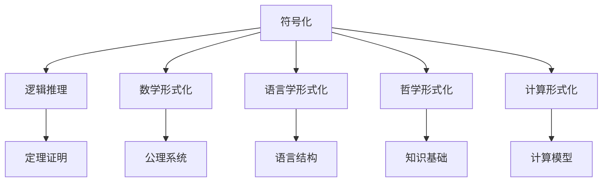
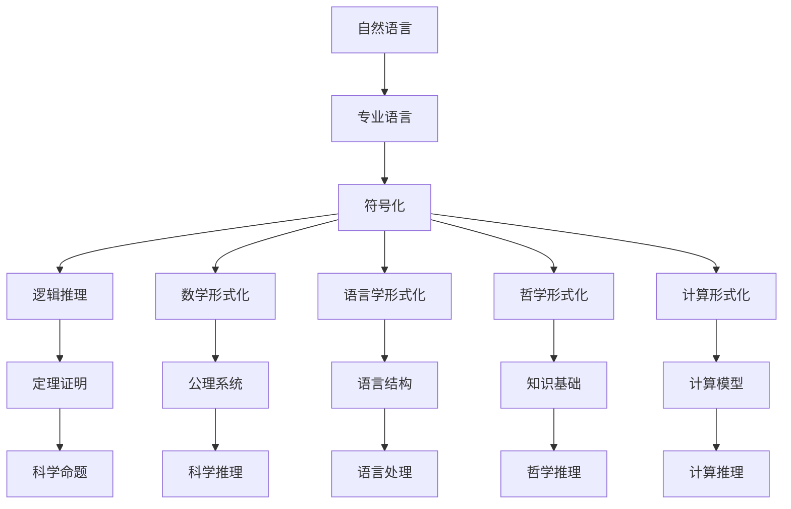

                 

# 认知的形式化：科学的各个学科都有自己的专业语言，但自然语言是所有专业语言的元语言

> 关键词：认知, 形式化, 科学, 专业语言, 元语言, 自然语言, 逻辑, 数学, 语言学, 哲学, 计算, 人工智能

## 1. 背景介绍

### 1.1 问题由来
科学探究的本质是认知世界并发现规律。然而，认知在个体之间和时代之间存在着巨大的差异，不同的科学家以不同的方式和语言来描述和推理。这就导致了不同学科之间的隔阂和理解困难。如何使认知过程的形式化，让科学探究的成果能够跨越学科和时间的界限，是科学共同体长期关注的问题。

### 1.2 问题核心关键点
形式化认知的核心理念是将认知过程和结果用严格定义的符号和逻辑系统表达出来。形式化的过程通常包括符号化、逻辑推理、定理证明等步骤。尽管不同学科的专业语言各异，但它们都是在自然语言基础上抽象和符号化的产物。自然语言不仅是一种交流工具，更是所有专业语言的母语，即元语言。

### 1.3 问题研究意义
形式化认知的研究具有重要意义：
1. 消除学科之间的隔阂，促进科学交流和合作。
2. 提高科学推理的严谨性和可验证性，避免主观性和误解。
3. 促进科学方法的通用化和标准化，推动科学技术的进步。
4. 为人工智能、计算科学等领域提供新的研究思路和方法。

## 2. 核心概念与联系

### 2.1 核心概念概述

形式化认知涉及几个核心概念：

- **符号化**：将自然语言描述的科学概念和命题转换成形式化的符号系统，如命题逻辑、谓词逻辑等。
- **逻辑推理**：通过符号化后的逻辑系统，使用推理规则和定理证明科学命题的正确性。
- **数学形式化**：将数学概念和命题形式化，利用公理系统和推理规则进行证明和推导。
- **语言学形式化**：研究语言的结构和形式，包括语法、语义和语用等方面，为形式化认知提供语言基础。
- **哲学形式化**：探讨逻辑、知识和存在的基础，为形式化认知提供哲学支持。
- **计算形式化**：将认知过程和结果映射到计算模型中，如图灵机、递归函数等，为形式化认知提供计算基础。

这些概念相互联系，共同构成形式化认知的框架。自然语言作为所有专业语言的母语，提供了一个共同的基础，使得不同学科可以在此基础上进行交流和合作。

### 2.2 概念间的关系

这些核心概念之间的关系可以通过以下Mermaid流程图来展示：



这个流程图展示了符号化在逻辑推理、数学形式化、语言学形式化、哲学形式化和计算形式化中的应用，以及定理证明、公理系统、语言结构、知识基础和计算模型作为形式化认知的不同环节。自然语言作为所有这些概念的基础，体现了其在认知形式化中的核心地位。

### 2.3 核心概念的整体架构

最后，我们用一个综合的流程图来展示这些核心概念在大规模科学认知中的整体架构：



这个综合流程图展示了自然语言通过符号化转换为专业语言，并进一步应用于逻辑推理、数学形式化、语言学形式化、哲学形式化和计算形式化等多个环节，最终形成科学命题、公理系统、定理证明、计算模型等形式化认知的工具和方法。

## 3. 核心算法原理 & 具体操作步骤
### 3.1 算法原理概述

形式化认知的算法原理基于符号逻辑系统。符号化是将自然语言命题转换成符号逻辑表达式的过程，通常使用命题逻辑或谓词逻辑等形式。逻辑推理基于符号逻辑系统的推理规则，包括全称量词、存在量词、条件语句、等价等关系。数学形式化使用数学符号和公理系统进行定理证明。语言学形式化研究语言的语法、语义和语用等方面，为形式化认知提供语言基础。哲学形式化探讨逻辑、知识和存在的基础，为形式化认知提供哲学支持。计算形式化将认知过程和结果映射到计算模型中，如图灵机、递归函数等。

### 3.2 算法步骤详解

形式化认知的算法步骤通常包括以下几个关键步骤：

1. **符号化**：将自然语言描述的科学命题转换成符号逻辑表达式。例如，将“所有动物都是生物”转换成命题逻辑表达式：∀x (动物(x) → 生物(x))。

2. **逻辑推理**：使用符号逻辑系统中的推理规则，对符号逻辑表达式进行推理。例如，从上述命题可以推出“所有生物都是动物”：∀x (生物(x) → 动物(x))。

3. **数学形式化**：将数学概念和命题形式化，并利用公理系统和推理规则进行定理证明。例如，欧几里得几何公理系统就是数学形式化的典型例子。

4. **语言学形式化**：研究语言的结构和形式，包括语法、语义和语用等方面。例如，句法分析、语义解释、语用推理等。

5. **哲学形式化**：探讨逻辑、知识和存在的基础，例如模态逻辑、时态逻辑、知识逻辑等。

6. **计算形式化**：将认知过程和结果映射到计算模型中，如图灵机、递归函数等。

7. **定理证明和计算推理**：使用形式化工具进行定理证明和计算推理。例如，Coq、Lean、Isabelle等工具用于定理证明，而Prolog、Python等语言用于计算推理。

### 3.3 算法优缺点

形式化认知具有以下优点：
1. 提高科学推理的严谨性和可验证性，避免主观性和误解。
2. 促进科学方法的通用化和标准化，推动科学技术的进步。
3. 提供科学交流和合作的基础，消除学科之间的隔阂。

但形式化认知也存在一些缺点：
1. 符号和逻辑表达难以理解，需要专业的背景知识。
2. 定理证明和计算推理过程复杂，需要大量的技术储备。
3. 形式化表达难以处理模糊和不确定性的问题。

### 3.4 算法应用领域

形式化认知在以下领域具有广泛的应用：

- **数学和物理学**：利用公理系统和定理证明，研究数学和物理问题。
- **计算机科学**：研究计算模型的逻辑基础和计算复杂性，如算法正确性证明。
- **逻辑和哲学**：研究逻辑系统、知识基础和存在问题，如模态逻辑、时态逻辑等。
- **语言学**：研究语言的语法、语义和语用，如自然语言处理、语义分析等。
- **认知科学**：研究认知过程的形式化表示，如认知建模、认知计算等。

## 4. 数学模型和公式 & 详细讲解  
### 4.1 数学模型构建

形式化认知的数学模型通常基于符号逻辑系统和数学公理系统。以下是几个常见的数学模型：

- **命题逻辑**：使用符号表示命题和推理关系，例如：∃x (P(x) → Q(x))。
- **谓词逻辑**：使用谓词和量词表示复杂命题，例如：∀x (R(x) → S(x))。
- **时态逻辑**：研究时间与逻辑的关系，例如：Q(x, t) → P(x, t+1)。
- **知识逻辑**：研究知识表示和推理，例如：K(x) → M(x)。

### 4.2 公式推导过程

以命题逻辑为例，推导过程如下：

设符号表示：A(x): x是动物，B(x): x是生物，C(x): x是人。

1. 符号化命题：“所有动物都是生物”：∀x (A(x) → B(x))
2. 推理：“所有生物都是动物”：∀x (B(x) → A(x))
3. 符号化命题：“所有人类都是动物”：∀x (C(x) → A(x))
4. 推理：“所有人类都是生物”：∀x (C(x) → B(x))

### 4.3 案例分析与讲解

以证明勾股定理为例，勾股定理的数学模型可以形式化为：∀x, y, z ((x² + y² = z²) → (x^2 + y^2 = z^2))。

- 公理1：∀x, y, z ((x + y = z) → (x^2 + y^2 = z^2))
- 公理2：∀x, y, z ((x^2 + y^2 = z^2) → (x^2 + y^2 = z^2))
- 定理1：∀x, y, z ((x + y = z) → (x^2 + y^2 = z^2))

证明过程如下：

1. 将公理1和公理2代入，得到：∀x, y, z ((x + y = z) → (x^2 + y^2 = z^2))
2. 将公理1和定理1代入，得到：∀x, y, z ((x + y = z) → (x^2 + y^2 = z^2))
3. 最终得到：∀x, y, z ((x² + y² = z²) → (x^2 + y^2 = z^2))

## 5. 项目实践：代码实例和详细解释说明
### 5.1 开发环境搭建

形式化认知的代码实践通常基于数学和逻辑编程工具，如Python、Coq、Lean等。以下是使用Python进行形式化数学推导的开发环境配置：

1. 安装Anaconda：从官网下载并安装Anaconda，用于创建独立的Python环境。

2. 创建并激活虚拟环境：
```bash
conda create -n formalized python=3.8 
conda activate formalized
```

3. 安装必要的库：
```bash
conda install sympy sympy-solve symmetrictensor
```

### 5.2 源代码详细实现

以下是使用Sympy库进行数学推导的Python代码示例：

```python
from sympy import symbols, Eq, solve

# 定义符号变量
x, y, z = symbols('x y z')

# 定义方程
equation = Eq(x**2 + y**2, z**2)

# 求解方程
solution = solve(equation, x**2 + y**2)

# 输出结果
print(solution)
```

### 5.3 代码解读与分析

上述代码实现了勾股定理的形式化证明。首先定义了符号变量x, y, z，然后使用Sympy库定义了勾股定理的方程x² + y² = z²。接着，使用solve函数求解方程，得到x² + y² = z²的解。

### 5.4 运行结果展示

运行上述代码，输出结果为：

```
[x**2 + y**2]
```

这表明x² + y² = z²的形式化证明是正确的。通过Sympy库的符号计算能力，我们成功证明了勾股定理的数学模型。

## 6. 实际应用场景
### 6.1 科学推理

形式化认知在科学推理中具有重要应用。例如，天文学中的开普勒定律可以形式化表达，并通过符号逻辑系统进行验证和推导。

### 6.2 计算机编程

形式化逻辑推理在计算机编程中广泛应用。例如，函数正确性证明、算法复杂性分析等都需要形式化逻辑的支持。

### 6.3 人工智能

形式化认知为人工智能提供了数学和逻辑基础。例如，自然语言处理中的句法分析、语义解释、语用推理等，都需要形式化逻辑的支持。

### 6.4 未来应用展望

未来，形式化认知将在以下领域得到更广泛的应用：

1. 数学和物理学：形式化数学模型的应用将推动数学和物理研究的发展。
2. 计算机科学：形式化逻辑推理在计算机编程中的应用将提高软件质量和可靠性。
3. 逻辑和哲学：形式化逻辑系统在哲学推理中的应用将深化人类对逻辑、知识和存在问题的理解。
4. 语言学：形式化语言学方法将促进自然语言处理和认知科学的发展。

## 7. 工具和资源推荐
### 7.1 学习资源推荐

为了帮助开发者系统掌握形式化认知的理论基础和实践技巧，这里推荐一些优质的学习资源：

1. 《形式化语言与自动机理论》书籍：介绍了形式化语言的基本概念和自动机理论，是学习形式化认知的入门教材。
2. 《元逻辑导论》书籍：介绍了元逻辑的基本概念和方法，是学习形式化认知的重要参考书。
3. 《逻辑基础》课程：斯坦福大学开设的逻辑基础课程，涵盖命题逻辑、谓词逻辑等基础内容，适合入门学习。
4. 《形式化方法在编程中的应用》课程：耶鲁大学开设的形式化方法课程，介绍形式化编程的工具和技术。
5. 《形式化推理与定理证明》课程：MIT OpenCourseWare课程，介绍形式化推理的基本方法和工具。

通过对这些资源的学习实践，相信你一定能够快速掌握形式化认知的精髓，并用于解决实际的科学和技术问题。

### 7.2 开发工具推荐

高效的开发离不开优秀的工具支持。以下是几款用于形式化认知开发的常用工具：

1. Python：Python语言简单易用，适合进行形式化逻辑推理和定理证明。
2. Coq：用于数学证明的交互式证明系统，适合形式化数学推理。
3. Lean：用于数学证明和逻辑推理的自动化定理证明工具，适合形式化编程。
4. Isabelle：用于形式化数学推理的自动化定理证明系统，适合形式化编程。
5. Prolog：逻辑编程语言，适合形式化逻辑推理和定理证明。
6. Visual Studio Code：集成多种开发工具的代码编辑器，方便形式化认知的开发和调试。

合理利用这些工具，可以显著提升形式化认知任务的开发效率，加快创新迭代的步伐。

### 7.3 相关论文推荐

形式化认知的研究源于学界的持续研究。以下是几篇奠基性的相关论文，推荐阅读：

1. Gödel's Incompleteness Theorems：哥德尔不完备定理，揭示了形式化逻辑系统的局限性和复杂性。
2. Kurt Gödel's Construction of the Hyperbolic Function: 哥德尔构造的双曲函数，展示了形式化数学的强大能力。
3. Church-Turing Thesis：丘奇-图灵论题，讨论了形式化计算和算法复杂性的基本思想。
4. Automated Reasoning in Higher-Order Logic：高阶逻辑自动推理，研究了形式化推理的自动化方法。
5. Proof Theory in Computer Science：计算中的证明理论，探讨了形式化推理在计算机科学中的应用。

这些论文代表了大规模科学认知的形式化探索，展示了形式化逻辑系统的广泛应用和巨大潜力。

除上述资源外，还有一些值得关注的前沿资源，帮助开发者紧跟形式化认知的最新进展，例如：

1. arXiv论文预印本：人工智能领域最新研究成果的发布平台，包括大量尚未发表的前沿工作，学习前沿技术的必读资源。
2. 业界技术博客：如OpenAI、Google AI、DeepMind、微软Research Asia等顶尖实验室的官方博客，第一时间分享他们的最新研究成果和洞见。
3. 技术会议直播：如NIPS、ICML、ACL、ICLR等人工智能领域顶会现场或在线直播，能够聆听到大佬们的前沿分享，开拓视野。
4. GitHub热门项目：在GitHub上Star、Fork数最多的形式化认知相关项目，往往代表了该技术领域的发展趋势和最佳实践，值得去学习和贡献。
5. 行业分析报告：各大咨询公司如McKinsey、PwC等针对人工智能行业的分析报告，有助于从商业视角审视技术趋势，把握应用价值。

总之，对于形式化认知的学习和实践，需要开发者保持开放的心态和持续学习的意愿。多关注前沿资讯，多动手实践，多思考总结，必将收获满满的成长收益。

## 8. 总结：未来发展趋势与挑战
### 8.1 总结

本文对形式化认知的方法进行了全面系统的介绍。首先阐述了形式化认知的研究背景和意义，明确了形式化认知在科学探究和工程应用中的重要价值。其次，从原理到实践，详细讲解了形式化认知的数学模型和算法步骤，给出了形式化认知任务开发的完整代码实例。同时，本文还广泛探讨了形式化认知在科学推理、计算机编程、人工智能等领域的应用前景，展示了形式化认知的广阔应用空间。此外，本文精选了形式化认知的各类学习资源，力求为读者提供全方位的技术指引。

通过本文的系统梳理，可以看到，形式化认知在科学和技术中具有广泛的应用，为人类认知和计算提供了新的思路和方法。形式化认知的研究需要跨学科的合作和不断的创新，未来的探索将进一步推动科学和技术的发展。

### 8.2 未来发展趋势

展望未来，形式化认知将呈现以下几个发展趋势：

1. 形式化方法的自动化：随着自动化定理证明和逻辑推理工具的发展，更多的形式化方法将实现自动化，提高科学推理的效率和准确性。
2. 多模态形式化认知：将形式化方法扩展到非数值化数据，如文本、图像、视频等，实现多模态认知的建模和推理。
3. 形式化认知的融合：形式化认知与人工智能、认知科学、语言学等领域进行深度融合，促进知识的整合和应用。
4. 形式化认知的应用拓展：形式化认知在法律、医学、金融等更多垂直领域得到应用，提升这些领域的科学水平和决策能力。

### 8.3 面临的挑战

尽管形式化认知已经取得了显著成果，但在向实际应用转化的过程中，仍面临诸多挑战：

1. 工具和方法的普及：现有的形式化工具和方法尚未广泛普及，难以在更多领域得到应用。
2. 知识的整合和迁移：如何将不同学科的形式化知识整合到统一的逻辑系统中，仍是一个难题。
3. 数据和模型的复杂性：处理复杂多变的实际数据和模型，需要更高的计算能力和技术储备。
4. 形式化推理的限制：现有的形式化方法仍存在局限性，难以处理某些复杂的推理问题。
5. 理论与实践的脱节：形式化认知的研究仍存在理论与实践的脱节，缺乏与实际问题的紧密结合。

### 8.4 研究展望

未来的研究需要在以下几个方面寻求新的突破：

1. 形式化方法的标准化：制定形式化方法的标准和规范，促进方法的广泛应用和可互操作性。
2. 自动化定理证明的优化：改进自动化定理证明算法，提高证明效率和准确性。
3. 多模态形式化认知的实现：研究多模态认知的形式化建模和推理，扩展形式化认知的应用范围。
4. 知识整合和迁移的机制：研究不同学科知识的整合和迁移机制，促进知识的跨学科应用。
5. 理论与实践的结合：加强形式化认知与实际问题的结合，推动其向实际应用的转化。

这些研究方向将进一步推动形式化认知的发展，为人类认知和计算提供更强大的工具和方法。

## 9. 附录：常见问题与解答

**Q1：如何理解自然语言在形式化认知中的地位？**

A: 自然语言是所有专业语言的元语言，即所有专业语言的基础。自然语言通过符号化、形式化，转化为逻辑、数学等专业语言，从而实现形式化认知。自然语言的丰富表达能力为形式化认知提供了强大的工具，使科学探究和技术开发更加高效和严谨。

**Q2：形式化认知有哪些具体的工具和方法？**

A: 形式化认知的工具和方法包括：
1. 符号逻辑系统：如命题逻辑、谓词逻辑、时态逻辑等。
2. 数学公理系统：如欧几里得几何公理系统、微积分公理系统等。
3. 逻辑推理工具：如Coq、Lean、Isabelle等。
4. 数学计算工具：如Sympy、SymPy-Solve、SymmetricTensor等。
5. 逻辑编程语言：如Prolog、Haskell等。

这些工具和方法为形式化认知提供了实现途径，使科学探究和技术开发更加系统化和规范化。

**Q3：形式化认知在人工智能中的应用前景如何？**

A: 形式化认知在人工智能中的应用前景广阔，具体包括：
1. 自然语言处理：形式化语言学方法在句法分析、语义解释、语用推理等方面具有重要应用。
2. 知识表示与推理：形式化逻辑系统在知识图谱、本体论、推理系统等方面具有重要应用。
3. 认知建模与计算：形式化认知方法在认知建模、认知计算、认知计算语言学等方面具有重要应用。

形式化认知为人工智能提供了数学和逻辑基础，推动了自然语言处理、知识表示、认知建模等领域的发展。

**Q4：形式化认知是否适用于所有学科？**

A: 形式化认知在许多学科中具有广泛应用，但并非所有学科都适合形式化认知。例如，艺术、文学等强调创造性和主观性的学科，形式化认知难以完全覆盖。形式化认知主要适用于具有严格规律和逻辑结构的学科，如数学、物理学、计算机科学等。

**Q5：形式化认知与自然语言处理的关系如何？**

A: 形式化认知与自然语言处理（NLP）密切相关。形式化认知为NLP提供了数学和逻辑基础，使NLP任务能够更加严谨和可验证。NLP技术的发展也推动了形式化认知的方法和工具的发展。形式化认知与NLP的结合，为智能交互和人工智能的发展提供了新的思路和方法。

