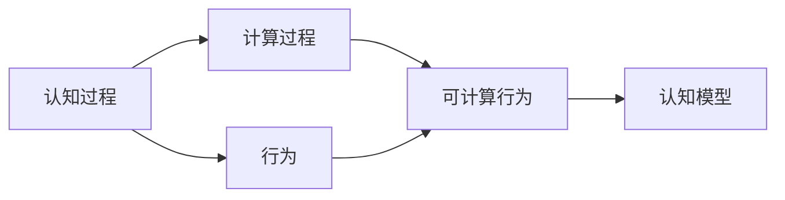
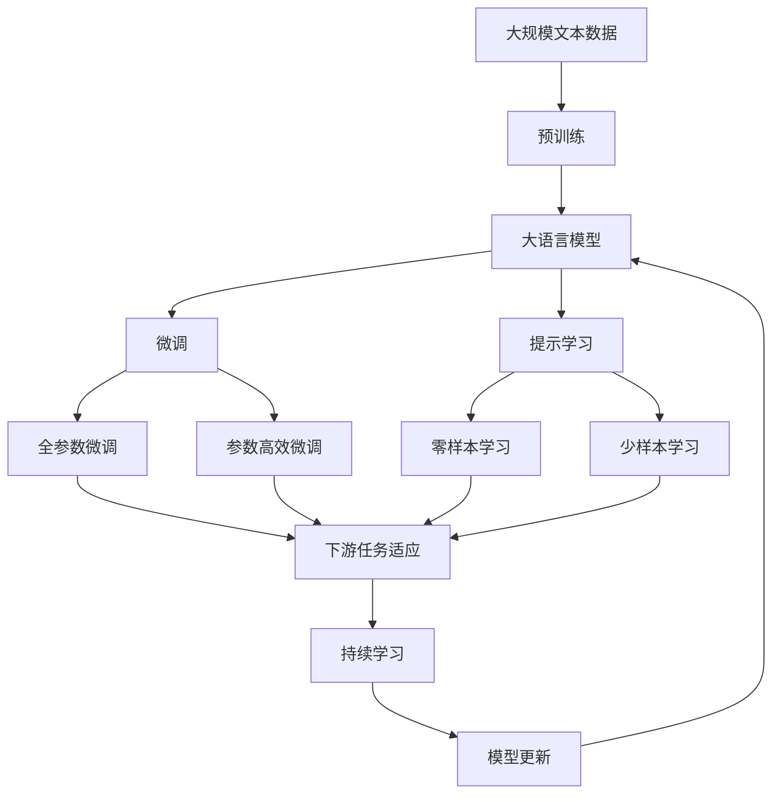

                 

# 认知的形式化：行为是认知的目的和外化表现

## 1. 背景介绍

### 1.1 问题由来

认知心理学（Cognitive Psychology）是一门研究人类心智（Mind）及其心理过程的科学。认知心理学的核心理论之一就是“行为是由认知过程所驱动的”。这也就是著名的“认知行为论”（Cognitive Behavior Theory），强调认知过程在行为中的决定作用。但是，直到最近几年，认知过程才真正被形式化，即通过数学和计算机算法来建模和模拟。

形式化认知（Formal Cognition）在人工智能和认知科学领域中成为了一个热门话题。形式化认知的目标是将认知过程转化为可计算的算法，从而使我们能够预测和解释人类行为。本文将探讨形式化认知的概念、方法和应用，并尝试说明行为是如何作为认知的目的和外化表现。

### 1.2 问题核心关键点

形式化认知的核心在于将认知过程抽象为计算过程。具体而言，我们可以从以下几个方面理解：

1. **认知过程的形式化**：将认知过程如感知、记忆、思维等抽象为计算过程，用数学和算法来建模。
2. **行为可计算性**：所有行为都可以在一个计算模型中得到解释，即“行为是可计算的”。
3. **可预测性**：一旦我们能够形式化认知过程，我们就可以预测个体或群体在不同情境下的行为反应。
4. **可解释性**：形式化认知提供了对行为背后的认知过程的解释，有助于理解个体差异和社会现象。

## 2. 核心概念与联系

### 2.1 核心概念概述

为了更好地理解形式化认知，我们首先需要明确一些关键概念：

- **认知过程（Cognitive Processes）**：人类心智中的基本心理过程，如感知、记忆、思维等。
- **计算过程（Computational Processes）**：可以被计算机算法模拟的计算过程。
- **行为（Behavior）**：个体或群体在特定情境下的响应和动作。
- **可计算行为（Computational Behavior）**：可以被形式化算法描述的行为，即行为是计算的产物。
- **认知模型（Cognitive Models）**：模拟认知过程的计算模型。

这些概念之间的关系可以用以下 Mermaid 流程图来展示：



从图中可以看到，认知过程通过计算过程转化为可计算行为，最终表现为个体或群体的行为，并被认知模型所模拟。

### 2.2 概念间的关系

这些核心概念之间存在着紧密的联系，形成了形式化认知的完整生态系统。下面我们通过几个 Mermaid 流程图来展示这些概念之间的关系。

#### 2.2.1 认知过程与计算过程的关系


这个流程图展示了认知过程和计算过程之间的关系。认知过程是计算过程的输入，计算过程则是将认知过程形式化为可计算的算法。

#### 2.2.2 行为与计算行为的关系


这个流程图展示了行为与可计算行为之间的关系。行为可以被形式化算法描述为可计算行为，从而被认知模型所模拟。

#### 2.2.3 认知模型与计算行为的关系


这个流程图展示了认知模型与可计算行为之间的关系。认知模型可以模拟可计算行为，从而预测个体或群体的行为。

### 2.3 核心概念的整体架构

最后，我们用一个综合的流程图来展示这些核心概念在大语言模型微调过程中的整体架构：



这个综合流程图展示了从预训练到微调，再到持续学习的完整过程。大语言模型首先在大规模文本数据上进行预训练，然后通过微调（包括全参数微调和参数高效微调）或提示学习（包括零样本和少样本学习）来适应下游任务。最后，通过持续学习技术，模型可以不断学习新知识，同时避免遗忘旧知识。

## 3. 核心算法原理 & 具体操作步骤

### 3.1 算法原理概述

形式化认知的核心算法原理是通过数学和计算机算法来模拟人类认知过程，并最终解释个体或群体的行为。这种算法的构建依赖于认知心理学和人工智能的交叉学科知识，需要结合心理学实验和机器学习技术。

形式化认知的算法构建通常包括以下几个步骤：

1. **认知过程建模**：将认知过程如感知、记忆、思维等抽象为计算过程，用数学和算法来建模。
2. **行为建模**：将行为建模为认知过程的输出，并通过计算过程进行解释。
3. **认知模型训练**：使用实证数据训练认知模型，使其能够预测和解释行为。

### 3.2 算法步骤详解

以下是一个形式化认知算法的详细步骤：

1. **数据收集与预处理**：收集有关个体或群体的行为数据，并进行预处理，如清洗、标注等。
2. **认知过程建模**：根据认知心理学理论，构建认知过程的计算模型。例如，使用神经网络模型模拟记忆过程。
3. **行为建模**：将行为建模为认知过程的输出，通过计算过程进行解释。例如，使用回归模型预测个体行为。
4. **认知模型训练**：使用实证数据训练认知模型，使其能够预测和解释行为。例如，使用监督学习算法训练回归模型。
5. **模型评估与优化**：评估模型的预测效果，并通过调参等方式优化模型。例如，使用交叉验证方法评估回归模型的性能。
6. **行为解释**：使用训练好的认知模型解释行为背后的认知过程。例如，使用回归模型解释个体行为的原因。

### 3.3 算法优缺点

形式化认知算法具有以下优点：

1. **可预测性**：一旦我们能够形式化认知过程，我们就可以预测个体或群体在不同情境下的行为反应。
2. **可解释性**：形式化认知提供了对行为背后的认知过程的解释，有助于理解个体差异和社会现象。
3. **计算高效性**：通过计算过程模拟认知过程，可以大大提高行为预测的效率和准确性。

同时，形式化认知算法也存在以下缺点：

1. **复杂性**：形式化认知算法需要构建复杂的计算模型，计算量较大。
2. **数据需求高**：需要大量高质量的数据进行模型训练，数据不足可能导致模型性能不佳。
3. **解释性不足**：形式化认知算法难以解释行为背后的认知过程，可能存在黑箱问题。

### 3.4 算法应用领域

形式化认知算法在多个领域都有广泛的应用，包括但不限于：

- **心理学**：用于解释个体行为，研究认知过程与行为的关系。
- **教育**：用于评估学习效果，指导个性化教学。
- **医疗**：用于预测疾病风险，指导个性化治疗。
- **行为经济学**：用于解释消费行为，研究决策过程。
- **人工智能**：用于理解自然语言，提升智能交互。
- **社交网络**：用于预测用户行为，优化社交推荐。

这些领域的应用展示了形式化认知的广泛性和实用性。

## 4. 数学模型和公式 & 详细讲解 & 举例说明

### 4.1 数学模型构建

形式化认知的数学模型通常包括以下几个部分：

1. **认知过程模型**：用于描述认知过程的计算模型，如神经网络、决策树等。
2. **行为模型**：用于描述行为与认知过程的关系，如回归模型、决策模型等。
3. **数据模型**：用于描述数据的统计特性，如概率分布、方差分析等。

### 4.2 公式推导过程

以下以回归模型为例，推导行为建模的数学公式。

假设我们有一个简单的回归模型：

$$
y = \theta_0 + \sum_{i=1}^p \theta_i x_i
$$

其中 $y$ 表示行为反应，$\theta$ 表示回归系数，$x_i$ 表示影响行为的因素。

我们定义 $X$ 为影响行为的自变量矩阵，$y$ 为行为反应向量，$\theta$ 为回归系数向量。则回归模型可以表示为：

$$
Y = X \theta + \epsilon
$$

其中 $Y$ 为行为反应矩阵，$\epsilon$ 为随机误差向量。

对于给定的数据集 $D = \{(X_i, Y_i)\}_{i=1}^n$，回归模型可以表示为：

$$
Y = X \theta + \epsilon
$$

最小二乘法（Ordinary Least Squares, OLS）的目标是最小化残差平方和：

$$
\min_{\theta} \sum_{i=1}^n (Y_i - X_i \theta)^2
$$

通过求解该优化问题，我们可以得到回归系数的估计值。

### 4.3 案例分析与讲解

假设我们有一个简单的数据集，用于预测学生的考试成绩。我们将学生的性别、年龄、父母教育水平等作为自变量，将考试成绩作为因变量。

首先，我们需要收集相关数据，并进行预处理。例如，对自变量进行标准化处理：

$$
\bar{x}_i = \frac{1}{n} \sum_{i=1}^n x_i
$$

$$
s_x = \sqrt{\frac{1}{n-1} \sum_{i=1}^n (x_i - \bar{x})^2}
$$

$$
z_i = \frac{x_i - \bar{x}}{s_x}
$$

然后，我们将标准化后的数据输入回归模型，计算回归系数：

$$
\hat{\theta} = (X^T X)^{-1} X^T Y
$$

最后，我们可以使用训练好的回归模型预测新学生的考试成绩。

## 5. 项目实践：代码实例和详细解释说明

### 5.1 开发环境搭建

在进行形式化认知实践前，我们需要准备好开发环境。以下是使用Python进行Scikit-learn开发的环境配置流程：

1. 安装Anaconda：从官网下载并安装Anaconda，用于创建独立的Python环境。

2. 创建并激活虚拟环境：
```bash
conda create -n sklearn-env python=3.8 
conda activate sklearn-env
```

3. 安装Scikit-learn：
```bash
pip install scikit-learn
```

4. 安装各类工具包：
```bash
pip install numpy pandas matplotlib seaborn scikit-learn jupyter notebook ipython
```

完成上述步骤后，即可在`sklearn-env`环境中开始形式化认知实践。

### 5.2 源代码详细实现

下面我们以线性回归模型为例，给出使用Scikit-learn库进行行为建模的Python代码实现。

首先，导入相关库：

```python
import numpy as np
from sklearn.linear_model import LinearRegression
from sklearn.metrics import mean_squared_error
```

然后，准备训练数据和标签：

```python
X_train = np.array([[1, 2], [2, 3], [3, 4]])
y_train = np.array([3, 5, 7])
```

接着，定义回归模型并进行训练：

```python
model = LinearRegression()
model.fit(X_train, y_train)
```

最后，在测试集上评估模型性能：

```python
X_test = np.array([[4, 5], [5, 6]])
y_test = np.array([9, 11])

y_pred = model.predict(X_test)
mse = mean_squared_error(y_test, y_pred)
print("MSE:", mse)
```

以上就是使用Scikit-learn库进行线性回归模型训练和评估的完整代码实现。

### 5.3 代码解读与分析

让我们再详细解读一下关键代码的实现细节：

**X_train和y_train**：
- `X_train`为训练数据的自变量矩阵，`y_train`为训练数据的因变量向量。
- 我们使用了两个样本作为训练数据，每个样本包含两个自变量和对应的因变量。

**LinearRegression**：
- `LinearRegression`是Scikit-learn库中的一个线性回归模型，用于拟合线性关系。

**fit方法**：
- `fit`方法用于训练模型，其输入为自变量矩阵`X_train`和因变量向量`y_train`。
- 通过最小二乘法拟合回归系数，得到训练好的模型。

**y_pred**：
- `y_pred`为模型在测试集上的预测结果。

**mean_squared_error**：
- `mean_squared_error`用于计算预测结果与真实标签之间的均方误差，即模型性能的指标。

## 6. 实际应用场景

### 6.1 智能推荐系统

形式化认知在智能推荐系统中有广泛应用。例如，我们可以使用回归模型来预测用户对不同物品的评分，从而进行个性化推荐。

具体而言，我们可以收集用户的历史评分数据，将其作为训练集，使用线性回归模型预测用户对新物品的评分。然后，根据评分的高低进行推荐排序。

### 6.2 医学预测

形式化认知在医学预测中也具有重要应用。例如，我们可以使用回归模型来预测患者对某种药物的反应，从而指导临床治疗。

具体而言，我们可以收集患者的基因信息、病史数据、生活方式等信息，将其作为自变量，使用线性回归模型预测患者对某种药物的反应。然后，根据预测结果进行个体化治疗。

### 6.3 教育评估

形式化认知在教育评估中也有广泛应用。例如，我们可以使用回归模型来评估学生的学习效果，从而指导个性化教学。

具体而言，我们可以收集学生的学习数据，将其作为自变量，使用回归模型预测学生的学习效果。然后，根据预测结果进行个性化教学，提升学习效果。

## 7. 工具和资源推荐

### 7.1 学习资源推荐

为了帮助开发者系统掌握形式化认知的理论基础和实践技巧，这里推荐一些优质的学习资源：

1. 《认知心理学导论》系列博文：由认知心理学专家撰写，深入浅出地介绍了认知心理学的基础理论和前沿研究。

2. 《机器学习》课程：斯坦福大学开设的机器学习课程，有Lecture视频和配套作业，带你入门机器学习领域的基本概念和经典模型。

3. 《认知计算：形式化认知与计算建模》书籍：系统介绍了认知心理学和计算机科学结合的认知计算方法，是形式化认知领域的经典教材。

4. Scikit-learn官方文档：Scikit-learn库的官方文档，提供了海量回归模型和完整的实践样例代码，是形式化认知实践的必备资料。

5. GitHub热门项目：在GitHub上Star、Fork数最多的回归模型相关项目，往往代表了该技术领域的发展趋势和最佳实践，值得去学习和贡献。

通过对这些资源的学习实践，相信你一定能够快速掌握形式化认知的精髓，并用于解决实际的NLP问题。

### 7.2 开发工具推荐

高效的开发离不开优秀的工具支持。以下是几款用于形式化认知开发的常用工具：

1. Python：Python是形式化认知开发的主流编程语言，其丰富的库和工具支持使开发变得高效便捷。

2. Scikit-learn：Scikit-learn是Python的一个机器学习库，提供了丰富的回归、分类、聚类等算法，适用于形式化认知模型的构建。

3. TensorFlow：TensorFlow是Google开源的深度学习框架，支持分布式计算和GPU加速，适合大规模模型训练和推理。

4. Weights & Biases：模型训练的实验跟踪工具，可以记录和可视化模型训练过程中的各项指标，方便对比和调优。与主流深度学习框架无缝集成。

5. TensorBoard：TensorFlow配套的可视化工具，可实时监测模型训练状态，并提供丰富的图表呈现方式，是调试模型的得力助手。

6. Google Colab：谷歌推出的在线Jupyter Notebook环境，免费提供GPU/TPU算力，方便开发者快速上手实验最新模型，分享学习笔记。

合理利用这些工具，可以显著提升形式化认知任务的开发效率，加快创新迭代的步伐。

### 7.3 相关论文推荐

形式化认知的发展源于学界的持续研究。以下是几篇奠基性的相关论文，推荐阅读：

1. Formal Cognition and Intelligent Systems: A Survey（形式化认知与智能系统综述）：对形式化认知领域的重要理论和应用进行了系统总结，适合入门学习。

2. A Formal Framework for Cognitive Models（认知模型形式化框架）：提出了一种基于符号计算的形式化认知框架，具有广泛的应用前景。

3. Cognitive Models for Smart Recommendation Systems（智能推荐系统的认知模型）：研究了认知模型在推荐系统中的应用，取得了显著的效果。

4. Neural Cognitive Models for Predictive Analytics（预测分析的神经认知模型）：提出了一种基于神经网络的认知模型，应用于医学预测和教育评估等任务，取得了较好的效果。

这些论文代表了形式化认知领域的研究进展，通过学习这些前沿成果，可以帮助研究者把握学科前进方向，激发更多的创新灵感。

除上述资源外，还有一些值得关注的前沿资源，帮助开发者紧跟形式化认知技术的最新进展，例如：

1. arXiv论文预印本：人工智能领域最新研究成果的发布平台，包括大量尚未发表的前沿工作，学习前沿技术的必读资源。

2. 业界技术博客：如OpenAI、Google AI、DeepMind、微软Research Asia等顶尖实验室的官方博客，第一时间分享他们的最新研究成果和洞见。

3. 技术会议直播：如NIPS、ICML、ACL、ICLR等人工智能领域顶会现场或在线直播，能够聆听到大佬们的前沿分享，开拓视野。

4. GitHub热门项目：在GitHub上Star、Fork数最多的回归模型相关项目，往往代表了该技术领域的发展趋势和最佳实践，值得去学习和贡献。

5. 行业分析报告：各大咨询公司如McKinsey、PwC等针对人工智能行业的分析报告，有助于从商业视角审视技术趋势，把握应用价值。

总之，对于形式化认知技术的学习和实践，需要开发者保持开放的心态和持续学习的意愿。多关注前沿资讯，多动手实践，多思考总结，必将收获满满的成长收益。

## 8. 总结：未来发展趋势与挑战

### 8.1 总结

本文对形式化认知的概念、方法和应用进行了全面系统的介绍。首先阐述了形式化认知的研究背景和意义，明确了形式化认知在行为预测和解释中的独特价值。其次，从原理到实践，详细讲解了形式化认知的数学原理和关键步骤，给出了形式化认知任务开发的完整代码实例。同时，本文还广泛探讨了形式化认知方法在智能推荐、医学预测、教育评估等多个领域的应用前景，展示了形式化认知的广阔前景。

通过本文的系统梳理，可以看到，形式化认知在人工智能和认知科学领域中的重要性日益凸显。它不仅能够提升行为预测的准确性，还能够解释行为背后的认知过程，具有广泛的应用价值。未来，随着认知心理学和人工智能的进一步融合，形式化认知将有更大的发展空间和潜力。

### 8.2 未来发展趋势

展望未来，形式化认知技术将呈现以下几个发展趋势：

1. **多模态融合**：将不同模态的数据（如文本、图像、语音等）进行融合，构建更全面、更准确的认知模型。
2. **深度学习**：将深度学习技术引入形式化认知，提升模型的性能和泛化能力。
3. **自动化建模**：开发更加自动化的建模工具，降低形式化认知的应用门槛，使其更易于普及。
4. **因果推断**：引入因果推断方法，更好地解释认知过程和行为之间的关系，增强模型的可解释性和可信度。
5. **可解释性增强**：通过可解释性方法，如LIME、SHAP等，增强形式化认知模型的解释性，使其更易于理解和调试。
6. **跨领域应用**：将形式化认知技术应用于更多领域，如交通、金融、司法等，提升这些领域的决策能力。

这些趋势将进一步拓展形式化认知的应用场景和深度，使其成为人工智能技术发展的重要组成部分。

### 8.3 面临的挑战

尽管形式化认知技术已经取得了显著进展，但在迈向更加智能化、普适化应用的过程中，它仍面临诸多挑战：

1. **数据需求高**：形式化认知模型的训练需要大量高质量的数据，数据获取和标注成本较高。
2. **模型复杂性**：形式化认知模型通常较为复杂，需要耗费大量时间和计算资源进行训练和优化。
3. **可解释性不足**：形式化认知模型的决策过程往往难以解释，存在一定的黑箱问题。
4. **鲁棒性不足**：模型可能对噪声和异常值敏感，需要进一步提升模型的鲁棒性和泛化能力。
5. **应用场景局限**：形式化认知模型的应用场景相对有限，需要更多的实践和探索。
6. **多模态融合挑战**：不同模态数据的融合存在技术难点，需要开发更加高效的融合方法。

这些挑战需要未来的研究在数据获取、模型设计、算法优化等方面进行更多探索和创新，才能使形式化认知技术更好地服务于人类社会。

### 8.4 研究展望

面对形式化认知技术面临的挑战，未来的研究需要在以下几个方面寻求新的突破：

1. **数据高效获取**：开发更加高效的数据获取和标注方法，降低形式化认知技术的应用门槛。
2. **模型优化**：开发更加高效、可解释的形式化认知模型，提升模型的性能和泛化能力。
3. **跨模态融合**：开发更加高效的跨模态数据融合方法，提升模型的多模态融合能力。
4. **因果推断**：引入因果推断方法，更好地解释认知过程和行为之间的关系，增强模型的可解释性和可信度。
5. **自动化建模**：开发更加自动化的建模工具，降低形式化认知的应用门槛，使其更易于普及。
6. **跨领域应用**：将形式化认知技术应用于更多领域，如交通、金融、司法等，提升这些领域的决策能力。

这些研究方向将进一步推动形式化认知技术的创新和发展，为人工智能技术的广泛应用提供坚实的理论基础和技术支持。

## 9. 附录：常见问题与解答

**Q1：形式化认知与传统认知心理学的关系是什么？**

A: 形式化认知是一种基于计算方法的理论，旨在通过数学和算法来模拟人类认知过程，从而解释和预测行为。传统认知心理学则主要依赖实验和理论分析，研究认知过程的机制和规律。尽管两者方法不同，但都是研究人类认知的科学，相辅相成，互为补充。

**Q2：如何评估形式化认知模型的性能？**

A: 形式化认知模型的性能评估通常使用以下几个指标：

1. **均方误差（MSE）**：用于评估回归模型的预测准确性，越小越好。
2. **R²系数**：用于评估回归模型的拟合程度，越接近1越好。
3. **交叉验证**：用于评估模型的泛化能力，通过将数据集分为训练集和验证集，评估模型在不同数据集上的表现。
4. **混淆矩阵**：用于评估分类模型的性能，如准确率、召回率、F1分数等。

**Q3：形式化认知在实际应用中需要注意哪些问题？**

A: 形式化认知在实际应用中需要注意以下几个问题：

1. **数据需求**：需要大量高质量的数据进行模型训练，数据获取和标注成本较高。
2. **模型复杂性**：形式化认知模型通常较为复杂，需要耗费大量时间和计算资源进行训练和优化。
3. **可解释性不足**：模型决策过程往往难以解释，存在一定的黑箱问题。
4. **鲁棒性不足**：模型可能对噪声和异常值敏感，需要进一步提升模型的鲁棒性和泛化能力。
5. **应用场景局限**：形式化认知模型的应用场景相对有限，需要更多的实践和探索。

**Q4：如何解释形式化认知模型的决策过程？**

A: 形式化认知模型的决策过程可以通过以下几种方式进行解释：

1. **特征重要性**：使用特征重要性方法，如LIME、SHAP等，分析模型对各个特征的依赖程度，解释模型决策的依据。
2. **可视化工具**：使用可视化工具，如TensorBoard、Weights & Biases等，可视化模型的训练和推理过程，解释模型的行为。
3. **知识图谱**：结合知识图谱等外部知识，解释模型决策的逻辑和因果关系，提升模型的可解释性和可信度。

**Q5：形式化认知在多模态数据融合中面临哪些技术挑战？**

A: 形式化认知在多模态数据融合中面临以下技术挑战：

1. **数据异构性**：不同模态的数据具有不同的格式和特征，需要进行统一的预处理和转换。
2. **融合方法**：开发高效、可解释的多模态融合方法，将不同模态的数据进行有效融合。
3. **模型训练**：多模态数据的融合需要进行联合训练，需要开发高效的联合训练算法。
4. **应用场景**：多模态数据的融合需要结合具体的应用场景，开发针对性的融合方法。

这些挑战需要未来的研究在数据预处理、模型设计、算法优化等方面进行更多探索和创新，才能使形式化认知技术更好地应用于多模

