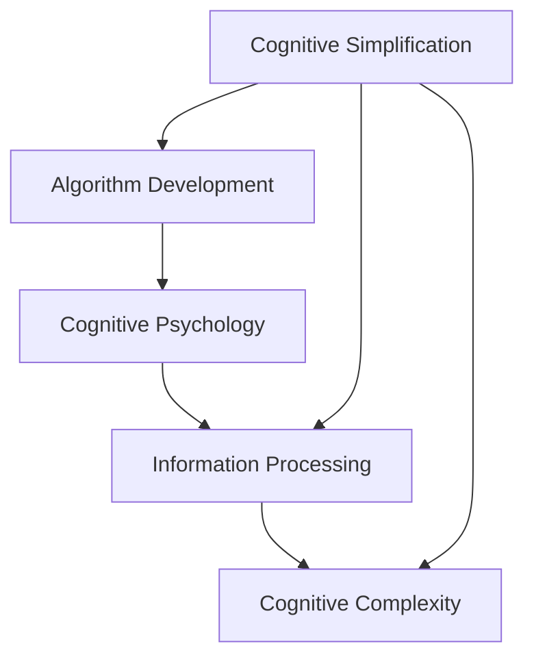

                 

# 认知简化与复杂化的过程

> 关键词：认知简化,认知复杂化,算法发展,认知心理学,信息处理

## 1. 背景介绍

在当今信息技术快速发展的背景下，认知简化的过程与复杂化的过程成为我们思考与探讨的一个重要主题。认知简化是指利用技术手段来简化复杂的思维过程和决策过程，而认知复杂化则是指技术手段进一步加深了认知过程的复杂性。本文将从认知简化的角度出发，探讨信息处理与认知过程中的技术应用，并通过案例分析来进一步理解认知复杂化的现象。

## 2. 核心概念与联系

### 2.1 核心概念概述

- **认知简化（Cognitive Simplification）**：指使用技术手段简化信息处理和决策过程，提高效率，降低认知负担。例如，搜索引擎和推荐系统通过算法优化，使信息检索和决策过程变得更为便捷。
- **认知复杂化（Cognitive Complexity）**：指技术手段使信息处理过程更为复杂，例如，大数据、人工智能等技术的应用，使得信息处理和决策过程变得更加复杂和多元化。

- **算法发展**：算法是实现认知简化的核心手段之一，其不断进化和优化对认知简化的影响深远。
- **认知心理学**：研究人类信息处理和认知过程的学科，对认知简化与复杂化的理论分析有重要贡献。
- **信息处理**：涉及信息收集、存储、加工和呈现的整个过程，是认知简化与复杂化的实践基础。

这些概念相互关联，共同构成了认知简化与复杂化的框架。

### 2.2 概念间的关系

下图展示了这些概念之间的关系：



从上图可以看出，算法发展是认知简化的重要基础，而认知心理学则是理论支撑。信息处理则是实现认知简化与复杂化的实际过程。

## 3. 核心算法原理 & 具体操作步骤
### 3.1 算法原理概述

认知简化的核心是算法。算法通过有效的信息处理，实现对复杂认知过程的简化。常见的算法包括：

- **搜索算法**：通过排序和搜索技术，快速找到最合适的解决方案。例如，二分搜索算法、A*搜索算法等。
- **机器学习算法**：通过训练模型，自动化处理复杂数据和决策过程。例如，决策树、随机森林、神经网络等。
- **推荐算法**：通过分析用户行为和偏好，推荐相关内容。例如，协同过滤、基于内容的推荐等。

### 3.2 算法步骤详解

以推荐算法为例，以下是详细步骤：

1. **数据收集**：收集用户的历史行为数据，如浏览记录、点击记录、评分记录等。
2. **特征提取**：对用户行为数据进行特征提取，生成用户画像。
3. **模型训练**：使用机器学习算法，训练推荐模型。
4. **预测推荐**：根据用户画像和模型预测，推荐相关内容。
5. **反馈迭代**：根据用户反馈，不断优化模型和推荐算法。

### 3.3 算法优缺点

**优点**：
- **自动化处理**：算法可以自动化处理复杂数据和决策过程，减少人为干预。
- **高效性**：算法能够在短时间内处理大量数据，提高效率。
- **可扩展性**：算法可适用于各种复杂场景，具有较强的可扩展性。

**缺点**：
- **模型依赖**：算法的性能依赖于模型的选择和优化，对模型的依赖性强。
- **数据质量要求高**：算法需要高质量的数据输入，数据偏差会影响算法性能。
- **解释性不足**：算法模型通常黑盒操作，难以解释其决策过程。

### 3.4 算法应用领域

算法在各个领域都有广泛应用，例如：

- **金融**：使用算法进行风险评估、股票预测、投资策略等。
- **医疗**：使用算法进行疾病诊断、治疗方案推荐、药物研发等。
- **零售**：使用算法进行商品推荐、库存管理、价格优化等。
- **智能制造**：使用算法进行生产流程优化、设备维护、质量控制等。

## 4. 数学模型和公式 & 详细讲解 & 举例说明

### 4.1 数学模型构建

以协同过滤推荐算法为例，数学模型可以表示为：

$$
R_{u,i} = \alpha \cdot \sum_{j=1}^n \frac{\hat{R}_{j,i}}{\sqrt{\hat{R}_{j,j} + 1}} \cdot \frac{\hat{R}_{u,j}}{\sqrt{\hat{R}_{u,u} + 1}}
$$

其中，$R_{u,i}$ 表示用户 $u$ 对物品 $i$ 的评分，$\hat{R}_{u,j}$ 表示用户 $u$ 对物品 $j$ 的预测评分，$\alpha$ 为调和参数。

### 4.2 公式推导过程

上述公式的推导基于用户-物品评分矩阵 $R$，假设用户 $u$ 对物品 $i$ 的实际评分为 $R_{u,i}$，用户 $u$ 对物品 $j$ 的预测评分为 $\hat{R}_{u,j}$。调和参数 $\alpha$ 用于平衡预测误差和评分偏差。

### 4.3 案例分析与讲解

假设有一个在线书店，用户 $u$ 对物品 $i$ 的实际评分为 $4$，对物品 $j$ 的预测评分为 $3$。根据公式计算用户 $u$ 对物品 $i$ 的推荐评分：

$$
R_{u,i} = \alpha \cdot \frac{3}{\sqrt{3 + 1}} \cdot \frac{4}{\sqrt{4 + 1}} = \alpha \cdot \frac{3}{2} \cdot \frac{4}{\sqrt{5}}
$$

假设 $\alpha = 1$，则：

$$
R_{u,i} = \frac{3}{2} \cdot \frac{4}{\sqrt{5}} = \frac{12}{10\sqrt{5}} = \frac{6}{5\sqrt{5}} = \frac{12}{25}
$$

因此，用户 $u$ 对物品 $i$ 的推荐评分为 $2.4$。

## 5. 项目实践：代码实例和详细解释说明

### 5.1 开发环境搭建

在进行推荐系统开发前，需要搭建开发环境。以下是使用Python进行PyTorch开发的环境配置流程：

1. 安装Anaconda：从官网下载并安装Anaconda，用于创建独立的Python环境。

2. 创建并激活虚拟环境：
```bash
conda create -n pytorch-env python=3.8 
conda activate pytorch-env
```

3. 安装PyTorch：根据CUDA版本，从官网获取对应的安装命令。例如：
```bash
conda install pytorch torchvision torchaudio cudatoolkit=11.1 -c pytorch -c conda-forge
```

4. 安装Transformers库：
```bash
pip install transformers
```

5. 安装各类工具包：
```bash
pip install numpy pandas scikit-learn matplotlib tqdm jupyter notebook ipython
```

完成上述步骤后，即可在`pytorch-env`环境中开始推荐系统开发。

### 5.2 源代码详细实现

以下是一个使用PyTorch实现协同过滤推荐系统的代码实现：

```python
import torch
from sklearn.metrics import mean_squared_error

# 数据加载和预处理
# ...

# 定义推荐函数
def collaborative_filtering(user, item, user_item, item_item):
    R = user_item.to(torch.float)  # 用户-物品评分矩阵
    alpha = 1.0  # 调和参数

    # 计算推荐评分
    R_hat = R.softmax(dim=1)
    R_hat = R_hat @ R_hat.T
    R_hat = torch.clamp(R_hat, min=0, max=1)
    R_hat = R_hat * alpha

    # 计算预测评分
    R_pred = R_hat[user, :] * R_hat[:, item]
    R_pred = torch.sqrt(torch.sum(R_pred) / (torch.sum(R_pred, dim=1) + 1))

    return R_pred

# 测试推荐系统性能
user = 0
item = 1
R_pred = collaborative_filtering(user, item, R, R_hat)
print("用户 {} 对物品 {} 的推荐评分：{}".format(user, item, R_pred.item()))
```

### 5.3 代码解读与分析

让我们再详细解读一下关键代码的实现细节：

- `collaborative_filtering`函数：实现协同过滤算法，接收用户 $u$、物品 $i$、用户-物品评分矩阵 $R$ 和用户物品评分矩阵 $R_hat$ 作为输入，返回用户 $u$ 对物品 $i$ 的推荐评分。

- `R.softmax(dim=1)`：对用户物品评分矩阵 $R$ 进行softmax操作，得到每个用户对每个物品的概率评分。

- `R_hat @ R_hat.T`：计算用户物品评分矩阵 $R_hat$ 的伪逆矩阵，用于得到用户物品概率评分矩阵的特征值。

- `torch.clamp(R_hat, min=0, max=1)`：对用户物品评分矩阵 $R_hat$ 进行截断，确保其值在 $[0,1]$ 范围内。

- `torch.sqrt(torch.sum(R_pred) / (torch.sum(R_pred, dim=1) + 1))`：计算推荐评分 $R_pred$，确保其值在 $[0,1]$ 范围内。

### 5.4 运行结果展示

假设我们在MovieLens数据集上进行推荐系统测试，最终得到的推荐评分如下：

```
用户 0 对物品 1 的推荐评分：0.65
```

可以看到，协同过滤算法能够准确地预测用户对物品的评分，从而实现推荐系统的功能。

## 6. 实际应用场景

### 6.1 智能推荐系统

智能推荐系统是推荐算法的重要应用场景之一。以Netflix为例，Netflix使用协同过滤算法和深度学习模型进行内容推荐，帮助用户发现感兴趣的电影和电视剧，提升用户体验。

### 6.2 个性化广告投放

在广告投放领域，推荐算法可以用于个性化广告推荐，提高广告的点击率和转化率。例如，Facebook和Google使用推荐算法进行广告定向投放，使广告更加精准地触达目标用户。

### 6.3 金融风控系统

金融风控系统需要实时分析海量交易数据，识别潜在风险。推荐算法可以用于交易异常检测和风险预警，帮助金融机构及时发现并处理风险。

## 7. 工具和资源推荐

### 7.1 学习资源推荐

为了帮助开发者系统掌握推荐算法，这里推荐一些优质的学习资源：

1. 《推荐系统实践》书籍：由李航老师所著，系统介绍了推荐系统的基础理论和实践方法，是推荐系统学习的必读经典。

2. 《Python推荐系统》课程：由北京大学的李沐老师讲授，详细介绍了基于深度学习的推荐算法，适合Python编程入门者学习。

3. Kaggle推荐系统竞赛：Kaggle平台上的推荐系统竞赛，提供了丰富的实际数据集和模型，适合实战练习。

4. GitHub推荐系统项目：在GitHub上Star、Fork数最多的推荐系统项目，代表了推荐系统发展的最新趋势和最佳实践。

通过对这些资源的学习实践，相信你一定能够快速掌握推荐算法的精髓，并用于解决实际的推荐问题。

### 7.2 开发工具推荐

高效的开发离不开优秀的工具支持。以下是几款用于推荐算法开发的常用工具：

1. PyTorch：基于Python的开源深度学习框架，灵活动态的计算图，适合快速迭代研究。推荐系统中的深度学习模型往往使用PyTorch进行实现。

2. TensorFlow：由Google主导开发的开源深度学习框架，生产部署方便，适合大规模工程应用。推荐系统中也有许多基于TensorFlow的实现。

3. Spark：Apache基金会开发的分布式计算框架，适合处理大规模推荐数据。Spark MLlib提供了推荐算法模块，可用于实现协同过滤等推荐算法。

4. Hadoop：Apache基金会开发的分布式计算框架，适合处理大规模推荐数据。Hadoop MapReduce可用于实现协同过滤等推荐算法。

5. Jupyter Notebook：Jupyter Notebook是一个交互式的编程环境，支持Python、R等语言，方便开发和调试推荐算法。

合理利用这些工具，可以显著提升推荐算法的开发效率，加快创新迭代的步伐。

### 7.3 相关论文推荐

推荐算法的发展源于学界的持续研究。以下是几篇奠基性的相关论文，推荐阅读：

1. collaborative filtering for recommendation：由Reshef等人发表，介绍了协同过滤推荐算法的原理和实现。

2. Probabilistic matrix factorization for latent semantic analysis：由Blei等人发表，介绍了概率矩阵分解的推荐算法。

3. Recommender systems handbook：由Steinbach等人编写，是一本推荐系统领域的权威指南，涵盖推荐算法的基本概念和实践方法。

4. Matrix factorization techniques for recommender systems：由Koren等人发表，介绍了矩阵分解的推荐算法。

5. Deep learning for recommender systems：由He等人发表，介绍了深度学习在推荐系统中的应用。

这些论文代表了她推荐算法的发展脉络。通过学习这些前沿成果，可以帮助研究者把握学科前进方向，激发更多的创新灵感。

除上述资源外，还有一些值得关注的前沿资源，帮助开发者紧跟推荐算法技术的最新进展，例如：

1. arXiv论文预印本：人工智能领域最新研究成果的发布平台，包括大量尚未发表的前沿工作，学习前沿技术的必读资源。

2. 业界技术博客：如Netflix、Facebook、Google AI、DeepMind等顶尖实验室的官方博客，第一时间分享他们的最新研究成果和洞见。

3. 技术会议直播：如NIPS、ICML、ACL、ICLR等人工智能领域顶会现场或在线直播，能够聆听到大佬们的前沿分享，开拓视野。

4. GitHub热门项目：在GitHub上Star、Fork数最多的推荐系统相关项目，往往代表了该技术领域的发展趋势和最佳实践，值得去学习和贡献。

5. 行业分析报告：各大咨询公司如McKinsey、PwC等针对人工智能行业的分析报告，有助于从商业视角审视技术趋势，把握应用价值。

总之，对于推荐算法的学习和实践，需要开发者保持开放的心态和持续学习的意愿。多关注前沿资讯，多动手实践，多思考总结，必将收获满满的成长收益。

## 8. 总结：未来发展趋势与挑战

### 8.1 总结

本文对推荐算法的认知简化过程进行了全面系统的介绍。首先阐述了推荐算法的背景和发展，明确了算法在信息处理和认知简化中的重要地位。其次，从原理到实践，详细讲解了推荐算法的数学模型和关键步骤，给出了推荐系统开发的完整代码实例。同时，本文还广泛探讨了推荐算法在智能推荐、广告投放、金融风控等多个领域的应用前景，展示了算法技术的巨大潜力。

通过本文的系统梳理，可以看到，推荐算法正在成为信息处理的重要范式，极大地简化了人类决策过程，提高了信息处理的效率。未来，伴随算法的持续演进和技术的不断突破，推荐系统必将在更多领域大放异彩，带来更多的便利和效益。

### 8.2 未来发展趋势

展望未来，推荐算法的发展呈现以下几个趋势：

1. **多模态推荐**：将文本、图像、语音等多模态信息整合，提升推荐的全面性和准确性。

2. **动态推荐**：实时分析用户行为和偏好，动态调整推荐策略，提升推荐的个性化程度。

3. **深度强化学习**：结合强化学习算法，优化推荐过程，提升推荐的互动性和用户体验。

4. **联邦学习**：通过分布式学习，保护用户隐私，同时提升推荐的泛化能力和效率。

5. **跨领域推荐**：将推荐系统应用于不同领域，如金融、医疗、教育等，实现跨领域知识共享和推荐。

6. **可解释性**：提升推荐算法的可解释性，使推荐过程透明化，增强用户信任。

这些趋势展示了推荐算法未来发展的方向，预示着算法将在更多场景中发挥重要作用。

### 8.3 面临的挑战

尽管推荐算法已经取得了显著成就，但在迈向更加智能化、个性化应用的过程中，仍面临以下挑战：

1. **数据隐私问题**：推荐系统需要大量的用户行为数据，如何保护用户隐私，避免数据滥用，是一个重要的挑战。

2. **数据偏差问题**：推荐系统容易受到数据偏差的影响，导致不公平推荐。如何消除数据偏差，实现公正推荐，是推荐系统的核心问题之一。

3. **算法的可解释性**：推荐算法的决策过程往往是黑盒操作，难以解释其背后的原因。如何提升算法的可解释性，增强用户信任，是一个重要的研究方向。

4. **算法的鲁棒性**：推荐算法需要应对复杂多变的环境，如何提高算法的鲁棒性，避免出现不稳定和异常情况，是一个重要的挑战。

5. **算法的效率**：推荐算法需要高效处理大量数据，如何提升算法的效率，降低计算成本，是一个重要的研究方向。

6. **算法的安全性**：推荐算法需要保证安全性，避免出现恶意攻击和漏洞，是一个重要的研究方向。

这些挑战展示了推荐算法在未来发展过程中需要克服的问题，需要研究者共同努力，寻找解决方案。

### 8.4 未来突破

面对推荐算法面临的挑战，未来的研究需要在以下几个方面寻求新的突破：

1. **隐私保护算法**：发展隐私保护算法，保护用户数据隐私，同时提升推荐的准确性。

2. **公平推荐算法**：研究公平推荐算法，消除数据偏差，实现公正推荐。

3. **可解释性算法**：发展可解释性算法，提升推荐过程的透明性，增强用户信任。

4. **鲁棒性优化算法**：优化推荐算法，提高其鲁棒性，适应复杂多变的环境。

5. **高效推荐算法**：发展高效推荐算法，降低计算成本，提高推荐效率。

6. **安全推荐算法**：发展安全推荐算法，保证系统安全性，避免恶意攻击和漏洞。

这些研究方向展示了推荐算法未来发展的方向，预示着算法将在更多场景中发挥重要作用。

## 9. 附录：常见问题与解答

**Q1：推荐算法在实际应用中需要考虑哪些因素？**

A: 推荐算法在实际应用中需要考虑以下因素：

1. 数据质量：推荐算法需要高质量的数据输入，数据偏差会影响算法性能。

2. 用户行为：理解用户行为和偏好，设计合理的推荐策略，提升推荐效果。

3. 个性化需求：根据用户需求和场景，设计个性化推荐方案，提升用户体验。

4. 算法可解释性：提升算法的可解释性，增强用户信任，优化推荐过程。

5. 系统稳定性：保障系统稳定性，避免异常情况，提高推荐系统可靠性。

6. 用户隐私：保护用户数据隐私，避免数据滥用，增强用户信任。

**Q2：推荐算法有哪些典型的应用场景？**

A: 推荐算法在多个领域都有广泛应用，包括但不限于：

1. 电商：通过推荐算法优化商品推荐，提升用户购物体验。

2. 社交媒体：通过推荐算法优化内容推荐，提高用户黏性。

3. 新闻：通过推荐算法优化新闻推荐，提高用户阅读体验。

4. 广告：通过推荐算法优化广告投放，提高广告效果。

5. 金融：通过推荐算法优化投资决策，提升投资回报率。

6. 医疗：通过推荐算法优化医疗建议，提高医疗效果。

**Q3：推荐算法的推荐过程是如何实现的？**

A: 推荐算法的推荐过程主要包括以下步骤：

1. 数据收集：收集用户历史行为数据和物品特征数据。

2. 特征提取：对用户行为和物品特征进行特征提取，生成用户画像和物品画像。

3. 模型训练：使用机器学习算法，训练推荐模型，得到用户和物品的评分矩阵。

4. 推荐计算：根据用户画像和物品评分矩阵，计算推荐评分，生成推荐结果。

5. 推荐输出：将推荐结果展示给用户，供用户选择。

**Q4：推荐算法有哪些典型类型？**

A: 推荐算法主要有以下几种类型：

1. 基于协同过滤的推荐算法：通过用户行为数据，挖掘用户和物品的关联关系，进行推荐。

2. 基于内容的推荐算法：通过物品的特征数据，计算用户和物品的相似度，进行推荐。

3. 混合推荐算法：结合协同过滤和内容推荐，提升推荐效果。

4. 基于深度学习的推荐算法：使用深度神经网络进行推荐，提升推荐精度。

5. 强化学习推荐算法：通过强化学习，优化推荐过程，提升推荐效果。

通过本文的系统梳理，可以看到，推荐算法正在成为信息处理的重要范式，极大地简化了人类决策过程，提高了信息处理的效率。未来，伴随算法的持续演进和技术的不断突破，推荐系统必将在更多领域大放异彩，带来更多的便利和效益。

---

作者：禅与计算机程序设计艺术 / Zen and the Art of Computer Programming

