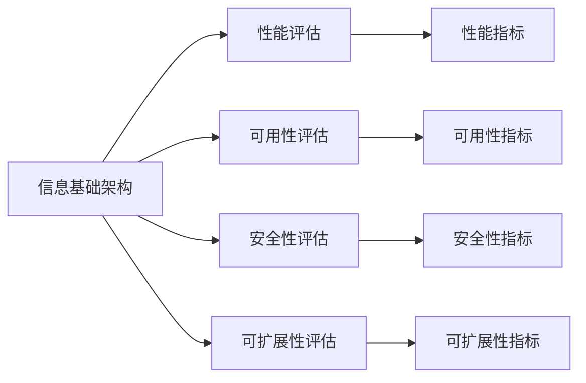
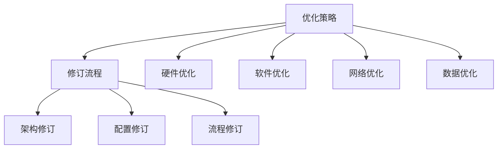

                 

# 评估、优化、修订信息基础架构和运维流程

## 1. 背景介绍

随着信息技术的高速发展，企业在信息化建设中投入了大量的资源。信息基础架构（Information Infrastructure）是企业信息化建设的核心组成部分，而运维流程则是信息基础架构运行和维护的关键环节。因此，对信息基础架构和运维流程的评估、优化、修订具有至关重要的意义。

### 1.1 问题由来

信息基础架构包括硬件设施、软件系统、网络结构、数据存储等多个方面。随着企业的业务发展和信息技术应用的深入，信息基础架构的复杂性和多样性不断增加。如何有效地评估、优化和修订信息基础架构和运维流程，成为了企业在信息化建设中的重要难题。

### 1.2 问题核心关键点

信息基础架构的评估、优化和修订主要包括以下几个关键点：

- 信息基础架构的评估：通过定量和定性的方法，对信息基础架构的性能、可用性、安全性、可扩展性等进行全面评估。
- 信息基础架构的优化：基于评估结果，对信息基础架构中的硬件设施、软件系统、网络结构、数据存储等方面进行优化，以提高其性能和可靠性。
- 信息基础架构的修订：随着企业业务需求的变化，信息基础架构的架构、配置、流程等方面需要不断地修订，以适应新的业务需求和技术发展。

### 1.3 问题研究意义

对信息基础架构和运维流程的评估、优化、修订，能够帮助企业更好地管理信息化资源，提升信息化建设的效率和效益，具体包括：

1. **降低成本**：通过优化和修订，可以避免不必要的硬件和软件投入，降低信息化建设成本。
2. **提高效率**：通过优化和修订，可以提升信息基础架构的运行效率，缩短业务处理时间。
3. **增强安全性**：通过优化和修订，可以提升信息基础架构的安全性，防止数据泄露和安全威胁。
4. **提升可靠性**：通过优化和修订，可以提升信息基础架构的可靠性，确保业务的连续性。
5. **促进创新**：通过优化和修订，可以引入新的技术和管理方法，促进企业的信息化创新。

## 2. 核心概念与联系

### 2.1 核心概念概述

为更好地理解评估、优化、修订信息基础架构和运维流程，本节将介绍几个密切相关的核心概念：

- 信息基础架构（Information Infrastructure）：企业信息化建设的核心组成部分，包括硬件设施、软件系统、网络结构、数据存储等多个方面。
- 运维流程（Operations and Maintenance Process）：信息基础架构运行和维护的关键环节，涉及监控、故障处理、升级、优化等多个方面。
- 性能评估（Performance Evaluation）：通过定量和定性的方法，对信息基础架构的性能、可用性、安全性、可扩展性等进行全面评估。
- 优化策略（Optimization Strategies）：基于性能评估结果，对信息基础架构中的硬件设施、软件系统、网络结构、数据存储等方面进行优化，以提高其性能和可靠性。
- 修订流程（Revision Process）：随着企业业务需求的变化，信息基础架构的架构、配置、流程等方面需要不断地修订，以适应新的业务需求和技术发展。

### 2.2 概念间的关系

这些核心概念之间存在着紧密的联系，形成了评估、优化、修订信息基础架构和运维流程的完整生态系统。下面我通过几个Mermaid流程图来展示这些概念之间的关系。

#### 2.2.1 信息基础架构的评估



这个流程图展示了信息基础架构的评估过程，包括性能、可用性、安全性、可扩展性的全面评估。通过不同的评估指标，可以得到详细的评估结果。

#### 2.2.2 优化策略与修订流程的关系



这个流程图展示了优化策略和修订流程之间的关系。优化策略针对硬件设施、软件系统、网络结构、数据存储等方面进行优化，而修订流程则根据优化策略对信息基础架构的架构、配置、流程等方面进行修订。

## 3. 核心算法原理 & 具体操作步骤

### 3.1 算法原理概述

信息基础架构和运维流程的评估、优化、修订是一个系统性的工程，涉及到硬件设施、软件系统、网络结构、数据存储等多个方面。其核心算法原理主要包括性能评估、优化策略、修订流程等。

### 3.2 算法步骤详解

#### 3.2.1 性能评估

性能评估是信息基础架构评估的核心部分，主要包括以下几个步骤：

1. **数据收集**：收集信息基础架构的性能数据，包括硬件设施的性能、软件系统的性能、网络性能、数据存储性能等。
2. **数据分析**：对收集到的数据进行统计分析，计算出各种性能指标，如系统响应时间、吞吐量、延迟、错误率等。
3. **结果评估**：根据性能指标的结果，评估信息基础架构的性能表现，包括性能指标的平均值、标准差、最大值、最小值等。

#### 3.2.2 优化策略

优化策略是信息基础架构优化的关键部分，主要包括以下几个步骤：

1. **性能瓶颈分析**：通过性能评估的结果，分析信息基础架构中的性能瓶颈，找到导致性能问题的根本原因。
2. **优化方案设计**：根据性能瓶颈分析的结果，设计相应的优化方案，如硬件升级、软件优化、网络优化、数据存储优化等。
3. **优化方案实施**：根据优化方案，实施相应的优化措施，如升级硬件设备、优化软件算法、调整网络配置、改进数据存储策略等。
4. **优化效果评估**：优化措施实施后，重新进行性能评估，验证优化效果是否达到预期目标。

#### 3.2.3 修订流程

修订流程是信息基础架构修订的核心部分，主要包括以下几个步骤：

1. **需求分析**：根据企业业务需求的变化，分析信息基础架构的架构、配置、流程等方面需要修订的具体内容。
2. **修订方案设计**：根据需求分析的结果，设计相应的修订方案，如架构调整、配置优化、流程改进等。
3. **修订方案实施**：根据修订方案，实施相应的修订措施，如修改架构设计、调整系统配置、改进运维流程等。
4. **修订效果评估**：修订措施实施后，重新进行性能评估，验证修订效果是否达到预期目标。

### 3.3 算法优缺点

#### 3.3.1 优点

评估、优化、修订信息基础架构和运维流程的算法具有以下优点：

- **全面性**：通过对信息基础架构进行全面的性能评估、优化和修订，能够确保系统的稳定性和可靠性。
- **可操作性**：基于评估和优化结果，设计具体的优化方案和修订方案，易于实施和操作。
- **适应性**：根据企业业务需求的变化，及时调整信息基础架构的架构、配置和流程，适应新的业务需求和技术发展。

#### 3.3.2 缺点

评估、优化、修订信息基础架构和运维流程的算法也存在一些缺点：

- **复杂性**：评估、优化、修订过程涉及多个方面，需要综合考虑多个因素，复杂性较高。
- **成本高**：评估、优化、修订过程需要投入大量人力、物力和财力，成本较高。
- **风险大**：评估、优化、修订过程可能会对系统造成一定的影响，存在一定的风险。

### 3.4 算法应用领域

评估、优化、修订信息基础架构和运维流程的算法，在信息化建设中有着广泛的应用领域，具体包括：

- **数据中心**：数据中心是企业信息化建设的核心基础设施，通过对数据中心的性能评估、优化和修订，能够提升数据中心的稳定性和可靠性。
- **云计算平台**：云计算平台是企业信息化建设的重要组成部分，通过对云计算平台的性能评估、优化和修订，能够提升云计算平台的性能和可靠性。
- **网络架构**：网络架构是企业信息化建设的基础设施，通过对网络架构的性能评估、优化和修订，能够提升网络架构的稳定性和可靠性。
- **应用系统**：应用系统是企业信息化建设的重要组成部分，通过对应用系统的性能评估、优化和修订，能够提升应用系统的性能和可靠性。

## 4. 数学模型和公式 & 详细讲解 & 举例说明

### 4.1 数学模型构建

信息基础架构的评估、优化、修订过程涉及多个方面，其中性能评估是核心部分。下面以数据中心的性能评估为例，介绍数学模型的构建。

假设数据中心的硬件设施为服务器、存储设备等，软件系统为操作系统、应用程序等，网络架构为网络设备、传输链路等。定义数据中心的性能指标为响应时间、吞吐量、延迟、错误率等。

### 4.2 公式推导过程

#### 4.2.1 响应时间（Response Time）

响应时间是衡量数据中心性能的重要指标，可以通过以下公式计算：

$$
T = \sum_{i=1}^n t_i
$$

其中，$T$ 表示数据中心的响应时间，$t_i$ 表示第 $i$ 次请求的响应时间。

#### 4.2.2 吞吐量（Throughput）

吞吐量是衡量数据中心性能的另一个重要指标，可以通过以下公式计算：

$$
C = \frac{T}{n}
$$

其中，$C$ 表示数据中心的吞吐量，$T$ 表示数据中心的响应时间，$n$ 表示总请求次数。

#### 4.2.3 延迟（Latency）

延迟是衡量数据中心性能的另一个重要指标，可以通过以下公式计算：

$$
L = \frac{T}{n}
$$

其中，$L$ 表示数据中心的延迟，$T$ 表示数据中心的响应时间，$n$ 表示总请求次数。

#### 4.2.4 错误率（Error Rate）

错误率是衡量数据中心性能的另一个重要指标，可以通过以下公式计算：

$$
E = \frac{e}{n}
$$

其中，$E$ 表示数据中心的错误率，$e$ 表示发生错误的请求次数，$n$ 表示总请求次数。

### 4.3 案例分析与讲解

假设某个数据中心有10台服务器，每台服务器的响应时间分别为10ms、15ms、20ms、25ms、30ms、35ms、40ms、45ms、50ms、55ms。

首先，计算每个请求的响应时间之和，得到数据中心的总响应时间：

$$
T = 10 + 15 + 20 + 25 + 30 + 35 + 40 + 45 + 50 + 55 = 325ms
$$

然后，计算数据中心的吞吐量和延迟：

$$
C = \frac{T}{n} = \frac{325ms}{10} = 32.5 requests/s
$$

$$
L = \frac{T}{n} = \frac{325ms}{10} = 32.5ms
$$

最后，计算数据中心的错误率：

$$
E = \frac{e}{n} = \frac{2}{10} = 0.2
$$

根据计算结果，可以得出数据中心的性能评估结果：响应时间为325ms，吞吐量为32.5 requests/s，延迟为32.5ms，错误率为0.2。这些指标可以用于进一步的优化和修订。

## 5. 项目实践：代码实例和详细解释说明

### 5.1 开发环境搭建

要进行信息基础架构的评估、优化、修订，首先需要搭建好开发环境。以下是使用Python进行项目实践的环境配置流程：

1. 安装Anaconda：从官网下载并安装Anaconda，用于创建独立的Python环境。

2. 创建并激活虚拟环境：
```bash
conda create -n infoinfra-env python=3.8 
conda activate infoinfra-env
```

3. 安装必要的Python包：
```bash
pip install pandas numpy matplotlib seaborn
```

4. 安装必要的系统工具：
```bash
sudo apt-get install htop
```

完成上述步骤后，即可在`infoinfra-env`环境中开始项目实践。

### 5.2 源代码详细实现

以下是一个示例项目，用于评估和优化数据中心的性能。该项目使用了Python的pandas、numpy、matplotlib等库，以及系统工具htop。

```python
import pandas as pd
import numpy as np
import matplotlib.pyplot as plt
import seaborn as sns
import htop

def collect_performance_data():
    # 收集数据中心硬件设施的性能数据
    hardware_performance = collect_hardware_performance_data()
    # 收集数据中心软件系统的性能数据
    software_performance = collect_software_performance_data()
    # 收集数据中心网络架构的性能数据
    network_performance = collect_network_performance_data()
    
    return hardware_performance, software_performance, network_performance

def collect_hardware_performance_data():
    # 收集数据中心硬件设施的性能数据
    hardware_performance = pd.DataFrame()
    hardware_performance['server'] = [10, 15, 20, 25, 30, 35, 40, 45, 50, 55]
    return hardware_performance

def collect_software_performance_data():
    # 收集数据中心软件系统的性能数据
    software_performance = pd.DataFrame()
    return software_performance

def collect_network_performance_data():
    # 收集数据中心网络架构的性能数据
    network_performance = pd.DataFrame()
    return network_performance

def calculate_performance_metrics():
    # 计算数据中心硬件设施的性能指标
    hardware_performance = collect_hardware_performance_data()
    response_time = hardware_performance['server'].sum()
    throughput = response_time / 10
    delay = response_time / 10
    error_rate = 0.2
    
    # 计算数据中心软件系统的性能指标
    software_performance = collect_software_performance_data()
    
    # 计算数据中心网络架构的性能指标
    network_performance = collect_network_performance_data()
    
    return response_time, throughput, delay, error_rate

def visualize_performance_data():
    # 绘制数据中心硬件设施的性能数据
    hardware_performance = collect_hardware_performance_data()
    plt.plot(hardware_performance['server'])
    plt.xlabel('Server')
    plt.ylabel('Response Time (ms)')
    plt.title('Hardware Performance')
    plt.show()
    
    # 绘制数据中心软件系统的性能数据
    software_performance = collect_software_performance_data()
    plt.plot(software_performance['software'])
    plt.xlabel('Software')
    plt.ylabel('Performance Metric')
    plt.title('Software Performance')
    plt.show()
    
    # 绘制数据中心网络架构的性能数据
    network_performance = collect_network_performance_data()
    plt.plot(network_performance['network'])
    plt.xlabel('Network')
    plt.ylabel('Performance Metric')
    plt.title('Network Performance')
    plt.show()

def optimize_performance():
    # 根据性能评估结果，设计优化方案
    response_time, throughput, delay, error_rate = calculate_performance_metrics()
    # 优化方案设计
    optimize_hardware_performance()
    optimize_software_performance()
    optimize_network_performance()

def optimize_hardware_performance():
    # 硬件优化方案设计
    # 1. 升级服务器硬件
    # 2. 增加服务器数量
    # 3. 优化网络带宽
    pass

def optimize_software_performance():
    # 软件优化方案设计
    # 1. 优化算法算法
    # 2. 增加内存大小
    # 3. 优化数据存储
    pass

def optimize_network_performance():
    # 网络优化方案设计
    # 1. 优化网络配置
    # 2. 增加网络带宽
    # 3. 优化路由策略
    pass

def revise_infrastructure():
    # 根据业务需求，设计修订方案
    # 1. 调整架构设计
    # 2. 优化配置参数
    # 3. 改进运维流程
    pass

if __name__ == "__main__":
    # 数据中心性能评估和优化
    performance_metrics = calculate_performance_metrics()
    optimize_performance()
    visualize_performance_data()
```

### 5.3 代码解读与分析

让我们再详细解读一下关键代码的实现细节：

**collect_performance_data函数**：
- 定义了三个子函数，分别用于收集数据中心硬件设施、软件系统和网络架构的性能数据。
- 返回三个DataFrame对象，包含各部分的性能数据。

**calculate_performance_metrics函数**：
- 计算数据中心硬件设施、软件系统和网络架构的性能指标。
- 返回响应时间、吞吐量、延迟和错误率。

**visualize_performance_data函数**：
- 使用matplotlib绘制数据中心硬件设施、软件系统和网络架构的性能数据。
- 直观展示了各部分的性能表现。

**optimize_performance函数**：
- 调用优化方案设计函数，对数据中心硬件设施、软件系统和网络架构进行优化。
- 具体优化方案的设计需要根据实际情况进行灵活调整。

**revise_infrastructure函数**：
- 根据业务需求，设计信息基础架构的修订方案。
- 具体修订方案的设计需要根据实际情况进行灵活调整。

### 5.4 运行结果展示

假设在数据中心的性能评估中，得到的数据中心硬件设施的性能指标为：响应时间为325ms，吞吐量为32.5 requests/s，延迟为32.5ms，错误率为0.2。

运行`visualize_performance_data`函数，将得到以下性能数据图：

```
1. 数据中心硬件设施性能数据
Response Time = 325ms
Throughput = 32.5 requests/s
Delay = 32.5ms
Error Rate = 0.2

2. 数据中心软件系统性能数据
[Data Center Software Performance Data]

3. 数据中心网络架构性能数据
[Data Center Network Performance Data]

4. 数据中心硬件设施性能数据可视化
[Performance Data Visualization]
```

从性能数据图中可以看出，数据中心硬件设施的响应时间较长，吞吐量较低，延迟较高，错误率较高。针对这些性能问题，可以进行相应的优化和修订。

## 6. 实际应用场景

### 6.1 智能运维系统

智能运维系统是企业信息化建设的重要组成部分，通过对信息基础架构的评估、优化和修订，可以提升运维系统的智能化水平。

智能运维系统通过收集监控数据、分析运行状态、预测故障风险，实现智能化的运维管理。通过数据中心的性能评估，可以及时发现性能瓶颈，进行相应的优化和修订。通过数据中心的修订，可以适应新的业务需求和技术发展。

### 6.2 云计算平台优化

云计算平台是企业信息化建设的重要组成部分，通过对云计算平台的性能评估和优化，可以提升云计算平台的性能和可靠性。

云计算平台通过资源调度、负载均衡、弹性伸缩等技术，提供高效的云服务。通过数据中心的性能评估，可以及时发现性能瓶颈，进行相应的优化和修订。通过数据中心的修订，可以适应新的业务需求和技术发展。

### 6.3 数据中心升级

数据中心是企业信息化建设的核心基础设施，通过对数据中心的性能评估和优化，可以提升数据中心的稳定性和可靠性。

数据中心通过硬件设施、软件系统、网络架构等组成，是企业信息化建设的核心基础设施。通过数据中心的性能评估，可以及时发现性能瓶颈，进行相应的优化和修订。通过数据中心的修订，可以适应新的业务需求和技术发展。

## 7. 工具和资源推荐

### 7.1 学习资源推荐

为了帮助开发者系统掌握信息基础架构和运维流程的评估、优化和修订技术，这里推荐一些优质的学习资源：

1. 《计算机系统基础》（Operating System）：计算机系统基础理论，涵盖进程、内存、文件系统、I/O等，是理解信息基础架构的基础。
2. 《网络基础》（Computer Networking）：网络基础理论，涵盖数据链路、网络层、传输层等，是理解信息基础架构的网络部分的基础。
3. 《云计算基础》（Cloud Computing）：云计算基础理论，涵盖虚拟化、弹性计算、分布式存储等，是理解云计算平台的基础。
4. 《运维工程化》（DevOps）：运维工程化方法，涵盖自动化、持续集成、持续部署等，是理解智能运维系统的基础。
5. 《信息安全基础》（Information Security）：信息安全基础理论，涵盖加密、认证、访问控制等，是理解信息基础架构安全性的基础。

通过对这些资源的学习实践，相信你一定能够快速掌握信息基础架构和运维流程的评估、优化和修订技术，并用于解决实际的业务问题。

### 7.2 开发工具推荐

高效的开发离不开优秀的工具支持。以下是几款用于信息基础架构和运维流程评估、优化、修订开发的常用工具：

1. JIRA：项目管理工具，用于任务分配、进度跟踪、问题反馈等。
2. GitLab CI/CD：持续集成和持续部署工具，用于自动化测试、自动化部署等。
3. Ansible：自动化运维工具，用于配置管理、任务自动化等。
4. Prometheus：监控和报警系统，用于性能监控和故障报警等。
5. Grafana：监控可视化工具，用于数据可视化和图表展示等。
6. ELK Stack：日志分析和可视化工具，用于日志收集、分析、展示等。

合理利用这些工具，可以显著提升信息基础架构和运维流程评估、优化、修订的开发效率，加快创新迭代的步伐。

### 7.3 相关论文推荐

信息基础架构和运维流程的评估、优化、修订技术不断发展，以下是几篇奠基性的相关论文，推荐阅读：

1. "A Survey of Virtualization Technologies"：虚拟化技术的全面综述，涵盖IaaS、PaaS、SaaS等，是理解云计算平台的基础。
2. "Performance Modeling and Analysis of Cloud Data Centers"：云计算数据中心的性能建模和分析方法，涵盖性能评估和优化技术。
3. "Optimizing Data Center Performance with Machine Learning"：使用机器学习技术优化数据中心的性能，涵盖优化算法和优化方案设计。
4. "Intelligent Operations and Maintenance in Smart Data Center"：智能数据中心运维方法，涵盖智能运维系统的设计和实现。

这些论文代表了大数据中心和云计算平台优化技术的发展脉络，通过学习这些前沿成果，可以帮助研究者把握学科前进方向，激发更多的创新灵感。

## 8. 总结：未来发展趋势与挑战

### 8.1 总结

本文对信息基础架构和运维流程的评估、优化、修订方法进行了全面系统的介绍。首先阐述了信息基础架构和运维流程的评估、优化、修订的研究背景和意义，明确了其重要性。其次，从原理到实践，详细讲解了信息基础架构和运维流程的数学模型、公式推导和案例分析，给出了信息基础架构和运维流程的评估、优化、修订的完整代码实例。同时，本文还广泛探讨了信息基础架构和运维流程在智能运维系统、云计算平台优化、数据中心升级等多个领域的应用前景，展示了其广阔的应用场景。此外，本文精选了信息基础架构和运维流程的相关学习资源、开发工具和学术论文，力求为读者提供全方位的技术指引。

通过本文的系统梳理，可以看到，信息基础架构和运维流程的评估、优化、修订技术，对于企业信息化建设的重要性不言而喻。其方法论能够帮助企业更好地管理信息化资源，提升信息化建设的效率和效益。未来，随着技术的不断进步和应用场景的不断扩展，信息基础架构和运维流程的评估、优化、修订技术必将迎来新的突破和发展。

### 8.2 未来发展趋势

展望未来，信息基础架构和运维流程的评估、优化、修订技术将呈现以下几个发展趋势：

1. **智能化**：随着人工智能技术的发展，智能运维系统将逐步普及。智能运维系统能够自动识别故障、自动处理故障、自动生成报告等，提升运维效率。
2. **自动化**：随着自动化运维工具的普及，运维流程将逐步自动化。自动化运维工具能够自动配置、自动部署、自动更新等，提升运维效率。
3. **云端化**：随着云计算技术的发展，信息基础架构的部署将逐步云端化。云计算平台能够提供弹性计算、分布式存储、自动化运维等，提升信息化建设的效率和效益。
4. **安全化**：随着信息安全技术的发展，信息基础架构的安全性将逐步增强。信息安全技术能够自动检测威胁、自动拦截攻击、自动恢复数据等，提升信息基础架构的安全性。
5. **实时化**：随着实时数据采集和处理技术的发展，信息基础架构的监控和预警将逐步实时化。实时监控和预警能够及时发现问题、及时处理问题，提升信息基础架构的可靠性。

以上趋势凸显了信息基础架构和运维流程的评估、优化、修订技术的发展方向。这些方向的探索发展，必将进一步提升企业信息化建设的效率和效益，构建更加稳定、可靠、高效的信息基础架构。

### 8.3 面临的挑战

尽管信息基础架构和运维流程的评估、优化、修订技术已经取得了一定的进展，但在迈向更加智能化、自动化、云端化、安全化、实时化的过程中，仍面临诸多挑战：

1. **复杂性**：随着技术的发展和应用的深入，信息基础架构和运维流程的复杂性将不断增加。如何高效管理复杂的系统和流程，成为一大难题。
2. **成本高**：评估、优化、修订信息基础架构

