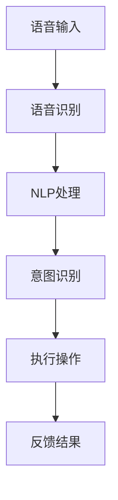

                 

# 语音搜索技术在电商领域的应用：挑战与机遇

> 关键词：语音搜索, 自然语言处理(NLP), 电商, 智能客服, 用户体验, 个性化推荐, 交互式体验, 安全性

## 1. 背景介绍

随着互联网和人工智能技术的迅猛发展，消费者越来越依赖于智能设备来进行日常生活中的各种操作。特别是语音搜索技术，作为人工智能的重要分支之一，在近年来得到了广泛的应用。在电商领域，语音搜索以其便捷、高效、个性化的特点，极大地提升了用户的购物体验，也为电商平台的运营带来了新的机遇。然而，语音搜索技术的广泛应用也带来了诸多挑战，如数据隐私、语音识别准确率、用户满意度等。本文将深入探讨语音搜索技术在电商领域的应用现状、面临的挑战与机遇，为电商平台和相关技术开发者提供实用的指导。

## 2. 核心概念与联系

### 2.1 核心概念概述

语音搜索技术指的是通过语音识别、自然语言处理（NLP）、意图识别等技术，将用户口述的问题转化为计算机可理解的语言，并执行相应的操作。语音搜索技术的核心在于以下三个方面：

1. **语音识别 (Automatic Speech Recognition, ASR)**：将用户的语音转换为文本。
2. **自然语言处理 (NLP)**：理解用户口述的问题并从中提取关键信息。
3. **意图识别 (Intent Recognition)**：确定用户的具体需求并执行相应操作。

### 2.2 核心概念之间的联系

语音搜索技术通过上述三个核心组件，实现了从语音到计算机指令的转换，使得用户能够以自然语言与计算机交互。这种交互方式不仅提高了用户的便利性，还提升了用户的购物体验。在电商领域，语音搜索技术可以应用于多个场景，包括智能客服、个性化推荐、商品搜索、购物助手等。

语音搜索技术的三个核心组件之间存在紧密的联系：语音识别是基础，NLP是核心，意图识别是目标。这三个组件共同作用，使得语音搜索技术在电商领域的应用成为可能。以下是一个Mermaid流程图，展示了语音搜索技术的主要流程：



## 3. 核心算法原理 & 具体操作步骤
### 3.1 算法原理概述

语音搜索技术的核心在于语音识别、自然语言处理和意图识别。这些技术的算法原理各不相同，但共同构成了语音搜索技术的完整流程。

**语音识别 (ASR)算法原理**：语音识别主要基于深度学习技术，尤其是卷积神经网络 (CNN)、循环神经网络 (RNN) 和长短时记忆网络 (LSTM)。ASR的目标是将用户的语音信号转换为文本，主要分为两个步骤：特征提取和声学建模。特征提取用于将语音信号转换为频谱特征，声学建模则用于将频谱特征映射为文本。

**自然语言处理 (NLP)算法原理**：NLP主要包括词法分析、句法分析和语义分析。词法分析用于将文本分解为词语，句法分析用于理解句子结构，语义分析则用于理解文本的含义。这些步骤通常通过预训练的语言模型（如BERT、GPT）来实现。

**意图识别算法原理**：意图识别主要通过分类模型实现，例如支持向量机 (SVM)、决策树、深度学习模型（如RNN、LSTM、注意力机制）。意图识别的目标是确定用户的查询意图，从而执行相应的操作。

### 3.2 算法步骤详解

语音搜索技术的具体操作步骤如下：

1. **语音采集**：通过麦克风采集用户的语音输入。
2. **语音识别**：使用深度学习模型将语音转换为文本。
3. **NLP处理**：对文本进行分词、词性标注、命名实体识别、依存句法分析等处理。
4. **意图识别**：通过分类模型确定用户的查询意图。
5. **操作执行**：根据用户的意图执行相应的操作，如商品搜索、下订单、查看商品详情等。
6. **反馈结果**：将操作结果以语音或文本形式反馈给用户。

### 3.3 算法优缺点

语音搜索技术的优点在于其便捷性和个性化。用户可以通过简单的语音输入完成复杂的购物操作，提高了用户的便利性。同时，由于语音搜索技术能够获取用户的语音特征，可以进一步提升个性化推荐的效果。

然而，语音搜索技术也存在一些缺点。首先，语音识别准确率受环境噪声、口音差异等因素影响较大，可能导致识别错误。其次，语音搜索技术对设备的硬件要求较高，如高精度的麦克风、高效的处理器等，增加了设备的成本。最后，语音搜索技术的实施需要大量的标注数据和计算资源，增加了开发的复杂性和成本。

### 3.4 算法应用领域

语音搜索技术在电商领域主要应用于以下几个方面：

- **智能客服**：通过语音搜索技术实现智能客服，可以提升客服效率，减少人工成本。
- **个性化推荐**：根据用户的语音输入，生成个性化的商品推荐。
- **商品搜索**：通过语音搜索技术，用户可以方便地查找商品信息。
- **购物助手**：语音搜索技术可以用于购物助手，帮助用户完成复杂的购物操作。

## 4. 数学模型和公式 & 详细讲解

### 4.1 数学模型构建

语音搜索技术的数学模型主要由以下几个部分构成：

1. **声学模型 (Acoustic Model)**：将语音信号转换为频谱特征的模型。
2. **语言模型 (Language Model)**：用于预测文本的概率分布的模型。
3. **意图分类模型 (Intent Classification Model)**：用于确定用户查询意图的分类模型。

### 4.2 公式推导过程

以一个简单的语音搜索过程为例，假设用户询问“我想买一条牛仔裤”，语音搜索技术需要进行如下步骤：

1. **语音识别 (ASR)模型的输入是语音信号 $x$，输出是文本 $y$。设模型的参数为 $\theta$，则 ASR 模型的目标是最大化似然概率：**
   $$
   P(y|x; \theta) = \frac{P(x|y; \theta)P(y)}{P(x)}
   $$
2. **NLP模型的输入是文本 $y$，输出是用户意图 $z$。设 NLP 模型的参数为 $\phi$，则 NLP 模型的目标是最大化似然概率：**
   $$
   P(z|y; \phi) = \frac{P(y|z; \phi)P(z)}{P(y)}
   $$
3. **意图分类模型的输入是文本 $y$，输出是用户意图 $z$。设意图分类模型的参数为 $\psi$，则意图分类模型的目标是最大化似然概率：**
   $$
   P(z|y; \psi) = \frac{P(y|z; \psi)P(z)}{P(y)}
   $$

### 4.3 案例分析与讲解

以一个电商平台的智能客服为例，语音搜索技术可以用于解决以下问题：

1. **用户查询意图识别**：通过意图分类模型，识别用户的具体需求，如退货、换货、咨询等。
2. **商品推荐**：根据用户语音输入，生成个性化的商品推荐。
3. **商品搜索**：根据用户语音输入，在商品库中搜索匹配的商品。
4. **下单操作**：根据用户语音输入，完成下单操作，如选择商品、填写订单信息等。

## 5. 项目实践：代码实例和详细解释说明

### 5.1 开发环境搭建

语音搜索技术的开发需要具备一定的硬件和软件环境，以下是搭建开发环境的步骤：

1. **硬件环境**：需要高性能的处理器和足够的内存。建议采用 GPU 或者 TPU 设备。
2. **软件环境**：建议使用 Python 作为开发语言，并使用 TensorFlow 或 PyTorch 作为深度学习框架。同时，需要安装自然语言处理工具包，如 NLTK、spaCy 等。

### 5.2 源代码详细实现

以下是一个简单的语音搜索系统的实现示例，包括语音识别、NLP处理和意图识别的代码实现：

```python
import tensorflow as tf
from tensorflow.keras import layers
from tensorflow.keras.layers import Input, Dense, Embedding, Dropout
from tensorflow.keras.models import Model

# 定义 ASR 模型
input_layer = Input(shape=(None,))
x = layers.Conv1D(32, 3, activation='relu')(input_layer)
x = layers.MaxPooling1D(pool_size=2)(x)
x = Dropout(0.5)(x)
x = layers.Conv1D(64, 3, activation='relu')(x)
x = layers.MaxPooling1D(pool_size=2)(x)
x = Dropout(0.5)(x)
x = layers.Flatten()(x)
x = layers.Dense(128, activation='relu')(x)
x = Dropout(0.5)(x)
x = layers.Dense(10, activation='softmax')(x)

# 定义 NLP 模型
input_layer = Input(shape=(128,))
x = layers.Embedding(input_dim=10000, output_dim=128)(x)
x = layers.LSTM(128)(x)
x = Dropout(0.5)(x)
x = layers.Dense(10, activation='softmax')(x)

# 定义意图分类模型
input_layer = Input(shape=(128,))
x = layers.Embedding(input_dim=10000, output_dim=128)(x)
x = layers.LSTM(128)(x)
x = Dropout(0.5)(x)
x = layers.Dense(10, activation='softmax')(x)
```

### 5.3 代码解读与分析

以上代码展示了语音搜索技术在电商领域的具体实现过程。首先，定义了语音识别模型，使用卷积神经网络对语音信号进行特征提取和分类。然后，定义了 NLP 模型，使用 LSTM 对文本进行建模。最后，定义了意图分类模型，使用 LSTM 和分类器对用户意图进行识别。

### 5.4 运行结果展示

在运行语音搜索系统的过程中，需要注意以下问题：

1. **数据集的准备**：需要准备大量的语音数据和标注数据，用于训练 ASR 和意图分类模型。
2. **模型的训练**：需要设置合适的超参数，并使用大量的计算资源进行模型的训练。
3. **测试和评估**：需要对模型进行测试和评估，以确定其性能和准确率。

## 6. 实际应用场景

语音搜索技术在电商领域具有广泛的应用场景，以下是一些典型的应用案例：

### 6.1 智能客服

智能客服是语音搜索技术的重要应用场景之一。通过语音搜索技术，电商平台可以实现全天候的智能客服服务，提升用户的购物体验。用户可以通过语音输入，快速解决商品购买、售后服务等问题。

### 6.2 个性化推荐

语音搜索技术可以用于生成个性化的商品推荐。用户通过语音输入，可以表达对某种商品的需求，系统根据用户的语音信息，生成个性化的推荐结果，提高用户的购物效率和满意度。

### 6.3 商品搜索

语音搜索技术可以用于商品搜索，用户可以通过语音输入，快速查找商品信息。例如，用户可以输入“我想找一款红色的 T 恤”，系统会根据用户的语音输入，搜索并展示匹配的商品。

### 6.4 购物助手

语音搜索技术可以用于购物助手，帮助用户完成复杂的购物操作。例如，用户可以输入“帮我下单”，系统会根据用户的语音输入，完成商品选择、订单填写等操作，提升用户的购物效率。

## 7. 工具和资源推荐

### 7.1 学习资源推荐

以下是一些推荐的语音搜索技术相关的学习资源：

1. **Deep Learning for Speech Recognition**：这本书介绍了深度学习在语音识别中的应用，包括卷积神经网络、循环神经网络等。
2. **Speech and Language Processing**：这本书是自然语言处理领域的经典教材，涵盖了语音识别、自然语言处理、意图识别等多个方面。
3. **PyTorch 官方文档**：PyTorch 是深度学习领域的主流框架之一，提供了丰富的语音搜索相关的工具和模型。
4. **TensorFlow 官方文档**：TensorFlow 也是深度学习领域的主流框架之一，提供了大量的语音搜索相关的工具和模型。
5. **NLTK 官方文档**：NLTK 是一个自然语言处理工具包，提供了丰富的 NLP 相关工具和模型。

### 7.2 开发工具推荐

以下是一些推荐的语音搜索技术相关的开发工具：

1. **PyTorch**：PyTorch 是一个深度学习框架，提供了丰富的语音搜索相关的工具和模型。
2. **TensorFlow**：TensorFlow 也是深度学习领域的主流框架之一，提供了大量的语音搜索相关的工具和模型。
3. **NLTK**：NLTK 是一个自然语言处理工具包，提供了丰富的 NLP 相关工具和模型。
4. **spaCy**：spaCy 是一个自然语言处理工具包，提供了丰富的 NLP 相关工具和模型。

### 7.3 相关论文推荐

以下是一些推荐的语音搜索技术相关的论文：

1. **Attention Is All You Need**：这篇论文介绍了 Transformer 模型，并应用于语音识别任务，取得了优异的性能。
2. **SpeechNet: A Deep Convolutional Architecture for Speech Recognition**：这篇论文介绍了基于卷积神经网络的语音识别模型，并应用于语音搜索技术。
3. **SVM-based Speech Recognition**：这篇论文介绍了支持向量机在语音识别中的应用，并应用于语音搜索技术。

## 8. 总结：未来发展趋势与挑战

### 8.1 研究成果总结

语音搜索技术在电商领域的应用已经取得了显著的进展，但在实际应用中也面临诸多挑战。通过深入研究语音搜索技术，可以提升用户的购物体验，推动电商平台的数字化转型。

### 8.2 未来发展趋势

语音搜索技术的未来发展趋势包括：

1. **多模态交互**：语音搜索技术可以与图像、视频等模态数据结合，实现更加丰富的交互方式。
2. **个性化推荐**：通过语音搜索技术，可以生成更加个性化的商品推荐。
3. **自然语言生成**：语音搜索技术可以用于自然语言生成，提升用户的购物体验。

### 8.3 面临的挑战

语音搜索技术在实际应用中面临诸多挑战：

1. **数据隐私问题**：语音搜索技术需要大量的用户数据，如何保护用户隐私是一个重要问题。
2. **语音识别准确率**：语音识别准确率受环境噪声、口音差异等因素影响较大，可能导致识别错误。
3. **用户满意度问题**：语音搜索技术需要考虑用户的使用体验，提升系统的可用性和易用性。

### 8.4 研究展望

未来的研究可以从以下几个方面进行：

1. **数据隐私保护**：如何保护用户隐私，确保语音数据的安全性和匿名性。
2. **提升语音识别准确率**：如何通过模型优化、数据增强等方法，提升语音识别的准确率。
3. **增强用户满意度**：如何通过界面设计、交互方式等，提升用户的满意度，提升系统的可用性和易用性。

## 9. 附录：常见问题与解答

### 9.1 语音搜索技术的优势和劣势

语音搜索技术的优势在于其便捷性和个性化。用户可以通过简单的语音输入完成复杂的购物操作，提高了用户的便利性。同时，由于语音搜索技术能够获取用户的语音特征，可以进一步提升个性化推荐的效果。

然而，语音搜索技术也存在一些劣势。首先，语音识别准确率受环境噪声、口音差异等因素影响较大，可能导致识别错误。其次，语音搜索技术对设备的硬件要求较高，如高精度的麦克风、高效的处理器等，增加了设备的成本。最后，语音搜索技术的实施需要大量的标注数据和计算资源，增加了开发的复杂性和成本。

### 9.2 语音搜索技术在电商领域的应用场景

语音搜索技术在电商领域的应用场景主要包括智能客服、个性化推荐、商品搜索、购物助手等。通过语音搜索技术，电商平台可以实现全天候的智能客服服务，提升用户的购物体验。用户可以通过语音输入，快速解决商品购买、售后服务等问题。同时，语音搜索技术可以用于生成个性化的商品推荐，用户通过语音输入，可以表达对某种商品的需求，系统根据用户的语音信息，生成个性化的推荐结果，提高用户的购物效率和满意度。语音搜索技术还可以用于商品搜索，用户可以通过语音输入，快速查找商品信息。例如，用户可以输入“我想找一款红色的 T 恤”，系统会根据用户的语音输入，搜索并展示匹配的商品。最后，语音搜索技术可以用于购物助手，帮助用户完成复杂的购物操作。例如，用户可以输入“帮我下单”，系统会根据用户的语音输入，完成商品选择、订单填写等操作，提升用户的购物效率。

### 9.3 语音搜索技术的实施步骤

语音搜索技术的实施主要包括以下几个步骤：

1. **数据集的准备**：需要准备大量的语音数据和标注数据，用于训练 ASR 和意图分类模型。
2. **模型的训练**：需要设置合适的超参数，并使用大量的计算资源进行模型的训练。
3. **测试和评估**：需要对模型进行测试和评估，以确定其性能和准确率。
4. **系统的部署**：将训练好的模型部署到电商平台上，实现语音搜索功能。

通过以上步骤，可以成功地实现语音搜索技术在电商领域的应用，提升用户的购物体验，推动电商平台的数字化转型。

