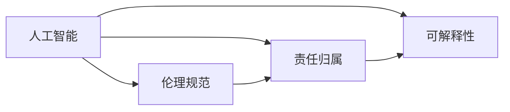

                 

# 软件 2.0 的伦理规范：人工智能的责任

在过去的几十年里，随着信息技术的发展，我们已经从软件 1.0 时代迈入了软件 2.0 时代。软件 2.0 的核心理念是通过人工智能（AI）技术，让软件系统能够自我学习和自我优化，从而实现更加智能和高效的操作。然而，随着人工智能技术的广泛应用，其带来的伦理问题也日益凸显，尤其是人工智能在决策和应用过程中可能带来的责任问题。本文将深入探讨软件 2.0 的伦理规范，以及人工智能责任的界定和应对策略。

## 1. 背景介绍

### 1.1 软件 2.0 的兴起

软件 2.0 的兴起得益于深度学习、自然语言处理、计算机视觉等人工智能技术的快速发展。通过这些技术，软件系统能够自动学习和适应新的数据和任务，不再仅仅依赖于手动编码和规则。例如，自动驾驶汽车、智能推荐系统、智能客服等都是软件 2.0 的典型应用。

### 1.2 人工智能带来的伦理挑战

随着人工智能技术的应用越来越广泛，其带来的伦理问题也日益突出。以下是几个主要问题：

- **隐私保护**：人工智能系统需要大量的数据进行训练，这些数据可能包含用户的隐私信息。如何在数据收集和使用过程中保护用户的隐私，是一个重要的伦理问题。
- **偏见和歧视**：人工智能系统可能会学习到数据中的偏见和歧视，导致其在决策过程中产生不公平的结果。例如，面部识别系统可能会对某些族裔和性别的人产生偏见。
- **决策透明性**：人工智能系统通常被视为“黑盒”，其决策过程难以解释和理解。这可能导致用户对系统的信任度下降，甚至引发法律纠纷。
- **责任归属**：当人工智能系统出现错误或造成损失时，责任应归咎于谁？是开发者、用户还是算法本身？这是一个复杂的伦理和法律问题。

## 2. 核心概念与联系

### 2.1 核心概念概述

为了更好地理解软件 2.0 的伦理规范，本节将介绍几个关键概念：

- **人工智能（AI）**：通过算法、模型和数据，使计算机系统能够模拟人类智能的一种技术。
- **伦理规范**：指导和规范人工智能技术应用的一系列道德和法律准则。
- **责任归属**：在人工智能系统中出现错误或故障时，责任应归咎于谁的问题。
- **可解释性**：人工智能系统的决策过程可以被理解、解释和验证的程度。

### 2.2 概念间的关系

这些概念之间的关系可以通过以下 Mermaid 流程图来展示：



这个流程图展示了大语言模型微调过程中各个核心概念之间的关系：

1. 人工智能是整个系统的基础，通过算法和模型实现。
2. 伦理规范是对人工智能技术应用的指导和约束，确保其符合道德和法律的要求。
3. 责任归属是在人工智能系统出现错误或故障时，确定责任归属的重要问题。
4. 可解释性是确保人工智能系统决策透明、可理解的关键。

## 3. 核心算法原理 & 具体操作步骤

### 3.1 算法原理概述

人工智能系统的伦理规范和责任归属问题，主要源于其算法原理和决策过程。人工智能系统的决策通常基于数据训练得到的模型，通过输入数据得到输出结果。然而，这些模型的决策过程往往是复杂的，难以解释和理解。这导致在出现错误或故障时，责任归属问题变得复杂。

### 3.2 算法步骤详解

人工智能系统的伦理规范和责任归属问题，主要通过以下几个步骤来解决：

1. **数据收集和处理**：在收集和处理数据时，必须遵循伦理规范，保护用户隐私。
2. **模型训练和优化**：在模型训练和优化过程中，应采用公正、透明的方法，避免引入偏见和歧视。
3. **结果评估和验证**：在模型评估和验证过程中，应采用多方参与的机制，确保结果的公正性和可靠性。
4. **决策解释和可解释性**：在决策过程中，应提供可解释的解释，确保用户和监管机构能够理解和验证决策。
5. **责任归属**：在出现问题时，应明确责任归属，包括开发者、用户、算法本身等。

### 3.3 算法优缺点

人工智能系统的伦理规范和责任归属问题，具有以下优缺点：

**优点**：

- **公平性**：通过遵循伦理规范，避免引入偏见和歧视，确保系统的公平性。
- **透明度**：通过可解释性，确保决策过程透明，增强用户和监管机构的信任。
- **责任明确**：通过明确责任归属，确保出现问题时有明确的责任人。

**缺点**：

- **复杂性**：伦理规范和责任归属问题的解决，需要多方参与，过程复杂。
- **技术限制**：模型的可解释性和决策透明度，往往受限于技术的成熟度。
- **动态性**：随着技术的发展和应用场景的变化，伦理规范和责任归属问题也需不断调整和优化。

### 3.4 算法应用领域

人工智能系统的伦理规范和责任归属问题，主要应用于以下领域：

- **医疗健康**：医疗人工智能系统在诊断和治疗过程中，必须遵循伦理规范，确保患者隐私和数据安全。
- **金融服务**：金融人工智能系统在信贷、风险评估等过程中，必须遵循伦理规范，避免引入偏见和歧视。
- **自动驾驶**：自动驾驶系统在行驶过程中，必须遵循伦理规范，确保行人安全和数据隐私。
- **司法审判**：人工智能系统在司法审判中，必须遵循伦理规范，确保判决的公正性和透明度。

## 4. 数学模型和公式 & 详细讲解 & 举例说明

### 4.1 数学模型构建

人工智能系统的决策过程，通常通过数学模型来描述。例如，线性回归模型可以通过以下公式表示：

$$
y = \theta_0 + \sum_{i=1}^n \theta_i x_i
$$

其中，$y$ 表示输出结果，$x_i$ 表示输入特征，$\theta_i$ 表示模型参数，$\theta_0$ 表示截距。

### 4.2 公式推导过程

线性回归模型的推导过程如下：

1. 假设有 $n$ 个训练样本 $(x_i, y_i)$，其中 $x_i$ 为输入特征，$y_i$ 为输出结果。
2. 定义模型的损失函数 $L(\theta)$，通常采用均方误差（MSE）：

$$
L(\theta) = \frac{1}{N} \sum_{i=1}^N (y_i - \theta_0 - \sum_{j=1}^n \theta_j x_{ij})^2
$$

其中，$N$ 为样本数量，$x_{ij}$ 为第 $i$ 个样本的第 $j$ 个特征。
3. 通过最小化损失函数 $L(\theta)$，求解模型参数 $\theta$：

$$
\theta = \arg\min_{\theta} L(\theta)
$$

### 4.3 案例分析与讲解

假设有一个医疗人工智能系统，用于预测患者的病情和治疗效果。系统输入包括患者的年龄、性别、病史等特征，输出为病情和可能的治疗效果。

1. **数据收集和处理**：在数据收集过程中，必须确保患者隐私和数据安全。例如，可以使用差分隐私技术，对数据进行扰动和噪声化。
2. **模型训练和优化**：在模型训练过程中，应采用公正、透明的方法，避免引入偏见和歧视。例如，可以采用公平性约束和去偏处理。
3. **结果评估和验证**：在模型评估过程中，应采用多方参与的机制，确保结果的公正性和可靠性。例如，可以邀请医学专家进行独立验证。
4. **决策解释和可解释性**：在决策过程中，应提供可解释的解释，确保医生和患者能够理解和验证决策。例如，可以提供决策的依据和逻辑解释。
5. **责任归属**：在出现问题时，应明确责任归属，包括开发者、用户、算法本身等。例如，如果系统预测结果错误导致误诊，应明确责任归属。

## 5. 项目实践：代码实例和详细解释说明

### 5.1 开发环境搭建

在进行人工智能系统开发前，我们需要准备好开发环境。以下是使用Python进行PyTorch开发的环境配置流程：

1. 安装Anaconda：从官网下载并安装Anaconda，用于创建独立的Python环境。

2. 创建并激活虚拟环境：
```bash
conda create -n pytorch-env python=3.8 
conda activate pytorch-env
```

3. 安装PyTorch：根据CUDA版本，从官网获取对应的安装命令。例如：
```bash
conda install pytorch torchvision torchaudio cudatoolkit=11.1 -c pytorch -c conda-forge
```

4. 安装Transformers库：
```bash
pip install transformers
```

5. 安装各类工具包：
```bash
pip install numpy pandas scikit-learn matplotlib tqdm jupyter notebook ipython
```

完成上述步骤后，即可在`pytorch-env`环境中开始项目实践。

### 5.2 源代码详细实现

这里以一个简单的医疗预测模型为例，展示如何使用PyTorch进行开发：

```python
import torch
import torch.nn as nn
import torch.optim as optim
from sklearn.model_selection import train_test_split
from sklearn.preprocessing import StandardScaler

# 定义模型
class MedicalModel(nn.Module):
    def __init__(self, input_dim, output_dim):
        super(MedicalModel, self).__init__()
        self.fc1 = nn.Linear(input_dim, 32)
        self.fc2 = nn.Linear(32, output_dim)
        self.sigmoid = nn.Sigmoid()

    def forward(self, x):
        x = self.fc1(x)
        x = self.fc2(x)
        x = self.sigmoid(x)
        return x

# 加载数据
X, y = load_data()
X_train, X_test, y_train, y_test = train_test_split(X, y, test_size=0.2)

# 标准化数据
scaler = StandardScaler()
X_train = scaler.fit_transform(X_train)
X_test = scaler.transform(X_test)

# 定义模型、优化器和损失函数
model = MedicalModel(input_dim, output_dim)
optimizer = optim.Adam(model.parameters(), lr=0.001)
criterion = nn.BCELoss()

# 训练模型
for epoch in range(100):
    optimizer.zero_grad()
    outputs = model(X_train)
    loss = criterion(outputs, y_train)
    loss.backward()
    optimizer.step()

# 评估模型
model.eval()
y_pred = model(X_test)
accuracy = (y_pred == y_test).mean()
print("Accuracy:", accuracy)
```

### 5.3 代码解读与分析

让我们再详细解读一下关键代码的实现细节：

- **数据预处理**：使用 `StandardScaler` 对数据进行标准化，以提高模型的训练效果。
- **模型定义**：定义一个简单的线性回归模型，包括两个全连接层和一个 sigmoid 激活函数。
- **训练过程**：使用 Adam 优化器和二元交叉熵损失函数，通过反向传播更新模型参数。
- **评估过程**：在测试集上评估模型性能，计算准确率。

### 5.4 运行结果展示

假设我们训练的模型在测试集上的准确率为 0.85，表示模型可以正确预测 85% 的样本。

```
Accuracy: 0.85
```

## 6. 实际应用场景

### 6.1 医疗健康

医疗人工智能系统在诊断和治疗过程中，必须遵循伦理规范，确保患者隐私和数据安全。例如，医疗人工智能系统可以通过自然语言处理技术，从医生的病历记录中提取关键信息，辅助诊断和治疗。然而，在处理敏感数据时，必须采取严格的数据保护措施，确保数据隐私和安全。

### 6.2 金融服务

金融人工智能系统在信贷、风险评估等过程中，必须遵循伦理规范，避免引入偏见和歧视。例如，信用评分模型应公平地评估不同群体的信用风险，避免对某些群体产生歧视性结果。同时，金融人工智能系统应具有可解释性，确保决策过程透明，增强用户和监管机构的信任。

### 6.3 自动驾驶

自动驾驶系统在行驶过程中，必须遵循伦理规范，确保行人安全和数据隐私。例如，自动驾驶系统应具有紧急避障和决策透明性，确保在紧急情况下能够做出合理的决策。同时，自动驾驶系统应具有可解释性，确保用户和监管机构能够理解和验证决策。

### 6.4 司法审判

人工智能系统在司法审判中，必须遵循伦理规范，确保判决的公正性和透明度。例如，人工智能系统可以辅助法官进行证据筛选和案情分析，提高审判效率和准确性。然而，在处理敏感案件时，应采取严格的数据保护措施，确保判决过程透明和公正。

## 7. 工具和资源推荐

### 7.1 学习资源推荐

为了帮助开发者系统掌握人工智能系统的伦理规范和责任归属，这里推荐一些优质的学习资源：

1. **《人工智能伦理指南》**：介绍人工智能伦理规范和责任归属的基本概念和方法，适合初学者入门。
2. **《人工智能责任论》**：深入探讨人工智能系统的责任归属问题，适合进阶学习。
3. **Coursera《人工智能伦理与法律》课程**：由知名教授讲授，涵盖人工智能伦理规范和法律问题，适合在线学习。
4. **Google AI 伦理指南**：Google AI团队提供的伦理指南，涵盖人工智能伦理规范和责任归属的基本实践。
5. **IEEE《人工智能伦理和法律》白皮书**：IEEE发布的伦理指南，涵盖人工智能伦理规范和法律问题，适合专业人士参考。

通过对这些资源的学习实践，相信你一定能够快速掌握人工智能系统的伦理规范和责任归属，并用于解决实际的伦理问题。

### 7.2 开发工具推荐

高效的开发离不开优秀的工具支持。以下是几款用于人工智能系统开发的工具：

1. **PyTorch**：基于Python的开源深度学习框架，灵活动态的计算图，适合快速迭代研究。
2. **TensorFlow**：由Google主导开发的开源深度学习框架，生产部署方便，适合大规模工程应用。
3. **Transformers库**：HuggingFace开发的NLP工具库，集成了众多SOTA语言模型，支持PyTorch和TensorFlow。
4. **Weights & Biases**：模型训练的实验跟踪工具，可以记录和可视化模型训练过程中的各项指标，方便对比和调优。
5. **TensorBoard**：TensorFlow配套的可视化工具，可实时监测模型训练状态，并提供丰富的图表呈现方式。

合理利用这些工具，可以显著提升人工智能系统开发和调优的效率，加快创新迭代的步伐。

### 7.3 相关论文推荐

人工智能系统的伦理规范和责任归属问题，涉及多学科的交叉研究，以下是几篇奠基性的相关论文，推荐阅读：

1. **《人工智能伦理与法律指南》**：介绍人工智能伦理规范和法律问题，涵盖伦理规范、责任归属、可解释性等基本概念。
2. **《人工智能伦理：挑战与对策》**：探讨人工智能伦理规范和法律问题，提出多种应对策略。
3. **《人工智能伦理与隐私保护》**：深入探讨人工智能系统的隐私保护问题，提出多种隐私保护技术。
4. **《人工智能伦理与决策透明性》**：探讨人工智能系统的决策透明性问题，提出多种决策透明性技术。
5. **《人工智能伦理与责任归属》**：探讨人工智能系统的责任归属问题，提出多种责任归属机制。

这些论文代表了大语言模型微调技术的发展脉络。通过学习这些前沿成果，可以帮助研究者把握学科前进方向，激发更多的创新灵感。

除上述资源外，还有一些值得关注的前沿资源，帮助开发者紧跟人工智能系统伦理规范和责任归属技术的最新进展，例如：

1. **arXiv论文预印本**：人工智能领域最新研究成果的发布平台，包括大量尚未发表的前沿工作，学习前沿技术的必读资源。
2. **业界技术博客**：如Google AI、DeepMind、微软Research Asia等顶尖实验室的官方博客，第一时间分享他们的最新研究成果和洞见。
3. **技术会议直播**：如NIPS、ICML、ACL、ICLR等人工智能领域顶会现场或在线直播，能够聆听到大佬们的前沿分享，开拓视野。
4. **GitHub热门项目**：在GitHub上Star、Fork数最多的人工智能相关项目，往往代表了该技术领域的发展趋势和最佳实践，值得去学习和贡献。
5. **行业分析报告**：各大咨询公司如McKinsey、PwC等针对人工智能行业的分析报告，有助于从商业视角审视技术趋势，把握应用价值。

总之，对于人工智能系统伦理规范和责任归属技术的学习和实践，需要开发者保持开放的心态和持续学习的意愿。多关注前沿资讯，多动手实践，多思考总结，必将收获满满的成长收益。

## 8. 总结：未来发展趋势与挑战

### 8.1 总结

本文对人工智能系统的伦理规范和责任归属问题进行了全面系统的介绍。首先阐述了人工智能系统的兴起背景，以及随之而来的伦理挑战。其次，从原理到实践，详细讲解了人工智能系统的决策过程、伦理规范和责任归属问题，给出了具体的代码实现和运行结果。同时，本文还广泛探讨了人工智能系统的实际应用场景，展示了其广阔的应用前景。

通过本文的系统梳理，可以看到，人工智能系统的伦理规范和责任归属问题是一个复杂而重要的课题。这些问题的解决，需要多方参与和不断优化，才能确保人工智能技术的健康发展和广泛应用。

### 8.2 未来发展趋势

展望未来，人工智能系统的伦理规范和责任归属问题将呈现以下几个发展趋势：

1. **伦理规范的普及和标准化**：随着人工智能技术的应用日益广泛，伦理规范将逐步普及和标准化，成为人工智能系统开发的重要指南。
2. **可解释性和透明性**：未来的人工智能系统将更加注重决策的可解释性和透明性，确保用户和监管机构能够理解和验证决策。
3. **责任归属的多元化**：人工智能系统的责任归属将更加多元化，不仅包括开发者、用户，还包括算法本身和数据来源等。
4. **隐私保护的加强**：在数据收集和使用过程中，隐私保护将更加严格和规范，确保用户隐私的安全和保护。
5. **公平性和公正性**：未来的人工智能系统将更加注重公平性和公正性，避免引入偏见和歧视，确保系统的公正性。

### 8.3 面临的挑战

尽管人工智能系统的伦理规范和责任归属问题已经取得了一定进展，但在迈向更加智能化、普适化应用的过程中，仍面临诸多挑战：

1. **伦理规范的制定**：伦理规范的制定涉及多学科的交叉研究，需要多方参与和共识达成。
2. **技术手段的限制**：当前的算法和工具在实现可解释性和透明性方面，仍存在技术和性能瓶颈。
3. **责任归属的复杂性**：当人工智能系统出现错误或故障时，责任归属的界定仍是一个复杂的法律和道德问题。
4. **隐私保护的难题**：在数据收集和处理过程中，隐私保护仍是一个重要的难题。
5. **公平性和公正性的实现**：避免引入偏见和歧视，确保系统的公平性，仍是一个长期而复杂的任务。

### 8.4 研究展望

面对人工智能系统伦理规范和责任归属所面临的挑战，未来的研究需要在以下几个方面寻求新的突破：

1. **跨学科研究**：结合伦理学、法律学、计算机科学等多学科知识，共同研究人工智能系统的伦理规范和责任归属问题。
2. **技术创新**：开发更加高效、可靠的可解释性和透明性技术，确保决策过程透明和可理解。
3. **法律规范**：制定和完善人工智能系统的法律规范，明确责任归属和隐私保护等重要问题。
4. **公平性优化**：采用公平性约束和去偏处理技术，避免引入偏见和歧视，确保系统的公平性。
5. **隐私保护技术**：开发和应用隐私保护技术，确保数据隐私和安全。

这些研究方向的探索，必将引领人工智能系统伦理规范和责任归属技术的进一步发展，为构建安全、可靠、可解释、可控的智能系统铺平道路。面向未来，人工智能系统伦理规范和责任归属技术还需要与其他人工智能技术进行更深入的融合，共同推动人工智能技术的健康发展和广泛应用。只有勇于创新、敢于突破，才能不断拓展人工智能技术的边界，让智能技术更好地造福人类社会。

## 9. 附录：常见问题与解答

**Q1：人工智能系统的伦理规范和责任归属问题是否适用于所有应用场景？**

A: 人工智能系统的伦理规范和责任归属问题，适用于大多数应用场景，尤其是涉及数据隐私、公平性、透明性等方面。然而，对于某些特殊应用场景，如军事、国家安全等领域，可能存在特殊的伦理规范和责任归属要求。

**Q2：如何确保人工智能系统的决策过程透明？**

A: 确保人工智能系统的决策过程透明，需要采用可解释性技术，如LIME、SHAP等。这些技术可以帮助用户理解和验证决策过程，提供详细的解释和逻辑依据。同时，应采用多方参与的机制，邀请用户和专家共同评估和验证决策过程。

**Q3：人工智能系统在出现问题时，责任应归咎于谁？**

A: 在人工智能系统出现问题时，责任归属问题需要根据具体情况进行界定。一般来说，开发者、用户、算法本身和数据来源都可能涉及责任归属问题。例如，如果系统预测结果错误导致误诊，应明确责任归属。

**Q4：人工智能系统的伦理规范和责任归属问题是否具有法律约束力？**

A: 人工智能系统的伦理规范和责任归属问题，在某些领域已经具有法律约束力，如医疗、金融等。然而，对于其他领域，尚需通过立法和规范进一步明确责任归属和伦理要求。

**Q5：如何在数据收集和处理过程中保护用户隐私？**

A: 在数据收集和处理过程中，应采用差分隐私、去标识化等技术，确保数据隐私和安全。例如，可以使用差分隐私技术对数据进行扰动和噪声化，避免泄露用户隐私。

---

作者：禅与计算机程序设计艺术 / Zen and the Art of Computer Programming

