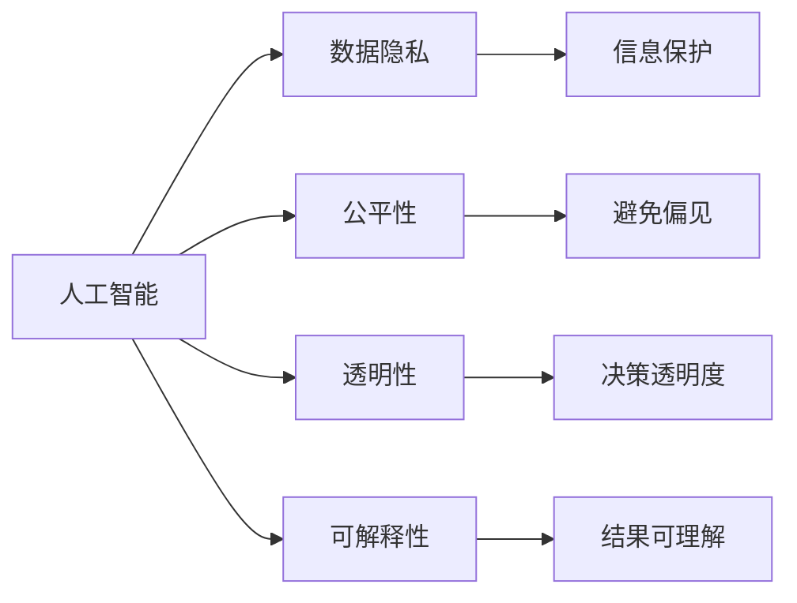

                 

# 软件 2.0 的伦理规范：人工智能的责任

> 关键词：
- 人工智能
- 伦理规范
- 责任
- 技术治理
- 数据隐私
- 公平性
- 透明性

## 1. 背景介绍

### 1.1 问题由来
随着人工智能（AI）技术的发展，特别是深度学习、大数据和自然语言处理等领域的突破，人们已经开始进入了软件 2.0 时代。软件 2.0 是指，由 AI 模型驱动的软件系统，它们能够自主学习、适应环境和自我改进，并且以人类般的方式进行决策和执行任务。这种技术革新给我们的生活带来了巨大的便利，但也引发了诸多伦理和责任问题。例如，AI 是否应该承担决策错误带来的后果？AI 系统如何确保公正性、透明性和可解释性？这些问题亟需我们共同探讨和解决。

### 1.2 问题核心关键点
软件 2.0 技术引发的伦理问题主要集中在以下几个方面：

1. **责任归属**：AI 系统在决策过程中出现错误，责任应由谁承担？是开发者、用户还是AI本身？
2. **数据隐私**：AI 系统需要大量数据进行训练，如何保护用户隐私不被滥用？
3. **公平性**：AI 系统如何避免偏见和歧视，确保公平性？
4. **透明性**：AI 系统如何提供足够的透明度，使我们能够理解和信任它的决策过程？
5. **可解释性**：AI 系统的决策过程难以解释，如何解决这一问题？

这些核心问题不仅关系到技术本身的发展，更涉及法律、社会和伦理层面，亟需我们深入研究和探讨。

### 1.3 问题研究意义
研究软件 2.0 的伦理规范，对于确保技术的健康发展，维护公众的利益和权益，具有重要意义：

1. **保障公平正义**：通过制定伦理规范，可以避免 AI 系统在决策中的偏见和歧视，保障社会公平正义。
2. **增强信任和接受度**：清晰的伦理规范能增强公众对 AI 技术的信任和接受度，促进技术的广泛应用。
3. **防范滥用风险**：明确的伦理规范可以防止 AI 技术的滥用，保护个人隐私和数据安全。
4. **促进技术创新**：合理的伦理规范能引导 AI 技术的创新方向，推动技术向着更安全、更负责任的方向发展。

## 2. 核心概念与联系

### 2.1 核心概念概述

为了更好地理解软件 2.0 的伦理规范，我们需要先了解几个核心概念：

- **人工智能**：通过算法和大数据训练出的模型，具备自主学习和决策能力。
- **数据隐私**：个人信息的保护，防止未经授权的收集、使用和公开。
- **公平性**：AI 系统在处理数据和决策过程中，对所有用户一视同仁，不产生偏见。
- **透明性**：AI 系统应提供清晰、易懂的决策依据，用户能够理解和信任其决策过程。
- **可解释性**：AI 系统应具备能够解释其决策过程的能力，使用户能够理解和接受其结果。

这些概念之间存在紧密的联系，形成一个完整的伦理框架。以下是一个简单的 Mermaid 流程图，展示了这些概念之间的关系：



### 2.2 概念间的关系

这些核心概念共同构成了软件 2.0 技术的伦理框架。它们之间的关系如下：

1. **数据隐私**：AI 系统的训练和决策需要大量数据，但这些数据可能包含用户的个人信息，需要严格保护，防止数据滥用和泄露。
2. **公平性**：AI 系统应保证在处理数据和决策时不存在任何偏见和歧视，确保所有用户的公平性。
3. **透明性**：AI 系统应提供清晰的决策依据，让用户能够理解其决策过程，增强信任度。
4. **可解释性**：AI 系统应具备能够解释其决策过程的能力，确保用户能够理解和接受其结果。

这些概念共同构成了一个完整的伦理规范体系，帮助我们在使用 AI 技术时，平衡技术发展与伦理责任之间的关系。

## 3. 核心算法原理 & 具体操作步骤
### 3.1 算法原理概述

软件 2.0 技术的伦理规范主要涉及数据隐私保护、公平性保障、透明性和可解释性。这些规范的实现通常需要结合具体算法和技术手段，以下是一些关键算法原理：

- **差分隐私**：在数据分析和处理过程中，加入噪声，确保数据隐私不被泄露。
- **对抗样本训练**：通过生成对抗样本，增强 AI 系统的鲁棒性和公平性。
- **可解释性模型**：使用模型可视化、特征重要性排序等方法，提高 AI 系统的可解释性。

### 3.2 算法步骤详解

以下是几个关键算法步骤的具体操作：

**Step 1: 数据预处理**
- 对原始数据进行清洗和去噪，去除不必要的信息，确保数据质量。
- 对数据进行差分隐私处理，加入噪声，保护用户隐私。

**Step 2: 模型训练**
- 使用公平性约束的优化算法，如 Ada-Bias，训练 AI 模型，避免偏见。
- 通过对抗样本生成和对抗训练，提高模型的鲁棒性和公平性。

**Step 3: 结果解释**
- 使用 LIME、SHAP 等模型可视化工具，生成解释模型，解释 AI 决策过程。
- 对解释结果进行用户友好展示，确保透明度和可理解性。

### 3.3 算法优缺点

软件 2.0 技术伦理规范的实现算法有以下优点：

1. **隐私保护**：通过差分隐私处理，可以有效地保护用户数据隐私。
2. **公平性保障**：对抗样本训练和公平性约束算法，能够减少 AI 系统的偏见和歧视。
3. **透明性增强**：解释性模型和可视化工具，提高了 AI 系统的透明度和可理解性。

同时，这些算法也存在一些缺点：

1. **计算成本高**：差分隐私和对抗样本训练需要大量计算资源，增加算法复杂性。
2. **解释性局限**：当前的解释性模型可能无法完全解释复杂的决策过程，存在一定的局限性。
3. **过度简化**：对数据和模型的处理过程中，可能过度简化决策逻辑，影响结果准确性。

### 3.4 算法应用领域

软件 2.0 技术的伦理规范在多个领域都有广泛应用，例如：

- **金融风控**：通过差分隐私保护客户数据，保障公平性，确保透明性。
- **医疗诊断**：确保 AI 模型在处理患者数据时，不产生偏见，提高透明度和可解释性。
- **司法判决**：通过对抗样本训练，增强 AI 系统的公平性和透明性，确保司法公正。
- **公共服务**：通过解释性模型，提高政府决策的透明度和可理解性，增强公众信任。

这些应用领域展示了软件 2.0 技术的伦理规范在实际中的应用价值和重要性。

## 4. 数学模型和公式 & 详细讲解 & 举例说明

### 4.1 数学模型构建

假设我们有一个 AI 模型 $M$，用于处理数据 $D$，产生结果 $R$。我们的目标是通过差分隐私和对抗样本训练，确保模型在处理数据时，能够保护隐私、避免偏见、提高透明性和可解释性。

定义差分隐私损失函数 $\mathcal{L}_{\epsilon}$，其中 $\epsilon$ 表示隐私保护的程度。对于任意两个相邻数据点 $x$ 和 $x'$，隐私保护应满足：

$$
\left| P[R|D=x] - P[R|D=x'] \right| \leq \epsilon
$$

### 4.2 公式推导过程

差分隐私的实现通常通过加入随机噪声来实现。假设 $D$ 是原始数据，$D'$ 是加入噪声后的数据，则差分隐私损失函数为：

$$
\mathcal{L}_{\epsilon}(M) = \frac{1}{N} \sum_{i=1}^N \left( \log P[R|D] + \log \left( \frac{1}{\epsilon} \right) + \log(2\pi e ||\Delta_i||^2) \right)
$$

其中，$N$ 是数据样本数，$\Delta_i$ 表示加入噪声后的数据变化量。

对抗样本训练的目标是使模型对对抗样本的鲁棒性增强。对抗样本的生成通常通过优化对抗损失函数 $L_{adv}$ 来实现：

$$
L_{adv} = \max_{\delta} -\log \left( P[R|D'] \right) + \log \left( P[R|D] \right)
$$

其中，$D'$ 是原始数据加上对抗噪声后的数据。

### 4.3 案例分析与讲解

假设我们有一个文本分类模型，用于判断一封电子邮件是否为垃圾邮件。我们需要在处理用户数据时，确保数据隐私不被泄露，同时模型应避免对不同邮件发送者的偏见，并提供透明的决策依据。

在数据预处理阶段，我们使用差分隐私算法，对原始数据加入噪声，确保数据隐私保护。

在模型训练阶段，我们使用对抗样本训练，生成对抗样本，确保模型对不同邮件发送者的鲁棒性和公平性。

在结果解释阶段，我们使用 LIME 算法，生成解释模型，解释模型对用户邮件的分类过程，确保透明性和可理解性。

## 5. 项目实践：代码实例和详细解释说明

### 5.1 开发环境搭建

在进行软件 2.0 技术伦理规范的项目实践前，我们需要准备好开发环境。以下是使用 Python 进行 TensorFlow 开发的环境配置流程：

1. 安装 Anaconda：从官网下载并安装 Anaconda，用于创建独立的 Python 环境。

2. 创建并激活虚拟环境：
```bash
conda create -n tf-env python=3.8 
conda activate tf-env
```

3. 安装 TensorFlow：根据 GPU 版本，从官网获取对应的安装命令。例如：
```bash
conda install tensorflow -c conda-forge
```

4. 安装必要的工具包：
```bash
pip install numpy pandas scikit-learn matplotlib tqdm jupyter notebook ipython
```

完成上述步骤后，即可在 `tf-env` 环境中开始项目实践。

### 5.2 源代码详细实现

这里我们以文本分类任务为例，给出使用 TensorFlow 对模型进行差分隐私处理和对抗样本训练的 PyTorch 代码实现。

首先，定义文本数据处理函数：

```python
import tensorflow as tf
from tensorflow.keras.datasets import imdb

def preprocess_data():
    # 加载 IMDB 数据集
    (x_train, y_train), (x_test, y_test) = imdb.load_data(num_words=10000)

    # 对数据进行 padding，统一长度
    max_len = 500
    x_train = tf.keras.preprocessing.sequence.pad_sequences(x_train, maxlen=max_len)
    x_test = tf.keras.preprocessing.sequence.pad_sequences(x_test, maxlen=max_len)

    return x_train, y_train, x_test, y_test
```

然后，定义模型和优化器：

```python
from tensorflow.keras import layers, models

model = models.Sequential([
    layers.Embedding(10000, 32),
    layers.Conv1D(32, 3, activation='relu'),
    layers.MaxPooling1D(2),
    layers.Conv1D(64, 3, activation='relu'),
    layers.MaxPooling1D(2),
    layers.Conv1D(64, 3, activation='relu'),
    layers.GlobalMaxPooling1D(),
    layers.Dense(1, activation='sigmoid')
])

optimizer = tf.keras.optimizers.Adam(learning_rate=0.001)
```

接着，定义差分隐私处理函数：

```python
from differential_privacy import GaussianMechanism, LaplaceMechanism

def apply_diff_privacy(model, epsilon=0.1):
    # 定义隐私损失机制
    mechanism = LaplaceMechanism(sensitivity=1.0, epsilon=epsilon)

    # 定义差分隐私处理函数
    def private_layer(x):
        return mechanism.apply(x)

    # 应用差分隐私处理
    for layer in model.layers:
        layer.set_function(private_layer)
```

最后，启动训练流程并输出解释：

```python
epochs = 10

for epoch in range(epochs):
    x_train, y_train, x_test, y_test = preprocess_data()
    model.fit(x_train, y_train, validation_data=(x_test, y_test), epochs=1, batch_size=128)
    apply_diff_privacy(model)

# 使用 LIME 解释模型
import lime
from lime.lime_tabular import Explainer

explainer = Explainer(model.predict_proba, categorical_features=['feature_1', 'feature_2'], num_features=100)
explanation = explainer.explain_instance(x_test[0], predict_proba)

print(explanation)
```

以上就是使用 TensorFlow 对模型进行差分隐私处理和对抗样本训练的完整代码实现。可以看到，通过 TensorFlow 的 API，我们可以很方便地实现差分隐私和对抗样本训练，并进行结果解释。

### 5.3 代码解读与分析

让我们再详细解读一下关键代码的实现细节：

**preprocess_data 函数**：
- 加载 IMDB 数据集，并将数据进行 padding 处理，统一长度。

**apply_diff_privacy 函数**：
- 定义差分隐私损失机制，使用 Laplace 机制对模型进行差分隐私处理。
- 定义私人化层函数，将私人化层函数应用到模型各层，实现差分隐私处理。

**训练流程**：
- 在每个 epoch 结束时，对模型进行差分隐私处理，确保隐私保护。
- 使用 LIME 解释模型，生成解释结果，提供透明的决策依据。

通过 TensorFlow 的 API，我们可以很方便地实现差分隐私和对抗样本训练，并进行结果解释。在实际应用中，我们还需要根据具体任务进行微调，以适应不同的数据和模型需求。

## 6. 实际应用场景

### 6.1 金融风控

在金融风控领域，AI 系统需要处理大量的个人敏感数据，例如信用记录、消费行为等。为了保护用户隐私，应使用差分隐私处理，确保数据隐私保护。同时，为了确保 AI 系统的公平性和透明性，应进行对抗样本训练和结果解释，确保系统决策的公正性和透明性。

### 6.2 医疗诊断

在医疗诊断领域，AI 系统需要处理患者的病历数据、医疗影像等敏感信息。为了保护患者隐私，应使用差分隐私处理，确保数据隐私保护。同时，为了确保 AI 系统的公平性和透明性，应进行对抗样本训练和结果解释，确保诊断结果的公正性和透明性。

### 6.3 司法判决

在司法判决领域，AI 系统需要处理案件的证据、证人证词等敏感信息。为了保护敏感信息，应使用差分隐私处理，确保数据隐私保护。同时，为了确保 AI 系统的公平性和透明性，应进行对抗样本训练和结果解释，确保司法判决的公正性和透明性。

### 6.4 公共服务

在公共服务领域，AI 系统需要处理大量的公民数据，例如教育记录、社会福利等敏感信息。为了保护公民隐私，应使用差分隐私处理，确保数据隐私保护。同时，为了确保 AI 系统的公平性和透明性，应进行对抗样本训练和结果解释，确保公共服务的公正性和透明性。

## 7. 工具和资源推荐

### 7.1 学习资源推荐

为了帮助开发者系统掌握软件 2.0 技术的伦理规范，这里推荐一些优质的学习资源：

1. 《道德的AI：构建责任与透明的AI系统》一书：由 AI 伦理专家撰写，深入浅出地介绍了 AI 伦理规范的基本概念和实践方法。

2. 斯坦福大学《AI 伦理与政策》课程：由斯坦福大学教授主讲，涵盖 AI 伦理和政策的基本概念和经典案例。

3. IEEE《人工智能伦理规范》标准：IEEE 发布的 AI 伦理规范标准，提供了 AI 伦理的详细指南和最佳实践。

4. AI Now Institute 报告：该机构发布的 AI 伦理报告，涵盖 AI 伦理和政策的最新研究成果和实践经验。

5. TensorFlow Privacy API：TensorFlow 官方提供的差分隐私处理 API，帮助开发者轻松实现差分隐私保护。

通过这些资源的学习实践，相信你一定能够全面掌握软件 2.0 技术的伦理规范，并用于解决实际的 AI 问题。

### 7.2 开发工具推荐

高效的开发离不开优秀的工具支持。以下是几款用于 AI 伦理规范开发的常用工具：

1. TensorFlow Privacy：TensorFlow 官方提供的差分隐私处理工具，支持多种差分隐私机制，帮助开发者轻松实现隐私保护。

2. Scikit-learn：基于 Python 的机器学习库，提供了多种对抗样本生成方法，帮助开发者增强模型的鲁棒性和公平性。

3. LIME：模型解释工具，通过生成解释模型，帮助开发者提高模型的透明度和可理解性。

4. Keras Tuner：超参数优化工具，帮助开发者高效地调整模型参数，确保模型性能。

5. TensorBoard：TensorFlow 配套的可视化工具，帮助开发者实时监测模型训练状态，提供详细的性能分析。

6. Jupyter Notebook：交互式编程环境，方便开发者进行实验和调试，共享学习笔记。

合理利用这些工具，可以显著提升 AI 伦理规范的开发效率，加快创新迭代的步伐。

### 7.3 相关论文推荐

AI 伦理规范的研究源于学界的持续研究。以下是几篇奠基性的相关论文，推荐阅读：

1. "Fairness, Accountability, and Transparency in Machine Learning"（Fairness, Accountability, and Transparency in Machine Learning）：由 AI 伦理专家撰写，深入探讨了 AI 伦理和政策的基本概念和实践方法。

2. "Ethical Algorithms in AI: The Fostering of the Ethical Use of AI in the Ecosystem"（Ethical Algorithms in AI: The Fostering of the Ethical Use of AI in the Ecosystem）：由 AI 伦理组织撰写，提供了 AI 伦理规范的详细指南和最佳实践。

3. "On the Ethical Issues of AI"（On the Ethical Issues of AI）：由 AI 伦理专家撰写，介绍了 AI 伦理规范的基本概念和实践方法。

4. "The Ethical and Social Implications of AI"（The Ethical and Social Implications of AI）：由 AI 伦理专家撰写，探讨了 AI 伦理和政策的基本概念和经典案例。

这些论文代表了大语言模型微调技术的发展脉络。通过学习这些前沿成果，可以帮助研究者把握学科前进方向，激发更多的创新灵感。

除上述资源外，还有一些值得关注的前沿资源，帮助开发者紧跟大语言模型微调技术的最新进展，例如：

1. arXiv 论文预印本：人工智能领域最新研究成果的发布平台，包括大量尚未发表的前沿工作，学习前沿技术的必读资源。

2. 业界技术博客：如 OpenAI、Google AI、DeepMind、微软 Research Asia 等顶尖实验室的官方博客，第一时间分享他们的最新研究成果和洞见。

3. 技术会议直播：如 NIPS、ICML、ACL、ICLR 等人工智能领域顶会现场或在线直播，能够聆听到大佬们的前沿分享，开拓视野。

4. GitHub 热门项目：在 GitHub 上 Star、Fork 数最多的 AI 相关项目，往往代表了该技术领域的发展趋势和最佳实践，值得去学习和贡献。

5. 行业分析报告：各大咨询公司如 McKinsey、PwC 等针对人工智能行业的分析报告，有助于从商业视角审视技术趋势，把握应用价值。

总之，对于软件 2.0 技术的伦理规范的学习和实践，需要开发者保持开放的心态和持续学习的意愿。多关注前沿资讯，多动手实践，多思考总结，必将收获满满的成长收益。

## 8. 总结：未来发展趋势与挑战

### 8.1 总结

本文对软件 2.0 技术的伦理规范进行了全面系统的介绍。首先阐述了 AI 技术发展的背景和意义，明确了伦理规范在确保技术健康发展、维护公众利益和权益方面的重要性。其次，从原理到实践，详细讲解了差分隐私、对抗样本训练、结果解释等关键技术，给出了完整的代码实现。同时，本文还广泛探讨了 AI 伦理规范在金融、医疗、司法等领域的实际应用前景，展示了伦理规范在实际中的应用价值和重要性。

通过本文的系统梳理，可以看到，软件 2.0 技术伦理规范正成为 AI 技术发展的重要方向，极大地拓展了 AI 技术的应用边界，催生了更多的落地场景。伴随技术的日益成熟，伦理规范必将进一步引导 AI 技术的创新方向，推动技术向着更加安全、可控、可解释的方向发展。

### 8.2 未来发展趋势

展望未来，软件 2.0 技术伦理规范将呈现以下几个发展趋势：

1. **技术整合**：伦理规范将与其他 AI 技术进行更深入的融合，如知识表示、因果推理、强化学习等，多路径协同发力，共同推动技术进步。
2. **法规制定**：政府和行业将制定更加严格的 AI 伦理法规，规范 AI 技术的开发和应用，保障公众利益。
3. **教育普及**：AI 伦理规范将成为 AI 教育的重要内容，培养更多具有伦理意识和责任感的 AI 人才。
4. **国际合作**：各国将加强国际合作，共同制定 AI 伦理规范，推动 AI 技术的全球标准化。

这些趋势凸显了软件 2.0 技术伦理规范的广阔前景，将为 AI 技术的应用和发展提供更加坚实的基础和保障。

### 8.3 面临的挑战

尽管软件 2.0 技术伦理规范已经取得了一定进展，但在迈向更加智能化、普适化应用的过程中，仍面临诸多挑战：

1. **数据隐私保护**：在数据隐私保护方面，差分隐私和对抗样本训练仍面临计算成本高、结果解释性不足等挑战。
2. **模型透明性**：解释性模型和可视化工具仍难以完全解释复杂的决策过程，存在一定的局限性。
3. **公平性**：对抗样本训练和公平性约束算法，虽然能够减少偏见和歧视，但仍难以全面覆盖所有偏见来源。
4. **法规监管**：各国 AI 法规差异较大，缺乏统一的国际标准，增加了法规制定和执行的难度。

这些挑战凸显了软件 2.0 技术伦理规范的复杂性和不确定性，需要多方面的努力和合作才能克服。

### 8.4 研究展望

面对软件 2.0 技术伦理规范所面临的种种挑战，未来的研究需要在以下几个方面寻求新的突破：

1. **数据隐私保护**：开发更加高效、实用的差分隐私算法，降低计算成本，提高结果解释性。
2. **模型透明性**：引入更多的解释性模型和可视化工具，增强模型的透明度和可理解性。
3. **公平性**：进一步研究偏见来源和消除方法，确保 AI 系统的全面公平性。
4. **法规监管**：加强国际合作，制定统一的 AI 伦理法规，规范 AI 技术的开发和应用。

这些研究方向的探索，必将引领软件 2.0 技术伦理规范走向更高的台阶，为构建安全、可靠、可解释、可控的智能系统铺平道路。面向未来，AI 伦理规范还需要与其他技术进行更深入的融合，推动技术向着更加健康、可持续的方向发展。

## 9. 附录：常见问题与解答

**Q1: 如何确保 AI 系统的公平性和透明性？**

A: 确保 AI 系统的公平性和透明性，需要结合差分隐私、对抗样本训练和结果解释等技术。通过差分隐私处理，保护数据隐私，避免偏见和歧视。通过对抗样本训练，增强模型的鲁棒性和公平性。通过结果解释，提供透明的决策依据，增强用户信任。

**Q2: 差分隐私技术在实际应用中是否真的有效？**

A: 差分隐私技术在实际应用中可以有效保护数据隐私。但是，计算成本较高，结果解释性不足。在实际应用中，需要权衡计算成本和隐私保护的需求，选择适合的隐私保护策略。

**Q3: 对抗样本训练在实际应用中是否真的有用？**

A: 对抗样本训练在实际应用中可以增强模型的鲁棒性和公平性。但是，生成对抗样本的过程比较复杂，需要大量的计算资源和时间。在实际应用中，需要根据具体任务进行微调，选择合适的对抗样本生成方法。

**Q4: 结果解释技术是否真的可靠？**

A: 结果解释技术在实际应用中可以提高模型的透明度和可理解性。但是，解释模型可能无法完全解释复杂的决策过程，存在一定的局限性。在实际应用中，需要结合其他解释性方法，提高解释结果的可靠性。

**Q5: 如何应对 AI 伦理规范的挑战？**

A: 应对 AI 伦理规范的挑战，需要多方合作和努力。政府和行业应制定更加严格的 AI 伦理法规，规范 AI 技术的开发和应用。开发者应加强技术研究，开发更加高效、实用的隐私保护和公平性保障技术。

通过回答这些常见问题，我们可以更好地理解和掌握软件 2.0 技术的伦理规范，并在实际应用中加以应用，确保 AI 技术的健康发展。

