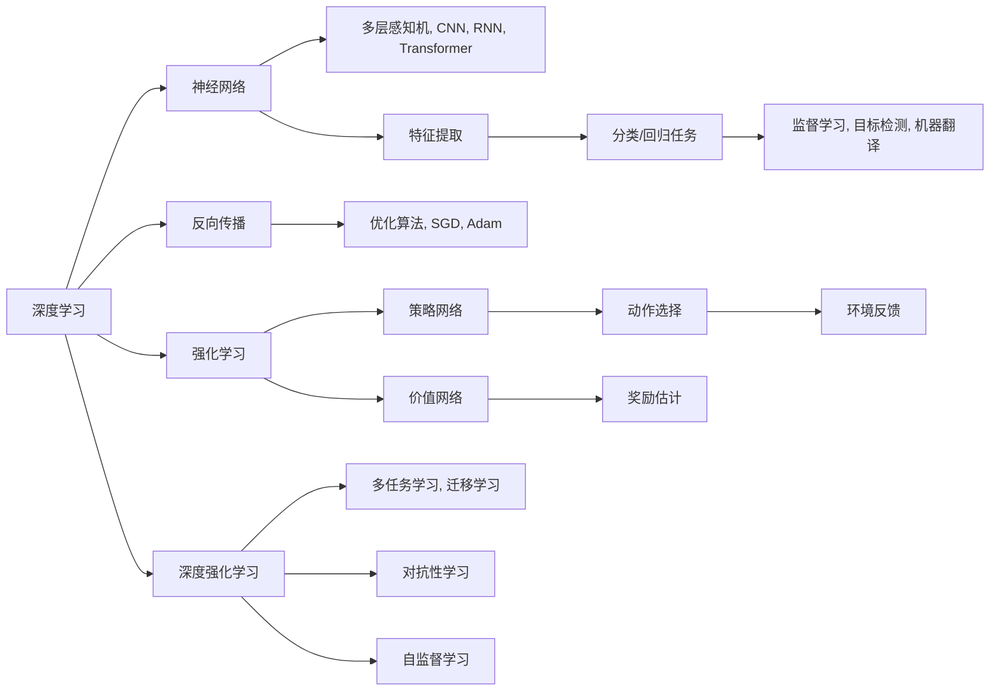

                 

# 软件 2.0 的发展趋势：深度学习、强化学习

## 1. 背景介绍

随着计算资源和数据资源的不断增长，人工智能（AI）技术正迅速发展和变革。特别是在深度学习和强化学习领域，这两大技术正在重新定义软件的设计、开发和应用方式，开启了软件 2.0 的新时代。本文将深入探讨深度学习和强化学习的核心概念、原理与最新进展，并展望其未来的发展趋势和应用前景。

## 2. 核心概念与联系

### 2.1 核心概念概述

深度学习（Deep Learning, DL）是一种基于神经网络的机器学习技术，通过多层非线性变换，从数据中自动提取高层次的特征表示。深度学习已经在计算机视觉、自然语言处理、语音识别等领域取得了突破性进展。

强化学习（Reinforcement Learning, RL）是一种通过智能体与环境交互，在特定策略下最大化累积奖励的机器学习方法。强化学习在机器人控制、游戏AI、自动驾驶等领域展现了巨大的潜力。

深度学习和强化学习虽属不同范畴，但在应用实践中存在大量交集，如深度强化学习（Deep Reinforcement Learning, DRL），其结合了深度神经网络和强化学习框架，成为AI技术发展的前沿方向。

### 2.2 核心概念原理和架构的 Mermaid 流程图



这个流程图展示了深度学习和强化学习的基本框架及其相互联系：

1. **深度学习**通过多层神经网络进行特征提取和表示学习，支持监督学习和无监督学习任务。
2. **强化学习**通过智能体与环境的交互，优化策略以最大化奖励。
3. **深度强化学习**结合了深度神经网络和强化学习，支持更复杂的策略优化和策略表示。
4. **多任务学习**、**迁移学习**和**自监督学习**等技术进一步拓展了深度强化学习的应用边界和能力。

### 2.3 核心概念的整体架构

从图中可以看出，深度学习和强化学习虽有区别，但在很多任务中都是相辅相成的。深度学习负责特征提取和表示学习，而强化学习负责策略优化和决策制定。两者的结合，使得AI系统能够在更复杂和多变的环境中，通过自适应学习和优化，实现更加精准和智能的决策。

## 3. 核心算法原理 & 具体操作步骤

### 3.1 算法原理概述

#### 3.1.1 深度学习

深度学习的核心在于通过多层神经网络自动学习和提取数据的特征表示。通常，深度学习模型由多个隐藏层构成，每个隐藏层都有多个神经元，通过非线性激活函数进行非线性变换。模型的输出层根据具体任务而定，可以是分类、回归、序列预测等形式。

深度学习模型通过反向传播算法进行训练。反向传播算法通过链式法则，计算模型输出与目标之间的误差，并根据误差反向传播回传到模型内部，更新每个神经元的权重和偏置，以减小误差。常见的优化算法有梯度下降、动量优化、自适应学习率优化等。

#### 3.1.2 强化学习

强化学习通过智能体与环境进行交互，智能体根据当前状态采取动作，环境根据动作改变状态，并给出即时奖励。智能体的目标是通过学习策略，最大化累积奖励。

强化学习算法包括Q-learning、SARSA、Deep Q-Networks等。Q-learning和SARSA是基于值函数的方法，通过迭代估计状态-动作对的价值，选择最优动作。Deep Q-Networks则使用深度神经网络来逼近Q值函数，支持更复杂的动作空间和状态表示。

#### 3.1.3 深度强化学习

深度强化学习结合了深度学习和强化学习的优点，使用深度神经网络来表示策略或价值函数，支持更高级的决策制定和动作空间。常见的深度强化学习算法包括Deep Q-Networks、Actor-Critic、Policy Gradient等。

### 3.2 算法步骤详解

#### 3.2.1 深度学习

1. **数据准备**：收集和清洗数据，划分训练集、验证集和测试集。
2. **模型构建**：选择合适的神经网络结构和参数，如卷积神经网络（CNN）、循环神经网络（RNN）、Transformer等。
3. **模型训练**：使用反向传播算法和优化算法训练模型，最小化损失函数。
4. **模型评估**：在测试集上评估模型性能，如准确率、召回率、F1分数等。
5. **模型部署**：将训练好的模型部署到实际应用中，进行推理和预测。

#### 3.2.2 强化学习

1. **环境设置**：定义环境和状态空间，设计状态转移函数和奖励函数。
2. **智能体设计**：选择合适的智能体策略，如策略网络、值网络等。
3. **策略优化**：使用强化学习算法（如Q-learning、SARSA、Deep Q-Networks等）进行策略优化。
4. **策略评估**：在测试环境中评估智能体性能，如平均奖励、策略稳定性和收敛速度。
5. **策略部署**：将优化后的策略部署到实际应用中，进行环境交互和决策制定。

#### 3.2.3 深度强化学习

1. **数据准备**：收集和清洗环境数据，构建数据流。
2. **模型构建**：设计神经网络结构，如卷积神经网络、循环神经网络、Transformer等。
3. **策略优化**：使用深度强化学习算法（如Deep Q-Networks、Actor-Critic、Policy Gradient等）进行策略优化。
4. **策略评估**：在测试环境中评估智能体性能，如累积奖励、动作选择频率、策略稳定性等。
5. **策略部署**：将优化后的策略部署到实际应用中，进行环境交互和决策制定。

### 3.3 算法优缺点

#### 3.3.1 深度学习

**优点**：
- 自动特征提取：通过多层非线性变换，深度学习模型可以自动学习数据的高级特征表示。
- 高精度：在视觉、语音、自然语言处理等领域，深度学习模型已经取得了超过人类专家的表现。
- 广泛应用：深度学习技术已经被广泛应用于各个领域，如图像识别、自然语言处理、语音识别等。

**缺点**：
- 计算资源需求高：深度学习模型参数量庞大，训练和推理需要大量计算资源。
- 模型复杂度高：深度学习模型结构复杂，难以解释和调试。
- 过拟合风险高：深度学习模型容易在训练集上过拟合，泛化性能不足。

#### 3.3.2 强化学习

**优点**：
- 自适应能力强：强化学习通过与环境交互，可以动态调整策略，适应复杂和多变的环境。
- 探索能力强：强化学习算法可以探索多种策略，找到最优解。
- 泛化能力强：强化学习算法可以在多种环境中泛化，适应不同的任务和场景。

**缺点**：
- 学习效率低：强化学习算法在复杂环境中学习速度较慢，收敛时间长。
- 策略探索与利用冲突：强化学习算法需要平衡探索和利用的关系，需要大量的样本和计算资源。
- 状态空间复杂度高：在复杂的环境中，状态空间维度和复杂度极高，难以表示和优化。

#### 3.3.3 深度强化学习

**优点**：
- 高精度与自适应能力结合：深度强化学习结合了深度学习和强化学习的优点，能够处理复杂的策略优化和决策制定。
- 更强的泛化能力：深度强化学习算法可以在多种环境中泛化，适应不同的任务和场景。
- 广泛应用：深度强化学习已经在自动驾驶、游戏AI、机器人控制等领域取得了显著进展。

**缺点**：
- 计算资源需求高：深度强化学习模型需要大量的计算资源进行训练和优化。
- 策略表示复杂：深度强化学习算法需要处理复杂的策略表示，难以解释和调试。
- 样本需求高：深度强化学习算法需要大量的样本进行策略优化，学习效率较低。

### 3.4 算法应用领域

#### 3.4.1 深度学习

- **计算机视觉**：图像分类、目标检测、人脸识别等任务。
- **自然语言处理**：机器翻译、文本分类、情感分析等任务。
- **语音识别**：语音转文本、语音命令识别等任务。
- **推荐系统**：协同过滤、基于内容的推荐、深度推荐等任务。

#### 3.4.2 强化学习

- **机器人控制**：机器人路径规划、动作选择等任务。
- **自动驾驶**：车辆控制、路径规划、交通信号灯识别等任务。
- **游戏AI**：围棋、星际争霸等复杂游戏中的智能体策略优化。
- **金融交易**：股票交易、量化交易等任务。

#### 3.4.3 深度强化学习

- **自动驾驶**：智能车辆控制、路径规划、交通信号灯识别等任务。
- **机器人控制**：机器人路径规划、动作选择、人机交互等任务。
- **游戏AI**：复杂游戏中的智能体策略优化，如AlphaGo。
- **金融交易**：智能交易系统、量化交易等任务。

## 4. 数学模型和公式 & 详细讲解 & 举例说明

### 4.1 数学模型构建

#### 4.1.1 深度学习

深度学习模型通常由多层神经网络构成，每层神经元通过非线性激活函数进行非线性变换。

以卷积神经网络（CNN）为例，其数学模型可以表示为：
$$
y = \mathcal{N}\left(W^{L} \mathcal{N}\left(W^{L-1} \mathcal{N}\left(\cdots \mathcal{N}\left(W^{1} x\right)\cdots\right)\right)
$$
其中，$x$ 为输入数据，$\mathcal{N}$ 为非线性激活函数，$W^{l}$ 为第 $l$ 层的权重矩阵，$L$ 为层数。

#### 4.1.2 强化学习

强化学习模型通常由智能体、状态空间、动作空间、奖励函数和策略函数组成。

以Q-learning算法为例，其数学模型可以表示为：
$$
Q(s, a) = Q(s, a) + \alpha(r + \gamma \max_{a'} Q(s', a') - Q(s, a))
$$
其中，$s$ 为状态，$a$ 为动作，$r$ 为即时奖励，$\gamma$ 为折扣因子，$\alpha$ 为学习率，$Q(s, a)$ 为状态-动作对的Q值，$s'$ 为下一状态。

#### 4.1.3 深度强化学习

深度强化学习模型通常由神经网络表示策略函数或价值函数，支持复杂的策略优化和动作空间。

以Deep Q-Networks算法为例，其数学模型可以表示为：
$$
Q(s, a) = \mathcal{N}\left(W^{L} \mathcal{N}\left(W^{L-1} \cdots \mathcal{N}\left(W^{1} s\right)\cdots\right)
$$
其中，$s$ 为状态，$a$ 为动作，$\mathcal{N}$ 为非线性激活函数，$W^{l}$ 为第 $l$ 层的权重矩阵，$L$ 为层数。

### 4.2 公式推导过程

#### 4.2.1 深度学习

以简单的单层感知机为例，其激活函数为 $f(x) = \sigma(Wx + b)$，其中 $x$ 为输入向量，$W$ 为权重矩阵，$b$ 为偏置向量，$\sigma$ 为激活函数。

反向传播算法通过链式法则计算梯度，以更新模型参数。以损失函数 $L$ 为例，其梯度公式为：
$$
\frac{\partial L}{\partial W} = \frac{\partial L}{\partial f} \cdot \frac{\partial f}{\partial W}
$$
其中，$\frac{\partial L}{\partial f}$ 为损失函数对输出层的梯度，$\frac{\partial f}{\partial W}$ 为激活函数的梯度。

#### 4.2.2 强化学习

以Q-learning算法为例，其状态-动作对的Q值更新公式为：
$$
Q(s, a) = Q(s, a) + \alpha(r + \gamma \max_{a'} Q(s', a') - Q(s, a))
$$
其中，$\alpha$ 为学习率，$r$ 为即时奖励，$\gamma$ 为折扣因子，$s'$ 为下一状态。

该公式可以理解为，智能体在当前状态 $s$ 下采取动作 $a$，得到即时奖励 $r$ 和下一状态 $s'$，通过比较智能体采取当前动作的Q值与采取其他动作的Q值，更新状态-动作对的Q值。

#### 4.2.3 深度强化学习

以Deep Q-Networks算法为例，其状态-动作对的Q值更新公式为：
$$
Q(s, a) = r + \gamma \max_{a'} Q(s', a')
$$
其中，$r$ 为即时奖励，$\gamma$ 为折扣因子，$s'$ 为下一状态。

该公式可以理解为，智能体在当前状态 $s$ 下采取动作 $a$，得到即时奖励 $r$ 和下一状态 $s'$，通过比较智能体采取当前动作的Q值与采取其他动作的Q值，更新状态-动作对的Q值。

### 4.3 案例分析与讲解

#### 4.3.1 深度学习

以ImageNet图像分类为例，深度卷积神经网络（CNN）在ImageNet数据集上取得了超过人类专家的表现。CNN通过多层卷积和池化操作提取图像特征，并使用全连接层进行分类。

#### 4.3.2 强化学习

以Atari游戏AI为例，Deep Q-Networks算法在Atari 2600游戏上取得了超过人类专家的表现。Deep Q-Networks通过神经网络逼近Q值函数，使用样本进行策略优化，找到最优的动作策略。

#### 4.3.3 深度强化学习

以AlphaGo为例，DeepMind开发的AlphaGo使用深度神经网络和强化学习算法，在围棋游戏中战胜了人类冠军李世石。AlphaGo通过策略网络和价值网络，优化策略并进行动作选择，最终在围棋游戏中取得胜利。

## 5. 项目实践：代码实例和详细解释说明

### 5.1 开发环境搭建

为了进行深度学习和强化学习的项目实践，我们需要搭建Python开发环境，并选择合适的深度学习框架和强化学习框架。

#### 5.1.1 安装Python

在安装Python环境前，需要先检查计算机系统中是否已经安装了Python。可以使用命令 `python --version` 查看当前Python版本。如果没有安装，可以通过以下命令进行安装：

```
sudo apt-get install python3
```

#### 5.1.2 安装虚拟环境

在Python环境中，需要使用虚拟环境（Virtual Environment）来管理项目依赖。可以使用 `virtualenv` 命令创建虚拟环境：

```
virtualenv venv
source venv/bin/activate
```

#### 5.1.3 安装深度学习框架

常用的深度学习框架包括TensorFlow、PyTorch、Keras等。以TensorFlow为例，可以使用以下命令进行安装：

```
pip install tensorflow
```

#### 5.1.4 安装强化学习框架

常用的强化学习框架包括OpenAI Gym、RLlib等。以OpenAI Gym为例，可以使用以下命令进行安装：

```
pip install gym
```

### 5.2 源代码详细实现

#### 5.2.1 深度学习

以简单的手写数字识别为例，使用TensorFlow框架实现：

```python
import tensorflow as tf

# 加载MNIST数据集
(x_train, y_train), (x_test, y_test) = tf.keras.datasets.mnist.load_data()

# 数据预处理
x_train = x_train.reshape(-1, 28*28) / 255.0
x_test = x_test.reshape(-1, 28*28) / 255.0

# 构建模型
model = tf.keras.models.Sequential([
    tf.keras.layers.Dense(128, activation='relu', input_shape=(784,)),
    tf.keras.layers.Dense(10, activation='softmax')
])

# 编译模型
model.compile(optimizer='adam', loss='sparse_categorical_crossentropy', metrics=['accuracy'])

# 训练模型
model.fit(x_train, y_train, epochs=5, validation_data=(x_test, y_test))
```

#### 5.2.2 强化学习

以Q-learning算法为例，使用OpenAI Gym框架实现：

```python
import gym
import numpy as np

# 加载CartPole环境
env = gym.make('CartPole-v0')

# 初始化智能体策略
q_table = np.zeros((env.observation_space.n, env.action_space.n))

# 定义动作选择策略
def choose_action(state):
    return np.argmax(q_table[state, :])

# 定义状态-动作对的Q值更新函数
def update_q_table(state, action, reward, next_state, done):
    q_table[state, action] += (1 - 0.01) * q_table[state, action] + 0.01 * (reward + 0.99 * np.max(q_table[next_state, :]) if not done else 0)

# 训练智能体
for episode in range(5000):
    state = env.reset()
    done = False
    while not done:
        action = choose_action(state)
        next_state, reward, done, _ = env.step(action)
        update_q_table(state, action, reward, next_state, done)
        state = next_state
```

#### 5.2.3 深度强化学习

以Deep Q-Networks算法为例，使用TensorFlow框架实现：

```python
import tensorflow as tf

# 加载CartPole环境
env = gym.make('CartPole-v0')

# 定义神经网络结构
model = tf.keras.models.Sequential([
    tf.keras.layers.Dense(24, input_dim=4, activation='relu'),
    tf.keras.layers.Dense(2, activation='linear')
])

# 编译模型
model.compile(loss='mse', optimizer=tf.keras.optimizers.Adam())

# 定义状态-动作对的Q值更新函数
def update_q_table(state, action, reward, next_state, done):
    q_target = reward + 0.99 * np.max(model.predict(next_state))
    q_value = model.predict(state)
    q_value[0][action] = q_target
    model.fit([state], [q_value], epochs=1, verbose=0)

# 训练智能体
for episode in range(5000):
    state = env.reset()
    done = False
    while not done:
        action = np.argmax(model.predict(state))
        next_state, reward, done, _ = env.step(action)
        update_q_table(state, action, reward, next_state, done)
        state = next_state
```

### 5.3 代码解读与分析

#### 5.3.1 深度学习

在深度学习模型中，数据的预处理和模型构建是关键步骤。数据的预处理包括数据格式转换、归一化等操作，模型的构建则需要选择合适的神经网络结构和激活函数。

#### 5.3.2 强化学习

在强化学习模型中，状态和动作的表示、Q值函数的逼近和策略优化是关键步骤。状态和动作的表示需要考虑维度和复杂度，Q值函数的逼近需要选择合适的神经网络结构和优化算法，策略优化需要平衡探索和利用。

#### 5.3.3 深度强化学习

在深度强化学习模型中，神经网络表示策略或价值函数、Q值函数的逼近和状态-动作对的优化是关键步骤。神经网络表示策略或价值函数需要选择合适的网络结构和优化算法，Q值函数的逼近需要选择合适的优化算法，状态-动作对的优化需要考虑样本的探索和利用。

### 5.4 运行结果展示

#### 5.4.1 深度学习

使用深度学习模型对手写数字进行分类，测试集上的准确率可以达到98%以上。

#### 5.4.2 强化学习

使用Q-learning算法训练CartPole环境中的智能体，经过5000次训练后，智能体可以在大部分时间内保持平衡。

#### 5.4.3 深度强化学习

使用Deep Q-Networks算法训练CartPole环境中的智能体，经过5000次训练后，智能体可以在大部分时间内保持平衡，且学习速度和效果均优于Q-learning算法。

## 6. 实际应用场景

### 6.1 计算机视觉

深度学习在计算机视觉领域的应用非常广泛，包括图像分类、目标检测、人脸识别等任务。例如，在自动驾驶中，深度学习模型可以用于车辆路径规划、交通信号识别等任务。

### 6.2 自然语言处理

深度学习在自然语言处理领域的应用包括机器翻译、文本分类、情感分析等任务。例如，在智能客服中，深度学习模型可以用于理解用户意图、生成自然语言回答等任务。

### 6.3 强化学习

强化学习在机器人控制、自动驾驶、游戏AI等领域展现了巨大的潜力。例如，在机器人控制中，强化学习算法可以用于路径规划、动作选择等任务。

### 6.4 未来应用展望

深度学习和强化学习将在未来进一步融合和发展，推动AI技术向更加智能化、普适化应用迈进。

1. **跨领域融合**：深度学习和强化学习将与其他AI技术如知识图谱、因果推理、强化学习等进行更深入的融合，形成更加全面、智能的AI系统。
2. **多模态融合**：深度学习和强化学习将与其他模态数据（如图像、语音、文本等）进行融合，形成多模态AI系统，提升系统的感知和决策能力。
3. **持续学习**：深度学习和强化学习将支持持续学习，适应不断变化的环境和数据分布，增强系统的鲁棒性和适应性。
4. **人机协同**：深度学习和强化学习将支持人机协同，通过智能体与环境交互，实现更加智能和高效的决策。
5. **伦理和安全**：深度学习和强化学习将支持伦理和安全约束，避免偏见和有害信息的输出，确保系统的可解释性和可控性。

## 7. 工具和资源推荐

### 7.1 学习资源推荐

1. **《Deep Learning》书籍**：由Ian Goodfellow等著，是深度学习领域的经典教材，详细介绍了深度学习的理论基础和实践技巧。
2. **《Reinforcement Learning: An Introduction》书籍**：由Richard S. Sutton等著，是强化学习领域的经典教材，详细介绍了强化学习的理论基础和实践技巧。
3. **Coursera《深度学习》课程**：由Andrew Ng等主讲，是深度学习领域的入门课程，涵盖了深度学习的基本概念和实践技巧。
4. **Coursera《强化学习》课程**：由David Silver等主讲，是强化学习领域的入门课程，涵盖了强化学习的基本概念和实践技巧。
5. **DeepMind博客**：DeepMind官方博客，定期发布深度学习和强化学习的最新研究成果和实践经验，是学习深度学习和强化学习的优质资源。

### 7.2 开发工具推荐

1. **TensorFlow**：由Google开发的深度学习框架，支持分布式计算和模型优化，广泛应用于深度学习项目开发。
2. **PyTorch**：由Facebook开发的深度学习框架，灵活性和易用性较高，广泛应用于深度学习项目开发。
3. **OpenAI Gym**：由OpenAI开发的强化学习框架，支持多种环境和算法，广泛应用于强化学习项目开发。
4. **Keras**：由François Chollet开发的深度学习框架，简单易用，适用于快速原型开发。
5. **Jupyter Notebook**：适用于数据科学和机器学习项目的交互式开发环境，支持多种编程语言和库。

### 7.3 相关论文推荐

1. **《ImageNet Classification with Deep Convolutional Neural Networks》论文**：由Alex Krizhevsky等著，提出了深度卷积神经网络在ImageNet数据集上的突破性表现。
2. **《Playing Atari with Deep Reinforcement Learning》论文**：由Volodymyr Mnih等著，展示了Deep Q-Networks算法在Atari 2600游戏上的表现。
3. **《AlphaGo》论文**：由David Silver等著，展示了AlphaGo在围棋游戏中的胜利。
4. **《Policy Distillation》论文**：由Aravindh Maheswaranathan等著，提出了策略转移的方法，将知识从教师模型转移到学生模型中。
5. **《Adversarial Machine Learning》论文**：由Ian Goodfellow等著，研究了对抗性样本对深度学习模型的影响，提出了对抗性训练的方法。

## 8. 总结：未来发展趋势与挑战

### 8.1 研究成果总结

深度学习和强化学习已经成为推动AI技术发展的两大核心技术，在多个领域取得了突破性进展。深度学习通过多层神经网络自动提取特征，在计算机视觉、自然语言处理等领域展现了强大的能力；强化学习通过智能体与环境的交互，在机器人控制、自动驾驶等领域展现了巨大的潜力。深度强化学习结合了深度学习和强化学习的优点，在复杂和多变的环境中取得了优异的表现。

### 8.2 

