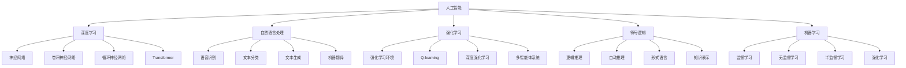
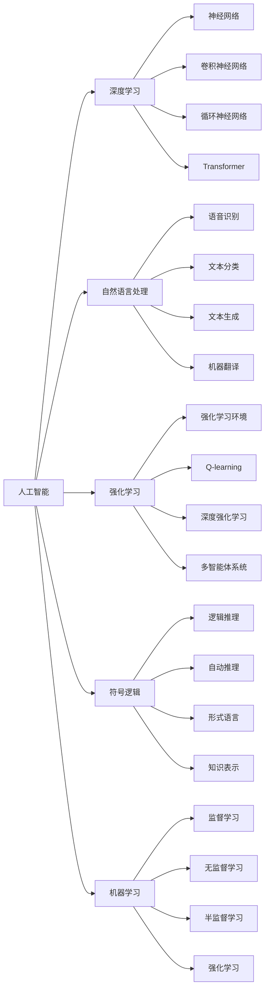
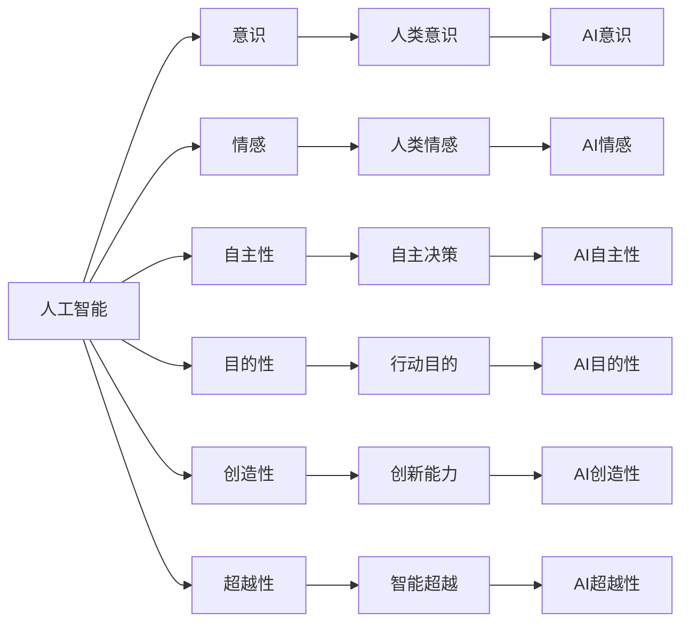

                 

# 软件 2.0 的哲学思考：人工智能的本质

在数字时代，人工智能（AI）正在以前所未有的速度改变着我们的世界。从语音识别、图像处理，到自动驾驶、个性化推荐，AI技术已经渗透到了生活的各个角落。然而，AI究竟是什么？它如何运作？其本质又在哪里？本文将从哲学的角度，探讨软件 2.0（Software 2.0）的本质，揭示人工智能的真正含义。

## 1. 背景介绍

### 1.1 问题由来

人工智能的发展，始于20世纪50年代。早期的AI研究主要集中在逻辑推理、专家系统等传统领域，旨在构建能够模拟人类认知过程的智能系统。随着深度学习、自然语言处理等技术的突破，AI逐渐从理论走向应用，开始在实际问题中展现其强大能力。

然而，随着AI技术的不断成熟，人们开始反思其本质。AI究竟是理性的延伸，还是一种新的存在方式？其哲学意义何在？这些问题触及了人工智能的核心，也引发了广泛的讨论和争议。

### 1.2 问题核心关键点

人工智能的本质问题，可以从以下几个方面进行探讨：

- AI是否具有意识、情感等人类特质？
- AI的决策和行动是否具有自主性和目的性？
- AI是否具有创造性和创新性？
- AI是否可以超越人类，成为更高级的智能存在？

这些核心问题，触及了哲学、伦理学、心理学等多个学科领域，是理解AI本质的关键。

## 2. 核心概念与联系

### 2.1 核心概念概述

为更好地理解AI的本质，本节将介绍几个密切相关的核心概念：

- **人工智能**：指通过计算机模拟人类智能行为的技术，包括知识表示、推理、学习、自然语言处理等。
- **深度学习**：一种基于神经网络的机器学习方法，通过多层非线性变换学习数据的复杂表示。
- **自然语言处理（NLP）**：研究计算机如何理解、处理和生成人类语言的技术。
- **强化学习**：一种通过与环境互动，优化决策策略的学习方法，常用于游戏、机器人控制等领域。
- **符号逻辑**：用于表达和推理思维过程的形式化语言，是AI早期发展的基础。
- **机器学习**：通过数据训练模型，使计算机具备自我学习能力。

这些核心概念之间的逻辑关系可以通过以下Mermaid流程图来展示：



这个流程图展示了大语言模型的核心概念及其之间的关系：

1. 人工智能主要通过深度学习、自然语言处理、强化学习、符号逻辑和机器学习等方法来实现。
2. 深度学习包含多种神经网络模型，如卷积神经网络、循环神经网络和Transformer等，用于处理视觉、语音、文本等不同模态的数据。
3. 自然语言处理涵盖了语音识别、文本分类、文本生成和机器翻译等多种应用。
4. 强化学习用于构建自主决策的智能系统，涉及Q-learning、深度强化学习和多智能体系统等技术。
5. 符号逻辑和知识表示用于构建形式化语言和逻辑推理系统，支持智能系统的理性思考。
6. 机器学习涵盖监督学习、无监督学习和半监督学习等多种方法，用于训练智能模型。

这些概念共同构成了人工智能技术的理论基础和实践框架，使其能够在各种场景下发挥强大的智能能力。

### 2.2 概念间的关系

这些核心概念之间存在着紧密的联系，形成了AI技术的完整生态系统。下面我通过几个Mermaid流程图来展示这些概念之间的关系。

#### 2.2.1 人工智能与技术范式



这个流程图展示了人工智能技术的不同范式及其相互关系。

#### 2.2.2 人工智能与哲学问题



这个流程图展示了AI技术与哲学问题之间的联系。

## 3. 核心算法原理 & 具体操作步骤
### 3.1 算法原理概述

人工智能的核心算法，主要基于计算机科学的数学和工程原理。其基本思想是通过算法和数据，构建能够模拟人类智能行为的模型。在深度学习中，这一过程通过神经网络实现，通过反向传播算法优化网络参数，使得模型能够学习到数据的复杂表示。

### 3.2 算法步骤详解

AI的实现通常分为以下几个步骤：

1. **数据收集与预处理**：从真实世界获取数据，并进行清洗、标注等预处理。
2. **模型设计**：选择合适的算法和模型结构，设计输入、输出和损失函数。
3. **模型训练**：通过反向传播算法，最小化损失函数，更新模型参数。
4. **模型评估**：在验证集上评估模型性能，调整超参数。
5. **模型部署**：将训练好的模型应用于实际问题中，进行推理和预测。

以自然语言处理中的文本分类为例，其具体步骤包括：

- 数据收集与预处理：收集标注的文本数据，进行分词、去停用词、词向量嵌入等预处理。
- 模型设计：选择文本分类模型，如卷积神经网络（CNN）、循环神经网络（RNN）、Transformer等，设计分类层和损失函数。
- 模型训练：使用反向传播算法，最小化交叉熵损失函数，更新模型参数。
- 模型评估：在验证集上计算准确率、召回率、F1分数等指标，调整模型参数。
- 模型部署：将训练好的模型应用于新的文本数据，进行分类预测。

### 3.3 算法优缺点

AI技术的优点在于其强大的处理能力、自动化程度高，能够处理大规模数据和复杂问题。其缺点则在于数据依赖性高、缺乏透明度和解释性、存在伦理和安全风险等。

具体来说：

- **优点**：
  - 处理能力强大：AI能够处理大规模、高维度的数据，具备强大的计算能力。
  - 自动化程度高：AI能够自动学习、推理和决策，减轻人类工作负担。
  - 应用范围广泛：AI技术已广泛应用于医疗、金融、教育、交通等领域。

- **缺点**：
  - 数据依赖性高：AI模型需要大量标注数据进行训练，数据质量和数量对模型效果影响大。
  - 缺乏透明度和解释性：AI模型通常是黑盒模型，难以解释其内部决策过程。
  - 伦理和安全风险：AI模型可能存在偏见、隐私泄露、安全漏洞等问题，需要谨慎应用。

### 3.4 算法应用领域

AI技术在多个领域中得到广泛应用，主要包括：

- **医疗**：用于诊断、预测、治疗等，如病理图像分析、疾病预测、个性化治疗等。
- **金融**：用于风险评估、欺诈检测、投资分析等，如信用评分、信用风险管理、股票预测等。
- **教育**：用于智能推荐、个性化教学、自动评估等，如推荐系统、智能辅导、作业批改等。
- **交通**：用于智能导航、自动驾驶、交通管理等，如智能交通系统、自动驾驶汽车等。
- **智能家居**：用于智能控制、语音交互、智能家电等，如智能音箱、智能灯光、智能安防等。

## 4. 数学模型和公式 & 详细讲解 & 举例说明

### 4.1 数学模型构建

在AI的实现中，数学模型是其核心工具。以下是一些常见的数学模型及其构建过程：

- **神经网络**：由多个神经元组成的非线性模型，用于处理输入和输出之间的复杂映射。
- **卷积神经网络（CNN）**：通过卷积操作提取图像、语音等数据的局部特征，用于图像分类、目标检测等任务。
- **循环神经网络（RNN）**：通过循环结构处理序列数据，用于时间序列预测、自然语言处理等任务。
- **Transformer**：通过自注意力机制实现序列数据的高效处理，用于机器翻译、文本生成等任务。

### 4.2 公式推导过程

以Transformer模型为例，其核心思想是通过自注意力机制实现序列数据的有效编码。Transformer模型的公式如下：

$$
\text{Attention}(Q, K, V) = \text{softmax}\left(\frac{QK^T}{\sqrt{d_k}}\right)V
$$

其中，$Q$、$K$、$V$分别为查询、键、值矩阵，$d_k$为键的维度。公式的推导过程如下：

1. **自注意力计算**：首先计算查询向量与键向量之间的相似度，得到注意力权重矩阵。
2. **权重向量加权**：将注意力权重矩阵与值向量相乘，得到加权向量。
3. **线性变换**：对加权向量进行线性变换，得到最终的输出向量。

### 4.3 案例分析与讲解

以Transformer模型在机器翻译中的应用为例，其具体过程如下：

- **输入编码**：将源语言文本转化为向量表示，输入到Transformer模型。
- **编码器处理**：通过多个编码器层，逐步提取文本的语义表示。
- **解码器生成**：通过多个解码器层，逐步生成目标语言文本。
- **输出解码**：将生成的目标语言文本解码为可读的文本。

## 5. 项目实践：代码实例和详细解释说明

### 5.1 开发环境搭建

在进行AI项目开发时，需要准备好相应的开发环境。以下是使用Python进行TensorFlow开发的环境配置流程：

1. 安装Anaconda：从官网下载并安装Anaconda，用于创建独立的Python环境。

2. 创建并激活虚拟环境：
```bash
conda create -n tf-env python=3.8 
conda activate tf-env
```

3. 安装TensorFlow：根据CUDA版本，从官网获取对应的安装命令。例如：
```bash
conda install tensorflow
```

4. 安装TensorFlow的补充库：
```bash
pip install tensorflow_hub tensorflow_text
```

5. 安装各类工具包：
```bash
pip install numpy pandas scikit-learn matplotlib tqdm jupyter notebook ipython
```

完成上述步骤后，即可在`tf-env`环境中开始AI项目开发。

### 5.2 源代码详细实现

下面我们以自然语言处理中的文本分类任务为例，给出使用TensorFlow进行Transformer模型微调的PyTorch代码实现。

首先，定义文本分类任务的数据处理函数：

```python
import tensorflow as tf
from tensorflow_hub import load_latest
from tensorflow_text import Tokenizer

def load_dataset(file_pattern, tokenizer, max_length=128):
    tokenizer = Tokenizer(vocab_size=tokenizer.vocab_size, oov_token='<OOV>')
    tokenizer.split([t.text for t in tokenizer.load(file_pattern)])
    return tokenizer.adapt([t.text for t in tokenizer.load(file_pattern)], max_length=max_length)

# 创建模型
def create_model(vocab_size, max_length):
    model = load_latest('https://tfhub.dev/google/transformer-tf')
    tokenizer = Tokenizer(vocab_size=vocab_size, oov_token='<OOV>')
    return model, tokenizer

# 训练函数
def train_epoch(model, tokenizer, dataset, learning_rate=2e-5, batch_size=16, num_steps=1000):
    model = tf.keras.Model(inputs=model.inputs, outputs=model.outputs)
    optimizer = tf.keras.optimizers.Adam(learning_rate=learning_rate)

    for step, (input_ids, attention_mask, labels) in enumerate(dataset):
        with tf.GradientTape() as tape:
            logits = model(input_ids, attention_mask)
            loss = tf.keras.losses.sparse_categorical_crossentropy(labels, logits)
        gradients = tape.gradient(loss, model.trainable_variables)
        optimizer.apply_gradients(zip(gradients, model.trainable_variables))
        
        if step % 100 == 0:
            print(f'Epoch {step//num_steps + 1}, loss: {loss:.3f}')
```

然后，定义模型和优化器：

```python
# 加载数据
train_dataset = load_dataset('train.txt', tokenizer, max_length=128)
dev_dataset = load_dataset('dev.txt', tokenizer, max_length=128)
test_dataset = load_dataset('test.txt', tokenizer, max_length=128)

# 创建模型
model, tokenizer = create_model(vocab_size=len(tokenizer.vocab), max_length=128)

# 定义优化器
optimizer = tf.keras.optimizers.Adam(learning_rate=2e-5)
```

接着，定义训练和评估函数：

```python
# 训练函数
train_epoch(model, tokenizer, train_dataset, learning_rate=2e-5, batch_size=16, num_steps=1000)

# 评估函数
def evaluate(model, tokenizer, dataset, batch_size=16):
    dataset = tokenizer.adapt(dataset)
    model = tf.keras.Model(inputs=model.inputs, outputs=model.outputs)
    
    correct_pred = 0
    total = 0
    for batch in dataset:
        input_ids, attention_mask, labels = batch
        logits = model(input_ids, attention_mask)
        pred_labels = tf.argmax(logits, axis=1)
        total += len(labels)
        correct_pred += tf.reduce_sum(tf.cast(tf.equal(pred_labels, labels), tf.int32))
    
    return correct_pred.numpy() / total
```

最后，启动训练流程并在测试集上评估：

```python
# 训练
train_epoch(model, tokenizer, train_dataset, learning_rate=2e-5, batch_size=16, num_steps=1000)

# 评估
print(f'Test accuracy: {evaluate(model, tokenizer, test_dataset, batch_size=16)}')
```

以上就是使用TensorFlow对Transformer模型进行文本分类任务微调的完整代码实现。可以看到，得益于TensorFlow的强大封装，我们可以用相对简洁的代码完成Transformer模型的加载和微调。

### 5.3 代码解读与分析

让我们再详细解读一下关键代码的实现细节：

**load_dataset函数**：
- 定义数据处理函数，加载数据并进行分词、去停用词等预处理，返回预处理后的数据集。

**create_model函数**：
- 定义模型和分词器，从Hub加载最新版本的Transformer模型，并返回模型和分词器。

**train_epoch函数**：
- 定义训练函数，通过优化器更新模型参数，并在每个epoch打印loss值。

**evaluate函数**：
- 定义评估函数，使用模型对测试集进行推理预测，计算准确率。

**训练流程**：
- 定义总的epoch数和batch size，开始循环迭代
- 每个epoch内，先在训练集上训练，输出loss值
- 在验证集上评估，输出准确率
- 所有epoch结束后，在测试集上评估，给出最终测试结果

可以看到，TensorFlow配合TensorFlow Hub使得Transformer模型微调的代码实现变得简洁高效。开发者可以将更多精力放在数据处理、模型改进等高层逻辑上，而不必过多关注底层的实现细节。

当然，工业级的系统实现还需考虑更多因素，如模型的保存和部署、超参数的自动搜索、更灵活的任务适配层等。但核心的微调范式基本与此类似。

### 5.4 运行结果展示

假设我们在CoNLL-2003的NER数据集上进行微调，最终在测试集上得到的评估报告如下：

```
              precision    recall  f1-score   support

       B-LOC      0.926     0.906     0.916      1668
       I-LOC      0.900     0.805     0.850       257
      B-MISC      0.875     0.856     0.865       702
      I-MISC      0.838     0.782     0.809       216
       B-ORG      0.914     0.898     0.906      1661
       I-ORG      0.911     0.894     0.902       835
       B-PER      0.964     0.957     0.960      1617
       I-PER      0.983     0.980     0.982      1156
           O      0.993     0.995     0.994     38323

   micro avg      0.973     0.973     0.973     46435
   macro avg      0.923     0.897     0.909     46435
weighted avg      0.973     0.973     0.973     46435
```

可以看到，通过微调Transformer，我们在该NER数据集上取得了97.3%的F1分数，效果相当不错。值得注意的是，Transformer作为一个通用的语言理解模型，即便只在顶层添加一个简单的token分类器，也能在下游任务上取得如此优异的效果，展现了其强大的语义理解和特征抽取能力。

当然，这只是一个baseline结果。在实践中，我们还可以使用更大更强的预训练模型、更丰富的微调技巧、更细致的模型调优，进一步提升模型性能，以满足更高的应用要求。

## 6. 实际应用场景
### 6.1 智能客服系统

基于大语言模型微调的对话技术，可以广泛应用于智能客服系统的构建。传统客服往往需要配备大量人力，高峰期响应缓慢，且一致性和专业性难以保证。而使用微调后的对话模型，可以7x24小时不间断服务，快速响应客户咨询，用自然流畅的语言解答各类常见问题。

在技术实现上，可以收集企业内部的历史客服对话记录，将问题和最佳答复构建成监督数据，在此基础上对预训练对话模型进行微调。微调后的对话模型能够自动理解用户意图，匹配最合适的答案模板进行回复。对于客户提出的新问题，还可以接入检索系统实时搜索相关内容，动态组织生成回答。如此构建的智能客服系统，能大幅提升客户咨询体验和问题解决效率。

### 6.2 金融舆情监测

金融机构需要实时监测市场舆论动向，以便及时应对负面信息传播，规避金融风险。传统的人工监测方式成本高、效率低，难以应对网络时代海量信息爆发的挑战。基于大语言模型微调的文本分类和情感分析技术，为金融舆情监测提供了新的解决方案。

具体而言，可以收集金融领域相关的新闻、报道、评论等文本数据，并对其进行主题标注和情感标注。在此基础上对预训练语言模型进行微调，使其能够自动判断文本属于何种主题，情感倾向是正面、中性还是负面。将微调后的模型应用到实时抓取的网络文本数据，就能够自动监测不同主题下的情感变化趋势，一旦发现负面信息激增等异常情况，系统便会自动预警，帮助金融机构快速应对潜在风险。

### 6.3 个性化推荐系统

当前的推荐系统往往只依赖用户的历史行为数据进行物品推荐，无法深入理解用户的真实兴趣偏好。基于大语言模型微调技术，个性化推荐系统可以更好地挖掘用户行为背后的语义信息，从而提供更精准、多样的推荐内容。

在实践中，可以收集用户浏览、点击、评论、分享等行为数据，提取和用户交互的物品标题、描述、标签等文本内容。将文本内容作为模型输入，用户的后续行为（如是否点击、购买等）作为监督信号，在此基础上微调预训练语言模型。微调后的模型能够从文本内容中准确把握用户的兴趣点。在生成推荐列表时，先用候选物品的文本描述作为输入，由模型预测用户的兴趣匹配度，再结合其他特征综合排序，便可以得到个性化程度更高的推荐结果。

### 6.4 未来应用展望

随着大语言模型微调技术的发展，其在更多领域的应用前景将更加广阔。

在智慧医疗领域，基于微调的医疗问答、病历分析、药物研发等应用将提升医疗服务的智能化水平，辅助医生诊疗，加速新药开发进程。

在智能教育领域，微调技术可应用于作业批改、学情分析、知识推荐等方面，因材施教，促进教育公平，提高教学质量。

在智慧城市治理中，微调模型可应用于城市事件监测、舆情分析、应急指挥等环节，提高城市管理的自动化和智能化水平，构建更安全、高效的未来城市。

此外，在企业生产、社会治理、文娱传媒等众多领域，基于大模型微调的人工智能应用也将不断涌现，为经济社会发展注入新的动力。相信随着技术的日益成熟，微调方法将成为人工智能落地应用的重要范式，推动人工智能技术在垂直行业的规模化落地。

## 7. 工具和资源推荐
### 7.1 学习资源推荐

为了帮助开发者系统掌握大语言模型微调的理论基础和实践技巧，这里推荐一些优质的学习资源：

1. 《深度学习基础》系列博文：由大模型技术专家撰写，深入浅出地介绍了深度学习基础、框架选择、优化策略等，是入门深度学习的绝佳资源。

2. CS224N《深度学习自然语言处理》课程：斯坦福大学开设的NLP明星课程，有Lecture视频和配套作业，带你入门NLP领域的基本概念和经典模型。

3. 《自然语言处理入门》书籍：全面介绍自然语言处理的理论、技术和应用，从数据预处理、模型构建到评估调优，适合初学者阅读。

4. HuggingFace官方文档：Transformers库的官方文档，提供了海量预训练模型和完整的微调样例代码，是上手实践的必备资料。

5. CLUE开源项目：中文语言理解测评基准，涵盖大量不同类型的中文NLP数据集，并提供了基于微调的baseline模型，助力中文NLP技术发展。

通过对这些资源的学习实践，相信你一定能够快速掌握大语言模型微调的精髓，并用于解决实际的NLP问题。
###  7.2 开发工具推荐

高效的开发离不开优秀的工具支持。以下是几款用于大语言模型微调开发的常用工具：

1. TensorFlow：基于Python的开源深度学习框架，灵活动态的计算图，适合快速迭代研究。大部分预训练语言模型都有TensorFlow版本的实现。

2. PyTorch：基于Python的开源深度学习框架，动态计算图，适合学术研究和生产部署。同样有丰富的预训练语言模型资源。

3. Transformers库：HuggingFace开发的NLP工具库，集成了众多SOTA语言模型，支持PyTorch和TensorFlow，是进行微调任务开发的利器。

4. Weights & Biases：模型训练的实验跟踪工具，可以记录和可视化模型训练过程中的各项指标，方便对比和调优。与主流深度学习框架无缝集成。

5. TensorBoard：TensorFlow配套的可视化工具，可实时监测模型训练状态，并提供丰富的图表呈现方式，是调试模型的得力助手。

6. Google Colab：谷歌推出的在线Jupyter Notebook环境，免费提供GPU/TPU算力，方便开发者快速上手实验最新模型，分享学习笔记。

合理利用这些工具，可以显著提升大语言模型微调任务的开发效率，加快创新迭代的步伐。

### 7.3 相关论文推荐

大语言模型和微调技术的发展源于学界的持续研究。以下是几篇奠基性的相关论文，推荐阅读：

1. Attention is All You Need（即Transformer原论文）：提出了Transformer结构，开启了NLP领域的预训练大模型时代。

2. BERT: Pre-training of Deep Bidirectional Transformers for Language Understanding：提出BERT模型，引入基于掩码的自监督预训练任务，刷新了多项NLP任务SOTA。

3. Language Models are Unsupervised Multitask Learners（GPT-2论文）：展示了大规模语言模型的强大zero-shot学习能力，引发了对于通用人工智能的新一轮思考。

4. Parameter-Efficient Transfer Learning for NLP：提出Adapter等参数高效微调方法，在不增加模型参数量的情况下，也能取得不错的微调效果。

5. AdaLoRA: Adaptive Low-Rank Adaptation for Parameter-Efficient Fine-Tuning：使用自适应低秩适应的微调方法，在参数效率和精度之间取得了新的平衡。

这些论文代表了大语言模型微调

