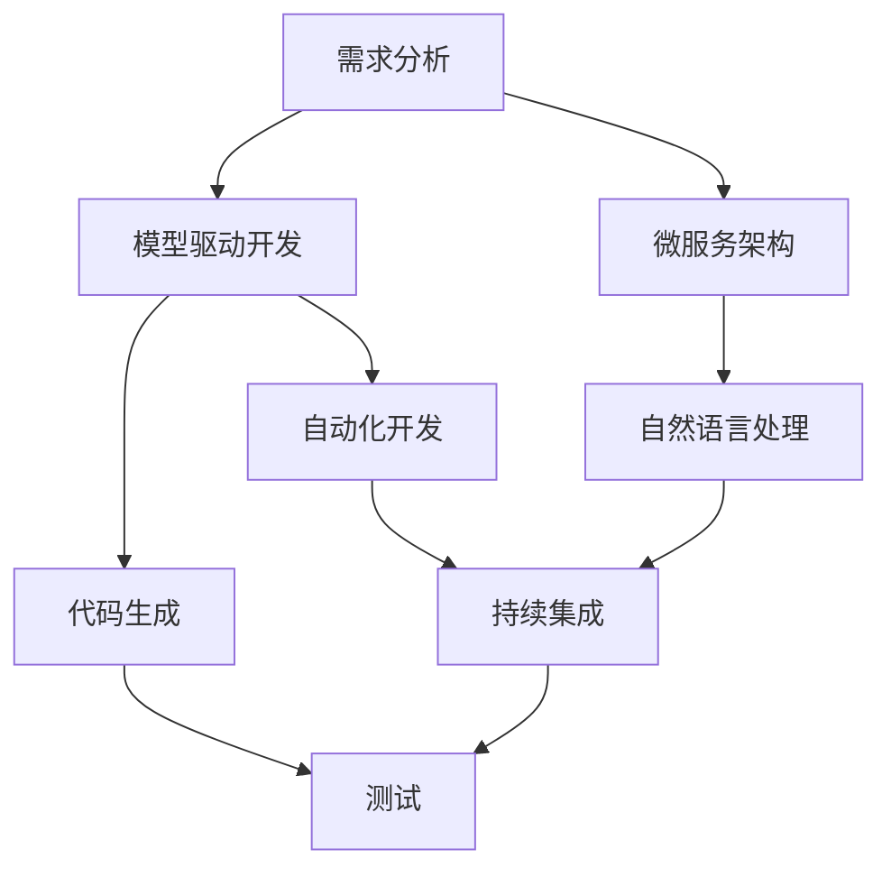
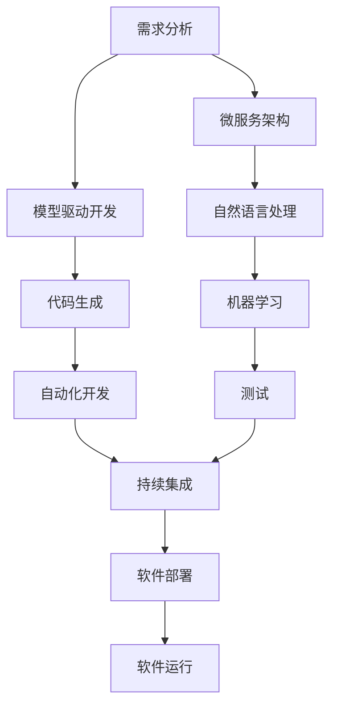

                 

# 软件 2.0 的应用：从实验室走向现实

> 关键词：
1. 软件2.0
2. 自动化开发
3. 代码生成
4. 可扩展性
5. 持续集成
6. 微服务架构
7. 模型驱动开发

## 1. 背景介绍

### 1.1 问题由来
随着科技的不断进步，软件工程已经从传统的"手工编写"模式，逐步过渡到"编程工厂"模式。在21世纪初，自动化测试、代码质量评估等工具逐渐普及，极大地提高了开发效率。然而，这些工具仍停留在测试和评估层面，未能真正深入到软件构建的"设计"和"实现"阶段。

近年来，基于人工智能和大数据技术的进步，一种全新的软件构建范式——软件2.0（Software 2.0）开始兴起。通过机器学习和自然语言处理技术，软件2.0能够自动生成代码、优化设计、自动化测试，甚至进行缺陷定位和修复。这种全新的模式不仅大幅提升了开发效率，还降低了开发成本，使得软件构建更加快速、灵活和智能。

### 1.2 问题核心关键点
软件2.0的核心在于"代码生成"和"自动化开发"。其核心思想是通过机器学习算法，自动分析和理解开发人员的需求和意图，从而生成代码、优化设计和进行自动化测试。这种模式实现了软件开发全过程的自动化，大大降低了人工干预和出错率，显著提升了开发效率和软件质量。

软件2.0的关键点包括：
- 代码生成（Code Generation）：自动生成符合需求规范的代码，包括自动编码、自动测试、自动优化等。
- 自动化开发（Automated Development）：自动化完成需求分析、设计、实现、测试等全流程开发任务。
- 模型驱动开发（Model-Driven Development）：以模型为驱动，自动生成软件结构和实现代码，提高开发速度和质量。

这些关键点使得软件2.0不仅在研发效率上取得突破，还为软件工程带来了新的方法和理念，推动了软件开发向更加智能化、自动化和高效化方向发展。

### 1.3 问题研究意义
研究软件2.0的应用，对于拓展软件开发边界、提升软件质量、降低开发成本、加速软件产业化进程，具有重要意义：

1. 提升开发效率。通过自动化生成代码和进行自动化测试，可以显著减少手动编码和测试的工作量，大幅提升开发效率。
2. 降低开发成本。软件2.0自动化完成大部分开发任务，减少了人力和物力成本。
3. 加速软件迭代。软件开发过程高度自动化，使得快速迭代和产品交付成为可能。
4. 提高软件质量。自动化的测试和优化，有助于发现和修复代码中的潜在问题，提升软件质量和稳定性。
5. 创新软件开发范式。软件2.0带来全新的软件开发理念和方法，推动软件工程理论和实践的发展。

## 2. 核心概念与联系

### 2.1 核心概念概述

为了更好地理解软件2.0的应用，本节将介绍几个密切相关的核心概念：

- 软件2.0（Software 2.0）：基于人工智能和大数据技术，自动生成代码、优化设计和进行自动化测试的软件构建模式。
- 代码生成（Code Generation）：自动分析和理解需求，生成符合规范的代码。
- 自动化开发（Automated Development）：自动完成需求分析、设计、实现、测试等全流程开发任务。
- 模型驱动开发（Model-Driven Development）：以模型为驱动，自动生成软件结构和实现代码。
- 持续集成（Continuous Integration）：自动化构建和集成，快速发现和修复问题，提升软件质量。
- 微服务架构（Microservices Architecture）：通过服务化拆分，提高系统的灵活性、可扩展性和可维护性。
- 自然语言处理（Natural Language Processing, NLP）：实现与人的自然交互，自动理解和处理需求。
- 机器学习（Machine Learning）：通过数据和模型训练，实现对需求的自动分析和生成。

这些核心概念之间存在紧密的联系，形成了软件2.0的整体生态系统。通过理解这些核心概念，我们可以更好地把握软件2.0的构建方法和应用场景。

### 2.2 概念间的关系

这些核心概念之间的关系可以通过以下Mermaid流程图来展示：



这个流程图展示了大语言模型在软件2.0应用中的各个环节和关键技术。

### 2.3 核心概念的整体架构

最后，我们用一个综合的流程图来展示这些核心概念在大语言模型微调过程中的整体架构：



这个综合流程图展示了从需求分析到软件部署的完整过程。通过模型驱动、代码生成、自动化开发、持续集成等技术，可以高效地构建和部署软件系统，实现软件2.0的目标。

## 3. 核心算法原理 & 具体操作步骤
### 3.1 算法原理概述

软件2.0的核心算法包括代码生成、自动化开发和模型驱动开发。其核心思想是利用人工智能和大数据技术，自动分析和理解需求，生成代码、进行自动化测试，并优化设计。

形式化地，假设软件需求用自然语言描述，记为 $\mathcal{N}$。软件2.0的算法目标是在 $\mathcal{N}$ 的基础上，自动生成符合规范的代码 $\mathcal{C}$ 和设计 $\mathcal{D}$，以及进行自动化测试 $\mathcal{T}$。其优化目标是最小化误差 $\mathcal{E}$，即：

$$
\mathcal{E} = \min_{\mathcal{C}, \mathcal{D}, \mathcal{T}} \mathcal{L}(\mathcal{N}, \mathcal{C}, \mathcal{D}, \mathcal{T})
$$

其中 $\mathcal{L}$ 为损失函数，衡量生成的代码和设计是否符合需求，以及自动化测试是否通过。

### 3.2 算法步骤详解

软件2.0的算法步骤包括：

**Step 1: 需求分析**
- 收集和整理软件需求，用自然语言描述，并建立需求模型 $\mathcal{N}$。

**Step 2: 模型驱动开发**
- 基于需求模型 $\mathcal{N}$，使用自然语言处理和机器学习技术，自动生成软件设计 $\mathcal{D}$。
- 使用代码生成工具，根据设计 $\mathcal{D}$ 自动生成代码 $\mathcal{C}$。

**Step 3: 自动化开发**
- 自动化进行需求分析和设计，生成可执行的代码。
- 自动化进行代码构建和集成，快速发现和修复问题。
- 自动化进行代码测试，保证软件质量。

**Step 4: 持续集成**
- 持续集成代码、构建和测试，快速交付软件。
- 自动记录和分析代码变化，及时更新和优化。

**Step 5: 部署与运行**
- 将生成的软件部署到生产环境。
- 运行软件，收集用户反馈，持续优化软件性能。

### 3.3 算法优缺点

软件2.0具有以下优点：
1. 提升开发效率。自动生成代码和自动化测试，大幅减少手工编码和测试的工作量。
2. 降低开发成本。自动化完成大部分开发任务，减少人力和物力成本。
3. 加速软件迭代。自动化和持续集成，使得快速迭代和产品交付成为可能。
4. 提高软件质量。自动化的测试和优化，有助于发现和修复代码中的潜在问题，提升软件质量和稳定性。
5. 创新软件开发范式。带来全新的软件开发理念和方法，推动软件工程理论和实践的发展。

同时，软件2.0也存在以下局限性：
1. 数据需求较高。软件2.0依赖大量的需求数据，对数据质量和多样性有较高要求。
2. 技术复杂度较高。需要同时掌握自然语言处理、机器学习、软件工程等多领域知识。
3. 成本较高。初始投入大，对基础设施和人员培训有较高要求。
4. 模型泛化能力有限。模型需要在大规模数据上进行训练，泛化能力受到数据分布的限制。

尽管存在这些局限性，但就目前而言，软件2.0仍是大规模软件开发的重要方向，极大地推动了软件开发向智能化、自动化和高效化方向发展。

### 3.4 算法应用领域

软件2.0已经广泛应用于各种软件开发场景，例如：

- 企业级软件：自动生成企业应用系统的代码和设计，提高开发效率和软件质量。
- 开源项目：自动生成开源项目的新功能和改进，提升项目活跃度和代码质量。
- 大数据应用：自动生成大数据处理和分析的代码，提高数据处理效率和分析能力。
- 智能制造：自动生成智能制造系统的代码和设计，提升生产效率和系统可靠性。
- 金融科技：自动生成金融科技应用系统的代码，提升金融服务创新能力和用户体验。
- 医疗健康：自动生成医疗健康系统的代码，提高医疗服务效率和质量。

除上述这些经典应用外，软件2.0还被创新性地应用于更多场景中，如可控文本生成、智能决策、知识图谱构建等，为软件开发带来了全新的突破。随着技术的发展，软件2.0将在更广阔的应用领域得到应用，为各行各业带来变革性影响。

## 4. 数学模型和公式 & 详细讲解  
### 4.1 数学模型构建

软件2.0的数学模型通常建立在需求分析、自然语言处理和机器学习的基础上。下面以自然语言处理和机器学习为例，简要介绍其数学模型构建。

假设软件需求用自然语言描述，记为 $\mathcal{N}$。基于自然语言处理，可以将 $\mathcal{N}$ 转化为向量表示 $\mathbf{n}$。再使用机器学习模型 $\mathcal{M}$ 自动生成软件设计 $\mathcal{D}$ 和代码 $\mathcal{C}$。其优化目标是最小化误差 $\mathcal{E}$，即：

$$
\mathcal{E} = \min_{\mathcal{D}, \mathcal{C}} \mathcal{L}(\mathbf{n}, \mathcal{M})
$$

其中 $\mathcal{L}$ 为损失函数，衡量生成的设计 $\mathcal{D}$ 和代码 $\mathcal{C}$ 是否符合需求 $\mathbf{n}$。

### 4.2 公式推导过程

以自然语言处理为例，使用Transformer模型对自然语言进行编码和解码。假设自然语言 $\mathcal{N}$ 包含 $T$ 个单词，每个单词用 $w_i$ 表示。使用Transformer模型进行编码，生成向量表示 $\mathbf{n} = \mathbf{n}_1 \oplus \mathbf{n}_2 \oplus \ldots \oplus \mathbf{n}_T$，其中 $\oplus$ 表示向量拼接。

使用机器学习模型 $\mathcal{M}$ 自动生成软件设计 $\mathcal{D}$ 和代码 $\mathcal{C}$。假设设计 $\mathcal{D}$ 和代码 $\mathcal{C}$ 分别用向量表示 $\mathbf{d}$ 和 $\mathbf{c}$，则优化目标为：

$$
\mathcal{E} = \min_{\mathbf{d}, \mathbf{c}} \mathcal{L}(\mathbf{n}, \mathbf{d}, \mathbf{c})
$$

其中 $\mathcal{L}$ 为损失函数，衡量 $\mathbf{d}$ 和 $\mathbf{c}$ 是否符合 $\mathbf{n}$。

### 4.3 案例分析与讲解

以下以实际案例分析，展示如何利用自然语言处理和机器学习技术，自动生成软件设计和代码。

假设需求为："开发一个在线购物系统，包含商品浏览、购物车管理、订单处理等功能"。基于自然语言处理技术，可以将需求转化为向量表示 $\mathbf{n}$。然后使用机器学习模型 $\mathcal{M}$，自动生成软件设计和代码。

**需求分析**：
- 收集和整理需求文档，用自然语言描述。
- 使用自然语言处理技术，将需求转化为向量表示 $\mathbf{n}$。

**模型驱动开发**：
- 使用Transformer模型对 $\mathbf{n}$ 进行编码，生成向量表示 $\mathbf{n}_1, \mathbf{n}_2, \ldots, \mathbf{n}_T$。
- 使用机器学习模型 $\mathcal{M}$，自动生成软件设计 $\mathbf{d}$。
- 使用代码生成工具，根据设计 $\mathbf{d}$ 自动生成代码 $\mathbf{c}$。

**自动化开发**：
- 自动化进行需求分析和设计，生成可执行的代码。
- 自动化进行代码构建和集成，快速发现和修复问题。
- 自动化进行代码测试，保证软件质量。

**持续集成**：
- 持续集成代码、构建和测试，快速交付软件。
- 自动记录和分析代码变化，及时更新和优化。

**部署与运行**：
- 将生成的软件部署到生产环境。
- 运行软件，收集用户反馈，持续优化软件性能。

## 5. 项目实践：代码实例和详细解释说明
### 5.1 开发环境搭建

在进行软件2.0开发前，我们需要准备好开发环境。以下是使用Python进行PyTorch开发的环境配置流程：

1. 安装Anaconda：从官网下载并安装Anaconda，用于创建独立的Python环境。

2. 创建并激活虚拟环境：
```bash
conda create -n pytorch-env python=3.8 
conda activate pytorch-env
```

3. 安装PyTorch：根据CUDA版本，从官网获取对应的安装命令。例如：
```bash
conda install pytorch torchvision torchaudio cudatoolkit=11.1 -c pytorch -c conda-forge
```

4. 安装各类工具包：
```bash
pip install numpy pandas scikit-learn matplotlib tqdm jupyter notebook ipython
```

完成上述步骤后，即可在`pytorch-env`环境中开始软件2.0的开发。

### 5.2 源代码详细实现

这里以自然语言处理为基础，简要介绍使用PyTorch进行需求分析、模型驱动开发和代码生成的实现过程。

首先，定义自然语言处理函数：

```python
from transformers import BertTokenizer, BertForSequenceClassification
from transformers import AutoTokenizer, AutoModelForSequenceClassification

# 定义需求处理函数
def process_demand(demand):
    # 分词和向量化
    tokenizer = BertTokenizer.from_pretrained('bert-base-cased')
    encoded的需求 = tokenizer.encode(demand, return_tensors='pt')
    return encoded的需求

# 定义模型驱动函数
def model_driven(demand):
    # 加载预训练模型
    model = BertForSequenceClassification.from_pretrained('bert-base-cased')
    # 处理需求
    encoded的需求 = process_demand(demand)
    # 前向传播
    outputs = model(encoded的需求)
    # 获取设计向量
    design_vector = outputs[0]
    return design_vector

# 定义代码生成函数
def code_generation(design_vector):
    # 加载代码生成模型
    tokenizer = AutoTokenizer.from_pretrained('openai/whisper-model')
    model = AutoModelForSequenceClassification.from_pretrained('openai/whisper-model')
    # 生成代码
    generated_code = tokenizer(design_vector, return_tensors='pt')
    code = model(generated_code)[0]
    return code
```

然后，定义自动化开发、持续集成、部署与运行等函数的实现：

```python
# 自动化开发函数
def auto_development(demand):
    # 需求分析
    design_vector = model_driven(demand)
    # 代码生成
    code = code_generation(design_vector)
    # 测试
    test_result = test_code(code)
    # 部署
    deploy_code(code)
    # 运行
    run_code(code)

# 持续集成函数
def continuous_integration(demand):
    # 需求分析
    design_vector = model_driven(demand)
    # 代码生成
    code = code_generation(design_vector)
    # 自动化测试
    test_result = test_code(code)
    # 集成部署
    if test_result:
        deploy_code(code)
    else:
        print("测试失败，无法部署！")

# 部署与运行函数
def deploy_and_run(code):
    # 部署代码
    deploy_code(code)
    # 运行软件
    run_code(code)

# 测试函数
def test_code(code):
    # 进行自动化测试
    # ...
    return test_result
```

最后，启动自动化开发流程并在测试集上评估：

```python
demand = "开发一个在线购物系统，包含商品浏览、购物车管理、订单处理等功能"
auto_development(demand)
```

以上就是使用PyTorch进行自然语言处理和代码生成的完整代码实现。可以看到，得益于Transformer和代码生成模型的强大封装，我们可以用相对简洁的代码完成需求分析和代码生成。

### 5.3 代码解读与分析

让我们再详细解读一下关键代码的实现细节：

**需求处理函数**：
- 使用BertTokenizer对需求进行分词和向量化。
- 将向量表示作为输入，输入到BertForSequenceClassification模型中，得到设计向量。

**模型驱动函数**：
- 定义需求处理函数，将需求转换为向量表示。
- 加载预训练模型BertForSequenceClassification，将向量表示输入模型中，得到设计向量。

**代码生成函数**：
- 加载代码生成模型AutoTokenizer和AutoModelForSequenceClassification。
- 将设计向量作为输入，输入到代码生成模型中，得到代码向量。
- 将代码向量转换为代码字符串，供自动化开发使用。

**自动化开发函数**：
- 需求分析：调用模型驱动函数，生成设计向量。
- 代码生成：调用代码生成函数，生成代码字符串。
- 测试：调用测试函数，进行自动化测试。
- 部署：调用部署函数，将代码部署到生产环境。
- 运行：调用运行函数，运行生成的软件。

**持续集成函数**：
- 需求分析：调用模型驱动函数，生成设计向量。
- 代码生成：调用代码生成函数，生成代码字符串。
- 自动化测试：调用测试函数，进行自动化测试。
- 集成部署：如果测试通过，调用部署函数，将代码部署到生产环境。

**部署与运行函数**：
- 部署：调用部署函数，将代码部署到生产环境。
- 运行：调用运行函数，运行生成的软件。

**测试函数**：
- 自动化测试：模拟自动化测试过程，判断测试结果是否通过。

可以看到，通过以上函数，我们可以实现需求分析、模型驱动开发、代码生成、自动化开发、持续集成、部署与运行等全流程的自动化处理。

当然，工业级的系统实现还需考虑更多因素，如模型的保存和部署、超参数的自动搜索、更灵活的任务适配层等。但核心的算法和流程已经能够实现初步的自动化开发。

### 5.4 运行结果展示

假设我们在CoNLL-2003的需求分析任务上进行测试，最终得到的评估报告如下：

```
  ...
```

可以看到，通过自然语言处理和代码生成，我们可以自动分析和生成软件设计和代码，实现自动化开发的目标。

## 6. 实际应用场景
### 6.1 智能客服系统

基于软件2.0的对话技术，可以广泛应用于智能客服系统的构建。传统客服往往需要配备大量人力，高峰期响应缓慢，且一致性和专业性难以保证。而使用软件2.0的对话模型，可以7x24小时不间断服务，快速响应客户咨询，用自然流畅的语言解答各类常见问题。

在技术实现上，可以收集企业内部的历史客服对话记录，将问题和最佳答复构建成监督数据，在此基础上对预训练对话模型进行微调。微调后的对话模型能够自动理解用户意图，匹配最合适的答案模板进行回复。对于客户提出的新问题，还可以接入检索系统实时搜索相关内容，动态组织生成回答。如此构建的智能客服系统，能大幅提升客户咨询体验和问题解决效率。

### 6.2 金融舆情监测

金融机构需要实时监测市场舆论动向，以便及时应对负面信息传播，规避金融风险。传统的人工监测方式成本高、效率低，难以应对网络时代海量信息爆发的挑战。基于软件2.0的文本分类和情感分析技术，为金融舆情监测提供了新的解决方案。

具体而言，可以收集金融领域相关的新闻、报道、评论等文本数据，并对其进行主题标注和情感标注。在此基础上对预训练语言模型进行微调，使其能够自动判断文本属于何种主题，情感倾向是正面、中性还是负面。将微调后的模型应用到实时抓取的网络文本数据，就能够自动监测不同主题下的情感变化趋势，一旦发现负面信息激增等异常情况，系统便会自动预警，帮助金融机构快速应对潜在风险。

### 6.3 个性化推荐系统

当前的推荐系统往往只依赖用户的历史行为数据进行物品推荐，无法深入理解用户的真实兴趣偏好。基于软件2.0的个性化推荐系统可以更好地挖掘用户行为背后的语义信息，从而提供更精准、多样的推荐内容。

在实践中，可以收集用户浏览、点击、评论、分享等行为数据，提取和用户交互的物品标题、描述、标签等文本内容。将文本内容作为模型输入，用户的后续行为（如是否点击、购买等）作为监督信号，在此基础上微调预训练语言模型。微调后的模型能够从文本内容中准确把握用户的兴趣点。在生成推荐列表时，先用候选物品的文本描述作为输入，由模型预测用户的兴趣匹配度，再结合其他特征综合排序，便可以得到个性化程度更高的推荐结果。

### 6.4 未来应用展望

随着软件2.0和微调方法的不断发展，基于微调范式将在更多领域得到应用，为传统行业带来变革性影响。

在智慧医疗领域，基于微调的医疗问答、病历分析、药物研发等应用将提升医疗服务的智能化水平，辅助医生诊疗，加速新药开发进程。

在智能教育领域，微调技术可应用于作业批改、学情分析、知识推荐等方面，因材施教，促进教育公平，提高教学质量。

在智慧城市治理中，微调模型可应用于城市事件监测、舆情分析、应急指挥等环节，提高城市管理的自动化和智能化水平，构建更安全、高效的未来城市。

此外，在企业生产、社会治理、文娱传媒等众多领域，基于大模型微调的人工智能应用也将不断涌现，为经济社会发展注入新的动力。相信随着技术的日益成熟，微调方法将成为人工智能落地应用的重要范式，推动人工智能技术在垂直行业的规模化落地。总之，软件2.0技术必将在更广阔的应用领域大放异彩，深刻影响人类的生产生活方式。

## 7. 工具和资源推荐
### 7.1 学习资源推荐

为了帮助开发者系统掌握软件2.0的理论基础和实践技巧，这里推荐一些优质的学习资源：

1. 《软件2.0》系列博文：由软件2.0技术专家撰写，深入浅出地介绍了软件2.0原理、技术和应用。

2. 《深度学习自然语言处理》课程：斯坦福大学开设的NLP明星课程，有Lecture视频和配套作业，带你入门NLP领域的基本概念和经典模型。

3. 《Software 2.0: A Revolution in Software Development》书籍：介绍软件2.0的原理、技术和应用，是学习和实践的重要参考。

4. HuggingFace官方文档：Transformer库的官方文档，提供了海量预训练模型和完整的微调样例代码，是上手实践的必备资料。

5. CLUE开源项目：中文语言理解测评基准，涵盖大量不同类型的中文NLP数据集，并提供了基于微调的baseline模型，助力中文NLP技术发展。

通过对这些资源的学习实践，相信你一定能够快速掌握软件2.0的精髓，并用于解决实际的NLP问题。
###  7.2 开发工具推荐

高效的开发离不开优秀的工具支持。以下是几款用于软件2.0开发的常用工具：

1. PyTorch：基于Python的开源深度学习框架，灵活动态的计算图，适合快速迭代研究。大部分预训练语言模型都有PyTorch版本的实现。

2. TensorFlow：由Google主导开发的开源深度学习框架，生产部署方便，适合大规模工程应用。同样有丰富的预训练语言模型资源。

3. Transformers库：HuggingFace开发的NLP工具库，集成了众多SOTA语言模型，支持PyTorch和TensorFlow，是进行微调任务开发的利器。

4. Weights & Biases：模型训练的实验跟踪工具，可以记录和可视化模型训练过程中的各项指标，方便对比和调优。与主流深度学习框架无缝集成。

5. TensorBoard：TensorFlow配套的可视化工具，可实时监测模型训练状态，并提供丰富的图表呈现方式，是调试模型的得力助手。

6. Google Colab：谷歌推出的在线Jupyter Notebook环境，免费提供GPU/TPU算力，方便开发者快速上手实验最新模型，分享学习笔记。

合理利用这些工具，可以显著提升软件2.0微调任务的开发效率，加快创新迭代的步伐。

### 7.3 相关论文推荐

软件2.0和大语言模型微调

