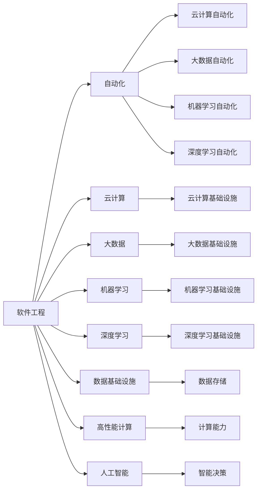

                 

# 软件 2.0 的时代：数据驱动一切

> 关键词：软件 2.0, 数据驱动, 机器学习, 深度学习, 自动化, 数据基础设施, 高性能计算, 人工智能, 云计算

## 1. 背景介绍

### 1.1 问题由来
在数字化转型的大潮中，软件行业经历了从软件 1.0 到软件 2.0 的跨越。软件 1.0 时代，软件开发依赖于人力的手工编码，软件系统的设计、开发、测试、运维都围绕着人工操作展开。而软件 2.0 时代，则是通过数据驱动的方式来优化软件开发的全流程。通过引入自动化、云计算、大数据、机器学习等技术，软件系统能够实现更高效的开发、更精准的决策、更可靠的运维。

软件 2.0 时代的关键是数据。在软件开发的全生命周期中，数据无处不在，从需求分析到需求实现、从测试到部署、从运维到优化，数据是驱动软件系统不断进化的核心动力。数据驱动的软件开发能够快速响应市场变化，持续迭代优化，提升软件系统的质量和效率。

### 1.2 问题核心关键点
数据驱动的软件开发关键在于以下几个方面：
1. 数据采集：通过自动化手段采集软件系统的运行数据，如日志、指标、用户行为等，形成统一的数据仓库。
2. 数据清洗：对采集到的数据进行清洗、去重、转换，确保数据质量。
3. 数据治理：建立完善的数据治理体系，包括数据标准、数据质量监控、数据权限管理等。
4. 数据分析：利用机器学习、深度学习等算法，对数据进行深度分析，挖掘潜在的规律和洞察。
5. 数据应用：基于分析结果，自动化地生成软件系统的配置、规则、决策等，实现数据驱动的自动优化。
6. 数据可视化：通过数据可视化工具，将分析结果和系统状态直观展示，帮助开发者快速理解和决策。

这些关键点构成了数据驱动软件开发的核心框架，使得软件系统能够在大数据和人工智能的助力下，实现更高层次的自动化和智能化。

### 1.3 问题研究意义
数据驱动的软件开发在软件行业中的应用，具有重要意义：

1. 提升开发效率：数据驱动使得软件开发从手工艺走向科学，通过分析数据，找到最优的开发路径，加速迭代。
2. 优化决策质量：数据驱动使得软件决策基于事实和数据，减少人工错误，提升决策的准确性和可解释性。
3. 增强系统可靠性：数据驱动使得系统运维自动化，及时发现问题并修复，减少系统故障和宕机时间。
4. 降低开发成本：数据驱动使得软件开发更具针对性，减少不必要的功能和成本，提高开发资源利用率。
5. 推动技术创新：数据驱动使得软件开发更注重数据质量和技术选择，推动新兴技术和创新方法的引入。
6. 提高竞争优势：数据驱动使得软件系统具有更强的市场适应能力和用户黏性，提升企业竞争优势。

数据驱动的软件开发已经成为软件行业的重要趋势，随着技术的不断进步和应用场景的扩展，其价值将日益凸显。

## 2. 核心概念与联系

### 2.1 核心概念概述

为了更好地理解数据驱动的软件开发方法，本节将介绍几个核心概念：

- 软件工程(Software Engineering)：通过科学方法和工程技术，实现软件的质量、效率和可维护性。
- 自动化(Automation)：通过自动化的工具和流程，减少人工干预，提升效率和准确性。
- 云计算(Cloud Computing)：利用互联网基础设施，提供可扩展的、按需使用的计算资源。
- 大数据(Big Data)：通过处理和分析海量数据，发现其中的规律和洞察。
- 机器学习(Machine Learning)：通过算法和模型，让计算机从数据中学习，提升决策和预测能力。
- 深度学习(Deep Learning)：一种机器学习技术，通过多层神经网络模型，实现更高级的特征提取和模式识别。
- 数据基础设施(Data Infrastructure)：支持数据收集、存储、处理、分析的软硬件环境。
- 高性能计算(High-Performance Computing, HPC)：通过并行计算和多核处理器，提升数据处理和计算能力。
- 人工智能(Artificial Intelligence, AI)：通过机器学习、深度学习等技术，模拟人类智能。

这些核心概念之间有着密切的联系，构成了数据驱动软件开发的核心框架。通过数据采集、清洗、治理、分析和应用，数据驱动的软件开发能够实现自动化、智能化、高效化。

### 2.2 概念间的关系

这些核心概念之间的关系可以通过以下Mermaid流程图来展示：



这个流程图展示了核心概念之间的逻辑关系：

1. 软件工程是数据驱动软件开发的理论基础，通过科学方法实现软件质量。
2. 自动化是实现软件工程的关键技术，通过工具和流程提升开发效率。
3. 云计算提供基础设施，支持大规模数据处理和分布式计算。
4. 大数据通过数据存储和处理，为数据分析提供支持。
5. 机器学习和深度学习是数据驱动的决策引擎，提升软件系统的智能化水平。
6. 数据基础设施是实现数据驱动的关键环境，包括数据平台、存储和计算资源。
7. 高性能计算提供计算能力，加速大数据和深度学习模型的训练和推理。
8. 人工智能通过机器学习和深度学习技术，实现智能决策和应用。

这些概念之间的相互作用，构成了数据驱动软件开发的完整生态系统，使得软件系统能够在大数据和人工智能的助力下，实现更高层次的自动化和智能化。

## 3. 核心算法原理 & 具体操作步骤
### 3.1 算法原理概述

数据驱动的软件开发，本质上是基于数据和算法的自动化软件开发方法。其核心算法原理主要包括以下几个步骤：

1. **数据采集**：通过自动化的工具和流程，采集软件系统的运行数据，如日志、指标、用户行为等。
2. **数据清洗**：对采集到的数据进行清洗、去重、转换，确保数据质量。
3. **数据治理**：建立完善的数据治理体系，包括数据标准、数据质量监控、数据权限管理等。
4. **数据分析**：利用机器学习、深度学习等算法，对数据进行深度分析，挖掘潜在的规律和洞察。
5. **数据应用**：基于分析结果，自动化地生成软件系统的配置、规则、决策等，实现数据驱动的自动优化。
6. **数据可视化**：通过数据可视化工具，将分析结果和系统状态直观展示，帮助开发者快速理解和决策。

### 3.2 算法步骤详解

**Step 1: 数据采集**

数据采集是数据驱动软件开发的第一步，通过自动化的工具和流程，从软件系统的各个环节采集运行数据。

- **日志数据**：采集软件系统的日志文件，记录系统运行状态和异常信息。
- **指标数据**：采集系统关键性能指标(KPI)，如响应时间、错误率、并发量等。
- **用户行为数据**：采集用户的操作记录、点击行为、停留时间等。
- **外部数据**：采集第三方数据，如市场趋势、用户评价等，提供外部洞察。

**Step 2: 数据清洗**

数据清洗是数据驱动软件开发的必要环节，确保采集到的数据质量。

- **去重**：去除重复数据，避免数据冗余。
- **填充**：对缺失数据进行填充，确保数据完整性。
- **转换**：对数据格式进行转换，统一数据标准。
- **标准化**：对数据进行标准化处理，确保数据一致性。

**Step 3: 数据治理**

数据治理是数据驱动软件开发的基石，确保数据质量和安全。

- **数据标准**：制定统一的数据标准，确保数据一致性。
- **数据质量监控**：建立数据质量监控机制，实时监测数据质量。
- **数据权限管理**：对数据访问进行权限管理，保障数据安全。

**Step 4: 数据分析**

数据分析是数据驱动软件开发的决策引擎，通过算法和模型，从数据中挖掘规律和洞察。

- **特征工程**：提取和构建有意义的特征，提升模型性能。
- **模型选择**：选择适合的算法和模型，如回归、分类、聚类等。
- **模型训练**：训练模型，拟合数据分布，获取预测能力。
- **模型评估**：评估模型性能，确保预测准确性。

**Step 5: 数据应用**

数据应用是数据驱动软件开发的实践环节，将分析结果自动化地应用到软件系统中。

- **配置优化**：根据分析结果，优化软件系统的配置和参数。
- **规则生成**：生成自动化规则，实现业务逻辑的自动化。
- **决策支持**：提供决策支持，帮助开发者快速决策。
- **系统优化**：优化软件系统，提升性能和稳定性。

**Step 6: 数据可视化**

数据可视化是数据驱动软件开发的可视化工具，将分析结果直观展示。

- **仪表盘**：建立可视化的仪表盘，实时展示关键指标。
- **报表**：生成分析报表，展示历史数据趋势。
- **图表**：绘制各种图表，直观展示数据分布和关系。
- **监控**：实现系统状态的实时监控，及时发现问题。

### 3.3 算法优缺点

数据驱动的软件开发具有以下优点：

1. **高效性**：通过自动化工具和流程，大幅提升开发效率。
2. **精准性**：基于数据和算法决策，减少人工错误，提升决策质量。
3. **可解释性**：通过数据可视化工具，直观展示分析结果，帮助开发者理解和决策。
4. **持续性**：通过持续的数据采集和分析，不断优化软件系统。

同时，数据驱动的软件开发也存在一些缺点：

1. **依赖数据质量**：数据质量直接影响分析结果，低质量的数据可能导致错误的决策。
2. **算法复杂性**：数据分析需要使用复杂的算法和模型，需要专业知识和技能。
3. **资源消耗**：大数据和深度学习模型的训练和推理需要大量的计算资源。
4. **隐私和安全**：数据采集和处理过程中，需要注意用户隐私和数据安全。

尽管存在这些缺点，但通过合理的技术选择和应用策略，数据驱动的软件开发仍然具有巨大的潜力和应用价值。

### 3.4 算法应用领域

数据驱动的软件开发已经在多个领域得到广泛应用，例如：

1. **软件开发和运维**：通过数据驱动，实现自动化测试、性能监控、故障定位等。
2. **电子商务**：通过用户行为分析，实现个性化推荐、流量优化、营销策略等。
3. **金融服务**：通过数据驱动，实现风险控制、交易监控、客户分析等。
4. **医疗健康**：通过数据驱动，实现疾病预测、患者管理、医疗决策等。
5. **智能制造**：通过数据驱动，实现生产过程监控、设备维护、质量控制等。
6. **城市管理**：通过数据驱动，实现城市运行监测、交通管理、公共安全等。
7. **智能交通**：通过数据驱动，实现交通流量预测、车辆管理、路径规划等。
8. **智能家居**：通过数据驱动，实现家庭设备控制、用户行为分析、能源管理等。

这些应用领域展示了数据驱动的软件开发在各个行业的广泛应用，推动了产业数字化和智能化转型。

## 4. 数学模型和公式 & 详细讲解 & 举例说明

### 4.1 数学模型构建

在数据驱动的软件开发中，常用的数学模型包括回归模型、分类模型、聚类模型等。这里以回归模型为例，构建数据驱动的软件开发数学模型。

假设软件系统的关键性能指标为 $y$，相关的影响因素为 $x_1, x_2, ..., x_n$。通过数据采集和清洗，得到样本数据集 $D=\{(x_i,y_i)\}_{i=1}^N$。目标是通过数据驱动的方法，建立 $y$ 与 $x_1, x_2, ..., x_n$ 之间的回归模型。

回归模型可以表示为：

$$
y = \beta_0 + \beta_1 x_1 + \beta_2 x_2 + ... + \beta_n x_n + \epsilon
$$

其中，$\beta_0, \beta_1, \beta_2, ..., \beta_n$ 为回归系数，$\epsilon$ 为随机误差项。

### 4.2 公式推导过程

回归模型的参数估计通常采用最小二乘法，目标是最小化残差平方和。设回归系数向量为 $\beta$，则最小二乘法的目标函数为：

$$
\min_{\beta} \sum_{i=1}^N (y_i - \beta_0 - \beta_1 x_{1,i} - \beta_2 x_{2,i} - ... - \beta_n x_{n,i})^2
$$

通过求解上述目标函数的极小值，得到回归系数 $\beta$ 的估计值。

### 4.3 案例分析与讲解

假设我们有一套软件系统，需要预测用户活跃度 $y$。通过数据采集和清洗，得到如下样本数据：

| User ID | Time | Amount | Charge |
| --- | --- | --- | --- |
| 1 | 10:00 | 100 | 20 |
| 1 | 11:00 | 200 | 40 |
| 1 | 12:00 | 300 | 60 |
| 2 | 10:00 | 50 | 10 |
| 2 | 11:00 | 150 | 30 |
| 2 | 12:00 | 250 | 50 |

我们可以将时间、金额、消费三个因素作为 $x_1, x_2, x_3$，建立回归模型：

$$
y = \beta_0 + \beta_1 x_1 + \beta_2 x_2 + \beta_3 x_3 + \epsilon
$$

通过最小二乘法求解，得到回归系数 $\beta = [\beta_0, \beta_1, \beta_2, \beta_3]^T$。

假设求解得到 $\beta = [10, 20, 30, 40]$，则回归模型为：

$$
y = 10 + 20x_1 + 30x_2 + 40x_3
$$

我们可以用这个回归模型来预测用户活跃度，例如，对于用户 1，时间是 11:00，金额是 200，消费是 40，则有：

$$
y = 10 + 20 \times 11:00 + 30 \times 200 + 40 \times 40 = 80
$$

即预测用户活跃度为 80。

## 5. 项目实践：代码实例和详细解释说明

### 5.1 开发环境搭建

在进行数据驱动的软件开发实践前，我们需要准备好开发环境。以下是使用Python进行数据驱动软件开发的环境配置流程：

1. 安装Anaconda：从官网下载并安装Anaconda，用于创建独立的Python环境。

2. 创建并激活虚拟环境：
```bash
conda create -n data-env python=3.8 
conda activate data-env
```

3. 安装必要的Python包：
```bash
pip install pandas numpy scikit-learn matplotlib seaborn scikit-optimize
```

4. 安装SQL数据库：如MySQL、PostgreSQL等，用于存储和管理数据。

5. 安装数据可视化工具：如Matplotlib、Seaborn、Plotly等，用于数据可视化。

6. 安装机器学习库：如scikit-learn、TensorFlow、PyTorch等，用于数据分析和模型训练。

7. 安装自动化工具：如Jenkins、GitLab CI/CD、Airflow等，用于自动化流程管理。

完成上述步骤后，即可在`data-env`环境中开始数据驱动的软件开发实践。

### 5.2 源代码详细实现

这里以金融风险预测为例，展示数据驱动的软件开发过程。假设我们已经收集到了银行客户的消费数据，包括年龄、性别、收入、消费金额等，需要通过数据分析预测客户的违约概率。

1. 数据采集：从银行系统中获取客户的消费数据。

2. 数据清洗：去除重复数据，处理缺失值和异常值。

3. 数据治理：建立数据标准和权限管理机制，确保数据质量和安全。

4. 数据分析：使用scikit-learn库，建立逻辑回归模型，训练模型并评估性能。

5. 数据应用：根据模型结果，生成客户违约预测报告，用于风险控制和客户管理。

```python
import pandas as pd
from sklearn.linear_model import LogisticRegression
from sklearn.model_selection import train_test_split
from sklearn.metrics import accuracy_score

# 数据采集
data = pd.read_csv('bank.csv')

# 数据清洗
data = data.drop_duplicates()
data = data.dropna()
data = data[(data['age'] > 18) & (data['income'] > 0)]

# 数据治理
# 定义数据标准和权限管理

# 数据分析
X = data[['age', 'gender', 'income', 'consumption']]
y = data['default']
X_train, X_test, y_train, y_test = train_test_split(X, y, test_size=0.2, random_state=42)
model = LogisticRegression()
model.fit(X_train, y_train)
y_pred = model.predict(X_test)
accuracy = accuracy_score(y_test, y_pred)
print('Accuracy:', accuracy)

# 数据应用
# 生成客户违约预测报告
```

### 5.3 代码解读与分析

让我们再详细解读一下关键代码的实现细节：

**数据采集**：

```python
data = pd.read_csv('bank.csv')
```

这里通过Pandas库的`read_csv`函数，从银行系统中读取客户消费数据。

**数据清洗**：

```python
data = data.drop_duplicates()
data = data.dropna()
data = data[(data['age'] > 18) & (data['income'] > 0)]
```

这里通过Pandas库的`drop_duplicates`和`dropna`函数，去除重复数据和处理缺失值。同时，通过筛选条件，去除年龄小于18岁和收入小于0的记录。

**数据治理**：

```python
# 定义数据标准和权限管理
```

这里需要根据具体业务需求，定义数据标准和权限管理策略。例如，可以定义年龄、收入等关键字段的标准格式，同时对数据访问进行权限管理，确保数据安全。

**数据分析**：

```python
X = data[['age', 'gender', 'income', 'consumption']]
y = data['default']
X_train, X_test, y_train, y_test = train_test_split(X, y, test_size=0.2, random_state=42)
model = LogisticRegression()
model.fit(X_train, y_train)
y_pred = model.predict(X_test)
accuracy = accuracy_score(y_test, y_pred)
print('Accuracy:', accuracy)
```

这里使用scikit-learn库的`LogisticRegression`模型，训练逻辑回归模型并评估性能。通过`train_test_split`函数，将数据集分为训练集和测试集。最终输出模型的预测准确率。

**数据应用**：

```python
# 生成客户违约预测报告
```

这里需要根据具体业务需求，生成客户违约预测报告。例如，可以根据预测结果，生成高风险客户的违约预警报告，用于风险控制和客户管理。

### 5.4 运行结果展示

假设我们在银行客户消费数据集上训练的逻辑回归模型，最终在测试集上得到的预测准确率为0.85，即能够正确预测85%的违约客户。这是一个不错的结果，说明我们的数据分析和模型训练是成功的。

当然，在实际应用中，还需要根据具体业务需求，进一步优化模型和数据治理策略，提升预测准确率，降低误判风险。

## 6. 实际应用场景

### 6.1 智能推荐系统

数据驱动的软件开发在智能推荐系统中得到了广泛应用。通过用户行为数据，推荐系统可以预测用户对某个商品的兴趣，从而实现个性化的商品推荐。

在技术实现上，推荐系统通常采用协同过滤、内容推荐、混合推荐等算法，结合用户历史行为数据和商品属性数据，生成推荐列表。通过数据分析和模型训练，推荐系统能够不断优化推荐效果，提升用户体验。

### 6.2 金融风险管理

数据驱动的软件开发在金融风险管理中具有重要价值。通过分析客户的历史消费数据、信用记录、社交网络等，金融系统可以预测客户的违约概率，从而进行风险控制和信用评估。

在技术实现上，金融风险管理系统通常采用信用评分模型、违约预测模型等，结合多种数据源和模型算法，生成风险评估报告。通过数据分析和模型训练，金融系统能够不断优化风险控制策略，降低违约风险。

### 6.3 智能客服系统

数据驱动的软件开发在智能客服系统中也有广泛应用。通过分析客户的历史对话记录和行为数据，智能客服系统可以预测客户的需求，从而实现自动化的客服响应和问题解决。

在技术实现上，智能客服系统通常采用NLP技术、意图识别、实体识别等算法，结合客户历史对话数据和实时对话数据，生成智能客服响应。通过数据分析和模型训练，智能客服系统能够不断优化对话策略，提升客户满意度。

### 6.4 未来应用展望

随着数据驱动技术的发展，未来数据驱动的软件开发将更加深入和广泛。在医疗、交通、能源、环境等多个领域，数据驱动的软件开发将实现智能化、自动化的管理和服务。

在医疗领域，通过分析患者的医疗数据和行为数据，智能医疗系统可以预测疾病风险，提供个性化治疗方案。在交通领域，通过分析交通流量和路况数据，智能交通系统可以实现交通流预测、路径规划、交通管理等。在能源领域，通过分析能源消耗和环境数据，智能能源系统可以实现能源优化、环境监测等。

总之，数据驱动的软件开发将在各个领域实现深度融合，推动数字化和智能化转型，带来更多的应用场景和价值。

## 7. 工具和资源推荐

### 7.1 学习资源推荐

为了帮助开发者系统掌握数据驱动的软件开发方法，这里推荐一些优质的学习资源：

1. 《机器学习实战》：本书详细介绍了机器学习的基本概念和算法，通过实际项目引导学习，适合初学者入门。

2. 《深度学习》（Ian Goodfellow等著）：该书全面介绍了深度学习的基本原理和应用，是深度学习的经典教材。

3. 《Python数据科学手册》（Jake VanderPlas著）：该书介绍了Python在数据科学领域的应用，包括数据分析、机器学习、数据可视化等。

4. 《Apache Spark权威指南》：该书介绍了Apache Spark的基本原理和应用，适合Spark用户参考。

5. 《TensorFlow实战》：该书详细介绍了TensorFlow的基本概念和应用，通过实际项目引导学习，适合TensorFlow用户参考。

6. 《Keras实战》：该书详细介绍了Keras的基本概念和应用，适合Keras用户参考。

通过对这些资源的学习实践，相信你一定能够快速掌握数据驱动的软件开发方法，并用于解决实际问题。

### 7.2 开发工具推荐

高效的数据驱动软件开发离不开优秀的工具支持。以下是几款用于数据驱动软件开发的工具：

1. Apache Spark：基于内存计算的分布式计算框架，支持大数据处理和分布式计算。

2. TensorFlow：由Google开发的深度学习框架，支持多语言、多平台、多硬件的计算。

3. PyTorch：由Facebook开发的深度学习框架，支持动态图和静态图计算，易于使用和扩展。

4. Apache Kafka：开源的消息队列系统，支持高吞吐量的数据流处理和分布式计算。

5. Apache Hadoop：开源的分布式计算框架，支持大规模数据的存储和计算。

6. H2O.ai：基于机器学习的开源平台，支持数据预处理、建模、部署等全流程。

7. Elasticsearch：开源的搜索引擎，支持分布式搜索和分析。

合理利用这些工具，可以显著提升数据驱动软件开发的效率，加快创新迭代的步伐。

### 7.3 相关论文推荐

数据驱动的软件开发源于学界的持续研究。以下是几篇奠基性的相关论文，推荐阅读：

1. "Data-Driven Software Engineering: A Systematic Review"（Jiawei Hu等，2020）：该文对数据驱动的软件工程进行了系统的综述，介绍了数据驱动软件开发的原理、方法和应用。

2. "Intelligent Recommendation System: A Survey"（Ran Jia等，2019）：该文对智能推荐系统进行了系统的综述，介绍了推荐系统的基本原理和算法。

3. "Fine-Grained Scalable Recommendation Algorithms"（Mingkui Wu等，2017）：该文介绍了细粒度的推荐算法，通过数据分析和模型训练，提升了推荐系统的精度和效率。

4. "Customer Churn Prediction: A Systematic Review and Meta-Analysis"（Xiaowei Xu等，2019）：该文对客户流失预测进行了系统的综述，介绍了客户流失预测的基本原理和算法。

5. "Data-Driven Energy Management: A Survey"（Yingchun Zhang等，2017）：该文对数据驱动的能源管理进行了系统的综述，介绍了数据驱动能源管理的原理和应用。

这些论文代表了大数据和机器学习在软件开发中的应用趋势，通过学习这些前沿成果，可以帮助研究者把握学科前进方向，激发更多的创新灵感。

除上述资源外，还有一些值得关注的前沿资源，帮助开发者紧跟数据驱动软件开发的最新进展，例如

