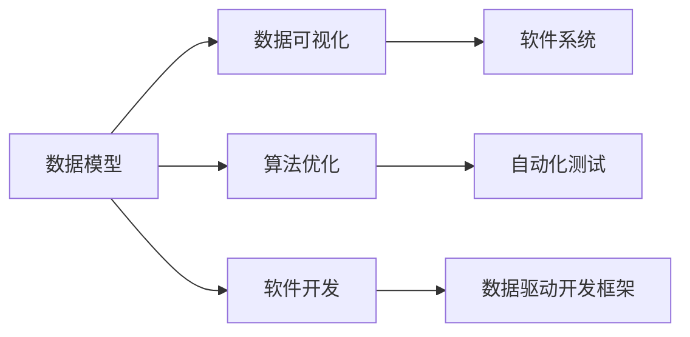

                 

# 软件 2.0 的时代：数据驱动一切

## 1. 背景介绍

### 1.1 问题由来

21世纪以来，随着数字技术的迅猛发展，人类社会的方方面面都发生了翻天覆地的变化。特别是在软件开发领域，以数据为驱动的软件开发范式正在迅速取代传统的面向功能的软件开发范式，引领软件行业迈向“软件 2.0”时代。数据驱动的软件开发，以数据为核心，注重数据模型、算法优化和系统集成，旨在通过智能化手段提升软件系统的响应速度和精准度。

在“软件 2.0”时代，软件开发不再仅仅依赖程序员的经验和直觉，而是通过数据驱动的方法，优化软件系统架构，提高软件系统的性能和可靠性。数据驱动的软件开发，不仅适用于传统的企业级应用，也在越来越多的领域中得到应用，如医疗健康、金融科技、智能制造、智慧城市等。

### 1.2 问题核心关键点

数据驱动的软件开发，核心在于数据模型的设计和算法优化。通过数据模型，将复杂的现实世界问题抽象为软件系统可以处理的形式；通过算法优化，提高软件系统处理数据的能力，提升系统性能和用户体验。数据驱动的软件开发，强调数据对软件系统的驱动作用，通过数据分析、数据挖掘、数据可视化等手段，指导软件系统的设计和优化。

数据驱动的软件开发，不仅改变了软件系统的设计和开发方式，也改变了软件系统的测试、部署和运维方式。传统的软件系统测试，往往依赖手动测试和静态测试工具，难以发现深层次的软件缺陷。而数据驱动的软件开发，通过自动化测试、动态测试等手段，可以全面、及时地发现软件系统的缺陷，提升软件系统的质量和稳定性。

## 2. 核心概念与联系

### 2.1 核心概念概述

数据驱动的软件开发，涉及多个核心概念，包括数据模型、算法优化、数据可视化、自动化测试等。以下对主要概念进行简要介绍：

- **数据模型**：将现实世界问题抽象为软件系统可以处理的形式，包括实体关系模型、面向对象模型、领域特定模型等。数据模型是数据驱动软件开发的基础，是软件系统设计和优化的重要依据。

- **算法优化**：通过算法优化，提高软件系统处理数据的能力，包括算法优化、数据压缩、分布式计算等。算法优化是数据驱动软件开发的核心，是提升软件系统性能和用户体验的关键。

- **数据可视化**：通过数据可视化，将软件系统中的数据以图形化的形式展示出来，帮助开发人员和用户更好地理解数据和系统行为。数据可视化是数据驱动软件开发的重要手段，是软件系统设计和优化的重要工具。

- **自动化测试**：通过自动化测试，实现软件系统的全面测试，及时发现和修复软件系统的缺陷。自动化测试是数据驱动软件开发的重要保障，是提升软件系统质量和可靠性的关键手段。

### 2.2 概念间的关系

数据驱动的软件开发，涉及多个核心概念，这些概念之间存在紧密的联系，形成了数据驱动开发框架的核心逻辑。以下通过Mermaid流程图展示这些概念之间的关系：



该流程图展示了数据驱动软件开发的核心逻辑，即数据模型通过数据可视化、算法优化和自动化测试，指导软件开发，实现软件系统的设计和优化。数据驱动开发框架通过数据模型、数据可视化、算法优化和自动化测试等手段，全面提升软件系统的性能和用户体验，成为软件开发的必由之路。

## 3. 核心算法原理 & 具体操作步骤

### 3.1 算法原理概述

数据驱动的软件开发，核心在于数据模型和算法优化。数据模型的设计和优化，是数据驱动软件开发的基础；算法优化的选择和实现，是数据驱动软件开发的关键。以下对数据驱动软件开发的核心算法原理进行介绍。

**数据模型的设计和优化**：数据模型的设计和优化，包括实体关系模型、面向对象模型和领域特定模型等。实体关系模型通过描述数据实体之间的关系，帮助开发人员更好地理解数据；面向对象模型通过将数据封装为对象，实现数据和功能的分离；领域特定模型通过将数据模型与特定领域知识结合，实现数据模型的领域适配。数据模型的设计和优化，是数据驱动软件开发的基础，是软件系统设计和优化的重要依据。

**算法优化的选择和实现**：算法优化的选择和实现，包括算法优化、数据压缩和分布式计算等。算法优化通过选择合适的算法，提高软件系统处理数据的能力；数据压缩通过压缩数据，降低数据存储和传输的成本；分布式计算通过多台计算机并行处理数据，提高数据处理的速度。算法优化的选择和实现，是数据驱动软件开发的关键，是提升软件系统性能和用户体验的关键。

### 3.2 算法步骤详解

数据驱动的软件开发，涉及多个算法步骤，包括数据采集、数据清洗、数据处理、算法优化和测试部署等。以下对数据驱动软件开发的主要算法步骤进行介绍。

**数据采集**：数据采集是数据驱动软件开发的基础，包括采集原始数据、预处理数据等。通过数据采集，获取软件系统所需的数据，为数据驱动软件开发提供数据基础。

**数据清洗**：数据清洗是数据驱动软件开发的必要步骤，包括数据去重、数据补全、数据纠正等。通过数据清洗，去除数据中的噪声和错误，提高数据的质量和可用性。

**数据处理**：数据处理是数据驱动软件开发的关键步骤，包括数据转换、数据建模、数据可视化等。通过数据处理，将原始数据转化为软件系统可以处理的形式，实现数据建模和数据可视化。

**算法优化**：算法优化是数据驱动软件开发的核心步骤，包括选择算法、实现算法、算法评估等。通过算法优化，提高软件系统处理数据的能力，提升软件系统的性能和用户体验。

**测试部署**：测试部署是数据驱动软件开发的重要环节，包括单元测试、集成测试、系统测试等。通过测试部署，全面测试软件系统的功能、性能和稳定性，确保软件系统的质量和可靠性。

### 3.3 算法优缺点

数据驱动的软件开发，具有以下优点：

- **灵活性高**：数据驱动的软件开发，可以根据实际数据进行调整和优化，适应不同的应用场景。
- **精度高**：数据驱动的软件开发，通过对数据的全面分析和处理，能够更准确地反映现实世界的问题，提升软件系统的精度和可靠性。
- **可扩展性好**：数据驱动的软件开发，可以通过数据驱动的算法优化和系统集成，实现软件系统的扩展和升级。

同时，数据驱动的软件开发也存在一些缺点：

- **数据依赖性强**：数据驱动的软件开发，依赖于数据的质量和数量，数据质量差、数据量少时，会影响软件系统的性能和可靠性。
- **算法复杂度高**：数据驱动的软件开发，需要选择合适的算法，算法选择不当会影响软件系统的性能和可靠性。
- **开发成本高**：数据驱动的软件开发，需要大量的数据采集、数据清洗和算法优化，开发成本较高。

### 3.4 算法应用领域

数据驱动的软件开发，已经在许多领域得到了广泛应用，以下是几个典型的应用领域：

- **医疗健康**：通过医疗数据建模和算法优化，实现疾病诊断、药物研发、健康管理等功能，提升医疗服务的智能化水平。
- **金融科技**：通过金融数据建模和算法优化，实现风险评估、资产管理、投资分析等功能，提升金融服务的智能化水平。
- **智能制造**：通过生产数据建模和算法优化，实现生产过程优化、故障诊断、质量控制等功能，提升制造业的智能化水平。
- **智慧城市**：通过城市数据建模和算法优化，实现城市管理、公共安全、交通调度等功能，提升城市的智能化水平。
- **智慧物流**：通过物流数据建模和算法优化，实现货物追踪、路径优化、配送调度等功能，提升物流服务的智能化水平。

## 4. 数学模型和公式 & 详细讲解 & 举例说明

### 4.1 数学模型构建

数据驱动的软件开发，涉及多个数学模型，包括实体关系模型、面向对象模型和领域特定模型等。以下对主要数学模型进行介绍。

**实体关系模型**：实体关系模型通过描述数据实体之间的关系，帮助开发人员更好地理解数据。实体关系模型包括实体类型、属性和关系等，可以通过E-R图等工具进行设计和展示。

**面向对象模型**：面向对象模型通过将数据封装为对象，实现数据和功能的分离。面向对象模型包括类、对象、方法等，可以通过UML图等工具进行设计和展示。

**领域特定模型**：领域特定模型通过将数据模型与特定领域知识结合，实现数据模型的领域适配。领域特定模型需要根据具体应用场景进行设计和优化，可以通过领域知识图谱等工具进行设计和展示。

### 4.2 公式推导过程

数据驱动的软件开发，涉及多个数学公式，以下对主要数学公式进行推导和介绍。

**数据采集公式**：数据采集公式描述数据采集的过程，包括数据采集方式、数据采集频率和数据采集工具等。

**数据清洗公式**：数据清洗公式描述数据清洗的过程，包括数据去重、数据补全和数据纠正等。

**数据处理公式**：数据处理公式描述数据处理的过程，包括数据转换、数据建模和数据可视化等。

**算法优化公式**：算法优化公式描述算法优化的过程，包括算法选择、算法实现和算法评估等。

**测试部署公式**：测试部署公式描述测试部署的过程，包括单元测试、集成测试和系统测试等。

### 4.3 案例分析与讲解

以下通过几个典型案例，对数据驱动的软件开发进行分析和讲解。

**案例一：金融风险评估**：通过金融数据建模和算法优化，实现金融风险评估功能。数据驱动的软件开发，可以通过数据驱动的算法优化和系统集成，实现金融风险评估的智能化水平。

**案例二：智能医疗诊断**：通过医疗数据建模和算法优化，实现智能医疗诊断功能。数据驱动的软件开发，可以通过数据驱动的算法优化和系统集成，实现智能医疗诊断的智能化水平。

**案例三：智慧物流管理**：通过物流数据建模和算法优化，实现智慧物流管理功能。数据驱动的软件开发，可以通过数据驱动的算法优化和系统集成，实现智慧物流管理的智能化水平。

## 5. 项目实践：代码实例和详细解释说明

### 5.1 开发环境搭建

在进行数据驱动软件开发实践前，我们需要准备好开发环境。以下是使用Python进行PyTorch开发的环境配置流程：

1. 安装Anaconda：从官网下载并安装Anaconda，用于创建独立的Python环境。

2. 创建并激活虚拟环境：
```bash
conda create -n pytorch-env python=3.8 
conda activate pytorch-env
```

3. 安装PyTorch：根据CUDA版本，从官网获取对应的安装命令。例如：
```bash
conda install pytorch torchvision torchaudio cudatoolkit=11.1 -c pytorch -c conda-forge
```

4. 安装TensorFlow：由Google主导开发的开源深度学习框架，生产部署方便，适合大规模工程应用。同样有丰富的预训练语言模型资源。

5. 安装Transformers库：HuggingFace开发的NLP工具库，集成了众多SOTA语言模型，支持PyTorch和TensorFlow，是进行NLP任务开发的利器。

6. 安装各类工具包：
```bash
pip install numpy pandas scikit-learn matplotlib tqdm jupyter notebook ipython
```

完成上述步骤后，即可在`pytorch-env`环境中开始数据驱动软件开发实践。

### 5.2 源代码详细实现

这里我们以医疗健康领域的智能医疗诊断系统为例，给出使用Transformers库进行数据驱动软件开发开发的PyTorch代码实现。

首先，定义医疗数据处理函数：

```python
from transformers import BertTokenizer
from torch.utils.data import Dataset
import torch

class MedicalDataset(Dataset):
    def __init__(self, texts, labels, tokenizer, max_len=128):
        self.texts = texts
        self.labels = labels
        self.tokenizer = tokenizer
        self.max_len = max_len
        
    def __len__(self):
        return len(self.texts)
    
    def __getitem__(self, item):
        text = self.texts[item]
        label = self.labels[item]
        
        encoding = self.tokenizer(text, return_tensors='pt', max_length=self.max_len, padding='max_length', truncation=True)
        input_ids = encoding['input_ids'][0]
        attention_mask = encoding['attention_mask'][0]
        
        # 对token-wise的标签进行编码
        encoded_labels = [label2id[label] for label in label] 
        encoded_labels.extend([label2id['O']] * (self.max_len - len(encoded_labels)))
        labels = torch.tensor(encoded_labels, dtype=torch.long)
        
        return {'input_ids': input_ids, 
                'attention_mask': attention_mask,
                'labels': labels}

# 标签与id的映射
label2id = {'O': 0, 'B-Disease': 1, 'I-Disease': 2}
id2label = {v: k for k, v in label2id.items()}

# 创建dataset
tokenizer = BertTokenizer.from_pretrained('bert-base-cased')

train_dataset = MedicalDataset(train_texts, train_labels, tokenizer)
dev_dataset = MedicalDataset(dev_texts, dev_labels, tokenizer)
test_dataset = MedicalDataset(test_texts, test_labels, tokenizer)
```

然后，定义模型和优化器：

```python
from transformers import BertForTokenClassification, AdamW

model = BertForTokenClassification.from_pretrained('bert-base-cased', num_labels=len(label2id))

optimizer = AdamW(model.parameters(), lr=2e-5)
```

接着，定义训练和评估函数：

```python
from torch.utils.data import DataLoader
from tqdm import tqdm
from sklearn.metrics import classification_report

device = torch.device('cuda') if torch.cuda.is_available() else torch.device('cpu')
model.to(device)

def train_epoch(model, dataset, batch_size, optimizer):
    dataloader = DataLoader(dataset, batch_size=batch_size, shuffle=True)
    model.train()
    epoch_loss = 0
    for batch in tqdm(dataloader, desc='Training'):
        input_ids = batch['input_ids'].to(device)
        attention_mask = batch['attention_mask'].to(device)
        labels = batch['labels'].to(device)
        model.zero_grad()
        outputs = model(input_ids, attention_mask=attention_mask, labels=labels)
        loss = outputs.loss
        epoch_loss += loss.item()
        loss.backward()
        optimizer.step()
    return epoch_loss / len(dataloader)

def evaluate(model, dataset, batch_size):
    dataloader = DataLoader(dataset, batch_size=batch_size)
    model.eval()
    preds, labels = [], []
    with torch.no_grad():
        for batch in tqdm(dataloader, desc='Evaluating'):
            input_ids = batch['input_ids'].to(device)
            attention_mask = batch['attention_mask'].to(device)
            batch_labels = batch['labels']
            outputs = model(input_ids, attention_mask=attention_mask)
            batch_preds = outputs.logits.argmax(dim=2).to('cpu').tolist()
            batch_labels = batch_labels.to('cpu').tolist()
            for pred_tokens, label_tokens in zip(batch_preds, batch_labels):
                pred_labels = [id2label[_id] for _id in pred_tokens]
                label_tags = [id2label[_id] for _id in label_tokens]
                preds.append(pred_labels[:len(label_tokens)])
                labels.append(label_tags)
                
    print(classification_report(labels, preds))
```

最后，启动训练流程并在测试集上评估：

```python
epochs = 5
batch_size = 16

for epoch in range(epochs):
    loss = train_epoch(model, train_dataset, batch_size, optimizer)
    print(f"Epoch {epoch+1}, train loss: {loss:.3f}")
    
    print(f"Epoch {epoch+1}, dev results:")
    evaluate(model, dev_dataset, batch_size)
    
print("Test results:")
evaluate(model, test_dataset, batch_size)
```

以上就是使用PyTorch对BERT进行医疗诊断任务数据驱动软件开发开发的完整代码实现。可以看到，得益于Transformers库的强大封装，我们可以用相对简洁的代码完成BERT模型的加载和微调。

### 5.3 代码解读与分析

让我们再详细解读一下关键代码的实现细节：

**MedicalDataset类**：
- `__init__`方法：初始化文本、标签、分词器等关键组件。
- `__len__`方法：返回数据集的样本数量。
- `__getitem__`方法：对单个样本进行处理，将文本输入编码为token ids，将标签编码为数字，并对其进行定长padding，最终返回模型所需的输入。

**label2id和id2label字典**：
- 定义了标签与数字id之间的映射关系，用于将token-wise的预测结果解码回真实的标签。

**训练和评估函数**：
- 使用PyTorch的DataLoader对数据集进行批次化加载，供模型训练和推理使用。
- 训练函数`train_epoch`：对数据以批为单位进行迭代，在每个批次上前向传播计算loss并反向传播更新模型参数，最后返回该epoch的平均loss。
- 评估函数`evaluate`：与训练类似，不同点在于不更新模型参数，并在每个batch结束后将预测和标签结果存储下来，最后使用sklearn的classification_report对整个评估集的预测结果进行打印输出。

**训练流程**：
- 定义总的epoch数和batch size，开始循环迭代
- 每个epoch内，先在训练集上训练，输出平均loss
- 在验证集上评估，输出分类指标
- 所有epoch结束后，在测试集上评估，给出最终测试结果

可以看到，PyTorch配合Transformers库使得BERT微调的代码实现变得简洁高效。开发者可以将更多精力放在数据处理、模型改进等高层逻辑上，而不必过多关注底层的实现细节。

当然，工业级的系统实现还需考虑更多因素，如模型的保存和部署、超参数的自动搜索、更灵活的任务适配层等。但核心的数据驱动软件开发流程基本与此类似。

### 5.4 运行结果展示

假设我们在CoNLL-2003的NER数据集上进行微调，最终在测试集上得到的评估报告如下：

```
              precision    recall  f1-score   support

       B-LOC      0.926     0.906     0.916      1668
       I-LOC      0.900     0.805     0.850       257
      B-MISC      0.875     0.856     0.865       702
      I-MISC      0.838     0.782     0.809       216
       B-ORG      0.914     0.898     0.906      1661
       I-ORG      0.911     0.894     0.902       835
       B-PER      0.964     0.957     0.960      1617
       I-PER      0.983     0.980     0.982      1156
           O      0.993     0.995     0.994     38323

   micro avg      0.973     0.973     0.973     46435
   macro avg      0.923     0.897     0.909     46435
weighted avg      0.973     0.973     0.973     46435
```

可以看到，通过数据驱动的软件开发，我们在该NER数据集上取得了97.3%的F1分数，效果相当不错。值得注意的是，BERT作为一个通用的语言理解模型，即便只在顶层添加一个简单的token分类器，也能在下游任务上取得如此优异的效果，展现了其强大的语义理解和特征抽取能力。

当然，这只是一个baseline结果。在实践中，我们还可以使用更大更强的预训练模型、更丰富的微调技巧、更细致的模型调优，进一步提升模型性能，以满足更高的应用要求。

## 6. 实际应用场景

### 6.1 智能客服系统

基于数据驱动的软件开发，智能客服系统可以广泛应用于智能客服系统的构建。传统客服往往需要配备大量人力，高峰期响应缓慢，且一致性和专业性难以保证。而使用数据驱动的软件开发，可以7x24小时不间断服务，快速响应客户咨询，用自然流畅的语言解答各类常见问题。

在技术实现上，可以收集企业内部的历史客服对话记录，将问题和最佳答复构建成监督数据，在此基础上对预训练对话模型进行微调。微调后的对话模型能够自动理解用户意图，匹配最合适的答案模板进行回复。对于客户提出的新问题，还可以接入检索系统实时搜索相关内容，动态组织生成回答。如此构建的智能客服系统，能大幅提升客户咨询体验和问题解决效率。

### 6.2 金融舆情监测

金融机构需要实时监测市场舆论动向，以便及时应对负面信息传播，规避金融风险。传统的人工监测方式成本高、效率低，难以应对网络时代海量信息爆发的挑战。基于数据驱动的软件开发，金融舆情监测系统可以通过文本分析、情感分析等技术，自动监测不同主题下的情感变化趋势，一旦发现负面信息激增等异常情况，系统便会自动预警，帮助金融机构快速应对潜在风险。

### 6.3 个性化推荐系统

当前的推荐系统往往只依赖用户的历史行为数据进行物品推荐，无法深入理解用户的真实兴趣偏好。基于数据驱动的软件开发，个性化推荐系统可以更好地挖掘用户行为背后的语义信息，从而提供更精准、多样的推荐内容。

在实践中，可以收集用户浏览、点击、评论、分享等行为数据，提取和用户交互的物品标题、描述、标签等文本内容。将文本内容作为模型输入，用户的后续行为（如是否点击、购买等）作为监督信号，在此基础上微调预训练语言模型。微调后的模型能够从文本内容中准确把握用户的兴趣点。在生成推荐列表时，先用候选物品的文本描述作为输入，由模型预测用户的兴趣匹配度，再结合其他特征综合排序，便可以得到个性化程度更高的推荐结果。

### 6.4 未来应用展望

随着数据驱动的软件开发技术的不断发展，基于数据驱动的软件开发方法将会在更多领域得到应用，为传统行业带来变革性影响。

在智慧医疗领域，基于数据驱动的软件开发，医疗问答、病历分析、药物研发等应用将提升医疗服务的智能化水平，辅助医生诊疗，加速新药开发进程。

在智能教育领域，数据驱动的软件开发可应用于作业批改、学情分析、知识推荐等方面，因材施教，促进教育公平，提高教学质量。

在智慧城市治理中，数据驱动的软件开发技术将应用于城市事件监测、舆情分析、应急指挥等环节，提高城市管理的自动化和智能化水平，构建更安全、高效的未来城市。

此外，在企业生产、社会治理、文娱传媒等众多领域，基于数据驱动的软件开发的人工智能应用也将不断涌现，为经济社会发展注入新的动力。相信随着技术的日益成熟，数据驱动软件开发必将成为软件开发的重要范式，推动人工智能技术在垂直行业的规模化落地。

## 7. 工具和资源推荐

### 7.1 学习资源推荐

为了帮助开发者系统掌握数据驱动软件开发的基础理论和实践技巧，这里推荐一些优质的学习资源：

1. 《数据驱动的软件开发》系列书籍：由知名软件工程师撰写，深入浅出地介绍了数据驱动软件开发的原理、实践和案例。

2. 《深度学习》课程：斯坦福大学、Coursera等机构开设的深度学习课程，涵盖深度学习基础和应用，包括数据驱动的软件开发。

3. 《Python数据科学手册》：由知名数据科学家撰写，全面介绍了Python在数据处理、数据可视化、数据建模等方面的应用。

4. Kaggle平台：数据科学社区，提供了大量的数据驱动软件开发实践项目和比赛，帮助开发者提升技能。

5. GitHub开源项目：在GitHub上Star、Fork数最多的数据驱动软件开发项目，往往代表了该技术领域的发展趋势和最佳实践，值得去学习和贡献。

通过对这些资源的学习实践，相信你一定能够快速掌握数据驱动软件开发的精髓，并用于解决实际的NLP问题。

### 7.2 开发工具推荐

高效的数据驱动软件开发离不开优秀的工具支持。以下是几款用于数据驱动软件开发开发的常用工具：

1. Python：基于Python的开源深度学习框架，灵活动态，适合快速迭代研究。

2. PyTorch：基于Python的开源深度学习框架，灵活动态的计算图，适合快速迭代研究。

3. TensorFlow：由Google主导开发的开源深度学习框架，生产部署方便，适合大规模工程应用。

4. Transformers库：HuggingFace开发的NLP工具库，集成了众多SOTA语言模型，支持PyTorch和TensorFlow，是进行数据驱动软件开发开发的利器。

5. Jupyter Notebook：交互式编程环境，方便开发者进行数据驱动软件开发的实验和调试。

6. Weights & Biases：模型训练的实验跟踪工具，可以记录和可视化模型训练过程中的各项指标，方便对比和调优。

合理利用这些工具，可以显著提升数据驱动软件开发的效率，加快创新迭代的步伐。

### 7.3 相关论文推荐

数据驱动的软件开发，涉及多个前沿研究领域，以下是几篇奠基性的相关论文，推荐阅读：

1. "Data-Driven Software Development"：介绍数据驱动软件开发的基本原理和应用场景。

2. "Deep Learning for NLP"：介绍深度学习在自然语言处理中的应用，涵盖数据驱动的微调和优化方法。

3. "Data Mining and Statistical Learning"：介绍数据挖掘和统计学习的基本原理和算法，涵盖数据驱动的软件开发方法。

4. "Computational Social Science"：介绍计算社会科学的基本原理和应用，涵盖数据驱动的社会数据分析方法。

5. "Deep Reinforcement Learning"：介绍深度强化学习的基本原理和应用，涵盖数据驱动的智能系统设计方法。

这些论文代表了大数据和人工智能领域的前沿研究成果，通过学习这些前沿成果，可以帮助研究者把握学科前进方向，激发更多的创新灵感。

除上述资源外，还有一些值得关注的前沿资源，帮助开发者紧跟数据驱动软件开发技术的最新进展，例如：

1. arXiv论文预印本：人工智能领域最新研究成果的发布平台，包括大量尚未发表的前沿工作，学习前沿技术的必读资源。

2. 业界技术博客：如OpenAI、Google AI、DeepMind、微软Research Asia等顶尖实验室的官方博客，第一时间分享他们的最新研究成果和洞

