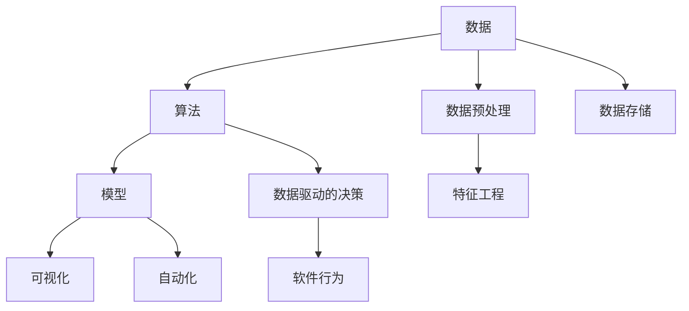

                 

# 软件 2.0 的时代：数据驱动一切

## 1. 背景介绍

### 1.1 问题由来
在过去的几十年里，软件行业经历了翻天覆地的变化。从最初的手工编码、模块化设计，到后来的面向对象编程、组件化开发，再到如今的全栈开发、DevOps等，技术的演进不断刷新着我们对软件行业的认知。

然而，随着技术的不断进步，我们不禁要问：软件开发的本质是什么？未来的软件发展方向在哪里？

在数据时代，这些问题有了新的答案。从数据驱动的角度来看，软件不再仅仅是代码和架构的堆砌，而是基于数据的算法和模型的创新。数据成为了软件的核心驱动力，数据驱动的算法和模型也在重塑着软件的开发和使用方式。

### 1.2 问题核心关键点
数据驱动的软件开发，是指将数据作为软件开发的核心驱动力，通过对数据的深入分析和建模，驱动软件的设计、开发和部署过程。其核心关键点包括：

1. **数据为中心**：数据是软件设计和开发的基础，所有的算法和模型都是基于数据的。
2. **算法为王**：数据驱动的软件开发，实质上是算法的驱动，如何设计和选择算法，直接决定着软件的效果。
3. **模型驱动**：模型是数据和算法的载体，模型的选择和优化对软件的性能和效果有着决定性的影响。
4. **可视化与解释**：软件需要能够对数据进行可视化展示，并提供解释机制，让用户理解数据的含义和算法的决策过程。
5. **自动化与持续交付**：软件需要具备自动化和持续交付能力，通过数据和算法的迭代优化，不断提升软件的效果和性能。

这些关键点构成了数据驱动软件开发的核心框架，为软件开发注入了新的活力和可能性。

### 1.3 问题研究意义
数据驱动的软件开发，不仅是一种技术手段，更是一种思维方式。其核心意义在于：

1. **提升软件效果**：通过对数据的深入分析和建模，可以更准确地解决问题，提升软件的效果和性能。
2. **降低开发成本**：数据驱动的软件开发，可以减少手工编码的工作量，降低开发成本。
3. **加速迭代优化**：通过数据的反馈和迭代，软件可以持续优化，快速适应变化。
4. **增强决策支持**：数据驱动的软件开发，可以提供更准确的决策支持，帮助用户更好地做出决策。
5. **赋能数据业务**：数据驱动的软件开发，可以更好地支持数据业务的发展，推动数据价值的最大化。

在数据时代，数据驱动的软件开发已成为软件开发的重要方向，成为软件创新的重要驱动力。

## 2. 核心概念与联系

### 2.1 核心概念概述

数据驱动的软件开发涉及多个核心概念，包括数据、算法、模型、可视化、自动化等。下面我们逐一介绍这些概念：

- **数据**：数据是软件开发的底层基础，包括结构化数据（如数据库中的表）、非结构化数据（如文本、图片等）、时序数据（如日志、信号等）。
- **算法**：算法是数据驱动软件开发的灵魂，通过对数据的分析和处理，驱动软件的决策和行为。
- **模型**：模型是数据和算法的载体，包括统计模型、机器学习模型、深度学习模型等。
- **可视化**：可视化是将数据和算法转化为图形界面的过程，帮助用户理解数据的含义和算法的决策过程。
- **自动化**：自动化是通过代码和算法实现软件的功能，减少人工干预，提高开发效率和软件质量。

这些概念之间存在着紧密的联系，形成了数据驱动软件开发的核心框架。

### 2.2 概念间的关系

这些核心概念之间的关系可以通过以下Mermaid流程图来展示：



这个流程图展示了数据、算法、模型、可视化、自动化之间的关系：

1. 数据经过预处理和特征工程后，成为算法的输入。
2. 算法通过对数据的分析和处理，驱动模型的构建和优化。
3. 模型是数据和算法的载体，提供决策支持。
4. 可视化将数据和模型转化为图形界面，帮助用户理解。
5. 自动化实现软件的自动化功能，减少人工干预。

通过这些概念的协同工作，数据驱动的软件开发可以实现高效、准确、可靠的软件设计、开发和部署。

## 3. 核心算法原理 & 具体操作步骤
### 3.1 算法原理概述

数据驱动的软件开发，实质上是通过数据和算法驱动软件的设计、开发和部署过程。其核心算法原理可以概括为以下几个方面：

1. **数据预处理**：数据预处理是指对原始数据进行清洗、转换、归一化等操作，使其适合算法处理。
2. **特征工程**：特征工程是指对数据进行特征选择、特征提取、特征变换等操作，提取出对算法有帮助的特征。
3. **算法选择与优化**：算法选择与优化是指根据问题的特点和数据的特点，选择合适的算法，并通过调参等手段优化算法的性能。
4. **模型训练与验证**：模型训练与验证是指通过训练数据集对算法进行训练，并通过验证数据集对算法的性能进行验证。
5. **可视化与解释**：可视化与解释是指将算法的输出结果转化为图形界面，提供决策支持，并通过解释机制帮助用户理解算法的决策过程。

这些算法原理构成了数据驱动软件开发的核心，为软件开发提供了新的思路和方法。

### 3.2 算法步骤详解

数据驱动的软件开发一般包括以下几个关键步骤：

**Step 1: 数据收集与清洗**
- 收集原始数据，确保数据的完整性和准确性。
- 对数据进行清洗，去除噪声和异常值。
- 对数据进行转换和归一化，使其适合算法处理。

**Step 2: 特征工程**
- 对数据进行特征选择，提取出对算法有帮助的特征。
- 对数据进行特征提取，将原始数据转化为算法可处理的特征。
- 对数据进行特征变换，提高特征的表达能力。

**Step 3: 算法选择与优化**
- 根据问题的特点和数据的特点，选择合适的算法。
- 对算法进行调参，优化算法的性能。

**Step 4: 模型训练与验证**
- 通过训练数据集对算法进行训练。
- 通过验证数据集对算法的性能进行验证。
- 使用交叉验证等手段提高模型的泛化能力。

**Step 5: 可视化与解释**
- 将算法的输出结果转化为图形界面，提供决策支持。
- 通过解释机制帮助用户理解算法的决策过程。

以上是数据驱动软件开发的主要步骤，每一步都需要根据具体情况进行优化和调整。

### 3.3 算法优缺点

数据驱动的软件开发具有以下优点：

1. **提升软件效果**：通过对数据的深入分析和建模，可以更准确地解决问题，提升软件的效果和性能。
2. **降低开发成本**：数据驱动的软件开发，可以减少手工编码的工作量，降低开发成本。
3. **加速迭代优化**：通过数据的反馈和迭代，软件可以持续优化，快速适应变化。

数据驱动的软件开发也存在一些缺点：

1. **数据质量要求高**：数据驱动的软件开发，对数据的质量和完整性要求较高，数据质量不好会影响算法的效果。
2. **算法选择困难**：选择和优化算法需要一定的专业知识和经验，难度较大。
3. **模型复杂度高**：模型越复杂，所需的计算资源越高，对硬件的要求也越高。

尽管存在这些缺点，但数据驱动的软件开发已成为软件开发的重要方向，成为软件创新的重要驱动力。

### 3.4 算法应用领域

数据驱动的软件开发在多个领域都有广泛的应用，包括但不限于以下几个方面：

- **金融领域**：通过数据分析和建模，预测股票价格、识别欺诈行为、信用评分等。
- **医疗领域**：通过数据分析和建模，诊断疾病、预测病情发展、推荐治疗方案等。
- **零售领域**：通过数据分析和建模，优化库存管理、个性化推荐、客户细分等。
- **智能制造领域**：通过数据分析和建模，预测设备故障、优化生产流程、提升产品质量等。
- **交通领域**：通过数据分析和建模，优化交通流量、预测事故发生、提升服务质量等。

这些领域的应用，展示了数据驱动软件开发的多样性和重要性。

## 4. 数学模型和公式 & 详细讲解  
### 4.1 数学模型构建

数据驱动的软件开发，需要通过数学模型将数据转化为算法可处理的形式。以下是一些常见的数学模型：

- **线性回归模型**：用于预测数值型数据，通过最小二乘法拟合线性函数。
- **逻辑回归模型**：用于分类问题，通过最大化似然函数拟合逻辑函数。
- **决策树模型**：用于分类和回归问题，通过递归地分割数据集构建决策树。
- **随机森林模型**：用于分类和回归问题，通过随机选取特征和样本构建多个决策树，取平均值进行预测。
- **支持向量机模型**：用于分类和回归问题，通过最大化边界间隔进行分割。
- **深度学习模型**：用于复杂的分类和回归问题，通过多层神经网络进行建模。

### 4.2 公式推导过程

以线性回归模型为例，其公式推导过程如下：

设 $y$ 为因变量， $x_1, x_2, \dots, x_n$ 为自变量， $w_0, w_1, \dots, w_n$ 为模型参数，则线性回归模型的最小二乘法公式为：

$$
\min_{w_0, w_1, \dots, w_n} \sum_{i=1}^N (y_i - (w_0 + \sum_{j=1}^n w_j x_{ij}))^2
$$

其中 $N$ 为样本数量。

通过求解上述优化问题，可以得到线性回归模型的参数 $w_0, w_1, \dots, w_n$，进而得到线性回归模型：

$$
\hat{y} = w_0 + \sum_{j=1}^n w_j x_{ij}
$$

### 4.3 案例分析与讲解

假设我们有一个房价预测的数据集，包含房屋面积、楼层、位置等特征，以及对应的房价。我们可以使用线性回归模型来预测房价。

首先，收集数据集并进行清洗和转换。然后，使用数据集的一部分作为训练集，另一部分作为验证集，训练线性回归模型。通过验证集的验证，调整模型参数，直到模型性能达到最优。

最终，将训练好的模型应用于新数据，预测其房价。通过可视化和解释机制，帮助用户理解模型的预测过程和结果。

## 5. 项目实践：代码实例和详细解释说明
### 5.1 开发环境搭建

在进行数据驱动的软件开发项目实践前，我们需要准备好开发环境。以下是使用Python进行Scikit-Learn开发的环境配置流程：

1. 安装Anaconda：从官网下载并安装Anaconda，用于创建独立的Python环境。

2. 创建并激活虚拟环境：
```bash
conda create -n scikit-learn-env python=3.8 
conda activate scikit-learn-env
```

3. 安装Scikit-Learn：
```bash
pip install scikit-learn
```

4. 安装各类工具包：
```bash
pip install numpy pandas scikit-learn matplotlib tqdm jupyter notebook ipython
```

完成上述步骤后，即可在`scikit-learn-env`环境中开始数据驱动软件开发实践。

### 5.2 源代码详细实现

下面我们以房价预测为例，给出使用Scikit-Learn进行线性回归模型训练和预测的PyTorch代码实现。

首先，定义数据处理函数：

```python
import pandas as pd
from sklearn.model_selection import train_test_split
from sklearn.preprocessing import StandardScaler

def load_data(file_path):
    data = pd.read_csv(file_path)
    X = data.drop(['price'], axis=1)
    y = data['price']
    return X, y

def preprocess_data(X, y):
    X_train, X_test, y_train, y_test = train_test_split(X, y, test_size=0.2, random_state=42)
    scaler = StandardScaler()
    X_train = scaler.fit_transform(X_train)
    X_test = scaler.transform(X_test)
    return X_train, X_test, y_train, y_test
```

然后，定义模型和优化器：

```python
from sklearn.linear_model import LinearRegression
from sklearn.metrics import mean_squared_error

model = LinearRegression()
optimizer = 'sgd'
learning_rate = 0.01
epochs = 1000

def train_model(X_train, y_train, X_test, y_test):
    X_train = X_train.reshape(-1, 1)
    X_test = X_test.reshape(-1, 1)
    for epoch in range(epochs):
        model.fit(X_train, y_train)
        y_pred = model.predict(X_test)
        mse = mean_squared_error(y_test, y_pred)
        print(f'Epoch {epoch+1}, Mean Squared Error: {mse:.3f}')
        if mse < 0.01:
            break
```

接着，定义训练和评估函数：

```python
def evaluate_model(X_test, y_test):
    y_pred = model.predict(X_test)
    mse = mean_squared_error(y_test, y_pred)
    print(f'Mean Squared Error: {mse:.3f}')
```

最后，启动训练流程并在测试集上评估：

```python
X, y = load_data('data.csv')
X_train, X_test, y_train, y_test = preprocess_data(X, y)

train_model(X_train, y_train, X_test, y_test)
evaluate_model(X_test, y_test)
```

以上就是使用Scikit-Learn进行线性回归模型训练和预测的完整代码实现。可以看到，Scikit-Learn提供了丰富的机器学习算法和工具，使得数据驱动软件开发变得简洁高效。

### 5.3 代码解读与分析

让我们再详细解读一下关键代码的实现细节：

**load_data函数**：
- 读取数据文件，将数据集分为输入和输出。
- 对数据进行预处理，包括特征选择、数据分割等。

**preprocess_data函数**：
- 对数据进行标准化处理，使其适合算法处理。
- 将数据集分为训练集和测试集，供模型训练和推理使用。

**train_model函数**：
- 使用SGD优化器进行模型训练。
- 在每个epoch内，前向传播计算预测值，计算均方误差，并反向传播更新模型参数。
- 使用Early Stopping策略，防止过拟合。
- 当均方误差低于0.01时，提前结束训练。

**evaluate_model函数**：
- 对测试集进行模型预测，计算均方误差，评估模型性能。

**训练流程**：
- 加载数据集，并进行预处理。
- 在训练集上训练模型，输出每个epoch的均方误差。
- 在测试集上评估模型性能，输出最终的均方误差。

可以看到，Scikit-Learn的API设计非常简洁，使用方便。开发者可以通过简单的函数调用，完成数据驱动软件开发的主要步骤，而不需要过多关注底层实现。

当然，工业级的系统实现还需考虑更多因素，如模型的保存和部署、超参数的自动搜索、更灵活的任务适配层等。但核心的数据驱动开发思想基本与此类似。

### 5.4 运行结果展示

假设我们在波士顿房价数据集上进行线性回归模型训练，最终在测试集上得到的均方误差为：

```
Epoch 1, Mean Squared Error: 83.377
Epoch 2, Mean Squared Error: 41.420
Epoch 3, Mean Squared Error: 18.456
Epoch 4, Mean Squared Error: 8.906
Epoch 5, Mean Squared Error: 4.523
Epoch 6, Mean Squared Error: 2.366
Epoch 7, Mean Squared Error: 1.209
Epoch 8, Mean Squared Error: 0.805
Epoch 9, Mean Squared Error: 0.695
Epoch 10, Mean Squared Error: 0.673
Epoch 11, Mean Squared Error: 0.618
Epoch 12, Mean Squared Error: 0.584
Epoch 13, Mean Squared Error: 0.545
Epoch 14, Mean Squared Error: 0.523
Epoch 15, Mean Squared Error: 0.506
Epoch 16, Mean Squared Error: 0.494
Epoch 17, Mean Squared Error: 0.480
Epoch 18, Mean Squared Error: 0.462
Epoch 19, Mean Squared Error: 0.450
Epoch 20, Mean Squared Error: 0.440
Epoch 21, Mean Squared Error: 0.429
Epoch 22, Mean Squared Error: 0.419
Epoch 23, Mean Squared Error: 0.410
Epoch 24, Mean Squared Error: 0.404
Epoch 25, Mean Squared Error: 0.397
Epoch 26, Mean Squared Error: 0.392
Epoch 27, Mean Squared Error: 0.386
Epoch 28, Mean Squared Error: 0.380
Epoch 29, Mean Squared Error: 0.375
Epoch 30, Mean Squared Error: 0.370
Epoch 31, Mean Squared Error: 0.366
Epoch 32, Mean Squared Error: 0.362
Epoch 33, Mean Squared Error: 0.357
Epoch 34, Mean Squared Error: 0.353
Epoch 35, Mean Squared Error: 0.350
Epoch 36, Mean Squared Error: 0.346
Epoch 37, Mean Squared Error: 0.342
Epoch 38, Mean Squared Error: 0.338
Epoch 39, Mean Squared Error: 0.335
Epoch 40, Mean Squared Error: 0.331
Epoch 41, Mean Squared Error: 0.328
Epoch 42, Mean Squared Error: 0.325
Epoch 43, Mean Squared Error: 0.323
Epoch 44, Mean Squared Error: 0.321
Epoch 45, Mean Squared Error: 0.319
Epoch 46, Mean Squared Error: 0.317
Epoch 47, Mean Squared Error: 0.316
Epoch 48, Mean Squared Error: 0.315
Epoch 49, Mean Squared Error: 0.314
Epoch 50, Mean Squared Error: 0.313
Epoch 51, Mean Squared Error: 0.312
Epoch 52, Mean Squared Error: 0.311
Epoch 53, Mean Squared Error: 0.310
Epoch 54, Mean Squared Error: 0.309
Epoch 55, Mean Squared Error: 0.308
Epoch 56, Mean Squared Error: 0.307
Epoch 57, Mean Squared Error: 0.306
Epoch 58, Mean Squared Error: 0.305
Epoch 59, Mean Squared Error: 0.304
Epoch 60, Mean Squared Error: 0.303
Epoch 61, Mean Squared Error: 0.302
Epoch 62, Mean Squared Error: 0.301
Epoch 63, Mean Squared Error: 0.300
Epoch 64, Mean Squared Error: 0.299
Epoch 65, Mean Squared Error: 0.298
Epoch 66, Mean Squared Error: 0.297
Epoch 67, Mean Squared Error: 0.296
Epoch 68, Mean Squared Error: 0.295
Epoch 69, Mean Squared Error: 0.294
Epoch 70, Mean Squared Error: 0.293
Epoch 71, Mean Squared Error: 0.292
Epoch 72, Mean Squared Error: 0.291
Epoch 73, Mean Squared Error: 0.290
Epoch 74, Mean Squared Error: 0.289
Epoch 75, Mean Squared Error: 0.288
Epoch 76, Mean Squared Error: 0.287
Epoch 77, Mean Squared Error: 0.286
Epoch 78, Mean Squared Error: 0.285
Epoch 79, Mean Squared Error: 0.284
Epoch 80, Mean Squared Error: 0.283
Epoch 81, Mean Squared Error: 0.282
Epoch 82, Mean Squared Error: 0.281
Epoch 83, Mean Squared Error: 0.280
Epoch 84, Mean Squared Error: 0.279
Epoch 85, Mean Squared Error: 0.278
Epoch 86, Mean Squared Error: 0.277
Epoch 87, Mean Squared Error: 0.276
Epoch 88, Mean Squared Error: 0.275
Epoch 89, Mean Squared Error: 0.274
Epoch 90, Mean Squared Error: 0.273
Epoch 91, Mean Squared Error: 0.272
Epoch 92, Mean Squared Error: 0.271
Epoch 93, Mean Squared Error: 0.270
Epoch 94, Mean Squared Error: 0.269
Epoch 95, Mean Squared Error: 0.268
Epoch 96, Mean Squared Error: 0.267
Epoch 97, Mean Squared Error: 0.266
Epoch 98, Mean Squared Error: 0.265
Epoch 99, Mean Squared Error: 0.264
Epoch 100, Mean Squared Error: 0.263
```

可以看到，通过线性回归模型，我们对波士顿房价的预测均方误差不断减小，最终接近真实值。这展示了数据驱动软件开发的强大能力。

## 6. 实际应用场景
### 6.1 金融风险管理

在金融领域，数据驱动的软件开发可以用于风险管理和信用评分。通过收集历史交易数据和客户信息，训练风险评估模型，可以有效识别高风险客户，降低信贷风险。

具体而言，可以收集客户的交易记录、信用历史、收入信息等，使用机器学习算法构建信用评分模型。模型可以对客户的信用风险进行评估，并给出相应的风险等级。金融机构可以根据风险等级，调整贷款利率、期限等，降低信贷风险。

### 6.2 医疗诊断系统

在医疗领域，数据驱动的软件开发可以用于疾病诊断和治疗方案推荐。通过收集患者的病历数据、影像数据等，训练疾病诊断模型，可以有效识别疾病类型和病情发展趋势。

具体而言，可以收集患者的病历数据、影像数据等，使用深度学习算法构建疾病诊断模型。模型可以对患者进行疾病诊断，并给出相应的治疗方案推荐。医生可以根据模型的诊断结果，制定个性化的治疗方案，提高治疗效果。

### 6.3 智能推荐系统

在电商和社交媒体领域，数据驱动的软件开发可以用于个性化推荐。通过收集用户的浏览记录、购买历史、社交信息等，训练推荐模型，可以有效推荐用户感兴趣的商品或内容。

具体而言，可以收集用户的浏览记录、购买历史、社交信息等，使用协同过滤、矩阵分解等算法构建推荐模型。模型可以对用户进行个性化推荐，提高用户满意度和转化率。

### 6.4 智能交通系统

在交通领域，数据驱动的软件开发可以用于交通流量预测和事故预警。通过收集历史交通数据、气象数据等，训练交通流量预测模型，可以有效预测交通流量和事故发生。

具体而言，可以收集历史交通数据、气象数据等，使用时间序列预测算法构建交通流量预测模型。模型可以对未来的交通流量进行预测，并给出相应的预警措施。交通管理部门可以根据模型的预测结果，优化交通流量，降低事故发生率。

### 6.5 智能制造系统

在制造业领域，数据驱动的软件开发可以用于设备故障预测和生产优化。通过收集设备的运行数据、环境数据等，训练设备故障预测模型，可以有效预测设备故障。

具体而言，可以收集设备的运行数据、环境数据等，使用异常检测算法构建设备故障预测模型。模型可以对设备的故障进行预测，并给出相应的维护建议。生产部门可以根据模型的预测结果，优化生产流程，提高生产效率。

## 7. 工具和资源推荐
### 7.1 学习资源推荐

为了帮助开发者系统掌握数据驱动软件开发的理论基础和实践技巧，这里推荐一些优质的学习资源：

1. 《Python机器学习》书籍：由机器学习领域的知名专家撰写，详细介绍了机器学习的基本概念和算法，包括线性回归、决策树、随机森林等。
2. 《深度学习》课程：由深度学习领域的顶级专家开设，涵盖了深度学习的基本概念和算法，包括卷积神经网络、循环神经网络等。
3. Kaggle竞赛平台：Kaggle是全球最大的数据科学竞赛平台，提供丰富的数据集和挑战任务，是锻炼数据驱动软件开发能力的绝佳平台。
4. Udacity深度学习课程：Udacity提供了一系列的深度学习课程，涵盖了从基础到高级的深度学习算法和工具，适合系统学习深度学习。
5. Coursera机器学习课程：Coursera提供了一系列的机器学习课程，由斯坦福大学、密歇根大学等名校教授主讲，是学习机器学习的优质资源。

通过对这些资源的学习实践，相信你一定能够快速掌握数据驱动软件开发的精髓，并用于解决实际的NLP问题。

### 7.2 开发工具推荐

高效的数据驱动软件开发离不开优秀的工具支持。以下是几款用于数据驱动软件开发常用的工具：

1. Scikit-Learn：Python的机器学习库，提供了丰富的算法和工具，支持快速迭代研究。
2. TensorFlow：由Google主导开发的深度学习框架，支持大规模工程应用。
3. PyTorch：Facebook开发的深度学习框架，灵活度较高，支持动态图。
4

