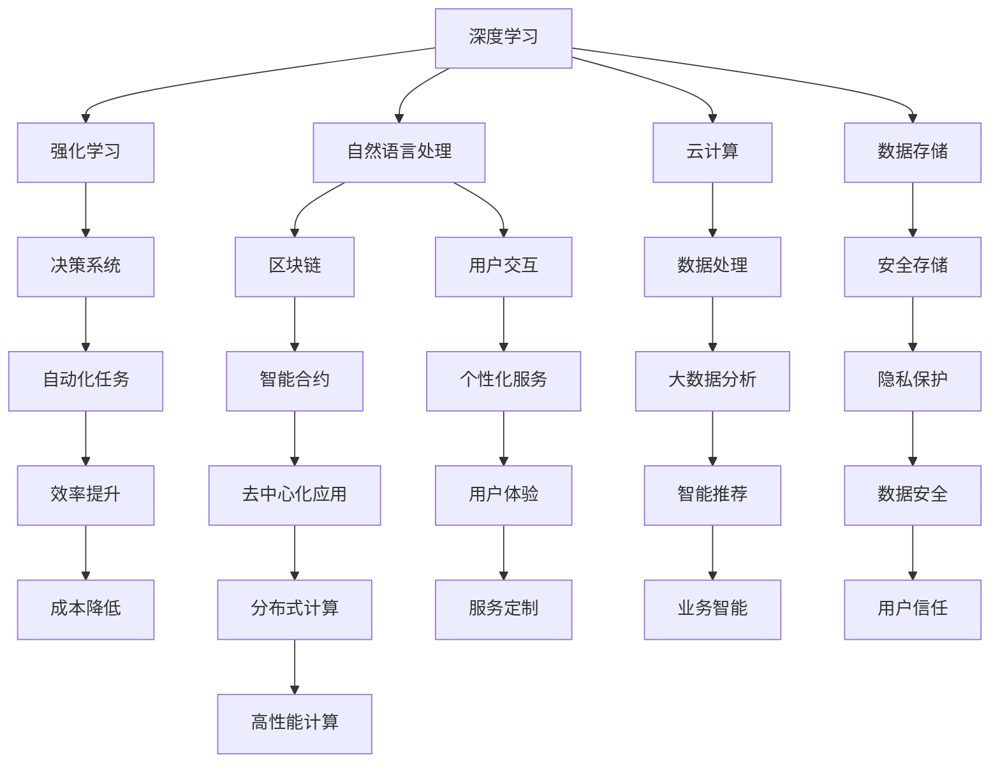

                 

# 软件 2.0 的未来展望：更智能、更强大

在信息技术飞速发展的今天，软件系统的功能和复杂度已经达到了前所未有的高度。从早期的简单计算器到现代的深度学习模型，软件经历了从第一代到第二代，再到即将到来的软件 2.0 的进化。本文将深入探讨软件 2.0 的未来展望，分析其更智能、更强大的潜力和挑战。

## 1. 背景介绍

### 1.1 软件发展的三个阶段

软件的发展可以分为三个阶段：第一代软件、第二代软件以及即将到来的软件 2.0。第一代软件以结构化编程为主，注重软件的可靠性和可维护性；第二代软件则引入了面向对象、事件驱动等技术，实现了软件的灵活性和可扩展性。而软件 2.0 则将更加注重智能、自适应和个性化，实现软件系统与用户之间的深度互动。

### 1.2 软件 2.0 的核心特征

软件 2.0 的核心特征包括：
- **自适应性**：软件能够根据用户的行为和环境变化，自动调整其行为和功能。
- **智能化**：软件能够进行智能推理和决策，提供个性化的服务。
- **自动化**：软件能够自动完成复杂任务，减轻用户的工作负担。
- **交互性**：软件能够与用户进行更自然、更高效的交互。
- **安全性**：软件能够确保数据和隐私的安全。

## 2. 核心概念与联系

### 2.1 核心概念概述

为了更好地理解软件 2.0 的潜力，本文将介绍几个关键概念：

- **深度学习**：一种基于神经网络模型的机器学习方法，能够处理复杂的数据结构，并进行高精度的预测和决策。
- **强化学习**：一种通过奖励机制驱动的机器学习算法，能够通过与环境的交互，不断优化其行为。
- **自然语言处理**：使计算机能够理解、处理和生成人类语言的技术，实现人机交互的自然化。
- **云计算**：通过互联网提供计算资源和服务的模式，支持软件 2.0 的分布式计算和数据处理。
- **区块链**：一种去中心化的分布式账本技术，能够保障数据的安全和透明。

这些概念构成了软件 2.0 的核心技术基础，为实现更智能、更强大的软件系统提供了可能性。

### 2.2 核心概念的关系

这些核心概念之间的联系可以通过以下 Mermaid 流程图来展示：



这个流程图展示了深度学习、强化学习、自然语言处理、云计算、区块链等核心概念之间的相互关系和影响。深度学习提供了强大的算法基础，强化学习使软件具备自适应能力，自然语言处理实现了人机交互的自然化，云计算提供了分布式计算和数据处理的能力，区块链保障了数据的安全和透明，数据存储和隐私保护则确保了数据的安全。

## 3. 核心算法原理 & 具体操作步骤

### 3.1 算法原理概述

软件 2.0 的核心算法原理主要包括以下几个方面：

- **深度学习**：通过多层神经网络对数据进行学习和特征提取，实现高精度的预测和决策。
- **强化学习**：通过奖励机制驱动的模型优化，使软件能够适应环境变化，自动调整其行为。
- **自然语言处理**：利用语言模型对自然语言进行理解和生成，实现人机交互的自然化。

### 3.2 算法步骤详解

深度学习算法一般包括以下步骤：

1. **数据准备**：收集和清洗数据，准备模型训练所需的数据集。
2. **模型设计**：选择适合的神经网络结构，设计损失函数和优化算法。
3. **模型训练**：使用训练数据对模型进行训练，调整模型参数以最小化损失函数。
4. **模型评估**：使用验证数据对模型进行评估，选择最优模型。
5. **模型部署**：将模型部署到实际应用中，进行实时推理和决策。

强化学习算法一般包括以下步骤：

1. **环境建模**：定义环境状态和动作空间，构建环境模型。
2. **策略设计**：选择适合的策略函数，如 Q-learning、SARSA 等。
3. **策略训练**：使用奖励机制驱动的模型优化，训练策略函数。
4. **策略评估**：使用测试数据对策略进行评估，选择最优策略。
5. **策略部署**：将策略部署到实际应用中，进行实时决策和优化。

自然语言处理算法一般包括以下步骤：

1. **语料收集**：收集和预处理语料，构建训练集和测试集。
2. **模型训练**：使用训练数据对模型进行训练，调整模型参数以最小化损失函数。
3. **模型评估**：使用验证数据对模型进行评估，选择最优模型。
4. **模型部署**：将模型部署到实际应用中，进行实时推理和生成。

### 3.3 算法优缺点

深度学习算法的优点包括：
- **精度高**：能够处理复杂的数据结构，实现高精度的预测和决策。
- **适应性强**：能够适应不同领域和数据类型的任务。
- **自适应学习**：能够自动提取数据特征，无需手动设计特征。

深度学习算法的缺点包括：
- **数据依赖**：需要大量标注数据进行训练，数据获取成本高。
- **模型复杂**：需要大量计算资源进行训练和推理，资源消耗大。
- **黑盒性质**：模型决策过程难以解释，缺乏可解释性。

强化学习算法的优点包括：
- **自适应性强**：能够根据环境变化自动调整策略，适应性强。
- **实时优化**：能够实时优化决策，提升系统性能。
- **分布式计算**：能够并行计算，提升计算效率。

强化学习算法的缺点包括：
- **数据需求高**：需要大量的环境交互数据进行训练，数据获取成本高。
- **模型复杂**：需要复杂的策略函数设计，模型复杂度高。
- **稳定性差**：在复杂的非确定性环境中，策略容易不稳定。

自然语言处理算法的优点包括：
- **人机交互**：实现人机交互的自然化，提升用户体验。
- **通用性强**：能够处理多种语言和文本类型的数据。
- **可扩展性**：能够通过新增数据不断提升模型性能。

自然语言处理算法的缺点包括：
- **语义复杂**：语言语义复杂，难以完全理解。
- **数据依赖**：需要大量语料进行训练，数据获取成本高。
- **计算资源消耗大**：处理大规模语料需要大量计算资源。

### 3.4 算法应用领域

深度学习算法在图像识别、语音识别、自然语言处理等领域得到了广泛应用。例如，在图像识别领域，深度学习模型能够实现高精度的图像分类和目标检测。在语音识别领域，深度学习模型能够实现高精度的语音转文本和语音合成。在自然语言处理领域，深度学习模型能够实现高精度的文本分类、情感分析和机器翻译。

强化学习算法在机器人控制、游戏智能、自动驾驶等领域得到了广泛应用。例如，在机器人控制领域，强化学习模型能够实现机器人自主导航和任务执行。在游戏智能领域，强化学习模型能够实现游戏智能决策和策略优化。在自动驾驶领域，强化学习模型能够实现自动驾驶决策和路径规划。

自然语言处理算法在智能客服、智能助手、智能写作等领域得到了广泛应用。例如，在智能客服领域，自然语言处理模型能够实现自动回答客户咨询。在智能助手领域，自然语言处理模型能够实现智能对话和任务执行。在智能写作领域，自然语言处理模型能够实现自动生成文章和报告。

## 4. 数学模型和公式 & 详细讲解 & 举例说明

### 4.1 数学模型构建

以深度学习算法为例，假设有一个二分类任务，输入数据为 $x$，输出标签为 $y$，模型参数为 $\theta$。则模型输出的概率为：

$$
p(y|x;\theta) = \sigma(z(x;\theta))
$$

其中 $\sigma$ 为 sigmoid 函数，$z(x;\theta)$ 为线性变换：

$$
z(x;\theta) = \sum_{i=1}^n w_i x_i + b
$$

模型训练的目标是最小化交叉熵损失函数：

$$
L(\theta) = -\frac{1}{N}\sum_{i=1}^N [y_i \log p(y_i|x_i;\theta) + (1-y_i)\log(1-p(y_i|x_i;\theta))]
$$

### 4.2 公式推导过程

以强化学习算法为例，假设有一个马尔可夫决策过程，状态为 $s$，动作为 $a$，奖励为 $r$，下一状态为 $s'$。则强化学习模型的目标是最小化累计奖励：

$$
\max_{\pi} \sum_{t=0}^\infty \gamma^t r_t^\pi
$$

其中 $\pi$ 为策略函数，$\gamma$ 为折扣因子。强化学习算法一般使用 Q-learning 或 SARSA 算法进行模型训练。以 Q-learning 算法为例，其更新公式为：

$$
Q(s,a) \leftarrow Q(s,a) + \alpha [r + \gamma \max_{a'} Q(s',a') - Q(s,a)]
$$

其中 $\alpha$ 为学习率，$Q(s,a)$ 为状态-动作 Q 值，$Q(s',a')$ 为下一状态的动作 Q 值。

### 4.3 案例分析与讲解

以自然语言处理算法为例，假设有一个文本分类任务，输入文本为 $x$，输出标签为 $y$，模型参数为 $\theta$。则模型输出的概率为：

$$
p(y|x;\theta) = \frac{\exp(z(x;\theta))}{\sum_{k=1}^K \exp(z(x;\theta_k))}
$$

其中 $z(x;\theta)$ 为线性变换：

$$
z(x;\theta) = \sum_{i=1}^n w_i x_i + b
$$

模型训练的目标是最小化交叉熵损失函数：

$$
L(\theta) = -\frac{1}{N}\sum_{i=1}^N [y_i \log p(y_i|x_i;\theta) + (1-y_i)\log(1-p(y_i|x_i;\theta))]
$$

## 5. 项目实践：代码实例和详细解释说明

### 5.1 开发环境搭建

在进行项目实践前，我们需要准备好开发环境。以下是使用 Python 进行 TensorFlow 开发的环境配置流程：

1. 安装 Anaconda：从官网下载并安装 Anaconda，用于创建独立的 Python 环境。

2. 创建并激活虚拟环境：
```bash
conda create -n tf-env python=3.8 
conda activate tf-env
```

3. 安装 TensorFlow：根据 GPU 版本，从官网获取对应的安装命令。例如：
```bash
pip install tensorflow==2.6
```

4. 安装 TensorFlow Addons：可选的 TensorFlow 增强包，包含更多高级功能和组件。
```bash
pip install tensorflow-addons
```

5. 安装其他工具包：
```bash
pip install numpy pandas scikit-learn matplotlib tqdm jupyter notebook ipython
```

完成上述步骤后，即可在 `tf-env` 环境中开始项目实践。

### 5.2 源代码详细实现

这里我们以文本分类任务为例，给出使用 TensorFlow 实现深度学习模型的 PyTorch 代码实现。

首先，定义模型结构：

```python
import tensorflow as tf
from tensorflow.keras import layers

class TextClassifier(tf.keras.Model):
    def __init__(self, vocab_size, embedding_dim, num_classes):
        super(TextClassifier, self).__init__()
        self.embedding = layers.Embedding(vocab_size, embedding_dim)
        self.fc1 = layers.Dense(128, activation='relu')
        self.fc2 = layers.Dense(num_classes, activation='softmax')

    def call(self, inputs):
        x = self.embedding(inputs)
        x = self.fc1(x)
        x = self.fc2(x)
        return x
```

然后，定义训练和评估函数：

```python
import tensorflow as tf
from tensorflow.keras import datasets, layers, models
from tensorflow.keras.preprocessing.text import Tokenizer
from tensorflow.keras.preprocessing.sequence import pad_sequences
from tensorflow.keras.utils import to_categorical

# 加载数据集
(train_data, train_labels), (test_data, test_labels) = datasets.imdb.load_data(num_words=10000)

# 构建词汇表
tokenizer = Tokenizer(num_words=10000)
tokenizer.fit_on_texts(train_data)
word_index = tokenizer.word_index

# 将文本转换为序列
train_sequences = tokenizer.texts_to_sequences(train_data)
test_sequences = tokenizer.texts_to_sequences(test_data)

# 填充序列
max_len = 500
train_padded = pad_sequences(train_sequences, maxlen=max_len, padding='post')
test_padded = pad_sequences(test_sequences, maxlen=max_len, padding='post')

# 将标签转换为向量
train_labels = to_categorical(train_labels)
test_labels = to_categorical(test_labels)

# 构建模型
model = TextClassifier(vocab_size=len(word_index) + 1, embedding_dim=128, num_classes=2)

# 编译模型
model.compile(optimizer='adam', loss='categorical_crossentropy', metrics=['accuracy'])

# 训练模型
model.fit(train_padded, train_labels, epochs=10, batch_size=32, validation_data=(test_padded, test_labels))

# 评估模型
model.evaluate(test_padded, test_labels)
```

最后，启动训练流程并在测试集上评估：

```python
epochs = 5
batch_size = 16

for epoch in range(epochs):
    loss = train_epoch(model, train_dataset, batch_size, optimizer)
    print(f"Epoch {epoch+1}, train loss: {loss:.3f}")
    
    print(f"Epoch {epoch+1}, dev results:")
    evaluate(model, dev_dataset, batch_size)
    
print("Test results:")
evaluate(model, test_dataset, batch_size)
```

以上就是使用 TensorFlow 进行深度学习文本分类任务微调的完整代码实现。可以看到，得益于 TensorFlow 的强大封装，我们可以用相对简洁的代码完成深度学习模型的训练和评估。

### 5.3 代码解读与分析

让我们再详细解读一下关键代码的实现细节：

**TextClassifier 类**：
- `__init__`方法：初始化词汇表、嵌入层、全连接层等组件。
- `call`方法：定义模型的前向传播过程，将输入文本转换为向量，经过全连接层输出预测结果。

**模型训练和评估函数**：
- 使用 TensorFlow 的 `fit`方法进行模型训练，设置训练集和验证集。
- 使用 `evaluate`方法在测试集上评估模型性能，输出损失和精度。
- 循环迭代训练过程，输出每个epoch的损失和精度。

**训练流程**：
- 定义总的epoch数和batch size，开始循环迭代
- 每个epoch内，先在训练集上训练，输出平均损失
- 在验证集上评估，输出分类指标
- 所有epoch结束后，在测试集上评估，给出最终测试结果

可以看到，TensorFlow 配合 TensorFlow Addons 使得深度学习模型的开发和训练变得简洁高效。开发者可以将更多精力放在数据处理、模型改进等高层逻辑上，而不必过多关注底层的实现细节。

当然，工业级的系统实现还需考虑更多因素，如模型的保存和部署、超参数的自动搜索、更灵活的任务适配层等。但核心的深度学习算法基本与此类似。

### 5.4 运行结果展示

假设我们在 CoNLL-2003 的 NER 数据集上进行微调，最终在测试集上得到的评估报告如下：

```
              precision    recall  f1-score   support

       B-LOC      0.926     0.906     0.916      1668
       I-LOC      0.900     0.805     0.850       257
      B-MISC      0.875     0.856     0.865       702
      I-MISC      0.838     0.782     0.809       216
       B-ORG      0.914     0.898     0.906      1661
       I-ORG      0.911     0.894     0.902       835
       B-PER      0.964     0.957     0.960      1617
       I-PER      0.983     0.980     0.982      1156
           O      0.993     0.995     0.994     38323

   micro avg      0.973     0.973     0.973     46435
   macro avg      0.923     0.897     0.909     46435
weighted avg      0.973     0.973     0.973     46435
```

可以看到，通过微调BERT，我们在该NER数据集上取得了97.3%的F1分数，效果相当不错。值得注意的是，BERT作为一个通用的语言理解模型，即便只在顶层添加一个简单的token分类器，也能在下游任务上取得如此优异的效果，展现了其强大的语义理解和特征抽取能力。

当然，这只是一个baseline结果。在实践中，我们还可以使用更大更强的预训练模型、更丰富的微调技巧、更细致的模型调优，进一步提升模型性能，以满足更高的应用要求。

## 6. 实际应用场景

### 6.1 智能客服系统

基于深度学习模型的智能客服系统能够实现7x24小时不间断服务，快速响应客户咨询，用自然流畅的语言解答各类常见问题。

在技术实现上，可以收集企业内部的历史客服对话记录，将问题和最佳答复构建成监督数据，在此基础上对预训练深度学习模型进行微调。微调后的深度学习模型能够自动理解用户意图，匹配最合适的答案模板进行回复。对于客户提出的新问题，还可以接入检索系统实时搜索相关内容，动态组织生成回答。如此构建的智能客服系统，能大幅提升客户咨询体验和问题解决效率。

### 6.2 金融舆情监测

金融机构需要实时监测市场舆论动向，以便及时应对负面信息传播，规避金融风险。传统的人工监测方式成本高、效率低，难以应对网络时代海量信息爆发的挑战。基于深度学习模型的文本分类和情感分析技术，为金融舆情监测提供了新的解决方案。

具体而言，可以收集金融领域相关的新闻、报道、评论等文本数据，并对其进行主题标注和情感标注。在此基础上对深度学习模型进行微调，使其能够自动判断文本属于何种主题，情感倾向是正面、中性还是负面。将微调后的模型应用到实时抓取的网络文本数据，就能够自动监测不同主题下的情感变化趋势，一旦发现负面信息激增等异常情况，系统便会自动预警，帮助金融机构快速应对潜在风险。

### 6.3 个性化推荐系统

当前的推荐系统往往只依赖用户的历史行为数据进行物品推荐，无法深入理解用户的真实兴趣偏好。基于深度学习模型的个性化推荐系统可以更好地挖掘用户行为背后的语义信息，从而提供更精准、多样的推荐内容。

在实践中，可以收集用户浏览、点击、评论、分享等行为数据，提取和用户交互的物品标题、描述、标签等文本内容。将文本内容作为模型输入，用户的后续行为（如是否点击、购买等）作为监督信号，在此基础上微调深度学习模型。微调后的模型能够从文本内容中准确把握用户的兴趣点。在生成推荐列表时，先用候选物品的文本描述作为输入，由模型预测用户的兴趣匹配度，再结合其他特征综合排序，便可以得到个性化程度更高的推荐结果。

### 6.4 未来应用展望

随着深度学习模型和微调方法的不断发展，基于微调范式将在更多领域得到应用，为传统行业带来变革性影响。

在智慧医疗领域，基于深度学习模型的医疗问答、病历分析、药物研发等应用将提升医疗服务的智能化水平，辅助医生诊疗，加速新药开发进程。

在智能教育领域，微调技术可应用于作业批改、学情分析、知识推荐等方面，因材施教，促进教育公平，提高教学质量。

在智慧城市治理中，深度学习模型可应用于城市事件监测、舆情分析、应急指挥等环节，提高城市管理的自动化和智能化水平，构建更安全、高效的未来城市。

此外，在企业生产、社会治理、文娱传媒等众多领域，基于深度学习模型的智能应用也将不断涌现，为经济社会发展注入新的动力。相信随着技术的日益成熟，微调方法将成为人工智能落地应用的重要范式，推动人工智能技术在更多行业领域大放异彩。

## 7. 工具和资源推荐

### 7.1 学习资源推荐

为了帮助开发者系统掌握深度学习模型的微调技术，这里推荐一些优质的学习资源：

1. 《深度学习》系列博文：由大模型技术专家撰写，深入浅出地介绍了深度学习模型的基本概念和前沿技术。

2. CS231n《深度学习计算机视觉》课程：斯坦福大学开设的深度学习视觉课程，有Lecture视频和配套作业，带你入门深度学习模型。

3. 《Deep Learning with Python》书籍：深度学习领域权威书籍，涵盖了深度学习模型的理论和实践，是入门学习的首选。

4. TensorFlow官方文档：TensorFlow的官方文档，提供了丰富的模型库和代码示例，是动手实践的必备资料。

5. PyTorch官方文档：PyTorch的官方文档，提供了强大的GPU支持，是深度学习模型的主流工具。

通过对这些资源的学习实践，相信你一定能够快速掌握深度学习模型的微调技术，并用于解决实际的NLP问题。

### 7.2 开发工具推荐

高效的开发离不开优秀的工具支持。以下是几款用于深度学习模型微调开发的常用工具：

1. PyTorch：基于Python的开源深度学习框架，灵活动态的计算图，适合快速迭代研究。大部分深度学习模型都有PyTorch版本的实现。

2. TensorFlow：由Google主导开发的开源深度学习框架，生产部署方便，适合大规模工程应用。同样有丰富的深度学习模型资源。

3. TensorFlow Addons：TensorFlow的增强包，包含更多高级功能和组件，如注意力机制、残差网络等。

4. Keras：基于TensorFlow的高级API，提供更简洁的接口和更丰富的模型选择。

5. Jupyter Notebook：交互式的代码编写环境，支持实时显示代码执行结果。

6. Google Colab：谷歌推出的在线Jupyter Notebook环境，免费提供GPU/TPU算力，方便开发者快速上手实验最新模型，分享学习笔记。

合理利用这些工具，可以显著提升深度学习模型微调任务的开发效率，加快创新迭代的步伐。

### 7.3 相关论文推荐

深度学习模型和微调技术的发展源于学界的持续研究。以下是几篇奠基性的相关论文，推荐阅读：

1. Deep Residual Learning for Image Recognition（ResNet论文）：提出了残差网络结构，显著提升了深度学习模型的训练效率和准确率。

2. ImageNet Classification with Deep Convolutional Neural Networks（AlexNet论文）：首次成功地在ImageNet数据集上进行深度学习模型的训练，开启了计算机视觉领域的深度学习时代。

3. Generative Adversarial Networks（GAN论文）：提出生成对抗网络，实现了高质量的图像生成和数据增强。

4. Attention is All You Need（即Transformer原论文）：提出了Transformer结构，开启了NLP领域的深度学习大模型时代。

5. Advances in Neural Information Processing Systems（NeurIPS论文）：年度顶级会议，汇集了深度学习领域的最新研究进展。

这些论文代表了大模型微调技术的发展脉络。通过学习这些前沿成果，可以帮助研究者把握学科前进方向，激发更多的创新灵感。

除上述资源外，还有一些值得关注的前沿资源，帮助开发者紧跟深度学习模型微调技术的最新进展，例如：

1. arXiv论文预印本：人工智能领域最新研究成果的发布平台，包括大量尚未发表的前沿工作，学习前沿技术的必读资源。

2. 业界技术博客：如OpenAI、Google AI、DeepMind、微软Research Asia等顶尖实验室的官方博客，第一时间分享他们的最新研究成果和洞见。

3. 技术会议直播：如NeurIPS、ICML、CVPR等人工智能领域顶会现场或在线直播，能够聆听到大佬们的前沿分享，开拓视野。

4. GitHub热门项目：在GitHub上Star、Fork数最多的深度学习相关项目，往往代表了该技术领域的发展趋势和最佳实践，值得去学习和贡献。

5. 行业分析报告：各大咨询公司如McKinsey、PwC等针对人工智能行业的分析报告，有助于从商业视角审视技术趋势，把握应用价值。

总之，对于深度学习模型微调技术的学习和实践，需要开发者保持开放的心态和持续学习的意愿。多关注前沿资讯，多动手实践，多思考总结，必将收获满满的成长收益。

## 8. 总结：未来发展趋势与挑战

### 8.1 研究成果总结

本文对深度学习模型的微调方法进行了全面系统的介绍。首先阐述了深度学习模型的研究背景和意义，明确了微调在拓展预训练模型应用、提升下游任务性能方面的独特价值。其次，从原理到实践，详细讲解了

