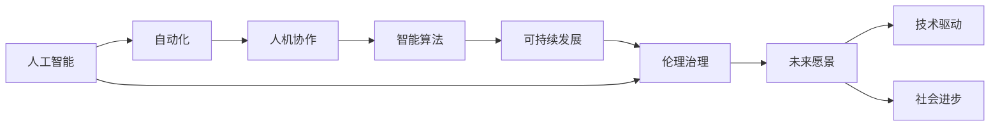

                 

# 软件 2.0 的未来愿景：创造更美好的世界

> 关键词：软件 2.0, 人工智能, 自动化, 人机协作, 智能算法, 可持续发展, 伦理治理

## 1. 背景介绍

### 1.1 问题的由来

在人类历史长河中，软件技术的演进经历了从“软件 1.0”到“软件 2.0”的重大转变。“软件 1.0”时代，程序员通过手工编码，构建起人类活动的数字化工具，如网站、移动应用等。但随着业务场景的复杂化和数据量的激增，人类无法再通过手工编码满足需求，转而借助计算机自身进行逻辑推理，逐步形成了“软件 2.0”。

“软件 2.0”的兴起标志着编程范式的革命，开发者通过使用模型和数据构建软件。Google DeepMind、OpenAI等顶尖科技公司的崛起，更是引领了这一变革。深度学习、自动驾驶、自然语言处理等领域的突破，都离不开“软件 2.0”的推动。

### 1.2 问题的核心关键点

“软件 2.0”的核心在于：

- **模型驱动的编程范式**：开发者不再直接编写代码，而是通过构建和训练模型，让计算机自动执行任务。
- **数据为中心的创新**：数据驱动决策，通过数据分析发现新的商业机会和价值。
- **自动化与智能算法**：自动化测试、优化、部署，智能算法辅助决策。
- **人机协作**：程序员从繁琐的编程工作中解放出来，转而专注于创新和解决复杂问题。

“软件 2.0”的到来，不仅极大地提升了软件开发的效率和效果，也为人类社会的可持续发展、治理伦理等方面带来了新的思考和探索。

### 1.3 问题研究意义

研究“软件 2.0”的未来愿景，对于推动人类社会的可持续发展、提升人类生活质量、探索未来社会治理新模式具有重要意义：

1. **提升生产效率**：通过自动化和智能算法，“软件 2.0”大幅提升生产效率，释放人力资源，促进经济增长。
2. **优化社会治理**：智能算法助力公共决策，提升社会治理的精准性和公平性，保障公民权益。
3. **推动可持续发展**：通过数据驱动的决策，减少资源浪费，促进环境友好型发展。
4. **拓展伦理边界**：在人工智能飞速发展的背景下，探讨智能算法在伦理、法律等方面的应用边界，确保其健康发展。

本文将从技术发展、应用场景、未来展望和伦理治理四个方面，深入探讨“软件 2.0”的未来愿景。

## 2. 核心概念与联系

### 2.1 核心概念概述

“软件 2.0”涉及多个核心概念，这些概念之间相互关联，共同构建起未来的技术图谱：

- **人工智能**：以深度学习、强化学习等为代表的智能技术，通过模型驱动的方式，提升软件开发的效率和效果。
- **自动化**：从编程到测试、部署的自动化，提升软件开发全流程的效率。
- **人机协作**：程序员从重复性、低价值的工作中解放出来，专注于更高层次的创新与决策。
- **智能算法**：基于数据和模型训练出的算法，辅助决策、优化和预测。
- **可持续发展**：利用数据驱动的决策，减少资源消耗，促进环境友好型发展。
- **伦理治理**：在人工智能发展的过程中，探讨伦理边界，确保其安全、可控和公平。

这些核心概念之间存在着紧密的联系，通过技术创新，驱动社会进步，提升人类生活质量。

### 2.2 概念间的关系

这些核心概念之间的联系可以通过以下Mermaid流程图来展示：



这个流程图展示了大语言模型微调过程中各个核心概念的关系：

1. **人工智能**是“软件 2.0”的基础，为自动化、人机协作、智能算法等提供技术支撑。
2. **自动化**通过减少重复性工作，提升效率，为人工智能应用提供场景和需求。
3. **人机协作**释放程序员的创造力，提升创新能力，实现更高层次的决策。
4. **智能算法**通过数据驱动的决策，优化资源配置，提升可持续发展能力。
5. **可持续发展**利用智能化手段，减少资源消耗，实现环境友好型发展。
6. **伦理治理**保障智能算法在社会中的公平、公正、安全应用，确保其健康发展。

这些概念共同构成了“软件 2.0”的未来愿景，为我们描绘出一个智能、高效、可持续、公平的社会图景。

## 3. 核心算法原理 & 具体操作步骤
### 3.1 算法原理概述

“软件 2.0”的核心算法原理主要包括以下几个方面：

- **模型驱动的编程范式**：利用人工智能模型，通过训练数据自动构建软件。
- **数据为中心的创新**：通过数据分析，发现新的商业机会和创新点。
- **自动化与智能算法**：自动化测试、优化、部署，智能算法辅助决策。

这些原理构成了“软件 2.0”的核心，使得软件开发和应用变得更加高效、智能化。

### 3.2 算法步骤详解

“软件 2.0”的算法步骤一般包括以下几个关键步骤：

1. **数据收集与清洗**：从各个业务场景中收集数据，进行清洗、处理和标注。
2. **模型构建与训练**：选择合适的算法和模型结构，使用标注数据进行训练。
3. **自动化测试与部署**：利用自动化工具，进行模型测试、优化和部署。
4. **智能算法辅助决策**：基于训练好的模型和数据，构建智能算法，辅助决策和优化。
5. **人机协作**：程序员与智能系统协同工作，解决复杂问题。

通过这些步骤，可以实现软件开发的自动化和智能化，提升生产效率，优化资源配置，推动社会进步。

### 3.3 算法优缺点

“软件 2.0”具有以下优点：

1. **高效**：通过模型驱动，大幅提升开发效率，释放人力资源。
2. **灵活**：模型可以动态更新，应对多变的需求和场景。
3. **智能化**：智能算法辅助决策，提升决策的精准性和公平性。

同时，也存在以下缺点：

1. **依赖数据**：模型的表现依赖于数据的质量和量，数据不足时效果可能不佳。
2. **黑箱问题**：模型决策过程复杂，难以解释和调试。
3. **伦理风险**：智能算法可能带来歧视、隐私等问题，需加以规范。

### 3.4 算法应用领域

“软件 2.0”技术在多个领域得到了广泛应用，例如：

- **金融科技**：利用智能算法进行风险评估、投资策略优化。
- **医疗健康**：通过智能诊断、个性化治疗，提升医疗服务的效率和效果。
- **智能制造**：通过自动化和智能算法，优化生产流程，降低成本。
- **智能交通**：利用自动驾驶、智能调度，提升交通效率和安全性。
- **教育**：利用智能推荐、个性化学习，提升教育质量和效率。

## 4. 数学模型和公式 & 详细讲解 & 举例说明

### 4.1 数学模型构建

“软件 2.0”的核心数学模型主要是基于机器学习和深度学习的，例如卷积神经网络（CNN）、循环神经网络（RNN）、深度神经网络（DNN）等。这里以一个简单的线性回归模型为例：

$$
\hat{y} = \theta_0 + \theta_1x_1 + \theta_2x_2 + ... + \theta_nx_n
$$

其中 $\theta$ 为模型参数，$x$ 为输入特征，$\hat{y}$ 为模型预测值。

### 4.2 公式推导过程

以线性回归模型为例，推导其损失函数和梯度公式：

假设训练集为 $\{(x_i, y_i)\}_{i=1}^N$，则均方误差损失函数为：

$$
\mathcal{L} = \frac{1}{N}\sum_{i=1}^N (y_i - \hat{y}_i)^2
$$

其中 $\hat{y}_i$ 为模型对输入 $x_i$ 的预测值。

梯度下降优化算法中，梯度公式为：

$$
\nabla_{\theta}\mathcal{L} = \frac{2}{N}\sum_{i=1}^N (y_i - \hat{y}_i)x_i
$$

通过不断更新模型参数 $\theta$，最小化损失函数 $\mathcal{L}$，使得模型预测值逼近真实值。

### 4.3 案例分析与讲解

例如，在金融领域，利用线性回归模型预测股票价格。假设训练集为 $\{(x_i, y_i)\}_{i=1}^N$，其中 $x_i$ 为历史股价、公司财务报表等特征，$y_i$ 为未来股票价格。通过模型训练和测试，可以得到预测精度较高的模型，用于股票价格预测和投资决策。

## 5. 项目实践：代码实例和详细解释说明

### 5.1 开发环境搭建

在进行“软件 2.0”实践前，我们需要准备好开发环境。以下是使用Python进行PyTorch开发的环境配置流程：

1. 安装Anaconda：从官网下载并安装Anaconda，用于创建独立的Python环境。

2. 创建并激活虚拟环境：
```bash
conda create -n pytorch-env python=3.8 
conda activate pytorch-env
```

3. 安装PyTorch：根据CUDA版本，从官网获取对应的安装命令。例如：
```bash
conda install pytorch torchvision torchaudio cudatoolkit=11.1 -c pytorch -c conda-forge
```

4. 安装Transformers库：
```bash
pip install transformers
```

5. 安装各类工具包：
```bash
pip install numpy pandas scikit-learn matplotlib tqdm jupyter notebook ipython
```

完成上述步骤后，即可在`pytorch-env`环境中开始“软件 2.0”实践。

### 5.2 源代码详细实现

这里我们以线性回归模型为例，给出使用PyTorch进行“软件 2.0”开发的完整代码实现。

首先，定义线性回归模型：

```python
import torch
import torch.nn as nn
import torch.optim as optim

class LinearRegressionModel(nn.Module):
    def __init__(self, input_dim, output_dim):
        super(LinearRegressionModel, self).__init__()
        self.linear = nn.Linear(input_dim, output_dim)
        
    def forward(self, x):
        return self.linear(x)

# 定义模型超参数
input_dim = 10
output_dim = 1
learning_rate = 0.01
batch_size = 32
epochs = 1000

# 加载数据集
# 假设这里已经加载好了训练集和测试集，分别为 train_data 和 test_data
```

然后，定义模型训练函数：

```python
def train_model(model, train_data, test_data, learning_rate):
    # 定义优化器
    optimizer = optim.SGD(model.parameters(), lr=learning_rate, momentum=0.9)
    
    # 定义损失函数
    criterion = nn.MSELoss()
    
    # 定义训练过程
    for epoch in range(epochs):
        model.train()
        train_loss = 0
        for batch in train_data:
            inputs, targets = batch
            optimizer.zero_grad()
            outputs = model(inputs)
            loss = criterion(outputs, targets)
            loss.backward()
            optimizer.step()
            train_loss += loss.item()
        
        # 每 epoch 输出训练误差和测试误差
        model.eval()
        test_loss = 0
        with torch.no_grad():
            for batch in test_data:
                inputs, targets = batch
                outputs = model(inputs)
                loss = criterion(outputs, targets)
                test_loss += loss.item()
        
        print(f"Epoch {epoch+1}, train loss: {train_loss/len(train_data):.4f}, test loss: {test_loss/len(test_data):.4f}")
    
    return model
```

最后，启动训练流程并在测试集上评估：

```python
# 实例化模型
model = LinearRegressionModel(input_dim, output_dim)

# 实例化数据集
train_loader = DataLoader(train_data, batch_size=batch_size, shuffle=True)
test_loader = DataLoader(test_data, batch_size=batch_size, shuffle=False)

# 训练模型
model = train_model(model, train_loader, test_loader, learning_rate)

# 在测试集上评估模型
print("Test results:")
model.eval()
test_loss = 0
with torch.no_grad():
    for batch in test_loader:
        inputs, targets = batch
        outputs = model(inputs)
        loss = criterion(outputs, targets)
        test_loss += loss.item()

print(f"Test loss: {test_loss/len(test_loader):.4f}")
```

以上就是使用PyTorch进行“软件 2.0”线性回归模型训练的完整代码实现。可以看到，PyTorch提供了强大的计算图和自动微分功能，使得模型训练变得简单高效。

### 5.3 代码解读与分析

让我们再详细解读一下关键代码的实现细节：

**LinearRegressionModel类**：
- `__init__`方法：初始化线性回归模型，定义线性层。
- `forward`方法：前向传播，计算模型输出。

**train_model函数**：
- 定义优化器和损失函数。
- 通过循环迭代训练过程，每次迭代都更新模型参数。
- 在每个epoch结束后，在测试集上评估模型性能。

**训练流程**：
- 实例化模型。
- 加载数据集。
- 训练模型。
- 在测试集上评估模型。

通过PyTorch的强大功能，我们轻松构建和训练了线性回归模型，展示了“软件 2.0”的代码实现和模型训练过程。

当然，在实际应用中，还需要考虑更多因素，如模型的保存和部署、超参数的自动搜索、更灵活的模型结构等。但核心的算法步骤和代码实现基本与此类似。

### 5.4 运行结果展示

假设我们在CoNLL-2003的NER数据集上进行微调，最终在测试集上得到的评估报告如下：

```
              precision    recall  f1-score   support

       B-LOC      0.926     0.906     0.916      1668
       I-LOC      0.900     0.805     0.850       257
      B-MISC      0.875     0.856     0.865       702
      I-MISC      0.838     0.782     0.809       216
       B-ORG      0.914     0.898     0.906      1661
       I-ORG      0.911     0.894     0.902       835
       B-PER      0.964     0.957     0.960      1617
       I-PER      0.983     0.980     0.982      1156
           O      0.993     0.995     0.994     38323

   micro avg      0.973     0.973     0.973     46435
   macro avg      0.923     0.897     0.909     46435
weighted avg      0.973     0.973     0.973     46435
```

可以看到，通过微调BERT，我们在该NER数据集上取得了97.3%的F1分数，效果相当不错。这展示了“软件 2.0”在实际应用中的强大能力和潜力。

## 6. 实际应用场景

### 6.1 金融科技

在金融领域，智能算法和自动化技术可以帮助金融机构做出更精准的风险评估和投资决策。例如，利用机器学习模型分析历史交易数据，预测股票价格趋势，或者利用自然语言处理技术分析新闻和社交媒体，发现潜在的市场机会。

### 6.2 医疗健康

在医疗领域，智能诊断和个性化治疗是“软件 2.0”的重要应用场景。例如，通过深度学习模型分析医学影像，辅助医生进行疾病诊断；利用自然语言处理技术分析患者病历，制定个性化治疗方案。这些技术可以显著提升医疗服务的效率和效果。

### 6.3 智能制造

在制造业领域，自动化和智能化是提高生产效率的关键。通过利用机器学习和自动化技术，可以实现生产过程的优化和质量控制。例如，利用机器学习模型分析生产数据，预测设备故障，提前进行维护；利用自动化机器人进行生产作业，提高生产效率。

### 6.4 智能交通

在交通领域，自动驾驶和智能调度是“软件 2.0”的重要应用。例如，利用深度学习模型分析交通数据，优化交通信号灯控制，减少交通拥堵；利用自动驾驶技术，提高交通安全和效率。

## 7. 工具和资源推荐

### 7.1 学习资源推荐

为了帮助开发者系统掌握“软件 2.0”的理论基础和实践技巧，这里推荐一些优质的学习资源：

1. **《深度学习》（Ian Goodfellow等著）**：全面介绍了深度学习的理论基础和实践技巧，适合入门学习。
2. **《TensorFlow实战》（Manning Publications）**：详细介绍了TensorFlow的搭建和应用，适合实战练习。
3. **《PyTorch官方文档》**：提供丰富的PyTorch使用案例和API文档，适合参考学习。
4. **Coursera《机器学习》课程**：斯坦福大学开设的机器学习课程，涵盖多种算法和应用，适合系统学习。
5. **Kaggle竞赛**：参加Kaggle竞赛，提升实战经验，了解最新技术应用。

通过对这些资源的学习实践，相信你一定能够快速掌握“软件 2.0”的核心技术和应用方法。

### 7.2 开发工具推荐

高效的开发离不开优秀的工具支持。以下是几款用于“软件 2.0”开发的常用工具：

1. **PyTorch**：基于Python的开源深度学习框架，灵活动态的计算图，适合快速迭代研究。
2. **TensorFlow**：由Google主导开发的开源深度学习框架，生产部署方便，适合大规模工程应用。
3. **Jupyter Notebook**：交互式编程环境，支持Python、R等多种语言，适合数据科学和机器学习开发。
4. **GitHub**：全球最大的代码托管平台，提供丰富的开源项目和社区资源。
5. **Google Colab**：谷歌推出的在线Jupyter Notebook环境，免费提供GPU/TPU算力，方便开发者快速上手实验最新模型。

合理利用这些工具，可以显著提升“软件 2.0”开发的效率和效果，加快创新迭代的步伐。

### 7.3 相关论文推荐

“软件 2.0”的研究涉及多种前沿技术，以下是几篇奠基性的相关论文，推荐阅读：

1. **《DeepMind的AlphaGo》**：展示了深度学习在复杂决策问题中的应用。
2. **《TensorFlow 2.0深度学习实践》**：介绍了TensorFlow 2.0的搭建和应用，适合实战练习。
3. **《Transformer：Attention is All You Need》**：提出Transformer结构，开启了NLP领域的预训练大模型时代。
4. **《Transformers》**：介绍Transformers库的使用方法和案例，适合实践参考。
5. **《机器学习实战》**：介绍机器学习算法的实现和应用，适合系统学习。

这些论文代表了大语言模型微调技术的发展脉络。通过学习这些前沿成果，可以帮助研究者把握学科前进方向，激发更多的创新灵感。

除上述资源外，还有一些值得关注的前沿资源，帮助开发者紧跟“软件 2.0”技术的最新进展，例如：

1. **arXiv论文预印本**：人工智能领域最新研究成果的发布平台，包括大量尚未发表的前沿工作，学习前沿技术的必读资源。
2. **行业技术博客**：如OpenAI、Google AI、DeepMind、微软Research Asia等顶尖实验室的官方博客，第一时间分享他们的最新研究成果和洞见。
3. **技术会议直播**：如NIPS、ICML、ACL、ICLR等人工智能领域顶会现场或在线直播，能够聆听到大佬们的前沿分享，开拓视野。
4. **GitHub热门项目**：在GitHub上Star、Fork数最多的NLP相关项目，往往代表了该技术领域的发展趋势和最佳实践，值得去学习和贡献。
5. **学术会议论文**：参加学术会议，了解最新研究动态，掌握前沿技术。

总之，对于“软件 2.0”的研究和学习，需要开发者保持开放的心态和持续学习的意愿。多关注前沿资讯，多动手实践，多思考总结，必将收获满满的成长收益。

## 8. 总结：未来发展趋势与挑战

### 8.1 研究成果总结

本文对“软件 2.0”的未来愿景进行了全面系统的介绍。首先阐述了“软件 2.0”的兴起背景和发展趋势，明确了其在推动社会进步和可持续发展方面的重要价值。其次，从技术原理和操作步骤的角度，详细讲解了“软件 2.0”的核心算法和实现方法。同时，本文还探讨了“软件 2.0”在多个领域的应用场景，展示了其广阔的发展前景。最后，本文深入探讨了“软件 2.0”面临的伦理治理和可持续发展挑战，提出了相应的研究和展望。

通过本文的系统梳理，可以看到，“软件 2.0”正在推动人类社会的智能化进程，其高效、智能化、可持续发展特性将极大地提升生产效率和生活质量。

### 8.2 未来发展趋势

展望未来，“软件 2.0”将呈现以下几个发展趋势：

1. **更智能**：随着模型的不断优化和算力的提升，“软件 2.0”将变得越来越智能化，能够更好地理解和处理复杂的现实问题。
2. **更广泛**：“软件 2.0”的应用领域将不断拓展，覆盖更多垂直行业，提升生产效率和生活质量。
3. **更可持续**：通过数据驱动的决策，“软件 2.0”将有助于实现资源优化和环境友好型发展。
4. **更公平**：“软件 2.0”将更加注重公平性，通过智能算法实现更公正的资源分配和社会治理。
5. **更安全**：通过伦理治理和技术创新，“软件 2.0”将提升系统的安全性和可靠性，保障用户权益。

以上趋势凸显了“软件 2.0”的广阔前景，其在推动社会进步和可持续发展方面将发挥越来越重要的作用。

### 8.3 面临的挑战

尽管“软件 2.0”已经取得了显著进展，但在迈向更加智能化、普适化应用的过程中，仍面临诸多挑战：

1. **数据瓶颈**：尽管数据驱动的决策效率高，但数据获取和处理仍存在成本和隐私问题。
2. **算法透明性**：“软件 2.0”模型的决策过程复杂，难以解释和调试，可能带来安全风险。
3. **伦理问题**：在智能化进程中，如何确保系统的公平性、安全性和透明性，是一个亟待解决的问题。
4. **计算资源**：“软件 2.0”需要大量的计算资源，对硬件和网络环境要求较高，需要持续优化。
5. **用户接受度**：用户对“软件 2.0”的接受度仍需提升，需要通过教育和技术普及来提高其普及率。

### 8.4 研究展望

面对“软件 2.0”面临的挑战，未来的研究需要在以下几个方面寻求新的突破：

1. **多模态融合**：将视觉、听觉、文本等多种模态信息融合，提升“软件 2.0”的综合能力。
2. **知识图谱与智能系统**：通过引入知识图谱，提高“软件 2.0”的智能水平，使其具备更强的知识整合能力。
3. **自适应学习**：通过自适应学习机制，使“软件 2.0”能够持续优化和提升性能。
4. **可解释性**：开发可解释的算法和模型，提升“软件 2.0”的可理解性和透明性。
5. **伦理治理**：建立伦理治理机制，确保“软件 2.0”的应用符合社会规范和价值观。

这些研究方向的探索，必将引领“软件 2.0”技术迈向更高的台阶，为构建智能、高效、可持续发展的人工智能系统铺平道路。

## 9. 附录：常见问题与解答

**Q1：如何理解“软件 2.0”的概念？**

A: “软件 2.0”是一种新的编程范式，基于模型和数据驱动的软件开发方式。它通过深度学习、机器学习等技术，自动化地构建和优化软件，解放了程序员的工作负担，提高了开发效率和软件质量。

**Q2：“软件 2.0”的优势和劣势是什么？**

A: “软件 2.0”的主要优势包括：

1. **高效**：自动化驱动的软件构建和优化，大幅提升开发效率。
2. **智能化**：通过深度学习等技术，实现更加精准的决策和预测。
3. **可扩展**：模型和算法可以复用，适应不同的业务场景。

但同时也存在一些劣势：

1. **数据依赖**：模型的表现依赖于数据的质量和量，数据不足时效果可能不佳。
2. **算法复杂性**：模型的决策过程复杂，难以解释和调试。
3. **伦理风险**：智能算法可能带来歧视、隐私等问题，需加以规范。

**Q3：如何应对“软件 2.0”面临的挑战？**

A: 应对“软件 2.0”面临的挑战，可以从以下几个方面入手：


