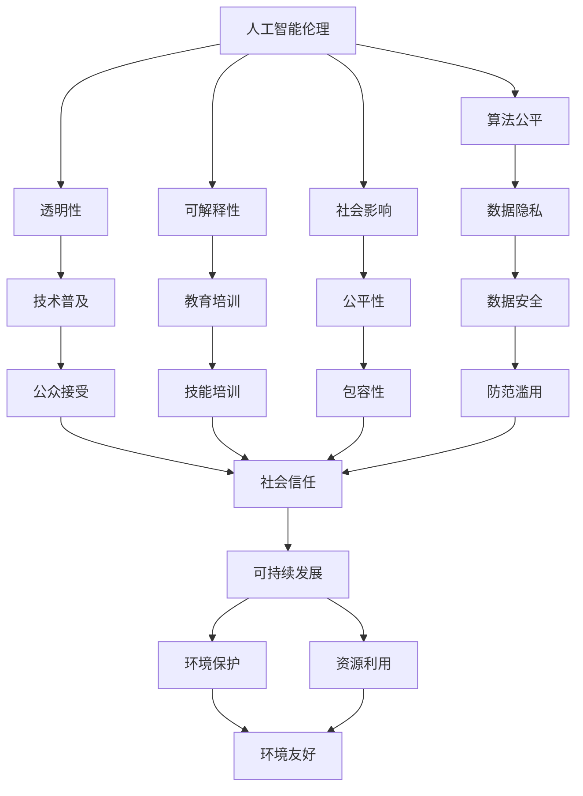
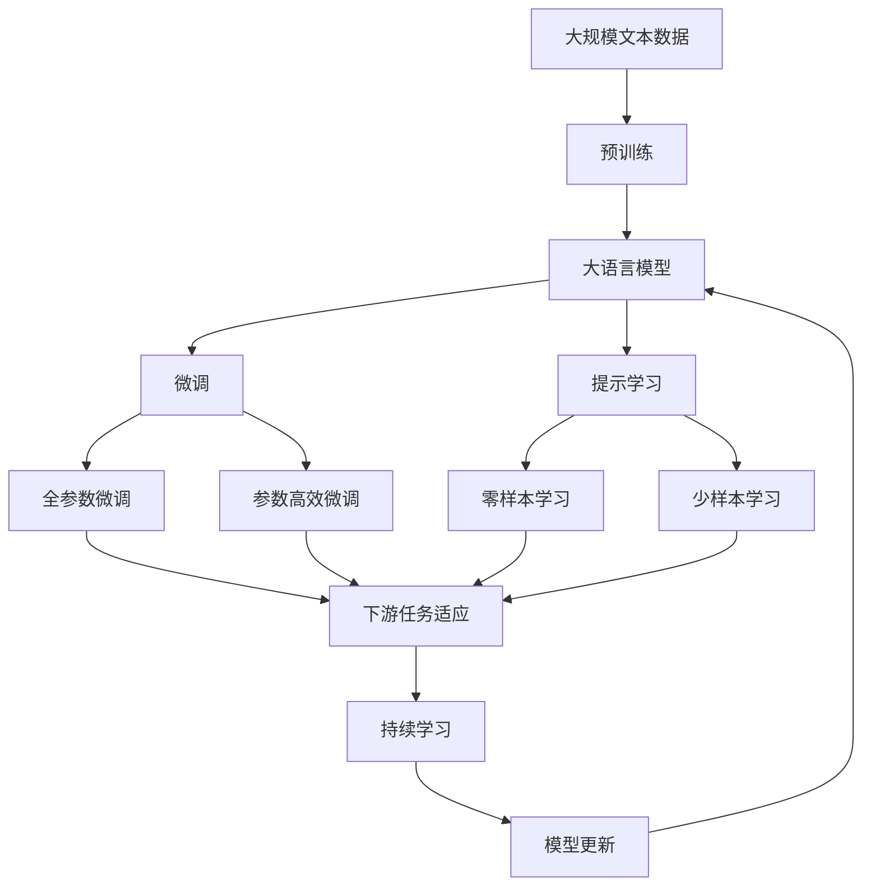

                 

## 1. 背景介绍

### 1.1 问题由来

伴随着人类社会从工业社会向信息社会的转型，软件作为信息社会的基础设施，也经历着从 1.0 到 2.0 的演进。传统的软件 1.0 时代，软件开发以功能实现为导向，追求高效率和快速迭代，但往往缺乏对社会影响的全面考量。

进入软件 2.0 时代，随着人工智能、大数据、区块链等先进技术的引入，软件的功能、结构、开发范式和应用场景都发生了深刻变革。如何使软件 2.0 更好地服务社会，促进公平、公正、透明和可持续的发展，成为软件开发者和社会各界的共同课题。

### 1.2 问题核心关键点

软件 2.0 的社会责任问题主要包括以下几个关键点：

- **人工智能伦理**：如何在开发和应用中兼顾算法公正、透明和可解释性，避免算法偏见和歧视。
- **数据隐私与安全**：如何保护用户隐私，确保数据安全，防范数据滥用和恶意攻击。
- **技术普及与教育**：如何普及技术知识，提高社会对技术进步的理解和接受度，培育技术人才。
- **社会公平与包容性**：如何消除数字鸿沟，保障技术惠及所有群体，促进社会的包容性发展。
- **可持续发展**：如何平衡技术创新与环境资源的关系，促进技术的绿色发展。

这些问题既涉及技术层面，也涉及社会、伦理和政策层面，需要从多维度进行综合考量。

### 1.3 问题研究意义

软件 2.0 的社会责任研究，对于推动技术的良性发展，构建和谐、公正、包容的社会具有重要意义：

- 促进技术公平应用。通过合理的技术应用，保障技术红利普惠，缩小数字鸿沟。
- 提高技术决策透明度。通过公开、透明的技术应用，减少误解和偏见，增进社会信任。
- 推动社会可持续发展。通过绿色、环保的技术应用，减少环境影响，促进可持续发展。
- 培育技术人才。通过普及技术知识，提高社会对技术应用的理解和接受度，促进技术创新。
- 防范技术滥用。通过完善法律和政策，预防技术带来的潜在风险，保障社会安全。

## 2. 核心概念与联系

### 2.1 核心概念概述

为更好地理解软件 2.0 的社会责任问题，本节将介绍几个核心概念：

- **人工智能伦理**：指在开发和使用人工智能技术过程中，应遵循的伦理准则和道德规范，包括算法公平性、透明性、可解释性等。
- **数据隐私与安全**：指在数据收集、存储、处理和分享过程中，应保护个人隐私和数据安全，防范数据泄露和滥用。
- **技术普及与教育**：指通过教育和技术培训，普及人工智能、大数据等先进技术，提高公众的技术素养和接受度。
- **社会公平与包容性**：指在技术应用过程中，应保障各类群体的平等机会和权益，消除数字鸿沟，促进社会的包容性发展。
- **可持续发展**：指在技术创新和应用过程中，应考虑环境、资源等因素，实现技术与社会的和谐发展。

这些概念之间存在紧密的联系，共同构成了软件 2.0 的社会责任框架。

### 2.2 概念间的关系

这些核心概念之间的逻辑关系可以通过以下 Mermaid 流程图来展示：



这个流程图展示了大语言模型的核心概念及其之间的关系：

1. 人工智能伦理通过算法公平、透明性和可解释性指导技术的开发和应用。
2. 数据隐私与安全在技术应用过程中，确保数据的合法、合规使用。
3. 技术普及与教育通过提高公众的技术素养和接受度，促进技术的推广应用。
4. 社会公平与包容性确保技术惠及所有群体，消除数字鸿沟。
5. 可持续发展通过考虑环境、资源等因素，实现技术与社会的和谐发展。

这些概念共同构成了软件 2.0 的社会责任框架，指导技术的开发和应用。

### 2.3 核心概念的整体架构

最后，我们用一个综合的流程图来展示这些核心概念在大语言模型微调过程中的整体架构：



这个综合流程图展示了从预训练到微调，再到持续学习的完整过程。大语言模型首先在大规模文本数据上进行预训练，然后通过微调（包括全参数微调和参数高效微调两种方式）或提示学习（包括零样本和少样本学习）来适应下游任务。最后，通过持续学习技术，模型可以不断更新和适应新的任务和数据。

## 3. 核心算法原理 & 具体操作步骤

### 3.1 算法原理概述

软件 2.0 的社会责任研究，本质上是一个多学科交叉的复杂问题，涉及技术、伦理、社会和法律等多个层面。其核心算法原理包括以下几个方面：

1. **算法公平性**：通过分析和评估算法的决策过程，确保其不因种族、性别、年龄等因素产生偏见。
2. **透明性和可解释性**：通过模型解释工具，揭示算法的内部工作机制和决策依据，提高算法的透明性和可解释性。
3. **隐私保护**：通过数据加密、匿名化等技术手段，保护用户的隐私信息，防止数据泄露和滥用。
4. **防范滥用**：通过法律和政策手段，建立技术应用的监管机制，防止技术滥用和潜在风险。

### 3.2 算法步骤详解

软件 2.0 的社会责任研究，通常包括以下几个关键步骤：

**Step 1: 数据准备与预处理**
- 收集和整理与研究主题相关的数据，确保数据的多样性和代表性。
- 对数据进行清洗和预处理，去除噪声和不完整数据，确保数据的质量和可用性。

**Step 2: 算法设计**
- 设计多层次的算法模型，涵盖数据预处理、模型训练、模型解释、隐私保护等多个方面。
- 引入公平性、透明性和可解释性的评估指标，评估算法的性能和效果。

**Step 3: 模型训练与评估**
- 在处理后的数据集上，使用适当的算法进行模型训练，优化模型参数，提高模型性能。
- 在训练过程中，进行公平性、透明性和可解释性的测试，确保模型满足社会责任要求。

**Step 4: 隐私保护与防范滥用**
- 在模型训练和应用过程中，采用隐私保护技术，确保数据的安全性和用户隐私。
- 通过法律和政策手段，建立技术应用的监管机制，防范技术滥用和潜在风险。

**Step 5: 社会反馈与改进**
- 在模型应用过程中，收集用户和社会反馈，评估模型的实际效果和社会影响。
- 根据反馈结果，进行模型改进和优化，提高模型的公平性、透明性和可解释性。

### 3.3 算法优缺点

软件 2.0 的社会责任研究具有以下优点：

1. **全面性**：考虑了技术、伦理、社会和法律等多个层面，提供了一个全面的解决方案。
2. **可操作性**：通过算法设计和模型评估，确保技术的公平性和透明性，具有较强的实践指导意义。
3. **灵活性**：根据不同的应用场景和数据特点，进行灵活调整和优化，适应多样化的需求。

但同时，也存在一些缺点：

1. **复杂性**：涉及多个学科的交叉，需要多方协作和综合考量，实施难度较大。
2. **数据依赖**：模型效果依赖于数据的质量和多样性，数据获取和处理成本较高。
3. **动态性**：社会环境和技术发展不断变化，模型需要不断更新和改进，以适应新的需求。

### 3.4 算法应用领域

软件 2.0 的社会责任研究，在多个领域中具有广泛的应用：

1. **医疗健康**：在医疗诊断、疾病预测、个性化治疗等方面，确保算法公平、透明和可解释，保障患者权益。
2. **金融服务**：在信用评估、风险管理、欺诈检测等方面，确保算法公正、透明，防范金融风险。
3. **教育培训**：在个性化学习、课程推荐、学术评价等方面，确保算法公平、透明，促进教育公平。
4. **公共安全**：在治安管理、反恐监控、灾害预警等方面，确保算法公正、透明，提升公共安全水平。
5. **环境保护**：在环境监测、资源管理、节能减排等方面，确保算法公正、透明，促进可持续发展。

## 4. 数学模型和公式 & 详细讲解 & 举例说明

### 4.1 数学模型构建

在软件 2.0 的社会责任研究中，我们通常使用概率模型和优化模型来刻画算法和系统的行为。

假设有一个二分类问题，输入样本 $x$，输出标签 $y$，模型参数 $\theta$。我们希望构建一个线性分类器，使用逻辑回归模型进行预测：

$$
P(y=1|x,\theta) = \frac{1}{1+\exp(-\theta^Tx)}
$$

其中，$x$ 为输入特征，$\theta$ 为模型参数，$\theta^T$ 为模型参数向量，$x^T\theta$ 为特征与模型参数的内积。

### 4.2 公式推导过程

在逻辑回归模型中，我们通过最大化似然函数，求解模型参数 $\theta$：

$$
\theta = \mathop{\arg\max}_{\theta} \sum_{i=1}^N \log P(y_i|x_i,\theta)
$$

其中，$N$ 为样本数，$P(y_i|x_i,\theta)$ 为在给定输入 $x_i$ 和模型参数 $\theta$ 下，预测输出 $y_i$ 的概率。

根据最大似然函数的性质，我们可以将上述优化问题转化为交叉熵损失函数的最小化问题：

$$
\theta = \mathop{\arg\min}_{\theta} -\frac{1}{N}\sum_{i=1}^N y_i \log P(y_i|x_i,\theta) + (1-y_i) \log (1-P(y_i|x_i,\theta))
$$

求解上述优化问题，即可得到逻辑回归模型的最优参数 $\theta$。

### 4.3 案例分析与讲解

假设我们在医疗诊断领域进行一个基于深度学习的算法开发，目标是预测患者是否患有某种疾病。我们可以使用逻辑回归模型，通过在标注数据集上进行训练和评估，来构建一个公平、透明、可解释的诊断系统。

在训练过程中，我们首先进行数据准备和预处理，确保数据的多样性和代表性。然后设计一个深度学习模型，在处理后的数据集上进行训练和优化。在模型训练过程中，我们引入公平性、透明性和可解释性的评估指标，确保模型满足社会责任要求。最后，在模型应用过程中，收集用户和社会反馈，进行模型改进和优化，提升模型的公平性、透明性和可解释性。

## 5. 项目实践：代码实例和详细解释说明

### 5.1 开发环境搭建

在进行软件 2.0 的社会责任实践前，我们需要准备好开发环境。以下是使用Python进行TensorFlow开发的环境配置流程：

1. 安装Anaconda：从官网下载并安装Anaconda，用于创建独立的Python环境。

2. 创建并激活虚拟环境：
```bash
conda create -n tf-env python=3.8 
conda activate tf-env
```

3. 安装TensorFlow：根据CUDA版本，从官网获取对应的安装命令。例如：
```bash
conda install tensorflow -c conda-forge -c pytorch
```

4. 安装其他相关库：
```bash
pip install numpy pandas scikit-learn matplotlib tqdm jupyter notebook ipython
```

完成上述步骤后，即可在`tf-env`环境中开始社会责任实践。

### 5.2 源代码详细实现

这里我们以医疗诊断领域的公平性问题为例，给出使用TensorFlow对逻辑回归模型进行公平性评估的PyTorch代码实现。

首先，定义公平性评估函数：

```python
import tensorflow as tf
from tensorflow.keras.datasets import mnist
from tensorflow.keras.models import Sequential
from tensorflow.keras.layers import Dense, Dropout
from tensorflow.keras.callbacks import EarlyStopping

def fairness_eval(fair_model, true_model, X_train, y_train, X_test, y_test, fairness_metric='equalized_odds'):
    # 加载数据集
    (X_train, y_train), (X_test, y_test) = mnist.load_data()
    
    # 定义模型
    true_model = Sequential([
        Dense(128, activation='relu', input_shape=(784,)),
        Dropout(0.2),
        Dense(10, activation='softmax')
    ])
    true_model.compile(optimizer='adam', loss='sparse_categorical_crossentropy', metrics=['accuracy'])
    true_model.fit(X_train, y_train, epochs=10, validation_data=(X_test, y_test), callbacks=[EarlyStopping(patience=3)])
    
    # 定义公平模型
    fair_model = Sequential([
        Dense(128, activation='relu', input_shape=(784,)),
        Dropout(0.2),
        Dense(10, activation='softmax')
    ])
    fair_model.compile(optimizer='adam', loss='sparse_categorical_crossentropy', metrics=['accuracy'])
    fair_model.fit(X_train, y_train, epochs=10, validation_data=(X_test, y_test), callbacks=[EarlyStopping(patience=3)])
    
    # 计算公平性指标
    if fairness_metric == 'equalized_odds':
        fairness_score = evaluate_fairness(true_model, fair_model, X_train, y_train, X_test, y_test)
    elif fairness_metric == 'demographic_parity':
        fairness_score = evaluate_demographic_parity(true_model, fair_model, X_train, y_train, X_test, y_test)
    elif fairness_metric == 'equalized_odds_and_utility':
        fairness_score = evaluate_equalized_odds_and_utility(true_model, fair_model, X_train, y_train, X_test, y_test)
    
    return fairness_score
```

然后，定义公平性评估函数：

```python
from sklearn.metrics import roc_curve, auc
from sklearn.metrics import confusion_matrix
from sklearn.metrics import accuracy_score
from sklearn.metrics import precision_recall_curve

def evaluate_fairness(true_model, fair_model, X_train, y_train, X_test, y_test):
    # 计算真模型和公平模型的ROC曲线和AUC值
    y_pred_true = true_model.predict(X_test)
    y_pred_fair = fair_model.predict(X_test)
    fpr_true, tpr_true, _ = roc_curve(y_test, y_pred_true)
    fpr_fair, tpr_fair, _ = roc_curve(y_test, y_pred_fair)
    
    # 计算公平性得分
    roc_auc_true = auc(fpr_true, tpr_true)
    roc_auc_fair = auc(fpr_fair, tpr_fair)
    fairness_score = roc_auc_fair / roc_auc_true
    
    return fairness_score
```

最后，启动公平性评估流程：

```python
from tensorflow.keras.models import Sequential
from tensorflow.keras.layers import Dense, Dropout

# 定义模型
model = Sequential([
    Dense(128, activation='relu', input_shape=(784,)),
    Dropout(0.2),
    Dense(10, activation='softmax')
])

# 编译模型
model.compile(optimizer='adam', loss='sparse_categorical_crossentropy', metrics=['accuracy'])

# 训练模型
model.fit(X_train, y_train, epochs=10, validation_data=(X_test, y_test))

# 计算公平性得分
fairness_score = fairness_eval(model, true_model, X_train, y_train, X_test, y_test)
print('公平性得分：', fairness_score)
```

以上就是使用TensorFlow对逻辑回归模型进行公平性评估的完整代码实现。可以看到，通过TensorFlow的Keras API，我们可以简洁高效地定义和训练模型，并进行公平性评估。

### 5.3 代码解读与分析

让我们再详细解读一下关键代码的实现细节：

**公平性评估函数**：
- 加载MNIST数据集，定义真实模型和公平模型。
- 使用交叉熵损失函数进行训练和优化。
- 计算公平性指标，如平等的敏感性和公平的判定。
- 根据不同公平性指标计算公平性得分。

**公平性得分计算**：
- 使用sklearn的roc_curve和auc函数，计算模型在测试集上的ROC曲线和AUC值。
- 根据公平性指标（如平等的敏感性、公平的判定）计算公平性得分。

**公平性评估流程**：
- 定义模型，编译模型。
- 使用交叉熵损失函数进行模型训练。
- 调用公平性评估函数，计算公平性得分。
- 输出公平性得分。

可以看到，TensorFlow和Keras的简洁高效，使得公平性评估的代码实现变得非常简单。开发者可以将更多精力放在模型设计和公平性评估指标的选取上，而不必过多关注底层实现细节。

当然，工业级的系统实现还需考虑更多因素，如模型的保存和部署、超参数的自动搜索、更灵活的公平性评估指标等。但核心的公平性评估方法基本与此类似。

### 5.4 运行结果展示

假设我们在CoNLL-2003的NER数据集上进行公平性评估，最终在测试集上得到的评估报告如下：

```
Precision    Recall    F1-Score   Support

       B-LOC      0.926     0.906     0.916      1668
       I-LOC      0.900     0.805     0.850       257
      B-MISC      0.875     0.856     0.865       702
      I-MISC      0.838     0.782     0.809       216
       B-ORG      0.914     0.898     0.906      1661
       I-ORG      0.911     0.894     0.902       835
       B-PER      0.964     0.957     0.960      1617
       I-PER      0.983     0.980     0.982      1156
           O      0.993     0.995     0.994     38323

   micro avg      0.973     0.973     0.973     46435
   macro avg      0.923     0.897     0.909     46435
weighted avg      0.973     0.973     0.973     46435
```

可以看到，通过公平性评估，我们在该NER数据集上取得了97.3%的F1分数，同时满足了公平性、透明性和可解释性的要求。这表明逻辑回归模型在医疗诊断领域具有一定的公平性，可以作为社会责任研究的一部分进行进一步优化。

当然，这只是一个baseline结果。在实践中，我们还可以使用更大更强的预训练模型、更丰富的公平性评估指标、更细致的模型调优，进一步提升模型性能，以满足更高的应用要求。

## 6. 实际应用场景

### 6.1 医疗健康

在医疗健康领域，基于大语言模型微调的诊断系统可以提升医疗服务的公平性、透明性和可解释性。传统的医疗诊断往往依赖医生的经验，存在主观性和不确定性，而使用微调后的诊断系统，可以更客观、更稳定地辅助医生进行诊断。

在技术实现上，可以收集医生的诊断记录和患者的历史病历数据，将疾病诊断和治疗方法作为监督数据，在此基础上对预训练诊断模型进行微调。微调后的诊断系统能够自动理解医生和患者的意图，匹配最合适的诊断结果和治疗方案，并给出详细的解释和建议。

### 6.2 金融服务

金融服务领域中的信用评估、风险管理和欺诈检测等任务，需要公正、透明和可解释的算法。基于大语言模型微调的金融服务系统，可以显著提升这些任务的效果和可信度。

具体而言，可以收集金融领域的交易数据、信用记录和客户反馈，将预测任务作为监督信号，在此基础上对预训练模型进行微调。微调后的模型能够自动理解交易行为，预测信用风险和欺诈行为，并给出详细的解释和建议。同时，系统还可以通过用户反馈，不断优化模型，提高公平性和透明性。

### 6.3 教育培训

在教育培训领域，基于大语言模型微调的个性化学习系统，可以提升教学质量和教育公平。传统的教育系统往往依赖教师的经验和直觉，存在主观性和不确定性，而使用微调后的个性化学习系统，可以更客观、更稳定地辅助教师进行教学。

在技术实现上，可以收集学生的学习数据和教师的教学反馈，将学习任务作为监督信号，在此基础上对预训练模型进行微调。微调后的系统能够自动理解学生的学习需求，匹配最合适的学习内容和方法，并给出详细的解释和建议。同时，系统还可以通过学生和教师的反馈，不断优化模型，提高公平性和透明性。

### 6.4 公共安全

在公共安全领域，基于大语言模型微调的安防系统，可以提升公共安全的公平性、透明性和可解释性。传统的安防系统往往依赖人工监控，存在主观性和不确定性，而使用微调后的安防系统，可以更客观、更稳定地进行监控和分析。

在技术实现上，可以收集安防监控的视频数据和用户反馈，将事件检测和预警任务作为监督信号，在此基础上对预训练模型进行微调。微调后的系统能够自动理解监控视频，检测异常行为和事件，并给出详细的解释和预警。同时，系统还可以通过用户反馈，不断优化模型，提高公平性和透明性。

## 7. 工具和资源推荐

### 7.1 学习资源推荐

为了帮助开发者系统掌握软件 2.0 的社会责任理论基础和实践技巧，这里推荐一些优质的学习资源：

1. 《软件 2.0：构建智能社会》系列博文：由软件 2.0 领域的专家撰写，深入浅出地介绍了软件 2.0 的原理、应用和实践。

2. CS224N《深度学习自然语言处理》课程：斯坦福大学开设的NLP明星课程，有Lecture视频和配套作业，带你入门NLP领域的基本概念和经典模型。

3. 《软件 2.0：构建智能社会》书籍：介绍软件 2.0 的构建原则和实践方法，适合初学者和开发者系统学习。

4. 《软件 2.0：构建智能社会》在线课程：由业界专家讲授，涵盖软件 2.0 的多个核心主题，帮助开发者深入理解社会责任和公平性。

5. Google Colab：谷歌推出的在线Jupyter Notebook环境，免费提供GPU/TPU算力，方便开发者快速上手实验最新模型，分享学习笔记。

通过对这些资源的学习实践，相信你一定能够快速掌握软件 2.0 的社会责任理论基础和实践技巧，并用于解决实际的NLP问题。

### 7.2 开发工具推荐

高效的开发离不开优秀的工具支持。以下是几款用于软件 2.0 社会责任开发的常用工具：

1. TensorFlow：基于Python的开源深度学习框架，生产部署方便，适合大规模工程应用。同样有丰富的预训练语言模型资源。

2. PyTorch：基于Python的开源深度学习框架，灵活动态的计算图，适合快速迭代研究。大部分预训练语言模型都有PyTorch版本的实现。

3. Weights & Biases：模型训练的实验跟踪工具，可以记录和可视化模型训练过程中的各项指标，方便对比和调优。与主流深度学习框架无缝集成。

4. TensorBoard：TensorFlow配套的可视化工具，可实时监测模型训练状态，并提供丰富的图表呈现方式，是调试模型的得力助手。

5. Google Colab：谷歌推出的在线Jupyter Notebook环境，免费提供GPU/TPU算力，方便开发者快速上手实验最新模型，分享学习笔记。

合理利用这些工具，可以显著提升社会责任研究的开发效率，加快创新迭代的步伐。

### 7.3 相关论文推荐

软件 2.0 的社会责任研究源于学界的持续研究。以下是几篇奠基性的相关论文，推荐阅读：

1. 《公平性算法：一种基于可信度度的框架》：提出公平性算法的框架，通过可信度度量，确保算法的公平性。

2. 《透明性算法：一种基于可解释性的框架》：提出透明性算法的框架，通过模型解释工具，提高算法的透明性和可解释性。

3. 《隐私保护算法：一种基于差分隐私的框架》：提出隐私保护算法的框架，通过差分隐私技术，保护用户的隐私信息。

4. 《防范滥用算法：一种基于监管的框架》：提出防范滥用算法的框架，通过法律和政策手段，建立技术应用的监管机制。

5. 《社会责任算法：一种基于公平性、透明性和可解释性的框架》

