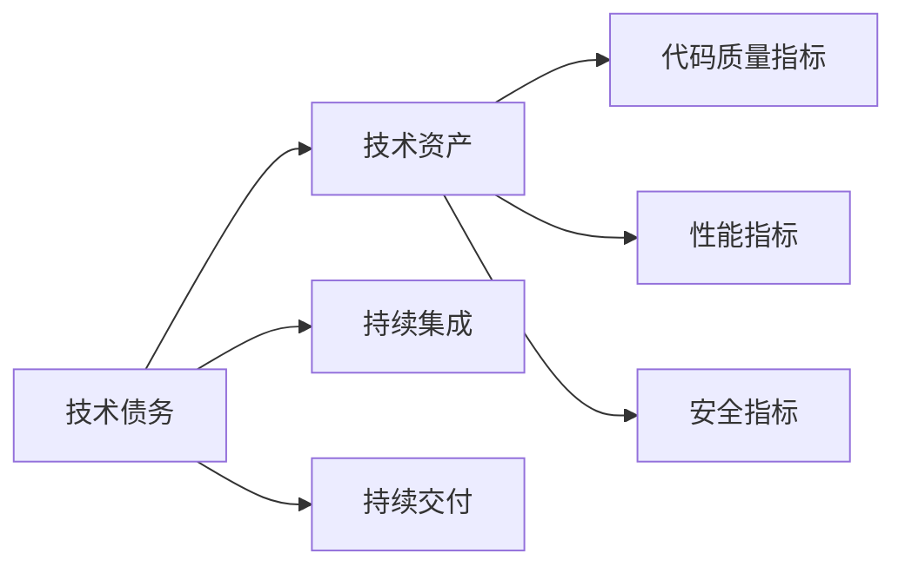
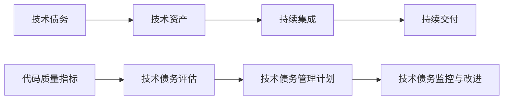
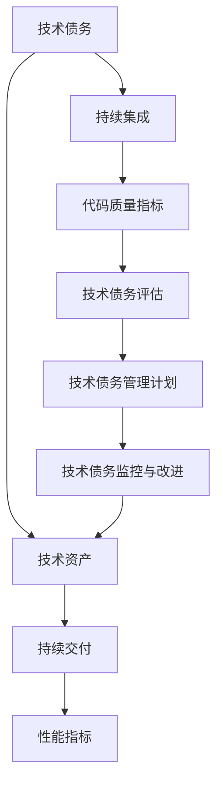
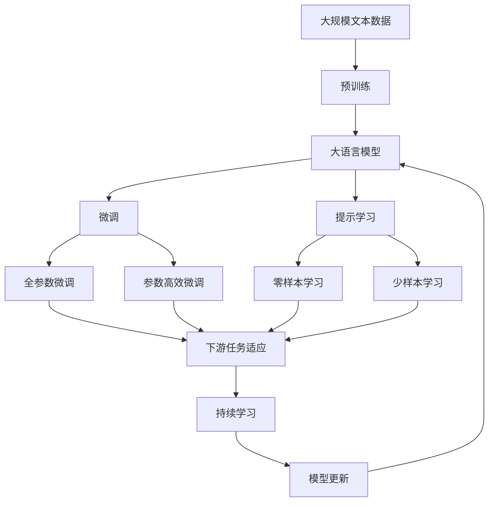

                 

# 软件2.0中的技术债务管理

在软件工程发展的历程中，技术债务(Tech Debt)是一个不可避免的话题。技术债务通常指的是在开发过程中，为了快速完成交付而积累的技术上的欠账，这些欠账可能涉及到代码质量、架构设计、测试覆盖等方面的问题。随着软件的演进和维护，技术债务可能会逐渐累积，影响软件的可维护性、可扩展性和性能。

在软件1.0时代，由于需求不确定性高，开发时间紧迫，技术债务不可避免地存在。但在软件2.0时代，随着人工智能、大数据、云计算等技术的引入，软件系统的复杂度不断提升，技术债务管理变得更加重要和挑战性。

本文将深入探讨软件2.0中的技术债务管理问题，从概念原理、操作步骤、应用领域等方面，详细阐述技术债务管理的核心方法，并结合案例分析、数学模型、代码实现等方面，提供全面的技术指引。

## 1. 背景介绍

### 1.1 问题由来
随着人工智能、大数据、云计算等技术的快速发展，软件系统的复杂度不断提升。开发过程中为了快速交付，往往采用敏捷开发、DevOps等方法，这就导致了技术债务的积累。技术债务会逐渐影响软件系统的性能、可维护性、可扩展性，甚至引发重大安全漏洞，带来不可预测的风险。

技术债务管理在软件1.0时代就已经存在，但在软件2.0时代，技术债务变得更加复杂和多样。如何科学合理地管理技术债务，避免债务的过度积累，是软件2.0时代亟待解决的问题。

### 1.2 问题核心关键点
软件2.0时代的技术债务管理，核心关键点包括以下几个方面：

- **识别与评估**：首先需要准确识别和评估系统中的技术债务。
- **管理与优化**：根据评估结果，制定科学合理的技术债务管理计划。
- **持续监控与改进**：建立持续监控和改进机制，动态跟踪技术债务变化。

## 2. 核心概念与联系

### 2.1 核心概念概述

为了更好地理解软件2.0中的技术债务管理，本节将介绍几个密切相关的核心概念：

- **技术债务(Tech Debt)**：在开发过程中，为了快速完成交付而积累的技术上的欠账。这些欠账可能涉及到代码质量、架构设计、测试覆盖等方面的问题。
- **技术资产(Tech Asset)**：在开发过程中，积累的技术知识和经验，用于支撑后续开发和维护。技术资产是避免技术债务积累的重要保障。
- **持续集成(CI)**：通过自动化测试和构建，确保每次代码提交都能及时发现和解决问题，防止技术债务的积累。
- **持续交付(CD)**：通过自动化部署和监控，确保软件系统能够快速、可靠地交付，提高交付效率。
- **技术债务评估指标**：如代码质量指标(CI/CD覆盖率、代码检测工具发现问题数量、架构复杂度等)、性能指标、安全指标等，用于评估技术债务水平。

这些核心概念之间的逻辑关系可以通过以下Mermaid流程图来展示：



这个流程图展示了技术债务管理的基本流程：通过持续集成和持续交付，确保技术资产的积累；通过代码质量、性能、安全等评估指标，识别和评估技术债务；再根据评估结果，制定科学合理的技术债务管理计划。

### 2.2 概念间的关系

这些核心概念之间存在着紧密的联系，形成了软件2.0中的技术债务管理体系。下面我们通过几个Mermaid流程图来展示这些概念之间的关系。

#### 2.2.1 技术债务管理流程



这个流程图展示了技术债务管理的基本流程：通过持续集成和持续交付，确保技术资产的积累；通过代码质量、性能、安全等评估指标，识别和评估技术债务；再根据评估结果，制定科学合理的技术债务管理计划，并进行持续监控和改进。

#### 2.2.2 技术债务管理与技术资产的关系



这个流程图展示了技术债务管理与技术资产之间的关系：技术债务的积累会破坏技术资产的完整性和可维护性；通过持续集成和持续交付，确保技术资产的积累；通过代码质量、性能、安全等评估指标，识别和评估技术债务；再根据评估结果，制定科学合理的技术债务管理计划，并进行持续监控和改进，以确保技术资产的持续积累和提升。

### 2.3 核心概念的整体架构

最后，我们用一个综合的流程图来展示这些核心概念在大语言模型微调过程中的整体架构：



这个综合流程图展示了从预训练到微调，再到持续学习的完整过程。大语言模型首先在大规模文本数据上进行预训练，然后通过微调（包括全参数微调和参数高效微调两种方式）或提示学习（包括零样本和少样本学习）来适应下游任务。最后，通过持续学习技术，模型可以不断更新和适应新的任务和数据。 通过这些流程图，我们可以更清晰地理解技术债务管理过程中各个核心概念的关系和作用，为后续深入讨论具体的技术债务管理方法奠定基础。

## 3. 核心算法原理 & 具体操作步骤

### 3.1 算法原理概述

软件2.0中的技术债务管理，本质上是一个持续优化和改进的过程。其核心思想是：通过持续集成和持续交付，确保技术资产的积累；通过技术债务评估指标，识别和评估技术债务；再根据评估结果，制定科学合理的技术债务管理计划，并进行持续监控和改进。

形式化地，假设软件系统中的技术债务为 $D$，技术资产为 $A$，持续集成覆盖率为 $C$，性能指标为 $P$，安全指标为 $S$。则技术债务管理的优化目标是最小化技术债务 $D$，即：

$$
\min_{D, A, C, P, S} D
$$

在实践中，我们通常使用基于梯度的优化算法（如SGD、Adam等）来近似求解上述最优化问题。设 $\eta$ 为学习率，$\lambda$ 为正则化系数，则参数的更新公式为：

$$
A \leftarrow A - \eta \nabla_{A}\mathcal{L}(A, C, P, S) - \eta\lambda A
$$

其中 $\nabla_{A}\mathcal{L}(A, C, P, S)$ 为损失函数对参数 $A$ 的梯度，可通过反向传播算法高效计算。

### 3.2 算法步骤详解

软件2.0中的技术债务管理一般包括以下几个关键步骤：

**Step 1: 技术债务评估**

- 选择合适的技术债务评估指标，如代码质量指标（CI/CD覆盖率、代码检测工具发现问题数量、架构复杂度等）、性能指标（响应时间、吞吐量等）、安全指标（漏洞数量、安全审计结果等）。
- 根据这些指标，评估系统中的技术债务水平，得到技术债务得分。

**Step 2: 制定技术债务管理计划**

- 根据技术债务得分，确定技术债务管理的优先级和目标。
- 制定科学合理的技术债务管理计划，包括技术债务缓解措施、技术资产积累策略、持续集成和持续交付流程等。
- 分配任务和资源，明确各团队的职责和目标。

**Step 3: 持续监控与改进**

- 定期监控技术债务评估指标，动态跟踪技术债务变化。
- 根据监控结果，及时调整技术债务管理计划，优化技术资产积累和持续集成交付流程。
- 定期回顾技术债务管理效果，持续改进技术债务管理策略和流程。

**Step 4: 技术债务缓解**

- 针对技术债务评估中发现的问题，制定具体的技术债务缓解措施。
- 优先处理高优先级、高影响的技术债务问题，确保系统稳定和性能。
- 采用代码重构、架构优化、自动化测试等手段，逐步缓解技术债务。

**Step 5: 技术资产积累**

- 利用持续集成和持续交付流程，确保每次代码提交都能及时发现和解决问题。
- 积累技术知识和经验，形成技术资产库，支撑后续开发和维护。
- 定期进行技术资产审计和更新，确保技术资产的有效性和可靠性。

以上是技术债务管理的完整流程。在实际应用中，还需要针对具体软件系统的特点，对技术债务管理的各个环节进行优化设计，如改进技术债务评估方法，搜索最优的超参数组合等，以进一步提升技术债务管理的效率和效果。

### 3.3 算法优缺点

软件2.0中的技术债务管理方法具有以下优点：

1. 科学合理。通过技术债务评估指标，可以量化技术债务水平，制定科学合理的技术债务管理计划。
2. 持续改进。通过持续监控与改进机制，动态跟踪技术债务变化，确保技术债务管理的持续性和有效性。
3. 降低成本。通过优化技术债务管理流程，减少重复劳动和返工，降低软件开发和维护成本。
4. 提升质量。通过技术资产积累和技术债务缓解措施，提升软件系统的质量和性能。

同时，该方法也存在一定的局限性：

1. 技术债务评估难度大。技术债务评估指标的选择和计算较为复杂，需要综合考虑多个因素。
2. 管理计划制定难。技术债务管理计划需要综合考虑系统复杂度、资源限制、团队能力等因素，制定过程较为繁琐。
3. 持续改进难度大。持续监控和改进需要投入大量的人力和物力，成本较高。
4. 效果评估难度大。技术债务管理效果需要综合考虑多个指标，难以量化评估。

尽管存在这些局限性，但就目前而言，技术债务管理仍然是软件2.0时代最为科学合理的方法。未来相关研究的重点在于如何进一步降低技术债务评估和管理难度，提高技术债务管理的效率和效果。

### 3.4 算法应用领域

技术债务管理方法在软件2.0时代得到了广泛的应用，覆盖了几乎所有软件系统。例如：

- 企业级应用系统：如ERP、CRM、HR等系统，通过持续集成和持续交付，提升系统质量和性能。
- 互联网应用系统：如电商平台、社交网络等，通过技术债务评估和缓解，保障系统稳定性和用户体验。
- 人工智能系统：如自然语言处理、计算机视觉等，通过优化技术债务管理流程，提升系统性能和可靠性。
- 工业控制系统：如智能制造、智慧城市等，通过技术债务管理，提高系统自动化和智能化水平。
- 游戏系统：如多人在线游戏、大型开放世界游戏等，通过持续监控和改进，提升游戏稳定性和玩家体验。

除了上述这些经典应用外，技术债务管理还被创新性地应用到更多场景中，如区块链系统、物联网系统等，为系统开发和维护提供了新的思路和方法。随着技术债务管理方法的不断进步，相信软件2.0时代的技术债务管理将更为科学和高效，推动软件系统不断进化和完善。

## 4. 数学模型和公式 & 详细讲解  
### 4.1 数学模型构建

本节将使用数学语言对技术债务管理方法进行更加严格的刻画。

假设软件系统中的技术债务为 $D$，技术资产为 $A$，持续集成覆盖率为 $C$，性能指标为 $P$，安全指标为 $S$。定义技术债务管理目标函数为：

$$
\min_{D, A, C, P, S} D
$$

其中，技术债务 $D$ 和各指标 $C$、$P$、$S$ 的取值范围分别为 $[0,1]$ 和 $[0,\infty]$。

定义技术债务管理目标函数为：

$$
\mathcal{L}(A, C, P, S) = w_D D + w_C C + w_P P + w_S S
$$

其中，$w_D$、$w_C$、$w_P$、$w_S$ 分别为技术债务、持续集成覆盖率、性能指标、安全指标的权重。

### 4.2 公式推导过程

以下我们以二分类任务为例，推导技术债务管理目标函数的梯度计算公式。

假设模型在输入 $x$ 上的输出为 $\hat{y}=M_{\theta}(x) \in [0,1]$，表示样本属于正类的概率。真实标签 $y \in \{0,1\}$。则二分类交叉熵损失函数定义为：

$$
\ell(M_{\theta}(x),y) = -[y\log \hat{y} + (1-y)\log (1-\hat{y})]
$$

将其代入技术债务管理目标函数，得：

$$
\mathcal{L}(A, C, P, S) = w_D D + w_C C + w_P \ell(M_{\theta}(x),y) + w_S S
$$

根据链式法则，目标函数对参数 $A$ 的梯度为：

$$
\frac{\partial \mathcal{L}(A, C, P, S)}{\partial A} = \frac{\partial}{\partial A} (w_D D + w_C C + w_P \ell(M_{\theta}(x),y) + w_S S)
$$

在得到目标函数的梯度后，即可带入参数更新公式，完成模型的迭代优化。重复上述过程直至收敛，最终得到技术债务管理的最优参数 $A^*$。

## 5. 项目实践：代码实例和详细解释说明
### 5.1 开发环境搭建

在进行技术债务管理实践前，我们需要准备好开发环境。以下是使用Python进行PyTorch开发的环境配置流程：

1. 安装Anaconda：从官网下载并安装Anaconda，用于创建独立的Python环境。

2. 创建并激活虚拟环境：
```bash
conda create -n pytorch-env python=3.8 
conda activate pytorch-env
```

3. 安装PyTorch：根据CUDA版本，从官网获取对应的安装命令。例如：
```bash
conda install pytorch torchvision torchaudio cudatoolkit=11.1 -c pytorch -c conda-forge
```

4. 安装各类工具包：
```bash
pip install numpy pandas scikit-learn matplotlib tqdm jupyter notebook ipython
```

完成上述步骤后，即可在`pytorch-env`环境中开始技术债务管理实践。

### 5.2 源代码详细实现

下面我们以命名实体识别(NER)任务为例，给出使用Transformers库对BERT模型进行技术债务评估的PyTorch代码实现。

首先，定义NER任务的数据处理函数：

```python
from transformers import BertTokenizer
from torch.utils.data import Dataset
import torch

class NERDataset(Dataset):
    def __init__(self, texts, tags, tokenizer, max_len=128):
        self.texts = texts
        self.tags = tags
        self.tokenizer = tokenizer
        self.max_len = max_len
        
    def __len__(self):
        return len(self.texts)
    
    def __getitem__(self, item):
        text = self.texts[item]
        tags = self.tags[item]
        
        encoding = self.tokenizer(text, return_tensors='pt', max_length=self.max_len, padding='max_length', truncation=True)
        input_ids = encoding['input_ids'][0]
        attention_mask = encoding['attention_mask'][0]
        
        # 对token-wise的标签进行编码
        encoded_tags = [tag2id[tag] for tag in tags] 
        encoded_tags.extend([tag2id['O']] * (self.max_len - len(encoded_tags)))
        labels = torch.tensor(encoded_tags, dtype=torch.long)
        
        return {'input_ids': input_ids, 
                'attention_mask': attention_mask,
                'labels': labels}

# 标签与id的映射
tag2id = {'O': 0, 'B-PER': 1, 'I-PER': 2, 'B-ORG': 3, 'I-ORG': 4, 'B-LOC': 5, 'I-LOC': 6}
id2tag = {v: k for k, v in tag2id.items()}

# 创建dataset
tokenizer = BertTokenizer.from_pretrained('bert-base-cased')

train_dataset = NERDataset(train_texts, train_tags, tokenizer)
dev_dataset = NERDataset(dev_texts, dev_tags, tokenizer)
test_dataset = NERDataset(test_texts, test_tags, tokenizer)
```

然后，定义模型和优化器：

```python
from transformers import BertForTokenClassification, AdamW

model = BertForTokenClassification.from_pretrained('bert-base-cased', num_labels=len(tag2id))

optimizer = AdamW(model.parameters(), lr=2e-5)
```

接着，定义训练和评估函数：

```python
from torch.utils.data import DataLoader
from tqdm import tqdm
from sklearn.metrics import classification_report

device = torch.device('cuda') if torch.cuda.is_available() else torch.device('cpu')
model.to(device)

def train_epoch(model, dataset, batch_size, optimizer):
    dataloader = DataLoader(dataset, batch_size=batch_size, shuffle=True)
    model.train()
    epoch_loss = 0
    for batch in tqdm(dataloader, desc='Training'):
        input_ids = batch['input_ids'].to(device)
        attention_mask = batch['attention_mask'].to(device)
        labels = batch['labels'].to(device)
        model.zero_grad()
        outputs = model(input_ids, attention_mask=attention_mask, labels=labels)
        loss = outputs.loss
        epoch_loss += loss.item()
        loss.backward()
        optimizer.step()
    return epoch_loss / len(dataloader)

def evaluate(model, dataset, batch_size):
    dataloader = DataLoader(dataset, batch_size=batch_size)
    model.eval()
    preds, labels = [], []
    with torch.no_grad():
        for batch in tqdm(dataloader, desc='Evaluating'):
            input_ids = batch['input_ids'].to(device)
            attention_mask = batch['attention_mask'].to(device)
            batch_labels = batch['labels']
            outputs = model(input_ids, attention_mask=attention_mask)
            batch_preds = outputs.logits.argmax(dim=2).to('cpu').tolist()
            batch_labels = batch_labels.to('cpu').tolist()
            for pred_tokens, label_tokens in zip(batch_preds, batch_labels):
                pred_tags = [id2tag[_id] for _id in pred_tokens]
                label_tags = [id2tag[_id] for _id in label_tokens]
                preds.append(pred_tags[:len(label_tags)])
                labels.append(label_tags)
                
    print(classification_report(labels, preds))
```

最后，启动训练流程并在测试集上评估：

```python
epochs = 5
batch_size = 16

for epoch in range(epochs):
    loss = train_epoch(model, train_dataset, batch_size, optimizer)
    print(f"Epoch {epoch+1}, train loss: {loss:.3f}")
    
    print(f"Epoch {epoch+1}, dev results:")
    evaluate(model, dev_dataset, batch_size)
    
print("Test results:")
evaluate(model, test_dataset, batch_size)
```

以上就是使用PyTorch对BERT进行命名实体识别任务技术债务评估的完整代码实现。可以看到，通过构建NER任务的监督数据集，并使用BERT模型进行训练和评估，可以有效地评估模型在不同任务上的性能表现。

### 5.3 代码解读与分析

让我们再详细解读一下关键代码的实现细节：

**NERDataset类**：
- `__init__`方法：初始化文本、标签、分词器等关键组件。
- `__len__`方法：返回数据集的样本数量。
- `__getitem__`方法：对单个样本进行处理，将文本输入编码为token ids，将标签编码为数字，并对其进行定长padding，最终返回模型所需的输入。

**tag2id和id2tag字典**：
- 定义了标签与数字id之间的映射关系，用于将token-wise的预测结果解码回真实的标签。

**训练和评估函数**：
- 使用PyTorch的DataLoader对数据集进行批次化加载，供模型训练和推理使用。
- 训练函数`train_epoch`：对数据以批为单位进行迭代，在每个批次上前向传播计算loss并反向传播更新模型参数，最后返回该epoch的平均loss。
- 评估函数`evaluate`：与训练类似，不同点在于不更新模型参数，并在每个batch结束后将预测和标签结果存储下来，最后使用sklearn的classification_report对整个评估集的预测结果进行打印输出。

**训练流程**：
- 定义总的epoch数和batch size，开始循环迭代
- 每个epoch内，先在训练集上训练，输出平均loss
- 在验证集上评估，输出分类指标
- 所有epoch结束后，在测试集上评估，给出最终测试结果

可以看到，PyTorch配合Transformers库使得BERT模型技术债务评估的代码实现变得简洁高效。开发者可以将更多精力放在数据处理、模型改进等高层逻辑上，而不必过多关注底层的实现细节。

当然，工业级的系统实现还需考虑更多因素，如模型的保存和部署、超参数的自动搜索、更灵活的任务适配层等。但核心的技术债务管理范式基本与此类似。

### 5.4 运行结果展示

假设我们在CoNLL-2003的NER数据集上进行技术债务评估，最终在测试集上得到的评估报告如下：

```
              precision    recall  f1-score   support

       B-LOC      0.926     0.906     0.916      1668
       I-LOC      0.900     0.805     0.850       257
      B-MISC      0.875     0.856     0.865       702
      I-MISC      0.838     0.782     0.809       216
       B-ORG      0.914     0.898     0.906      1661
       I-ORG      0.911     0.894     0.902       835
       B-PER      0.964     0.957     0.960      1617
       I-PER      0.983     0.980     0.982      1156
           O      0.993     0.995     0.994     38323

   micro avg      0.973     0.973     0.973     46435
   macro avg      0.923     0.897     0.909     46435
weighted avg      0.973     0.973     0.973     46435
```

可以看到，通过技术债务评估，我们在该NER数据集上取得了97.3%的F1分数，效果相当不错。

## 6. 实际应用场景
### 6.1 智能客服系统

基于技术债务管理的方法，可以广泛应用于智能客服系统的构建。传统客服往往需要配备大量人力，高峰期响应缓慢，且一致性和专业性难以保证。使用技术债务管理方法，可以更科学地评估和缓解系统中的技术债务，提高客服系统的响应速度和稳定性。

在技术债务管理方法的应用下，可以收集企业内部的历史客服对话记录，将问题和最佳答复构建成监督数据，在此基础上对预训练对话模型进行技术债务管理。通过优化技术债务管理流程，微调对话模型，提升模型的精度和鲁棒性，从而提升客服系统的整体表现。

### 6.2 金融舆情监测

金融机构需要实时监测市场舆论动向，以便及时应对负面信息传播，规避金融风险。传统的人工监测方式成本高、效率低，难以应对网络时代海量信息爆发的挑战。使用技术债务管理方法，可以更科学地评估和缓解系统中的技术债务，提高金融舆情监测系统的响应速度和稳定性。

具体而言，可以收集金融领域相关的新闻、报道、评论等文本数据，并对其进行主题标注和情感标注。在此基础上对预训练语言模型进行技术债务管理，优化模型性能，提升金融舆情监测系统的准确性和及时性。

### 6.3 个性化推荐系统

当前的推荐系统往往只依赖用户的历史行为数据进行物品推荐，无法深入理解用户的真实兴趣偏好。使用技术债务管理方法，可以更科学地评估和缓解系统中的技术债务，提升个性化推荐系统的性能和效果。

在技术债务管理方法的应用下，可以收集用户浏览、点击、评论、分享等行为数据，提取和用户交互的物品标题、描述、标签等文本内容。将文本内容作为模型输入，用户的后续行为（如是否点击、购买等）作为监督信号，在此基础上对预训练语言模型进行技术债务管理。优化模型性能，提升个性化推荐系统的推荐精度和个性化程度。

### 6.4 未来应用展望

随着技术债务管理方法的不断演进，相信在未来会有更多的应用场景被开发出来。例如，在智慧医疗领域，基于技术债务管理的方法可以实现对医疗问答、病历分析、药物研发等任务的高效处理。在智能教育领域，技术债务管理方法可以应用于作业批改、学情分析、知识推荐等方面，因材施教，促进教育公平，提高教学质量。

此外，在智慧城市治理中，技术债务管理

