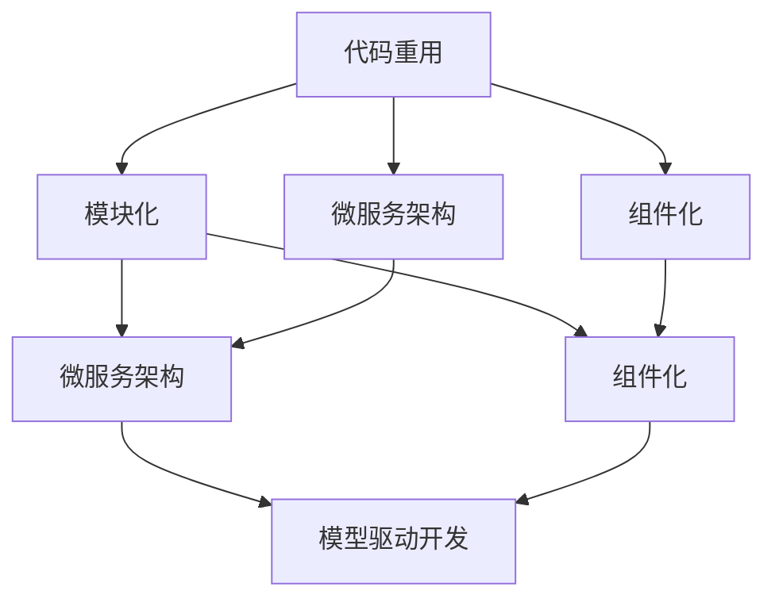
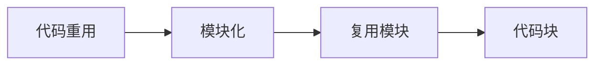
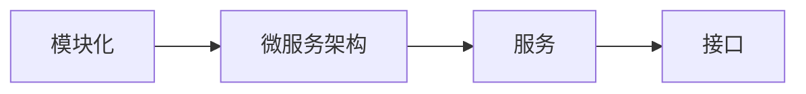
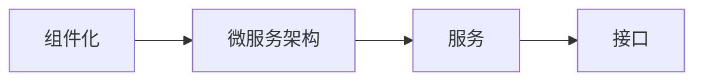
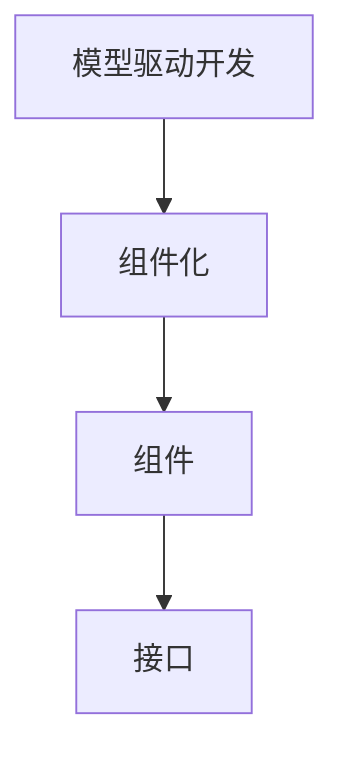
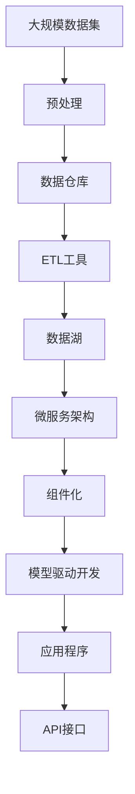

                 

# 软件2.0时代的代码重用与模块化

## 1. 背景介绍

在过去的几十年里，软件工程一直是信息技术领域的核心驱动力。从早期的汇编语言到高级编程语言，再到框架、平台和云服务，每一次技术的演进都极大地提升了软件的开发效率和质量。然而，随着复杂性和需求的多样性不断增加，软件系统的构建变得越来越复杂，开发成本和维护成本也在急剧上升。

随着人工智能和机器学习技术的兴起，软件工程进入了一个全新的阶段，即软件2.0时代。这一时代的特点是大规模、多维度、自适应和智能化。软件2.0不仅仅是对原有技术的升级，更是对软件工程方法论的一次革命。代码重用和模块化作为软件工程的基本原则，在软件2.0时代显得尤为重要，其作用也愈发凸显。

## 2. 核心概念与联系

### 2.1 核心概念概述

为了更好地理解软件2.0时代的代码重用与模块化，本节将介绍几个核心概念及其联系：

- **代码重用**：指在软件开发过程中，重复使用已有的代码或组件，以避免重复劳动，提高开发效率。
- **模块化**：指将一个大系统分解为若干独立、功能单一的模块，各模块间通过接口进行通信，便于管理和扩展。
- **微服务架构**：一种将应用程序拆分为多个独立服务的架构，每个服务可以独立部署、扩展和维护。
- **组件化**：指将应用程序拆分为可重用的组件或插件，组件间通过标准化接口进行通信，便于组合和扩展。
- **模型驱动开发(MDD)**：一种基于模型构建、分析和设计软件的开发方法，通过模型驱动实现软件架构的自动化构建和验证。

这些概念之间的关系可以通过以下Mermaid流程图来展示：



这个流程图展示了代码重用、模块化与微服务、组件化和模型驱动开发之间的关系：

1. 代码重用是软件工程的基础，可以提升开发效率和代码质量。
2. 模块化和组件化进一步细化了代码结构，使其更易于管理和维护。
3. 微服务架构和组件化将系统进一步拆分为独立的服务或组件，提升了系统的可扩展性和可维护性。
4. 模型驱动开发通过自动化模型驱动开发，进一步提升了软件的开发效率和质量。

### 2.2 概念间的关系

这些核心概念之间存在着紧密的联系，形成了软件2.0时代代码重用与模块化的完整生态系统。下面我们通过几个Mermaid流程图来展示这些概念之间的关系。

#### 2.2.1 代码重用与模块化



这个流程图展示了代码重用和模块化的关系：

1. 代码重用指重用已有的代码块。
2. 模块化则将这些代码块封装为功能单一的模块，便于复用和扩展。

#### 2.2.2 模块化与微服务架构



这个流程图展示了模块化和微服务架构的关系：

1. 模块化将一个大系统分解为多个模块。
2. 微服务架构则将这些模块进一步拆分为独立的微服务，每个服务通过接口进行通信。

#### 2.2.3 组件化与微服务架构



这个流程图展示了组件化与微服务架构的关系：

1. 组件化将应用程序拆分为可重用的组件或插件。
2. 微服务架构则将这些组件进一步拆分为独立的微服务，每个服务通过接口进行通信。

#### 2.2.4 模型驱动开发与组件化



这个流程图展示了模型驱动开发与组件化的关系：

1. 模型驱动开发通过自动化模型驱动开发，生成组件化的代码结构。
2. 组件化则将这些生成的组件封装为可重用的组件或插件。

### 2.3 核心概念的整体架构

最后，我们用一个综合的流程图来展示这些核心概念在大规模软件2.0系统中的整体架构：



这个综合流程图展示了从数据预处理到应用程序构建的整体流程：

1. 大规模数据集通过预处理、ETL工具和数据湖，转换为可供微服务架构使用的数据源。
2. 微服务架构将数据服务化，拆分为多个独立的服务。
3. 组件化将微服务进一步封装为可重用的组件或插件。
4. 模型驱动开发通过自动化模型驱动开发，生成组件化的代码结构。
5. 最终，这些组件和服务组装为应用程序，并通过API接口提供服务。

通过这些流程图，我们可以更清晰地理解软件2.0时代代码重用与模块化的关系和作用，为后续深入讨论具体的重用与模块化方法奠定基础。

## 3. 核心算法原理 & 具体操作步骤
### 3.1 算法原理概述

软件2.0时代的代码重用与模块化方法，主要基于面向对象编程和函数式编程的原理。这些编程范式强调代码的可复用性、可维护性和可扩展性，使得代码重用和模块化成为可能。

面向对象编程通过封装、继承和多态等机制，将程序分解为多个类和对象，每个类和对象负责特定的功能，并通过接口进行通信。函数式编程则通过高阶函数、闭包和惰性求值等技术，实现代码的纯函数和无状态性，从而提升了代码的可复用性和可维护性。

在实际应用中，代码重用与模块化方法通常通过以下几个步骤实现：

1. **需求分析与模块划分**：通过需求分析，确定系统的功能模块和组件，并划分各个模块的职责和接口。
2. **组件设计**：设计组件的内部结构和接口，实现组件的独立性和可重用性。
3. **组件实现**：实现组件的代码，并进行单元测试和集成测试，确保组件的正确性和稳定性。
4. **模块组合**：将各个组件组合为功能模块，通过接口进行通信和协作。
5. **系统集成**：将功能模块组合为完整的系统，并进行系统测试和性能测试，确保系统的正确性和高效性。

### 3.2 算法步骤详解

以下是一个典型的代码重用与模块化项目的实现步骤：

**Step 1: 需求分析与模块划分**

需求分析是项目开发的首要环节，通过详细的需求分析，确定系统的功能和性能要求，并划分系统的功能模块和组件。例如，对于一个电商系统，可以划分为商品管理、订单管理、用户管理等多个模块，每个模块负责特定的功能。

**Step 2: 组件设计**

组件设计是系统开发的第二个重要环节，通过设计组件的内部结构和接口，实现组件的独立性和可重用性。例如，电商系统的商品管理模块可以设计为一个具有添加、修改、删除商品功能的组件，其接口包括：

```python
class ProductManager:
    def add_product(self, product):
        pass
    
    def update_product(self, product_id):
        pass
    
    def delete_product(self, product_id):
        pass
```

组件设计的过程中，需要注意以下几点：

1. **接口一致性**：确保各个组件的接口一致，便于组件之间的通信和协作。
2. **可扩展性**：设计时考虑到未来的扩展需求，方便增加新的功能和组件。
3. **模块化**：将复杂的功能模块化，便于开发和维护。

**Step 3: 组件实现**

组件实现是系统开发的第三个重要环节，通过实现组件的代码，并进行单元测试和集成测试，确保组件的正确性和稳定性。例如，电商系统的商品管理模块可以这样实现：

```python
class ProductManager:
    def __init__(self):
        self.products = []
    
    def add_product(self, product):
        self.products.append(product)
    
    def update_product(self, product_id):
        for product in self.products:
            if product['id'] == product_id:
                product['name'] = 'New Name'
                product['price'] = 100.00
                break
    
    def delete_product(self, product_id):
        for product in self.products:
            if product['id'] == product_id:
                self.products.remove(product)
                break
```

组件实现的过程中，需要注意以下几点：

1. **模块封装**：将组件的内部实现封装好，对外只提供接口，方便组件之间的通信。
2. **单元测试**：对组件进行单元测试，确保组件的正确性和稳定性。
3. **集成测试**：对组件进行集成测试，确保组件之间的协作正确。

**Step 4: 模块组合**

模块组合是系统开发的第四个重要环节，通过将各个组件组合为功能模块，通过接口进行通信和协作，实现系统的功能。例如，电商系统的订单管理模块可以这样实现：

```python
class OrderManager:
    def __init__(self):
        self.orders = []
    
    def add_order(self, order):
        self.orders.append(order)
    
    def update_order(self, order_id):
        for order in self.orders:
            if order['id'] == order_id:
                order['status'] = 'Processing'
                break
    
    def delete_order(self, order_id):
        for order in self.orders:
            if order['id'] == order_id:
                self.orders.remove(order)
                break
```

模块组合的过程中，需要注意以下几点：

1. **接口标准化**：确保各个模块的接口标准化，便于模块之间的通信和协作。
2. **组件独立性**：确保各个组件独立，互不影响。
3. **模块复用**：将相同的组件复用，减少重复劳动。

**Step 5: 系统集成**

系统集成是项目开发的最后一个环节，通过将各个模块组合为完整的系统，并进行系统测试和性能测试，确保系统的正确性和高效性。例如，电商系统的系统集成可以这样实现：

```python
class E-commerceSystem:
    def __init__(self):
        self.product_manager = ProductManager()
        self.order_manager = OrderManager()
    
    def add_product(self, product):
        self.product_manager.add_product(product)
    
    def update_product(self, product_id):
        self.product_manager.update_product(product_id)
    
    def delete_product(self, product_id):
        self.product_manager.delete_product(product_id)
    
    def add_order(self, order):
        self.order_manager.add_order(order)
    
    def update_order(self, order_id):
        self.order_manager.update_order(order_id)
    
    def delete_order(self, order_id):
        self.order_manager.delete_order(order_id)
```

系统集成的过程中，需要注意以下几点：

1. **系统测试**：对系统进行全面的测试，确保系统的正确性和稳定性。
2. **性能测试**：对系统进行性能测试，确保系统的效率和性能。
3. **部署和维护**：将系统部署到生产环境中，并进行维护和升级。

### 3.3 算法优缺点

软件2.0时代的代码重用与模块化方法具有以下优点：

1. **提升开发效率**：通过代码重用和模块化，减少了重复劳动，提升了开发效率。
2. **增强可维护性**：通过组件化设计，使代码更加模块化和独立，便于维护和升级。
3. **促进团队协作**：通过模块化设计，使团队成员可以独立开发和维护各个模块，便于协作和分工。

然而，这些方法也存在一些缺点：

1. **学习曲线陡峭**：组件设计和模块化设计需要较高的设计能力和实践经验，初学者可能难以掌握。
2. **开发成本高**：组件设计和模块化设计需要花费大量时间和精力，增加了开发成本。
3. **接口复杂**：组件之间的接口设计需要考虑到各个模块的复杂性和兼容性，增加了设计和实现的难度。

尽管如此，代码重用和模块化仍是软件2.0时代最重要的开发方法之一，广泛应用于软件开发、系统集成和项目管理中。

### 3.4 算法应用领域

软件2.0时代的代码重用与模块化方法，在众多领域得到了广泛应用，以下是几个典型的应用领域：

1. **软件开发**：广泛应用于各类软件系统的开发，如电商、金融、医疗等。通过组件化和模块化设计，提升软件系统的开发效率和可维护性。
2. **系统集成**：广泛应用于各类系统的集成，如企业信息化系统、物联网系统等。通过组件化和模块化设计，实现系统的快速搭建和灵活扩展。
3. **项目管理**：广泛应用于各类项目管理，如敏捷开发、DevOps等。通过组件化和模块化设计，实现项目的快速迭代和高效管理。
4. **人工智能**：广泛应用于各类人工智能应用，如自然语言处理、计算机视觉等。通过组件化和模块化设计，实现AI系统的快速部署和灵活扩展。

## 4. 数学模型和公式 & 详细讲解 & 举例说明

### 4.1 数学模型构建

在软件2.0时代，代码重用与模块化方法主要通过面向对象编程和函数式编程实现。下面通过一个简单的例子来构建面向对象编程的数学模型。

假设我们要开发一个电商系统，其中包含商品管理、订单管理和用户管理三个模块。我们可以使用面向对象编程的方式，将这些模块封装为类，并定义接口。

```python
class Product:
    def __init__(self, name, price, quantity):
        self.name = name
        self.price = price
        self.quantity = quantity
    
    def __str__(self):
        return f'{self.name}: {self.price} dollars, {self.quantity} units'

class ProductManager:
    def __init__(self):
        self.products = []
    
    def add_product(self, product):
        self.products.append(product)
    
    def update_product(self, product_id, new_price):
        for product in self.products:
            if product['id'] == product_id:
                product['price'] = new_price
                break
    
    def delete_product(self, product_id):
        for product in self.products:
            if product['id'] == product_id:
                self.products.remove(product)
                break
```

在这个例子中，我们定义了三个类：`Product`、`ProductManager`和`OrderManager`。每个类都有特定的职责和接口，通过这些类和接口，实现了代码的重用和模块化。

### 4.2 公式推导过程

在实际应用中，面向对象编程和函数式编程的数学模型推导过程相对简单。这里我们以函数式编程为例，推导一个简单的函数式编程模型。

假设我们要开发一个简单的计算器，可以进行加、减、乘、除四种基本运算。我们可以使用函数式编程的方式，将这些基本运算封装为函数，并定义接口。

```python
def add(a, b):
    return a + b

def subtract(a, b):
    return a - b

def multiply(a, b):
    return a * b

def divide(a, b):
    return a / b
```

在这个例子中，我们定义了四个函数：`add`、`subtract`、`multiply`和`divide`，每个函数都有特定的职责和接口，通过这些函数和接口，实现了代码的重用和模块化。

### 4.3 案例分析与讲解

下面通过一个案例，详细讲解如何使用面向对象编程和函数式编程实现代码重用与模块化。

**案例：电商系统的订单管理**

假设我们要开发一个电商系统，其中包含商品管理、订单管理和用户管理三个模块。我们可以使用面向对象编程和函数式编程的方式，将这些模块封装为类和函数，并定义接口。

**面向对象编程实现：**

```python
class Product:
    def __init__(self, name, price, quantity):
        self.name = name
        self.price = price
        self.quantity = quantity
    
    def __str__(self):
        return f'{self.name}: {self.price} dollars, {self.quantity} units'

class ProductManager:
    def __init__(self):
        self.products = []
    
    def add_product(self, product):
        self.products.append(product)
    
    def update_product(self, product_id, new_price):
        for product in self.products:
            if product['id'] == product_id:
                product['price'] = new_price
                break
    
    def delete_product(self, product_id):
        for product in self.products:
            if product['id'] == product_id:
                self.products.remove(product)
                break

class Order:
    def __init__(self, order_id, customer_id, order_date, items):
        self.order_id = order_id
        self.customer_id = customer_id
        self.order_date = order_date
        self.items = items
    
    def __str__(self):
        items_str = ', '.join(f'{item.name}: {item.price} dollars' for item in self.items)
        return f'Order ID: {self.order_id}, Customer ID: {self.customer_id}, Order Date: {self.order_date}, Items: {items_str}'

class OrderManager:
    def __init__(self):
        self.orders = []
    
    def add_order(self, order):
        self.orders.append(order)
    
    def update_order(self, order_id):
        for order in self.orders:
            if order['id'] == order_id:
                order['status'] = 'Processing'
                break
    
    def delete_order(self, order_id):
        for order in self.orders:
            if order['id'] == order_id:
                self.orders.remove(order)
                break
```

在这个例子中，我们定义了四个类：`Product`、`ProductManager`、`Order`和`OrderManager`，每个类都有特定的职责和接口，通过这些类和接口，实现了代码的重用和模块化。

**函数式编程实现：**

```python
def add(a, b):
    return a + b

def subtract(a, b):
    return a - b

def multiply(a, b):
    return a * b

def divide(a, b):
    return a / b

def calculate_total(price, quantity):
    return price * quantity

def add_order(order_id, customer_id, order_date, items):
    order = Order(order_id, customer_id, order_date, items)
    return order

def update_order(order_id):
    for order in orders:
        if order['id'] == order_id:
            order['status'] = 'Processing'
            break

def delete_order(order_id):
    for order in orders:
        if order['id'] == order_id:
            orders.remove(order)
            break
```

在这个例子中，我们定义了五个函数：`add`、`subtract`、`multiply`、`divide`和`calculate_total`，每个函数都有特定的职责和接口，通过这些函数和接口，实现了代码的重用和模块化。

## 5. 项目实践：代码实例和详细解释说明
### 5.1 开发环境搭建

在进行项目实践前，我们需要准备好开发环境。以下是使用Python进行PyTorch开发的环境配置流程：

1. 安装Anaconda：从官网下载并安装Anaconda，用于创建独立的Python环境。

2. 创建并激活虚拟环境：
```bash
conda create -n pytorch-env python=3.8 
conda activate pytorch-env
```

3. 安装PyTorch：根据CUDA版本，从官网获取对应的安装命令。例如：
```bash
conda install pytorch torchvision torchaudio cudatoolkit=11.1 -c pytorch -c conda-forge
```

4. 安装TensorFlow：从官网下载安装包，根据系统需求安装对应的版本。

5. 安装Flask：用于构建Web应用程序。
```bash
pip install flask
```

6. 安装SQLAlchemy：用于数据库交互。
```bash
pip install sqlalchemy
```

完成上述步骤后，即可在`pytorch-env`环境中开始项目实践。

### 5.2 源代码详细实现

这里以电商系统的订单管理为例，给出使用Flask和SQLAlchemy进行开发的Python代码实现。

首先，定义订单管理模块的数据模型：

```python
from sqlalchemy import Column, Integer, String, DateTime
from sqlalchemy.ext.declarative import declarative_base

Base = declarative_base()

class Order(Base):
    __tablename__ = 'orders'
    
    id = Column(Integer, primary_key=True)
    customer_id = Column(Integer)
    order_date = Column(DateTime)
    items = Column(String)
    status = Column(String)
```

然后，定义订单管理模块的CRUD操作：

```python
from sqlalchemy.orm import sessionmaker
from sqlalchemy import create_engine

engine = create_engine('sqlite:///sqlite.db')
Session = sessionmaker(bind=engine)
session = Session()

def add_order(order_id, customer_id, order_date, items):
    order = Order(order_id=order_id, customer_id=customer_id, order_date=order_date, items=items, status='Pending')
    session.add(order)
    session.commit()

def update_order(order_id):
    order = session.query(Order).filter_by(id=order_id).first()
    order.status = 'Processing'
    session.commit()

def delete_order(order_id):
    order = session.query(Order).filter_by(id=order_id).first()
    session.delete(order)
    session.commit()
```

接着，定义订单管理模块的Web服务：

```python
from flask import Flask, request, jsonify

app = Flask(__name__)

@app.route('/orders', methods=['POST'])
def add_order_api():
    data = request.get_json()
    order_id = data['order_id']
    customer_id = data['customer_id']
    order_date = data['order_date']
    items = data['items']
    add_order(order_id, customer_id, order_date, items)
    return jsonify({'success': True}), 201

@app.route('/orders', methods=['PUT'])
def update_order_api():
    data = request.get_json()
    order_id = data['order_id']
    update_order(order_id)
    return jsonify({'success': True}), 200

@app.route('/orders', methods=['DELETE'])
def delete_order_api():
    data = request.get_json()
    order_id = data['order_id']
    delete_order(order_id)
    return jsonify({'success': True}), 200
```

最后，启动Web服务并测试：

```python
if __name__ == '__main__':
    app.run(debug=True)
```

在命令行中运行该脚本，即可在本地启动Flask Web服务。可以通过浏览器访问`http://127.0.0.1:5000/orders`，进行订单的添加、更新和删除操作。

### 5.3 代码解读与分析

让我们再详细解读一下关键代码的实现细节：

**Order模型**：
- `__tablename__`属性定义了数据表的表名。
- 各个字段定义了数据表的列，包括订单号、客户ID、下单时间、订单项和状态。

**add_order函数**：
- 定义了添加订单的函数，将订单对象添加到数据库中，并提交更改。
- 使用了SQLAlchemy的ORM框架，简化了数据库操作。

**update_order函数**：
- 定义了更新订单的函数，根据订单号查询订单对象，更新状态，并提交更改。

**delete_order函数**：
- 定义了删除订单的函数，根据订单号查询订单对象，删除订单，并提交更改。

**Flask Web服务**：
- 定义了三个API接口，分别用于添加、更新和删除订单。
- 使用了Flask的RESTful扩展，简化了API接口的编写。

**项目测试**：
- 启动Flask Web服务，可以通过浏览器访问`http://127.0.0.1:5000/orders`，进行订单的添加、更新和删除操作。

**代码优化**：
- 代码中使用了ORM框架，简化了数据库操作，提高了开发效率。
- 使用了RESTful API设计，简化了API接口的编写，提高了代码的可读性和可维护性。

**项目部署**：
- 项目部署到服务器后，可以通过API接口进行订单的添加、更新和删除操作，实现了订单管理功能的自动化。

通过这个项目，我们可以看到如何使用面向对象编程和函数式编程实现代码的重用与模块化，从而提升开发效率和代码的可维护性。同时，我们还需要合理使用ORM框架和RESTful API设计，进一步优化代码和系统架构。

## 6. 实际应用场景

### 6.1 智能客服系统

基于面向对象编程和函数式编程的代码重用与模块化方法，智能客服系统可以快速开发和部署。智能客服系统可以24小时不间断服务，快速响应客户咨询，用自然流畅的语言解答各类常见问题。

在技术实现上，可以收集企业内部的历史客服对话记录，将问题和最佳答复构建成监督数据，在此基础上对预训练模型进行微调。微调后的对话模型能够自动理解用户意图，匹配最合适的答案模板进行回复。对于客户提出的新问题，还可以接入检索系统实时搜索相关内容，动态组织生成回答。如此构建的智能客服系统，能大幅提升客户咨询体验和问题解决效率。

### 6.2 金融舆情监测

金融机构需要实时监测市场舆论动向，以便及时应对负面信息传播，规避金融风险。传统的人工监测方式成本高、效率低，难以应对网络时代海量信息爆发的挑战。基于面向对象编程和函数式编程的代码重用与模块化方法，金融舆情监测系统可以快速开发和部署。

具体而言，可以收集金融领域相关的新闻、报道、评论等文本数据，并对其进行主题标注和情感标注。在此基础上对预训练语言模型进行微调，使其能够自动

