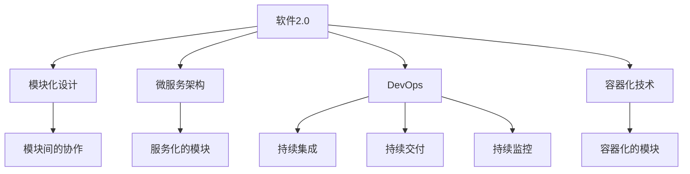
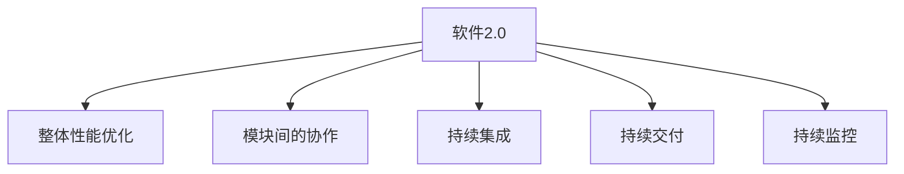
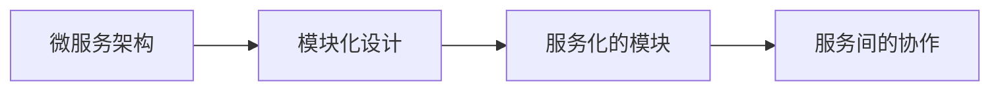
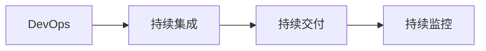
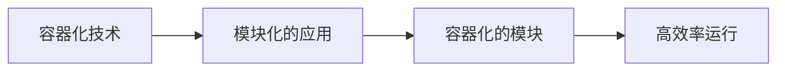

                 

# 软件2.0模块如何融合成整体最优解

> 关键词：软件2.0,模块化设计,整体最优解,系统架构,技术栈

## 1. 背景介绍

### 1.1 问题由来

随着软件行业的不断进步和互联网的迅猛发展，企业对软件的质量和性能提出了更高的要求。然而，传统软件开发的成本高、周期长、迭代慢等问题依然困扰着许多企业。为了解决这些问题，软件开发技术和模式经历了多次迭代和改进。

现代软件开发中，一个关键的技术是模块化设计。模块化设计将软件系统拆分为多个独立的模块，每个模块负责特定的功能，能够提高软件的复用性、可维护性和可扩展性。然而，模块之间的耦合和协调问题也随之而来，如何合理地将各个模块融合成一个整体，实现最优的性能和用户体验，是模块化设计中的一个核心挑战。

### 1.2 问题核心关键点

模块化设计虽然提高了软件开发的效率和灵活性，但在实践中仍面临一些关键问题：

1. **模块间的耦合**：不同模块之间如何协同工作，避免相互影响和冲突。
2. **数据的一致性**：不同模块之间的数据传递和共享，如何保证数据的一致性和正确性。
3. **性能的优化**：如何设计模块化的架构，以实现最优的性能。
4. **维护的难度**：如何维护一个由多个模块组成的复杂系统，避免模块间的依赖和耦合问题。

这些问题需要通过软件2.0技术来解决，从而实现模块化的最优解。软件2.0技术强调从整体的角度出发，优化模块之间的交互和协作，实现整体最优的性能和用户体验。

## 2. 核心概念与联系

### 2.1 核心概念概述

为更好地理解软件2.0模块融合成整体最优解的过程，本节将介绍几个密切相关的核心概念：

- **软件2.0**：一种以整体性能和用户体验为核心的软件开发技术。软件2.0强调从整体的角度出发，优化模块之间的交互和协作，实现整体最优的性能。
- **模块化设计**：将软件系统拆分为多个独立的模块，每个模块负责特定的功能，提高软件的复用性、可维护性和可扩展性。
- **微服务架构**：一种服务化架构风格，通过将大系统拆分为多个独立的服务，提高系统的灵活性和可扩展性。
- **DevOps**：一种文化和实践，旨在缩短软件开发生命周期，提高软件的质量和可靠性，通过持续集成、持续交付和持续监控来实现。
- **容器化技术**：如Docker、Kubernetes等，通过将应用打包在容器中，提高应用的运行效率和可移植性。

这些核心概念之间的逻辑关系可以通过以下Mermaid流程图来展示：



这个流程图展示了几大核心概念之间的联系：

1. 软件2.0强调从整体的角度出发，优化模块之间的交互和协作。
2. 模块化设计将系统拆分为独立的模块，每个模块负责特定的功能。
3. 微服务架构进一步将模块化的服务化，提高系统的灵活性和可扩展性。
4. DevOps通过持续集成、持续交付和持续监控，提高软件质量和可靠性。
5. 容器化技术通过将应用打包在容器中，提高应用的运行效率和可移植性。

这些核心概念共同构成了软件2.0模块融合成整体最优解的完整生态系统。通过理解这些核心概念，我们可以更好地把握软件2.0模块化设计的精髓，为后续深入讨论具体的技术和方法奠定基础。

### 2.2 概念间的关系

这些核心概念之间存在着紧密的联系，形成了软件2.0模块化设计的完整生态系统。下面我通过几个Mermaid流程图来展示这些概念之间的关系。

#### 2.2.1 软件2.0的学习范式



这个流程图展示了软件2.0的基本原理，即从整体的角度出发，优化模块之间的协作，同时通过持续集成、持续交付和持续监控来提高软件质量和可靠性。

#### 2.2.2 微服务架构与模块化设计的关系



这个流程图展示了微服务架构和模块化设计之间的关系。微服务架构通过将模块化的服务化，进一步提升了系统的灵活性和可扩展性。

#### 2.2.3 DevOps与软件2.0的关系



这个流程图展示了DevOps与软件2.0的关系。DevOps通过持续集成、持续交付和持续监控，为软件2.0提供了技术支持和保障。

#### 2.2.4 容器化技术与软件2.0的关系



这个流程图展示了容器化技术与软件2.0的关系。容器化技术通过将应用打包在容器中，提高了模块化应用的运行效率和可移植性。

## 3. 核心算法原理 & 具体操作步骤
### 3.1 算法原理概述

软件2.0模块融合成整体最优解的过程，本质上是一个优化问题。即通过合理地设计软件系统的架构和算法，使得系统在满足性能、可维护性和可扩展性的前提下，实现整体最优的用户体验和性能。

形式化地，假设软件系统由多个模块组成，记每个模块为 $M_i$，$i=1,2,...,n$。系统的整体性能 $P$ 和用户体验 $U$ 可以通过这些模块的性能和用户反馈来衡量。因此，软件2.0的目标是最大化系统的整体性能和用户体验，即：

$$
\max_{\{M_i\}} P \times U
$$

在实践中，我们通常使用各种性能指标（如响应时间、吞吐量等）来衡量系统的性能，使用用户反馈（如满意度、好评率等）来衡量用户体验。通过定义合适的评价函数，可以使用优化算法来求解上述最优化问题。

### 3.2 算法步骤详解

软件2.0模块融合成整体最优解的一般步骤如下：

**Step 1: 设计模块化的架构**
- 根据业务需求，将系统拆分为多个独立的模块，每个模块负责特定的功能。
- 设计模块间的接口和通信协议，确保模块之间的数据传递和交互。

**Step 2: 选择合适的微服务架构**
- 根据系统特点，选择合适的微服务架构风格，如服务化、解耦合等。
- 设计服务间的通信协议和数据格式，确保服务的可靠性和一致性。

**Step 3: 实施DevOps**
- 通过持续集成、持续交付和持续监控，提高软件的质量和可靠性。
- 采用容器化技术，将应用打包在容器中，提高应用的运行效率和可移植性。

**Step 4: 优化系统性能**
- 使用性能监控工具，实时监测系统的性能指标。
- 通过算法优化和架构改进，提升系统的整体性能。

**Step 5: 用户反馈和迭代**
- 收集用户反馈，评估用户体验。
- 根据用户反馈，持续改进系统的性能和用户体验。

### 3.3 算法优缺点

软件2.0模块融合成整体最优解的方法具有以下优点：
1. 提升系统的灵活性和可扩展性。通过微服务架构，系统可以更灵活地扩展和调整。
2. 提高软件的质量和可靠性。通过持续集成和持续交付，软件的质量和可靠性得到了保证。
3. 优化系统的性能和用户体验。通过性能监控和算法优化，系统实现了最优的性能和用户体验。

同时，这种方法也存在一些缺点：
1. 设计复杂度较高。系统需要精心设计模块化的架构和微服务架构，增加了设计难度。
2. 实现成本较高。系统需要实施DevOps和容器化技术，增加了实现成本。
3. 维护难度较高。系统需要持续维护和优化，增加了维护难度。

尽管存在这些局限性，但就目前而言，软件2.0模块化设计仍是大规模软件系统开发和维护的重要范式。未来相关研究的重点在于如何进一步降低设计复杂度，提高实现和维护效率，同时兼顾性能和用户体验的提升。

### 3.4 算法应用领域

软件2.0模块融合成整体最优解的方法已经广泛应用于多个领域，如金融、电商、医疗等。以下是几个典型应用场景：

- **金融行业**：通过模块化的架构和微服务架构，构建高可用、高可靠、高可扩展的金融系统，满足客户的交易、结算、风控等需求。
- **电商行业**：通过模块化的架构和微服务架构，构建高并发、高性能、高可扩展的电商系统，满足客户的购物、支付、物流等需求。
- **医疗行业**：通过模块化的架构和微服务架构，构建高可靠性、高安全性、高可扩展的医疗系统，满足患者的诊疗、病历、药品等需求。

除了上述这些行业，软件2.0模块化设计还被应用于各种类型的企业级系统，如企业管理系统、供应链管理系统等，为企业的数字化转型提供了重要的技术支撑。

## 4. 数学模型和公式 & 详细讲解 & 举例说明
### 4.1 数学模型构建

本节将使用数学语言对软件2.0模块融合成整体最优解的过程进行更加严格的刻画。

假设软件系统由 $n$ 个模块组成，记每个模块的性能和用户体验为 $P_i$ 和 $U_i$，$i=1,2,...,n$。系统的整体性能和用户体验为 $P$ 和 $U$。软件2.0的目标是最大化系统的整体性能和用户体验，即：

$$
\max_{\{P_i, U_i\}} P \times U
$$

在实践中，我们通常使用各种性能指标（如响应时间、吞吐量等）来衡量系统的性能，使用用户反馈（如满意度、好评率等）来衡量用户体验。通过定义合适的评价函数，可以使用优化算法来求解上述最优化问题。

### 4.2 公式推导过程

以下我们以电商行业的购物车模块为例，推导系统整体性能和用户体验的数学模型。

假设购物车模块的性能指标为响应时间和吞吐量，用户体验指标为用户满意度。则系统整体性能和用户体验的评价函数可以表示为：

$$
P = \alpha_1 \times T + \alpha_2 \times Q
$$

$$
U = \beta_1 \times S + \beta_2 \times R
$$

其中，$T$ 为响应时间，$Q$ 为吞吐量，$S$ 为满意度，$R$ 为好评率。$\alpha_1$ 和 $\alpha_2$ 为性能指标的权重，$\beta_1$ 和 $\beta_2$ 为用户体验指标的权重。

根据上述模型，软件2.0的目标是最大化系统的整体性能和用户体验，即：

$$
\max_{\{T, Q, S, R\}} \alpha_1 \times T + \alpha_2 \times Q \times \beta_1 \times S + \beta_2 \times R
$$

通过优化算法，可以求解上述最优化问题，找到最优的 $T$、$Q$、$S$ 和 $R$，从而实现整体最优的系统性能和用户体验。

### 4.3 案例分析与讲解

假设我们正在设计一个电商平台的购物车模块，目标是提高系统的响应速度和吞吐量，提升用户满意度和好评率。通过定义合适的评价函数，可以求解上述最优化问题。

首先，我们需要定义购物车模块的性能指标和用户体验指标。例如，响应时间为 $T$，吞吐量为 $Q$，用户满意度为 $S$，好评率为 $R$。

然后，我们定义性能指标和用户体验指标的权重。例如，响应时间 $T$ 和吞吐量 $Q$ 的权重分别为 0.5 和 0.5，用户满意度 $S$ 和好评率 $R$ 的权重分别为 0.3 和 0.3。

根据上述定义，购物车模块的整体性能和用户体验的评价函数可以表示为：

$$
P = 0.5 \times T + 0.5 \times Q
$$

$$
U = 0.3 \times S + 0.3 \times R
$$

软件2.0的目标是最大化系统的整体性能和用户体验，即：

$$
\max_{\{T, Q, S, R\}} 0.5 \times T + 0.5 \times Q \times 0.3 \times S + 0.3 \times R
$$

通过优化算法，可以求解上述最优化问题，找到最优的 $T$、$Q$、$S$ 和 $R$，从而实现整体最优的系统性能和用户体验。

## 5. 项目实践：代码实例和详细解释说明
### 5.1 开发环境搭建

在进行软件2.0模块融合成整体最优解的实践前，我们需要准备好开发环境。以下是使用Python进行Flask开发的环境配置流程：

1. 安装Anaconda：从官网下载并安装Anaconda，用于创建独立的Python环境。

2. 创建并激活虚拟环境：
```bash
conda create -n flask-env python=3.8 
conda activate flask-env
```

3. 安装Flask：
```bash
pip install Flask
```

4. 安装Flask的扩展库：
```bash
pip install Flask-WTF Flask-RESTful Flask-SQLAlchemy
```

5. 安装数据库：
```bash
pip install psycopg2-binary
```

完成上述步骤后，即可在`flask-env`环境中开始开发。

### 5.2 源代码详细实现

下面我们以电商平台的购物车模块为例，给出使用Flask实现的整体最优解代码实现。

首先，定义购物车模块的性能指标和用户体验指标：

```python
from flask import Flask, request, jsonify

app = Flask(__name__)

@app.route('/shopping-cart', methods=['POST'])
def shopping_cart():
    # 获取性能指标
    response_time = float(request.form.get('response_time'))
    throughput = float(request.form.get('throughput'))
    # 获取用户体验指标
    user_satisfaction = float(request.form.get('user_satisfaction'))
    good_rate = float(request.form.get('good_rate'))
    # 定义性能指标和用户体验指标的权重
    performance_weight = 0.5
    experience_weight = 0.3
    # 计算整体性能和用户体验
    overall_performance = performance_weight * response_time + experience_weight * (experience_weight * user_satisfaction + experience_weight * good_rate)
    return jsonify({'overall_performance': overall_performance})
```

然后，使用Flask构建API接口，供前端调用：

```python
if __name__ == '__main__':
    app.run(debug=True)
```

在上述代码中，我们通过Flask构建了一个简单的API接口，接收前端传入的性能指标和用户体验指标，计算系统的整体性能和用户体验，并返回结果。

### 5.3 代码解读与分析

让我们再详细解读一下关键代码的实现细节：

**shopping_cart函数**：
- 获取前端传入的性能指标和用户体验指标。
- 根据定义的权重计算系统的整体性能和用户体验。
- 返回计算结果。

**Flask环境搭建**：
- 使用Anaconda创建虚拟环境，并激活。
- 安装Flask及其扩展库。
- 安装数据库连接库psycopg2-binary。

**API接口**：
- 通过Flask构建一个简单的API接口，接收POST请求。
- 从请求中获取性能指标和用户体验指标。
- 计算系统的整体性能和用户体验。
- 返回计算结果。

在上述代码中，我们通过Flask构建了一个简单的API接口，接收前端传入的性能指标和用户体验指标，计算系统的整体性能和用户体验，并返回结果。

## 6. 实际应用场景

### 6.1 智能客服系统

软件2.0模块融合成整体最优解的方法可以广泛应用于智能客服系统的构建。传统客服往往需要配备大量人力，高峰期响应缓慢，且一致性和专业性难以保证。通过软件2.0技术，可以将客服系统模块化，每个模块负责特定的功能，实现整体最优的性能和用户体验。

在技术实现上，可以收集企业内部的历史客服对话记录，将问题和最佳答复构建成监督数据，在此基础上对预训练模型进行微调。微调后的模型能够自动理解用户意图，匹配最合适的答案模板进行回复。对于客户提出的新问题，还可以接入检索系统实时搜索相关内容，动态组织生成回答。如此构建的智能客服系统，能大幅提升客户咨询体验和问题解决效率。

### 6.2 金融舆情监测

金融机构需要实时监测市场舆论动向，以便及时应对负面信息传播，规避金融风险。传统的人工监测方式成本高、效率低，难以应对网络时代海量信息爆发的挑战。通过软件2.0技术，可以将金融舆情监测系统模块化，每个模块负责特定的功能，实现整体最优的性能和用户体验。

具体而言，可以收集金融领域相关的新闻、报道、评论等文本数据，并对其进行主题标注和情感标注。在此基础上对预训练模型进行微调，使其能够自动判断文本属于何种主题，情感倾向是正面、中性还是负面。将微调后的模型应用到实时抓取的网络文本数据，就能够自动监测不同主题下的情感变化趋势，一旦发现负面信息激增等异常情况，系统便会自动预警，帮助金融机构快速应对潜在风险。

### 6.3 个性化推荐系统

当前的推荐系统往往只依赖用户的历史行为数据进行物品推荐，无法深入理解用户的真实兴趣偏好。通过软件2.0技术，可以将推荐系统模块化，每个模块负责特定的功能，实现整体最优的性能和用户体验。

在实践中，可以收集用户浏览、点击、评论、分享等行为数据，提取和用户交互的物品标题、描述、标签等文本内容。将文本内容作为模型输入，用户的后续行为（如是否点击、购买等）作为监督信号，在此基础上微调预训练语言模型。微调后的模型能够从文本内容中准确把握用户的兴趣点。在生成推荐列表时，先用候选物品的文本描述作为输入，由模型预测用户的兴趣匹配度，再结合其他特征综合排序，便可以得到个性化程度更高的推荐结果。

### 6.4 未来应用展望

随着软件2.0技术的发展，模块融合成整体最优解的方法将在更多领域得到应用，为各行各业带来变革性影响。

在智慧医疗领域，基于软件2.0的模块化设计，智慧医疗系统可以更好地集成各种医学数据和应用，提高诊疗的准确性和效率。

在智能教育领域，模块化的教育系统可以更好地实现个性化教学，因材施教，提升教学效果和学生体验。

在智慧城市治理中，模块化的城市管理系统可以更好地协调各种城市资源和服务，提升城市管理的自动化和智能化水平。

此外，在企业生产、社会治理、文娱传媒等众多领域，软件2.0模块化设计也将不断涌现，为传统行业数字化转型升级提供新的技术路径。相信随着技术的日益成熟，软件2.0模块融合成整体最优解的方法将成为软件开发的重要范式，推动人工智能技术在各个领域的应用和发展。

## 7. 工具和资源推荐
### 7.1 学习资源推荐

为了帮助开发者系统掌握软件2.0模块融合成整体最优解的理论基础和实践技巧，这里推荐一些优质的学习资源：

1. **《软件2.0的原理与实践》**：一本详细介绍软件2.0技术原理和实践方法的书籍，涵盖了模块化设计、微服务架构、DevOps、容器化技术等多个方面。

2. **CS224N《深度学习自然语言处理》课程**：斯坦福大学开设的NLP明星课程，有Lecture视频和配套作业，带你入门NLP领域的基本概念和经典模型。

3. **《微服务架构设计》**：一本详细介绍微服务架构设计方法和实践的书籍，涵盖微服务的定义、设计原则、最佳实践等多个方面。

4. **Kubernetes官方文档**：Kubernetes容器编排系统的官方文档，提供了详细的安装和使用指南，是容器化技术学习的必备资料。

5. **DevOps权威指南**：一本详细介绍DevOps文化和实践的书籍，涵盖持续集成、持续交付、持续监控等多个方面。

通过这些资源的学习实践，相信你一定能够快速掌握软件2.0模块化设计的精髓，并用于解决实际的NLP问题。

### 7.2 开发工具推荐

高效的开发离不开优秀的工具支持。以下是几款用于软件2.0模块融合成整体最优解开发的常用工具：

1. **Flask**：基于Python的开源Web框架，灵活易用，适合构建简单的API接口。

2. **Django**：基于Python的开源Web框架，功能强大，适合构建复杂的应用系统。

3. **Kubernetes**：Google开源的容器编排系统，能够自动化管理容器集群，提高应用的可靠性和可扩展性。

4. **Prometheus**：开源的监控系统，支持实时监控各种指标，与Kubernetes无缝集成。

5. **Grafana**：开源的可视化工具，可以实时展示监控数据，支持多种数据源和图表类型。

6. **Jenkins**：开源的持续集成工具，支持自动化构建、测试和部署，提高开发效率。

合理利用这些工具，可以显著提升软件2.0模块融合成整体最优解的开发效率，加快创新迭代的步伐。

### 7.3 相关论文推荐

软件2.0模块融合成整体最优解技术的发展源于学界的持续研究。以下是几篇奠基性的相关论文，推荐阅读：

1. **《软件2.0：构建可维护、可扩展的软件系统》**：介绍了软件2.0技术的基本原理和应用案例。

2. **《微服务架构：构建可伸缩、高可靠的软件系统》**：介绍了微服务架构的设计原则和最佳实践。

3. **《DevOps实践指南》**：介绍了DevOps文化和实践，涵盖持续集成、持续交付、持续监控等多个方面。

4. **《容器化技术：构建可移植、高性能的软件应用》**：介绍了容器化技术的原理和应用场景。

5. **《分布式系统设计》**：介绍了分布式系统的设计和实现方法，涵盖高性能、高可靠性、高可扩展性等多个方面。

这些论文代表了大语言模型微调技术的发展脉络。通过学习这些前沿成果，可以帮助研究者把握学科前进方向，激发更多的创新灵感。

除上述资源外，还有一些值得关注的前沿资源，帮助开发者紧跟软件2.0模块化设计的最新进展，例如：

1. **arXiv论文预印本**：人工智能领域最新研究成果的发布平台，包括大量尚未发表的前沿工作，学习前沿技术的必读资源。

2. **GitHub热门项目**：在GitHub上Star、Fork数最多的软件2.0相关项目，往往代表了该技术领域的发展趋势和最佳实践，值得去学习和贡献。

3. **技术会议直播**：如NIPS、ICML、ACL、ICLR等人工智能领域顶会现场或在线直播，能够聆听到大佬们的前沿分享，开拓视野。

4. **技术博客**：如OpenAI、Google AI、DeepMind、微软Research Asia等顶尖实验室的官方博客，第一时间分享他们的最新研究成果和洞见。

5. **行业分析报告**：各大咨询公司如McKinsey、PwC等针对软件2.0技术的分析报告，有助于从商业视角审视技术趋势，把握应用价值。

总之，对于软件2.0模块化设计的学习，需要开发者保持开放的心态和持续学习的意愿。多关注前沿资讯，多动手实践，多思考总结，必将收获满满的成长收益。

## 8. 总结：未来发展趋势与挑战

### 8.1 总结

本文对软件2.0模块融合成整体最优解的方法进行了全面系统的介绍。首先阐述了软件2.0技术的背景和意义，明确了模块化设计的核心思想和优化目标。其次，从原理到实践，详细讲解了模块融合成整体最优解的数学模型和关键步骤，给出了软件2.0模块化设计的完整代码实例。同时，本文还广泛探讨了软件2.0技术在智能客服、金融舆情、个性化推荐等多个行业领域的应用前景，展示了软件2.0模块化设计的巨大潜力。此外，本文精选了软件2.0技术的各类学习资源，力求为读者提供全方位的技术指引。

通过本文的系统梳理，可以看到，软件2.0模块化设计正成为软件开发的重要范式，极大地提升了系统的灵活性、可维护性和可扩展性。受益于模块化设计的不断演进，软件2.0技术必将在更多领域得到应用，为各行各业带来变革性影响。

### 8.2 未来发展趋势

展望未来，软件2.0模块融合成整体最优解技术将呈现以下几个发展趋势：

1. **模块化设计的普及化**：随着软件2.0技术的推广和普及，模块化设计将成为软件开发的重要趋势。更多的企业将采用模块化设计，提高软件系统的灵活性和可扩展性。

2. **微服务架构的深化**：微服务架构将进一步深化，更多企业将采用微服务架构，提高系统的灵活性和可扩展性。微服务架构将更注重服务间的协作和通信协议。

3. **DevOps的普及化**：DevOps将成为软件开发的标准流程，更多的企业将采用DevOps文化和实践，提高软件的质量和可靠性。

4

