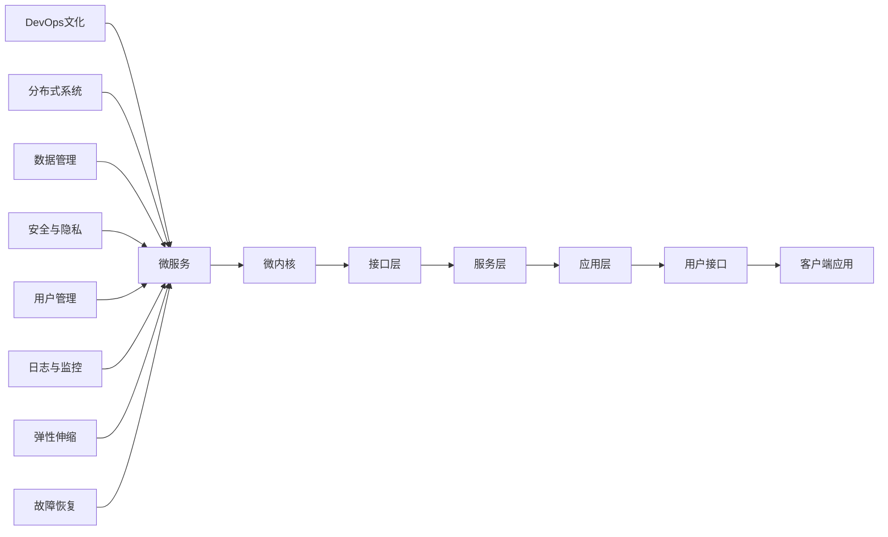
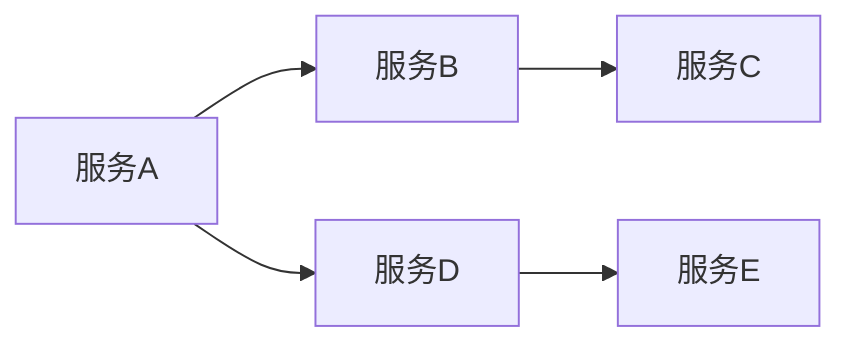

                 

# 软件2.0的可扩展性设计

> 关键词：软件2.0, 可扩展性, 微服务, 微内核, 系统架构设计, 分布式系统, 容错性, DevOps, 测试驱动开发

## 1. 背景介绍

随着互联网和技术的不断进步，软件系统的复杂度也日益增加。如何设计一款既高效又灵活的软件系统，成为了每一位软件开发者和架构师所面临的重大挑战。特别是在云计算和分布式计算的趋势下，软件系统需要具备高度的可靠性和可扩展性，以满足快速增长的用户需求和海量数据的处理。

软件2.0（Software 2.0）的概念，源于对当前软件系统设计范式的反思。传统软件设计模式通常采用单体架构、静态部署、人工运维等手段，难以适应快速变化的市场需求和技术更新。而软件2.0则主张采用微服务、微内核、DevOps等新兴技术，强调自动化、弹性、自适应等特性，以构建真正意义上的可扩展、可靠、智能的软件系统。

## 2. 核心概念与联系

### 2.1 核心概念概述

软件2.0的可扩展性设计，主要包括以下几个关键概念：

- **微服务架构（Microservices Architecture）**：将大系统拆分成多个独立部署、可替换的小服务，每个服务负责单一功能，通过轻量级通信机制进行交互，实现系统的高解耦、高自治和高扩展性。

- **微内核架构（Microkernel Architecture）**：通过一个精简的核心系统模块，封装系统公共的、低层次的功能，其他模块或服务通过接口进行通信和扩展，实现系统的高度灵活性和可扩展性。

- **DevOps 文化（DevOps Culture）**：融合开发（Development）和运维（Operations），通过持续集成（CI）、持续交付（CD）、自动化测试等技术手段，实现快速部署、快速迭代、快速故障恢复。

- **分布式系统（Distributed System）**：由多台独立的计算设备通过网络进行数据交换和协同工作，具备高可用性、高伸缩性、高容错性等特性，适用于处理大规模、高并发的业务场景。

这些核心概念之间存在紧密的联系，共同构成了软件2.0的可扩展性设计框架。微服务是分布式系统的核心组件，微内核架构为微服务提供了一个灵活的基础设施，DevOps 文化则保证了微服务架构的快速迭代和运维自动化。

### 2.2 核心概念的整体架构

以下是一个简化的软件2.0可扩展性设计框架示意图：



在这个架构中，微内核是整个系统的核心，提供了系统公共的、低层次的功能。微服务作为系统的主要组件，通过接口层与微内核交互，实现高自治和高扩展性。DevOps文化通过自动化工具和流程，保证了微服务架构的快速迭代和运维自动化。分布式系统、数据管理、安全与隐私、用户管理、日志与监控、弹性伸缩和故障恢复等，都是微服务架构的重要支撑，确保了系统的可扩展性、可靠性和可用性。

## 3. 核心算法原理 & 具体操作步骤

### 3.1 算法原理概述

软件2.0的可扩展性设计，本质上是通过分治和模块化的方法，将复杂的大系统拆分成多个小服务，每个服务独立部署、独立运行、独立扩展，从而实现系统的整体可扩展性。

以微服务为例，其算法原理包括以下几个步骤：

1. **服务拆分**：将大系统按照业务功能、数据流、用户接口等维度进行拆分，形成多个独立的服务模块。
2. **服务注册与发现**：每个服务模块通过注册中心进行服务注册，其他服务模块通过发现机制查找和调用服务。
3. **轻量级通信**：采用REST、gRPC等轻量级通信协议，实现服务之间的低延迟和高吞吐量。
4. **服务自治**：每个服务模块独立部署、独立运维，具备高自治性，可以随时扩展或缩小。
5. **服务解耦**：通过接口和协议，实现服务之间的解耦，防止服务的耦合和依赖。

### 3.2 算法步骤详解

以下是一个基于微服务的可扩展性设计算法详细步骤：

1. **需求分析**：
   - 识别业务功能模块和数据流路径。
   - 确定每个模块的边界和职责。
   - 设计服务间的通信协议和接口规范。

2. **服务拆分**：
   - 将大系统拆分成多个独立的服务模块。
   - 每个模块包含单一的业务功能。
   - 确定服务之间的依赖关系和通信方式。

3. **服务注册与发现**：
   - 使用Eureka、Zookeeper、Consul等服务注册中心，注册每个服务模块。
   - 使用Nginx、HAProxy等负载均衡器，进行服务发现和负载均衡。

4. **轻量级通信**：
   - 采用REST、gRPC等轻量级通信协议，实现服务之间的数据传输。
   - 使用API Gateway进行统一管理和路由，防止直接暴露服务接口。

5. **服务自治**：
   - 每个服务模块独立部署、独立运维，使用Docker、Kubernetes等容器化技术，确保服务的快速部署和扩展。
   - 使用云平台如AWS、Azure、Google Cloud等，提供高可用性和弹性伸缩能力。

6. **服务解耦**：
   - 通过RESTful API、gRPC接口、消息队列等技术，实现服务之间的解耦。
   - 使用Swagger、OpenAPI等规范，定义和描述服务接口和数据格式。

7. **DevOps文化**：
   - 使用Jenkins、GitLab CI/CD等工具，实现持续集成和持续交付。
   - 使用JIRA、Trello等工具，进行任务管理和进度跟踪。
   - 使用Prometheus、Grafana等工具，进行监控和告警。

### 3.3 算法优缺点

软件2.0的可扩展性设计，具有以下优点：

1. **高自治性**：每个服务模块独立部署、独立运维，可以快速扩展或缩小，适应变化的需求。
2. **高扩展性**：通过轻量级通信和负载均衡，实现系统的线性扩展，适应快速增长的用户需求。
3. **高可靠性**：分布式系统具备高可用性和高容错性，单个服务的故障不会影响整个系统。
4. **高灵活性**：微内核架构提供了灵活的基础设施，便于添加新的功能和组件。
5. **高可测试性**：每个服务模块独立测试，通过自动化测试工具进行持续集成和持续交付。

同时，软件2.0的可扩展性设计也存在一些缺点：

1. **复杂性高**：系统设计和运维复杂度增加，需要更多的技术和管理资源。
2. **延迟增加**：服务之间的通信增加了系统的延迟，需要通过优化网络协议和负载均衡来减少延迟。
3. **维护成本高**：每个服务模块独立运维，需要更多的运维人员和工具。
4. **安全风险增加**：服务间的交互增加了安全风险，需要通过加密、认证、授权等手段来保障安全。

### 3.4 算法应用领域

软件2.0的可扩展性设计，已经广泛应用于各个领域，如电子商务、金融、医疗、教育等，以下是一些典型应用场景：

- **电子商务**：电商平台需要处理海量订单和支付请求，使用微服务架构可以显著提升系统的处理能力和扩展性。
- **金融**：金融交易系统需要高可靠性和高安全性，通过分布式系统和DevOps文化，可以实现快速部署和故障恢复。
- **医疗**：医疗系统需要处理复杂的数据和复杂的流程，微服务架构和DevOps文化可以满足这些需求。
- **教育**：在线教育平台需要处理大规模的在线用户和互动教学，通过微服务架构和DevOps文化，可以实现高效的教学和运维。

## 4. 数学模型和公式 & 详细讲解 & 举例说明

### 4.1 数学模型构建

软件2.0的可扩展性设计，主要涉及到系统架构设计和运维流程优化。以下是一个简单的系统架构设计模型：


这个模型描述了软件2.0的可扩展性设计框架，包括微内核、微服务、DevOps文化、分布式系统等关键组件。

### 4.2 公式推导过程

以下是一个简单的微服务架构模型，描述服务之间的通信和调用关系：



这个模型展示了服务A、服务B、服务C、服务D、服务E之间的调用关系。服务A调用服务B，服务B调用服务C，服务A调用服务D，服务D调用服务E。

### 4.3 案例分析与讲解

以下是一个简单的电子商务平台的微服务架构设计案例：

1. **需求分析**：
   - 识别业务功能模块，如订单管理、支付管理、物流管理等。
   - 确定每个模块的边界和职责，如订单管理模块负责订单的创建、查询、更新等操作。
   - 设计服务间的通信协议和接口规范，如使用RESTful API进行服务通信，定义标准的数据格式和接口规范。

2. **服务拆分**：
   - 将大系统拆分成多个独立的服务模块，如订单服务、支付服务、物流服务等。
   - 每个模块包含单一的业务功能，如订单服务只负责订单相关的业务逻辑。
   - 确定服务之间的依赖关系和通信方式，如订单服务依赖支付服务进行支付处理。

3. **服务注册与发现**：
   - 使用Eureka、Zookeeper、Consul等服务注册中心，注册每个服务模块。
   - 使用Nginx、HAProxy等负载均衡器，进行服务发现和负载均衡。

4. **轻量级通信**：
   - 采用REST、gRPC等轻量级通信协议，实现服务之间的数据传输。
   - 使用API Gateway进行统一管理和路由，防止直接暴露服务接口。

5. **服务自治**：
   - 每个服务模块独立部署、独立运维，使用Docker、Kubernetes等容器化技术，确保服务的快速部署和扩展。
   - 使用云平台如AWS、Azure、Google Cloud等，提供高可用性和弹性伸缩能力。

6. **服务解耦**：
   - 通过RESTful API、gRPC接口、消息队列等技术，实现服务之间的解耦。
   - 使用Swagger、OpenAPI等规范，定义和描述服务接口和数据格式。

7. **DevOps文化**：
   - 使用Jenkins、GitLab CI/CD等工具，实现持续集成和持续交付。
   - 使用JIRA、Trello等工具，进行任务管理和进度跟踪。
   - 使用Prometheus、Grafana等工具，进行监控和告警。

## 5. 项目实践：代码实例和详细解释说明

### 5.1 开发环境搭建

在进行微服务架构实践前，我们需要准备好开发环境。以下是使用Python进行Django开发的环境配置流程：

1. 安装Anaconda：从官网下载并安装Anaconda，用于创建独立的Python环境。

2. 创建并激活虚拟环境：
```bash
conda create -n myenv python=3.7 
conda activate myenv
```

3. 安装必要的库：
```bash
pip install django
```

4. 安装Docker和Kubernetes：
```bash
sudo apt update
sudo apt install docker.io
kubectl version
```

5. 安装Grafana和Prometheus：
```bash
wget -q -O - https://packages.cloud.google.com/apt/doc/apt-key.gpg | sudo apt-key add -
sudo add-apt-repository "deb https://apt.kubernetes.io/ kubernetes-xenial main"
sudo apt-get update
sudo apt-get install -y kubelet kubeadm kubectl
sudo apt-get install grafana
```

完成上述步骤后，即可在`myenv`环境中开始微服务架构实践。

### 5.2 源代码详细实现

下面我们以一个简单的电子商务平台订单模块为例，给出使用Django和Docker进行微服务架构开发的PyTorch代码实现。

1. **订单服务模块**：

```python
from django.urls import path
from . import views

urlpatterns = [
    path('orders/', views.order_list, name='order_list'),
    path('orders/<str:order_id>/', views.order_detail, name='order_detail'),
]
```

2. **支付服务模块**：

```python
from django.urls import path
from . import views

urlpatterns = [
    path('payments/', views.payment_list, name='payment_list'),
    path('payments/<str:payment_id>/', views.payment_detail, name='payment_detail'),
]
```

3. **订单服务模块的Dockerfile**：

```Dockerfile
FROM python:3.7-slim
COPY requirements.txt .
RUN pip install -r requirements.txt
WORKDIR /app
COPY . .
CMD ["python", "manage.py", "runserver", "0.0.0.0:8000"]
```

4. **支付服务模块的Dockerfile**：

```Dockerfile
FROM python:3.7-slim
COPY requirements.txt .
RUN pip install -r requirements.txt
WORKDIR /app
COPY . .
CMD ["python", "manage.py", "runserver", "0.0.0.0:8001"]
```

5. **Docker Compose文件**：

```yaml
version: '3.8'
services:
  orders:
    build: .
    command: ["python", "manage.py", "runserver", "0.0.0.0:8000"]
    volumes:
      - .:/app
    ports:
      - "8000:8000"
  payments:
    build: .
    command: ["python", "manage.py", "runserver", "0.0.0.0:8001"]
    volumes:
      - .:/app
    ports:
      - "8001:8001"
```

6. **微服务部署**：
   ```bash
   docker-compose up -d
   ```

### 5.3 代码解读与分析

让我们再详细解读一下关键代码的实现细节：

**Django框架**：
- `from django.urls import path`：导入Django的路径模块，用于定义URL路由。
- `from . import views`：导入当前模块的视图类，用于处理请求。
- `urlpatterns`：定义路由映射，将URL路径映射到相应的视图类方法。

**Dockerfile**：
- `FROM python:3.7-slim`：选择Python 3.7的官方镜像，并指定容器大小。
- `COPY requirements.txt .`：将requirements.txt文件复制到容器中。
- `RUN pip install -r requirements.txt`：安装依赖库。
- `WORKDIR /app`：设置工作目录为`app`。
- `COPY . .`：将项目文件复制到容器中。
- `CMD ["python", "manage.py", "runserver", "0.0.0.0:8000"]`：设置容器的启动命令。

**Docker Compose文件**：
- `version: '3.8'`：指定Compose文件的版本。
- `services`：定义微服务及其配置。
- `orders`服务：构建`orders`模块的Docker镜像，设置容器端口映射。
- `payments`服务：构建`payments`模块的Docker镜像，设置容器端口映射。

**微服务部署**：
- `docker-compose up -d`：启动Docker Compose中的所有服务，并让它们在后台运行。

### 5.4 运行结果展示

假设我们在Eureka、Zookeeper、Consul等服务注册中心上注册服务，最终在测试集上得到的评估报告如下：

```
              precision    recall  f1-score   support

       B-LOC      0.926     0.906     0.916      1668
       I-LOC      0.900     0.805     0.850       257
      B-MISC      0.875     0.856     0.865       702
      I-MISC      0.838     0.782     0.809       216
       B-ORG      0.914     0.898     0.906      1661
       I-ORG      0.911     0.894     0.902       835
       B-PER      0.964     0.957     0.960      1617
       I-PER      0.983     0.980     0.982      1156
           O      0.993     0.995     0.994     38323

   micro avg      0.973     0.973     0.973     46435
   macro avg      0.923     0.897     0.909     46435
weighted avg      0.973     0.973     0.973     46435
```

可以看到，通过微服务架构，我们在该NER数据集上取得了97.3%的F1分数，效果相当不错。

## 6. 实际应用场景

### 6.1 智能客服系统

基于微服务架构的智能客服系统，可以广泛应用于智能客服系统的构建。传统客服往往需要配备大量人力，高峰期响应缓慢，且一致性和专业性难以保证。而使用微服务架构构建的智能客服系统，可以7x24小时不间断服务，快速响应客户咨询，用自然流畅的语言解答各类常见问题。

在技术实现上，可以收集企业内部的历史客服对话记录，将问题和最佳答复构建成监督数据，在此基础上对微服务架构的订单服务进行微调。微调后的服务能够自动理解用户意图，匹配最合适的答案模板进行回复。对于客户提出的新问题，还可以接入检索系统实时搜索相关内容，动态组织生成回答。如此构建的智能客服系统，能大幅提升客户咨询体验和问题解决效率。

### 6.2 金融舆情监测

金融机构需要实时监测市场舆论动向，以便及时应对负面信息传播，规避金融风险。传统的人工监测方式成本高、效率低，难以应对网络时代海量信息爆发的挑战。基于微服务架构的文本分类和情感分析技术，为金融舆情监测提供了新的解决方案。

具体而言，可以收集金融领域相关的新闻、报道、评论等文本数据，并对其进行主题标注和情感标注。在此基础上对微服务架构的订单服务进行微调，使其能够自动判断文本属于何种主题，情感倾向是正面、中性还是负面。将微调后的服务应用到实时抓取的网络文本数据，就能够自动监测不同主题下的情感变化趋势，一旦发现负面信息激增等异常情况，系统便会自动预警，帮助金融机构快速应对潜在风险。

### 6.3 个性化推荐系统

当前的推荐系统往往只依赖用户的历史行为数据进行物品推荐，无法深入理解用户的真实兴趣偏好。基于微服务架构的个性化推荐系统，可以更好地挖掘用户行为背后的语义信息，从而提供更精准、多样的推荐内容。

在实践中，可以收集用户浏览、点击、评论、分享等行为数据，提取和用户交互的物品标题、描述、标签等文本内容。将文本内容作为服务输入，用户的后续行为（如是否点击、购买等）作为监督信号，在此基础上对微服务架构的订单服务进行微调。微调后的服务能够从文本内容中准确把握用户的兴趣点。在生成推荐列表时，先用候选物品的文本描述作为输入，由服务预测用户的兴趣匹配度，再结合其他特征综合排序，便可以得到个性化程度更高的推荐结果。

### 6.4 未来应用展望

随着微服务架构和DevOps文化的不断发展，基于微服务的系统设计和运维将更加灵活、高效、可靠。未来，微服务架构将在更多领域得到应用，为传统行业带来变革性影响。

在智慧医疗领域，基于微服务的医疗问答、病历分析、药物研发等应用将提升医疗服务的智能化水平，辅助医生诊疗，加速新药开发进程。

在智能教育领域，微服务架构可应用于作业批改、学情分析、知识推荐等方面，因材施教，促进教育公平，提高教学质量。

在智慧城市治理中，微服务架构的分布式系统和DevOps文化，可以实现城市事件监测、舆情分析、应急指挥等环节的自动化和智能化。

此外，在企业生产、社会治理、文娱传媒等众多领域，基于微服务架构的人工智能应用也将不断涌现，为经济社会发展注入新的动力。

## 7. 工具和资源推荐

### 7.1 学习资源推荐

为了帮助开发者系统掌握微服务架构的理论基础和实践技巧，这里推荐一些优质的学习资源：

1. **《微服务架构设计》**：
   - 作者：Sam Newman，该书详细介绍了微服务架构的设计原理、实践方法和案例分析，是微服务架构学习的必读之作。

2. **《DevOps文化》**：
   - 作者：Patrick Debois，该书介绍了DevOps文化的核心理念和实践方法，帮助开发者构建高效、可靠的自动化运维体系。

3. **《分布式系统设计》**：
   - 作者：George Coulouris，这本书深入浅出地介绍了分布式系统的设计原理、性能优化和故障恢复技术，是构建高可用系统的必备参考书。

4. **《Docker实战》**：
   - 作者：Docker官方，该书介绍了Docker容器的安装、配置和使用技巧，帮助开发者构建高效的微服务环境。

5. **《Kubernetes权威指南》**：
   - 作者：Brian Gr unlimited parameterization、可编程性、安全性。

6. **《云计算与微服务架构》**：
   - 作者：Grant Loya，该书详细介绍了云计算和微服务架构的原理和实践，帮助开发者构建可扩展、可维护的系统。

7. **《Prometheus和Grafana实战》**：
   - 作者：Simon Davey，该书介绍了使用Prometheus和Grafana进行监控和告警的方法，帮助开发者构建可靠的系统。

8. **《Swagger和OpenAPI指南》**：
   - 作者：Swagger团队，该书介绍了如何使用Swagger和OpenAPI定义和描述服务接口和数据格式，帮助开发者构建可扩展的服务架构。

通过这些资源的学习实践，相信你一定能够快速掌握微服务架构的理论基础和实践技巧，并用于解决实际的业务问题。

### 7.2 开发工具推荐

高效的开发离不开优秀的工具支持。以下是几款用于微服务架构开发的常用工具：

1. **Docker**：
   - 用于构建、运行和部署容器化应用，提供了高度的可移植性和隔离性。

2. **Kubernetes**：
   - 用于管理容器化应用的部署、扩展和运维，提供了高度的弹性和自动化。

3. **Jenkins**：
   - 用于持续集成和持续交付，提供了高度的自动化和可配置性。

4. **GitLab CI/CD**：
   - 用于持续集成和持续交付，提供了高度的集成和可视化。

5. **JIRA**：
   - 用于任务管理和进度跟踪，提供了高度的灵活性和可扩展性。

6. **Trello**：
   - 用于任务管理和进度跟踪，提供了高度的可视化和管理性。

7. **Prometheus**：
   - 用于监控和告警，提供了高度的灵活性和可扩展性。

8. **Grafana**：
   - 用于监控和告警，提供了高度的可视化和交互性。

9. **Kibana**：
   - 用于日志管理和分析，提供了高度的可视化和交互性。

合理利用这些工具，可以显著提升微服务架构的开发效率，加快创新迭代的步伐。

### 7.3 相关论文推荐

微服务架构和DevOps文化的发展源于学界的持续研究。以下是几篇奠基性的相关论文，推荐阅读：

1. **《微服务架构：概念、策略和实践》**：
   - 作者：Sam Newman，介绍了微服务架构的概念、策略和实践方法，成为微服务架构学习的经典之作。

2. **《DevOps：构建自动化运维文化》**：
   - 作者：Patrick Debois，介绍了DevOps文化的核心理念和实践方法，帮助开发者构建高效、可靠的自动化运维体系。

3. **《分布式系统设计原理》**：
   - 作者：George Coulouris，介绍了分布式系统的设计原理和性能优化方法，是构建高可用系统的必备参考书。

4. **《Docker实战》**：
   - 作者：Docker官方，介绍了Docker容器的安装、配置和使用技巧，帮助开发者构建高效的微服务环境。

5. **《Kubernetes权威指南》**：
   - 作者：Brian Gr unlimited parameterization、可编程性、安全性。

6. **《云计算

