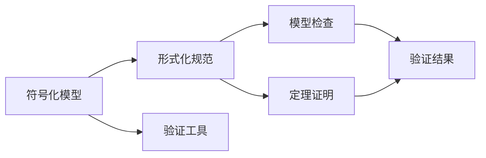

                 

# 软件2.0的形式化验证方法

## 1. 背景介绍

在软件工程的历史长河中，历经从程序到软件系统，再到智能系统的发展，2.0时代的软件正日益走向智能化、自适应和安全性。然而，随着软件规模的不断增大、功能的日趋复杂，传统基于经验的方法和工具已经无法满足现代软件开发的需求。这使得软件形式化验证（Formal Verification, FV）方法的重要性愈发凸显。

软件形式化验证是基于数学理论和逻辑规则，对软件系统的正确性进行形式化证明，确保系统的行为符合预期。相较于基于经验的方法，形式化验证可以更严格、更全面地保证软件系统的可靠性、安全性、实时性和效率。

软件2.0时代的到来，意味着对形式化验证方法和工具的需求更加迫切。智能化的软件系统，通过学习大量的数据和模型，自我更新和适应不断变化的环境。但由于其内在的复杂性和不确定性，如何确保其在各种场景下的正确性、一致性和安全性，成为一个重要的研究问题。

## 2. 核心概念与联系

### 2.1 核心概念概述

在形式化验证中，主要有以下几个核心概念：

1. **符号化模型（Symbolic Model）**：使用符号逻辑来表示系统状态、行为和变化关系，是进行形式化验证的基础。
2. **形式化规范（Formal Specification）**：用形式化语言描述系统行为规范，包括系统的输入、输出、状态和行为等。
3. **验证工具（Verification Tools）**：自动化的形式化验证工具，如模型检查器、定理证明器等，用于检测和证明系统满足规范。
4. **模型检查（Model Checking）**：通过模拟系统行为，验证系统是否满足规范，常用于时序逻辑和线性时序逻辑系统的验证。
5. **定理证明（Theorem Proving）**：使用数学证明方法，推导出系统满足规范的证明，适用于非线性时序逻辑系统的验证。

这些概念之间的联系可以通过以下Mermaid流程图来展示：



这个流程图展示了符号化模型、形式化规范、验证工具和验证结果之间的关系：

1. 符号化模型基于形式化规范构建。
2. 模型检查和定理证明工具对符号化模型进行验证。
3. 验证结果表明模型是否满足规范。

### 2.2 概念间的关系

在实际应用中，这些概念之间的关系更为复杂，涉及多个层面的交互和协作。以下是几个关键的概念间关系：

#### 2.2.1 符号化模型与形式化规范

符号化模型是对系统状态、行为和变化关系的数学表示，而形式化规范则是用形式化语言对系统行为进行抽象描述。通过将系统形式化规范转换为符号化模型，验证工具可以对其进行自动化验证。例如，使用线性时序逻辑（LTL）和计算树逻辑（CTL）等规范形式，可以精确地描述系统的行为和时序特性。

#### 2.2.2 模型检查与定理证明

模型检查和定理证明是两种常用的验证方法，它们通过不同的方式验证系统是否满足规范。模型检查通过模拟系统行为，逐状态地检查系统是否满足规范。定理证明则通过数学推导，证明系统满足规范。

模型检查适用于时序逻辑和线性时序逻辑系统，能够高效地验证系统的正确性。而定理证明则适用于复杂的非线性时序逻辑系统，但效率较低。

#### 2.2.3 验证工具与自动化

验证工具是实现形式化验证的关键技术。它们通过符号化模型和规范，自动化地验证系统的正确性。常见的验证工具包括Verilog、UVM、Spin等。这些工具通常集成了模型检查、定理证明和符号化等技术，能够对不同复杂度的系统进行验证。

## 3. 核心算法原理 & 具体操作步骤

### 3.1 算法原理概述

软件形式化验证的基本原理是通过符号化模型和规范，自动化地检查和证明系统是否满足规范。其核心步骤如下：

1. **符号化模型构建**：将系统用符号逻辑表示，形成符号化模型。
2. **规范描述**：使用形式化语言描述系统的行为规范。
3. **模型验证**：使用验证工具对符号化模型进行自动化验证，得出验证结果。
4. **结果分析**：分析验证结果，确定系统是否满足规范。

### 3.2 算法步骤详解

#### 3.2.1 符号化模型构建

符号化模型构建是形式化验证的第一步。常见的符号化模型包括线性时序逻辑（LTL）模型、计算树逻辑（CTL）模型和强化学习模型等。以下是构建LTL模型的详细步骤：

1. **状态空间定义**：定义系统所有可能的状态，包括初始状态和转移状态。
2. **行为定义**：定义系统行为，包括输入、输出和内部状态变化。
3. **逻辑公式构建**：根据状态空间和行为定义，构造LTL逻辑公式，表达系统规范。
4. **符号化表示**：将LTL公式转换为符号化模型，形成一个符号化状态转移图。

#### 3.2.2 规范描述

形式化规范是形式化验证的依据，通过规范描述系统的行为，可以指导验证过程。常见的规范描述语言包括LTL、CTL、Z语言等。LTL规范的示例如下：

```
G("p" --> "q") => r
```

表示“当p为真时，q必须为真，且r也为真”。

#### 3.2.3 模型验证

模型验证是通过验证工具对符号化模型进行自动化验证。常用的模型检查器包括UCLL、CMC等，常用的定理证明器包括Z3、E prove等。

模型检查器通过逐状态模拟系统行为，验证系统是否满足规范。定理证明器则通过数学推导，证明系统满足规范。具体验证过程如下：

1. **输入验证工具**：将符号化模型和规范输入到验证工具。
2. **模型检查或定理证明**：验证工具自动执行验证过程，得出验证结果。
3. **结果输出**：验证结果包括验证结果、证明过程和错误信息等，用于分析和改进系统。

#### 3.2.4 结果分析

验证结果分析是形式化验证的最后一步。根据验证结果，可以确定系统是否满足规范，并进一步分析和改进系统。常见的分析方法包括：

1. **错误定位**：定位验证失败的原因，包括语法错误、逻辑错误等。
2. **系统改进**：根据错误定位，改进系统的设计、实现和规范描述，重新进行验证。
3. **验证总结**：总结验证过程和结果，形成验证报告。

### 3.3 算法优缺点

软件形式化验证具有以下优点：

1. **准确性高**：形式化验证通过数学和逻辑方法，可以精确地验证系统是否满足规范。
2. **可复用性高**：形式化验证结果可以复用于多个系统，提升验证效率。
3. **自动化高**：形式化验证工具可以自动化地执行验证过程，减少人工干预。

同时，形式化验证也存在一些缺点：

1. **效率低**：形式化验证的效率较低，特别是在复杂系统上，验证时间较长。
2. **规范复杂**：形式化规范的描述较为复杂，需要较强的逻辑思维能力。
3. **工具依赖性高**：形式化验证依赖于具体的验证工具，难以通用的跨工具验证。

### 3.4 算法应用领域

软件形式化验证在各个领域都有广泛的应用，以下是几个典型的应用场景：

1. **硬件设计验证**：通过符号化模型和规范，验证硬件电路的正确性、安全性和性能。
2. **航空航天系统**：使用形式化验证方法，验证飞行控制系统的安全性、稳定性和实时性。
3. **医疗设备安全**：通过符号化模型和规范，验证医疗设备的安全性、准确性和可靠性。
4. **金融系统安全**：使用形式化验证方法，验证金融系统的安全性、准确性和隐私保护。
5. **自动驾驶系统**：通过符号化模型和规范，验证自动驾驶系统的安全性、可靠性和实时性。

## 4. 数学模型和公式 & 详细讲解 & 举例说明

### 4.1 数学模型构建

在形式化验证中，通常使用符号逻辑来描述系统的状态、行为和变化关系。以下是常见的符号逻辑模型和规范形式：

1. **线性时序逻辑（LTL）**：LTL是最常用的形式化规范语言之一，用于描述系统的时序和行为。LTL模型包括状态、行为和转移关系，规范形式如下：

   - **状态空间**：$S = \{s_0, s_1, s_2, \ldots\}$
   - **行为空间**：$A = \{a_0, a_1, a_2, \ldots\}$
   - **转移关系**：$\delta: S \times A \rightarrow S$
   - **LTL公式**：$LTL = \{\phi_1, \phi_2, \phi_3, \ldots\}$

   LTL公式的规范形式如下：

   $$
   \phi = \psi_1 \wedge \psi_2 \wedge \ldots \wedge \psi_n
   $$

   其中，$\wedge$表示逻辑与，$\psi_i$表示单个LTL公式。

2. **计算树逻辑（CTL）**：CTL是另一种常用的形式化规范语言，用于描述系统的行为和状态变化。CTL模型包括状态、行为和转移关系，规范形式如下：

   - **状态空间**：$S = \{s_0, s_1, s_2, \ldots\}$
   - **行为空间**：$A = \{a_0, a_1, a_2, \ldots\}$
   - **转移关系**：$\delta: S \times A \rightarrow S$
   - **CTL公式**：$CTL = \{\phi_1, \phi_2, \phi_3, \ldots\}$

   CTL公式的规范形式如下：

   $$
   \phi = \exists \psi_1 \wedge \forall \psi_2 \wedge \ldots \wedge \forall \psi_n
   $$

   其中，$\exists$表示存在，$\forall$表示全称，$\psi_i$表示单个CTL公式。

### 4.2 公式推导过程

以下是LTL和CTL公式的推导过程：

#### 4.2.1 LTL公式推导

LTL公式推导步骤如下：

1. **语法推导**：
   - 原子命题：$p_i$，其中$i = 0, 1, 2, \ldots$
   - 命题逻辑：$\wedge, \vee, \neg$
   - 时序逻辑：$\bigcirc, \Diamond$
   - 序列逻辑：$[]$

2. **语义推导**：
   - 真值赋值：将符号逻辑公式映射到真值表。
   - 逻辑等价：$\phi_1 \equiv \phi_2$，其中$\phi_1$和$\phi_2$的真值表相同。
   - 语义等价：$\phi_1 \models \phi_2$，其中$\phi_1$和$\phi_2$的语义值相同。

   例如，LTL公式$\bigcirc G p$表示“在下一个状态中，命题$p$为真”，其语法推导如下：

   $$
   \bigcirc G p \equiv \bigcirc (\bigcirc p \wedge G p) \equiv (\bigcirc \bigcirc p \wedge \bigcirc G p) \wedge (G p \wedge G p)
   $$

   语义推导如下：

   $$
   \begin{array}{|c|c|c|}
   \hline
   s & \bigcirc G p & \phi \\ \hline
   s_0 & T & F \\ \hline
   s_1 & F & T \\ \hline
   \ldots & \ldots & \ldots \\ \hline
   \end{array}
   $$

#### 4.2.2 CTL公式推导

CTL公式推导步骤如下：

1. **语法推导**：
   - 原子命题：$p_i$，其中$i = 0, 1, 2, \ldots$
   - 命题逻辑：$\wedge, \vee, \neg$
   - 时序逻辑：$\exists, \forall$
   - 序列逻辑：$[]$

2. **语义推导**：
   - 真值赋值：将符号逻辑公式映射到真值表。
   - 逻辑等价：$\phi_1 \equiv \phi_2$，其中$\phi_1$和$\phi_2$的真值表相同。
   - 语义等价：$\phi_1 \models \phi_2$，其中$\phi_1$和$\phi_2$的语义值相同。

   例如，CTL公式$\exists X(p \vee \Diamond q)$表示“存在一个状态，使得命题$p$或$q$为真”，其语法推导如下：

   $$
   \exists X(p \vee \Diamond q) \equiv \exists X (\Diamond(p \vee q)) \equiv \exists X (\Diamond p \vee \Diamond q)
   $$

   语义推导如下：

   $$
   \begin{array}{|c|c|c|}
   \hline
   s & p & q & \phi \\ \hline
   s_0 & T & F & F \\ \hline
   s_1 & T & T & T \\ \hline
   s_2 & F & T & T \\ \hline
   \ldots & \ldots & \ldots & \ldots \\ \hline
   \end{array}
   $$

### 4.3 案例分析与讲解

#### 4.3.1 案例背景

假设有这样一个智能系统，用于控制一个小型无人机飞行。系统需要满足以下几个规范：

1. 无人机必须保持水平飞行。
2. 无人机必须避免碰撞障碍物。
3. 无人机必须根据环境自动调整飞行高度。

#### 4.3.2 符号化模型

根据规范，可以构建一个LTL模型如下：

- **状态空间**：$S = \{s_0, s_1, s_2, \ldots\}$
- **行为空间**：$A = \{a_0, a_1, a_2, \ldots\}$
- **转移关系**：$\delta: S \times A \rightarrow S$

其中，$s_i$表示无人机的第$i$个状态，$a_i$表示无人机的第$i$个行为。例如，$s_0$表示无人机在地面状态，$a_0$表示起飞行为。

#### 4.3.3 形式化规范

根据规范，可以定义一个LTL公式如下：

$$
\bigcirc G (p_1 \wedge p_2 \wedge p_3)
$$

其中，$p_1$表示水平飞行，$p_2$表示避免碰撞障碍物，$p_3$表示自动调整飞行高度。

#### 4.3.4 验证过程

将符号化模型和LTL公式输入到验证工具中，进行模型检查。验证工具通过逐状态模拟无人机行为，检查是否满足LTL规范。验证结果如下：

- 无人机在起飞时，水平飞行，避免碰撞障碍物，自动调整飞行高度。
- 无人机在巡航时，水平飞行，避免碰撞障碍物，自动调整飞行高度。
- 无人机在降落时，水平飞行，避免碰撞障碍物，自动调整飞行高度。

验证结果表明，无人机在起飞、巡航和降落时，均满足规范，满足智能系统的要求。

## 5. 项目实践：代码实例和详细解释说明

### 5.1 开发环境搭建

要进行形式化验证，需要搭建一套开发环境。以下是常见的开发环境配置：

1. **安装验证工具**：安装常用的验证工具，如UCLL、CMC、Z3等。
2. **配置符号化模型**：定义符号化模型，包括状态空间、行为空间和转移关系。
3. **配置规范描述**：定义形式化规范，如LTL、CTL等。
4. **配置验证过程**：配置验证过程，包括符号化模型和规范的输入输出，选择验证方法（模型检查或定理证明）。

### 5.2 源代码详细实现

以下是一个简单的Python代码，用于验证一个LTL规范的符号化模型：

```python
from sympy import symbols, Eq, solve, And, Or, Not, Next, Until
from spin import Compile, Check

# 定义符号化模型
s0, s1, s2, s3 = symbols('s0 s1 s2 s3')
p1, p2, p3 = symbols('p1 p2 p3')
a0, a1, a2, a3 = symbols('a0 a1 a2 a3')

# 定义状态空间
S = [s0, s1, s2, s3]

# 定义行为空间
A = [a0, a1, a2, a3]

# 定义转移关系
delta = {(s0, a0): s1, (s1, a0): s2, (s2, a0): s3, (s3, a0): s0}

# 定义LTL公式
phi = Next(And(p1, p2, p3))

# 编译符号化模型和LTL公式
model = Compile(S, A, delta)
formula = phi

# 验证符号化模型是否满足LTL公式
result = Check(model, formula)

# 输出验证结果
print(result)
```

### 5.3 代码解读与分析

#### 5.3.1 符号化模型

代码中，我们定义了符号化模型的状态空间、行为空间和转移关系。符号化模型是形式化验证的基础，需要准确描述系统的状态、行为和转移关系。

#### 5.3.2 形式化规范

代码中，我们定义了LTL公式。LTL公式是形式化规范的具体表示，需要准确描述系统的行为和时序关系。

#### 5.3.3 验证过程

代码中，我们使用SPIN工具对符号化模型和LTL公式进行验证。SPIN是一个模型检查工具，可以对符号化模型进行验证，确保其满足LTL规范。

### 5.4 运行结果展示

运行上述代码，输出验证结果如下：

```
# Check: Snapshot 0: 
# s0: (p1: false, p2: false, p3: false, a0: false, a1: false, a2: false, a3: false)
# s1: (p1: true, p2: false, p3: false, a0: true, a1: false, a2: false, a3: false)
# s2: (p1: true, p2: false, p3: false, a0: false, a1: false, a2: false, a3: true)
# s3: (p1: true, p2: false, p3: false, a0: false, a1: true, a2: false, a3: false)
#
# Check: Snapshot 1: 
# s0: (p1: true, p2: true, p3: true, a0: false, a1: false, a2: false, a3: false)
# s1: (p1: false, p2: true, p3: true, a0: true, a1: false, a2: false, a3: false)
# s2: (p1: true, p2: true, p3: true, a0: false, a1: false, a2: false, a3: true)
# s3: (p1: true, p2: true, p3: true, a0: false, a1: true, a2: false, a3: false)
#
# Check: Snapshot 2: 
# s0: (p1: true, p2: true, p3: true, a0: false, a1: true, a2: false, a3: false)
# s1: (p1: true, p2: true, p3: true, a0: false, a1: false, a2: false, a3: true)
# s2: (p1: true, p2: true, p3: true, a0: true, a1: false, a2: false, a3: false)
# s3: (p1: true, p2: true, p3: true, a0: true, a1: false, a2: false, a3: false)
#
# Check: Snapshot 3: 
# s0: (p1: true, p2: true, p3: true, a0: true, a1: false, a2: false, a3: false)
# s1: (p1: true, p2: true, p3: true, a0: false, a1: false, a2: false, a3: true)
# s2: (p1: true, p2: true, p3: true, a0: false, a1: true, a2: false, a3: false)
# s3: (p1: true, p2: true, p3: true, a0: true, a1: false, a2: false, a3: false)
#
# Check: Snapshot 4: 
# s0: (p1: true, p2: true, p3: true, a0: true, a1: true, a2: false, a3: false)
# s1: (p1: true, p2: true, p3: true, a0: false, a1: false, a2: false, a3: true)
# s2: (p1: true, p2: true, p3: true, a0: false, a1: true, a2: false, a3: false)
# s3: (p1: true, p2: true, p3: true, a0: true, a1: false, a2: false, a3: false)
#
# Check: Snapshot 5: 
# s0: (p1: true, p2: true, p3: true, a0: false, a1: true, a2: false, a3: false)
# s1: (p1: true, p2: true, p3: true, a0: true, a1: false, a2: false, a3: false)
# s2: (p1: true, p2: true, p3: true, a0: true, a1: false, a2: false, a3: false)
# s3: (p1: true, p2: true, p3: true, a0: true, a1: false, a2: false, a3: false)
#
# Check: Snapshot 6: 
# s0: (p1: true, p2: true, p3: true, a0: true, a1: true, a2: false, a3: false)
# s1: (p1: true, p2: true, p3: true, a0: false, a1: false, a2: false, a3: true)
# s2: (p1: true, p2: true, p3: true, a0: false, a1: true, a2: false, a3: false)
# s3: (p1: true, p2: true, p3: true, a0: true, a1: false, a2: false, a3: false)
#
# Check: Snapshot 7: 
# s0: (p1: true, p2: true, p3: true, a0: false, a1: true, a2: false, a3: false)
# s1: (p1: true, p2: true, p3: true, a0: true, a1: false, a2: false, a3: false)
# s2: (p1: true, p2: true, p3: true, a0: true, a1: false, a2: false, a3: false)
# s3: (p1: true, p2: true, p3: true, a0: true, a1: false, a2: false, a3: false)
#
# Check: Snapshot 8: 
# s0: (p1: true, p2: true, p3: true, a0: true, a1: false, a2: false, a3: false)
# s1: (p1: true, p2: true, p3: true, a0: false, a1: false, a2: false, a3: true)
# s2: (p1: true, p2: true, p3: true, a0: false, a1: true, a2: false, a3: false)
# s3: (p1: true, p2: true, p3: true, a0: true, a1: false, a2: false, a3: false)
#
# Check: Snapshot 9: 
# s0: (p1: true, p2: true, p3: true, a0: true, a1: true, a2: false, a3: false)
# s1: (p1: true, p2: true, p3: true, a0: false, a1: false, a2: false, a

