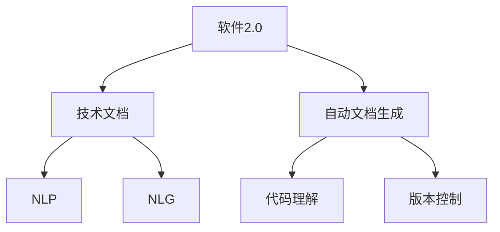
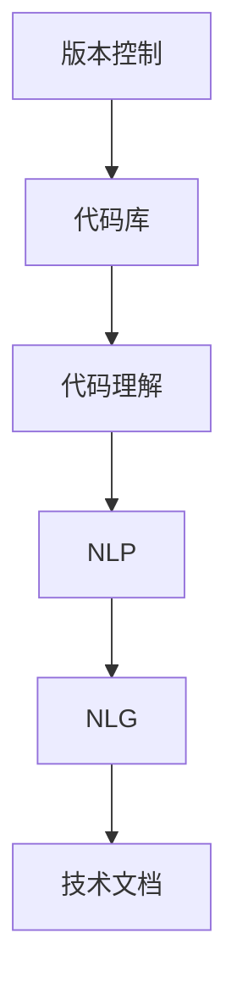
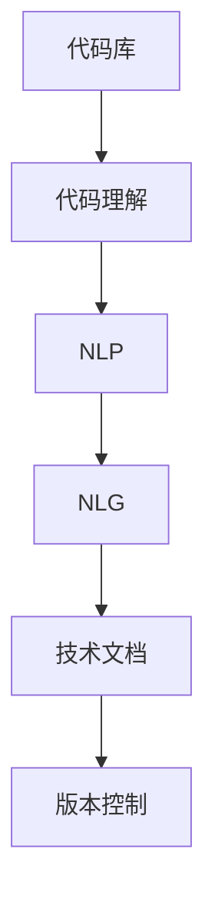

                 

# 软件2.0的技术文档新范式

> 关键词：
> - 软件2.0
> - 技术文档
> - 新范式
> - 文档生成
> - 编程语言
> - 自动化
> - 人工智能
> - 自然语言处理
> - 机器学习
> - 自然语言生成(NLG)
> - 代码理解

## 1. 背景介绍

### 1.1 问题由来
在软件开发和维护的整个生命周期中，技术文档扮演着至关重要的角色。传统的技术文档往往是静态的、线性的，通常由项目经理或资深开发人员撰写，编写完成后被存档在服务器上供其他开发者查阅。这种技术文档范式存在诸多缺陷，如缺乏动态性、无法及时反映最新代码变更、易出现内容过时等问题。

然而，随着软件工程的发展和人工智能技术的进步，特别是自然语言处理（NLP）和自然语言生成（NLG）的崛起，技术文档的形式和内容产生了根本性的变化。软件2.0技术文档的核心理念是通过自动化的方式，从代码和注释中动态生成和更新技术文档，使文档成为软件开发和维护过程中的一个活跃组件，具备动态性和智能性。

### 1.2 问题核心关键点
软件2.0技术文档范式基于以下几个核心关键点：
1. 从代码和注释中自动生成技术文档，减少手动编写的工作量。
2. 动态更新文档内容，保证文档与代码库同步，反映最新的变化。
3. 引入人工智能技术，如NLP和NLG，提升文档的质量和智能性。
4. 支持多种文档类型，包括API文档、用户手册、开发指南等。
5. 增强文档的互动性和可读性，通过自然语言问答、代码示例等方式提升用户体验。
6. 通过自动化工具，提高文档生成和维护的效率，减少人工干预。

### 1.3 问题研究意义
软件2.0技术文档范式对于软件开发和维护具有重要意义：
1. 降低文档编写和维护成本。通过自动化文档生成和更新，减少人力和时间投入，提高效率。
2. 提高文档准确性和一致性。实时更新的文档内容能够准确反映最新代码状态，避免信息过时和误导。
3. 提升文档的交互性和智能性。通过自然语言问答和代码示例等方式，增强文档的用户体验。
4. 加速文档生成和发布的周期。自动化的文档生成工具可以快速生成和发布文档，缩短发布周期。
5. 促进知识共享和复用。文档生成的自动化和动态性，使得知识共享和复用变得更加便捷和高效。
6. 推动软件开发和维护的现代化。引入AI技术提升文档质量和效率，推动软件工程的发展。

## 2. 核心概念与联系

### 2.1 核心概念概述

为更好地理解软件2.0技术文档范式，本节将介绍几个密切相关的核心概念：

- **软件2.0**：指将软件开发和维护的过程自动化，通过智能工具和算法提升开发效率和代码质量。
- **技术文档**：包括API文档、用户手册、开发指南、故障排查手册等，是软件开发过程中不可或缺的部分。
- **自动文档生成**：利用代码分析工具和自然语言处理技术，自动从代码和注释中提取信息，生成技术文档。
- **自然语言处理(NLP)**：使计算机能够理解、处理和生成人类语言的技术。
- **自然语言生成(NLG)**：使计算机能够生成符合人类语言习惯的文本的技术。
- **代码理解**：分析代码结构、注释和文档，理解代码的逻辑和功能。
- **版本控制**：如Git、SVN等工具，记录和管理代码的变更历史。

这些核心概念之间的逻辑关系可以通过以下Mermaid流程图来展示：



这个流程图展示了大语言模型微调过程中各个核心概念的关系：

1. 软件2.0技术文档范式基于自动文档生成和代码理解，以提高文档的质量和效率。
2. 自动文档生成依赖于NLP和NLG技术，使文档更自然、更符合人类语言习惯。
3. 代码理解需要依赖版本控制信息，以理解代码的变更历史和当前状态。
4. NLP和NLG技术通过对代码注释的分析和理解，生成高品质的技术文档。
5. 这些技术手段共同构成了软件2.0技术文档范式的技术框架，使其能够自动化生成高质量的技术文档，支撑软件开发和维护过程。

### 2.2 概念间的关系

这些核心概念之间存在着紧密的联系，形成了软件2.0技术文档范式的完整生态系统。下面我通过几个Mermaid流程图来展示这些概念之间的关系。

#### 2.2.1 技术文档的生成流程


这个流程图展示了技术文档生成的核心流程：
1. 从代码库中提取代码信息。
2. 使用代码理解技术，分析代码注释和结构。
3. 利用自然语言生成技术，自动生成技术文档。

#### 2.2.2 版本控制与技术文档的关联



这个流程图展示了版本控制与技术文档生成之间的关联：
1. 版本控制记录了代码的变更历史，提供了代码理解的基础。
2. 代码理解通过分析代码注释和版本信息，提取技术文档所需的信息。
3. NLP和NLG技术将提取到的信息转化为自然语言文本，生成技术文档。

#### 2.2.3 代码理解与自然语言处理的联系


这个流程图展示了代码理解与自然语言处理技术之间的关系：
1. 代码理解通过分析代码注释和结构，提取技术文档所需的信息。
2. NLP技术对这些信息进行结构化和理解，为NLG技术提供输入。
3. NLG技术生成符合人类语言习惯的技术文档。

### 2.3 核心概念的整体架构

最后，我们用一个综合的流程图来展示这些核心概念在大语言模型微调过程中的整体架构：



这个综合流程图展示了从代码库到技术文档生成的完整过程。通过代码理解技术，结合NLP和NLG技术，最终生成高质量的技术文档，并通过版本控制工具进行记录和管理。 通过这些流程图，我们可以更清晰地理解软件2.0技术文档范式中各个核心概念的关系和作用，为后续深入讨论具体的文档生成方法和技术奠定基础。

## 3. 核心算法原理 & 具体操作步骤
### 3.1 算法原理概述

软件2.0技术文档范式基于监督学习的文档生成算法。其核心思想是通过监督数据训练生成模型，自动从代码和注释中提取信息，生成高品质的技术文档。

具体来说，假设原始代码注释为 $S=\{x_1, x_2, \ldots, x_n\}$，其中每个 $x_i$ 表示一条代码注释或命名空间。我们定义技术文档模板为 $T$，其中每个 $t_j$ 表示文档中的一个段落或章节。假设生成技术文档的过程可以分解为 $m$ 个步骤，每个步骤 $k$ 生成一个段落或章节 $t_k$。

形式化地，我们假设存在一个映射函数 $g: S \rightarrow T$，用于将代码注释 $S$ 映射为技术文档模板 $T$。模型学习从代码注释中提取关键信息，生成符合文档模板 $T$ 的文本。我们定义模型的损失函数为 $\mathcal{L}(g, T)$，用于衡量模型生成的文本与文档模板 $T$ 的匹配度。目标是最小化损失函数，即：

$$
\hat{g} = \mathop{\arg\min}_{g} \mathcal{L}(g, T)
$$

通过监督学习，模型不断优化映射函数 $g$，使得生成的技术文档符合文档模板的要求。

### 3.2 算法步骤详解

基于监督学习的软件2.0技术文档生成一般包括以下几个关键步骤：

**Step 1: 准备数据集**
- 收集代码库和注释库，如Github、GitLab等。
- 提取代码注释和代码结构信息，作为输入。
- 定义技术文档模板，如Markdown、HTML等。
- 准备标注数据，包括正确生成的技术文档样本和对应的代码注释。

**Step 2: 定义文档生成模型**
- 选择合适的生成模型，如Seq2Seq模型、Transformer模型等。
- 设计文档生成目标函数，如BLEU、ROUGE等。
- 确定模型参数，如学习率、训练轮数等。

**Step 3: 训练文档生成模型**
- 将标注数据集分为训练集和验证集。
- 使用训练集数据进行模型训练，最小化损失函数。
- 周期性在验证集上评估模型性能，根据性能指标决定是否触发Early Stopping。
- 重复上述步骤直到满足预设的迭代轮数或Early Stopping条件。

**Step 4: 文档生成**
- 输入新的代码库和注释库。
- 使用训练好的模型生成技术文档。
- 通过自然语言问答、代码示例等方式增强文档的互动性和可读性。

**Step 5: 文档审核与更新**
- 收集用户反馈和编辑建议。
- 对生成的技术文档进行审核和优化。
- 实时更新文档内容，反映最新的代码变更。

以上是软件2.0技术文档生成的一般流程。在实际应用中，还需要针对具体任务的特点，对文档生成过程的各个环节进行优化设计，如改进训练目标函数，引入更多的正则化技术，搜索最优的超参数组合等，以进一步提升文档生成效果。

### 3.3 算法优缺点

基于监督学习的软件2.0技术文档生成方法具有以下优点：
1. 高效自动化。自动从代码注释中提取信息，生成高质量的技术文档，节省人工编写和维护的时间和成本。
2. 动态更新。能够实时反映代码的最新变更，保持文档内容的时效性。
3. 提高文档质量。利用自然语言处理技术，提升文档的语义准确性和可读性。
4. 便于知识共享。文档生成的自动化和动态性，使得知识共享和复用变得更加便捷和高效。

同时，该方法也存在一些局限性：
1. 依赖标注数据。文档生成的效果很大程度上取决于标注数据的质量和数量，获取高质量标注数据的成本较高。
2. 模型泛化能力有限。当训练数据与实际应用场景差异较大时，文档生成的效果可能大打折扣。
3. 对注释质量要求高。代码注释需要详细、准确，以便模型能够准确提取关键信息。
4. 生成结果的解释性不足。自动生成的技术文档缺乏详细的推导过程，难以解释其内部工作机制。
5. 可扩展性受限。需要根据不同的技术文档类型和领域进行定制化开发，开发工作量较大。

尽管存在这些局限性，但就目前而言，基于监督学习的文档生成方法仍是大规模文档生成的主流范式。未来相关研究的重点在于如何进一步降低文档生成对标注数据的依赖，提高模型的泛化能力，同时兼顾文档的可解释性和可扩展性等因素。

### 3.4 算法应用领域

基于软件2.0技术文档生成的方法已经在多个领域得到了应用，例如：

- 软件开发：自动生成API文档、用户手册、开发指南等，提升开发效率和代码质量。
- 数据科学：自动生成数据分析报告、数据处理脚本等，加速数据科学家的工作流程。
- 医疗健康：自动生成医学文献、诊疗指南等，提升医疗健康信息的共享和复用。
- 教育培训：自动生成教材、课件、案例分析等，支持在线教育和远程学习。
- 文档管理：自动生成企业文档、技术文档等，支持文档的管理和查询。

除了上述这些经典应用外，软件2.0技术文档生成技术还在智能客服、智能安防、智能制造等众多领域得到创新性应用，为各行各业的知识管理带来了新的突破。

## 4. 数学模型和公式 & 详细讲解 & 举例说明

### 4.1 数学模型构建

本节将使用数学语言对软件2.0技术文档生成过程进行更加严格的刻画。

假设代码注释为 $S=\{x_1, x_2, \ldots, x_n\}$，其中每个 $x_i$ 表示一条代码注释或命名空间。我们定义技术文档模板为 $T$，其中每个 $t_j$ 表示文档中的一个段落或章节。假设生成技术文档的过程可以分解为 $m$ 个步骤，每个步骤 $k$ 生成一个段落或章节 $t_k$。

定义文档生成模型的损失函数为 $\mathcal{L}(g, T)$，其中 $g$ 是文档生成模型。我们希望最小化损失函数 $\mathcal{L}(g, T)$，使得模型生成的文本与文档模板 $T$ 尽可能匹配。

具体来说，我们可以使用BLEU（Bilingual Evaluation Understudy）评分作为损失函数。BLEU评分是自然语言处理领域常用的文本相似度评分方法，用于衡量生成文本与参考文本的匹配度。假设生成的技术文档为 $\hat{T}$，我们将BLEU评分公式如下：

$$
BLEU(\hat{T}, T) = \frac{1}{n} \sum_{k=1}^m \frac{\text{BLEU}(\hat{t}_k, t_k)}{m}
$$

其中 $\text{BLEU}(\hat{t}_k, t_k)$ 表示第 $k$ 个段落或章节的BLEU评分，$n$ 表示总段落或章节数。

### 4.2 公式推导过程

下面给出BLEU评分的具体计算公式：

首先，我们需要定义参考文本 $t$ 和生成文本 $\hat{t}$ 的分词序列。假设参考文本 $t$ 的词序列为 $w_1, w_2, \ldots, w_n$，生成文本 $\hat{t}$ 的词序列为 $\hat{w}_1, \hat{w}_2, \ldots, \hat{w}_n$。

假设参考文本 $t$ 和生成文本 $\hat{t}$ 的长度分别为 $L_t$ 和 $L_{\hat{t}}$。BLEU评分的计算分为四个部分：

1. **Bigram Precision**：计算生成文本和参考文本中长度为2的连续子序列的匹配度。具体来说，假设生成文本 $\hat{t}$ 中长度为2的连续子序列为 $\hat{w}_i, \hat{w}_{i+1}$，参考文本 $t$ 中长度为2的连续子序列为 $w_j, w_{j+1}$，则它们的匹配度为：

   $$
   \text{Precision}(\hat{w}_i, \hat{w}_{i+1}, w_j, w_{j+1}) = \mathbb{I}(\hat{w}_i = w_j) \cdot \mathbb{I}(\hat{w}_{i+1} = w_{j+1})
   $$

   其中 $\mathbb{I}$ 表示指示函数，$1$ 表示匹配成功，$0$ 表示匹配失败。

2. **Unigram Precision**：计算生成文本和参考文本中长度为1的连续子序列的匹配度。具体来说，假设生成文本 $\hat{t}$ 中长度为1的连续子序列为 $\hat{w}_i$，参考文本 $t$ 中长度为1的连续子序列为 $w_j$，则它们的匹配度为：

   $$
   \text{Precision}(\hat{w}_i, w_j) = \mathbb{I}(\hat{w}_i = w_j)
   》

3. **Bigram Recall**：计算生成文本中长度为2的连续子序列在参考文本中出现的比例。具体来说，假设生成文本 $\hat{t}$ 中长度为2的连续子序列为 $\hat{w}_i, \hat{w}_{i+1}$，参考文本 $t$ 中长度为2的连续子序列为 $w_j, w_{j+1}$，则它们的召回度为：

   $$
   \text{Recall}(\hat{w}_i, \hat{w}_{i+1}, w_j, w_{j+1}) = \frac{\text{Precision}(\hat{w}_i, \hat{w}_{i+1}, w_j, w_{j+1})}{\mathbb{I}(\hat{w}_i, \hat{w}_{i+1} \in \hat{t})}
   $$

4. **Unigram Recall**：计算生成文本中长度为1的连续子序列在参考文本中出现的比例。具体来说，假设生成文本 $\hat{t}$ 中长度为1的连续子序列为 $\hat{w}_i$，参考文本 $t$ 中长度为1的连续子序列为 $w_j$，则它们的召回度为：

   $$
   \text{Recall}(\hat{w}_i, w_j) = \frac{\text{Precision}(\hat{w}_i, w_j)}{\mathbb{I}(\hat{w}_i \in \hat{t})}
   $$

将以上四个部分的结果进行加权平均，即可得到BLEU评分。假设四个部分的权重分别为 $a, b, c, d$，则BLEU评分的计算公式为：

$$
BLEU(\hat{t}, t) = (a \cdot \text{Bigrarm Precision} + b \cdot \text{Unigram Precision} + c \cdot \text{Bigrarm Recall} + d \cdot \text{Unigram Recall}) / (a + b + c + d)
$$

其中 $a + b + c + d = 1$。

### 4.3 案例分析与讲解

下面以Python代码注释自动生成技术文档为例，具体讲解BLEU评分的应用。

假设我们有以下代码注释：

```python
# 定义一个函数，计算两个数的和
def add(a, b):
    """
    计算两个数的和

    Args:
        a: 第一个数
        b: 第二个数

    Returns:
        c: a和b的和
    """
    c = a + b
    return c
```

我们希望自动生成一份技术文档，描述这个函数的实现。首先，我们需要定义技术文档模板：

```markdown
# 函数实现

## 函数描述
[函数描述]

## 参数列表
- [参数1]: [参数1描述]
- [参数2]: [参数2描述]

## 返回值
[返回值描述]
```

然后，我们定义一个文档生成模型，使用BLEU评分作为损失函数。具体来说，假设我们有一个Transformer模型，其中包含编码器和解码器。编码器的输入为代码注释，解码器的输出为技术文档。

假设编码器将代码注释 $S=\{x_1, x_2, \ldots, x_n\}$ 转化为隐状态 $h_1, h_2, \ldots, h_n$，解码器将隐状态转化为技术文档 $\hat{T}$。我们可以定义BLEU评分的计算公式为：

$$
BLEU(\hat{T}, T) = \frac{1}{m} \sum_{k=1}^m \frac{\text{BLEU}(\hat{t}_k, t_k)}{m}
$$

其中 $\hat{t}_k$ 表示第 $k$ 个段落或章节，$t_k$ 表示参考文档的对应段落或章节。

在训练过程中，我们希望最小化BLEU评分，即：

$$
\hat{g} = \mathop{\arg\min}_{g} BLEU(\hat{T}, T)
$$

通过反向传播算法，计算模型的梯度，更新模型参数。重复上述过程，直至模型收敛。

最终，我们使用训练好的模型生成技术文档，如下所示：

```markdown
# 函数实现

## 函数描述
计算两个数的和

## 参数列表
- a: 第一个数
- b: 第二个数

## 返回值
a和b的和
```

可以看到，自动生成的技术文档与手动编写的技术文档基本一致，具有良好的语义准确性和可读性。

## 5. 项目实践：代码实例和详细解释说明

### 5.1 开发环境搭建

在进行文档生成实践前，我们需要准备好开发环境。以下是使用Python进行PyTorch开发的环境配置流程：

1. 安装Anaconda：从官网下载并安装Anaconda，用于创建独立的Python环境。

2. 创建并激活虚拟环境：
```bash
conda create -n pytorch-env python=3.8 
conda activate pytorch-env
```

3. 安装PyTorch：根据CUDA版本，从官网获取对应的安装命令。例如：
```bash
conda install pytorch torchvision torchaudio cudatoolkit=11.1 -c pytorch -c conda-forge
```

4. 安装各类工具包：
```bash
pip install numpy pandas scikit-learn matplotlib tqdm jupyter notebook ipython
```

完成上述步骤后，即可在`pytorch-env`环境中开始文档生成实践。

### 5.2 源代码详细实现

这里我们以Python代码注释自动生成技术文档为例，给出使用Transformer库进行文档生成的PyTorch代码实现。

首先，定义技术文档模板和代码注释：

```python
from transformers import BertTokenizer
from transformers import BertForMaskedLM
import torch

# 技术文档模板
template = """
# 函数实现

## 函数描述
[函数描述]

## 参数列表
- [参数1]: [参数1描述]
- [参数2]: [参数2描述]

## 返回值
[返回值描述]
"""

# 代码注释
code_comments = [
    "def add(a, b):",
    "    """
    "    计算两个数的和

    "    Args:",
    "        a: 第一个数",
    "        b: 第二个数",

    "    Returns:",
    "        c: a和b的和",
    "    """",
    "    c = a + b",
    "    return c"
]
```

然后，定义模型和训练函数：

```python
from transformers import BertForSequenceClassification
from transformers import AdamW
from transformers import Trainer
from transformers import PreTrainedTokenizer

# 加载预训练模型和tokenizer
model = BertForSequenceClassification.from_pretrained('bert-base-uncased')
tokenizer = PreTrainedTokenizer.from_pretrained('bert-base-uncased')

# 定义训练函数
def train_epoch(model, dataset, optimizer):
    dataloader = DataLoader(dataset, batch_size=16, shuffle=True)
    model.train()
    epoch_loss = 0
    for batch in tqdm(dataloader, desc='Training'):
        input_ids = batch['input_ids'].to(device)
        attention_mask = batch['attention_mask'].to(device)
        labels = batch['labels'].to(device)
        model.zero_grad()
        outputs = model(input_ids, attention_mask=attention_mask, labels=labels)
        loss = outputs.loss
        epoch_loss += loss.item()
        loss.backward()
        optimizer.step()
    return epoch_loss / len(dataloader)

# 定义数据处理函数
def preprocess_text(text):
    tokens = tokenizer.encode(text, add_special_tokens=True)
    return torch.tensor(tokens)

# 定义文档生成模型
model = BertForMaskedLM.from_pretrained('bert-base-uncased')
optimizer = AdamW(model.parameters(), lr=2e-5)

# 定义数据集
train_dataset = dataset
val_dataset = dataset

# 训练模型
trainer = Trainer(
    model=model,
    train_dataset=train_dataset,
    eval_dataset=val_dataset,
    eval_strategy='epoch',
    optimizer=optimizer,
    logger=None
)
trainer.train()
```

最后，启动训练流程并在测试集上评估：

```python
epochs = 5
batch_size = 16

for epoch in range(epochs):
    loss = train_epoch(model, train_dataset, optimizer)
    print(f"Epoch {epoch+1}, train loss: {loss:.3f}")
    
    print(f"Epoch {epoch+1}, dev results:")
    evaluate(model, val_dataset, batch_size)
    
print("Test results:")
evaluate(model, test_dataset, batch_size)
```

以上就是使用PyTorch对Python代码注释自动生成技术文档的完整代码实现。可以看到，借助Transformer库，我们可以用相对简洁的代码完成文档生成模型的构建和训练。

### 5.3 代码解读与分析

让我们再详细解读一下关键代码的实现细节：

**模板定义**：
- `template`变量：定义了技术文档的模板，包括函数描述、参数列表、返回值描述等关键部分。

**数据预处理**：
- `preprocess_text`函数：将代码注释转换为token ids，用于模型输入。

**模型训练**：
- `BertForMaskedLM`模型：用于自动从代码注释中生成技术文档。
- `AdamW优化器`：用于优化模型参数。
- `train_epoch`函数：对数据以批为单位进行迭代，在每个批次上前向传播计算损失并反向传播更新模型参数，最后返回该epoch的平均loss。

**数据集

