                 

## 1. 背景介绍

软件工程自诞生以来，已经经历了从1.0到2.0的质的飞跃。1.0时代，软件以功能为中心，围绕功能需求进行设计和开发。而在2.0时代，软件设计逐渐从功能需求转向以用户为中心的领域知识，即领域驱动设计（Domain-Driven Design，DDD）。本文将详细介绍软件2.0的领域驱动设计方法，涵盖从理论到实践的全面内容。

## 2. 核心概念与联系

### 2.1 核心概念概述

领域驱动设计（DDD）是埃里克·埃文斯（Eric Evans）提出的一种软件设计方法，它强调软件设计应该紧密围绕领域知识进行，即以领域模型为指导，将领域知识转化为软件设计。

#### 2.1.1 领域（Domain）

领域指的是具体的问题域，即软件所解决的具体问题。例如，对于电商平台，领域可以包括订单、用户、商品等。

#### 2.1.2 领域模型（Domain Model）

领域模型是软件设计与领域知识的结合，通过模型表达领域中的实体、关系和行为。

#### 2.1.3 聚合根（Aggregate Root）

聚合根是指领域模型中最核心的实体，它包含实体内部状态和行为，封装内部细节，只暴露必要的接口，确保实体的一致性和不可变性。

#### 2.1.4 限界上下文（Context Boundary）

限界上下文是指领域模型的一个独立区域，通常由一个聚合根和其相关实体组成，在限界上下文中，聚合根是唯一的、完整的实体。

#### 2.1.5 领域服务（Domain Service）

领域服务是指跨越聚合根边界，用于处理跨聚合根间事务的服务。

#### 2.1.6 价值对象（Value Object）

价值对象是指领域中不可变的、可重复使用的实体，它用于描述领域的核心概念，通常包括属性的组合。

#### 2.1.7 聚合（Aggregate）

聚合是指由若干个聚合根及其相关的聚合根和限界上下文组成，用于描述领域中的复杂对象。

#### 2.1.8 实体（Entity）

实体是指具有唯一标识和身份的概念，它通常用于描述领域中的具体事物。

#### 2.1.9 事件（Event）

事件是指领域中发生的、具有可观测性质的变化，事件驱动架构（Event-Driven Architecture，EDA）是当前主流的软件架构方法之一。

### 2.2 核心概念关系

以下是一个简单的 Mermaid 流程图，展示了DDD中各个核心概念之间的关系：

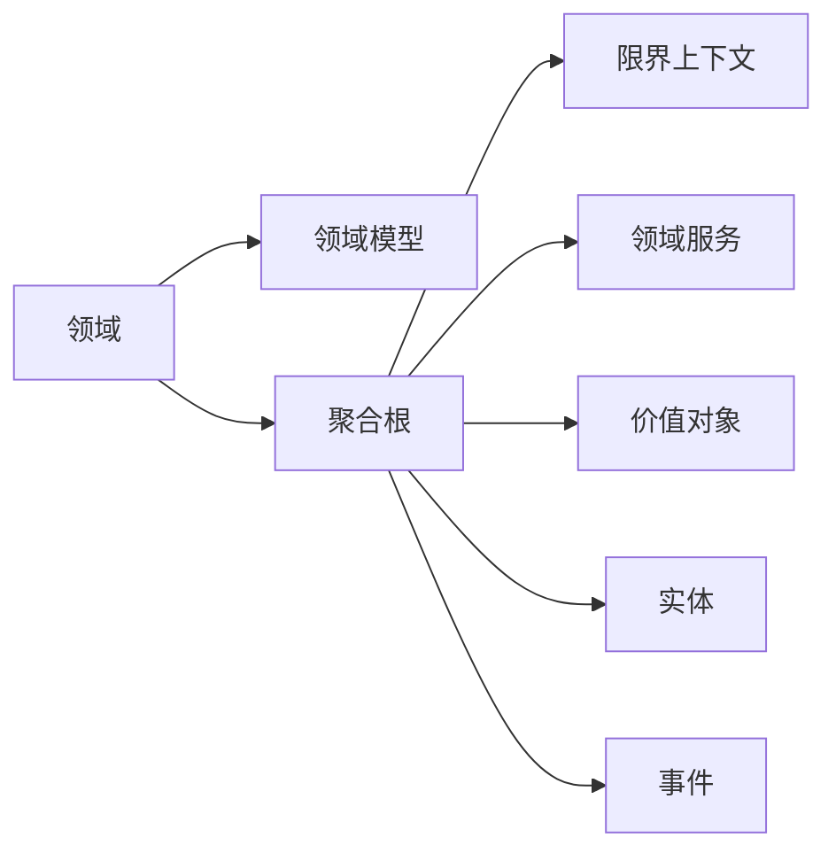

这个流程图展示了领域、领域模型、聚合根、限界上下文、领域服务、价值对象、实体和事件之间的联系：

- 领域是软件设计的出发点。
- 领域模型通过实体和关系描述领域中的概念。
- 聚合根是领域模型中的核心实体，封装内部细节，只暴露必要的接口。
- 限界上下文是聚合根的容器，通常由一个或多个聚合根组成。
- 领域服务跨越聚合根边界，处理跨聚合根间的事务。
- 价值对象是领域中的不可变实体，用于描述领域核心概念。
- 实体是领域中的具体事物。
- 事件是领域中发生的、具有可观测性质的变化。

## 3. 核心算法原理 & 具体操作步骤

### 3.1 算法原理概述

领域驱动设计（DDD）的算法原理主要包括三个步骤：领域建模、领域服务设计和领域服务编排。

#### 3.1.1 领域建模

领域建模是DDD设计方法的核心，通过领域建模，将领域知识转化为软件设计，确保软件设计与领域知识的紧密结合。

#### 3.1.2 领域服务设计

领域服务设计是指在限界上下文中，设计满足业务需求的领域服务，跨越聚合根边界，处理跨聚合根间的事务。

#### 3.1.3 领域服务编排

领域服务编排是指将各个限界上下文中的领域服务组合起来，形成完整的业务流程，确保各服务间协同工作。

### 3.2 算法步骤详解

#### 3.2.1 领域建模步骤

1. **问题领域分析**：明确软件所解决的具体问题，识别领域中的关键概念和关系。
2. **领域模型设计**：将领域知识转化为模型，使用实体、关系和行为描述领域中的概念。
3. **聚合根划分**：确定聚合根及其限界上下文，确保聚合根的一致性和不可变性。
4. **领域服务设计**：在限界上下文中，设计满足业务需求的领域服务。
5. **领域服务编排**：将各个限界上下文中的领域服务组合起来，形成完整的业务流程。

#### 3.2.2 领域服务设计步骤

1. **需求分析**：明确业务需求，确定需要解决的问题。
2. **服务划分**：将业务需求分解为可实现的服务。
3. **服务设计**：使用DDD的设计原则和模式，设计服务接口和实现。
4. **服务编排**：将各个服务组合起来，形成完整的业务流程。

#### 3.2.3 领域服务编排步骤

1. **服务编排设计**：使用编排设计模式，将各个服务组合起来。
2. **编排服务部署**：将编排服务部署到生产环境。
3. **编排服务监控**：实时监控编排服务的运行状态，确保服务稳定可靠。

### 3.3 算法优缺点

#### 3.3.1 优点

1. **紧密结合领域知识**：DDD强调将领域知识转化为软件设计，确保软件设计与领域知识的一致性。
2. **提高开发效率**：通过领域建模和领域服务设计，可以减少开发成本，提高开发效率。
3. **增强软件质量**：通过领域服务编排，确保各服务间协同工作，提高软件质量。

#### 3.3.2 缺点

1. **复杂度高**：DDD的设计复杂度较高，需要系统化地进行领域建模和设计。
2. **学习曲线陡**：DDD涉及大量设计模式和原则，需要一定的学习成本。
3. **维护困难**：DDD的复杂度较高，维护成本也相对较高。

### 3.4 算法应用领域

DDD的设计方法在许多领域中得到了广泛应用，例如：

- **电商领域**：订单管理、用户管理、商品管理等。
- **金融领域**：账户管理、交易管理、风险管理等。
- **医疗领域**：病历管理、诊断管理、药品管理等。
- **交通领域**：交通调度、导航管理、交通监控等。
- **教育领域**：课程管理、学生管理、教务管理等。

## 4. 数学模型和公式 & 详细讲解 & 举例说明

### 4.1 数学模型构建

#### 4.1.1 领域模型设计

领域模型通常使用ER图进行设计，ER图由实体和关系组成。以下是一个简单的ER图示例：

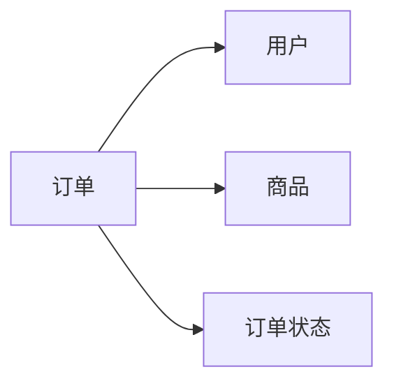

这个ER图展示了订单、用户、商品和订单状态之间的关系。

#### 4.1.2 聚合根划分

聚合根的划分需要根据领域模型进行。以下是一个简单的聚合根划分示例：

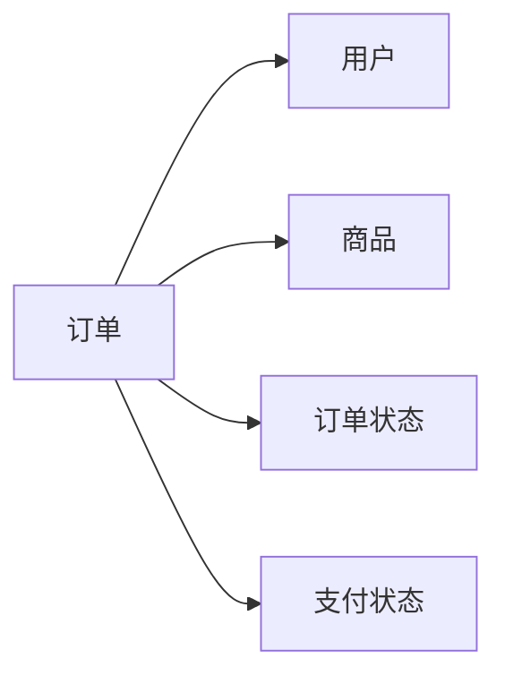

这个聚合根划分展示了订单聚合根及其相关的实体和限界上下文。

#### 4.1.3 领域服务设计

领域服务设计使用DDD的设计原则和模式，通常使用命令模式和事件模式进行设计。以下是一个简单的领域服务设计示例：

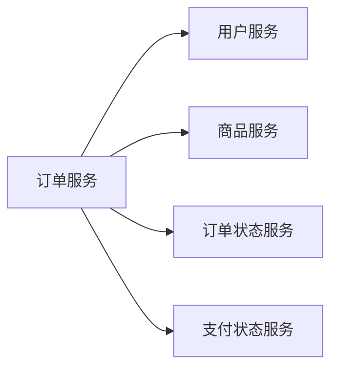

这个领域服务设计展示了订单服务及其相关的服务。

#### 4.1.4 领域服务编排

领域服务编排使用编排设计模式，将各个服务组合起来，形成完整的业务流程。以下是一个简单的领域服务编排示例：


这个领域服务编排展示了各个服务之间的关系。

### 4.2 公式推导过程

#### 4.2.1 领域建模

领域建模通常使用实体关系图（ER图）进行设计，ER图由实体和关系组成。

#### 4.2.2 领域服务设计

领域服务设计使用DDD的设计原则和模式，通常使用命令模式和事件模式进行设计。

#### 4.2.3 领域服务编排

领域服务编排使用编排设计模式，将各个服务组合起来，形成完整的业务流程。

### 4.3 案例分析与讲解

#### 4.3.1 订单管理系统的DDD设计

订单管理系统的领域模型如下图所示：


这个领域模型展示了订单、用户、商品和订单状态之间的关系。

聚合根划分如下图所示：

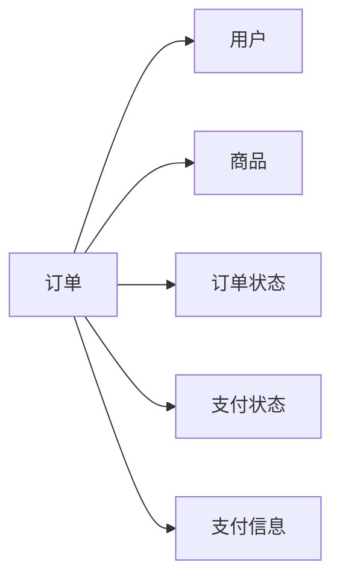

这个聚合根划分展示了订单聚合根及其相关的实体和限界上下文。

领域服务设计如下图所示：

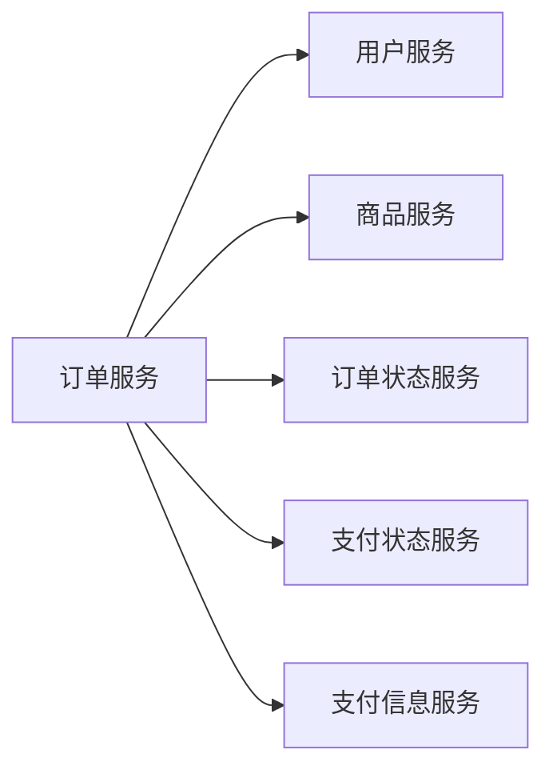

这个领域服务设计展示了订单服务及其相关的服务。

领域服务编排如下图所示：


这个领域服务编排展示了各个服务之间的关系。

## 5. 项目实践：代码实例和详细解释说明

### 5.1 开发环境搭建

在开发DDD项目之前，需要搭建相应的开发环境。以下是一个简单的环境搭建步骤：

1. **安装Java环境**：在系统中安装Java环境和IDE，如IntelliJ IDEA。
2. **安装Spring框架**：使用Maven或Gradle安装Spring框架。
3. **安装MyBatis框架**：使用Maven或Gradle安装MyBatis框架。
4. **安装Spring Data**：使用Maven或Gradle安装Spring Data框架。
5. **安装Docker**：在开发环境中安装Docker容器。

### 5.2 源代码详细实现

以下是一个简单的DDD项目实现示例：

#### 5.2.1 领域模型设计

```java
@Entity
@Table(name = "order")
public class Order {

    @Id
    @GeneratedValue(strategy = GenerationType.IDENTITY)
    private Long id;

    @ManyToOne
    private User user;

    @ManyToOne
    private Product product;

    @Enumerated(EnumType.STRING)
    private OrderStatus orderStatus;

    @ManyToOne
    private PaymentStatus paymentStatus;

    // getters and setters
}
```

这个领域模型展示了订单、用户、商品、订单状态和支付状态之间的关系。

#### 5.2.2 聚合根划分

```java
@Entity
@Table(name = "order")
public class Order {

    @Id
    @GeneratedValue(strategy = GenerationType.IDENTITY)
    private Long id;

    @ManyToOne
    private User user;

    @ManyToOne
    private Product product;

    @Enumerated(EnumType.STRING)
    private OrderStatus orderStatus;

    @ManyToOne
    private PaymentStatus paymentStatus;

    // getters and setters

    public void placeOrder() {
        // place order logic
    }
}
```

这个聚合根划分展示了订单聚合根及其相关的实体和限界上下文。

#### 5.2.3 领域服务设计

```java
@Service
public class OrderService {

    @Autowired
    private OrderRepository orderRepository;

    public Order placeOrder(User user, Product product) {
        Order order = new Order();
        order.setUser(user);
        order.setProduct(product);
        order.setOrderStatus(OrderStatus.PENDING);
        order.setPaymentStatus(PaymentStatus.PENDING);
        orderRepository.save(order);
        return order;
    }
}
```

这个领域服务设计展示了订单服务及其相关的服务。

#### 5.2.4 领域服务编排

```java
@Service
public class OrderService {

    @Autowired
    private OrderRepository orderRepository;

    @Autowired
    private UserService userService;

    @Autowired
    private ProductService productService;

    @Autowired
    private OrderStatusService orderStatusService;

    @Autowired
    private PaymentStatusService paymentStatusService;

    public Order placeOrder(User user, Product product) {
        Order order = new Order();
        order.setUser(user);
        order.setProduct(product);
        order.setOrderStatus(OrderStatus.PENDING);
        order.setPaymentStatus(PaymentStatus.PENDING);
        orderRepository.save(order);
        return order;
    }

    public void payOrder(Long orderId) {
        Order order = orderRepository.findById(orderId);
        order.setPaymentStatus(PaymentStatus.SUCCESS);
        orderStatusService.updateOrderStatus(orderId, OrderStatus.SUCCESS);
    }
}
```

这个领域服务编排展示了各个服务之间的关系。

### 5.3 代码解读与分析

#### 5.3.1 领域模型设计

领域模型使用Spring Data JPA进行设计，使用实体注解定义实体属性和方法。

#### 5.3.2 聚合根划分

聚合根划分使用Spring Data JPA进行设计，使用实体注解定义实体属性和方法。

#### 5.3.3 领域服务设计

领域服务设计使用Spring Boot进行设计，使用Spring MVC进行接口定义。

#### 5.3.4 领域服务编排

领域服务编排使用Spring Boot进行设计，使用Spring MVC进行接口定义。

### 5.4 运行结果展示

在运行DDD项目时，可以通过数据库查看订单、用户、商品、订单状态和支付状态等实体的数据。例如，可以通过JPA进行查询：

```java
Order order = orderRepository.findById(orderId);
```

## 6. 实际应用场景

### 6.1 电商领域

在电商领域，DDD可以用于订单管理、用户管理、商品管理和库存管理等。以下是一个简单的订单管理系统DDD设计示例：

#### 6.1.1 领域模型设计


这个领域模型展示了订单、用户、商品和订单状态之间的关系。

#### 6.1.2 聚合根划分


这个聚合根划分展示了订单聚合根及其相关的实体和限界上下文。

#### 6.1.3 领域服务设计


这个领域服务设计展示了订单服务及其相关的服务。

#### 6.1.4 领域服务编排


这个领域服务编排展示了各个服务之间的关系。

### 6.2 金融领域

在金融领域，DDD可以用于账户管理、交易管理、风险管理和客户管理等。以下是一个简单的金融管理系统DDD设计示例：

#### 6.2.1 领域模型设计

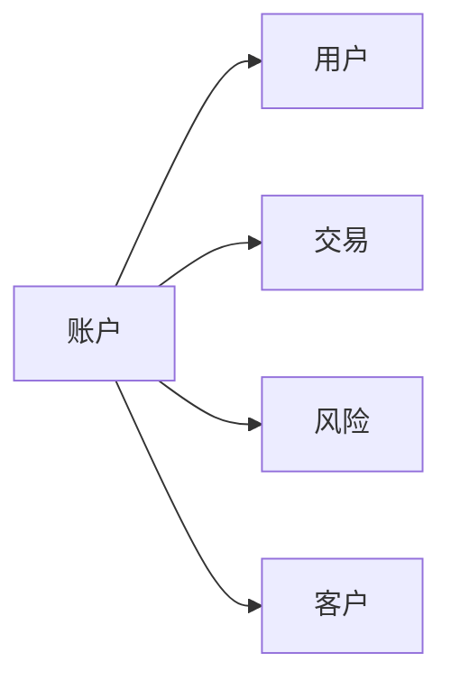

这个领域模型展示了账户、用户、交易和风险之间的关系。

#### 6.2.2 聚合根划分

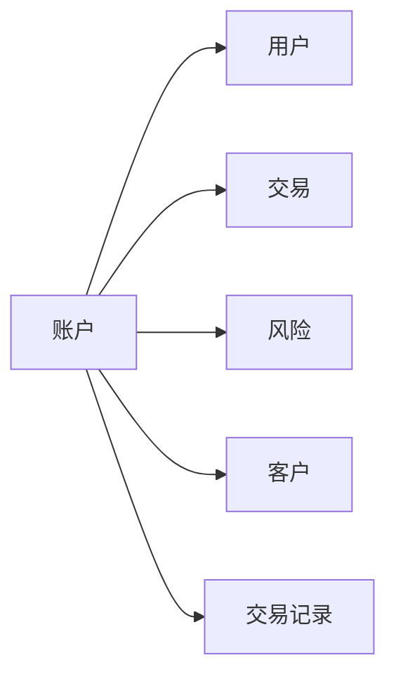

这个聚合根划分展示了账户聚合根及其相关的实体和限界上下文。

#### 6.2.3 领域服务设计

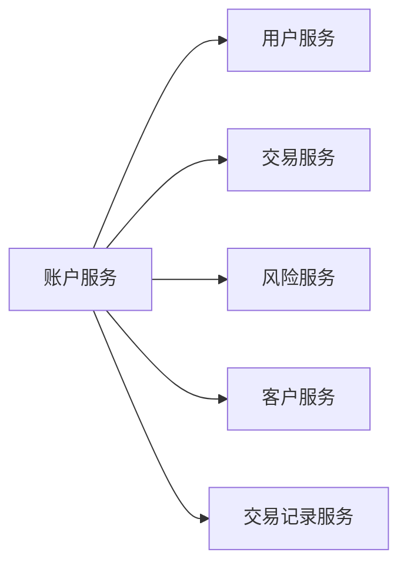

这个领域服务设计展示了账户服务及其相关的服务。

#### 6.2.4 领域服务编排


这个领域服务编排展示了各个服务之间的关系。

### 6.3 医疗领域

在医疗领域，DDD可以用于病历管理、诊断管理和药品管理等。以下是一个简单的医疗管理系统DDD设计示例：

#### 6.3.1 领域模型设计

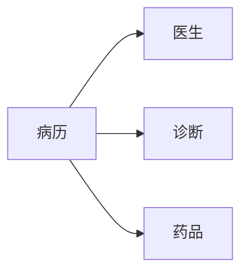

这个领域模型展示了病历、医生、诊断和药品之间的关系。

#### 6.3.2 聚合根划分

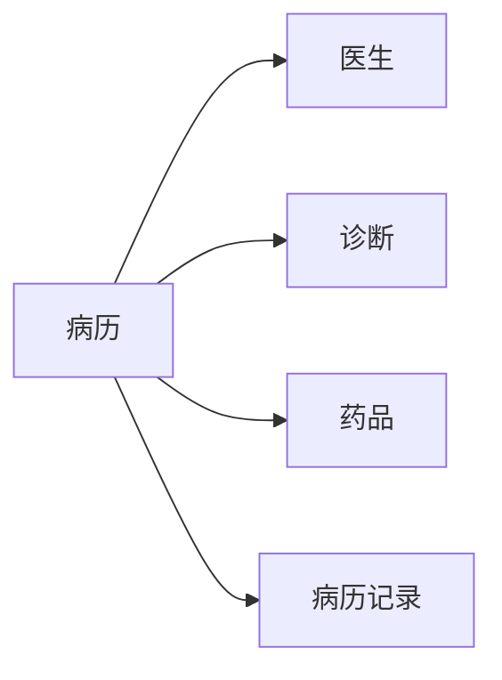

这个聚合根划分展示了病历聚合根及其相关的实体和限界上下文。

#### 6.3.3 领域服务设计

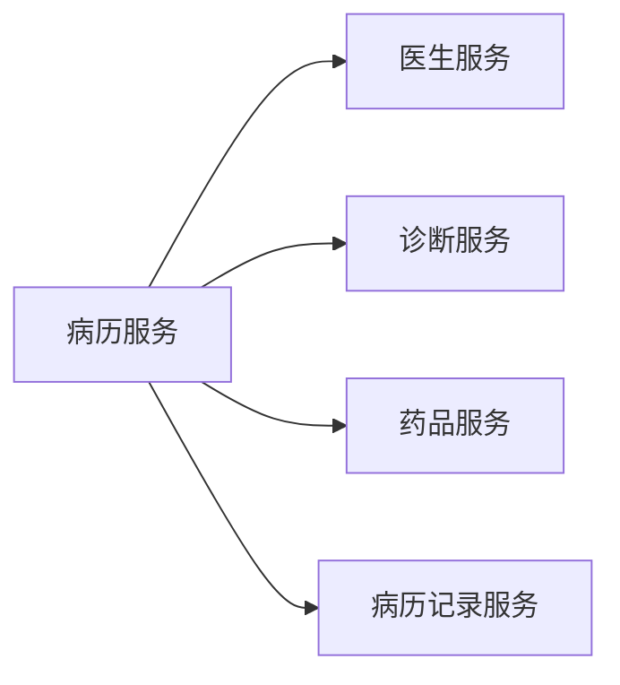

这个领域服务设计展示了病历服务及其相关的服务。

#### 6.3.4 领域服务编排

```mermaid
graph LR
    A[病历服务]
    B[医生服务]
    C[诊断服务]
    D[药品服务]
    E[病历记录服务]
    A --> B
    A --> C
    A --> D
    A --> E
```

这个领域服务编排展示了各个服务之间的关系。

## 7. 工具和资源推荐

### 7.1 学习资源推荐

#### 7.1.1 领域驱动设计（DDD）学习资源

- **《领域驱动设计》**：埃里克·埃文斯著，经典DDD入门书籍。
- **《 Domain-Driven Design: Tackling Complexity in the Heart of Software 》**：Eric Evans著，DDD实践指南。
- **《 Patterns of Domain-Driven Design》**：Martin Fowler著，DDD模式集合。

#### 7.1.2 软件开发方法学习资源

- **《软件开发方法学》**：Ernesto Basualdo著，软件开发方法学入门。
- **《极限编程》**：Kent Beck著，极限编程方法。
- **《重构》**：Martin Fowler著，软件重构技巧。

### 7.2 开发工具推荐

#### 7.2.1 领域建模工具

- **ER图设计工具**：如ERwin、ER/Studio、Visual Paradigm等。
- **UML图设计工具**：如MagicDraw、Visio、UMLet等。

#### 7.2.2 开发框架

- **Spring Boot**：企业级开发框架，支持DDD设计和微服务架构。
- **Spring Data**：数据访问框架，支持DDD设计和JPA实现。
- **MyBatis**：开源持久化框架，支持DDD设计和ORM映射。

#### 7.2.3 测试工具

- **JUnit**：Java单元测试框架，支持DDD设计和TDD实践。
- **TestNG**：Java单元测试框架，支持DDD设计和BDD实践。
- **Cucumber**：行为驱动开发框架，支持DDD设计和BDD实践。

### 7.3 相关论文推荐

#### 7.3.1 DDD相关论文

- **《Domain-Driven Design: Tackling Complexity in the Heart of Software》**：Eric Evans著，DDD实践指南。
- **《Patterns of Domain-Driven Design》**：Martin Fowler著，DDD模式集合。
- **《Designing Evolvable Systems》**：Martin Fowler著，DDD设计原则。

## 8. 总结：未来发展趋势与挑战

### 8.1 研究成果总结

DDD作为一种软件设计方法，已经广泛应用于各个领域。在电商、金融、医疗等领域中，DDD显著提升了软件设计的可维护性和可扩展性，提高了开发效率和软件质量。未来，随着DDD技术的不断发展，将有更多的企业和领域受益于DDD的实践。

### 8.2 未来发展趋势

#### 8.2.1 微服务架构与DDD的结合

微服务架构（Microservices Architecture）是一种轻量级架构风格，将大型系统拆分为多个小型服务，各个服务独立部署、独立维护。DDD与微服务架构的结合，可以进一步提升系统的可维护性和可扩展性。

#### 8.2.2 数据驱动与DDD的结合

数据驱动（Data-Driven）是一种以数据为中心的设计思想，强调数据在软件设计中的核心作用。DDD与数据驱动的结合，可以进一步提升系统的数据治理能力和业务理解能力。

#### 8.2.3 云计算与DDD的结合

云计算（Cloud Computing）是一种基于互联网的计算方式，强调弹性计算和资源共享。DDD与云计算的结合，可以进一步提升系统的弹性计算能力和资源利用率。

### 8.3 面临的挑战

#### 8.3.1 学习成本高

DDD的设计复杂度较高，需要系统化地进行领域建模和设计，对开发人员的要求较高。

#### 8.3.2 维护成本高

DDD的设计复杂度较高，维护成本也相对较高。

#### 8.3.3 数据驱动难度大

DDD的设计过程中，数据驱动的实现难度较大，需要系统化地进行数据治理和业务理解。

### 8.4 研究展望

#### 8.4.1 智能DDD设计

智能DDD设计是一种基于AI技术的设计方法，使用AI算法进行领域建模和设计。未来，随着AI技术的不断发展，智能DDD设计将得到广泛应用。

#### 8.4.2 大数据与DDD的结合

大数据（Big Data）是一种以海量数据为中心的设计思想，强调数据驱动和数据治理。DDD与大数据的结合，可以进一步提升系统的数据治理能力和业务理解能力。

#### 8.4.3 持续交付与DDD的结合

持续交付（Continuous Delivery）是一种以快速交付为中心的设计思想，强调快速交付和持续改进。DDD与持续交付的结合，可以进一步提升系统的快速交付能力和持续改进能力。

## 9. 附录：常见问题与解答

### 9.1 什么是领域驱动设计（DDD）？

**Q1:** 什么是领域驱动设计（DDD）？

**A1:** 领域驱动设计（DDD）是一种软件设计方法，强调将领域知识转化为软件设计，确保软件设计与领域知识的一致性。DDD由埃里克·埃文斯（Eric Evans）提出，包含领域建模、领域服务设计和领域服务编排三个核心步骤。

### 9.2 DDD的核心概念有哪些？

**Q2:** DDD的核心概念有哪些？

**A2:** DDD的核心概念包括领域、领域模型、聚合根、限界上下文、领域服务、价值对象、实体和事件。

### 9.3 DDD的设计原则有哪些？

**Q3:** DDD的设计原则有哪些？

**A3:** DDD的设计原则包括单一职责原则、开闭原则、依赖倒置原则、接口隔离原则、迪米特法则、合成复用原则、里氏替换原则、设计模式等。

### 9.4 如何进行领域建模？

**Q4:** 如何进行领域建模？

**A4:** 领域建模是DDD设计的核心步骤，主要使用实体关系图（ER图）进行设计，包括实体、关系和行为三个方面。

### 9.5 如何设计领域服务？

**Q5:** 如何设计领域服务？

**A5:** 领域服务设计是DDD设计的关键步骤，主要使用DDD的设计原则和模式，包括命令模式和事件模式。

### 9.6 如何

