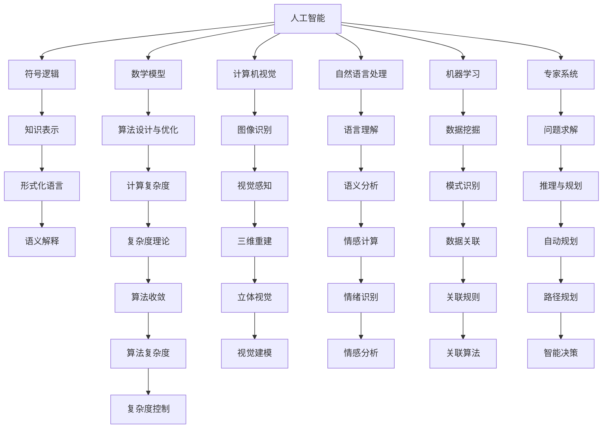

                 

# 达特茅斯会议的历史意义

## 1. 背景介绍

1956年夏天，在美国新罕布什尔州的达特茅斯学院（Dartmouth College），一场历史性的学术会议召开了。这次会议汇集了当时美国和欧洲的人工智能界精英，共同探讨了人工智能的前景和挑战。这次会议被广泛认为是人工智能（Artificial Intelligence, AI）的开端，标志着人工智能作为一个独立的学科领域正式进入学术界。

会议的组织者和主要参与者包括约翰·麦卡锡（John McCarthy）、克劳德·香农（Claude Shannon）、马文·明斯基（Marvin Minsky）、纳撒尼尔·罗切斯特（Nathaniel Rochester）和约瑟夫·魏泽巴哈（Joseph Weizenbaum）等。会议的初衷是通过建立一个协作的学术平台，促进人工智能领域的基础研究，推动人工智能技术的突破性进展。

达特茅斯会议的召开，不仅仅是一场学术聚会，它更为重要的是，定义了人工智能的目标和研究方向，激励了无数研究人员投身于这个新兴领域，奠定了人工智能研究的基础，开启了人工智能的黄金时代。

## 2. 核心概念与联系

### 2.1 核心概念概述

在达特茅斯会议上，人工智能的核心理念被明确提出：“人工智能是一个研究使机器能够模拟人类智能活动的学科”。这个定义奠定了人工智能研究的方向，即如何使机器具备理解、学习、推理、解决问题和自适应等人类智能能力。

会议期间，人工智能的研究范畴被扩展到了多个领域，包括符号逻辑、数学模型、计算机视觉、自然语言处理、机器学习、专家系统等。这些领域的研究不仅为人工智能的发展提供了理论基础，也为后续的算法和技术开发奠定了基础。

### 2.2 核心概念原理和架构的 Mermaid 流程图



这个流程图展示了人工智能研究的不同方向及其内在联系。从符号逻辑和数学模型出发，通过知识表示和算法设计与优化，最终在计算机视觉、自然语言处理、机器学习、专家系统等具体领域实现应用。

### 2.3 核心概念间的联系

达特茅斯会议不仅定义了人工智能的目标和研究方向，还强调了跨学科协作的重要性。会议期间，多个学科领域的专家共同探讨了如何整合不同领域的知识和技术，推动人工智能的进步。例如，符号逻辑和计算机视觉的结合，促进了机器视觉和图像处理的发展；数学模型与自然语言处理的结合，推动了语义理解和自然语言生成技术的发展。

## 3. 核心算法原理 & 具体操作步骤

### 3.1 算法原理概述

在达特茅斯会议上，研究人员提出了多种算法原理，推动了人工智能的发展。其中，最重要的是符号逻辑和数学模型的应用。

符号逻辑算法，利用形式化的语言描述问题，通过逻辑推理和形式化验证来解决问题。这种算法强调了对问题结构的理解和逻辑推理能力，适用于复杂规则和决策问题的解决。

数学模型算法，则通过数学模型来表达问题，利用数学优化和统计方法来解决问题。这种算法强调了对数据和模型的数学分析和处理能力，适用于大规模数据和复杂系统的优化和预测。

### 3.2 算法步骤详解

#### 3.2.1 符号逻辑算法的步骤

1. **问题形式化**：将问题转换为符号逻辑表达式，确定问题的逻辑结构。
2. **知识表示**：将问题中的知识用符号逻辑语言表示出来。
3. **逻辑推理**：使用逻辑推理器求解符号逻辑表达式，得到问题的解。
4. **验证与修正**：对推理结果进行验证和修正，确保推理的正确性。

#### 3.2.2 数学模型算法的步骤

1. **问题建模**：将问题转化为数学模型，选择合适的数学表达形式。
2. **模型求解**：使用数学优化算法或统计方法求解数学模型，得到问题的解。
3. **结果评估**：对求解结果进行评估和验证，确保结果的准确性和可靠性。

### 3.3 算法优缺点

#### 3.3.1 符号逻辑算法的优缺点

**优点**：
- 形式化表达能力强，适合处理复杂规则和决策问题。
- 逻辑推理严密，结果具有高度的可靠性和可验证性。

**缺点**：
- 表达能力有限，难以处理非结构化数据和复杂现实问题。
- 推理效率低，适用于小型问题，难以扩展到大规模数据。

#### 3.3.2 数学模型算法的优缺点

**优点**：
- 表达能力强，适用于大规模数据和复杂系统的优化和预测。
- 算法效率高，可以处理复杂问题。

**缺点**：
- 依赖数据质量，数据偏差可能影响结果。
- 模型复杂度高，难以解释和理解。

### 3.4 算法应用领域

#### 3.4.1 符号逻辑算法的应用

- **专家系统**：利用符号逻辑推理来模拟人类专家的决策过程，应用于医疗诊断、金融分析等领域。
- **知识表示**：将知识表示为符号逻辑表达式，用于知识管理和人工智能推理。
- **逻辑编程**：利用符号逻辑编程语言，开发智能决策和控制系统。

#### 3.4.2 数学模型算法的应用

- **机器学习**：利用数学模型和优化算法，进行数据挖掘、分类、聚类和预测。
- **数据科学**：利用数学模型和统计方法，进行数据分析、数据可视化和数据管理。
- **系统优化**：利用数学模型和优化算法，进行系统设计、控制和优化。

## 4. 数学模型和公式 & 详细讲解 & 举例说明

### 4.1 数学模型构建

在达特茅斯会议上，数学模型被广泛应用于人工智能的各个领域。下面以机器学习为例，介绍数学模型的构建。

机器学习的数学模型通常包括输入变量 $x$、输出变量 $y$ 和模型参数 $\theta$。模型的目标是通过最小化损失函数 $L(y,\hat{y})$，学习到最优的模型参数 $\hat{\theta}$，使得预测值 $\hat{y}$ 与真实值 $y$ 的差异最小化。

### 4.2 公式推导过程

机器学习常用的损失函数包括均方误差（Mean Squared Error, MSE）和交叉熵（Cross-Entropy）。以均方误差为例，其推导过程如下：

设模型预测值为 $\hat{y}$，真实值为 $y$，则均方误差的定义为：

$$
L(y,\hat{y}) = \frac{1}{N}\sum_{i=1}^N(y_i - \hat{y}_i)^2
$$

其中 $N$ 为样本数量，$y_i$ 为第 $i$ 个样本的真实值，$\hat{y}_i$ 为第 $i$ 个样本的预测值。

### 4.3 案例分析与讲解

以线性回归模型为例，介绍数学模型的应用。

线性回归模型的数学模型为：

$$
y = \theta_0 + \theta_1x_1 + \theta_2x_2 + \cdots + \theta_nx_n
$$

其中 $\theta_0$ 为截距，$\theta_1, \theta_2, \cdots, \theta_n$ 为回归系数。模型的目标是通过最小化损失函数，学习到最优的回归系数。

## 5. 项目实践：代码实例和详细解释说明

### 5.1 开发环境搭建

为了进行机器学习的实践，需要搭建一个Python开发环境。以下是一个基本的搭建流程：

1. 安装Python 3.8或更高版本。
2. 安装虚拟环境工具，如Anaconda或virtualenv。
3. 创建虚拟环境，并激活。
4. 安装必要的Python库，如NumPy、Pandas、Scikit-learn、TensorFlow等。

### 5.2 源代码详细实现

以线性回归模型为例，给出Python代码实现：

```python
import numpy as np
from sklearn.linear_model import LinearRegression
from sklearn.metrics import mean_squared_error

# 生成随机数据
X = np.array([[1, 2], [3, 4], [5, 6]])
y = np.array([2, 5, 8])

# 构建线性回归模型
model = LinearRegression()
model.fit(X, y)

# 预测新数据
X_new = np.array([[7, 8]])
y_pred = model.predict(X_new)

# 计算均方误差
mse = mean_squared_error(y, y_pred)
print("均方误差：", mse)
```

### 5.3 代码解读与分析

以上代码实现了线性回归模型的训练和预测。其中，`LinearRegression`类用于构建线性回归模型，`fit`方法用于拟合模型参数，`predict`方法用于预测新数据，`mean_squared_error`函数用于计算均方误差。

## 6. 实际应用场景

### 6.1 机器学习在金融风控中的应用

机器学习在金融领域有着广泛的应用，尤其是在风险控制方面。例如，银行可以利用机器学习模型，根据历史数据预测客户的信用风险，从而进行贷款审批和风险管理。

### 6.2 机器学习在医疗诊断中的应用

在医疗领域，机器学习被用于疾病诊断和预测。例如，医院可以利用机器学习模型，根据患者的历史病历和症状，预测疾病的发生概率，从而制定更好的治疗方案。

### 6.3 机器学习在智能交通中的应用

在智能交通领域，机器学习被用于交通流量预测和智能交通管理。例如，交通管理部门可以利用机器学习模型，根据历史交通数据预测未来的流量情况，从而优化交通信号和路线规划。

## 7. 工具和资源推荐

### 7.1 学习资源推荐

为了帮助读者深入理解机器学习和人工智能，以下推荐一些优质的学习资源：

1. 《Python机器学习》：适合初学者，介绍了机器学习的基本概念和常用算法。
2. 《深度学习》（Ian Goodfellow 著）：全面介绍了深度学习的基本原理和应用。
3. 《机器学习实战》：通过实际案例，介绍了机器学习的实现方法。
4. 《人工智能：一种现代方法》（Russell & Norvig 著）：介绍了人工智能的理论基础和应用。

### 7.2 开发工具推荐

机器学习和人工智能的开发工具有很多，以下是一些常用的工具：

1. Python：广泛使用的编程语言，支持多种机器学习和人工智能库。
2. NumPy：Python的数值计算库，提供了高效的数组操作和数学函数。
3. Pandas：Python的数据处理库，提供了强大的数据操作和分析能力。
4. Scikit-learn：Python的机器学习库，提供了多种常用算法的实现。
5. TensorFlow：Google开发的深度学习框架，支持分布式计算和GPU加速。

### 7.3 相关论文推荐

机器学习和人工智能的研究论文众多，以下是几篇具有代表性的论文：

1. 《神经网络与深度学习》（Michael Nielsen 著）：介绍了神经网络的基本原理和深度学习的应用。
2. 《机器学习》（Tom Mitchell 著）：介绍了机器学习的基本概念和算法。
3. 《深度学习》（Goodfellow 等著）：全面介绍了深度学习的基本原理和应用。

## 8. 总结：未来发展趋势与挑战

### 8.1 研究成果总结

达特茅斯会议标志着人工智能作为一个独立的学科领域的诞生，推动了人工智能技术的快速发展。机器学习、符号逻辑、专家系统等技术，为人工智能的应用和发展奠定了基础。

### 8.2 未来发展趋势

未来的机器学习和人工智能将朝着以下几个方向发展：

1. 深度学习技术将进一步发展，推动更多复杂问题的解决。
2. 多模态数据融合将成为新的研究热点，推动跨领域的智能应用。
3. 人工智能伦理和安全问题将受到越来越多的关注，确保人工智能技术的可靠性和安全性。
4. 自动化机器学习（AutoML）和强化学习（RL）等新兴技术将推动人工智能的应用更加广泛。

### 8.3 面临的挑战

机器学习和人工智能在发展过程中，仍然面临许多挑战：

1. 数据质量问题：数据偏差、缺失和噪声等问题，可能会影响机器学习模型的性能。
2. 算法复杂性：深度学习模型等复杂算法，需要大量的计算资源和时间。
3. 模型解释性：许多机器学习模型的决策过程难以解释，缺乏透明性和可解释性。
4. 伦理和安全问题：人工智能技术可能会带来伦理和安全问题，需要更多的法规和监管。

### 8.4 研究展望

未来的机器学习和人工智能研究将需要在以下几个方面取得突破：

1. 提高算法的可解释性和透明性，确保模型的决策过程可以被理解和解释。
2. 解决数据质量问题，提高数据的完整性和准确性。
3. 优化算法的复杂性和计算资源消耗，推动人工智能技术的广泛应用。
4. 研究人工智能的伦理和安全问题，制定相关法规和标准，确保人工智能技术的可靠性和安全性。

## 9. 附录：常见问题与解答

**Q1：什么是机器学习？**

A: 机器学习是一种通过数据驱动的算法，使计算机系统能够从数据中学习规律，并应用这些规律来解决实际问题。

**Q2：机器学习和人工智能有什么关系？**

A: 机器学习是人工智能的一个子领域，通过算法和模型，使计算机能够自主学习数据中的规律，从而实现智能决策和自主行为。

**Q3：机器学习有哪些常用算法？**

A: 机器学习的常用算法包括线性回归、逻辑回归、决策树、随机森林、支持向量机、神经网络等。

**Q4：什么是深度学习？**

A: 深度学习是机器学习的一个分支，通过多层神经网络，学习到数据中的高层次特征，从而实现更复杂的任务，如图像识别、自然语言处理等。

**Q5：机器学习在实际应用中有哪些挑战？**

A: 机器学习在实际应用中面临数据质量、算法复杂性、模型解释性和伦理安全等问题，需要更多的研究和实践来解决。

作者：禅与计算机程序设计艺术 / Zen and the Art of Computer Programming

