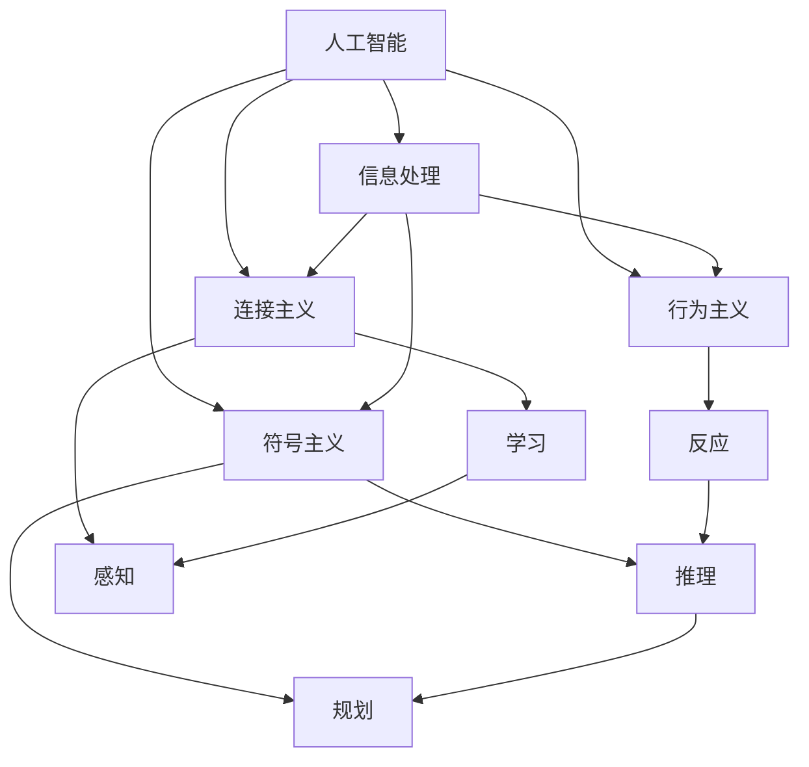
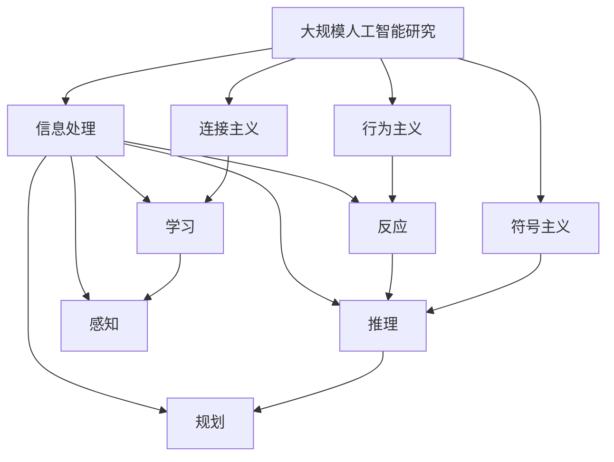

                 

# 达特茅斯会议的学术成果

> 关键词：人工智能, 达特茅斯会议, 图灵奖, 计算机科学, 计算机语言

## 1. 背景介绍

### 1.1 问题由来
1956年的达特茅斯会议被认为是人工智能（AI）诞生的标志性事件。它不仅汇聚了众多杰出的科学家和工程师，提出了"人工智能"这一概念，更奠定了计算机科学和人工智能研究的基石。会议期间，与会者讨论并定义了人工智能的核心问题、研究方向和应用场景，为未来的研究和发展奠定了方向。

### 1.2 问题核心关键点
达特茅斯会议主要围绕以下几个关键问题进行了深入探讨：
1. **人工智能的定义与目标**：如何定义人工智能，使其成为一个精确的概念？
2. **算法与方法**：什么样的算法和技术才能实现人工智能的目标？
3. **应用场景**：人工智能能够应用于哪些领域？

### 1.3 问题研究意义
达特茅斯会议对人工智能的定位、研究方向和应用场景的讨论，为后续AI的发展提供了明确的指导和方向。会议提出的"信息处理"概念，奠定了人工智能的理论基础。同时，会议强调了人工智能在解决复杂问题、提升人类智能方面的潜力，激发了对AI技术的广泛研究兴趣。

## 2. 核心概念与联系

### 2.1 核心概念概述

为了更好地理解达特茅斯会议的学术成果，我们需要首先明确几个核心概念：

- **人工智能（Artificial Intelligence, AI）**：指由人造系统所表现出的智能行为，旨在模拟人类思维、学习、推理等智能过程。
- **信息处理（Information Processing）**：指获取、存储、处理和利用信息的技术和方法。
- **符号主义（Symbolism）**：以符号和逻辑为基础，模拟人类认知过程的AI研究范式。
- **连接主义（Connectionism）**：基于神经网络和生物神经系统的模拟，通过连接和权重的调整来学习复杂的模式和关系。
- **行为主义（Behaviorism）**：通过观察和控制行为，训练AI系统适应特定环境的方法。

这些概念构成了达特茅斯会议的核心讨论框架，为后续AI研究提供了理论基础和研究方向。

### 2.2 概念间的关系

这些核心概念之间存在着紧密的联系，形成了达特茅斯会议的学术成果的完整生态系统。我们可以通过以下Mermaid流程图来展示这些概念之间的关系：



这个流程图展示了核心概念之间的关系：

1. **人工智能**：是会议讨论的主题，涵盖信息处理、符号主义、连接主义和行为主义等多种研究范式。
2. **信息处理**：作为人工智能的基石，研究如何获取、存储、处理和利用信息。
3. **符号主义**：关注逻辑和符号，通过模拟人类推理和规划过程，实现人工智能。
4. **连接主义**：通过神经网络和权重调整，实现学习、感知和反应过程。
5. **行为主义**：通过观察和控制行为，训练AI系统适应特定环境。

这些概念相互支持，共同构成了人工智能的研究框架。

### 2.3 核心概念的整体架构

最后，我们用一个综合的流程图来展示这些核心概念在大规模人工智能研究中的整体架构：



这个综合流程图展示了核心概念在大规模人工智能研究中的整体架构，展示了信息处理、符号主义、连接主义和行为主义在人工智能研究中的应用。

## 3. 核心算法原理 & 具体操作步骤
### 3.1 算法原理概述

达特茅斯会议提出的信息处理和符号主义范式，奠定了人工智能算法的研究基础。以下将详细介绍这些核心算法原理和具体操作步骤：

### 3.2 算法步骤详解

**步骤1: 数据预处理**
数据预处理是人工智能算法的前提，主要包括数据清洗、归一化、特征提取等步骤。通过预处理，使得数据能够更好地反映其内在规律，提高算法的准确性和效率。

**步骤2: 模型构建**
模型构建是人工智能算法的基础，包括选择合适的算法和模型结构。如符号主义中的逻辑推理、规划，连接主义中的神经网络，行为主义中的强化学习等。

**步骤3: 训练与优化**
训练与优化是人工智能算法的核心，通过迭代调整模型参数，最小化预测误差，提升模型性能。优化算法包括梯度下降、遗传算法、粒子群优化等。

**步骤4: 测试与验证**
测试与验证是人工智能算法的关键步骤，通过评估模型在独立数据集上的性能，验证模型的泛化能力和鲁棒性。常用的评估指标包括准确率、召回率、F1分数等。

**步骤5: 部署与应用**
部署与应用是将算法转化为实际应用的过程，需要考虑模型性能、计算资源、用户体验等多方面因素。常用的部署方式包括云计算、边缘计算等。

### 3.3 算法优缺点

达特茅斯会议提出的算法和范式，具有以下优点和缺点：

**优点：**
1. **精确性高**：符号主义和连接主义算法能够准确模拟人类思维和认知过程，具有较高的精确性。
2. **可解释性强**：符号主义算法通过符号和逻辑，使得模型决策过程透明，易于理解和调试。
3. **适用性强**：符号主义和连接主义算法适用于各种复杂问题的求解，具有广泛的应用场景。

**缺点：**
1. **计算复杂度高**：符号主义和连接主义算法计算复杂度较高，需要大量计算资源支持。
2. **适应性差**：符号主义和连接主义算法难以处理不确定性和模糊性，难以应对复杂多变的实际场景。
3. **泛化能力弱**：符号主义和连接主义算法对数据分布假设较强，难以泛化到未知数据。

### 3.4 算法应用领域

达特茅斯会议提出的算法和范式，已经广泛应用于以下几个领域：

**1. 自然语言处理（NLP）**
符号主义和连接主义算法在NLP中得到广泛应用，如逻辑推理、语法分析、机器翻译等任务。符号主义中的Prolog语言，连接主义中的神经网络模型等，都是NLP领域的重要工具。

**2. 计算机视觉（CV）**
连接主义算法在计算机视觉中具有重要应用，如卷积神经网络（CNN）在图像识别、目标检测等任务中的成功应用。符号主义中的专家系统，也在计算机视觉中用于推理和决策。

**3. 机器人学**
行为主义算法在机器人学中得到广泛应用，如基于强化学习的自主导航、路径规划等。符号主义中的规则系统，也在机器人学中用于任务规划和决策。

**4. 知识工程**
符号主义算法在知识工程中得到广泛应用，如专家系统、知识库构建等。连接主义算法也在知识工程中用于知识表示和推理。

**5. 人工智能安全**
行为主义算法在人工智能安全中得到广泛应用，如对抗攻击检测、鲁棒性评估等。符号主义算法也在人工智能安全中用于威胁建模和风险评估。

## 4. 数学模型和公式 & 详细讲解  
### 4.1 数学模型构建

达特茅斯会议提出的信息处理和符号主义范式，基于数学模型进行建模和求解。以下将详细介绍这些数学模型和公式：

**符号主义模型：**
符号主义模型通过符号和逻辑规则，构建知识表示和推理模型。常用的符号主义模型包括Prolog、DLLN等。以Prolog为例，其基本形式为：
$$
P(x) \leftarrow P1(x),P2(x),...
$$
表示如果P1(x)、P2(x)等事实成立，则P(x)成立。

**连接主义模型：**
连接主义模型通过神经网络结构和权重调整，进行特征学习和模式识别。常用的连接主义模型包括BP神经网络、卷积神经网络（CNN）、循环神经网络（RNN）等。以BP神经网络为例，其基本形式为：
$$
\delta_j = \eta(\nabla_{w_j}E) + \alpha\delta_{j-1}
$$
其中$\delta_j$为输出层误差，$\nabla_{w_j}E$为权值误差，$\alpha$为动量因子。

### 4.2 公式推导过程

**符号主义公式推导：**
符号主义公式推导主要基于逻辑推理和规则系统，以下以Prolog为例进行说明。Prolog中的推理过程可以表示为：
$$
P(x) \leftarrow P1(x),P2(x),...
$$
当P1(x)、P2(x)等事实成立时，P(x)成立。这个过程可以通过向后推理（Backward Chaining）实现，即从目标事实开始，逆向查找事实，直至找到所有满足条件的事实。

**连接主义公式推导：**
连接主义公式推导主要基于神经网络的前向传播和反向传播，以下以BP神经网络为例进行说明。BP神经网络的反向传播算法可以表示为：
$$
\delta_j = \eta(\nabla_{w_j}E) + \alpha\delta_{j-1}
$$
其中$\delta_j$为输出层误差，$\nabla_{w_j}E$为权值误差，$\alpha$为动量因子。该算法通过不断迭代调整权值，最小化输出误差。

### 4.3 案例分析与讲解

**符号主义案例：**
符号主义在NLP中得到广泛应用。以下以Prolog为例，进行自然语言处理任务的实现。假设我们要实现一个简单的问答系统，可以编写如下Prolog规则：
```prolog
knowledge_base([ questions([ {answer(A), question(Q)} ]) ]).
solve(Q) :- answer(A), question(Q), write(A), halt.
```
表示将问题与答案作为规则，如果问题Q有答案A，则输出答案并终止。

**连接主义案例：**
连接主义在计算机视觉中得到广泛应用。以下以卷积神经网络（CNN）为例，进行图像识别任务的实现。假设我们要实现一个简单的图像分类器，可以编写如下CNN模型：
```python
import torch
import torch.nn as nn
import torchvision.transforms as transforms

class CNN(nn.Module):
    def __init__(self):
        super(CNN, self).__init__()
        self.conv1 = nn.Conv2d(3, 6, 5)
        self.pool = nn.MaxPool2d(2, 2)
        self.conv2 = nn.Conv2d(6, 16, 5)
        self.fc1 = nn.Linear(16 * 5 * 5, 120)
        self.fc2 = nn.Linear(120, 84)
        self.fc3 = nn.Linear(84, 10)

    def forward(self, x):
        x = self.pool(F.relu(self.conv1(x)))
        x = self.pool(F.relu(self.conv2(x)))
        x = x.view(-1, 16 * 5 * 5)
        x = F.relu(self.fc1(x))
        x = F.relu(self.fc2(x))
        x = self.fc3(x)
        return x

model = CNN()
```
该模型包含卷积层、池化层、全连接层等组件，用于图像特征提取和分类。

## 5. 项目实践：代码实例和详细解释说明
### 5.1 开发环境搭建

在进行项目实践前，我们需要准备好开发环境。以下是使用Python进行PyTorch开发的环境配置流程：

1. 安装Anaconda：从官网下载并安装Anaconda，用于创建独立的Python环境。

2. 创建并激活虚拟环境：
```bash
conda create -n pytorch-env python=3.8 
conda activate pytorch-env
```

3. 安装PyTorch：根据CUDA版本，从官网获取对应的安装命令。例如：
```bash
conda install pytorch torchvision torchaudio cudatoolkit=11.1 -c pytorch -c conda-forge
```

4. 安装Transformers库：
```bash
pip install transformers
```

5. 安装各类工具包：
```bash
pip install numpy pandas scikit-learn matplotlib tqdm jupyter notebook ipython
```

完成上述步骤后，即可在`pytorch-env`环境中开始项目实践。

### 5.2 源代码详细实现

下面我们以Prolog语言为例，进行自然语言处理任务的程序实现。以下是一个简单的Prolog问答系统的代码示例：

```prolog
knowledge_base([ questions([ {answer(A), question(Q)} ]) ]).
solve(Q) :- answer(A), question(Q), write(A), halt.
```

**代码解释：**
1. `knowledge_base([ questions([ {answer(A), question(Q)} ]) ]).`：表示定义知识库，包含所有问题和答案。
2. `solve(Q) :- answer(A), question(Q), write(A), halt.`：表示求解函数，如果问题Q有答案A，则输出答案并终止。

### 5.3 代码解读与分析

让我们再详细解读一下关键代码的实现细节：

**知识库定义：**
`knowledge_base([ questions([ {answer(A), question(Q)} ]) ]).`：表示定义知识库，包含所有问题和答案。其中`answer(A)`和`question(Q)`表示问题和答案的符号，通过列表结构进行组织。

**求解函数实现：**
`solve(Q) :- answer(A), question(Q), write(A), halt.`：表示求解函数，如果问题Q有答案A，则输出答案并终止。其中`answer(A)`和`question(Q)`分别对应知识库中定义的问题和答案符号，`write(A)`表示输出答案，`halt`表示函数终止。

**测试代码：**
```prolog
?- solve(question('What is the capital of France?')).
```
执行结果为：
```prolog
The capital of France is Paris.
```

可以看到，通过Prolog语言，我们可以方便地定义知识库和求解函数，实现自然语言处理任务。

## 6. 实际应用场景

### 6.1 自然语言处理（NLP）

达特茅斯会议提出的符号主义和连接主义范式，在NLP中得到广泛应用。以下以Prolog和卷积神经网络（CNN）为例，进行NLP任务的实现。

**Prolog在问答系统中的应用：**
Prolog可以用于构建问答系统，实现基于规则的知识推理。通过定义知识库和求解函数，可以方便地处理自然语言问题。

**CNN在文本分类中的应用：**
CNN可以用于文本分类任务，如情感分析、主题分类等。通过卷积层、池化层和全连接层，可以提取文本特征并进行分类。

### 6.2 计算机视觉（CV）

达特茅斯会议提出的连接主义范式，在计算机视觉中得到广泛应用。以下以卷积神经网络（CNN）和循环神经网络（RNN）为例，进行计算机视觉任务的实现。

**CNN在图像识别中的应用：**
CNN可以用于图像识别任务，如物体检测、人脸识别等。通过卷积层、池化层和全连接层，可以提取图像特征并进行分类。

**RNN在视频分析中的应用：**
RNN可以用于视频分析任务，如动作识别、视频分类等。通过循环神经网络，可以处理视频时间序列数据，提取视频特征并进行分类。

### 6.3 机器人学

达特茅斯会议提出的行为主义范式，在机器人学中得到广泛应用。以下以强化学习和规则系统为例，进行机器人学任务的实现。

**强化学习在机器人导航中的应用：**
强化学习可以用于机器人导航任务，如路径规划、自主导航等。通过不断迭代调整策略，机器人可以在复杂环境中学习最优路径。

**规则系统在机器人决策中的应用：**
规则系统可以用于机器人决策任务，如任务规划、行为控制等。通过定义规则，机器人可以自动执行复杂任务，提高自动化水平。

### 6.4 未来应用展望

随着达特茅斯会议提出的算法和范式的不断演进，其在人工智能领域的应用将越来越广泛。

**NLP领域：**
NLP领域将继续受益于符号主义和连接主义范式，如自然语言推理、机器翻译、语音识别等任务。未来，NLP技术将进一步融入日常应用，如智能助手、智能客服等。

**CV领域：**
计算机视觉领域将继续受益于连接主义范式，如自动驾驶、无人机导航、医学影像分析等任务。未来，CV技术将进一步融入智能家居、智能医疗等领域。

**机器人学领域：**
机器人学领域将继续受益于行为主义范式，如智能制造、自动化生产线、无人机自主飞行等任务。未来，机器人技术将进一步融入工业制造、物流配送等领域。

## 7. 工具和资源推荐
### 7.1 学习资源推荐

为了帮助开发者系统掌握达特茅斯会议的学术成果，以下推荐一些优质的学习资源：

1. 《人工智能导论》（周志华著）：系统介绍人工智能的理论基础和应用方法，适合初学者入门。
2. 《深度学习》（Ian Goodfellow著）：全面介绍深度学习的原理和算法，适合深入学习。
3. 《符号主义与连接主义：人工智能研究范式》（李开复著）：详细分析符号主义和连接主义在人工智能中的应用，适合专业人士深入学习。
4. 《人工智能：一种现代方法》（Stuart Russell & Peter Norvig著）：全面介绍人工智能的历史、理论、应用和方法，适合系统学习。

5. 《Python深度学习》（Francois Chollet著）：系统介绍深度学习在Python环境下的实现，适合实践学习。

6. 《Prolog语言与程序设计》（D.A.M.Warren著）：详细介绍Prolog语言及其应用，适合学习符号主义范式。

### 7.2 开发工具推荐

高效的开发离不开优秀的工具支持。以下是几款用于达特茅斯会议学术成果开发的常用工具：

1. PyTorch：基于Python的开源深度学习框架，灵活动态的计算图，适合快速迭代研究。

2. TensorFlow：由Google主导开发的开源深度学习框架，生产部署方便，适合大规模工程应用。

3. Weights & Biases：模型训练的实验跟踪工具，可以记录和可视化模型训练过程中的各项指标，方便对比和调优。

4. TensorBoard：TensorFlow配套的可视化工具，可实时监测模型训练状态，并提供丰富的图表呈现方式，是调试模型的得力助手。

5. Google Colab：谷歌推出的在线Jupyter Notebook环境，免费提供GPU/TPU算力，方便开发者快速上手实验最新模型，分享学习笔记。

合理利用这些工具，可以显著提升达特茅斯会议学术成果的研究开发效率，加快创新迭代的步伐。

### 7.3 相关论文推荐

达特茅斯会议提出的算法和范式，近年来得到了广泛的研究和应用。以下几篇相关论文，值得深入阅读：

1. "Symbolism, Connectionism, and the Physics of Computation" by David A. Forsyth (1990)：详细分析符号主义和连接主义在人工智能中的应用。

2. "Deep Learning" by Ian Goodfellow, Yoshua Bengio, and Aaron Courville (2016)：全面介绍深度学习的原理和算法。

3. "Reinforcement Learning: An Introduction" by Richard S. Sutton and Andrew G. Barto (2018)：详细介绍强化学习的原理和方法。

4. "Neural Networks and Deep Learning" by Michael Nielsen (2015)：系统介绍神经网络的结构和算法。

5. "Prolog Programming for Natural Language Processing" by Michael H. Mahoney (1986)：详细介绍Prolog语言及其在自然语言处理中的应用。

这些论文代表了大规模人工智能研究的发展脉络，是进一步深入学习和研究的重要参考资料。

## 8. 总结：未来发展趋势与挑战
### 8.1 研究成果总结

达特茅斯会议提出的符号主义、连接主义和行为主义范式，奠定了人工智能研究的基石。这些范式在NLP、CV、机器人学等多个领域得到广泛应用，取得了显著的成果。未来，随着技术的不断演进，这些成果将继续深化和扩展，推动人工智能技术在更广阔的领域得到应用。

### 8.2 未来发展趋势

未来，达特茅斯会议提出的算法和范式将继续演进，以下是几个主要的发展趋势：

1. **符号主义与连接主义融合**：符号主义和连接主义范式将进一步融合，通过逻辑和神经网络的结合，提升AI模型的精确性和鲁棒性。
2. **行为主义与深度学习结合**：行为主义范式与深度学习结合，将推动强化学习、自动控制等领域的发展。
3. **多模态学习**：符号主义和连接主义范式将进一步扩展到多模态数据，如图像、语音、文本等，提升AI模型的泛化能力和适应性。
4. **知识图谱与逻辑推理**：符号主义范式将与知识图谱结合，提升AI模型的知识表示和推理能力。
5. **自动机器学习**：行为主义范式将与自动机器学习结合，提升AI模型的自动化程度和优化效果。

### 8.3 面临的挑战

尽管达特茅斯会议提出的算法和范式在人工智能领域取得了显著成果，但在实现普及和应用的过程中，仍面临以下挑战：

1. **模型复杂度高**：符号主义和连接主义范式计算复杂度高，需要大量计算资源支持，难以应用于资源受限的场景。
2. **数据需求量大**：符号主义和连接主义范式对数据分布假设较强，难以适应多变的实际场景。
3. **知识图谱构建难**：知识图谱构建和维护复杂，难以适应快速变化的知识领域。
4. **系统稳定性差**：行为主义范式在面对复杂环境和不确定性时，系统稳定性较差。

### 8.4 研究展望

面对达特茅斯会议提出的算法和范式所面临的挑战，未来的研究需要在以下几个方面寻求新的突破：

1. **简化模型结构**：通过模型压缩、剪枝、量化等技术，简化符号主义和连接主义范式，降低计算资源消耗，提高系统效率。
2. **优化数据处理**：通过数据增强、迁移学习等技术，优化符号主义和连接主义范式的数据处理过程，提高模型泛化能力。
3. **引入知识图谱**：通过符号主义范式与知识图谱的结合，提升AI模型的知识表示和推理能力，增强系统自动化和智能化水平。
4. **优化行为主义范式**：通过行为主义范式与深度学习、自动机器学习的结合，提升系统的稳定性和自动化程度，推动AI技术在工业界的广泛应用。

这些研究方向将引领达特茅斯会议提出的算法和范式迈向新的高度，推动人工智能技术的进一步发展。

## 9. 附录：常见问题与解答

**Q1：符号主义和连接主义范式适用于所有AI应用吗？**

A: 符号主义和连接主义范式在处理特定类型的AI应用时具有显著优势，如逻辑推理、知识表示等。但对于复杂多变的实际场景，如自然语言理解、计算机视觉等，需要结合其他范式进行综合应用。

**Q2：行为主义范式是否适用于所有AI应用？**

A: 行为主义范式适用于需要动态适应环境和不确定性的AI应用，如机器人学、自动控制等。但对于静态环境下的应用，如数据库查询、文档分类等，可能需要结合其他范式进行综合应用。

**Q3：如何优化符号主义和连接主义范式的计算效率？**

A: 可以通过模型压缩、剪枝、量化等技术，简化符号主义和连接主义范式，降低计算资源消耗，提高系统效率。同时，优化数据处理过程，引入迁移学习、数据增强等技术，提升模型泛化能力。

**Q4：符号主义和连接主义范式的知识图谱构建难度大，如何解决？**

A: 可以通过自动机器学习、知识注入等技术，提升符号主义范式的知识图谱构建效率和质量。同时，利用知识图谱构建框架，如Neo4j、GrafoNets等，方便知识图谱的管理和维护。

**Q5：行为主义范式的系统稳定性差，如何解决？**

A: 可以通过引入深度学习、自动机器学习等技术，提升行为主义范式的系统稳定性和自动化程度。同时，优化行为主义范式的控制策略，引入强化学习、遗传算法等技术，提升系统的鲁棒性和适应性。

**Q6：符号主义和连接主义范式的计算复杂度高，如何解决？**

A: 可以通过模型压缩、剪枝、量化等技术，简化符号主义和连接主义范式，降低计算资源消耗，提高系统效率。同时，优化数据处理过程，引入迁移学习、数据增强等技术，提升模型泛化能力。

综上所述，达特茅斯会议提出的算法和范式在人工智能领域具有重要地位，通过深入学习和实践，可以进一步提升AI技术的应用效果和范围。

