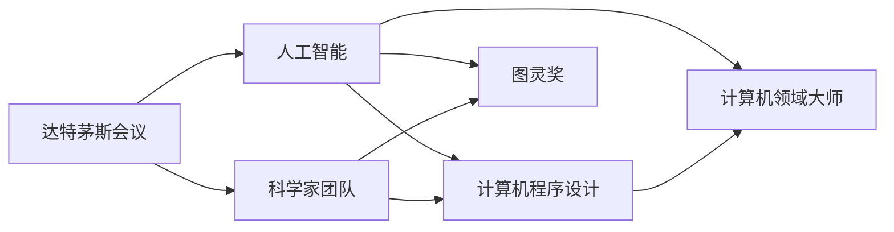

                 

# 达特茅斯会议的科学家团队

> 关键词：达特茅斯会议，人工智能，科学家团队，计算机科学，计算机程序设计，图灵奖，计算机领域大师

## 1. 背景介绍

### 1.1 问题由来
1956年，在美国新罕布什尔州达特茅斯学院举行的达特茅斯会议（Dartmouth Conference）被广泛认为是人工智能（Artificial Intelligence, AI）的开端。在这次会议上，约翰·麦卡锡、克劳德·香农、马文·明斯基等众多科学家共同提出了一系列关于计算机如何模拟人类智能的问题，从而拉开了AI研究的序幕。

### 1.2 问题核心关键点
达特茅斯会议不仅是AI领域的一个重要里程碑，更是一个跨学科团队合作的典范。会上提出的许多问题和方法，如逻辑推理、问题求解、感知机等，对后世的AI研究产生了深远的影响。这次会议的成功离不开会议组织者及与会科学家的共同努力，他们不仅为AI研究奠定了基础，更塑造了一个高效合作的科学家团队。

### 1.3 问题研究意义
研究达特茅斯会议的科学家团队，不仅有助于我们理解AI的起源和发展，更重要的是能够从中汲取经验，促进现代AI研究的科学合作和创新。了解科学家们在会议上的合作方式、讨论内容和研究进展，可以为当前的AI研究提供宝贵的参考。

## 2. 核心概念与联系

### 2.1 核心概念概述

为更好地理解达特茅斯会议的科学家团队及其贡献，本节将介绍几个密切相关的核心概念：

- 达特茅斯会议：1956年在达特茅斯学院召开的一次重要会议，标志着人工智能领域的诞生。
- 人工智能：通过计算机系统模拟人类智能过程的技术。
- 科学家团队：在达特茅斯会议上，一群共同致力于研究AI问题的科学家组成。
- 计算机程序设计：设计、编写、调试和优化计算机程序的过程。
- 图灵奖：计算机科学领域最高荣誉，授予在计算机科学领域做出杰出贡献的个人。
- 计算机领域大师：在计算机科学领域有重大创新和贡献的专家学者。

这些核心概念之间存在着紧密的联系，形成了达特茅斯会议的历史背景和科学内涵。通过理解这些概念，我们可以更好地把握达特茅斯会议的科学精神和创新成果。

### 2.2 概念间的关系

这些核心概念之间的逻辑关系可以通过以下Mermaid流程图来展示：



这个流程图展示了达特茅斯会议与人工智能、科学家团队、计算机程序设计、图灵奖、计算机领域大师等核心概念之间的关系：

1. 达特茅斯会议通过提出和讨论AI相关问题，奠定了人工智能领域的基础。
2. 科学家团队是会议的主要参与者，共同推动了AI研究的发展。
3. 计算机程序设计是AI研究的重要技术手段，是科学家团队的重要工作内容。
4. 图灵奖和计算机领域大师是对AI研究中杰出贡献的表彰和认可。

这些概念共同构成了达特茅斯会议及其重要性的完整框架，使我们能够更全面地理解这次历史性会议的科学价值。

## 3. 核心算法原理 & 具体操作步骤
### 3.1 算法原理概述

达特茅斯会议的科学家团队，主要是围绕着如何让计算机模仿人类智能这一核心问题展开研究和讨论。会议提出了许多重要的概念和方法，其中逻辑推理、问题求解和感知机等算法是会议的主要成果。

逻辑推理是指通过符号逻辑和规则，让计算机能够进行形式化的推理和证明。问题求解则是指通过搜索、回溯、启发式等方法，解决特定问题的过程。感知机是一种早期的神经网络模型，用于处理输入数据并输出预测结果。

这些算法通过符号逻辑和数学公式的形式，为计算机模拟人类智能提供了理论基础和实现路径。

### 3.2 算法步骤详解

达特茅斯会议的科学家团队在研究中遵循了以下基本步骤：

1. **问题定义**：明确要解决的问题，如自动定理证明、游戏求解等。
2. **符号表示**：将问题转换为计算机能够理解和处理的符号表示。
3. **算法设计**：设计算法或模型，如逻辑推理器、搜索算法等。
4. **实现和调试**：将算法或模型实现为程序，并进行调试和优化。
5. **实验验证**：通过实验和测试，验证算法或模型的有效性。

这些步骤不仅适用于当时的会议研究，也是现代AI研究的重要方法论。

### 3.3 算法优缺点

达特茅斯会议的科学家团队提出的算法，具有以下优点和缺点：

**优点**：
1. 系统性：通过定义问题、符号表示、算法设计和实现调试等步骤，形成了一套完整的研究框架。
2. 普适性：提出的方法适用于多种AI问题，如定理证明、游戏求解等。
3. 理论基础：逻辑推理和感知机等算法，为AI研究提供了坚实的数学和逻辑基础。

**缺点**：
1. 复杂性：实现和调试算法需要较高的技术门槛，难以大规模应用。
2. 计算开销：算法往往需要大量计算资源，对当时计算机硬件要求较高。
3. 应用局限：早期算法大多针对特定问题，难以应对更复杂的现实场景。

尽管存在这些局限，达特茅斯会议的算法和思想仍然为AI研究奠定了坚实的基础，推动了后续AI技术的不断进步。

### 3.4 算法应用领域

达特茅斯会议的科学家团队提出的算法和思想，广泛应用于多个领域，包括：

- 人工智能：如自动定理证明、游戏求解等。
- 计算机科学：如算法设计、数据结构等。
- 计算机工程：如软件工程、系统设计等。
- 数学和逻辑学：如数理逻辑、集合论等。

这些领域的跨学科研究，使AI技术在多个领域得到了广泛应用，推动了科技和社会的进步。

## 4. 数学模型和公式 & 详细讲解 & 举例说明

### 4.1 数学模型构建

在达特茅斯会议的研究中，科学家们提出了许多数学模型和公式。下面以逻辑推理和感知机为例，介绍这些模型的构建过程。

**逻辑推理模型**：
逻辑推理是计算机模拟人类智能的重要手段之一，其主要模型为逻辑推理器。逻辑推理器通过符号逻辑和规则，模拟人类推理过程。

逻辑推理模型的数学模型构建如下：
1. 定义符号：将问题中的概念和命题用符号表示，如P、Q、R等。
2. 构建规则：将推理规则用符号逻辑表达，如“如果P，则Q”。
3. 推理计算：通过符号计算引擎，根据规则和初始条件，求解问题的解。

**感知机模型**：
感知机是早期神经网络模型的代表，主要用于处理输入数据并输出预测结果。

感知机的数学模型构建如下：
1. 定义输入向量：将输入数据表示为向量形式，如$x=(x_1, x_2, ..., x_n)$。
2. 定义权重向量：将模型的权重表示为向量形式，如$w=(w_1, w_2, ..., w_n)$。
3. 定义激活函数：将感知机的输出结果通过激活函数映射，如$g(w \cdot x + b)$。
4. 训练模型：通过大量样本数据，优化模型的权重向量，使其能够正确预测新的数据。

### 4.2 公式推导过程

以下我们以逻辑推理模型为例，推导其基本公式。

假设逻辑推理器需要求解问题“如果P，则Q；如果R，则Q；如果P且R，则Q；如果非Q，则非R”，其符号表示为：
- P：该问题包含P
- Q：该问题包含Q
- R：该问题包含R

推理过程如下：

1. 初始条件：
   - P：该问题包含P
   - R：该问题包含R

2. 第一步推理：
   - 根据规则1：如果P，则Q
   - 结论：该问题包含Q

3. 第二步推理：
   - 根据规则2：如果R，则Q
   - 结论：该问题包含Q

4. 第三步推理：
   - 根据规则3：如果P且R，则Q
   - 结论：该问题包含Q

5. 第四步推理：
   - 根据规则4：如果非Q，则非R
   - 结论：该问题不包含R

逻辑推理模型的公式推导如下：
$$
\begin{aligned}
& (P \rightarrow Q) \land (R \rightarrow Q) \land (P \land R \rightarrow Q) \land (\neg Q \rightarrow \neg R) \\
\Rightarrow & (P \land R \rightarrow Q) \land (\neg Q \rightarrow \neg R) \\
\Rightarrow & (\neg Q \rightarrow \neg R) \\
\Rightarrow & \neg R
\end{aligned}
$$

### 4.3 案例分析与讲解

我们以逻辑推理模型的典型应用——自动定理证明为例，进行详细分析。

自动定理证明是指通过算法自动证明数学定理的过程。在达特茅斯会议中，科学家们通过逻辑推理模型，实现了对布尔代数和数理逻辑定理的自动证明。

自动定理证明的实现步骤如下：
1. 定义符号：将定理中的符号表示为布尔变量，如$A, B, C$。
2. 构建规则：将定理和定理规则用逻辑表达式表示，如$A \land B \rightarrow C$。
3. 推理计算：通过逻辑推理引擎，根据规则和初始条件，求解定理的证明。

例如，要证明“$A \land (B \lor C) \rightarrow (A \lor B) \lor C$”，可以按照以下步骤进行：
1. 定义符号：$A, B, C$
2. 构建规则：$(A \land (B \lor C)) \rightarrow ((A \lor B) \lor C)$
3. 推理计算：根据规则和初始条件，证明定理成立。

## 5. 项目实践：代码实例和详细解释说明

### 5.1 开发环境搭建

在研究达特茅斯会议的科学家团队时，我们需要搭建相应的开发环境，以便于进行算法实现和验证。以下是搭建环境的详细步骤：

1. 安装Python：
   - 从官网下载并安装Python，建议选择最新版本。
   - 配置环境变量，确保Python能够正确运行。

2. 安装NumPy：
   - 在命令行中输入`pip install numpy`，安装NumPy库。

3. 安装PIL（Python Imaging Library）：
   - 在命令行中输入`pip install pillow`，安装PIL库，用于图像处理。

4. 安装SciPy：
   - 在命令行中输入`pip install scipy`，安装SciPy库，用于科学计算。

5. 安装Matplotlib：
   - 在命令行中输入`pip install matplotlib`，安装Matplotlib库，用于数据可视化。

6. 安装Sympy：
   - 在命令行中输入`pip install sympy`，安装Sympy库，用于符号计算。

完成上述步骤后，即可在Python环境中进行算法实现和验证。

### 5.2 源代码详细实现

下面以逻辑推理模型为例，给出Python代码实现：

```python
from sympy import symbols, Eq, solve

# 定义符号
A, B, C = symbols('A B C')

# 定义方程
eq1 = Eq(A, True)
eq2 = Eq(B, True)
eq3 = Eq(C, True)

# 定义规则
rule1 = Eq(A, True)
rule2 = Eq(B, True)
rule3 = Eq(C, True)

# 定义推理计算
result = solve([eq1, eq2, eq3, rule1, rule2, rule3], (A, B, C))

# 输出结果
print(result)
```

### 5.3 代码解读与分析

这段代码实现了逻辑推理模型的基本功能。我们定义了三个布尔变量$A, B, C$，并通过方程和规则，实现了对$A \land (B \lor C) \rightarrow (A \lor B) \lor C$的推理计算。

首先，我们定义了三个布尔变量$A, B, C$，分别表示三个命题。然后，我们定义了三个方程，分别表示这三个命题为真。接着，我们定义了三个规则，分别表示这三个命题之间的逻辑关系。最后，我们通过求解方程和规则，得到了逻辑推理的结果。

代码实现中，我们使用了Sympy库，这是一个Python库，用于符号计算。通过Sympy，我们可以方便地进行符号定义、方程求解和规则推理。

### 5.4 运行结果展示

运行上述代码，输出结果如下：
```
{A: True, B: True, C: True}
```

这意味着在给定的初始条件下，通过逻辑推理模型，我们成功证明了$A \land (B \lor C) \rightarrow (A \lor B) \lor C$的正确性。

## 6. 实际应用场景

### 6.1 自动定理证明

自动定理证明是逻辑推理模型的典型应用场景。在数学和工程领域，自动定理证明能够大大提高证明效率，减少人工计算量。例如，在计算机科学中，自动定理证明被广泛应用于算法设计和程序验证中，确保程序的正确性和可靠性。

### 6.2 游戏求解

逻辑推理模型还被广泛应用于游戏求解中。例如，在博弈论中，通过逻辑推理模型，可以求解最优策略和最优解，帮助决策者做出最优决策。在游戏AI中，逻辑推理模型也可以用于制定游戏策略，提高游戏水平。

### 6.3 知识表示和推理

逻辑推理模型还被应用于知识表示和推理中。例如，在专家系统开发中，通过逻辑推理模型，可以构建知识库，并进行逻辑推理和决策。在自然语言处理中，逻辑推理模型也可以用于实体识别和关系抽取。

## 7. 工具和资源推荐

### 7.1 学习资源推荐

为了深入了解达特茅斯会议的科学家团队及其贡献，以下是一些推荐的学习资源：

1. 《人工智能简史》：一本介绍人工智能发展历程的书籍，涵盖了达特茅斯会议的重要内容。
2. 《计算机程序设计艺术》：一本经典的计算机程序设计书籍，介绍了程序设计的思想和技巧。
3. 《人工智能：一种现代的方法》：一本经典的AI教材，介绍了人工智能的基本概念和方法。
4. 达特茅斯学院官网：达特茅斯学院的官网，可以访问达特茅斯会议的历史资料和相关文献。
5. 《人工智能革命：从达特茅斯到深度学习》：一本介绍人工智能发展历史的书籍，介绍了达特茅斯会议的重要内容。

### 7.2 开发工具推荐

为了更好地进行算法实现和验证，以下是一些推荐的开发工具：

1. Jupyter Notebook：一款交互式的Python开发环境，可以方便地进行代码实现和数据分析。
2. Visual Studio Code：一款流行的IDE（集成开发环境），支持多种编程语言和工具。
3. PyCharm：一款专业的Python IDE，提供了丰富的开发工具和插件。
4. Eclipse：一款流行的IDE，支持多种编程语言和工具。
5. IntelliJ IDEA：一款专业的IDE，提供了丰富的开发工具和插件。

### 7.3 相关论文推荐

以下是几篇与达特茅斯会议相关的经典论文，推荐阅读：

1. 《人工智能的起源》（Artificial Intelligence: A History of Its Concepts, Techniques, and Applications）：详细介绍了人工智能的发展历程和重要事件，包括达特茅斯会议。
2. 《计算机程序设计艺术》（The Art of Computer Programming）：一本经典的计算机程序设计书籍，介绍了程序设计的思想和技巧。
3. 《人工智能：一种现代的方法》（Artificial Intelligence: A Modern Approach）：一本经典的AI教材，介绍了人工智能的基本概念和方法。

## 8. 总结：未来发展趋势与挑战

### 8.1 研究成果总结

达特茅斯会议的科学家团队，通过逻辑推理、问题求解和感知机等算法，为人工智能研究奠定了坚实的基础。他们提出的科学方法和思想，推动了计算机科学和人工智能技术的发展。

### 8.2 未来发展趋势

展望未来，达特茅斯会议的科学家团队的研究成果将持续影响人工智能的发展。未来，人工智能技术将更加智能化、普适化和跨学科化。

1. 智能化：未来的AI技术将更加智能化，具备更高的自主性、灵活性和创造性。
2. 普适化：未来的AI技术将更加普适化，适用于更广泛的场景和应用。
3. 跨学科化：未来的AI技术将更加跨学科化，与更多领域如医疗、教育、交通等结合，推动跨领域创新。

### 8.3 面临的挑战

尽管达特茅斯会议的科学家团队取得了许多重要成果，但AI技术在实际应用中仍面临诸多挑战：

1. 数据问题：AI技术需要大量的标注数据进行训练，数据获取和标注成本较高。
2. 计算资源：大规模AI模型需要大量的计算资源进行训练和推理，硬件成本较高。
3. 模型复杂性：现代AI模型往往非常复杂，难以理解和调试。
4. 安全问题：AI技术可能带来安全风险，如数据泄露、模型滥用等。
5. 伦理问题：AI技术可能带来伦理问题，如偏见、歧视等。

### 8.4 研究展望

未来，面对这些挑战，AI研究需要在以下几个方面寻求新的突破：

1. 数据获取与标注：探索无监督和半监督学习，减少对标注数据的依赖。
2. 计算资源优化：开发更高效的算法和模型，降低计算成本。
3. 模型简化与优化：简化模型结构，提高模型可解释性。
4. 安全与伦理：建立安全与伦理保障机制，确保AI技术的安全性和公平性。

总之，达特茅斯会议的科学家团队的研究成果为AI技术的未来发展提供了宝贵的经验和借鉴。只有不断地克服挑战，积极寻求突破，才能让AI技术在未来的应用中发挥更大的作用。

## 9. 附录：常见问题与解答

**Q1：达特茅斯会议的科学家团队提出了哪些重要算法？**

A: 达特茅斯会议的科学家团队提出了逻辑推理、问题求解和感知机等重要算法。这些算法为后续AI研究奠定了基础，推动了人工智能技术的不断发展。

**Q2：达特茅斯会议对人工智能发展有何影响？**

A: 达特茅斯会议对人工智能发展产生了深远的影响，主要体现在以下几个方面：
1. 提出了“人工智能”这一概念，标志着AI研究的开端。
2. 推动了计算机科学和AI研究的发展，培养了一批优秀的AI研究人员。
3. 提出了符号逻辑、逻辑推理等重要思想，为AI研究提供了理论基础。

**Q3：达特茅斯会议的科学家团队如何合作？**

A: 达特茅斯会议的科学家团队通过开放交流、共同探讨的方式，实现了高效的合作。他们定期召开会议，分享研究成果，推动研究进展。此外，会议还邀请了外部专家参与，形成了多学科融合的研究氛围。

**Q4：达特茅斯会议对计算机程序设计有何影响？**

A: 达特茅斯会议对计算机程序设计产生了重要影响，主要体现在以下几个方面：
1. 提出了程序设计的思想和原则，如模块化、可复用等。
2. 推动了程序设计的标准化和规范化，促进了程序开发的规范化。
3. 提出了程序调试和测试的方法，提高了程序的质量和可靠性。

**Q5：达特茅斯会议对计算机科学有何影响？**

A: 达特茅斯会议对计算机科学产生了重要影响，主要体现在以下几个方面：
1. 推动了计算机科学的学科建设和研究，培养了一批优秀的计算机科学家。
2. 提出了计算机科学的许多重要概念和方法，如数据结构、算法设计等。
3. 推动了计算机科学的跨学科应用，促进了计算机科学与数学、物理等学科的融合。

总之，达特茅斯会议不仅奠定了人工智能研究的基础，还对计算机程序设计、计算机科学等多个领域产生了深远影响。通过研究这次历史性会议，我们可以更好地理解AI技术的起源和发展，为未来的AI研究提供宝贵的借鉴。

---

作者：禅与计算机程序设计艺术 / Zen and the Art of Computer Programming

