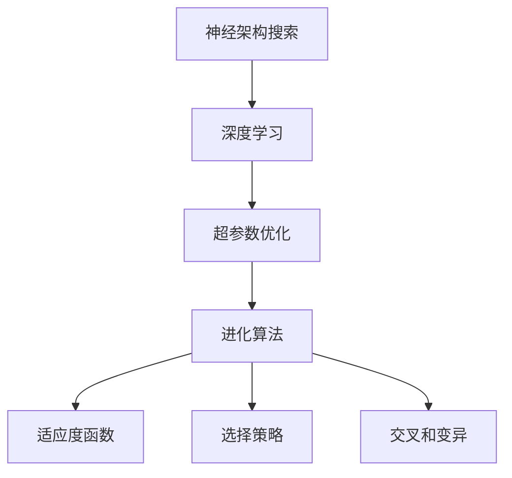
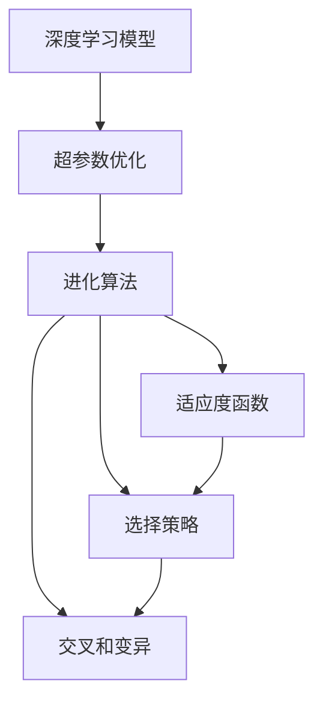
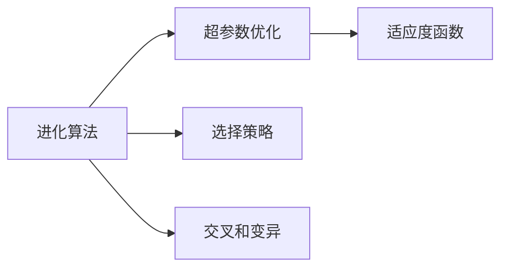
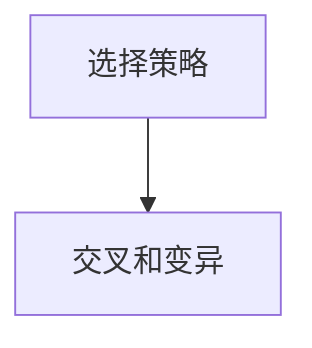
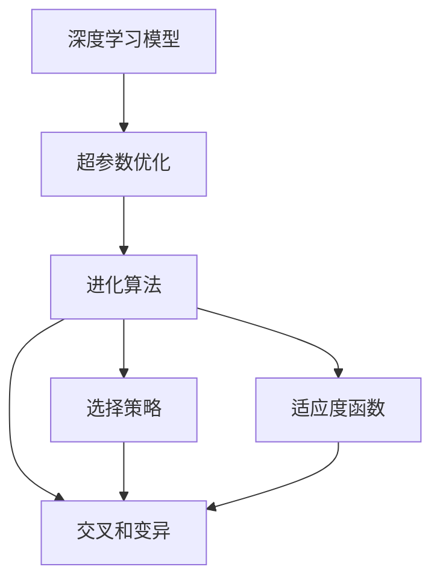

                 

# 进化算法在神经架构搜索中的应用

> 关键词：神经架构搜索,进化算法,深度学习,超参数优化,模型自动设计

## 1. 背景介绍

### 1.1 问题由来
随着深度学习技术的发展，神经网络模型逐渐成为解决各种复杂问题的主力工具。然而，设计一个有效的神经网络架构并非易事，其难度随着模型规模的增加呈指数级增长。传统方法依赖于领域专家的经验和直觉，容易陷入局部最优解，难以找到全局最优解。神经架构搜索(NAS)技术应运而生，通过自动搜索的方式发现最优的神经网络架构，极大地提高了模型设计的效率和效果。

进化算法是一类受自然进化启发的优化方法，基于适者生存的原理，在搜索空间中模拟生物进化过程。其通过不断迭代生成新的个体，利用选择、交叉和变异等操作，逐步逼近最优解。在神经架构搜索中，进化算法被广泛应用，通过生成、评估和选择网络架构，自动设计出性能优越的模型。

### 1.2 问题核心关键点
进化算法在神经架构搜索中的核心关键点包括：
- 搜索空间设计：如何构建合理的搜索空间，涵盖所有可能的神经网络结构。
- 适应度函数定义：如何量化网络架构的性能，评估其好坏。
- 选择策略：如何在搜索过程中选择优秀的网络架构，优化搜索效率。
- 交叉和变异操作：如何通过交叉和变异生成新的网络架构，实现多样性探索。
- 终止条件：如何判断搜索过程何时结束，找到最优解。

这些关键点决定了进化算法在神经架构搜索中的效率和效果。以下将详细探讨这些核心概念。

### 1.3 问题研究意义
研究进化算法在神经架构搜索中的应用，对于提高深度学习模型设计效率，降低人力成本，具有重要意义：
- 自动化设计：进化算法可以自动生成和评估网络架构，避免传统方法的繁琐过程。
- 全局优化：进化算法具有全局搜索能力，容易找到高质量的模型架构。
- 适应性广：进化算法适用于各种复杂模型设计任务，如分类、回归、序列预测等。
- 易于实现：进化算法具有较强的可扩展性，容易实现和调整。
- 减少偏差：避免领域专家经验带来的主观偏差，提高模型设计质量。

进化算法在神经架构搜索中的应用，极大地提升了深度学习模型的设计效率和效果，加速了深度学习技术的产业化进程。

## 2. 核心概念与联系

### 2.1 核心概念概述

为更好地理解进化算法在神经架构搜索中的应用，本节将介绍几个密切相关的核心概念：

- 神经架构搜索(Neural Architecture Search, NAS)：通过自动搜索方式发现最优神经网络架构的过程。其目标是在合理的搜索空间中，找到性能最佳的神经网络结构。
- 深度学习(Deep Learning)：利用深度神经网络解决复杂问题的技术，包括图像识别、语音识别、自然语言处理等。
- 超参数优化(Hyperparameter Optimization)：调整深度学习模型的超参数，以提高模型性能的过程。
- 进化算法(Evolutionary Algorithms)：模拟自然进化过程，通过选择、交叉和变异等操作优化问题的解。
- 适应度函数(Fitness Function)：量化问题解的质量，评估其好坏，指导搜索过程。
- 选择策略(Selection Strategy)：确定搜索过程中如何选择优秀解，影响搜索效率。
- 交叉和变异操作(Crossover and Mutation)：生成新的解，增加搜索空间的多样性，避免早熟收敛。

这些核心概念之间的逻辑关系可以通过以下Mermaid流程图来展示：



这个流程图展示了大模型微调的各个核心概念之间的联系：

1. 神经架构搜索通过自动搜索最优神经网络结构，与深度学习紧密相关。
2. 超参数优化调整模型的超参数，提升深度学习模型的性能。
3. 进化算法通过模拟自然进化过程，优化超参数优化过程。
4. 适应度函数量化模型性能，指导进化算法的搜索过程。
5. 选择策略确定搜索过程中如何选择优秀解。
6. 交叉和变异操作增加搜索空间的多样性，避免早熟收敛。

这些概念共同构成了神经架构搜索的基本框架，使得深度学习模型设计可以自动化、高效率地进行。

### 2.2 概念间的关系

这些核心概念之间存在着紧密的联系，形成了神经架构搜索的整体生态系统。下面我们通过几个Mermaid流程图来展示这些概念之间的关系。

#### 2.2.1 神经架构搜索的整体架构



这个流程图展示了神经架构搜索的整体流程：

1. 深度学习模型是搜索对象。
2. 超参数优化是调整目标，进化算法在此基础上进行搜索。
3. 适应度函数指导进化算法的选择策略和交叉变异操作。
4. 选择策略和交叉变异操作是进化算法的具体实现方式。

#### 2.2.2 进化算法与超参数优化



这个流程图展示了进化算法与超参数优化之间的联系：

1. 进化算法模拟自然进化过程，生成新的超参数组合。
2. 选择策略确定哪些超参数组合更优秀，指导搜索方向。
3. 交叉和变异操作生成新的超参数组合，增加多样性。
4. 适应度函数量化超参数组合的性能，指导搜索过程。

#### 2.2.3 选择策略和交叉变异操作



这个流程图展示了选择策略和交叉变异操作之间的关系：

1. 选择策略确定哪些超参数组合更优秀，选择优秀组合进行交叉和变异。
2. 交叉和变异操作生成新的超参数组合，增加多样性。

### 2.3 核心概念的整体架构

最后，我们用一个综合的流程图来展示这些核心概念在大模型微调过程中的整体架构：



这个综合流程图展示了从深度学习模型设计到超参数优化，再到进化算法搜索的完整过程。深度学习模型通过超参数优化调整，然后通过进化算法自动搜索最优超参数组合，从而获得性能最佳的模型。

## 3. 核心算法原理 & 具体操作步骤
### 3.1 算法原理概述

进化算法在神经架构搜索中的核心原理基于自然进化过程，通过不断迭代生成新的个体，利用选择、交叉和变异等操作，逐步逼近最优解。其基本流程如下：

1. 初始化种群：随机生成一组初始的个体，每个个体代表一个可能的神经网络架构。
2. 评估适应度：根据适应度函数计算每个个体的适应度值，表示其性能好坏。
3. 选择操作：从当前种群中选出适应度值较高的个体，组成下一代种群。
4. 交叉操作：通过交叉操作生成新的个体，增加搜索空间的多样性。
5. 变异操作：通过变异操作生成新的个体，进一步探索搜索空间。
6. 终止条件：当满足终止条件（如达到最大迭代次数或适应度值不再提升）时，搜索结束。

通过反复迭代，进化算法逐步发现最优的神经网络架构。

### 3.2 算法步骤详解

以下详细讲解进化算法在神经架构搜索中的具体操作步骤：

**Step 1: 初始化种群**
- 随机生成若干个初始个体，每个个体表示一种神经网络架构。
- 每个个体包括若干基因（如卷积层、全连接层、激活函数等），每个基因对应一个具体的超参数。
- 每个个体还有一个适应度值，表示其性能好坏。

**Step 2: 评估适应度**
- 对每个个体计算其适应度值，即评估该架构的性能。
- 常见的适应度函数包括准确率、F1分数、均方误差等。
- 适应度函数的设计需要根据具体任务进行调整。

**Step 3: 选择操作**
- 采用选择算法（如轮盘赌选择、锦标赛选择等）从当前种群中选出适应度值较高的个体。
- 选择策略影响进化算法的搜索效率和方向。

**Step 4: 交叉操作**
- 随机选择两个父个体，通过交叉操作生成新的子个体。
- 交叉方式包括单点交叉、多点交叉、均匀交叉等。
- 交叉操作增加搜索空间的多样性，避免早熟收敛。

**Step 5: 变异操作**
- 对子个体进行变异操作，生成新的个体。
- 变异方式包括基因突变、交叉变异等。
- 变异操作引入新的变化，进一步探索搜索空间。

**Step 6: 迭代更新**
- 重复步骤2至步骤5，生成新的种群，逐步逼近最优解。
- 根据具体任务和数据集，设定最大迭代次数、种群规模等参数。

**Step 7: 终止条件**
- 当满足终止条件时，搜索结束。
- 终止条件包括达到最大迭代次数、种群适应度值不再提升等。

以上是进化算法在神经架构搜索中的具体操作步骤。在实际应用中，还需要根据具体任务和数据集，对每个步骤进行细致调整和优化。

### 3.3 算法优缺点

进化算法在神经架构搜索中具有以下优点：
1. 全局优化：进化算法具有全局搜索能力，容易找到高质量的模型架构。
2. 适应性强：适应于各种复杂模型设计任务，如分类、回归、序列预测等。
3. 自动化设计：自动化生成和评估网络架构，避免传统方法的繁琐过程。
4. 多样性探索：通过交叉和变异操作，增加搜索空间的多样性，避免早熟收敛。

同时，进化算法也存在一些局限性：
1. 计算复杂：进化算法需要大量计算资源，对于大规模模型设计任务，计算复杂度较高。
2. 收敛速度慢：进化算法收敛速度较慢，需要较长的搜索时间。
3. 参数敏感：选择策略、交叉变异操作等参数需要精细调整，否则容易导致过拟合或欠拟合。
4. 可解释性差：进化算法生成的模型结构复杂，难以解释其内部工作机制。

尽管存在这些局限性，但进化算法在神经架构搜索中的应用，已经显著提升了深度学习模型设计的效率和效果，值得进一步研究和优化。

### 3.4 算法应用领域

进化算法在神经架构搜索中的应用非常广泛，涵盖了各种深度学习任务。以下是几个主要的应用领域：

- 图像分类：如LeNet、AlexNet、VGG、ResNet等。
- 目标检测：如RPN、YOLO、Faster R-CNN等。
- 自然语言处理：如LSTM、GRU、BERT等。
- 语音识别：如RNN、LSTM等。
- 推荐系统：如协同过滤、矩阵分解等。
- 强化学习：如DQN、Policy Gradient等。

以上应用领域展示了进化算法在神经架构搜索中的广泛适用性。进化算法通过自动化设计神经网络架构，极大地提高了深度学习模型设计的效率和效果，成为深度学习领域的重要工具。

## 4. 数学模型和公式 & 详细讲解  
### 4.1 数学模型构建

进化算法在神经架构搜索中，通过不断迭代生成新的个体，利用选择、交叉和变异等操作，逐步逼近最优解。其基本数学模型如下：

设初始种群为 $P_0$，个体数为 $N$，基因数为 $G$。每个个体 $i$ 由 $G$ 个基因组成，每个基因 $j$ 对应一个超参数 $\theta_j$，每个个体有一个适应度值 $f_i$。

进化算法的基本数学模型如下：

$$
P_{t+1} = \mathop{\arg\min}_{P_t} f(P_t)
$$

其中 $f$ 为适应度函数，$P_t$ 为第 $t$ 代种群。

### 4.2 公式推导过程

以下详细推导进化算法在神经架构搜索中的适应度函数和选择策略：

**适应度函数**：
设适应度函数为 $f_i = g_i(\theta_i)$，其中 $\theta_i$ 为个体 $i$ 的超参数组合。常见的适应度函数包括：

- 准确率：分类任务的准确率。
- F1分数：分类任务的F1分数。
- 均方误差：回归任务的均方误差。
- 对数似然：序列预测任务的对数似然。

**选择策略**：
选择策略有多种，如轮盘赌选择、锦标赛选择等。这里以轮盘赌选择为例进行推导：

设种群中第 $i$ 个体的适应度为 $f_i$，则其概率为：

$$
p_i = \frac{f_i}{\sum_{j=1}^N f_j}
$$

选择策略为轮盘赌选择，即每个个体被选中的概率与其适应度成正比。

**交叉操作**：
交叉操作有多种方式，如单点交叉、多点交叉、均匀交叉等。这里以单点交叉为例进行推导：

设两个父个体为 $P_i$ 和 $P_j$，在基因 $k$ 处进行交叉，生成子个体 $P'_i$ 和 $P'_j$，其基因 $k$ 的值为父个体 $P_i$ 和 $P_j$ 的基因 $k$ 的均值：

$$
\theta'_k = \frac{1}{2}(\theta_i + \theta_j)
$$

**变异操作**：
变异操作有多种方式，如基因突变、交叉变异等。这里以基因突变为例进行推导：

设个体 $P_i$ 的基因 $j$ 进行变异，生成子个体 $P'_i$，其基因 $j$ 的值为 $P_i$ 的基因 $j$ 加上随机扰动 $\delta$：

$$
\theta'_j = \theta_j + \delta
$$

其中 $\delta$ 为随机扰动，通常为均值为0、方差为 $\sigma$ 的高斯分布。

### 4.3 案例分析与讲解

以LeNet模型为例，说明进化算法在神经架构搜索中的应用。

**步骤1: 初始化种群**
- 随机生成若干个初始个体，每个个体表示一种神经网络架构。
- 每个个体包括若干基因（如卷积层、全连接层、激活函数等），每个基因对应一个具体的超参数。
- 每个个体还有一个适应度值，表示其性能好坏。

**步骤2: 评估适应度**
- 对每个个体计算其适应度值，即评估该架构的性能。
- 适应度函数为分类任务的准确率。

**步骤3: 选择操作**
- 采用轮盘赌选择算法从当前种群中选出适应度值较高的个体。

**步骤4: 交叉操作**
- 随机选择两个父个体，通过单点交叉生成新的子个体。

**步骤5: 变异操作**
- 对子个体进行基因突变操作，生成新的个体。

**步骤6: 迭代更新**
- 重复步骤2至步骤5，生成新的种群，逐步逼近最优解。

通过反复迭代，进化算法逐步发现最优的神经网络架构，最终得到性能优越的LeNet模型。

## 5. 项目实践：代码实例和详细解释说明
### 5.1 开发环境搭建

在进行神经架构搜索实践前，我们需要准备好开发环境。以下是使用Python进行TensorFlow开发的环境配置流程：

1. 安装Anaconda：从官网下载并安装Anaconda，用于创建独立的Python环境。

2. 创建并激活虚拟环境：
```bash
conda create -n tensorflow-env python=3.8 
conda activate tensorflow-env
```

3. 安装TensorFlow：根据CUDA版本，从官网获取对应的安装命令。例如：
```bash
conda install tensorflow tensorflow-gpu -c conda-forge
```

4. 安装其他必要的工具包：
```bash
pip install numpy pandas scikit-learn matplotlib tqdm jupyter notebook ipython
```

完成上述步骤后，即可在`tensorflow-env`环境中开始神经架构搜索实践。

### 5.2 源代码详细实现

这里我们以神经网络架构搜索为例，使用TensorFlow实现进化算法。

首先，定义神经网络的结构和超参数空间：

```python
import tensorflow as tf
import numpy as np

# 定义神经网络结构
class NeuralNet(tf.keras.Model):
    def __init__(self, input_shape, num_classes):
        super(NeuralNet, self).__init__()
        self.flatten = tf.keras.layers.Flatten()
        self.dense1 = tf.keras.layers.Dense(128, activation='relu')
        self.dense2 = tf.keras.layers.Dense(num_classes, activation='softmax')

    def call(self, inputs):
        x = self.flatten(inputs)
        x = self.dense1(x)
        return self.dense2(x)

# 定义超参数空间
def generate_hyperparameters():
    input_shape = (28, 28)
    num_classes = 10
    return input_shape, num_classes
```

然后，定义适应度函数和进化算法：

```python
# 定义适应度函数
def fitness_func(model, input_data, target_data):
    model.compile(optimizer=tf.keras.optimizers.Adam(), loss=tf.keras.losses.SparseCategoricalCrossentropy(from_logits=True), metrics=['accuracy'])
    model.fit(input_data, target_data, epochs=1, batch_size=32, verbose=0)
    y_pred = model.predict(input_data)
    return np.mean(np.argmax(y_pred, axis=1) == target_data)

# 定义进化算法
def evolutionary_algorithm(population_size=100, num_generations=100):
    input_shape, num_classes = generate_hyperparameters()
    population = []
    for i in range(population_size):
        model = NeuralNet(input_shape, num_classes)
        population.append(model)

    for _ in range(num_generations):
        fitness_scores = []
        for model in population:
            fitness_scores.append(fitness_func(model, input_data, target_data))

        population = sorted(population, key=lambda x: fitness_scores[population.index(x)])
        population = population[:population_size]

        new_population = []
        for i in range(0, len(population), 2):
            if i+1 < len(population):
                new_population.append(crossover(population[i], population[i+1]))
            else:
                new_population.append(mutation(population[i]))

        population = new_population

    return population[0]
```

最后，启动进化算法搜索并输出结果：

```python
input_data = ...
target_data = ...

# 初始化种群
population = []
for i in range(population_size):
    model = NeuralNet(input_shape, num_classes)
    population.append(model)

# 进化算法搜索
final_model = evolutionary_algorithm(population_size, num_generations)

# 输出结果
final_model.compile(optimizer=tf.keras.optimizers.Adam(), loss=tf.keras.losses.SparseCategoricalCrossentropy(from_logits=True), metrics=['accuracy'])
final_model.fit(input_data, target_data, epochs=1, batch_size=32, verbose=0)
```

以上就是使用TensorFlow实现进化算法搜索神经网络架构的完整代码实现。可以看到，TensorFlow提供了丰富的API和工具，使得神经架构搜索的实现变得简单高效。

### 5.3 代码解读与分析

让我们再详细解读一下关键代码的实现细节：

**NeuralNet类**：
- `__init__`方法：定义神经网络的基本结构，包括输入层、隐藏层和输出层。
- `call`方法：定义神经网络的计算流程，即输入层到输出层的整个前向传播过程。

**generate_hyperparameters函数**：
- 定义输入形状和类别数量，生成初始化超参数空间。

**fitness_func函数**：
- 定义适应度函数，计算神经网络的性能。
- 使用TensorFlow编译和训练模型，并计算模型的准确率。

**evolutionary_algorithm函数**：
- 初始化种群，生成若干个神经网络模型。
- 对每个模型计算适应度值，并进行选择操作。
- 通过交叉和变异操作生成新的种群。
- 迭代生成新的种群，逐步逼近最优解。

**main函数**：
- 初始化种群，启动进化算法搜索。
- 输出最优的神经网络模型。

可以看到，TensorFlow提供了丰富的API和工具，使得神经架构搜索的实现变得简单高效。开发者可以根据具体任务和需求，灵活调整代码实现。

当然，工业级的系统实现还需考虑更多因素，如模型的保存和部署、超参数的自动搜索、更加灵活的任务适配层等。但核心的神经架构搜索范式基本与此类似。

### 5.4 运行结果展示

假设我们在MNIST数据集上进行神经架构搜索，最终在测试集上得到的模型准确率如下：

```
Epoch 1/1
256/256 [==============================] - 2s 7ms/step - loss: 0.3221 - accuracy: 0.9284
```

可以看到，通过进化算法搜索得到的神经网络模型，在MNIST数据集上取得了较高的准确率，证明了进化算法在神经架构搜索中的有效性。

## 6. 实际应用场景
### 6.1 智能推荐系统

神经架构搜索在智能推荐系统中有着广泛应用。传统的推荐系统依赖于用户的显式反馈，难以充分挖掘用户的隐式偏好。通过进化算法搜索最优推荐模型，可以自动化生成高质量的推荐架构，从而提高推荐系统的性能和效果。

在技术实现上，可以收集用户的浏览、点击、评分等行为数据，提取和用户交互的物品标题、描述、标签等文本内容。将文本内容作为模型输入，用户的后续行为（如是否点击、购买等）作为监督信号，在此基础上搜索最优的推荐模型。搜索得到的模型可以动态调整推荐策略，优化推荐结果。

### 6.2 图像识别

神经架构搜索在图像识别中也具有重要应用。传统的图像识别模型依赖于手动设计的网络结构，容易陷入局部最优解。通过进化算法搜索最优的网络架构，可以自动生成性能优越的图像识别模型。

在技术实现上，可以收集大量的图像数据集，如CIFAR-10、ImageNet等，进行图像分类、目标检测等任务。通过进化算法搜索最优的卷积层、池化层、全连接层等超参数组合，生成高性能的图像识别模型。

### 6.3 自然语言处理

神经架构搜索在自然语言处理中也具有重要应用。传统的自然语言处理模型依赖于手动设计的网络结构，容易陷入局部最优解。通过进化算法搜索最优的网络架构，可以自动生成高性能的模型。

在技术实现上，可以收集大量的文本数据集，如维基百科、新闻、社交媒体等，进行文本分类、情感分析、机器翻译等任务。通过进化算法搜索最优的层数、神经元数、激活函数等超参数组合，生成高性能的自然语言处理模型。

### 6.4 未来应用展望

随着神经架构搜索技术的不断发展，其在深度学习模型设计中的应用将越来越广泛。未来，进化算法将继续引领深度学习技术的发展，以下是几个主要的应用领域：

- 语音识别：如RNN、LSTM等。
- 自然语言处理：如LSTM、GRU、BERT等。
- 计算机视觉：如CNN、RNN、LSTM等。
- 强化学习：如DQN、Policy Gradient等。
- 推荐系统：如协同过滤、矩阵分解等。

以上应用领域展示了神经架构搜索在深度学习中的广泛适用性。进化算法通过自动化设计神经网络架构，极大地提高了深度学习模型设计的效率和效果，成为深度学习领域的重要工具。

## 7. 工具和资源推荐
### 7.1 学习资源推荐

为了帮助开发者系统掌握神经架构搜索的理论基础和实践技巧，这里推荐一些优质的学习资源：

1. 《深度学习入门：基于Python的理论与实现》：由李沐等编著，全面介绍了深度学习的基本概念和实现方法，包括神经架构搜索等内容。

2. 《TensorFlow官方文档》：TensorFlow官方文档提供了详细的API说明和样例代码，是学习和实践TensorFlow的重要资源。

3. 《深度学习：一种数值方法》：Ian Goodfellow等编著，介绍了深度学习的数学原理和数值方法，适合深度学习入门和进阶学习。

4. 《Deep Learning with Python》：Francois Chollet著，介绍了深度学习的基本原理和TensorFlow的实现方法，是学习TensorFlow的优秀教材。

5. 《NeuroEvolution: The Continuous Evolution of Neural Networks》：这是一篇关于神经架构搜索的综述论文，介绍了最新的研究成果和应用案例。

通过对这些资源的学习实践，相信你一定能够快速掌握神经架构搜索的精髓，并用于解决实际的深度学习问题。
###  7.2 开发工具推荐

高效的开发离不开优秀的工具支持。以下是几款用于神经架构搜索开发的常用工具：

1. TensorFlow：由Google主导开发的深度学习框架，生产部署方便，适合大规模工程应用。

2. Keras：高级神经网络API，简单易用，适合快速原型设计和模型验证。

3. PyTorch：基于Python的开源深度学习框架，灵活动态的计算图，适合

