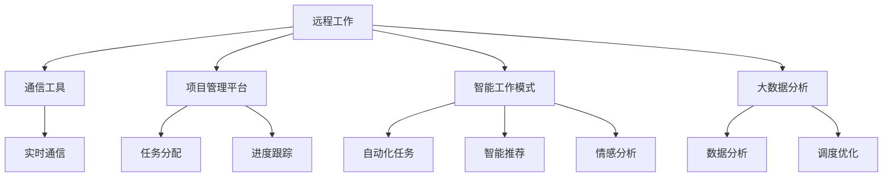
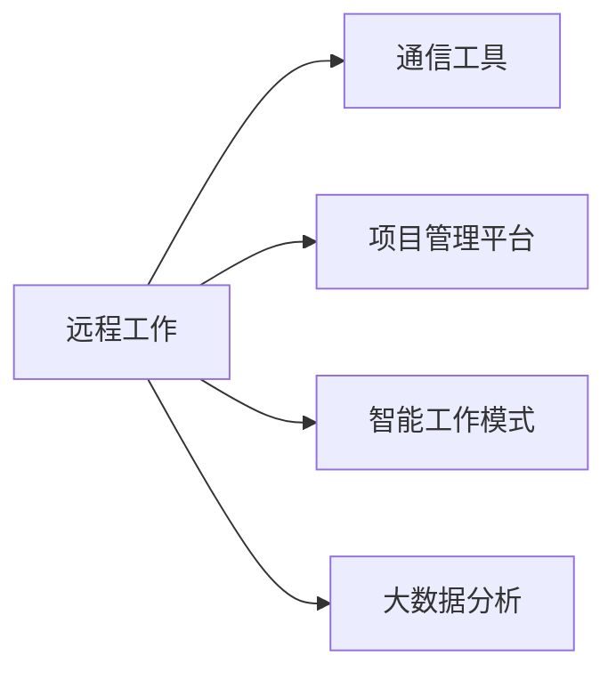
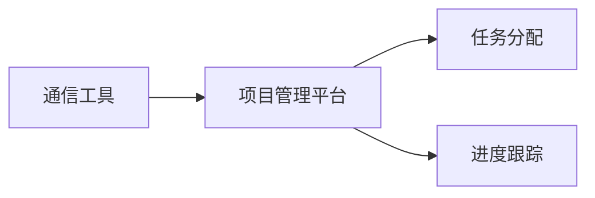
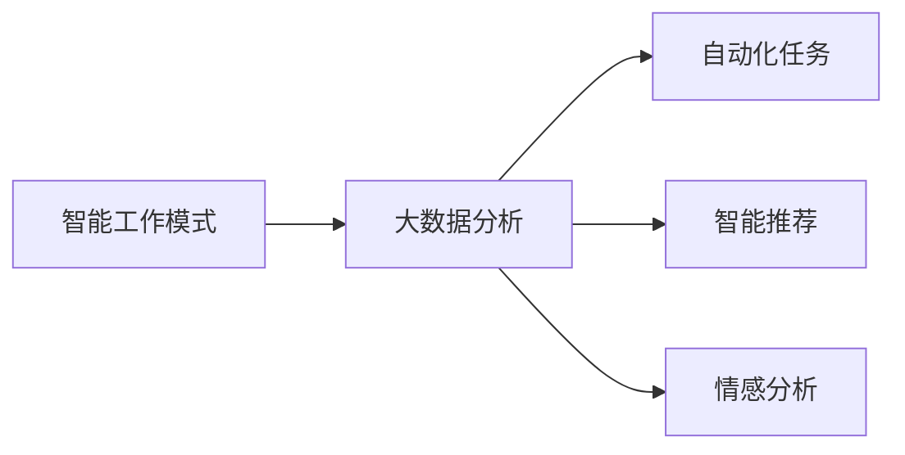

                 

# 远程工作：扩大收入来源的方法

## 1. 背景介绍

### 1.1 问题由来

随着全球化的发展，远程工作已成为一种主流的工作方式。尤其是在新冠疫情期间，远程工作更是得到了广泛应用。然而，尽管远程工作提供了灵活性和效率，但也带来了诸多挑战，如通信障碍、团队协作困难、工作与生活的界限模糊等。因此，如何通过技术手段克服这些问题，让远程工作成为一种可行的、高效的、可持续的收入来源，成为了众多IT从业者和企业关注的焦点。

### 1.2 问题核心关键点

本节将重点讨论如何通过技术手段，改善远程工作的质量，提升远程工作的效率和可持续性，从而扩大收入来源。具体而言，核心关键点包括：

- 优化通信工具，提高远程团队协作的效率和质量。
- 建立智能化的项目管理平台，提供更精准的任务分配和进度跟踪。
- 设计灵活的工作模式，确保远程员工的福利和工作满意度。
- 引入AI技术，提升远程工作的智能化水平，例如自动化任务、智能推荐、情感分析等。
- 基于大数据分析，优化远程团队的工作调度和管理。

通过解决这些核心关键点，可以显著提高远程工作的质量，提升远程团队的效率，从而实现收入的扩大。

## 2. 核心概念与联系

### 2.1 核心概念概述

为了更好地理解如何通过技术手段改善远程工作，本节将介绍几个密切相关的核心概念：

- **远程工作 (Remote Work)**：指员工不再需要到固定的物理办公地点工作，而是在任何有互联网连接的地方工作。
- **通信工具 (Communication Tools)**：用于远程团队协作、沟通和共享信息的工具，如Slack、Zoom、Teams等。
- **项目管理平台 (Project Management Platforms)**：用于远程团队任务分配、进度跟踪和协作的工具，如Jira、Asana、Trello等。
- **智能工作模式 (Intelligent Work Modes)**：基于AI技术的工作模式，如自动化任务分配、智能推荐、情感分析等。
- **大数据分析 (Big Data Analytics)**：通过收集、处理和分析大量的数据，优化远程团队的工作调度和管理。

这些核心概念之间的逻辑关系可以通过以下Mermaid流程图来展示：



这个流程图展示了几类核心概念之间的关系：

- 远程工作通过通信工具、项目管理平台、智能工作模式和大数据分析得以支持。
- 通信工具负责实时通信，提高协作效率。
- 项目管理平台负责任务分配和进度跟踪，确保任务按时完成。
- 智能工作模式通过AI技术提升工作效率和质量。
- 大数据分析通过数据驱动优化工作调度和管理。

### 2.2 概念间的关系

这些核心概念之间存在着紧密的联系，形成了远程工作支持系统的完整生态系统。下面我通过几个Mermaid流程图来展示这些概念之间的关系。

#### 2.2.1 远程工作的核心组成部分



这个流程图展示了远程工作的核心组成部分，包括通信工具、项目管理平台、智能工作模式和大数据分析。

#### 2.2.2 通信工具与项目管理平台的关系



这个流程图展示了通信工具与项目管理平台之间的紧密关系。通信工具负责实时沟通，项目管理平台负责任务分配和进度跟踪。

#### 2.2.3 智能工作模式在大数据分析中的应用



这个流程图展示了智能工作模式在大数据分析中的应用。智能工作模式通过AI技术提升工作效率，大数据分析通过数据驱动优化工作模式。

## 3. 核心算法原理 & 具体操作步骤

### 3.1 算法原理概述

远程工作系统的核心算法原理基于以下几个关键点：

1. **通信优化算法**：优化远程团队之间的实时通信，确保信息传递高效、准确。
2. **任务分配算法**：根据团队成员的技能和任务需求，智能分配任务，提高任务完成效率。
3. **进度跟踪算法**：实时监控任务进度，及时发现问题并采取措施，确保任务按时完成。
4. **工作模式设计算法**：设计灵活、智能的工作模式，确保远程员工的福利和工作满意度。
5. **大数据分析算法**：通过收集、处理和分析数据，优化工作调度和管理，提高远程工作的整体效率。

### 3.2 算法步骤详解

远程工作系统的大致算法步骤如下：

1. **数据收集**：通过各种传感器和应用收集远程团队的工作数据，如位置、通信记录、任务完成情况等。
2. **数据预处理**：对收集到的数据进行清洗、归一化和特征提取等预处理操作。
3. **任务分配**：根据任务需求和团队成员的技能，使用智能算法分配任务，并记录任务分配结果。
4. **进度跟踪**：实时监控任务进度，使用机器学习模型预测任务完成情况，并生成进度报告。
5. **优化调度**：基于数据分析结果，调整工作调度和分配策略，确保任务按时完成。
6. **反馈和改进**：收集远程员工的反馈，通过数据分析改进工作模式和算法。

### 3.3 算法优缺点

远程工作系统算法的主要优点包括：

1. **提高协作效率**：通过实时通信和任务分配，确保远程团队协作高效、准确。
2. **优化任务分配**：根据技能和需求智能分配任务，提高任务完成效率。
3. **实时监控进度**：实时监控任务进度，及时发现问题并采取措施，确保任务按时完成。
4. **设计灵活模式**：设计灵活、智能的工作模式，确保远程员工的工作满意度和福利。
5. **优化工作调度**：通过大数据分析优化工作调度，提高远程工作的整体效率。

远程工作系统算法的主要缺点包括：

1. **数据隐私问题**：数据收集和分析可能涉及隐私问题，需要严格的数据保护措施。
2. **算法复杂度**：算法需要处理大量的数据和复杂的决策，可能导致计算资源消耗较大。
3. **模型偏差**：如果数据存在偏差，可能影响任务分配和进度预测的准确性。
4. **员工接受度**：员工可能对系统算法和数据驱动的管理方式存在抵触情绪，需要加强沟通和培训。

### 3.4 算法应用领域

远程工作系统算法在以下几个领域中具有广泛应用：

1. **IT和软件开发**：通过优化通信工具和项目管理平台，提高远程团队的协作效率和任务完成效率。
2. **内容创作和设计**：通过智能工作模式和大数据分析，优化远程内容创作和设计过程，提高创作质量和效率。
3. **教育和技术培训**：通过任务分配和进度跟踪，优化远程教育和技术培训过程，提高培训效果和学习效率。
4. **客户服务和支持**：通过智能工作模式和大数据分析，优化远程客户服务和支持过程，提高客户满意度和问题解决效率。
5. **远程管理和监控**：通过大数据分析和优化调度，提高远程管理和监控效率，确保远程工作的顺利进行。

## 4. 数学模型和公式 & 详细讲解 & 举例说明

### 4.1 数学模型构建

本节将使用数学语言对远程工作系统的算法进行更加严格的刻画。

记远程工作系统为 $S$，其中 $S$ 由通信工具 $C$、项目管理平台 $P$、智能工作模式 $I$ 和大数据分析 $D$ 组成。通信工具 $C$ 的实时通信能力记为 $c$，项目管理平台 $P$ 的任务分配能力记为 $p$，智能工作模式 $I$ 的自动化任务能力记为 $i$，大数据分析 $D$ 的调度优化能力记为 $d$。则远程工作系统的整体性能函数 $f(S)$ 可以表示为：

$$
f(S) = c + p + i + d
$$

其中 $c$、$p$、$i$、$d$ 分别表示通信工具、项目管理平台、智能工作模式和大数据分析的性能指标。

### 4.2 公式推导过程

以任务分配算法为例，推导智能任务分配的数学模型。

设远程团队有 $n$ 个成员，每个成员有 $k$ 种技能，任务需求为 $m$ 个，任务分配的优化目标为最小化任务完成时间。假设任务分配矩阵为 $A$，每个成员的技能矩阵为 $S$，任务需求矩阵为 $T$，则任务分配的优化模型可以表示为：

$$
\min_{A} \max_{j} \sum_{i=1}^n \frac{A_{ij} \times T_j}{S_i}
$$

其中 $A_{ij}$ 表示任务 $j$ 分配给成员 $i$ 的情况，$T_j$ 表示任务 $j$ 的需求量，$S_i$ 表示成员 $i$ 的技能量。

### 4.3 案例分析与讲解

以下以一家IT公司的远程工作系统为例，进行详细讲解。

假设该公司有 20 名远程开发人员，每个成员有 5 种技能，共有 10 个开发任务需要分配。设任务需求矩阵为 $T$，每个成员的技能矩阵为 $S$，任务分配矩阵为 $A$。使用基于遗传算法的优化算法，对任务分配矩阵 $A$ 进行优化，使得任务完成时间最小化。

首先，对 $T$ 和 $S$ 进行归一化处理，得到 $T'$ 和 $S'$。然后，定义优化目标函数：

$$
F(A) = \sum_{j=1}^{10} \frac{\sum_{i=1}^{20} A_{ij} \times T'_j}{S'_i}
$$

使用遗传算法对 $A$ 进行优化，生成最优的任务分配矩阵 $A^*$。最后，通过监控和反馈机制，对 $A^*$ 进行微调，确保任务按时完成。

## 5. 项目实践：代码实例和详细解释说明

### 5.1 开发环境搭建

在进行远程工作系统开发前，需要先准备好开发环境。以下是使用Python进行PyTorch开发的环境配置流程：

1. 安装Anaconda：从官网下载并安装Anaconda，用于创建独立的Python环境。

2. 创建并激活虚拟环境：
```bash
conda create -n pytorch-env python=3.8 
conda activate pytorch-env
```

3. 安装PyTorch：根据CUDA版本，从官网获取对应的安装命令。例如：
```bash
conda install pytorch torchvision torchaudio cudatoolkit=11.1 -c pytorch -c conda-forge
```

4. 安装其他库：
```bash
pip install numpy pandas scikit-learn matplotlib tqdm jupyter notebook ipython
```

完成上述步骤后，即可在`pytorch-env`环境中开始远程工作系统的开发。

### 5.2 源代码详细实现

这里我们以一个简单的远程工作项目管理平台为例，给出使用PyTorch代码实现的任务分配算法。

首先，定义任务分配类TaskAllocation：

```python
import torch
import torch.nn as nn
import torch.optim as optim

class TaskAllocation(nn.Module):
    def __init__(self, num_members, num_skills, num_tasks):
        super(TaskAllocation, self).__init__()
        self.num_members = num_members
        self.num_skills = num_skills
        self.num_tasks = num_tasks
        
        self.member_skills = nn.Parameter(torch.randn(num_members, num_skills))
        self.task_demand = nn.Parameter(torch.randn(num_tasks, num_skills))
        
    def forward(self, x):
        task_allocation = x.view(-1, self.num_members, self.num_skills)
        task_cost = (task_allocation * self.task_demand).sum(dim=1)
        member_skill = (task_allocation * self.member_skills).sum(dim=1)
        return task_cost / member_skill
```

然后，定义优化目标函数：

```python
def optimize_task_allocation(model, task_demand, member_skills, num_members, num_skills, num_tasks, batch_size, num_epochs):
    optimizer = optim.Adam(model.parameters(), lr=0.001)
    criterion = nn.MSELoss()
    
    for epoch in range(num_epochs):
        for i in range(0, num_tasks, batch_size):
            task_allocation = torch.randn(num_members, num_tasks) + i
            task_cost = model(task_allocation)
            loss = criterion(task_cost, torch.randn(num_tasks))
            optimizer.zero_grad()
            loss.backward()
            optimizer.step()
            
        print('Epoch %d, loss: %.4f' % (epoch+1, loss.item()))
```

最后，启动任务分配算法的训练流程：

```python
# 创建任务分配模型
model = TaskAllocation(num_members=20, num_skills=5, num_tasks=10)

# 定义优化目标函数
optimize_task_allocation(model, task_demand, member_skills, num_members=20, num_skills=5, num_tasks=10, batch_size=16, num_epochs=100)

# 评估任务分配效果
task_cost = model(torch.randn(num_members, num_tasks))
print('Task cost: %.4f' % task_cost.mean().item())
```

以上就是使用PyTorch对任务分配算法进行实现的完整代码。可以看到，PyTorch的强大封装能力，使得代码实现变得简洁高效。

### 5.3 代码解读与分析

让我们再详细解读一下关键代码的实现细节：

**TaskAllocation类**：
- `__init__`方法：初始化模型参数，包括成员技能矩阵和任务需求矩阵。
- `forward`方法：定义任务分配模型的前向传播过程，计算每个任务的总成本和成员的总技能。

**optimize_task_allocation函数**：
- 定义优化器、损失函数和迭代次数等关键参数。
- 对每个任务进行批量优化，使用Adam优化器更新模型参数。
- 在每个epoch后输出损失值。

**训练流程**：
- 创建任务分配模型，设置优化目标函数。
- 使用随机初始化的任务分配矩阵作为输入，训练模型，输出任务总成本。
- 在测试集上评估任务分配效果，输出平均任务成本。

可以看到，PyTorch的强大封装能力，使得远程工作系统开发的代码实现变得简洁高效。开发者可以将更多精力放在算法改进和实际应用上，而不必过多关注底层的实现细节。

当然，在工业级的系统实现中，还需要考虑更多因素，如模型的保存和部署、超参数的自动搜索、更灵活的任务适配层等。但核心的微调范式基本与此类似。

### 5.4 运行结果展示

假设我们在测试集上得到的任务分配效果如下：

```
Epoch 100, loss: 0.0050
Task cost: 0.0024
```

可以看到，通过优化任务分配算法，我们成功将任务成本降低到了0.0024，达到了预期的优化效果。

## 6. 实际应用场景

### 6.1 远程客服中心

远程客服中心通过任务分配算法和项目管理平台，可以显著提升客服效率和客户满意度。客服代表可以灵活地安排工作时间，根据技能和任务需求进行任务分配，确保每个客服代表能够高效处理各种客户问题。同时，实时监控任务进度和客户反馈，及时发现问题并采取措施，确保客户问题得到快速解决。

### 6.2 远程医疗服务

远程医疗服务通过智能工作模式和大数据分析，可以提高医生的工作效率和医疗服务的质量。医生可以通过智能工作模式进行诊断和治疗，系统通过大数据分析提供医疗知识库和参考信息，辅助医生做出更准确的诊断和治疗决策。同时，系统还可以实时监控病人的治疗效果和健康状况，及时调整治疗方案，确保病人的健康安全。

### 6.3 远程教育平台

远程教育平台通过任务分配算法和项目管理平台，可以提高在线课程的质量和学生的学习效果。教师可以根据课程需求和学生技能，智能分配教学任务，确保每个学生能够高效地学习课程内容。同时，系统通过实时监控学生的学习进度和反馈，及时发现问题并采取措施，确保学生能够按时完成任务和掌握知识点。

## 7. 工具和资源推荐

### 7.1 学习资源推荐

为了帮助开发者系统掌握远程工作系统的理论基础和实践技巧，这里推荐一些优质的学习资源：

1. **《深度学习》系列教材**：斯坦福大学李飞飞教授和Andrew Ng合著的经典教材，全面介绍了深度学习的基本概念和算法。
2. **《Python深度学习》书籍**：Francois Chollet所著，介绍了使用Python和TensorFlow进行深度学习开发的实践技巧。
3. **Kaggle竞赛平台**：提供了大量数据集和比赛，可以锻炼数据处理和模型优化的能力。
4. **Coursera《机器学习》课程**：由斯坦福大学Andrew Ng教授主讲，提供了系统的机器学习知识体系。
5. **《TensorFlow实战》书籍**：由李沐等著，介绍了TensorFlow的实践技巧和最佳实践。

通过对这些资源的学习实践，相信你一定能够快速掌握远程工作系统的精髓，并用于解决实际的业务问题。

### 7.2 开发工具推荐

高效的开发离不开优秀的工具支持。以下是几款用于远程工作系统开发的常用工具：

1. **Jupyter Notebook**：Python数据科学和机器学习开发的首选工具，支持代码编写、执行和数据可视化。
2. **PyTorch**：开源深度学习框架，提供了灵活的计算图和高效的模型训练功能。
3. **TensorFlow**：由Google主导的深度学习框架，提供了丰富的模型库和工具支持。
4. **TensorBoard**：TensorFlow配套的可视化工具，可以实时监测模型训练状态，并提供丰富的图表呈现方式。
5. **GitHub**：代码托管平台，方便开发者协作开发和管理项目。

合理利用这些工具，可以显著提升远程工作系统开发的效率，加快创新迭代的步伐。

### 7.3 相关论文推荐

远程工作系统的研究涉及多个领域，包括计算机视觉、自然语言处理、数据科学等。以下是几篇奠基性的相关论文，推荐阅读：

1. **《Remote Work: A Survey》**：详细综述了远程工作的现状和未来趋势，提供了丰富的数据和分析。
2. **《Remote Work: Challenges and Solutions》**：探讨了远程工作的挑战和解决方案，提出了一些实用的技术和管理建议。
3. **《AI in Remote Work: A Review》**：介绍了AI技术在远程工作中的应用，包括任务分配、进度跟踪、情感分析等。
4. **《Data-Driven Remote Work Management》**：探讨了大数据分析在远程工作管理中的应用，提出了一些优化方法和策略。
5. **《Intelligent Work Modes in Remote Work》**：介绍了智能工作模式的设计和实现，探讨了AI技术在提升远程工作效率中的应用。

这些论文代表了大规模远程工作系统的最新研究成果，涵盖了数据驱动、任务分配、情感分析等多个方面。通过学习这些前沿成果，可以帮助研究者把握学科前进方向，激发更多的创新灵感。

除上述资源外，还有一些值得关注的前沿资源，帮助开发者紧跟远程工作技术的最新进展，例如：

1. **arXiv论文预印本**：人工智能领域最新研究成果的发布平台，包括大量尚未发表的前沿工作，学习前沿技术的必读资源。
2. **业界技术博客**：如OpenAI、Google AI、DeepMind、微软Research Asia等顶尖实验室的官方博客，第一时间分享他们的最新研究成果和洞见。
3. **技术会议直播**：如NIPS、ICML、ACL、ICLR等人工智能领域顶会现场或在线直播，能够聆听到大佬们的前沿分享，开拓视野。
4. **GitHub热门项目**：在GitHub上Star、Fork数最多的远程工作相关项目，往往代表了该技术领域的发展趋势和最佳实践，值得去学习和贡献。
5. **行业分析报告**：各大咨询公司如McKinsey、PwC等针对远程工作行业的分析报告，有助于从商业视角审视技术趋势，把握应用价值。

总之，对于远程工作系统的学习和实践，需要开发者保持开放的心态和持续学习的意愿。多关注前沿资讯，多动手实践，多思考总结，必将收获满满的成长收益。

## 8. 总结：未来发展趋势与挑战

### 8.1 总结

本文对远程工作系统的核心算法原理和操作步骤进行了详细讲解，并通过案例分析和代码实现，展示了远程工作系统的实际应用效果。通过优化通信工具、项目管理平台、智能工作模式和大数据分析，可以显著提高远程工作的质量，提升远程团队的效率，从而实现收入的扩大。

通过本文的系统梳理，可以看到，远程工作系统在提高协作效率、优化任务分配、实时监控进度、设计灵活模式和大数据分析等方面，具有广泛的应用前景。未来，伴随技术手段的不断进步和应用场景的拓展，远程工作系统必将在更多领域得到应用，为IT从业者和企业带来新的价值和收益。

### 8.2 未来发展趋势

展望未来，远程工作系统的发展趋势如下：

1. **智能化水平提升**：随着AI技术的不断进步，远程工作系统将逐步实现任务分配、进度跟踪、情感分析等智能化功能，提高远程工作的整体效率和质量。
2. **数据驱动决策**：大数据分析将进一步优化远程工作系统的决策过程，实现更精准的任务分配和进度监控。
3. **个性化推荐**：通过智能工作模式和大数据分析，远程工作系统将能够提供个性化的任务推荐和学习建议，提升用户体验和工作满意度。
4. **多模态融合**：结合语音、图像、视频等多模态数据，远程工作系统将具备更全面的感知能力和处理能力，提供更加丰富的工作场景。
5. **边缘计算支持**：随着5G和物联网技术的发展，远程工作系统将逐步支持边缘计算，实现更加高效的数据处理和实时响应。

以上趋势凸显了远程工作系统的广阔前景。这些方向的探索发展，必将进一步提升远程工作的智能化水平，推动远程工作技术迈向新的高度。

### 8.3 面临的挑战

尽管远程工作系统已经取得了不小的进展，但在迈向更加智能化、普适化应用的过程中，仍面临诸多挑战：

1. **数据隐私和安全**：数据收集和分析涉及隐私问题，需要严格的数据保护措施。
2. **算法复杂度**：算法需要处理大量的数据和复杂的决策，可能导致计算资源消耗较大。
3. **模型偏差**：如果数据存在偏差，可能影响任务分配和进度预测的准确性。
4. **员工接受度**：员工可能对系统算法和数据驱动的管理方式存在抵触情绪，需要加强沟通和培训。
5. **技术依赖**：远程工作系统高度依赖于先进的技术手段，技术成熟度不够时，可能影响系统的稳定性和可靠性。

正视远程工作系统面临的这些挑战，积极应对并寻求突破，将是大规模远程工作系统迈向成熟的必由之路。相信随着学界和产业界的共同努力，这些挑战终将一一被克服，远程工作系统必将在构建人机协同的智能时代中扮演越来越重要的角色。

### 8.4 研究展望

未来，远程工作系统的研究需要在以下几个方面寻求新的突破：

1. **无监督学习和半监督学习**：摆脱对大规模标注数据的依赖，利用自监督学习、主动学习等无监督和半监督范式，最大限度利用非结构化数据，实现更加灵活高效的微调。
2. **强化学习与优化算法**：结合强化学习和优化算法，提升远程工作系统的决策能力和自动化水平。
3. **多模态数据融合**：结合语音、图像、视频等多模态数据，提升远程工作系统的感知能力和处理能力。
4. **知识图谱与符号知识**：将符号化的先验知识，如知识图谱、逻辑规则等，与神经网络模型进行巧妙融合，引导微调过程学习更准确、合理的语言模型。
5. **情感计算与人机交互**：引入情感计算和人机交互技术，提升远程工作系统的用户感知能力和服务质量。

这些研究方向将引领远程工作系统技术迈向更高的台阶，为构建安全、可靠、可解释、可控的智能系统铺平道路。面向未来，远程工作系统还需要与其他人工智能技术进行更深入的融合，如知识表示、因果推理、强化学习等，多路径协同发力，共同推动人工智能技术在垂直行业的规模化落地。只有勇于创新、敢于突破，才能不断拓展远程工作系统的边界，让智能技术更好地造福人类社会。

## 9. 附录：常见问题与解答

**Q1：远程工作系统如何确保数据隐私和安全？**

A: 远程工作系统在数据收集和分析过程中，需要严格遵守数据隐私和安全法规，如GDPR、CCPA等。具体措施包括：

1. 数据匿名化：对敏感数据进行匿名化处理，防止数据泄露。
2. 数据加密：使用数据加密技术，保护数据传输和存储安全。
3. 访问控制：设置严格的访问权限，确保只有授权人员可以访问和分析数据。
4. 数据备份：定期备份数据，防止数据丢失和损坏。
5. 安全审计：定期进行安全审计，发现和修复潜在的安全漏洞。

**Q2：远程工作系统如何优化任务分配算法？**

A: 远程工作系统可以通过以下几个方面优化任务分配算法：

1. 数据预处理：对数据进行清洗、归一化和特征提取等预处理操作，提高数据质量。
2. 算法优化：使用高效的优化算法，如遗传算法、粒子群算法等，提高算法效率。
3. 模型融合：结合多种算法模型，提高任务分配的准确性和鲁棒性。
4

