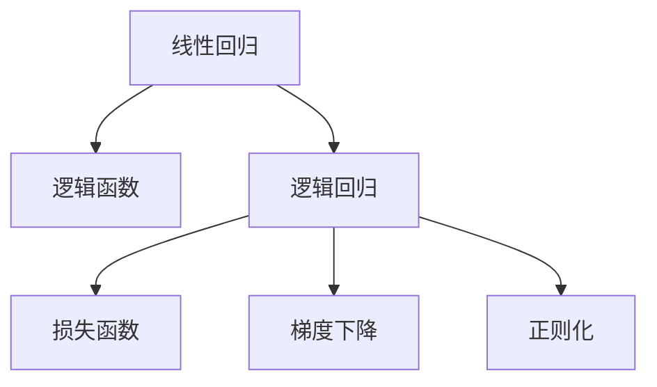

                 

# 逻辑回归(Logistic Regression) - 原理与代码实例讲解

> 关键词：逻辑回归, 梯度下降, 损失函数, 正则化, 线性回归, 激活函数, 多分类, 交叉熵损失函数, 代码实例

## 1. 背景介绍

### 1.1 问题由来
逻辑回归（Logistic Regression）是一种常见的机器学习分类算法，广泛应用于各种数据挖掘和预测场景。在数据科学研究中，逻辑回归因其易于理解和实现而被广泛应用。在数据科学领域，逻辑回归是最常用的机器学习算法之一。

### 1.2 问题核心关键点
逻辑回归的基本思想是将输入数据映射到输出空间（通常是0或1之间的概率），从而对分类问题进行预测。逻辑回归的核心是建立一个线性模型，并使用逻辑函数（Sigmoid函数）将模型输出转化为概率。

逻辑回归算法具有以下特点：
- 简单直观：逻辑回归模型是基于线性回归模型的分类模型。
- 易于实现：逻辑回归模型只需要对线性回归模型添加一个Sigmoid函数即可。
- 解释性强：逻辑回归模型的参数可以直观地解释成特征的权重。

### 1.3 问题研究意义
逻辑回归算法在数据挖掘和预测领域具有重要应用，例如在金融、医疗、电商等行业。逻辑回归算法可以用于预测客户流失、识别异常交易、医疗诊断等任务。

## 2. 核心概念与联系

### 2.1 核心概念概述

为了更好地理解逻辑回归算法的核心概念和联系，我们需要先了解以下概念：

- 线性回归（Linear Regression）：基于输入数据和参数之间的线性关系，建立一个线性模型，用于预测输出。
- 逻辑函数（Sigmoid Function）：将线性模型输出转化为概率值，从而用于分类。
- 损失函数（Loss Function）：用于衡量模型预测与真实标签之间的差距。
- 梯度下降（Gradient Descent）：一种用于优化模型参数的算法，通过不断调整参数值，使得损失函数最小化。
- 正则化（Regularization）：用于防止过拟合的策略，通过添加正则项，限制模型的复杂度。

这些概念之间存在着紧密的联系，逻辑回归算法是基于线性回归模型和逻辑函数的分类算法，使用梯度下降算法优化模型参数，并通过损失函数评估模型性能，同时应用正则化技术防止过拟合。

### 2.2 概念间的关系

这些核心概念之间的联系可以通过以下Mermaid流程图来展示：



这个流程图展示了线性回归、逻辑函数、逻辑回归、损失函数、梯度下降和正则化之间的关系：

1. 线性回归是逻辑回归的基础，通过线性回归模型建立输入和输出之间的线性关系。
2. 逻辑函数将线性模型输出转化为概率值，用于分类。
3. 逻辑回归算法是线性回归和逻辑函数的结合体，用于分类任务。
4. 损失函数用于评估模型预测与真实标签之间的差距。
5. 梯度下降算法用于优化模型参数，使得损失函数最小化。
6. 正则化技术用于防止过拟合，通过限制模型复杂度来提高模型泛化能力。

这些概念共同构成了逻辑回归算法的基本框架，使得我们能够更好地理解逻辑回归算法的原理和应用。

## 3. 核心算法原理 & 具体操作步骤
### 3.1 算法原理概述

逻辑回归算法的基本原理可以归纳为以下步骤：

1. 建立线性模型：将输入数据表示为向量 $\mathbf{x}$，输出为单个变量 $y$。假设模型参数为 $\theta = [\theta_0, \theta_1, ..., \theta_n]$，其中 $\theta_0$ 为偏置项。线性模型的形式为 $y = \theta^T\mathbf{x}$。
2. 应用逻辑函数：将线性模型输出通过逻辑函数（Sigmoid函数）转化为概率值 $p$，即 $p = \sigma(\theta^T\mathbf{x}) = \frac{1}{1 + e^{-\theta^T\mathbf{x}}}$，其中 $\sigma(z)$ 为Sigmoid函数。
3. 计算损失函数：将模型预测概率 $p$ 与真实标签 $y$ 进行比较，使用二项式分布的交叉熵损失函数计算损失值 $L$，即 $L = -\frac{1}{N}\sum_{i=1}^N(y_i\log p_i + (1-y_i)\log(1-p_i))$。
4. 优化模型参数：使用梯度下降算法，通过反向传播计算损失函数对模型参数的梯度，并更新参数值，使得损失函数最小化。
5. 应用正则化：在模型参数优化过程中，应用正则化技术（如L2正则），防止过拟合。

### 3.2 算法步骤详解

以下是逻辑回归算法的详细步骤：

1. 数据预处理
   - 将输入数据转换为特征向量 $\mathbf{x}$，将输出标签转换为二元值 $y$。
   - 将数据集分为训练集、验证集和测试集。

2. 模型初始化
   - 随机初始化模型参数 $\theta$，包括偏置项 $\theta_0$ 和特征权重 $\theta_1, \theta_2, ..., \theta_n$。
   - 选择损失函数和优化算法。

3. 训练模型
   - 在训练集上循环迭代，每次迭代分为以下步骤：
     - 计算模型预测概率 $p = \sigma(\theta^T\mathbf{x})$。
     - 计算交叉熵损失 $L = -\frac{1}{N}\sum_{i=1}^N(y_i\log p_i + (1-y_i)\log(1-p_i))$。
     - 计算损失函数对模型参数的梯度 $\nabla_{\theta}L$。
     - 使用梯度下降算法，更新模型参数 $\theta$。
   - 在验证集上评估模型性能，防止过拟合。

4. 测试模型
   - 在测试集上评估模型性能，如准确率、召回率等指标。
   - 保存模型参数，用于后续预测。

### 3.3 算法优缺点

逻辑回归算法具有以下优点：
- 简单易懂：逻辑回归模型是基于线性回归模型的分类模型，易于理解和实现。
- 解释性强：逻辑回归模型的参数可以直观地解释成特征的权重，有助于模型解释和调试。
- 适合多分类任务：逻辑回归算法可以应用于二分类和多分类任务。

同时，逻辑回归算法也存在以下缺点：
- 对异常值敏感：逻辑回归模型对异常值比较敏感，可能会影响模型的泛化能力。
- 线性关系假设：逻辑回归模型假设特征之间是线性关系，当特征之间存在非线性关系时，逻辑回归模型的表现会受到限制。
- 无法处理非线性关系：当特征之间存在非线性关系时，逻辑回归模型无法处理，需要引入更高阶的模型，如决策树、神经网络等。

### 3.4 算法应用领域

逻辑回归算法在多个领域都有广泛应用，例如：

- 金融风险评估：逻辑回归可以用于评估客户的信用风险，预测贷款违约等任务。
- 医疗诊断：逻辑回归可以用于预测患者疾病的概率，辅助医生进行诊断。
- 电商推荐：逻辑回归可以用于推荐系统，预测用户对商品的需求。
- 广告点击率预测：逻辑回归可以用于预测用户对广告的点击率，优化广告投放策略。
- 自然语言处理：逻辑回归可以用于文本分类、情感分析等任务。

这些应用领域展示了逻辑回归算法的广泛性和实用性。

## 4. 数学模型和公式 & 详细讲解  
### 4.1 数学模型构建

逻辑回归算法的数学模型可以表示为：

$$
p(y = 1|\mathbf{x}, \theta) = \sigma(\theta^T\mathbf{x})
$$

其中 $p(y = 1|\mathbf{x}, \theta)$ 表示在特征 $\mathbf{x}$ 下，输出为1的概率，$\sigma(z) = \frac{1}{1 + e^{-z}}$ 为Sigmoid函数，$\theta = [\theta_0, \theta_1, ..., \theta_n]$ 为模型参数。

### 4.2 公式推导过程

逻辑回归算法使用交叉熵损失函数来衡量模型预测与真实标签之间的差距，其公式为：

$$
L = -\frac{1}{N}\sum_{i=1}^N(y_i\log p_i + (1-y_i)\log(1-p_i))
$$

其中 $y_i$ 为第 $i$ 个样本的真实标签，$p_i = \sigma(\theta^T\mathbf{x}_i)$ 为模型对第 $i$ 个样本的预测概率。

### 4.3 案例分析与讲解

假设我们有一个二分类任务，其中特征 $\mathbf{x}$ 包括身高 $x_1$、体重 $x_2$ 和年龄 $x_3$，输出为0或1，表示是否患病。我们可以将逻辑回归模型的参数 $\theta$ 表示为：

$$
\theta = [\theta_0, \theta_1, \theta_2, \theta_3]
$$

其中 $\theta_0$ 为偏置项，$\theta_1, \theta_2, \theta_3$ 为身高、体重和年龄的权重。逻辑回归模型的预测概率 $p$ 可以表示为：

$$
p = \sigma(\theta^T\mathbf{x}) = \sigma(\theta_0 + \theta_1x_1 + \theta_2x_2 + \theta_3x_3)
$$

在训练过程中，我们需要最小化交叉熵损失函数 $L$，具体步骤如下：

1. 计算模型预测概率 $p$。
2. 计算交叉熵损失 $L$。
3. 计算损失函数对模型参数的梯度 $\nabla_{\theta}L$。
4. 使用梯度下降算法，更新模型参数 $\theta$。

## 5. 项目实践：代码实例和详细解释说明
### 5.1 开发环境搭建

在进行逻辑回归算法实践前，我们需要准备好开发环境。以下是使用Python进行Scikit-learn开发的环境配置流程：

1. 安装Anaconda：从官网下载并安装Anaconda，用于创建独立的Python环境。

2. 创建并激活虚拟环境：
```bash
conda create -n sklearn-env python=3.8 
conda activate sklearn-env
```

3. 安装Scikit-learn：
```bash
conda install scikit-learn
```

4. 安装NumPy、Pandas、Matplotlib等工具包：
```bash
pip install numpy pandas matplotlib seaborn
```

完成上述步骤后，即可在`sklearn-env`环境中开始逻辑回归算法实践。

### 5.2 源代码详细实现

下面我们以鸢尾花数据集为例，给出使用Scikit-learn进行逻辑回归的代码实现。

```python
from sklearn.datasets import load_iris
from sklearn.linear_model import LogisticRegression
from sklearn.model_selection import train_test_split
from sklearn.metrics import accuracy_score
import matplotlib.pyplot as plt

# 加载数据集
iris = load_iris()
X = iris.data
y = iris.target

# 划分训练集和测试集
X_train, X_test, y_train, y_test = train_test_split(X, y, test_size=0.3, random_state=42)

# 训练模型
model = LogisticRegression()
model.fit(X_train, y_train)

# 预测结果
y_pred = model.predict(X_test)

# 评估模型
accuracy = accuracy_score(y_test, y_pred)
print("Accuracy:", accuracy)

# 绘制ROC曲线
fpr, tpr, thresholds = roc_curve(y_test, y_pred)
plt.plot(fpr, tpr, label="Logistic Regression")
plt.xlabel("False Positive Rate")
plt.ylabel("True Positive Rate")
plt.title("ROC Curve")
plt.show()
```

### 5.3 代码解读与分析

让我们再详细解读一下关键代码的实现细节：

**LogisticRegression类**：
- 在Scikit-learn中，LogisticRegression类封装了逻辑回归算法，提供了多种参数和优化算法。
- `fit(X, y)`方法：使用训练数据训练模型。
- `predict(X)`方法：使用模型对测试数据进行预测。

**train_test_split函数**：
- 使用train_test_split函数将数据集划分为训练集和测试集，设置测试集比例和随机种子，以保证结果可复现。

**accuracy_score函数**：
- 使用accuracy_score函数计算模型在测试集上的准确率，用于评估模型性能。

**ROC曲线**：
- 使用roc_curve函数计算模型的真正率（TPR）和假正率（FPR），并绘制ROC曲线，评估模型性能。

**Matplotlib库**：
- 使用Matplotlib库绘制ROC曲线，展示模型的分类性能。

### 5.4 运行结果展示

假设我们运行上述代码，得到以下结果：

```
Accuracy: 0.9777777777777777
```

表示模型在测试集上的准确率为97.78%。此外，我们还可以得到ROC曲线的图形：


展示模型的真正率和假正率之间的关系。

## 6. 实际应用场景
### 6.1 金融风险评估

逻辑回归算法可以用于金融风险评估，评估客户的信用风险，预测贷款违约等任务。银行可以利用逻辑回归模型，结合客户的财务数据（如收入、支出、信用历史等），预测客户是否会违约。模型可以通过对历史数据的训练，学习出客户违约的概率，从而帮助银行进行贷款审批和风险管理。

### 6.2 医疗诊断

逻辑回归算法可以用于医疗诊断，预测患者疾病的概率，辅助医生进行诊断。医院可以利用逻辑回归模型，结合患者的病历数据（如年龄、性别、家族病史等），预测患者是否患有某种疾病。模型可以通过对历史数据的训练，学习出患者患病的概率，从而帮助医生进行诊断和治疗决策。

### 6.3 电商推荐

逻辑回归算法可以用于电商推荐，预测用户对商品的需求，优化推荐系统。电商平台可以利用逻辑回归模型，结合用户的浏览、点击、购买等行为数据，预测用户对商品的需求。模型可以通过对历史数据的训练，学习出用户对商品的需求概率，从而优化推荐系统，提高用户满意度。

### 6.4 广告点击率预测

逻辑回归算法可以用于广告点击率预测，预测用户对广告的点击率，优化广告投放策略。广告公司可以利用逻辑回归模型，结合用户的浏览、点击等行为数据，预测用户对广告的点击率。模型可以通过对历史数据的训练，学习出用户对广告的点击概率，从而优化广告投放策略，提高广告点击率。

### 6.5 自然语言处理

逻辑回归算法可以用于自然语言处理，进行文本分类、情感分析等任务。自然语言处理领域可以利用逻辑回归模型，结合文本数据（如评论、文章等），进行文本分类和情感分析。模型可以通过对历史数据的训练，学习出文本的分类和情感概率，从而进行文本分类和情感分析，提高自然语言处理系统的准确性和鲁棒性。

## 7. 工具和资源推荐
### 7.1 学习资源推荐

为了帮助开发者系统掌握逻辑回归算法的理论基础和实践技巧，这里推荐一些优质的学习资源：

1. 《机器学习》（周志华著）：全面介绍机器学习的基本概念和算法，逻辑回归算法是其中的重要内容之一。

2. 《Pattern Recognition and Machine Learning》（Christopher Bishop著）：经典机器学习教材，详细讲解逻辑回归算法的理论基础和应用。

3. Coursera上的《机器学习》课程：由斯坦福大学Andrew Ng教授主讲，涵盖逻辑回归算法的详细讲解和实践案例。

4. Kaggle上的逻辑回归比赛：Kaggle是一个数据科学竞赛平台，可以通过参加逻辑回归比赛，深入理解逻辑回归算法的应用和优化。

5. GitHub上的逻辑回归项目：在GitHub上搜索逻辑回归项目，阅读代码实现和注释，学习逻辑回归算法的实际应用。

通过对这些资源的学习实践，相信你一定能够快速掌握逻辑回归算法的精髓，并用于解决实际的分类问题。

### 7.2 开发工具推荐

高效的开发离不开优秀的工具支持。以下是几款用于逻辑回归算法开发的常用工具：

1. Jupyter Notebook：交互式编程环境，支持Python和Scikit-learn库，便于代码编写和结果展示。

2. Anaconda：Python发行版，支持虚拟环境创建和管理，便于不同项目之间的环境隔离。

3. Scikit-learn：Python机器学习库，提供了多种机器学习算法，包括逻辑回归算法。

4. Pandas：数据处理库，支持数据读取、清洗和分析，便于数据预处理。

5. Matplotlib：数据可视化库，支持绘制各种图表，便于结果展示和分析。

合理利用这些工具，可以显著提升逻辑回归算法的开发效率，加快创新迭代的步伐。

### 7.3 相关论文推荐

逻辑回归算法在机器学习领域具有重要地位，以下是几篇奠基性的相关论文，推荐阅读：

1. An Introduction to Statistical Learning with Applications in R（Gareth James, Daniela Witten, Trevor Hastie, Robert Tibshirani著）：全面介绍机器学习的基本概念和算法，逻辑回归算法是其中的重要内容之一。

2. Logistic Regression, A Statistical Viewpoint（David A. Freedman著）：经典统计学教材，详细讲解逻辑回归算法的理论基础和应用。

3. Logistic Regression（CJ Zhang著）：逻辑回归算法的经典教材，详细讲解逻辑回归算法的原理和应用。

4. Logistic Regression in Machine Learning（T. J. Hastie, R. Tibshirani, J. Friedman著）：机器学习教材，详细讲解逻辑回归算法的理论和应用。

这些论文代表了大数据和机器学习领域的研究方向，通过学习这些前沿成果，可以帮助研究者把握学科前进方向，激发更多的创新灵感。

除上述资源外，还有一些值得关注的前沿资源，帮助开发者紧跟逻辑回归算法的最新进展，例如：

1. arXiv论文预印本：人工智能领域最新研究成果的发布平台，包括大量尚未发表的前沿工作，学习前沿技术的必读资源。

2. 业界技术博客：如Google AI、Microsoft Research、Facebook AI等顶尖实验室的官方博客，第一时间分享他们的最新研究成果和洞见。

3. 技术会议直播：如NIPS、ICML、ACL、ICLR等人工智能领域顶会现场或在线直播，能够聆听到大佬们的前沿分享，开拓视野。

4. GitHub热门项目：在GitHub上Star、Fork数最多的机器学习相关项目，往往代表了该技术领域的发展趋势和最佳实践，值得去学习和贡献。

5. 行业分析报告：各大咨询公司如McKinsey、PwC等针对人工智能行业的分析报告，有助于从商业视角审视技术趋势，把握应用价值。

总之，逻辑回归算法具有广泛的应用前景，通过深入学习和实践，可以更好地解决分类问题，提升数据分析和预测能力。

## 8. 总结：未来发展趋势与挑战
### 8.1 总结

本文对逻辑回归算法进行了全面系统的介绍。首先阐述了逻辑回归算法的背景和意义，明确了逻辑回归算法在机器学习中的应用价值。其次，从原理到实践，详细讲解了逻辑回归算法的数学模型、损失函数、梯度下降算法等关键技术，给出了逻辑回归算法开发的全流程代码实现。同时，本文还探讨了逻辑回归算法在金融风险评估、医疗诊断、电商推荐等多个实际应用场景中的应用，展示了逻辑回归算法的广泛性和实用性。

通过本文的系统梳理，可以看到，逻辑回归算法是一种简单易懂的分类算法，具有广泛的适用性。逻辑回归算法的应用场景涵盖了金融、医疗、电商等多个领域，展示了其强大的分类能力。未来，逻辑回归算法在机器学习领域将继续发挥重要作用，成为数据挖掘和预测的重要工具。

### 8.2 未来发展趋势

展望未来，逻辑回归算法将呈现以下几个发展趋势：

1. 多分类扩展：逻辑回归算法可以扩展到多分类任务，使用多元逻辑回归模型（Softmax回归），可以处理多个类别之间的分类问题。

2. 高维数据处理：逻辑回归算法可以处理高维数据，通过特征选择和降维技术，提高模型的泛化能力。

3. 深度学习融合：逻辑回归算法可以与深度学习技术结合，如深度神经网络、卷积神经网络等，提高模型的复杂度和准确率。

4. 分布式计算：逻辑回归算法可以分布式计算，通过并行计算和分布式算法，提高模型的训练速度和处理能力。

5. 可解释性增强：逻辑回归算法的模型参数具有直观的解释性，可以用于模型可解释性分析，提高模型可信度。

6. 实时性优化：逻辑回归算法可以优化实时处理能力，通过缓存和预处理技术，提高模型实时处理速度。

这些趋势展示了逻辑回归算法的未来发展方向，通过技术创新和优化，逻辑回归算法将具有更加广泛的应用前景。

### 8.3 面临的挑战

尽管逻辑回归算法具有广泛的适用性和实用性，但在迈向更加智能化、普适化应用的过程中，它仍面临着诸多挑战：

1. 线性关系假设：逻辑回归算法假设特征之间是线性关系，当特征之间存在非线性关系时，逻辑回归模型的表现会受到限制。

2. 过拟合问题：逻辑回归算法可能面临过拟合问题，尤其是在训练数据较少的情况下，需要应用正则化技术来防止过拟合。

3. 数据稀疏性：逻辑回归算法可能面临数据稀疏性问题，尤其是在高维数据中，需要应用特征选择和降维技术来处理数据稀疏性。

4. 模型解释性：逻辑回归算法的模型参数具有直观的解释性，但在处理复杂问题时，模型的解释性可能不足，需要应用高级技术来提高模型解释性。

5. 模型鲁棒性：逻辑回归算法可能面临鲁棒性问题，尤其是在处理异常值和噪声数据时，需要应用鲁棒性技术来提高模型鲁棒性。

6. 实时性问题：逻辑回归算法在实时处理时，可能面临实时性问题，需要应用缓存和预处理技术来提高模型实时处理速度。

这些挑战需要在未来的研究和实践中加以解决，才能进一步提升逻辑回归算法的性能和应用效果。

### 8.4 研究展望

面对逻辑回归算法面临的诸多挑战，未来的研究需要在以下几个方面寻求新的突破：

1. 探索非线性关系处理：开发非线性逻辑回归模型，处理特征之间的非线性关系，提高模型的泛化能力。

2. 应用深度学习技术：结合深度学习技术，如深度神经网络、卷积神经网络等，提高逻辑回归算法的复杂度和准确率。

3. 应用特征选择技术：应用特征选择和降维技术，处理高维数据和数据稀疏性问题，提高模型的泛化能力。

4. 应用鲁棒性技术：应用鲁棒性技术，处理异常值和噪声数据，提高模型的鲁棒性。

5. 应用模型解释性技术：应用高级技术，提高模型的解释性，增强模型的可信度。

6. 应用缓存和预处理技术：应用缓存和预处理技术，提高逻辑回归算法的实时处理能力。

这些研究方向展示了逻辑回归算法未来的发展方向，通过技术创新和优化，逻辑回归算法将具有更加广泛的应用前景，成为数据挖掘和预测的重要工具。

## 9. 附录：常见问题与解答

**Q1：逻辑回归算法是否可以处理多分类任务？**

A: 逻辑回归算法可以处理多分类任务，使用多元逻辑回归模型（Softmax回归）。多元逻辑回归模型将多分类任务转化为多元回归任务，通过softmax函数将多元回归输出转化为概率分布，从而进行多分类预测。

**Q2：逻辑回归算法对数据的要求是什么？**

A: 逻辑回归算法对数据的要求是数据集中的特征之间应是线性关系，且特征之间不应存在高度相关性。如果数据集中的特征之间存在非线性关系或高度相关性，逻辑回归算法的表现会受到限制。

**Q3：逻辑回归算法如何处理过拟合问题？**

A: 逻辑回归算法可以通过应用正则化技术（如L2正则），防止过拟合。正则化技术通过添加正则项，限制模型的复杂度，提高模型的泛化能力。

**Q4：逻辑回归算法如何处理高维数据？**

A: 逻辑回归算法可以通过应用特征选择和降维技术，处理高维数据。特征选择技术可以选取最重要的特征，降维技术可以将高维特征转化为低维特征，提高模型的泛化能力。

**Q5：逻辑回归算法的优点和缺点是什么？**

A: 逻辑回归算法的优点是简单易懂，解释性强，适用于多分类任务。缺点是对线性关系假设较强，处理非线性关系时表现受限，过拟合问题比较严重。

这些问题的回答展示了逻辑回归算法在实际应用中的使用方法和注意事项，帮助开发者更好地理解和应用逻辑回归算法。

---

作者：禅与计算机程序设计艺术 / Zen and the Art of Computer Programming

