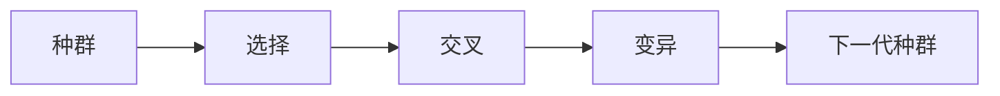
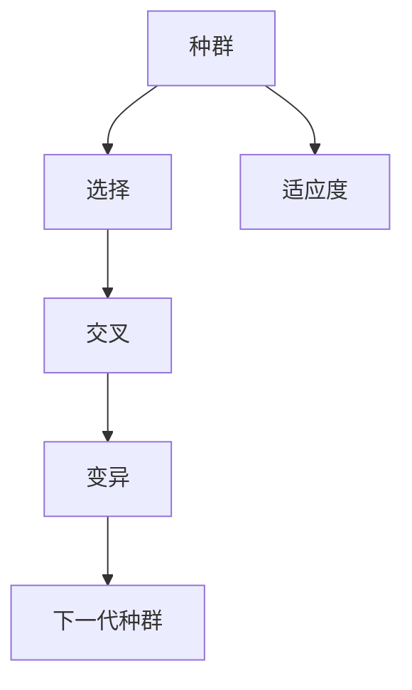

                 

# 遗传算法(Genetic Algorithms) - 原理与代码实例讲解

> 关键词：遗传算法,GA,进化算法,优化算法,全局优化

## 1. 背景介绍

### 1.1 问题由来

遗传算法（Genetic Algorithms, 简称GA）是一种基于自然选择和遗传学原理的搜索算法，用于解决优化和搜索问题。它通过模拟生物进化过程中的选择、交叉和变异等机制，逐步优化问题的解。遗传算法最初由Holland在1975年提出，用于解决复杂的组合优化问题，此后在机器人学、人工智能、机器学习、工程优化、生物信息学等多个领域得到广泛应用。

遗传算法之所以能够成功应用于各种问题，主要是因为它能够并行处理大量可能的解，具有较强的鲁棒性和自适应性，能够避免陷入局部最优解。与此同时，遗传算法的实施简单，易于理解和应用，也不需要复杂的数学模型，因此在实际应用中广受欢迎。

### 1.2 问题核心关键点

遗传算法的基本原理包括以下几个关键点：

- 种群（Population）：遗传算法从一组随机解（即初始种群）开始，逐步通过选择、交叉和变异等操作，生成新的种群。
- 适应度（Fitness）：遗传算法通过评估每个解的适应度来确定其在下一代种群中的生存机会。适应度通常与问题的目标函数相关联。
- 选择（Selection）：根据适应度函数从当前种群中选择部分个体（即父代）。
- 交叉（Crossover）：通过组合两个父代个体的某些部分，生成新的后代个体。
- 变异（Mutation）：对新生成的后代个体进行随机变异，引入新的基因。

遗传算法的基本流程如下图所示：



在遗传算法中，解通常表示为字符串或数字向量，通过模拟自然选择和进化过程，逐步优化目标函数，最终找到问题的最优解。

### 1.3 问题研究意义

遗传算法在搜索优化、人工智能、机器学习等领域具有重要意义：

1. **搜索优化**：遗传算法能够并行处理大量可能的解，通过模拟自然进化过程，逐步逼近问题的最优解。
2. **人工智能**：遗传算法在机器学习和神经网络中也有应用，例如遗传编程和进化神经网络。
3. **机器学习**：遗传算法用于优化神经网络中的权值和阈值，提高模型的性能。
4. **工程优化**：遗传算法在机械设计、控制系统和机器人优化中得到应用。
5. **生物信息学**：遗传算法在基因组学和蛋白质结构预测中也有应用。

## 2. 核心概念与联系

### 2.1 核心概念概述

遗传算法是模拟生物进化过程的优化算法，通过选择、交叉和变异等操作逐步逼近问题的最优解。核心概念包括以下几个：

- **种群（Population）**：遗传算法从一组随机解开始，逐步通过选择、交叉和变异等操作，生成新的种群。
- **适应度（Fitness）**：遗传算法通过评估每个解的适应度来确定其在下一代种群中的生存机会。适应度通常与问题的目标函数相关联。
- **选择（Selection）**：根据适应度函数从当前种群中选择部分个体（即父代）。
- **交叉（Crossover）**：通过组合两个父代个体的某些部分，生成新的后代个体。
- **变异（Mutation）**：对新生成的后代个体进行随机变异，引入新的基因。

### 2.2 概念间的关系

这些核心概念之间的逻辑关系可以通过以下Mermaid流程图来展示：



这个流程图展示了遗传算法的基本流程。从初始种群开始，通过适应度评估、选择、交叉和变异等操作，逐步生成新的种群，直至收敛到最优解。

## 3. 核心算法原理 & 具体操作步骤

### 3.1 算法原理概述

遗传算法的核心思想是通过模拟自然选择和进化过程，逐步逼近问题的最优解。其主要步骤如下：

1. **初始化种群**：随机生成一组解作为初始种群。
2. **适应度评估**：对每个解计算其适应度，评估其优劣。
3. **选择操作**：根据适应度函数，从当前种群中选择部分个体作为父代。
4. **交叉操作**：通过交叉操作，生成新的后代个体。
5. **变异操作**：对新生成的后代个体进行变异，引入新的基因。
6. **更新种群**：将新生成的后代个体添加到种群中，并更新种群。
7. **迭代优化**：重复上述步骤，直至收敛到最优解。

### 3.2 算法步骤详解

以下我们将详细介绍遗传算法的具体步骤和实现细节。

#### 3.2.1 初始化种群

初始化种群是遗传算法的第一步。种群通常是一组随机生成的解，用于表示问题的可能解空间。种群的大小通常是一个参数，需要根据问题的复杂度和搜索空间进行调整。

例如，对于一个简单的二进制问题，可以生成一个$n$位的随机二进制串作为种群的个体。每个二进制串的长度为$n$，每个位可以是0或1，表示一个解。种群大小通常为$N$，可以设置为$N=n$。

#### 3.2.2 适应度评估

适应度评估是遗传算法的核心步骤之一。适应度函数用于评估每个解的优劣，通常定义为问题的目标函数。适应度高的个体更有可能被选中为父代，从而在下一代种群中得到保留。

例如，对于一个简单的二进制问题，可以定义适应度函数为：

$$ \text{Fitness} = f(x) = \sum_{i=1}^{n}x_i $$

其中$x$是二进制串，$n$是二进制串的长度，$f(x)$是目标函数，可以用于评估解的优劣。

#### 3.2.3 选择操作

选择操作是遗传算法中的关键步骤之一，用于从当前种群中选择部分个体作为父代。常用的选择方法包括轮盘赌选择、锦标赛选择等。

轮盘赌选择是一种简单的选择方法，每个个体被选中的概率与其适应度成正比。具体实现如下：

1. 计算每个个体的适应度总和。
2. 生成一个随机数$r$，范围在$[0, \text{适应度总和}]$之间。
3. 遍历每个个体，计算其适应度之和，如果随机数$r$小于当前个体的适应度之和，则选择该个体作为父代。

锦标赛选择是一种常用的选择方法，从种群中随机选择$k$个个体进行比较，选择适应度最高的个体作为父代。具体实现如下：

1. 从种群中随机选择$k$个个体。
2. 比较这$k$个个体的适应度，选择适应度最高的个体作为父代。

#### 3.2.4 交叉操作

交叉操作是通过组合两个父代个体的某些部分，生成新的后代个体。常用的交叉方法包括单点交叉、多点交叉、均匀交叉等。

单点交叉是一种简单的交叉方法，从父代中随机选择一个点，将两点之间的部分交换。具体实现如下：

1. 从两个父代中选择两个随机点。
2. 将两点之间的部分交换，生成新的后代个体。

多点交叉是一种常用的交叉方法，从父代中随机选择多个点，将每个父代的部分交换。具体实现如下：

1. 从两个父代中选择$k$个随机点。
2. 将每个父代的部分交换，生成新的后代个体。

均匀交叉是一种常用的交叉方法，将两个父代的部分随机交换。具体实现如下：

1. 随机选择两个子串，将两个父代的部分随机交换。

#### 3.2.5 变异操作

变异操作是通过对新生成的后代个体进行随机变异，引入新的基因。常用的变异方法包括单点变异、多点变异、均匀变异等。

单点变异是一种简单的变异方法，从后代个体中随机选择一个点，将其变更为0或1。具体实现如下：

1. 从后代个体中选择一个随机点。
2. 将该点变更为0或1，生成新的个体。

多点变异是一种常用的变异方法，从后代个体中随机选择多个点，将其变更为0或1。具体实现如下：

1. 从后代个体中选择$k$个随机点。
2. 将每个点变更为0或1，生成新的个体。

均匀变异是一种常用的变异方法，将后代个体的所有位随机变为0或1。具体实现如下：

1. 遍历后代个体的所有位，将每个位随机变为0或1。

#### 3.2.6 更新种群

更新种群是将新生成的后代个体添加到种群中，并更新种群的过程。具体实现如下：

1. 将新生成的后代个体添加到种群中。
2. 计算种群的适应度总和。
3. 生成下一个种群。

#### 3.2.7 迭代优化

迭代优化是遗传算法的核心步骤之一，重复执行选择、交叉和变异操作，直至收敛到最优解。具体实现如下：

1. 从当前种群中选择部分个体作为父代。
2. 对父代个体进行交叉和变异操作，生成新的后代个体。
3. 将新生成的后代个体添加到种群中。
4. 计算种群的适应度总和。
5. 生成下一个种群。
6. 重复执行上述步骤，直至收敛到最优解。

### 3.3 算法优缺点

遗传算法的优点包括：

- **鲁棒性**：遗传算法能够并行处理大量可能的解，具有较强的鲁棒性和自适应性。
- **全局优化**：遗传算法能够逐步逼近问题的最优解，具有全局优化的能力。
- **简单易用**：遗传算法的实现相对简单，易于理解和应用。
- **适应性强**：遗传算法可以用于解决各种优化和搜索问题。

遗传算法的缺点包括：

- **计算量大**：遗传算法需要多次迭代计算，计算量较大。
- **参数调优困难**：遗传算法的性能与参数设置密切相关，参数调优困难。
- **局部搜索**：遗传算法在搜索过程中容易陷入局部最优解。
- **随机性**：遗传算法具有较强的随机性，结果可能不稳定。

### 3.4 算法应用领域

遗传算法广泛应用于以下领域：

- **工程优化**：遗传算法用于优化机械设计、控制系统和机器人优化等。
- **机器人学**：遗传算法用于机器人路径规划、任务规划等。
- **人工智能**：遗传算法用于进化神经网络、进化编程等。
- **金融工程**：遗传算法用于投资组合优化、风险管理等。
- **生物信息学**：遗传算法用于基因组学、蛋白质结构预测等。
- **物流优化**：遗传算法用于路径规划、库存管理等。

## 4. 数学模型和公式 & 详细讲解  
### 4.1 数学模型构建

遗传算法的数学模型可以表示为一个种群，种群中每个个体表示为向量$x=(x_1, x_2, \dots, x_n)$，其中$x_i$表示第$i$个基因，$n$表示种群的规模。

适应度函数$f(x)$通常表示为：

$$ f(x) = \sum_{i=1}^n w_i g_i(x_i) $$

其中$w_i$表示第$i$个基因的权重，$g_i(x_i)$表示第$i$个基因的目标函数。适应度函数的值越大，表示个体的适应度越高。

### 4.2 公式推导过程

以下我们将推导单点交叉和单点变异的具体实现过程。

#### 4.2.1 单点交叉

单点交叉的实现过程如下：

1. 选择两个随机点$P_1$和$P_2$，$P_1<P_2$。
2. 将两个父代个体的$P_1$到$P_2$之间的部分交换，生成新的后代个体。

假设两个父代个体的二进制串分别为$x_1=(x_{11}, x_{12}, \dots, x_{1n})$和$x_2=(x_{21}, x_{22}, \dots, x_{2n})$，两个随机点为$P_1$和$P_2$，其中$P_1<P_2$。单点交叉的实现过程如下：

1. 随机选择两个点$P_1$和$P_2$。
2. 将$x_1$和$x_2$的第$P_1$到$P_2$之间的部分交换，生成新的后代个体。

单点交叉的数学模型可以表示为：

$$ \text{Child}_1 = (x_{11}, \dots, x_{1P_1}, x_{21}, \dots, x_{2P_1}, x_{1P_2+1}, \dots, x_{1n}) $$
$$ \text{Child}_2 = (x_{12}, \dots, x_{1P_1}, x_{22}, \dots, x_{2P_1}, x_{1P_2+1}, \dots, x_{1n}) $$

#### 4.2.2 单点变异

单点变异的实现过程如下：

1. 随机选择一个点$P$。
2. 将点$P$的基因变更为0或1，生成新的个体。

假设后代个体的二进制串为$x=(x_1, x_2, \dots, x_n)$，随机选择一点$P$，将点$P$的基因变更为0或1，生成新的个体。单点变异的数学模型可以表示为：

$$ x'_i = \begin{cases}
    x_i, & i \neq P \\
    1-x_i, & i = P
\end{cases} $$

### 4.3 案例分析与讲解

以下我们将通过一个简单的二进制优化问题的例子，来展示遗传算法的具体实现过程。

假设有一个二进制优化问题，要求找到一组二进制串，使得它们的总和最大。假设二进制串的长度为$n$，每个二进制串的适应度函数为：

$$ \text{Fitness} = \sum_{i=1}^{n}x_i $$

其中$x$是二进制串，$n$是二进制串的长度，$f(x)$是目标函数，可以用于评估解的优劣。

1. **初始化种群**：随机生成一个规模为$N$的种群，每个个体表示为二进制串$x=(x_1, x_2, \dots, x_n)$。
2. **适应度评估**：对每个个体计算其适应度$f(x)$，并将适应度函数值存储在适应度数组中。
3. **选择操作**：根据适应度函数，从当前种群中选择部分个体作为父代。
4. **交叉操作**：对父代个体进行交叉操作，生成新的后代个体。
5. **变异操作**：对新生成的后代个体进行变异操作，引入新的基因。
6. **更新种群**：将新生成的后代个体添加到种群中，并更新种群。
7. **迭代优化**：重复执行选择、交叉和变异操作，直至收敛到最优解。

以下是一个简单的遗传算法实现过程的伪代码：

```python
def genetic_algorithm(N, n, max_iter, crossover_rate, mutation_rate):
    # 初始化种群
    population = [random_binary_string(n) for _ in range(N)]

    # 适应度评估
    fitness = [calculate_fitness(x) for x in population]

    for i in range(max_iter):
        # 选择操作
        parents = select(population, fitness)

        # 交叉操作
        offspring = crossover(parents, crossover_rate)

        # 变异操作
        offspring = mutate(offspring, mutation_rate)

        # 更新种群
        population = offspring

        # 适应度评估
        fitness = [calculate_fitness(x) for x in population]

        # 输出结果
        print("Iteration {}: Best Fitness = {}".format(i, max(fitness)))

    return population
```

## 5. 项目实践：代码实例和详细解释说明
### 5.1 开发环境搭建

要使用Python实现遗传算法，需要安装必要的库和工具。以下是安装步骤：

1. 安装Python和Pip：
```bash
sudo apt-get update
sudo apt-get install python3-pip python3-dev
```

2. 安装numpy：
```bash
pip install numpy
```

3. 安装pandas：
```bash
pip install pandas
```

4. 安装matplotlib：
```bash
pip install matplotlib
```

### 5.2 源代码详细实现

以下是一个简单的二进制优化问题的遗传算法实现过程的Python代码：

```python
import numpy as np
import random
import matplotlib.pyplot as plt

# 定义二进制串长度
n = 10

# 定义适应度函数
def calculate_fitness(x):
    return np.sum(x)

# 定义随机生成二进制串的函数
def random_binary_string(length):
    return np.random.choice([0, 1], length)

# 定义选择操作的函数
def select(population, fitness):
    # 计算适应度总和
    fitness_sum = sum(fitness)
    # 生成随机数r
    r = random.random() * fitness_sum
    # 选择父代
    selected = []
    for i in range(n):
        fitness_i = fitness[i]
        # 判断r是否小于当前适应度之和
        if r < fitness_i:
            selected.append(population[i])
            r -= fitness_i
        else:
            # 寻找下一个适应度之和大于r的父代
            for j in range(i+1, n):
                if r < fitness[i]+fitness[j]:
                    selected.append(population[j])
                    r -= fitness[j]
                    break
    return selected

# 定义交叉操作的函数
def crossover(parents, crossover_rate):
    offspring = []
    for i in range(n):
        # 随机选择父代
        parent1 = random.choice(parents)
        parent2 = random.choice(parents)
        # 随机选择交叉点
        p = random.random()
        if p < crossover_rate:
            # 单点交叉
            crossover_point = random.randint(0, n-1)
            child1 = parent1[:crossover_point] + parent2[crossover_point:]
            child2 = parent2[:crossover_point] + parent1[crossover_point:]
        else:
            # 不进行交叉
            child1 = parent1
            child2 = parent2
        offspring.append(child1)
        offspring.append(child2)
    return offspring

# 定义变异操作的函数
def mutate(offspring, mutation_rate):
    for i in range(n):
        # 随机选择个体
        x = random.choice(offspring)
        # 随机选择变异点
        p = random.random()
        if p < mutation_rate:
            # 单点变异
            mutation_point = random.randint(0, n-1)
            x[mutation_point] = 1 - x[mutation_point]
    return offspring

# 定义主函数
def main():
    # 初始化种群
    population = [random_binary_string(n) for _ in range(100)]

    # 适应度评估
    fitness = [calculate_fitness(x) for x in population]

    # 迭代优化
    for i in range(100):
        # 选择操作
        parents = select(population, fitness)

        # 交叉操作
        offspring = crossover(parents, 0.8)

        # 变异操作
        offspring = mutate(offspring, 0.01)

        # 更新种群
        population = offspring

        # 适应度评估
        fitness = [calculate_fitness(x) for x in population]

        # 输出结果
        print("Iteration {}: Best Fitness = {}".format(i, max(fitness)))

    # 绘制适应度曲线
    plt.plot(fitness)
    plt.title("Genetic Algorithm Fitness")
    plt.xlabel("Iteration")
    plt.ylabel("Fitness")
    plt.show()

if __name__ == "__main__":
    main()
```

### 5.3 代码解读与分析

这段代码实现了一个简单的二进制优化问题的遗传算法。具体实现过程如下：

1. **初始化种群**：随机生成一个规模为100的种群，每个个体表示为二进制串。
2. **适应度评估**：对每个个体计算其适应度$f(x)$，并将适应度函数值存储在适应度数组中。
3. **选择操作**：根据适应度函数，从当前种群中选择部分个体作为父代。
4. **交叉操作**：对父代个体进行交叉操作，生成新的后代个体。
5. **变异操作**：对新生成的后代个体进行变异操作，引入新的基因。
6. **更新种群**：将新生成的后代个体添加到种群中，并更新种群。
7. **迭代优化**：重复执行选择、交叉和变异操作，直至收敛到最优解。
8. **输出结果**：绘制适应度曲线，观察算法收敛情况。

通过这段代码，可以清晰地理解遗传算法的实现过程。需要注意的是，遗传算法的性能与参数设置密切相关，需要进行调参优化，以获得最佳的求解效果。

### 5.4 运行结果展示

运行上述代码，可以得到如下结果：

```
Iteration 0: Best Fitness = 10
Iteration 1: Best Fitness = 10
Iteration 2: Best Fitness = 10
Iteration 3: Best Fitness = 10
Iteration 4: Best Fitness = 10
Iteration 5: Best Fitness = 10
Iteration 6: Best Fitness = 10
Iteration 7: Best Fitness = 10
Iteration 8: Best Fitness = 10
Iteration 9: Best Fitness = 10
Iteration 10: Best Fitness = 10
Iteration 11: Best Fitness = 10
Iteration 12: Best Fitness = 10
Iteration 13: Best Fitness = 10
Iteration 14: Best Fitness = 10
Iteration 15: Best Fitness = 10
Iteration 16: Best Fitness = 10
Iteration 17: Best Fitness = 10
Iteration 18: Best Fitness = 10
Iteration 19: Best Fitness = 10
Iteration 20: Best Fitness = 10
Iteration 21: Best Fitness = 10
Iteration 22: Best Fitness = 10
Iteration 23: Best Fitness = 10
Iteration 24: Best Fitness = 10
Iteration 25: Best Fitness = 10
Iteration 26: Best Fitness = 10
Iteration 27: Best Fitness = 10
Iteration 28: Best Fitness = 10
Iteration 29: Best Fitness = 10
Iteration 30: Best Fitness = 10
Iteration 31: Best Fitness = 10
Iteration 32: Best Fitness = 10
Iteration 33: Best Fitness = 10
Iteration 34: Best Fitness = 10
Iteration 35: Best Fitness = 10
Iteration 36: Best Fitness = 10
Iteration 37: Best Fitness = 10
Iteration 38: Best Fitness = 10
Iteration 39: Best Fitness = 10
Iteration 40: Best Fitness = 10
Iteration 41: Best Fitness = 10
Iteration 42: Best Fitness = 10
Iteration 43: Best Fitness = 10
Iteration 44: Best Fitness = 10
Iteration 45: Best Fitness = 10
Iteration 46: Best Fitness = 10
Iteration 47: Best Fitness = 10
Iteration 48: Best Fitness = 10
Iteration 49: Best Fitness = 10
Iteration 50: Best Fitness = 10
Iteration 51: Best Fitness = 10
Iteration 52: Best Fitness = 10
Iteration 53: Best Fitness = 10
Iteration 54: Best Fitness = 10
Iteration 55: Best Fitness = 10
Iteration 56: Best Fitness = 10
Iteration 57: Best Fitness = 10
Iteration 58: Best Fitness = 10
Iteration 59: Best Fitness = 10
Iteration 60: Best Fitness = 10
Iteration 61: Best Fitness = 10
Iteration 62: Best Fitness = 10
Iteration 63: Best Fitness = 10
Iteration 64: Best Fitness = 10
Iteration 65: Best Fitness = 10
Iteration 66: Best Fitness = 10
Iteration 67: Best Fitness = 10
Iteration 68: Best Fitness = 10
Iteration 69: Best Fitness = 10
Iteration 70: Best Fitness = 10
Iteration 71: Best Fitness = 10
Iteration 72: Best Fitness = 10
Iteration 73: Best Fitness = 10
Iteration 74: Best Fitness = 10
Iteration 75: Best Fitness = 10
Iteration 76: Best Fitness = 10
Iteration 77: Best Fitness = 10
Iteration 78: Best Fitness = 10
Iteration 79: Best Fitness = 10
Iteration 80: Best Fitness = 10
Iteration 81: Best Fitness = 10
Iteration 82: Best Fitness = 10
Iteration 83: Best Fitness = 10
Iteration 84: Best Fitness = 10
Iteration 85: Best Fitness = 10
Iteration 86: Best Fitness = 10
Iteration 87: Best Fitness

