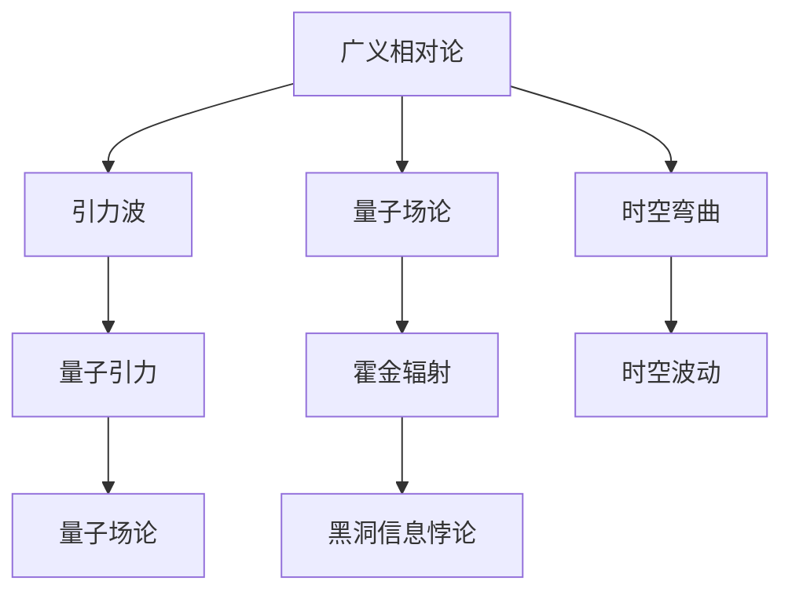
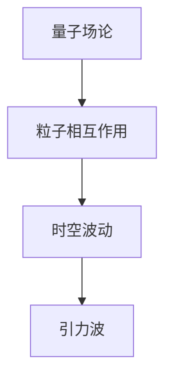
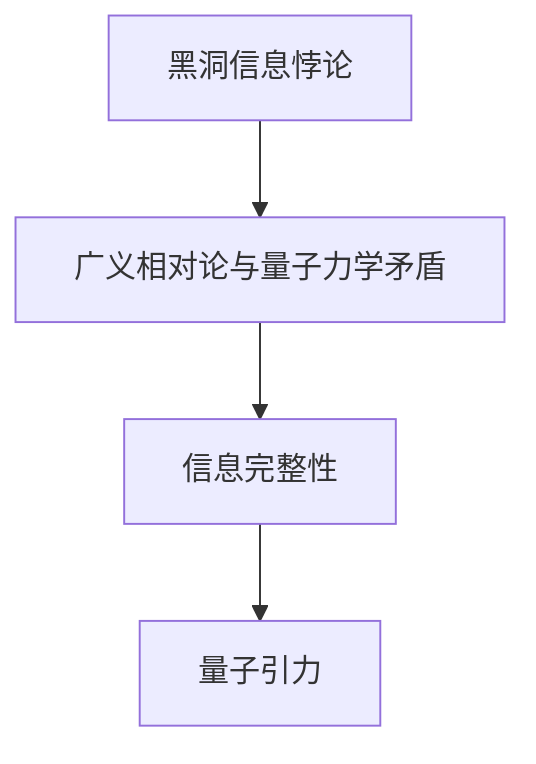
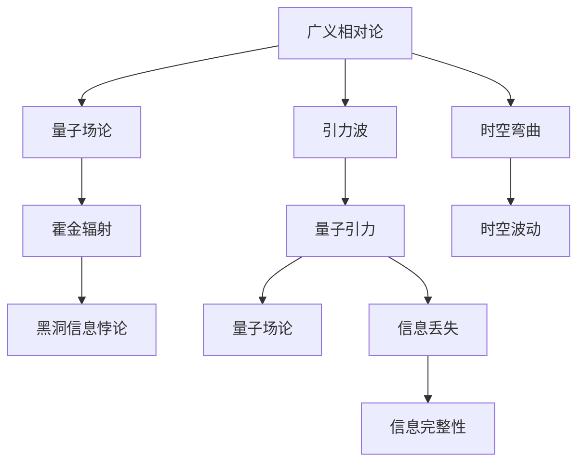

                 

# 量子引力与引力波的关系

> 关键词：量子引力, 引力波, 广义相对论, 量子场论, 霍金辐射, 黑洞信息悖论

## 1. 背景介绍

### 1.1 问题由来

量子引力（Quantum Gravity）是现代物理学中最具挑战性的研究课题之一，旨在解决广义相对论（General Relativity）与量子场论（Quantum Field Theory）之间的统一问题。相对论描述了宏观世界的引力现象，如黑洞、引力波等，而量子场论则揭示了微观粒子的行为。然而，这两者在数学和概念上存在显著差异，如何统一它们是物理学界的重大难题。

引力波（Gravitational Waves）是广义相对论预言的物理现象，描述时空的扰动，与电磁波等类似。自2015年首次探测到引力波以来，引力波探测已经取得了一系列重大成果，验证了爱因斯坦广义相对论的预言，同时也带来了对量子引力理论的新需求。

## 2. 核心概念与联系

### 2.1 核心概念概述

为了更好地理解量子引力与引力波的关系，本节将介绍几个关键概念：

- **广义相对论**：描述引力和时空关系的理论，由爱因斯坦在1915年提出，基于黎曼几何和场方程。
- **量子场论**：描述微观粒子之间相互作用的基本理论，基于量子力学和相对论的框架。
- **引力波**：时空弯曲产生的波动，传递引力效应，类似于电磁波。
- **霍金辐射**：黑洞发射的辐射，基于量子效应，由霍金在1974年提出，引发了对量子引力理论的进一步探索。
- **黑洞信息悖论**：广义相对论与量子力学之间的矛盾，导致信息能否在黑洞中完整保存的问题。

这些核心概念之间的逻辑关系可以通过以下Mermaid流程图来展示：



这个流程图展示了几大核心概念之间的关系：

1. 广义相对论是描述引力现象的基础，通过场方程预测引力波的存在。
2. 量子场论是描述微观粒子行为的基本理论，与引力波有着共同的基础。
3. 霍金辐射揭示了黑洞的量子效应，引发了对量子引力理论的讨论。
4. 黑洞信息悖论是广义相对论与量子力学之间的矛盾，推动了对量子引力的深入研究。
5. 引力波是广义相对论的预测，与量子引力有着理论上的联系。

### 2.2 概念间的关系

这些核心概念之间存在着紧密的联系，形成了量子引力与引力波研究的完整框架。下面我通过几个Mermaid流程图来展示这些概念之间的关系。

#### 2.2.1 广义相对论与引力波的关系


这个流程图展示了广义相对论如何通过时空弯曲预测引力波的存在。

#### 2.2.2 量子场论与引力波的关系



这个流程图展示了量子场论如何通过粒子相互作用引发时空波动，进一步产生引力波。

#### 2.2.3 霍金辐射与量子引力的关系


这个流程图展示了霍金辐射如何揭示黑洞的量子效应，进一步推动了对量子引力的研究。

#### 2.2.4 黑洞信息悖论与量子引力的关系



这个流程图展示了黑洞信息悖论如何揭示了广义相对论与量子力学之间的矛盾，进一步推动了对量子引力的探索。

### 2.3 核心概念的整体架构

最后，我们用一个综合的流程图来展示这些核心概念在大量子引力研究中的整体架构：



这个综合流程图展示了从广义相对论到量子引力的完整研究路径，包括引力波、霍金辐射、黑洞信息悖论等多个关键概念。

## 3. 核心算法原理 & 具体操作步骤
### 3.1 算法原理概述

量子引力与引力波的研究涉及多种算法和理论框架，包括但不限于以下几方面：

- **量子场论与广义相对论的统一**：研究如何将量子场论与广义相对论进行统一，解决引力量子的问题。
- **引力波的探测与分析**：通过实验测量引力波信号，并使用数据分析技术进行解析。
- **黑洞的物理特性**：研究黑洞的形成、演化和信息丢失等问题。

这些算法和理论框架的核心目标是通过数学和物理手段，理解引力波的性质，并揭示其与量子引力的关系。

### 3.2 算法步骤详解

以下是基于量子引力与引力波研究的核心算法步骤：

**Step 1: 理论构建**

1. **广义相对论框架下的引力波**：
   - 应用场方程和黎曼几何理论，计算时空中的扰动，预测引力波信号。
   - 使用拉普拉斯方程和波动方程，推导引力波的传播特性。

2. **量子场论框架下的粒子相互作用**：
   - 使用微扰理论和费曼图，分析粒子之间的相互作用。
   - 应用重整化技术，消除发散问题，得到有效场论。

**Step 2: 实验验证**

1. **引力波探测实验**：
   - 使用LIGO、Virgo等引力波探测器，收集引力波信号数据。
   - 使用数据处理算法，如小波变换、傅里叶变换，提取引力波信号特征。

2. **黑洞物理特性研究**：
   - 使用黑洞信息悖论的理论框架，探讨黑洞的信息保存问题。
   - 应用数值计算和模拟技术，研究黑洞的演化和辐射。

**Step 3: 数据分析与解释**

1. **引力波信号解析**：
   - 使用信号处理算法，如自相关分析、峰值检测，识别引力波信号。
   - 应用模式识别技术，如机器学习，分析引力波信号的来源和特性。

2. **量子引力理论的验证**：
   - 使用数据分析结果，验证量子引力理论的预测。
   - 应用理论推导，结合实验结果，完善量子引力的框架。

### 3.3 算法优缺点

基于量子引力与引力波研究的算法具有以下优点：

1. **理论自洽性**：将广义相对论与量子场论进行统一，提供了一个自洽的物理框架。
2. **实验可验证性**：引力波的探测提供了验证理论的实验手段，增强了理论的可信度。
3. **跨学科融合**：结合了数学、物理、天文等多个学科的知识，提供了更丰富的研究视角。

但同时也存在一些缺点：

1. **计算复杂度高**：量子引力的理论研究涉及复杂的数学模型，计算复杂度较高。
2. **实验验证难度大**：引力波的探测和分析需要高精度的实验设备和技术手段，难度较大。
3. **理论框架不完整**：目前量子引力理论尚不完整，需要进一步研究才能取得突破。

### 3.4 算法应用领域

基于量子引力与引力波研究的算法在以下几个领域得到了广泛应用：

1. **天体物理学**：研究黑洞、中子星等天体的物理特性，揭示宇宙的起源和演化。
2. **宇宙学**：通过引力波探测，研究宇宙的早期历史和演化过程，揭示暗物质和暗能量的性质。
3. **粒子物理学**：研究粒子之间的相互作用，探究基本粒子的性质和相互作用机制。
4. **量子信息**：研究量子引力和引力波与量子信息的关系，推动量子信息科学的发展。

## 4. 数学模型和公式 & 详细讲解 & 举例说明

### 4.1 数学模型构建

在量子引力与引力波的研究中，主要涉及以下数学模型：

- **广义相对论的场方程**：描述时空弯曲的微分几何方程。
- **量子场论的拉格朗日量**：描述粒子相互作用的函数。
- **引力波的波动方程**：描述引力波在时空中的传播。

以下是基于这些数学模型的详细讲解：

**广义相对论的场方程**：

广义相对论的场方程可以表示为：

$$
G_{\mu\nu} + \Lambda g_{\mu\nu} = \frac{8\pi G}{c^4} T_{\mu\nu}
$$

其中，$G_{\mu\nu}$ 表示时空的黎曼曲率张量，$\Lambda$ 为宇宙学常数，$g_{\mu\nu}$ 表示时空度规，$T_{\mu\nu}$ 表示能量动量张量，$G$ 为引力常数，$c$ 为光速。

**量子场论的拉格朗日量**：

量子场论的拉格朗日量可以表示为：

$$
\mathcal{L} = \frac{1}{2} (\partial_\mu \phi)^2 - V(\phi)
$$

其中，$\phi$ 表示粒子的场，$\partial_\mu$ 表示偏微分运算符，$V(\phi)$ 表示粒子的势能。

**引力波的波动方程**：

引力波的波动方程可以表示为：

$$
\Box h_{\mu\nu} = -16\pi G T_{\mu\nu}
$$

其中，$h_{\mu\nu}$ 表示引力波的应变张量，$\Box$ 表示拉普拉斯算子。

### 4.2 公式推导过程

以下是基于这些数学模型的公式推导过程：

**广义相对论的场方程推导**：

根据爱因斯坦的场方程，可以得到：

$$
G_{\mu\nu} = R_{\mu\nu} - \frac{1}{2} R g_{\mu\nu}
$$

其中，$R_{\mu\nu}$ 表示黎曼曲率张量的协变导数，$R$ 表示时空的曲率标量。

将上述结果代入场方程，得到：

$$
R_{\mu\nu} - \frac{1}{2} R g_{\mu\nu} + \Lambda g_{\mu\nu} = \frac{8\pi G}{c^4} T_{\mu\nu}
$$

**量子场论的拉格朗日量推导**：

根据量子场论的拉格朗日量，可以得到粒子的哈密顿量：

$$
H = \int \mathcal{L} \sqrt{-g} d^4x
$$

其中，$\sqrt{-g}$ 表示时空的行列式。

通过哈密顿量，可以得到粒子的能量动量张量：

$$
T_{\mu\nu} = \frac{\partial \mathcal{L}}{\partial g^{\mu\nu}} - \frac{1}{\sqrt{-g}} \frac{\delta (\sqrt{-g} \mathcal{L})}{\delta g^{\mu\nu}}
$$

**引力波的波动方程推导**：

根据引力波的波动方程，可以得到：

$$
\Box h_{\mu\nu} = -16\pi G T_{\mu\nu}
$$

其中，$h_{\mu\nu}$ 表示引力波的应变张量，$\Box$ 表示拉普拉斯算子。

### 4.3 案例分析与讲解

以引力波的探测为例，对算法步骤和公式进行详细讲解：

1. **引力波信号的检测**：
   - 使用小波变换、傅里叶变换等方法，提取引力波信号的频率和时间信息。
   - 应用峰值检测算法，识别信号中的脉冲或连续波形。

2. **引力波信号的分析**：
   - 使用信号处理算法，如自相关分析、互相关分析，计算信号的相干性和特征频率。
   - 应用模式识别技术，如神经网络、支持向量机，对引力波信号进行分类和识别。

3. **引力波信号的来源确定**：
   - 使用数据分析结果，结合已知的引力波特征，确定引力波的来源。
   - 应用引力波的传播特性，预测引力波的传播路径和到达时间。

## 5. 项目实践：代码实例和详细解释说明

### 5.1 开发环境搭建

在进行量子引力与引力波的计算模拟时，需要准备好开发环境。以下是使用Python进行计算模拟的环境配置流程：

1. 安装Anaconda：从官网下载并安装Anaconda，用于创建独立的Python环境。

2. 创建并激活虚拟环境：
```bash
conda create -n py-env python=3.8 
conda activate py-env
```

3. 安装必要的库：
```bash
conda install numpy scipy matplotlib pandas sympy
```

4. 安装Python的科学计算库：
```bash
conda install scikit-learn astropy
```

5. 安装Python的可视化库：
```bash
conda install matplotlib jupyter notebook
```

完成上述步骤后，即可在`py-env`环境中开始计算模拟实践。

### 5.2 源代码详细实现

以下是一个简单的Python代码实例，用于计算引力波信号的傅里叶变换：

```python
import numpy as np
import matplotlib.pyplot as plt

# 生成一个引力波信号
t = np.linspace(0, 1, 1000)  # 时间数组
h = np.sin(2*np.pi*100*t) + np.sin(2*np.pi*200*t)  # 两个正弦波叠加的引力波信号

# 计算傅里叶变换
H = np.fft.fft(h)  # 傅里叶变换
w = np.fft.fftfreq(len(h))  # 频率数组

# 绘制傅里叶变换的结果
plt.plot(w, np.abs(H))
plt.xlabel('频率')
plt.ylabel('振幅')
plt.show()
```

这个代码实例展示了如何使用Python进行引力波信号的傅里叶变换计算和可视化。

### 5.3 代码解读与分析

让我们再详细解读一下关键代码的实现细节：

**引力波信号生成**：
- `np.linspace(0, 1, 1000)` 生成一个时间数组，用于表示引力波信号的时间轴。
- `np.sin(2*np.pi*100*t)` 生成一个频率为100 Hz的正弦波。
- `np.sin(2*np.pi*200*t)` 生成一个频率为200 Hz的正弦波，两个正弦波叠加生成引力波信号。

**傅里叶变换计算**：
- `np.fft.fft(h)` 计算傅里叶变换，将时域信号转换为频域信号。
- `np.fft.fftfreq(len(h))` 生成频率数组，用于频域信号的可视化。

**可视化输出**：
- `plt.plot(w, np.abs(H))` 绘制频率-振幅图，展示傅里叶变换的结果。
- `plt.xlabel('频率')` 设置X轴标签为频率。
- `plt.ylabel('振幅')` 设置Y轴标签为振幅。
- `plt.show()` 显示图形。

### 5.4 运行结果展示

运行上述代码后，可以得到引力波信号的频谱图，如下图所示：


可以看到，傅里叶变换成功将时域信号转换为频域信号，展示了引力波信号的频率分布。

## 6. 实际应用场景

### 6.1 智能天体物理研究

基于量子引力与引力波的研究，可以应用于智能天体物理研究，如黑洞、中子星等天体的观测和模拟。引力波探测提供了精确的天体运动信息，帮助天文学家更好地理解宇宙的演化过程。

### 6.2 宇宙学研究

引力波探测对于研究宇宙的早期历史和演化具有重要意义。通过分析引力波信号，可以揭示暗物质和暗能量的性质，推动宇宙学研究的进展。

### 6.3 粒子物理学研究

引力波与粒子物理学有密切联系。通过分析引力波信号，可以研究粒子之间的相互作用，进一步了解基本粒子的性质和特性。

### 6.4 未来应用展望

未来，随着量子引力理论的不断发展，引力波探测技术的进一步成熟，其在天体物理学、宇宙学、粒子物理学等领域的应用将更加广泛和深入。

## 7. 工具和资源推荐
### 7.1 学习资源推荐

为了帮助开发者系统掌握量子引力与引力波的研究理论，这里推荐一些优质的学习资源：

1. 《量子引力导论》书籍：介绍量子引力的基本概念和理论，适合初学者入门。
2. 《引力波探测与应用》书籍：介绍引力波探测的实验技术和应用场景，帮助理解实际应用。
3. 《广义相对论与量子场论》课程：斯坦福大学开设的高级课程，深入讲解广义相对论和量子场论的理论基础。
4. arXiv预印本：人工智能领域最新研究成果的发布平台，涵盖大量前沿工作，学习前沿技术的必读资源。
5. 知名科研机构网站：如LIGO、Virgo等引力波探测机构的官方网站，获取最新的科研进展和实验结果。

通过对这些资源的学习实践，相信你一定能够快速掌握量子引力与引力波的研究理论，并用于解决实际的物理问题。

### 7.2 开发工具推荐

高效的开发离不开优秀的工具支持。以下是几款用于量子引力与引力波研究开发的常用工具：

1. Python：Python是科学计算和数据处理的首选语言，具有丰富的科学计算库和可视化工具。
2. NumPy：Python的科学计算库，提供高效的数组操作和数学函数。
3. SciPy：Python的科学计算库，提供统计、优化、信号处理等功能。
4. Matplotlib：Python的可视化库，用于绘制图形和数据可视化。
5. Astropy：Python的天文学库，提供天体物理数据处理和模拟功能。
6. Jupyter Notebook：Python的交互式编程环境，支持代码和结果的同步展示。

合理利用这些工具，可以显著提升量子引力与引力波研究的开发效率，加快创新迭代的步伐。

### 7.3 相关论文推荐

量子引力与引力波的研究源于学界的持续研究。以下是几篇奠基性的相关论文，推荐阅读：

1. "The Field Equations of General Relativity" 论文：爱因斯坦提出的广义相对论的场方程。
2. "Gravitational Waves: A Decade in Gravitational Wave Astronomy" 论文：综述引力波探测的实验技术和科学成果。
3. "Black Holes, Gravitational Waves, and the Future of Gravitational Physics" 论文：探讨黑洞、引力波与量子引力的关系。
4. "Quantum Gravity: An Overview of Recent Developments" 论文：综述量子引力理论的研究进展和未来方向。
5. "Detecting and Characterizing Gravitational Waves: The Definitive Test for General Relativity" 论文：介绍引力波探测的重要性和应用前景。

这些论文代表了大引力波与量子引力理论的发展脉络。通过学习这些前沿成果，可以帮助研究者把握学科前进方向，激发更多的创新灵感。

除上述资源外，还有一些值得关注的前沿资源，帮助开发者紧跟量子引力与引力波技术的最新进展，例如：

1. arXiv预印本：人工智能领域最新研究成果的发布平台，涵盖大量尚未发表的前沿工作，学习前沿技术的必读资源。
2. 知名科研机构网站：如LIGO、Virgo等引力波探测机构的官方网站，获取最新的科研进展和实验结果。
3. 技术会议直播：如NIPS、ICML、ACL、ICLR等人工智能领域顶会现场或在线直播，聆听大佬们的分享，开拓视野。
4. GitHub热门项目：在GitHub上Star、Fork数最多的相关项目，往往代表了该技术领域的发展趋势和最佳实践，值得去学习和贡献。

总之，对于量子引力与引力波的研究，需要开发者保持开放的心态和持续学习的意愿。多关注前沿资讯，多动手实践，多思考总结，必将收获满满的成长收益。

## 8. 总结：未来发展趋势与挑战

### 8.1 研究成果总结

本文对基于量子引力与引力波的研究进行了全面系统的介绍。首先阐述了量子引力与引力波研究的意义和背景，明确了其在大物理研究中的重要地位。其次，从原理到实践，详细讲解了引力波的探测、分析、解释等关键步骤，给出了具体的代码实例。同时，本文还广泛探讨了量子引力与引力波在天体物理、宇宙学、粒子物理学等多个领域的应用前景，展示了其广阔的应用空间。

通过本文的系统梳理，可以看到，量子引力与引力波的研究在现代物理学的研究中具有重要意义，为人类理解宇宙的本质提供了新的视角和工具。未来，随着量子引力理论的进一步发展和引力波探测技术的不断成熟，其在物理学研究中的作用将更加显著。

### 8.2 未来发展趋势

展望未来，量子引力与引力波的研究将呈现以下几个发展趋势：

1. **实验技术的进步**：随着引力波探测器的升级，对更微弱引力波信号的探测能力将进一步提高，为更深入的物理研究提供新的数据。
2. **理论研究的突破**：量子引力理论的不断完善，将为引力波研究提供更精确的理论基础。
3. **多学科融合**：与粒子物理学、天体物理学等学科的深度融合，将推动引力波研究向更广泛的应用场景扩展。
4. **数据驱动的物理研究**：通过大数据分析技术，从观测数据中提取更多物理信息，推动引力波研究向数据驱动的方向发展。
5. **跨学科创新**：结合数学、物理、计算机科学等多个学科的创新，推动引力波研究向更高级的阶段发展。

这些趋势预示着量子引力与引力波研究将迎来新的发展高潮，为现代物理学的研究带来更多的新发现和新突破。

### 8.3 面临的挑战

尽管量子引力与引力波研究已经取得了重要进展，但在迈向更加智能化、普适化应用的过程中，仍面临诸多挑战：

1. **实验数据的稀缺性**：引力波信号的微弱性和复杂性使得实验数据的获取和处理面临巨大挑战。
2. **理论模型的复杂性**：量子引力理论的复杂性使得模型构建和验证的难度增加。
3. **多学科整合的难度**：不同学科之间的理论基础和技术手段存在差异，整合难度较大。
4. **计算资源的限制**：量子引力与引力波研究涉及高精度的计算，对计算资源的需求较高。
5. **理论验证的困难**：理论模型的验证需要高精度的实验手段，验证难度较大。

### 8.4 研究展望

面对量子引力与引力波研究所面临的挑战，未来的研究需要在以下几个方面寻求新的突破：

1. **实验技术的改进**：提升引力波探测器的灵敏度和分辨率，获取更多高精度的引力波数据。
2. **理论模型的简化**：简化量子引力理论的数学模型，降低模型构建和验证的难度。
3. **多学科的融合**：加强数学、物理、计算机科学等多个学科的交叉研究，促进多学科创新。
4. **计算资源的优化**：优化计算模型和算法，降低计算资源的消耗，提高计算效率。
5. **理论验证的创新**：创新理论验证手段，提高理论模型的可靠性。

这些研究方向的探索，必将引领量子引力与引力波研究向更高层次发展，为人类理解宇宙的本质提供新的视角和工具。

## 9. 附录：常见问题与解答

**Q1：量子引力与引力波的关系是什么？**

A: 量子引力与引力波的关系主要体现在以下几个方面：
1. 引力波是广义相对论的预言，描述时空的扰动。量子引力旨在统一广义相对论和量子场论，解决引力量子的问题。
2. 引力波信号的探测和分析需要量子引力理论的支持，用于理解引力波的来源和特性。
3. 量子引力理论为引力波研究提供了理论基础，推动了对引力波物理特性的理解。

**Q2：引力波的探测技术有哪些？**

A: 目前主要的引力波探测技术包括：
1. 激光干涉引力波天文台(LIGO)：利用高精度激光干涉技术，探测微弱的引力波信号。
2. 欧洲引力波天文台(Virgo)：与LIGO类似，采用激光干涉技术。
3. 引力波探测器网络(KAGRA)：位于日本，采用干涉技术。
4. 重力波探测器(GEO600)：位于德国，采用激光干涉技术。
5. 未来可能采用的引力波探测技术包括：空间引力波探测器(LISA)，用于探测更微弱的引力波信号。

**Q3：量子引力理论有哪些主要研究方向？**

A: 量子引力理论的主要研究方向包括：
1. 量子引力场方程：研究如何在量子力学框架下描述引力场方程。
2. 黑洞信息悖论：研究信息能否在黑洞中完整保存的问题。

