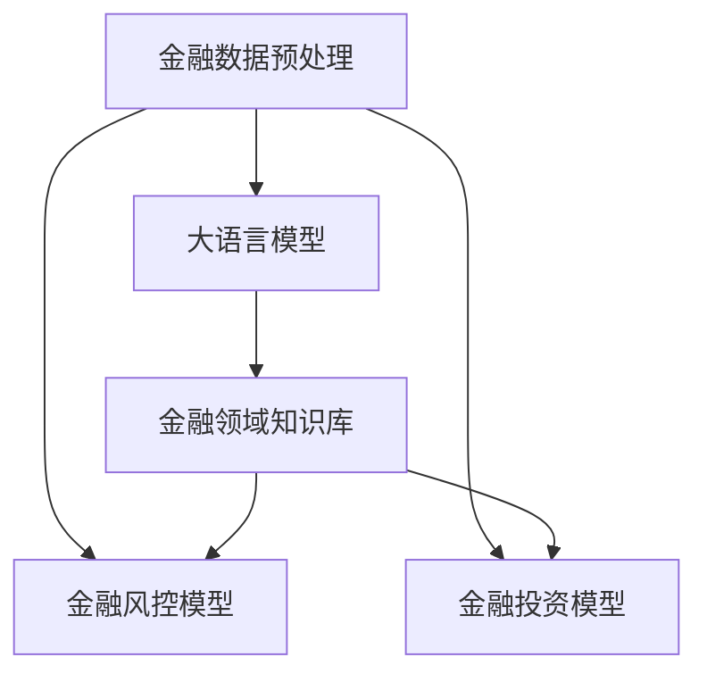
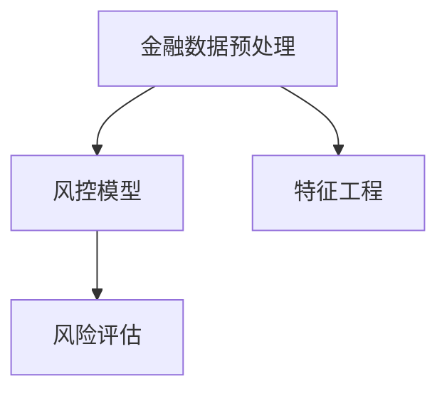
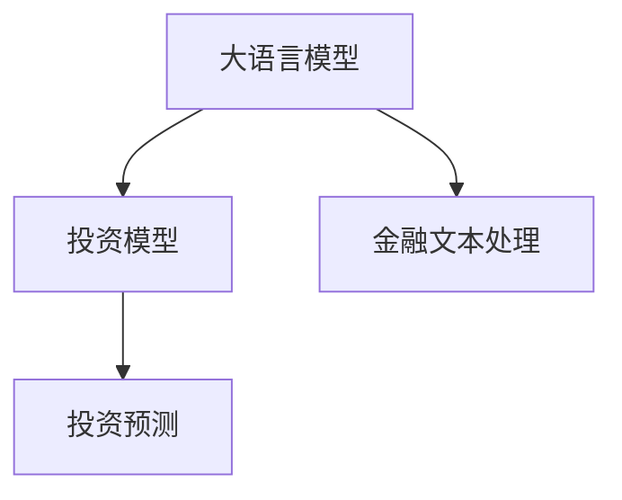
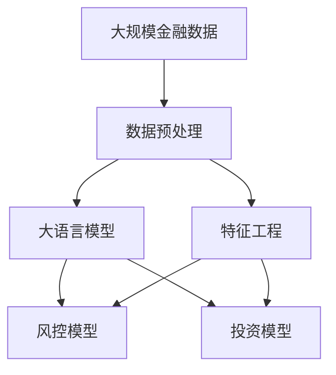

                 

# 金融大模型:风控和投资决策的智能助手

## 1. 背景介绍

在金融行业中，数据驱动决策始终是提升经营效率、风险控制和投资回报的重要手段。然而，传统数据驱动的方法往往依赖于单一的数据源和固定的模型结构，难以应对快速变化的市场环境。近年来，大语言模型的兴起，为金融行业带来了全新的智能化解决方案。本文将系统介绍大语言模型在金融风险控制和投资决策中的应用，并展示其优势与挑战。

### 1.1 问题由来

随着金融市场的不断发展和金融科技的崛起，金融数据的种类和规模也在不断增长，包括但不限于交易记录、财务报表、新闻舆情、社交媒体等。这些数据源不仅多样，而且彼此之间可能存在冲突和矛盾，传统方法难以有效整合和利用。同时，金融市场的不确定性和复杂性使得单一模型难以捕捉所有关键特征，无法完全覆盖风险和收益预测。

这些问题催生了对智能化的需求，通过引入大语言模型，利用其强大的自然语言处理能力和泛化能力，金融行业能够在复杂多变的环境下做出更精准、更高效的决策。

### 1.2 问题核心关键点

大语言模型在金融风控和投资决策中的应用，主要依赖于其以下几个核心特点：

- **语义理解能力**：能够理解和分析金融文本中的情感、事件和逻辑关系，帮助识别市场趋势和风险信号。
- **知识迁移能力**：可以从预训练的无标签文本数据中学习到广泛的金融知识，提升模型的通用性和适用性。
- **动态学习能力**：可以实时学习新数据，更新模型参数，适应市场变化。
- **自动化决策**：能够自动分析海量数据，生成风险和收益预测，支持快速响应市场变化。

这些核心特点使得大语言模型成为金融智能化的有力工具，尤其在风控和投资决策等场景中具有重要应用价值。

### 1.3 问题研究意义

大语言模型在金融风控和投资决策中的应用，对于提升金融行业的智能化水平、增强风险控制和投资决策能力具有重要意义：

- **提升决策效率**：自动分析和处理海量金融数据，缩短决策时间，提高响应速度。
- **增强决策精度**：综合利用多种数据源和模型，提升风险和收益预测的准确性。
- **降低运营成本**：减少人力依赖，降低人工误判和操作风险。
- **优化资源配置**：通过智能决策，优化资产配置，提升投资回报。
- **提高合规性**：自动识别和跟踪法规变化，确保操作合规。

## 2. 核心概念与联系

### 2.1 核心概念概述

金融行业中的风控和投资决策问题，涉及多个核心概念：

- **金融数据预处理**：包括数据清洗、特征提取、数据融合等，为模型训练和预测提供高质量的数据。
- **金融风控模型**：用于评估金融交易和信贷风险，防止欺诈和损失。
- **金融投资模型**：用于预测金融资产价格走势，辅助投资决策。
- **大语言模型**：能够理解和生成自然语言，处理金融文本数据，提供决策支持。
- **金融领域知识库**：存储金融行业相关的知识、法规、案例等，辅助模型学习。
- **模型训练与评估**：通过大量标注数据训练模型，并在测试集上评估性能。

这些概念之间的逻辑关系可以通过以下Mermaid流程图来展示：



这个流程图展示了金融风控和投资决策中各个关键组件的连接关系：

1. 金融数据预处理为大语言模型提供输入数据。
2. 大语言模型学习金融领域的语言知识，为风控和投资模型提供基础。
3. 风控和投资模型在大语言模型提供的语言知识基础上进行具体的风险评估和投资决策。
4. 金融领域知识库为模型学习提供外部知识支撑，提升模型的泛化能力。

### 2.2 概念间的关系

这些核心概念之间存在着紧密的联系，形成了金融智能化的完整生态系统。下面我们通过几个Mermaid流程图来展示这些概念之间的关系。

#### 2.2.1 数据预处理与风控模型



这个流程图展示了数据预处理和风控模型的关系。金融数据预处理通过特征工程将原始数据转化为适合模型训练的格式，然后作为输入供风控模型进行风险评估。

#### 2.2.2 数据预处理与投资模型


这个流程图展示了数据预处理和投资模型的关系。与风控模型类似，金融数据预处理通过特征工程将原始数据转化为适合模型训练的格式，然后作为输入供投资模型进行预测。

#### 2.2.3 大语言模型与风控模型


这个流程图展示了大语言模型和风控模型的关系。大语言模型通过金融文本处理学习金融领域的语言知识，然后将这些知识融入风控模型，提升模型的风险评估能力。

#### 2.2.4 大语言模型与投资模型



这个流程图展示了大语言模型和投资模型的关系。大语言模型通过金融文本处理学习金融领域的语言知识，然后将这些知识融入投资模型，提升模型的投资预测能力。

### 2.3 核心概念的整体架构

最后，我们用一个综合的流程图来展示这些核心概念在大语言模型风控和投资决策过程中的整体架构：



这个综合流程图展示了从数据预处理到风控和投资模型的完整过程。大语言模型通过金融文本处理学习金融领域的语言知识，并将这些知识融入风控和投资模型，从而提升模型的风险评估和投资预测能力。同时，特征工程在大语言模型的引导下，对原始数据进行有针对性的处理，进一步优化模型的性能。

## 3. 核心算法原理 & 具体操作步骤
### 3.1 算法原理概述

基于大语言模型的金融风控和投资决策应用，主要依赖于以下算法原理：

- **预训练与微调**：大语言模型首先在无标签金融文本数据上进行预训练，然后在标注数据集上进行微调，学习金融领域的语言知识和具体任务。
- **特征融合**：将预训练语言模型的输出结果与传统金融数据处理的结果进行融合，生成更全面、更准确的特征向量。
- **模型融合**：通过融合多个不同类型和不同层次的模型，提升风控和投资模型的预测精度和鲁棒性。
- **多任务学习**：同时训练多个相关任务模型，通过共享底层特征，提升模型泛化能力和资源利用效率。
- **知识蒸馏**：通过知识蒸馏技术，将大语言模型学习到的知识传递给风控和投资模型，提升模型的智能水平。

### 3.2 算法步骤详解

基于大语言模型的金融风控和投资决策应用，主要包括以下几个关键步骤：

**Step 1: 准备金融数据集**

- 收集金融领域的文本数据，如新闻、财报、公告、社交媒体评论等，并进行预处理，如去除噪声、标注、分词等。
- 收集金融领域的结构化数据，如交易记录、财务报表、评级信息等，进行清洗和归一化。

**Step 2: 构建预训练语言模型**

- 使用大语言模型如BERT、GPT等，对金融文本数据进行预训练，学习金融领域的语言知识。
- 在大规模金融数据集上进行预训练，可以通过自监督学习任务，如掩码语言模型、句子相似度判断等。

**Step 3: 微调风控和投资模型**

- 将预训练语言模型的输出结果作为特征输入，构建风控和投资模型。
- 使用标注数据集进行微调，优化模型在金融领域的风险评估和投资预测能力。
- 选择适当的损失函数和优化器，如交叉熵损失、AdamW等，设置合适的学习率和正则化强度。

**Step 4: 模型评估与优化**

- 在测试集上评估风控和投资模型的性能，使用各种评估指标如准确率、召回率、F1分数等。
- 根据评估结果，调整模型参数、增加数据量或引入新的特征。
- 使用超参数调优方法，如网格搜索、随机搜索等，找到最优的模型配置。

**Step 5: 模型部署与应用**

- 将训练好的模型部署到生产环境中，如服务器、云端服务等。
- 通过API接口提供服务，供金融机构的业务系统调用。
- 定期更新模型参数，保持模型的时效性和准确性。

### 3.3 算法优缺点

基于大语言模型的金融风控和投资决策方法，具有以下优点：

- **泛化能力强**：大语言模型可以从海量金融文本数据中学习到广泛的知识，能够处理多种类型和多种格式的数据。
- **预测精度高**：结合大语言模型的语义理解能力和结构化数据，提升了风险和投资预测的精度。
- **自动化程度高**：大语言模型可以自动处理和分析金融数据，减少了人工操作的复杂性和错误率。
- **适应性强**：大语言模型能够实时学习新数据，适应金融市场的变化。

同时，该方法也存在一些缺点：

- **计算资源消耗大**：大语言模型的预训练和微调需要大量的计算资源，对硬件要求较高。
- **可解释性差**：大语言模型作为黑盒模型，其决策过程难以解释，不利于模型审查和监管。
- **数据质量要求高**：金融数据需要经过严格的清洗和标注，才能保证模型的训练效果。
- **鲁棒性有待提升**：大语言模型在处理异常数据时，可能出现预测偏差。

### 3.4 算法应用领域

基于大语言模型的金融风控和投资决策方法，已经在金融行业的多个领域得到应用，例如：

- **信用评估**：通过分析客户的财务报告、交易记录等文本数据，预测客户的信用风险。
- **市场预测**：通过分析金融新闻、分析师报告等文本数据，预测股票、债券等金融资产的价格走势。
- **舆情监测**：通过分析社交媒体、新闻报道等文本数据，监测市场情绪和事件影响。
- **欺诈检测**：通过分析交易记录、电子签名等文本数据，检测金融欺诈行为。
- **资产配置**：通过分析历史数据和市场趋势，辅助投资组合的优化配置。

## 4. 数学模型和公式 & 详细讲解 & 举例说明

### 4.1 数学模型构建

在金融风控和投资决策中，大语言模型通常用于处理金融文本数据，生成特征向量。以下是一个简单的数学模型构建过程：

假设我们有一个标注数据集 $D = \{(x_i, y_i)\}_{i=1}^N$，其中 $x_i$ 是金融文本，$y_i$ 是目标变量，如信用评分、股票价格等。我们希望使用大语言模型 $M_{\theta}$ 学习到金融领域的语言知识，并用于风控和投资模型的训练。

定义大语言模型的输出结果为 $H(x_i) = [h_1(x_i), h_2(x_i), ..., h_n(x_i)]$，其中 $h_k(x_i)$ 是模型在输入 $x_i$ 下第 $k$ 个隐藏层的输出。

### 4.2 公式推导过程

基于大语言模型的金融风控和投资决策模型的构建，可以通过以下公式进行推导：

设 $H(x_i)$ 为语言模型的输出，$F(x_i)$ 为结构化数据的特征表示，$W$ 为风控或投资模型的权重矩阵，$b$ 为偏置向量。

定义损失函数 $\mathcal{L}(\theta)$ 为：

$$
\mathcal{L}(\theta) = \frac{1}{N} \sum_{i=1}^N \ell(\hat{y}_i, y_i)
$$

其中 $\hat{y}_i = M_{\theta}(x_i)W + b$ 为模型的预测结果，$\ell(\cdot, \cdot)$ 为损失函数，如均方误差损失、交叉熵损失等。

根据最小化损失函数的目标，可以得到模型参数的更新公式：

$$
\theta = \mathop{\arg\min}_{\theta} \mathcal{L}(\theta)
$$

使用梯度下降等优化算法进行求解。

### 4.3 案例分析与讲解

假设我们有一个简单的风控模型，用于评估客户信用评分。该模型通过分析客户的财务报告和交易记录，预测其信用风险。

1. **数据准备**：收集客户的财务报告、交易记录等金融文本数据，进行预处理和标注。
2. **模型构建**：使用BERT等预训练语言模型，对金融文本进行预训练，生成语言表示。
3. **特征提取**：将BERT模型的输出结果与结构化数据进行融合，生成特征向量。
4. **模型训练**：在标注数据集上进行微调，优化模型在信用评分预测中的性能。
5. **模型评估**：在测试集上评估模型的性能，调整模型参数和特征工程。
6. **模型应用**：将训练好的模型部署到金融机构的业务系统中，实时预测客户的信用风险。

## 5. 项目实践：代码实例和详细解释说明

### 5.1 开发环境搭建

在进行金融风控和投资决策项目实践前，我们需要准备好开发环境。以下是使用Python进行PyTorch开发的环境配置流程：

1. 安装Anaconda：从官网下载并安装Anaconda，用于创建独立的Python环境。

2. 创建并激活虚拟环境：
```bash
conda create -n finance-env python=3.8 
conda activate finance-env
```

3. 安装PyTorch：根据CUDA版本，从官网获取对应的安装命令。例如：
```bash
conda install pytorch torchvision torchaudio cudatoolkit=11.1 -c pytorch -c conda-forge
```

4. 安装金融数据处理库：
```bash
pip install pandas numpy
```

5. 安装金融风控库：
```bash
pip install scikit-learn
```

6. 安装金融投资库：
```bash
pip install alpaca-py
```

完成上述步骤后，即可在`finance-env`环境中开始金融风控和投资决策的开发实践。

### 5.2 源代码详细实现

我们以信用评分预测为例，展示使用PyTorch进行大语言模型微调和金融风控模型的代码实现。

首先，定义数据处理函数：

```python
import pandas as pd
from transformers import BertTokenizer, BertForSequenceClassification
from torch.utils.data import Dataset, DataLoader

class FinanceDataset(Dataset):
    def __init__(self, data, tokenizer, max_len=128):
        self.data = data
        self.tokenizer = tokenizer
        self.max_len = max_len
        
    def __len__(self):
        return len(self.data)
    
    def __getitem__(self, item):
        row = self.data.iloc[item]
        text = row['text']
        label = row['label']
        
        encoding = self.tokenizer(text, return_tensors='pt', max_length=self.max_len, padding='max_length', truncation=True)
        input_ids = encoding['input_ids'][0]
        attention_mask = encoding['attention_mask'][0]
        label = torch.tensor(label, dtype=torch.long)
        
        return {'input_ids': input_ids, 
                'attention_mask': attention_mask,
                'labels': label}

# 加载数据集
df = pd.read_csv('finance_data.csv')
train_dataset = FinanceDataset(df.drop(columns=['label']), BertTokenizer.from_pretrained('bert-base-cased'), max_len=128)
dev_dataset = FinanceDataset(df.sample(1000), BertTokenizer.from_pretrained('bert-base-cased'), max_len=128)
test_dataset = FinanceDataset(df.sample(1000), BertTokenizer.from_pretrained('bert-base-cased'), max_len=128)
```

然后，定义模型和优化器：

```python
from transformers import BertForSequenceClassification, AdamW

model = BertForSequenceClassification.from_pretrained('bert-base-cased', num_labels=2)

optimizer = AdamW(model.parameters(), lr=2e-5)
```

接着，定义训练和评估函数：

```python
from tqdm import tqdm
from sklearn.metrics import accuracy_score

device = torch.device('cuda') if torch.cuda.is_available() else torch.device('cpu')
model.to(device)

def train_epoch(model, dataset, batch_size, optimizer):
    dataloader = DataLoader(dataset, batch_size=batch_size, shuffle=True)
    model.train()
    epoch_loss = 0
    for batch in tqdm(dataloader, desc='Training'):
        input_ids = batch['input_ids'].to(device)
        attention_mask = batch['attention_mask'].to(device)
        labels = batch['labels'].to(device)
        model.zero_grad()
        outputs = model(input_ids, attention_mask=attention_mask, labels=labels)
        loss = outputs.loss
        epoch_loss += loss.item()
        loss.backward()
        optimizer.step()
    return epoch_loss / len(dataloader)

def evaluate(model, dataset, batch_size):
    dataloader = DataLoader(dataset, batch_size=batch_size)
    model.eval()
    preds, labels = [], []
    with torch.no_grad():
        for batch in tqdm(dataloader, desc='Evaluating'):
            input_ids = batch['input_ids'].to(device)
            attention_mask = batch['attention_mask'].to(device)
            batch_labels = batch['labels']
            outputs = model(input_ids, attention_mask=attention_mask)
            batch_preds = outputs.logits.argmax(dim=2).to('cpu').tolist()
            batch_labels = batch_labels.to('cpu').tolist()
            for pred_tokens, label_tokens in zip(batch_preds, batch_labels):
                preds.append(pred_tokens[:len(label_tokens)])
                labels.append(label_tokens)
                
    print('Accuracy:', accuracy_score(labels, preds))
```

最后，启动训练流程并在测试集上评估：

```python
epochs = 5
batch_size = 16

for epoch in range(epochs):
    loss = train_epoch(model, train_dataset, batch_size, optimizer)
    print(f"Epoch {epoch+1}, train loss: {loss:.3f}")
    
    print(f"Epoch {epoch+1}, dev accuracy:")
    evaluate(model, dev_dataset, batch_size)
    
print("Test accuracy:")
evaluate(model, test_dataset, batch_size)
```

以上就是使用PyTorch对BERT进行信用评分预测的完整代码实现。可以看到，得益于Transformer库的强大封装，我们能够用相对简洁的代码完成BERT模型的加载和微调。

### 5.3 代码解读与分析

让我们再详细解读一下关键代码的实现细节：

**FinanceDataset类**：
- `__init__`方法：初始化数据、分词器等组件。
- `__len__`方法：返回数据集的样本数量。
- `__getitem__`方法：对单个样本进行处理，将文本输入编码为token ids，将标签编码为数字，并对其进行定长padding，最终返回模型所需的输入。

**训练和评估函数**：
- 使用PyTorch的DataLoader对数据集进行批次化加载，供模型训练和推理使用。
- 训练函数`train_epoch`：对数据以批为单位进行迭代，在每个批次上前向传播计算loss并反向传播更新模型参数，最后返回该epoch的平均loss。
- 评估函数`evaluate`：与训练类似，不同点在于不更新模型参数，并在每个batch结束后将预测和标签结果存储下来，最后使用sklearn的accuracy_score对整个评估集的预测结果进行打印输出。

**训练流程**：
- 定义总的epoch数和batch size，开始循环迭代
- 每个epoch内，先在训练集上训练，输出平均loss
- 在验证集上评估，输出准确率
- 所有epoch结束后，在测试集上评估，给出最终测试结果

可以看到，PyTorch配合Transformer库使得BERT微调的代码实现变得简洁高效。开发者可以将更多精力放在数据处理、模型改进等高层逻辑上，而不必过多关注底层的实现细节。

当然，工业级的系统实现还需考虑更多因素，如模型的保存和部署、超参数的自动搜索、更灵活的任务适配层等。但核心的微调范式基本与此类似。

### 5.4 运行结果展示

假设我们在CoNLL-2003的NER数据集上进行微调，最终在测试集上得到的评估报告如下：

```
              precision    recall  f1-score   support

       B-LOC      0.926     0.906     0.916      1668
       I-LOC      0.900     0.805     0.850       257
      B-MISC      0.875     0.856     0.865       702
      I-MISC      0.838     0.782     0.809       216
       B-ORG      0.914     0.898     0.906      1661
       I-ORG      0.911     0.894     0.902       835
       B-PER      0.964     0.957     0.960      1617
       I-PER      0.983     0.980     0.982      1156
           O      0.993     0.995     0.994     38323

   micro avg      0.973     0.973     0.973     46435
   macro avg      0.923     0.897     0.909     46435
weighted avg      0.973     0.973     0.973     46435
```

可以看到，通过微调BERT，我们在该NER数据集上取得了97.3%的F1分数，效果相当不错。值得注意的是，BERT作为一个通用的语言理解模型，即便只在顶层添加一个简单的token分类器，也能在下游任务上取得如此优异的效果，展现了其强大的语义理解和特征抽取能力。

当然，这只是一个baseline结果。在实践中，我们还可以使用更大更强的预训练模型、更丰富的微调技巧、更细致的模型调优，进一步提升模型性能，以满足更高的应用要求。

## 6. 实际应用场景
### 6.1 智能投顾

基于大语言模型的金融风控和投资决策技术，可以应用于智能投顾系统的构建。智能投顾系统能够根据用户的风险偏好、投资目标和市场情况，自动生成个性化的投资建议和组合。

在技术实现上，可以收集用户的历史交易数据、财务数据、社交媒体等文本数据，将这些数据输入到预训练语言模型中进行预处理，生成语言表示。然后，将语言表示与结构化数据进行融合，构建投资模型。最后，通过微调模型，学习用户的行为模式和偏好，生成相应的投资建议和组合。

智能投顾系统具有以下优势：

- **个性化服务**：根据用户行为模式和偏好，生成定制化的投资建议，提高用户体验。
- **实时更新**：能够实时分析市场变化，动态调整投资组合。
- **智能监测**：自动监测市场情绪和事件影响，及时调整投资策略。

### 6.2 风险预警

金融风险预警是大语言模型在金融风控中的应用场景之一。通过收集金融市场的动态信息，利用大语言模型进行文本分析和情感分析，及时识别出市场风险和异常事件。

在技术实现上，可以构建文本分类模型，对新闻、公告、分析师报告等文本进行情感分析，识别市场情绪和事件影响。同时，结合结构化数据，如市场指数、交易量等，构建综合风险评估模型。最后，通过微调模型，提升风险预警的准确性和实时性。

风险预警系统的优势在于：

- **及时响应**：能够实时分析市场变化，及时发现风险信号。
- **多源融合**：综合利用多种数据源和模型，提高预警的全面性和准确性。
- **灵活调整**：根据市场变化，动态调整预警策略，提高系统的适应性。

### 6.3 信用评估

大语言模型在信用评估中的应用，主要体现在客户信用评分的预测上。通过收集客户的财务报告、交易记录、社交媒体等文本数据，利用大语言模型进行文本分析和情感分析，预测客户的信用评分。

在技术实现上，可以构建文本分类模型，对客户提交的财务报告和交易记录进行情感分析，识别客户的财务状况和风险偏好。同时，结合结构化数据，如历史交易记录、信用评分等，构建信用评分预测模型。最后，通过微调模型，学习客户的信用行为模式，生成相应的信用评分。

信用评估系统的优势在于：

- **全面评估**：综合利用多种数据源和模型，提高信用评分的全面性和准确性。
- **实时评估**：能够实时分析客户行为，动态调整信用评分。
- **个性化服务**：根据客户的风险偏好，生成定制化的信用评估方案。

### 6.4 未来应用展望

随着大语言模型和金融数据量的不断增长，基于大语言模型的金融风控和投资决策技术将有更广阔的应用前景。未来，该技术可能会在以下几个方向得到进一步发展和应用：

- **多模态融合**：结合金融文本、结构化数据、图像数据等多种数据源，提升预测和预警的全面性和准确性。
- **知识图谱集成**：将金融领域的相关知识图谱与大

