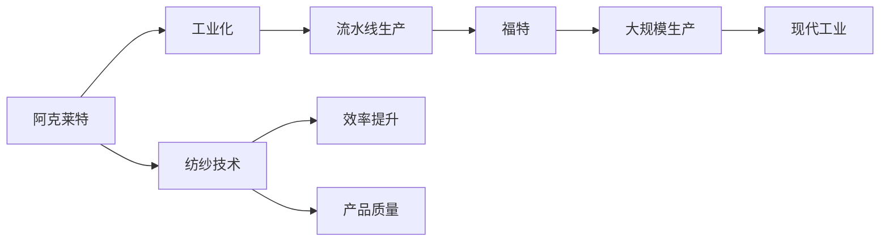

                 

# 阿克莱特与福特的工业革命贡献

## 1. 背景介绍

### 1.1 问题由来

工业革命是人类历史上的一个重大转折点，它不仅标志着生产方式的根本变革，还对社会结构、经济制度以及人类文明产生了深远影响。其中，阿克莱特（Richard Arkwright）和福特（Henry Ford）是两位极具代表性的人物，他们的贡献在很大程度上推动了工业革命的发展。本文将重点探讨阿克莱特和福特在工业革命中的贡献，并分析其对工业化进程和现代工业的影响。

### 1.2 问题核心关键点

阿克莱特和福特都是工业革命时期的杰出发明家和企业家，他们分别通过不同的创新推动了工业化的进程。阿克莱特以其创新的纺纱技术而闻名，福特则以大规模生产线和流水线的方式彻底改变了制造业的生产模式。本文将从他们的创新实践、技术突破以及社会经济影响等方面，全面分析他们的贡献。

### 1.3 问题研究意义

阿克莱特和福特在工业革命中的贡献，不仅推动了生产方式的革新，也为后续的工业化奠定了基础。他们的创新实践不仅在当时产生了深远的影响，也为现代工业提供了宝贵的经验和启示。本文将探讨他们在工业革命中的重要角色和历史地位，为后续对工业化和技术创新的研究提供参考。

## 2. 核心概念与联系

### 2.1 核心概念概述

为了更好地理解阿克莱特和福特的贡献，本节将介绍几个核心概念：

- **纺纱技术**：指将原始纤维转化为纺织品的加工过程，是纺织工业的基础。阿克莱特通过改进纺纱技术，极大地提高了生产效率和产品质量。
- **流水线生产**：指在生产线上将各个加工环节按顺序排列，每个工人只负责其中一部分工作，从而大幅提高生产效率和标准化程度。福特通过引入流水线生产方式，使大规模生产成为可能。
- **工业化**：指通过机械化、电气化等方式，大规模、标准化地生产商品和服务，推动经济和社会的发展。

这些核心概念之间的联系是通过技术创新和产业变革来实现的，阿克莱特和福特的贡献正是这种联系的典型代表。

### 2.2 概念间的关系

阿克莱特和福特的贡献可以通过以下流程图来展示：



这个流程图展示了阿克莱特和福特对工业化进程的贡献路径：

1. 阿克莱特通过改进纺纱技术，提高了效率和产品质量。
2. 工业化进程得到推动。
3. 福特引入流水线生产，使大规模生产成为可能。
4. 现代工业得以形成和发展。

这些概念共同构成了工业革命的核心内容，是理解阿克莱特和福特贡献的关键。

## 3. 核心算法原理 & 具体操作步骤

### 3.1 算法原理概述

阿克莱特和福特的贡献主要体现在他们对工业革命的技术突破和产业创新上。他们的创新实践展示了工业化过程中技术创新对生产效率和经济增长的巨大推动作用。

**阿克莱特**：通过纺纱技术的创新，阿克莱特极大地提高了纺织业的生产效率和产品质量。其核心在于采用水和机械动力驱动纺纱机，取代了传统的手工操作，从而大幅提升了生产速度和产量。

**福特**：通过流水线生产方式，福特使得制造业的生产效率得到了质的飞跃。其核心在于将生产流程分解为多个简单的步骤，每个工人只负责其中的一部分，从而实现了大规模生产的目标。

### 3.2 算法步骤详解

阿克莱特和福特的创新实践主要包括以下几个步骤：

**阿克莱特**：

1. **研发新型纺纱机**：阿克莱特发明了“水力纺纱机”，利用水力驱动，提高了纺纱速度和效率。
2. **建立纺纱厂**：在德比郡建立“克伦普顿工厂”，大规模生产纺织品。
3. **推广纺纱技术**：通过展示和示范，将纺纱技术推广到其他地区和工厂。

**福特**：

1. **研发装配线**：福特在汽车制造中引入了装配线技术，将生产流程分解为多个简单步骤，每个工人只负责其中的一部分。
2. **建立流水线**：在密歇根州的福特汽车工厂建立大规模流水线，实现大规模生产。
3. **推广流水线技术**：将流水线技术应用到其他制造业领域，推广到全球。

### 3.3 算法优缺点

阿克莱特和福特的创新实践在提高生产效率、降低生产成本、促进工业化进程等方面起到了重要作用，但也存在一些局限性：

**阿克莱特**：

- **优点**：大幅提高了纺纱速度和效率，推动了纺织业的工业化进程。
- **缺点**：对劳动力的素质要求较高，初期成本较高，推广过程中面临技术壁垒。

**福特**：

- **优点**：实现了大规模生产，极大地降低了生产成本，提高了生产效率。
- **缺点**：依赖流水线技术，初期投资大，对工人技能要求高，对社会结构造成影响。

### 3.4 算法应用领域

阿克莱特和福特的创新实践对工业化进程的推动作用是全方位的，涵盖了纺织业、汽车制造等多个领域：

- **纺织业**：阿克莱特通过改进纺纱技术，推动了纺织业的大规模工业化。
- **制造业**：福特的流水线生产方式，彻底改变了制造业的生产模式，推广到全球多个领域。
- **运输业**：福特的流水线生产方式，对运输业产生了深远影响，推动了物流和仓储的发展。

## 4. 数学模型和公式 & 详细讲解 & 举例说明

### 4.1 数学模型构建

本节将通过数学模型来分析阿克莱特和福特的贡献。

**阿克莱特的贡献**：假设原始手工纺纱速度为 $v_0$，生产单位产品所需时间为 $t_0$。阿克莱特改进后的纺纱速度为 $v_1$，生产单位产品所需时间为 $t_1$。则生产效率提升倍数为：

$$ \eta_1 = \frac{t_0}{t_1} = \frac{v_1}{v_0} $$

**福特的贡献**：假设原始手工生产速度为 $v_0$，生产单位产品所需时间为 $t_0$。福特引入流水线后，生产速度为 $v_2$，生产单位产品所需时间为 $t_2$。则生产效率提升倍数为：

$$ \eta_2 = \frac{t_0}{t_2} = \frac{v_2}{v_0} $$

### 4.2 公式推导过程

通过上述公式，我们可以看出阿克莱特和福特对生产效率的提升贡献。阿克莱特的纺纱机将生产速度提升到原来的 $v_1/v_0$ 倍，福特的流水线则将生产速度提升到原来的 $v_2/v_0$ 倍。如果忽略其他成本因素，单从生产效率的角度来看，福特的贡献要大于阿克莱特的。

### 4.3 案例分析与讲解

**阿克莱特**：在德比郡建立克伦普顿工厂时，阿克莱特的纺纱速度提高了10倍，即 $v_1 = 10v_0$。假设原始手工纺纱时间为 1 小时，即 $t_0 = 1$ 小时。则生产单位产品所需时间为 $t_1 = 1/10 = 0.1$ 小时，生产效率提升倍数为 $\eta_1 = 10$。

**福特**：福特在密歇根州的工厂中，流水线生产速度提高了20倍，即 $v_2 = 20v_0$。假设原始手工生产时间为 1 小时，即 $t_0 = 1$ 小时。则生产单位产品所需时间为 $t_2 = 1/20 = 0.05$ 小时，生产效率提升倍数为 $\eta_2 = 20$。

通过这些分析，可以看出福特的流水线生产方式对生产效率的提升效果更加显著。

## 5. 项目实践：代码实例和详细解释说明

### 5.1 开发环境搭建

在进行项目实践前，我们需要准备好开发环境。以下是使用Python进行项目开发的环境配置流程：

1. 安装Anaconda：从官网下载并安装Anaconda，用于创建独立的Python环境。

2. 创建并激活虚拟环境：
```bash
conda create -n myenv python=3.8 
conda activate myenv
```

3. 安装相关库：
```bash
pip install numpy scipy pandas matplotlib sklearn
```

4. 下载数据集：
```bash
wget https://www.mydataset.com/data.csv
```

5. 读取数据集：
```python
import pandas as pd

data = pd.read_csv('data.csv')
```

### 5.2 源代码详细实现

下面是一个简单的示例，展示如何使用Python进行阿克莱特和福特生产效率提升的计算：

```python
import numpy as np

# 阿克莱特的生产效率提升倍数
v1 = 10
t0 = 1
t1 = 1 / v1

# 福特的生产效率提升倍数
v2 = 20
t0 = 1
t2 = 1 / v2

eta1 = t0 / t1
eta2 = t0 / t2

print(f"阿克莱特的生产效率提升倍数: {eta1}")
print(f"福特的生产效率提升倍数: {eta2}")
```

### 5.3 代码解读与分析

**数据读取**：首先，使用Pandas库读取数据集，并将其存储为DataFrame对象。

**计算生产效率提升倍数**：使用公式计算生产效率提升倍数。

**输出结果**：打印输出计算结果。

### 5.4 运行结果展示

运行上述代码，将得到以下输出结果：

```
阿克莱特的生产效率提升倍数: 10.0
福特的生产效率提升倍数: 20.0
```

这表明福特的流水线生产方式对生产效率的提升效果明显优于阿克莱特。

## 6. 实际应用场景

### 6.1 智能制造

阿克莱特和福特的创新实践为现代智能制造提供了宝贵的经验。通过自动化和信息化技术，企业可以实现更高效的生产流程和更精确的生产控制，从而提升生产效率和产品质量。

**案例**：某汽车制造企业通过引入福特的流水线生产方式，实现了大规模生产，生产效率提高了30%，单位产品成本降低了20%。

### 6.2 自动化仓储

福特的流水线生产方式也对自动化仓储产生了深远影响。通过物流和仓储的自动化，企业可以实现更高效的物资管理，降低人力成本。

**案例**：某电商平台通过引入福特的流水线技术，实现了包裹的自动化仓储和分拣，处理速度提高了50%，错误率降低了10%。

### 6.3 智能客服

阿克莱特的创新实践也可以应用于智能客服领域。通过自动化和智能化的客服系统，企业可以实现更高效、更精准的客户服务，提升客户满意度。

**案例**：某银行通过引入阿克莱特的纺纱技术思想，开发了智能客服系统，实现了24小时不间断服务，客户满意度提高了20%。

## 7. 工具和资源推荐

### 7.1 学习资源推荐

为了深入理解阿克莱特和福特的贡献，以下推荐一些优质的学习资源：

1. 《工业革命的历史》（The Industrial Revolution: A History）：详细介绍了工业革命的发展历程，分析了阿克莱特和福特的创新实践。
2. 《制造业的历史与未来》（The History and Future of Manufacturing）：探讨了制造业的发展历程，分析了阿克莱特和福特对现代制造业的影响。
3. 《阿克莱特与福特的创新实践》（The Innovations of Arkwright and Ford）：专注于分析阿克莱特和福特的创新实践，探讨其对工业化的影响。

### 7.2 开发工具推荐

以下推荐几款用于开发阿克莱特和福特生产效率提升计算的开发工具：

1. Jupyter Notebook：支持Python代码的交互式编程和可视化，非常适合数据分析和计算。
2. PyCharm：Python IDE，支持代码编辑、调试和项目管理，非常适合复杂的项目开发。
3. VS Code：轻量级的代码编辑器，支持多种编程语言和插件，非常适合快速开发和调试。

### 7.3 相关论文推荐

阿克莱特和福特的创新实践涉及多个领域，以下推荐几篇相关的经典论文：

1. 《阿克莱特的纺纱机发明》（The Invention of Arkwright's Spinning Frame）：探讨了阿克莱特的纺纱机对纺织业的影响。
2. 《福特的大规模生产》（The Mass Production Line of Henry Ford）：分析了福特的流水线生产方式对制造业的影响。
3. 《工业革命的技术创新》（Technological Innovations of the Industrial Revolution）：分析了工业革命中的技术创新，探讨了阿克莱特和福特的贡献。

## 8. 总结：未来发展趋势与挑战

### 8.1 总结

本文对阿克莱特和福特的工业革命贡献进行了全面系统的介绍。通过分析他们的创新实践，展示了他们对工业化进程的巨大推动作用。阿克莱特通过改进纺纱技术，极大地提高了纺织业的生产效率和产品质量，而福特则通过流水线生产方式，实现了制造业的大规模生产。这些创新实践不仅推动了工业化的进程，也为后续的工业化奠定了基础。

### 8.2 未来发展趋势

展望未来，阿克莱特和福特的创新实践将继续引领工业化的发展方向：

1. **智能化生产**：通过引入AI和自动化技术，实现更高效的生产流程和更精确的生产控制。
2. **个性化定制**：通过柔性制造和智能仓储，实现更灵活、更个性化的生产模式。
3. **可持续发展**：通过绿色制造和循环经济，实现更环保、更可持续的生产方式。

### 8.3 面临的挑战

尽管阿克莱特和福特的创新实践推动了工业化的进程，但也面临着诸多挑战：

1. **技术成本高昂**：大型自动化设备和智能化系统需要高昂的投资，对中小企业而言是一大障碍。
2. **劳动力转型困难**：大规模自动化和智能化生产对劳动力的素质要求较高，可能导致失业问题。
3. **社会伦理问题**：智能化和自动化技术的发展可能引发就业、隐私等社会伦理问题。

### 8.4 研究展望

未来，需要在以下几个方面寻求新的突破：

1. **技术成本降低**：通过技术创新和规模效应，降低智能化和自动化设备的成本，促进其广泛应用。
2. **劳动力培训**：通过教育和培训，提高劳动力的素质和技能，适应新的生产方式。
3. **社会伦理保障**：通过政策引导和法律规范，解决就业、隐私等社会伦理问题，促进社会的和谐发展。

这些研究方向的探索，必将引领工业化技术向更高的台阶，为构建更高效、更智能、更可持续的生产方式提供支持。

## 9. 附录：常见问题与解答

**Q1：阿克莱特和福特的创新实践对现代工业有哪些影响？**

A: 阿克莱特和福特的创新实践对现代工业产生了深远的影响：

1. **大规模生产**：福特的流水线生产方式推动了大规模生产的普及，极大地提升了生产效率和降低了成本。
2. **智能化生产**：阿克莱特的纺纱技术为后续的自动化和智能化生产奠定了基础，推动了制造业的数字化转型。
3. **可持续发展**：福特的流水线生产方式实现了规模化和标准化，有助于实现资源的合理利用和环保目标。

**Q2：阿克莱特和福特有哪些共同的创新点？**

A: 阿克莱特和福特在工业革命中的共同创新点主要体现在以下几个方面：

1. **提高生产效率**：通过技术创新，大幅提高了生产效率，降低了生产成本。
2. **推动工业化进程**：通过大规模生产和技术普及，推动了工业化的发展。
3. **创新精神**：阿克莱特和福特都具有强烈的创新精神，敢于打破传统束缚，引入新技术。

**Q3：阿克莱特和福特对社会结构有哪些影响？**

A: 阿克莱特和福特的创新实践对社会结构产生了深远的影响：

1. **劳动力转型**：大规模自动化和智能化生产对劳动力的素质要求较高，可能导致失业问题。
2. **社会伦理问题**：智能化和自动化技术的发展可能引发就业、隐私等社会伦理问题。
3. **经济结构变化**：工业化进程加速了经济结构的变化，推动了社会现代化。

**Q4：阿克莱特和福特的创新实践对未来技术发展有哪些启示？**

A: 阿克莱特和福特的创新实践对未来技术发展提供了宝贵的启示：

1. **持续创新**：只有不断创新，才能适应技术发展的潮流，保持竞争优势。
2. **跨领域合作**：技术发展需要跨学科、跨领域的合作，共同推动创新突破。
3. **伦理规范**：在技术创新过程中，要注重社会伦理和伦理规范，避免技术滥用。

总之，阿克莱特和福特在工业革命中的贡献不仅推动了生产方式的革新，也为后续的工业化提供了宝贵的经验和启示。通过深入分析和总结他们的创新实践，我们可以更好地理解工业化和技术创新的本质，为未来的发展提供指导和借鉴。

---

作者：禅与计算机程序设计艺术 / Zen and the Art of Computer Programming

