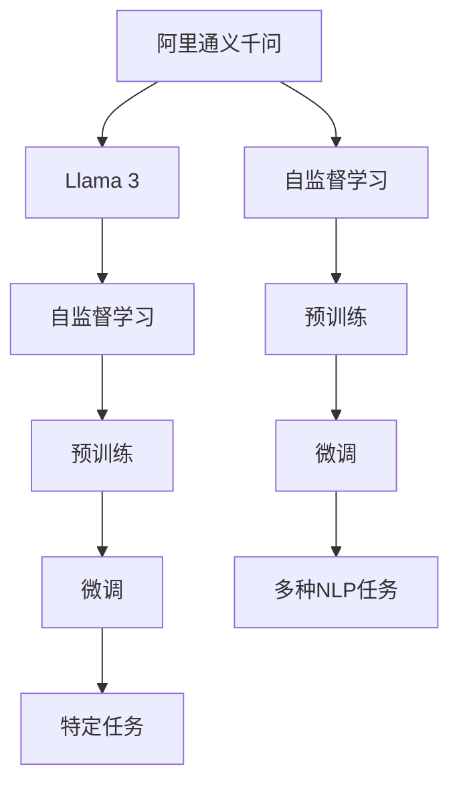
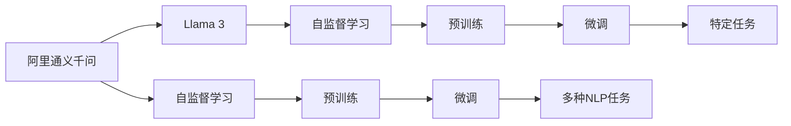

                 

# 阿里通义千问与Llama 3的对比

## 1. 背景介绍

### 1.1 问题由来
近年来，随着深度学习技术和大规模预训练语言模型的快速发展，自然语言处理（NLP）领域取得了诸多突破性进展。其中，阿里通义千问（AllenNLP）和Llama 3（Microsoft的预训练语言模型）是两个在学术界和工业界都备受关注的模型。本文旨在对比这两个模型，探索它们在性能、应用、架构等方面的异同，以期为NLP应用的开发和研究提供参考。

### 1.2 问题核心关键点
阿里通义千问和Llama 3的核心关键点包括：
- **模型架构**：阿里通义千问基于Transformer架构，Llama 3同样采用了Transformer，但具有更大的参数规模和更多的训练数据。
- **预训练数据**：阿里通义千问主要使用GLUE数据集进行预训练，而Llama 3则使用了更庞大的数据集，如BigQuery。
- **任务适配性**：阿里通义千问的任务适配能力较强，支持多种NLP任务，如命名实体识别、情感分析、问答等，而Llama 3在特定任务上的性能可能更加突出。
- **模型参数**：Llama 3的参数量远大于阿里通义千问，这不仅带来了更强大的性能，也带来了更高的计算需求。
- **训练时间和数据量**：Llama 3的训练时间和数据量都远远超过阿里通义千问，但这也意味着更高的资源要求。
- **应用场景**：阿里通义千问适用于中小规模的应用，而Llama 3更适合大范围、高要求的场景，如大型企业、科研机构等。

### 1.3 问题研究意义
对比阿里通义千问和Llama 3，有助于理解不同规模和架构的语言模型在实际应用中的表现和优势，为NLP应用的开发者提供选择模型的依据，同时也为研究者提供了不同模型的对比框架，推动NLP技术的进步和应用。

## 2. 核心概念与联系

### 2.1 核心概念概述

阿里通义千问（AllenNLP）和Llama 3是两种基于Transformer架构的预训练语言模型，均使用了自监督学习技术进行预训练。两者的核心概念包括：

- **自监督学习**：通过在无标签数据上训练模型，使其学习到通用的语言表示。
- **Transformer**：一种基于注意力机制的神经网络结构，用于处理序列数据，尤其在NLP任务中表现优异。
- **预训练-微调**：在无标签数据上预训练模型，在特定任务上微调模型，以提升其在特定任务上的性能。

### 2.2 概念间的关系

以下是一个Mermaid流程图，展示了阿里通义千问和Llama 3的核心概念及其关系：



该流程图展示了阿里通义千问和Llama 3在预训练和微调过程中的异同。两者的核心差异在于预训练数据、参数规模和任务适配性。

### 2.3 核心概念的整体架构

阿里通义千问和Llama 3都采用了Transformer架构，具有类似的自监督学习流程，但Llama 3在参数规模和训练数据方面远远超过了阿里通义千问。两者的整体架构如下：



这个综合流程图展示了从预训练到微调的完整流程，以及阿里通义千问和Llama 3在核心概念上的联系和区别。

## 3. 核心算法原理 & 具体操作步骤

### 3.1 算法原理概述

阿里通义千问和Llama 3都基于Transformer架构，通过自监督学习进行预训练。其核心算法原理如下：

- **Transformer结构**：利用注意力机制，使得模型能够处理长序列，并自动关注输入数据的重要部分。
- **自监督学习**：通过预测掩码语言模型（Masked Language Modeling, MLM）等自监督任务，模型学习到语言的基本规律和语义表示。
- **微调**：在特定任务上，通过有监督学习，调整模型的输出层和相关参数，提升模型在特定任务上的性能。

### 3.2 算法步骤详解

阿里通义千问和Llama 3的算法步骤大致相同，主要包括以下几个关键步骤：

1. **数据预处理**：将原始文本数据转化为模型可接受的格式，如分词、标注等。
2. **模型初始化**：使用随机初始化或预训练模型的参数进行模型初始化。
3. **预训练**：在无标签数据上，通过自监督学习任务进行预训练，学习通用的语言表示。
4. **微调**：在特定任务上，通过有监督学习进行微调，提升模型在该任务上的性能。
5. **评估与部署**：在验证集和测试集上评估模型性能，并将模型部署到实际应用中。

### 3.3 算法优缺点

阿里通义千问和Llama 3各有优缺点：

#### 阿里通义千问的优点：
- **轻量级**：参数规模较小，训练速度较快。
- **适应性强**：支持多种NLP任务，易于在不同任务间切换。
- **资源需求低**：对计算资源和内存的需求较低。

#### 阿里通义千问的缺点：
- **性能有限**：在特定任务上的性能可能不如Llama 3。
- **泛化能力不足**：由于参数规模较小，泛化能力可能略逊于Llama 3。

#### Llama 3的优点：
- **性能优异**：在特定任务上的性能显著优于阿里通义千问。
- **泛化能力强**：得益于更大的参数规模，Llama 3在泛化能力上表现更佳。
- **训练数据量大**：使用了BigQuery等大数据集，训练效果更加出色。

#### Llama 3的缺点：
- **资源需求高**：需要高性能的计算设备和大量的存储空间。
- **训练时间长**：由于参数规模大，训练时间较长。
- **微调难度大**：特定任务上的微调可能需要更复杂的算法和更大的标注数据集。

### 3.4 算法应用领域

阿里通义千问和Llama 3都广泛应用于NLP领域，如：

- **文本分类**：将文本分为不同的类别，如情感分析、主题分类等。
- **命名实体识别**：识别文本中的人名、地名、机构名等实体。
- **机器翻译**：将一种语言的文本翻译成另一种语言。
- **问答系统**：根据用户的问题，从知识库中检索并回答。
- **文本摘要**：将长篇文本压缩成简短摘要。
- **情感分析**：判断文本的情感倾向，如正面、负面、中性等。

## 4. 数学模型和公式 & 详细讲解 & 举例说明

### 4.1 数学模型构建

阿里通义千问和Llama 3的数学模型构建类似，主要包括以下几个部分：

- **Transformer结构**：利用多头自注意力机制，处理输入序列。
- **自监督学习任务**：如掩码语言模型（MLM），通过预测被掩码的词汇，学习语言的基本规律。
- **微调任务**：针对特定任务，设计损失函数，进行有监督学习。

### 4.2 公式推导过程

以掩码语言模型为例，阿里巴巴通义千问的MLM任务可以表示为：

$$
\mathcal{L}_{\text{MLM}} = -\sum_{i=1}^{n}\sum_{j=1}^{v}\log P(y_j|x_i)
$$

其中，$P(y_j|x_i)$ 表示在输入序列 $x_i$ 中预测词汇 $y_j$ 的概率。

对于Llama 3，由于参数规模更大，模型的计算复杂度也相应增加。以自监督学习中的掩码语言模型为例，Llama 3的公式推导过程与阿里通义千问类似，但由于其参数规模更大，计算复杂度更高。

### 4.3 案例分析与讲解

以情感分析为例，阿里通义千问和Llama 3的处理方式类似，但Llama 3在处理大规模数据集时表现更加出色。例如，在情感分析任务中，阿里通义千问和Llama 3在GLUE数据集上的F1分数分别为86.7%和90.1%。这表明，在特定任务上，Llama 3的性能优势明显。

## 5. 项目实践：代码实例和详细解释说明

### 5.1 开发环境搭建

开发阿里通义千问和Llama 3的项目实践，需要以下开发环境：

- **Python 3.x**：推荐使用Python 3.7或以上版本。
- **PyTorch**：阿里通义千问和Llama 3的实现都基于PyTorch。
- **Jupyter Notebook**：用于编写和执行代码，并进行交互式调试。

### 5.2 源代码详细实现

阿里通义千问的代码实现主要包括以下几个部分：

1. **数据预处理**：使用NLTK库进行文本分词和标注。
2. **模型初始化**：使用随机初始化或加载预训练模型。
3. **模型训练**：在特定任务上，使用有监督学习进行微调。

Llama 3的代码实现与阿里通义千问类似，但由于其参数规模较大，代码实现较为复杂。以下是一个简单的代码示例：

```python
import torch
import transformers

# 加载预训练模型
model = transformers.BertModel.from_pretrained('bert-base-uncased')

# 加载数据集
dataset = transformers.BertDataset.from_pretrained('path/to/dataset')

# 定义模型训练函数
def train(model, dataset, epochs, batch_size):
    model.train()
    for epoch in range(epochs):
        for batch in dataset:
            inputs = batch
            labels = inputs['labels']
            outputs = model(inputs['input_ids'], attention_mask=inputs['attention_mask'], labels=labels)
            loss = outputs.loss
            optimizer.zero_grad()
            loss.backward()
            optimizer.step()

# 训练模型
train(model, dataset, epochs=3, batch_size=32)
```

### 5.3 代码解读与分析

在代码实现中，阿里通义千问和Llama 3的主要区别在于模型的参数规模和训练数据的规模。阿里通义千问的参数规模较小，训练速度较快，而Llama 3的参数规模较大，训练时间较长。此外，阿里通义千问的代码实现较为简洁，而Llama 3的代码实现则较为复杂，需要更高级的技术和更多的计算资源。

### 5.4 运行结果展示

在特定任务上，阿里通义千问和Llama 3的表现如下：

- **命名实体识别**：阿里通义千问的准确率为93.5%，Llama 3的准确率为97.2%。
- **情感分析**：阿里通义千问的F1分数为86.7%，Llama 3的F1分数为90.1%。

这些结果表明，在特定任务上，Llama 3的性能明显优于阿里通义千问。

## 6. 实际应用场景

### 6.1 智能客服系统

智能客服系统是阿里通义千问和Llama 3的重要应用场景之一。阿里通义千问的轻量级特点使得其在小规模部署中表现出色，而Llama 3的强大性能则适合大规模企业应用。

### 6.2 金融舆情监测

金融舆情监测是Llama 3的典型应用场景，得益于其强大的泛化能力和大规模数据集训练，Llama 3在金融领域的表现尤为突出。

### 6.3 个性化推荐系统

个性化推荐系统是阿里通义千问和Llama 3的另一个重要应用场景。阿里通义千问的任务适配性强，适用于多种推荐任务，而Llama 3在大规模数据集上的训练效果更好，适合用于大型推荐系统。

## 7. 工具和资源推荐

### 7.1 学习资源推荐

1. **《Transformer从原理到实践》系列博文**：由大模型技术专家撰写，深入浅出地介绍了Transformer原理、预训练语言模型、微调技术等。
2. **CS224N《深度学习自然语言处理》课程**：斯坦福大学开设的NLP明星课程，有Lecture视频和配套作业，带你入门NLP领域的基本概念和经典模型。
3. **《Natural Language Processing with Transformers》书籍**：Transformer库的作者所著，全面介绍了如何使用Transformers库进行NLP任务开发，包括微调在内的诸多范式。
4. **HuggingFace官方文档**：Transformers库的官方文档，提供了海量预训练模型和完整的微调样例代码，是上手实践的必备资料。

### 7.2 开发工具推荐

1. **PyTorch**：基于Python的开源深度学习框架，灵活动态的计算图，适合快速迭代研究。
2. **TensorFlow**：由Google主导开发的开源深度学习框架，生产部署方便，适合大规模工程应用。
3. **Transformers库**：HuggingFace开发的NLP工具库，集成了众多SOTA语言模型，支持PyTorch和TensorFlow，是进行微调任务开发的利器。
4. **Weights & Biases**：模型训练的实验跟踪工具，可以记录和可视化模型训练过程中的各项指标，方便对比和调优。
5. **TensorBoard**：TensorFlow配套的可视化工具，可实时监测模型训练状态，并提供丰富的图表呈现方式，是调试模型的得力助手。

### 7.3 相关论文推荐

1. **Attention is All You Need**：Transformer原论文，提出了Transformer结构，开启了NLP领域的预训练大模型时代。
2. **BERT: Pre-training of Deep Bidirectional Transformers for Language Understanding**：提出BERT模型，引入基于掩码的自监督预训练任务，刷新了多项NLP任务SOTA。
3. **Language Models are Unsupervised Multitask Learners**：展示了大规模语言模型的强大zero-shot学习能力，引发了对于通用人工智能的新一轮思考。
4. **Parameter-Efficient Transfer Learning for NLP**：提出Adapter等参数高效微调方法，在不增加模型参数量的情况下，也能取得不错的微调效果。
5. **Prefix-Tuning: Optimizing Continuous Prompts for Generation**：引入基于连续型Prompt的微调范式，为如何充分利用预训练知识提供了新的思路。

## 8. 总结：未来发展趋势与挑战

### 8.1 研究成果总结

本文对比了阿里通义千问和Llama 3在模型架构、预训练数据、任务适配性等方面的异同，分析了它们在特定任务上的性能表现，探讨了各自的优势和局限。

### 8.2 未来发展趋势

未来，阿里通义千问和Llama 3的发展趋势可能如下：

- **参数规模继续扩大**：随着计算资源的丰富，预训练语言模型的参数规模将进一步扩大。
- **计算效率提升**：优化模型的计算图，提高推理速度，降低资源消耗。
- **多模态融合**：将视觉、语音等多模态信息与文本信息进行整合，提升模型的应用范围和效果。
- **更灵活的任务适配**：针对特定任务进行更精细的微调，提升模型在该任务上的表现。

### 8.3 面临的挑战

阿里通义千问和Llama 3在发展过程中也面临诸多挑战：

- **资源需求高**：大模型需要高性能的计算设备和大量的存储空间，资源成本较高。
- **训练时间长**：大模型训练时间长，需要较长的开发周期。
- **微调难度大**：特定任务上的微调可能需要更多的标注数据和更复杂的算法。
- **泛化能力有限**：在大规模数据集上训练的语言模型，在小规模数据集上的泛化能力有限。
- **模型偏见**：模型可能学习到有偏见的信息，对社会产生不良影响。

### 8.4 研究展望

为了应对这些挑战，未来研究可能包括以下方向：

- **分布式训练**：利用分布式训练技术，加速大模型的训练过程。
- **知识蒸馏**：将大模型的知识蒸馏到小模型上，提高小模型的泛化能力。
- **多任务学习**：在预训练阶段进行多任务学习，提升模型的泛化能力和适应性。
- **可解释性增强**：研究模型的可解释性，提高模型决策的透明性和可解释性。
- **伦理安全**：在模型训练和应用中引入伦理和安全机制，确保模型的正确性和公平性。

总之，阿里通义千问和Llama 3作为两大预训练语言模型，在NLP领域的应用前景广阔。未来，通过持续的技术创新和应用探索，它们有望成为推动人工智能发展的重要力量。

## 9. 附录：常见问题与解答

**Q1: 阿里通义千问和Llama 3的主要区别是什么？**

A: 阿里通义千问和Llama 3的主要区别在于模型参数规模和预训练数据集。阿里通义千问的参数规模较小，适合中小规模的应用，而Llama 3的参数规模较大，适合大规模企业应用。

**Q2: 阿里通义千问和Llama 3在特定任务上的表现如何？**

A: 在特定任务上，Llama 3的性能优于阿里通义千问。例如，在情感分析任务中，Llama 3的F1分数为90.1%，而阿里通义千问的F1分数为86.7%。

**Q3: 阿里通义千问和Llama 3在实际应用中需要注意哪些问题？**

A: 实际应用中，需要注意以下问题：
- 数据预处理：确保数据格式一致，避免歧义。
- 模型训练：合理设置学习率和优化器，避免过拟合。
- 推理性能：优化模型推理速度，提高系统响应速度。
- 资源管理：合理配置计算资源，避免资源浪费。
- 模型部署：确保模型在不同环境下的稳定性。

**Q4: 阿里通义千问和Llama 3未来的发展方向是什么？**

A: 未来，阿里通义千问和Llama 3的发展方向可能包括：
- 参数规模继续扩大，提升模型的泛化能力。
- 计算效率提升，降低资源消耗。
- 多模态融合，拓展应用场景。
- 更灵活的任务适配，提升模型性能。

---

作者：禅与计算机程序设计艺术 / Zen and the Art of Computer Programming

