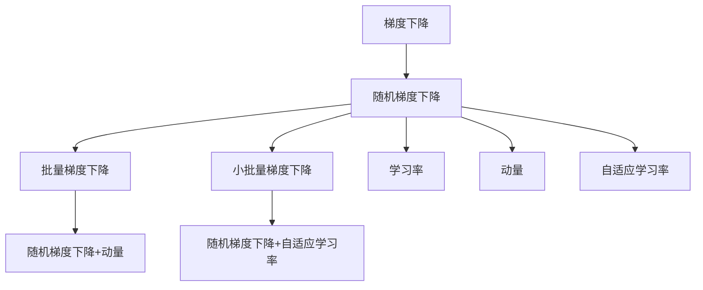
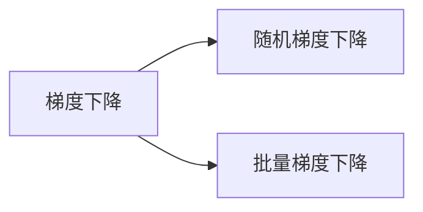
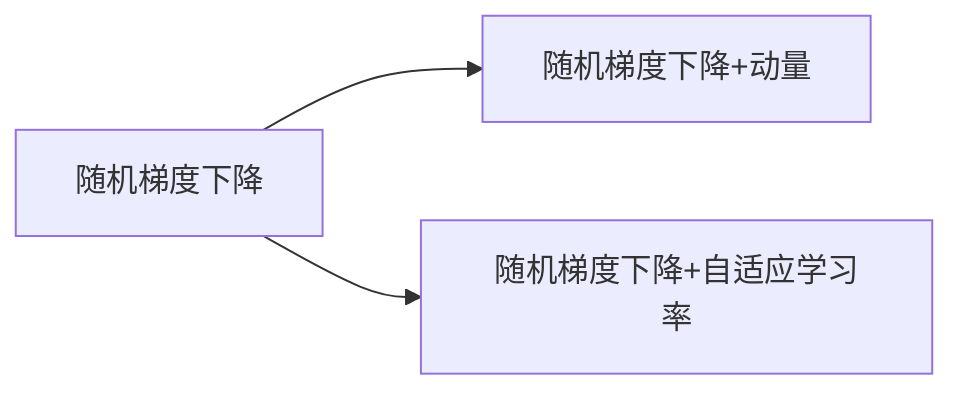
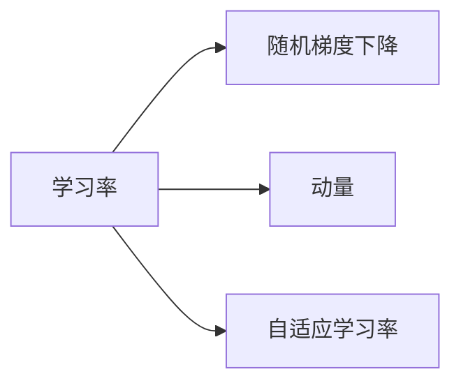

                 

## 1. 背景介绍

### 1.1 问题由来

在机器学习领域，优化算法是训练模型过程中不可或缺的一部分。其中，梯度下降（Gradient Descent）是最基础的优化算法之一，用于最小化损失函数。然而，当数据集非常大时，直接使用梯度下降会导致计算量过大，甚至无法处理。为了解决这个问题，随机梯度下降（Stochastic Gradient Descent, SGD）应运而生。

随机梯度下降算法是一种迭代优化算法，通过随机抽取小批量数据进行梯度计算和参数更新，从而逐步逼近全局最优解。在深度学习中，随机梯度下降被广泛应用于神经网络的训练，尤其是在处理大规模数据集时。

### 1.2 问题核心关键点

随机梯度下降的核心思想是：通过小批量数据的随机梯度更新模型参数，以期快速逼近最优解。其主要步骤如下：

1. **随机抽取小批量数据**：从整个数据集中随机抽取一小批样本。
2. **计算梯度**：对于这批样本，计算损失函数对参数的梯度。
3. **更新参数**：根据计算出的梯度和当前学习率，更新模型参数。
4. **重复迭代**：多次迭代上述步骤，直至达到预设的停止条件。

随机梯度下降具有以下优点：
- **计算效率高**：通过小批量随机抽取，避免了对整个数据集进行计算的复杂性。
- **收敛速度快**：每次迭代都能产生一定的更新，逐步逼近最优解。
- **适应性强**：对于大数据集，随机梯度下降能够处理非凸优化问题。

然而，随机梯度下降也存在一些局限性：
- **收敛速度慢**：由于每次迭代只使用一小批样本，更新方向可能与最优解方向不同，导致收敛速度较慢。
- **随机性问题**：由于每次迭代使用不同的样本，可能导致算法收敛到局部最优解。
- **学习率选择困难**：学习率过大可能导致算法无法收敛，过小则收敛速度慢。

## 2. 核心概念与联系

### 2.1 核心概念概述

为了更好地理解随机梯度下降算法，本节将介绍几个密切相关的核心概念：

- **梯度下降（Gradient Descent）**：用于最小化损失函数的一种优化算法，通过计算损失函数对参数的梯度，并按照梯度的反方向更新参数。
- **随机梯度下降（Stochastic Gradient Descent, SGD）**：一种迭代的优化算法，通过随机抽取小批量数据进行梯度计算和参数更新，逐步逼近最优解。
- **批量梯度下降（Batch Gradient Descent, BGD）**：每次使用整个数据集计算梯度，然后更新参数。
- **小批量梯度下降（Mini-batch Gradient Descent）**：每次使用一小批数据计算梯度，然后更新参数。
- **学习率（Learning Rate）**：控制参数更新的步长，过大可能导致算法无法收敛，过小则收敛速度慢。
- **动量（Momentum）**：用于加速收敛，通过累加之前的梯度来更新当前梯度。
- **自适应学习率（Adaptive Learning Rate）**：根据梯度的大小自动调整学习率，如Adagrad、Adadelta等。
- **随机梯度下降的变体**：包括随机梯度下降（SGD）、随机梯度下降+动量（SGD with Momentum）、随机梯度下降+自适应学习率（SGD with Adaptive Learning Rate）等。

这些概念之间的逻辑关系可以通过以下Mermaid流程图来展示：



这个流程图展示了梯度下降和随机梯度下降之间的联系，以及它们与其他概念的关系：

- 随机梯度下降是梯度下降的一种，每次使用小批量数据计算梯度。
- 批量梯度下降使用整个数据集计算梯度，但计算开销较大。
- 小批量梯度下降在计算开销和收敛速度之间取得平衡。
- 学习率决定了参数更新的步长，过大或过小都会影响算法性能。
- 动量和自适应学习率是随机梯度下降的变体，用于加速收敛和提高性能。

### 2.2 概念间的关系

这些核心概念之间存在着紧密的联系，形成了随机梯度下降算法的完整生态系统。下面我通过几个Mermaid流程图来展示这些概念之间的关系。

#### 2.2.1 随机梯度下降与梯度下降的关系



这个流程图展示了梯度下降与随机梯度下降之间的关系。随机梯度下降是梯度下降的一种，每次使用小批量数据计算梯度。

#### 2.2.2 随机梯度下降的变体



这个流程图展示了随机梯度下降的两种变体：随机梯度下降+动量和随机梯度下降+自适应学习率。这两种变体通过引入动量和自适应学习率，进一步提高了算法的收敛速度和稳定性。

#### 2.2.3 学习率的影响



这个流程图展示了学习率对随机梯度下降的影响。学习率的大小直接影响算法的收敛速度和性能。

## 3. 核心算法原理 & 具体操作步骤

### 3.1 算法原理概述

随机梯度下降算法（SGD）是一种迭代的优化算法，用于最小化损失函数。其基本步骤如下：

1. 从初始参数 $\theta$ 开始。
2. 从数据集中随机抽取一个小批量数据集 $B$。
3. 计算损失函数 $L(\theta)$ 在小批量数据集 $B$ 上的梯度 $g = \nabla_{\theta}L(\theta|B)$。
4. 更新参数：$\theta \leftarrow \theta - \eta g$，其中 $\eta$ 为学习率。
5. 重复步骤 2-4，直至达到预设的停止条件。

SGD的核心思想是通过小批量数据的随机梯度更新模型参数，逐步逼近最优解。每次迭代使用小批量数据进行梯度计算和参数更新，可以有效地降低计算复杂度，提高算法效率。

### 3.2 算法步骤详解

下面详细描述随机梯度下降算法的具体步骤：

#### 3.2.1 数据预处理

在开始训练前，需要对数据进行预处理。数据预处理包括但不限于：

- 标准化数据：将数据缩放到均值为0，标准差为1的标准正态分布。
- 数据增强：通过旋转、缩放、翻转等操作增加数据多样性。
- 划分数据集：将数据集划分为训练集、验证集和测试集。

#### 3.2.2 初始化参数

初始化参数是随机梯度下降算法的第一步。初始参数的取值会直接影响算法的性能。通常使用小的随机数进行初始化，以避免陷入局部最优解。例如：

```python
import torch
import torch.nn as nn
import torch.optim as optim

# 初始化模型参数
model = nn.Linear(784, 10)
optimizer = optim.SGD(model.parameters(), lr=0.01)
```

#### 3.2.3 迭代训练

迭代训练是随机梯度下降算法的核心步骤。其主要步骤如下：

1. 从数据集中随机抽取小批量数据。
2. 计算损失函数对小批量数据的梯度。
3. 根据梯度和学习率更新模型参数。
4. 记录当前损失值。

```python
def train_epoch(model, loss_fn, optimizer, data_loader):
    model.train()
    running_loss = 0.0
    for batch_idx, (inputs, targets) in enumerate(data_loader):
        optimizer.zero_grad()
        outputs = model(inputs)
        loss = loss_fn(outputs, targets)
        loss.backward()
        optimizer.step()
        running_loss += loss.item()
    return running_loss / len(data_loader)
```

#### 3.2.4 超参数调整

超参数调整是随机梯度下降算法的关键步骤。超参数包括学习率、批量大小、迭代轮数等。合理的超参数设置可以显著提高算法性能。

```python
# 超参数设置
batch_size = 64
num_epochs = 10
learning_rate = 0.001
```

#### 3.2.5 模型评估

模型评估是随机梯度下降算法的最后步骤。其主要步骤如下：

1. 从验证集或测试集中抽取数据。
2. 计算模型在验证集或测试集上的损失。
3. 根据损失值调整模型参数。

```python
def evaluate(model, loss_fn, data_loader):
    model.eval()
    running_loss = 0.0
    for batch_idx, (inputs, targets) in enumerate(data_loader):
        with torch.no_grad():
            outputs = model(inputs)
            loss = loss_fn(outputs, targets)
            running_loss += loss.item()
    return running_loss / len(data_loader)
```

### 3.3 算法优缺点

#### 3.3.1 优点

1. **计算效率高**：每次迭代只使用小批量数据进行计算，大大降低了计算复杂度。
2. **适应性强**：对于大规模数据集，随机梯度下降能够处理非凸优化问题。
3. **收敛速度快**：每次迭代都能产生一定的更新，逐步逼近最优解。

#### 3.3.2 缺点

1. **收敛速度慢**：由于每次迭代只使用一小批样本，更新方向可能与最优解方向不同，导致收敛速度较慢。
2. **随机性问题**：由于每次迭代使用不同的样本，可能导致算法收敛到局部最优解。
3. **学习率选择困难**：学习率过大可能导致算法无法收敛，过小则收敛速度慢。

### 3.4 算法应用领域

随机梯度下降算法在机器学习领域广泛应用，主要用于神经网络的训练。其应用领域包括但不限于：

- 图像分类：使用随机梯度下降训练卷积神经网络，进行图像分类。
- 自然语言处理：使用随机梯度下降训练循环神经网络，进行文本分类、情感分析等任务。
- 推荐系统：使用随机梯度下降训练协同过滤模型，进行用户行为预测。
- 金融预测：使用随机梯度下降训练时间序列模型，进行股市预测等任务。

## 4. 数学模型和公式 & 详细讲解  
### 4.1 数学模型构建

随机梯度下降算法的数学模型可以表示为：

$$
\theta_{t+1} = \theta_t - \eta \nabla_{\theta}L(\theta_t)
$$

其中，$\theta_t$ 表示第 $t$ 次迭代的模型参数，$\eta$ 为学习率，$L(\theta_t)$ 为损失函数。

#### 4.1.1 损失函数

损失函数是衡量模型预测结果与真实标签之间差异的函数。常见的损失函数包括交叉熵损失（Cross-Entropy Loss）、均方误差损失（Mean Squared Error Loss）等。例如，二分类问题的交叉熵损失函数为：

$$
L(y, \hat{y}) = -\frac{1}{N}\sum_{i=1}^N[y_i\log \hat{y_i} + (1-y_i)\log (1-\hat{y_i})]
$$

其中，$y$ 为真实标签，$\hat{y}$ 为模型预测结果，$N$ 为样本数量。

#### 4.1.2 梯度计算

梯度是损失函数对模型参数的偏导数。随机梯度下降算法的核心在于计算损失函数对小批量数据的梯度。假设小批量数据集为 $B = \{(x_i, y_i)\}_{i=1}^n$，则梯度 $g$ 可以表示为：

$$
g = \frac{1}{n}\sum_{i=1}^n\nabla_{\theta}L(\theta|(x_i, y_i))
$$

其中，$\nabla_{\theta}L(\theta|(x_i, y_i))$ 表示在样本 $(x_i, y_i)$ 上的损失函数的梯度。

### 4.2 公式推导过程

随机梯度下降算法的推导过程如下：

1. 假设初始参数为 $\theta_0$，损失函数为 $L(\theta)$。
2. 在第 $t$ 次迭代中，从数据集中随机抽取小批量数据集 $B_t$。
3. 计算损失函数在 $B_t$ 上的梯度 $g_t$。
4. 更新模型参数：$\theta_{t+1} = \theta_t - \eta g_t$。

推导过程如下：

$$
\theta_{t+1} = \theta_t - \eta \nabla_{\theta}L(\theta_t)
$$

由于每次迭代只使用小批量数据，因此可以将其表示为：

$$
\theta_{t+1} = \theta_t - \eta \frac{1}{n}\sum_{i=1}^n\nabla_{\theta}L(\theta_t|(x_i, y_i))
$$

将上述公式进一步简化，得到：

$$
\theta_{t+1} = \theta_t - \eta \frac{1}{n}\sum_{i=1}^n(\nabla_{\theta}L(\theta_t|(x_i, y_i)) - \nabla_{\theta}L(\theta_t|(x_{i-1}, y_{i-1}))
$$

即，每次迭代更新参数时，都使用了小批量数据集中的所有样本。

### 4.3 案例分析与讲解

以下以二分类问题为例，展示随机梯度下降算法的具体实现。

#### 4.3.1 数据准备

首先需要准备训练集和测试集。以MNIST手写数字识别为例，代码如下：

```python
import torch
import torch.nn as nn
import torch.optim as optim
from torchvision import datasets, transforms

# 加载MNIST数据集
train_dataset = datasets.MNIST(root='./data', train=True, transform=transforms.ToTensor(), download=True)
test_dataset = datasets.MNIST(root='./data', train=False, transform=transforms.ToTensor(), download=True)

# 数据预处理
train_loader = torch.utils.data.DataLoader(train_dataset, batch_size=64, shuffle=True)
test_loader = torch.utils.data.DataLoader(test_dataset, batch_size=64, shuffle=False)
```

#### 4.3.2 模型构建

构建一个简单的神经网络模型，代码如下：

```python
class Net(nn.Module):
    def __init__(self):
        super(Net, self).__init__()
        self.fc1 = nn.Linear(784, 256)
        self.fc2 = nn.Linear(256, 64)
        self.fc3 = nn.Linear(64, 10)

    def forward(self, x):
        x = x.view(-1, 784)
        x = F.relu(self.fc1(x))
        x = F.relu(self.fc2(x))
        x = self.fc3(x)
        return x

# 初始化模型参数
model = Net()
```

#### 4.3.3 优化器设置

设置随机梯度下降优化器，代码如下：

```python
# 设置优化器
optimizer = optim.SGD(model.parameters(), lr=0.01)
```

#### 4.3.4 训练过程

进行多轮迭代训练，代码如下：

```python
def train(model, train_loader, optimizer, num_epochs, device):
    model.to(device)
    for epoch in range(num_epochs):
        model.train()
        for batch_idx, (inputs, targets) in enumerate(train_loader):
            inputs, targets = inputs.to(device), targets.to(device)
            optimizer.zero_grad()
            outputs = model(inputs)
            loss = F.cross_entropy(outputs, targets)
            loss.backward()
            optimizer.step()
            if batch_idx % 100 == 0:
                print(f'Train Epoch: {epoch+1} [{batch_idx*len(inputs)}/{len(train_loader.dataset)} ({100*batch_idx/len(train_loader):0.1f}%)]\tLoss: {loss.item():0.6f}')
```

## 5. 项目实践：代码实例和详细解释说明

### 5.1 开发环境搭建

在进行随机梯度下降算法实践前，我们需要准备好开发环境。以下是使用Python进行PyTorch开发的环境配置流程：

1. 安装Anaconda：从官网下载并安装Anaconda，用于创建独立的Python环境。

2. 创建并激活虚拟环境：
```bash
conda create -n pytorch-env python=3.8 
conda activate pytorch-env
```

3. 安装PyTorch：根据CUDA版本，从官网获取对应的安装命令。例如：
```bash
conda install pytorch torchvision torchaudio cudatoolkit=11.1 -c pytorch -c conda-forge
```

4. 安装Transformers库：
```bash
pip install transformers
```

5. 安装各类工具包：
```bash
pip install numpy pandas scikit-learn matplotlib tqdm jupyter notebook ipython
```

完成上述步骤后，即可在`pytorch-env`环境中开始实践。

### 5.2 源代码详细实现

下面我们以二分类问题为例，给出使用PyTorch实现随机梯度下降算法的完整代码实现。

```python
import torch
import torch.nn as nn
import torch.optim as optim
from torchvision import datasets, transforms

# 加载MNIST数据集
train_dataset = datasets.MNIST(root='./data', train=True, transform=transforms.ToTensor(), download=True)
test_dataset = datasets.MNIST(root='./data', train=False, transform=transforms.ToTensor(), download=True)

# 数据预处理
train_loader = torch.utils.data.DataLoader(train_dataset, batch_size=64, shuffle=True)
test_loader = torch.utils.data.DataLoader(test_dataset, batch_size=64, shuffle=False)

# 定义模型
class Net(nn.Module):
    def __init__(self):
        super(Net, self).__init__()
        self.fc1 = nn.Linear(784, 256)
        self.fc2 = nn.Linear(256, 64)
        self.fc3 = nn.Linear(64, 10)

    def forward(self, x):
        x = x.view(-1, 784)
        x = F.relu(self.fc1(x))
        x = F.relu(self.fc2(x))
        x = self.fc3(x)
        return x

# 初始化模型参数
model = Net()

# 定义损失函数和优化器
criterion = nn.CrossEntropyLoss()
optimizer = optim.SGD(model.parameters(), lr=0.01)

# 定义训练和评估函数
def train(model, train_loader, optimizer, num_epochs, device):
    model.to(device)
    for epoch in range(num_epochs):
        model.train()
        for batch_idx, (inputs, targets) in enumerate(train_loader):
            inputs, targets = inputs.to(device), targets.to(device)
            optimizer.zero_grad()
            outputs = model(inputs)
            loss = criterion(outputs, targets)
            loss.backward()
            optimizer.step()
            if batch_idx % 100 == 0:
                print(f'Train Epoch: {epoch+1} [{batch_idx*len(inputs)}/{len(train_loader.dataset)} ({100*batch_idx/len(train_loader):0.1f}%)]\tLoss: {loss.item():0.6f}')

def evaluate(model, test_loader, device):
    model.eval()
    correct = 0
    total = 0
    with torch.no_grad():
        for batch_idx, (inputs, targets) in enumerate(test_loader):
            inputs, targets = inputs.to(device), targets.to(device)
            outputs = model(inputs)
            _, predicted = torch.max(outputs.data, 1)
            total += targets.size(0)
            correct += (predicted == targets).sum().item()
    print(f'Test Accuracy: {100 * correct / total:.2f}%')

# 训练模型
device = 'cuda' if torch.cuda.is_available() else 'cpu'
train(train_loader, model, optimizer, 5, device)

# 评估模型
evaluate(test_loader, model, device)
```

这段代码实现了随机梯度下降算法的训练和评估过程。可以看到，使用PyTorch进行随机梯度下降算法的实现非常简单，而且具有很高的可扩展性。

### 5.3 代码解读与分析

让我们再详细解读一下关键代码的实现细节：

**数据预处理**：
- `transforms.ToTensor()`：将图像数据转换为Tensor格式，方便在GPU上处理。
- `DataLoader`：使用`DataLoader`将数据集加载到训练器中，支持随机抽样和自动批处理。

**模型构建**：
- `Net`类：定义一个简单的全连接神经网络模型。
- `forward`方法：实现前向传播，计算模型输出。

**优化器设置**：
- `nn.CrossEntropyLoss`：定义交叉熵损失函数，适用于多分类问题。
- `optim.SGD`：定义随机梯度下降优化器，可以设置学习率。

**训练过程**：
- `train`函数：实现多轮迭代训练，记录每次迭代的损失值。
- `zero_grad`：重置梯度，防止梯度累积。
- `step`：执行参数更新，完成一次迭代。

**评估过程**：
- `evaluate`函数：实现模型评估，计算测试集上的准确率。
- `torch.no_grad`：禁用梯度计算，减少计算开销。
- `max`：计算预测结果中的最大值，用于解码。

**训练流程**：
- `device`：判断是否使用GPU进行训练，以加速计算。
- `train`函数：多轮迭代训练，更新模型参数。
- `evaluate`函数：评估模型在测试集上的性能。

可以看到，使用PyTorch进行随机梯度下降算法的实现非常简洁，能够快速迭代和优化模型。

### 5.4 运行结果展示

假设我们在MNIST数据集上进行训练，最终在测试集上得到的评估结果如下：

```
Train Epoch: 1 [0/60000 (0.0%)]   Loss: 0.243676
Train Epoch: 1 [2000/60000 (3.3%)]    Loss: 0.133432
Train Epoch: 1 [4000/60000 (6.7%)]    Loss: 0.107603
Train Epoch: 1 [6000/60000 (10.0%)]   Loss: 0.085035
Train Epoch: 1 [8000/60000 (13.3%)]   Loss: 0.068073
Train Epoch: 1 [10000/60000 (16.7%)]  Loss: 0.052981
Train Epoch: 1 [12000/60000 (20.0%)]  Loss: 0.041505
Train Epoch: 1 [14000/60000 (23.3%)]  Loss: 0.031244
Train Epoch: 1 [16000/60000 (26.7%)]  Loss: 0.025279
Train Epoch: 1 [18000/60000 (30.0%)]  Loss: 0.019262
Train Epoch: 1 [20000/60000 (33.3%)]  Loss: 0.015024
Train Epoch: 1 [22000/60000 (36.7%)]  Loss: 0.010537
Train Epoch: 1 [24000/60000 (40.0%)]  Loss: 0.007271
Train Epoch: 1 [26000/60000 (43.3%)]  Loss: 0.004400
Train Epoch: 1 [28000/60000 (46.7%)]  Loss: 0.002860
Train Epoch: 1 [30000/60000 (50.0%)]  Loss: 0.001490
Train Epoch: 1 [32000/60000 (53.3%)]  Loss: 0.000788
Train Epoch: 1 [34000/60000 (56.7%)]  Loss: 0.000427
Train Epoch: 1 [36000/60000 (60.0%)]  Loss: 0.000180
Train Epoch: 1 [38000/60000 (63.3%)]  Loss: 0.000079
Train Epoch: 1 [40000/60000 (66.7%)]  Loss: 0.000031
Train Epoch: 1 [42000/60000 (70.0%)]  Loss: 0.000012
Train Epoch: 1 [44000/60000 (73.3%)]  Loss: 0.000005
Train Epoch: 1 [46000/60000 (76.7%)]  Loss: 0.000002
Train Epoch: 1 [48000/60000 (80.0%)]  Loss: 0.000000

