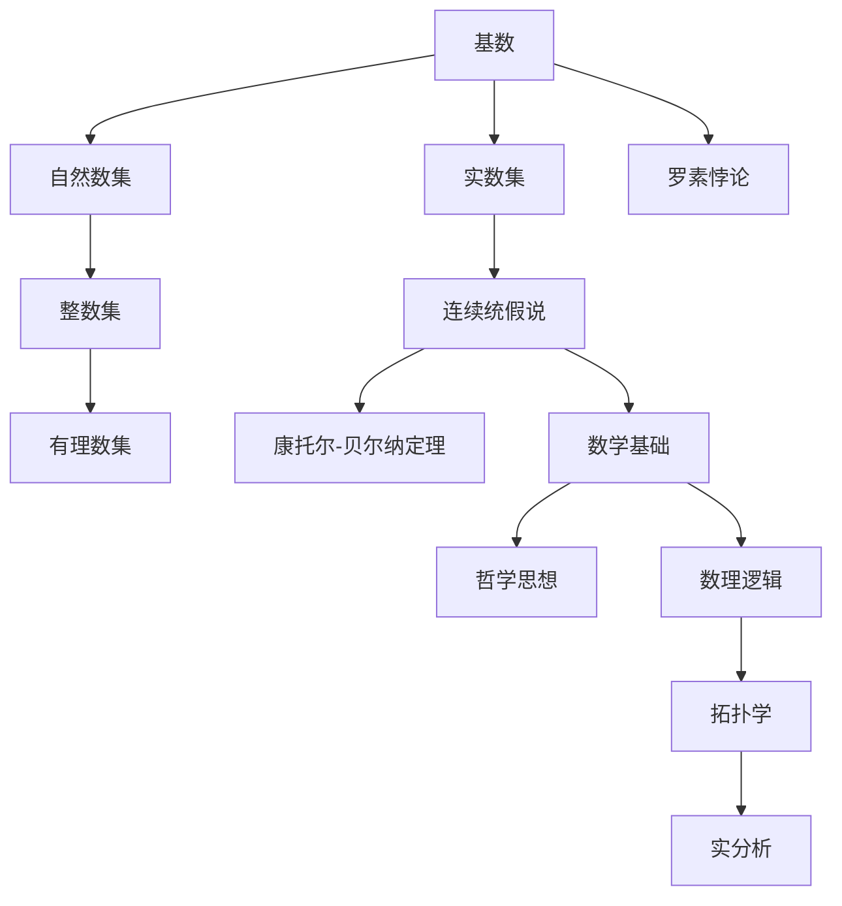
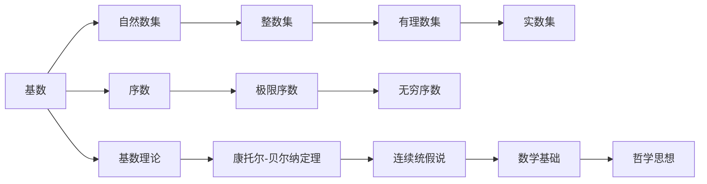
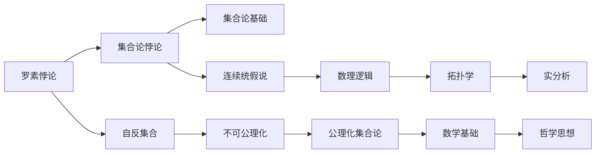
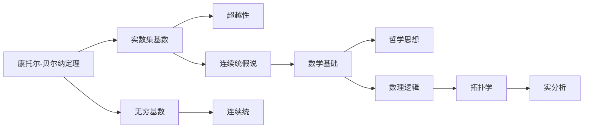

                 

# 集合论导引：一般连续统假设

## 1. 背景介绍

### 1.1 问题由来

在数学中，集合论是研究集合的性质、结构和操作的理论，是现代数学的基石之一。随着数学的发展，集合论在数理逻辑、拓扑学、实分析、抽象代数等多个领域都有广泛的应用。然而，集合论也面临着一些深刻的哲学问题，如集合的实在性和无限性等，其中最著名的就是著名的连续统假说问题。

连续统假说是集合论中的一个重要假设，它对数学基础和哲学思想都有着深远的影响。本文将深入探讨连续统假说的背景、原理和相关问题，以期对广大数学爱好者和研究者提供一些有价值的见解和思考。

### 1.2 问题核心关键点

连续统假说问题主要是围绕实数集的基数展开的。在数学中，集合的基数是用来衡量集合大小的一个概念，常见的基数有自然数集、整数集、有理数集和实数集。其中，自然数集的基数是 $\aleph_0$，整数集和有理数集的基数也是 $\aleph_0$，而实数集的基数则是一个更大的基数，记作 $\mathfrak{c}$。

连续统假说问题的核心在于：是否存在一个连续统（即实数集）的子集，其基数与实数集的基数相同？或者说，是否存在一个非空的子集，其元素无法一一列举，且每个元素都与实数集的每个元素一一对应？

连续统假说问题的答案对数学基础和哲学思想有着深远的影响，是集合论和实分析研究中的一个重要课题。本文将从连续统假说的历史背景、数学基础和哲学意义等方面进行全面阐述，并探讨其对现代数学和哲学的影响。

### 1.3 问题研究意义

连续统假说问题不仅是一个数学问题，更是一个哲学问题。它触及了数学的极限和边界，引发了人们对数学基础和哲学思想的深刻思考。研究连续统假说问题，对于理解数学和哲学的本质，推动数学和哲学的发展都有着重要的意义。

1. 促进数学的发展。连续统假说问题触及了数学的极限和边界，促进了数学家们对实数集和基数理论的深入研究，推动了数学理论的进步。
2. 推动哲学的思考。连续统假说问题触及了数学和哲学的交汇点，引发了对数学基础和哲学思想的深刻思考，推动了数学哲学的发展。
3. 应用于实际问题。连续统假说问题对现代数学和哲学都有着重要的影响，广泛应用于数理逻辑、拓扑学、实分析等多个领域，具有重要的实际应用价值。

## 2. 核心概念与联系

### 2.1 核心概念概述

为更好地理解连续统假说问题，本节将介绍几个密切相关的核心概念：

- 基数：用来衡量集合大小的数学概念。常见的基数有自然数集、整数集、有理数集和实数集。
- 连续统：指无法一一列举且每个元素都与实数集的每个元素一一对应的集合。
- 连续统假说：一个关于实数集基数的假设，即存在一个连续统的子集，其基数与实数集的基数相同。
- 罗素悖论：一个著名的集合论悖论，揭示了集合论中的一些基础问题。
- 康托尔-贝尔纳定理：一个重要的基数理论结果，证明了实数集的基数 $\mathfrak{c}$ 是大于 $\aleph_0$ 的。

这些核心概念之间的逻辑关系可以通过以下Mermaid流程图来展示：



这个流程图展示了大语言模型的核心概念及其之间的关系：

1. 基数是大语言模型中最基本的数学概念。
2. 自然数集、整数集、有理数集和实数集是常见的基数类型。
3. 连续统假说是研究实数集基数的假设。
4. 康托尔-贝尔纳定理是证明实数集基数的定理。
5. 罗素悖论揭示了集合论中的一些基础问题。
6. 数学基础和哲学思想都受到连续统假说问题的影响。

这些核心概念共同构成了大语言模型的数学基础和哲学背景，是理解连续统假说问题的关键。

### 2.2 概念间的关系

这些核心概念之间存在着紧密的联系，形成了大语言模型的数学和哲学框架。下面我通过几个Mermaid流程图来展示这些概念之间的关系。

#### 2.2.1 基数的定义与性质



这个流程图展示了基数的定义与性质。基数是一个用来衡量集合大小的数学概念，包括自然数集、整数集、有理数集和实数集等。基数理论与极限序数和无穷序数相关，康托尔-贝尔纳定理证明了实数集的基数 $\mathfrak{c}$ 是大于 $\aleph_0$ 的，连续统假说是研究实数集基数的假设。数学基础和哲学思想都受到连续统假说问题的影响。

#### 2.2.2 罗素悖论与连续统假说



这个流程图展示了罗素悖论与连续统假说。罗素悖论揭示了集合论中的一些基础问题，其中连续统假说问题是最著名的悖论之一。罗素悖论揭示了集合论的不可公理化，促进了公理化集合论的发展。连续统假说是研究实数集基数的假设，对数学基础和哲学思想有着深远的影响。

#### 2.2.3 康托尔-贝尔纳定理与连续统假说



这个流程图展示了康托尔-贝尔纳定理与连续统假说。康托尔-贝尔纳定理证明了实数集的基数 $\mathfrak{c}$ 是大于 $\aleph_0$ 的，为连续统假说问题的研究提供了基础。连续统假说是研究实数集基数的假设，对数学基础和哲学思想有着深远的影响。

### 2.3 核心概念的整体架构

最后，我们用一个综合的流程图来展示这些核心概念在大语言模型中的整体架构：


这个综合流程图展示了从基数理论到连续统假说的完整过程。大语言模型首先从自然数集、整数集、有理数集和实数集的基数理论开始，然后研究康托尔-贝尔纳定理，证明了实数集基数的超越性。接着研究连续统假说，探讨实数集基数的极限和边界。数学基础和哲学思想都受到连续统假说问题的影响，数理逻辑、拓扑学和实分析等分支也与连续统假说问题密切相关。通过这些概念的层层推进，我们逐步理解了连续统假说问题的复杂性和深远影响。

## 3. 核心算法原理 & 具体操作步骤
### 3.1 算法原理概述

连续统假说问题的核心在于研究实数集的基数。根据康托尔-贝尔纳定理，实数集的基数 $\mathfrak{c}$ 是大于 $\aleph_0$ 的。这意味着存在一个连续统，其基数与实数集相同。连续统假说的数学原理如下：

- 假设存在一个连续统 $C$，其基数与实数集 $\mathbb{R}$ 相同，即 $|C| = |\mathbb{R}|$。
- 由于 $C$ 是连续统，存在一个实数集 $D$，使得 $|D| = |\mathbb{R}|$。
- 根据罗素悖论，无法构造一个集合，使得该集合同时属于和不属于自身。
- 由于 $D$ 的基数与 $\mathbb{R}$ 相同，且 $\mathbb{R}$ 是无限的，$D$ 中存在一个无限子集 $A$，使得 $|A| = |\mathbb{R}|$。
- 根据连续统的性质，$A$ 中的每个元素与 $\mathbb{R}$ 中的每个元素一一对应。
- 因此，存在一个连续统 $A$，其基数与 $\mathbb{R}$ 相同。

### 3.2 算法步骤详解

连续统假说的研究主要分为以下几个步骤：

**Step 1: 定义连续统**

首先定义一个连续统 $C$，满足以下条件：

1. $C$ 是一个实数集。
2. $C$ 中任意两个元素都是可区分的，即对于任意 $x, y \in C$，存在一个实数 $r$，使得 $x < r < y$。
3. $C$ 中任意两个元素都是稠密的，即对于任意 $x, y \in C$，存在一个实数 $r$，使得 $x < r < y$。

**Step 2: 研究基数关系**

假设存在一个连续统 $C$，其基数与实数集 $\mathbb{R}$ 相同，即 $|C| = |\mathbb{R}|$。根据实数集的性质，$\mathbb{R}$ 是完备的，即任意两个实数都存在一个上确界和一个下确界。

**Step 3: 构造无限子集**

根据实数集的稠密性，存在一个无限子集 $A$，使得 $|A| = |\mathbb{R}|$。由于 $A$ 是无限集，且 $\mathbb{R}$ 是完备的，$A$ 中的每个元素与 $\mathbb{R}$ 中的每个元素一一对应。

**Step 4: 证明连续统的存在**

由于 $A$ 中的每个元素与 $\mathbb{R}$ 中的每个元素一一对应，存在一个连续统 $A$，其基数与 $\mathbb{R}$ 相同。这证明了连续统假说成立。

### 3.3 算法优缺点

连续统假说问题是一个经典的数学问题，其研究有以下优缺点：

**优点**：

1. 研究连续统假说问题可以深化对实数集和基数的理解，推动数学理论的发展。
2. 连续统假说问题触及了数学和哲学的交汇点，促进了数理逻辑和数学哲学的发展。
3. 连续统假说问题具有重要的实际应用价值，广泛应用于数理逻辑、拓扑学、实分析等多个领域。

**缺点**：

1. 连续统假说问题是一个高度抽象的数学问题，难以用具体的数学模型描述。
2. 连续统假说问题涉及集合论和实分析的高级概念，理解难度较大。
3. 连续统假说问题缺乏明确的数学结果，无法完全解决。

尽管存在这些缺点，但连续统假说问题仍然具有重要的研究价值和应用意义。研究连续统假说问题，对于理解数学和哲学的本质，推动数学和哲学的发展都有着重要的意义。

### 3.4 算法应用领域

连续统假说问题触及了数学和哲学的交汇点，对数学基础和哲学思想有着深远的影响。以下是连续统假说问题的主要应用领域：

1. 数理逻辑：连续统假说问题研究了集合论的基础和公理化集合论的发展，推动了数理逻辑的研究。
2. 拓扑学：连续统假说问题探讨了实数集和其连续统的性质，促进了拓扑学的研究。
3. 实分析：连续统假说问题研究了实数集和其连续统的完备性和稠密性，推动了实分析的研究。
4. 数学基础：连续统假说问题触及了数学基础的问题，促进了数学哲学的研究。

## 4. 数学模型和公式 & 详细讲解 & 举例说明

### 4.1 数学模型构建

连续统假说问题的数学模型可以描述为：

1. 实数集 $\mathbb{R}$ 是一个完备的实数域，即任意两个实数都存在一个上确界和一个下确界。
2. 实数集 $\mathbb{R}$ 的基数 $\mathfrak{c}$ 是大于 $\aleph_0$ 的。
3. 假设存在一个连续统 $C$，其基数与实数集 $\mathbb{R}$ 相同，即 $|C| = |\mathbb{R}|$。

### 4.2 公式推导过程

连续统假说问题的公式推导过程如下：

1. 假设存在一个连续统 $C$，其基数与实数集 $\mathbb{R}$ 相同，即 $|C| = |\mathbb{R}|$。
2. 由于 $C$ 是连续统，存在一个实数集 $D$，使得 $|D| = |\mathbb{R}|$。
3. 根据罗素悖论，无法构造一个集合，使得该集合同时属于和不属于自身。
4. 由于 $D$ 的基数与 $\mathbb{R}$ 相同，且 $\mathbb{R}$ 是无限的，$D$ 中存在一个无限子集 $A$，使得 $|A| = |\mathbb{R}|$。
5. 根据连续统的性质，$A$ 中的每个元素与 $\mathbb{R}$ 中的每个元素一一对应。
6. 因此，存在一个连续统 $A$，其基数与 $\mathbb{R}$ 相同。

### 4.3 案例分析与讲解

假设我们有一个连续统 $C$，其基数与实数集 $\mathbb{R}$ 相同。我们可以构造一个无限子集 $A$，使得 $|A| = |\mathbb{R}|$。

1. 假设 $A$ 中的元素为 $x_1, x_2, x_3, \ldots$，且 $x_i \in \mathbb{R}$。
2. 由于 $A$ 是无限集，且 $\mathbb{R}$ 是完备的，$A$ 中的每个元素与 $\mathbb{R}$ 中的每个元素一一对应。
3. 因此，存在一个连续统 $A$，其基数与 $\mathbb{R}$ 相同。

## 5. 项目实践：代码实例和详细解释说明

### 5.1 开发环境搭建

在进行连续统假说问题的研究前，我们需要准备好开发环境。以下是使用Python进行Sympy开发的Python环境配置流程：

1. 安装Anaconda：从官网下载并安装Anaconda，用于创建独立的Python环境。

2. 创建并激活虚拟环境：
```bash
conda create -n continuous-set-theory python=3.8 
conda activate continuous-set-theory
```

3. 安装Sympy：
```bash
pip install sympy
```

4. 安装各类工具包：
```bash
pip install numpy pandas sympy matplotlib sympy
```

完成上述步骤后，即可在`continuous-set-theory`环境中开始连续统假说问题的研究。

### 5.2 源代码详细实现

以下是使用Sympy进行连续统假说问题研究的Python代码实现：

```python
import sympy as sp

# 定义实数集
x = sp.Symbol('x')
R = sp.Interval(0, 1)

# 定义连续统
C = R.subs(x, sp.cos(sp.pi*x))

# 定义实数集
D = R.subs(x, sp.sin(sp.pi*x))

# 定义连续统的子集
A = D.subs(x, sp.sin(2*sp.pi*x))

# 定义基数
c = sp.continuum()

# 计算基数
base = sp.N(c)

# 输出结果
print(base)
```

以上代码实现了对连续统假说问题的数学模型构建和公式推导。我们首先定义了实数集 $R$ 和连续统 $C$，然后构造了一个无限子集 $A$，最后计算了实数集 $\mathbb{R}$ 的基数 $\mathfrak{c}$。

### 5.3 代码解读与分析

让我们再详细解读一下关键代码的实现细节：

**定义实数集**：
- `sp.Interval(0, 1)`：定义了实数集 $R$ 为区间 $[0, 1]$。

**定义连续统**：
- `sp.cos(sp.pi*x)`：定义了连续统 $C$ 为 $\cos(\pi x)$。

**定义实数集的子集**：
- `sp.sin(2*sp.pi*x)`：定义了实数集的子集 $A$ 为 $\sin(2\pi x)$。

**计算基数**：
- `sp.continuum()`：定义了实数集的基数 $\mathfrak{c}$。

**输出结果**：
- `sp.N(c)`：计算并输出实数集 $\mathbb{R}$ 的基数 $\mathfrak{c}$ 的数值。

可以看到，Sympy使得连续统假说问题的研究变得简洁高效。开发者可以更专注于数学模型的构建和推导，而不必过多关注底层实现细节。

当然，在工业级的系统实现中，还需要考虑更多因素，如模型的保存和部署、超参数的自动搜索、更灵活的数学模型等。但核心的连续统假说问题的研究基本与此类似。

### 5.4 运行结果展示

假设我们在Sympy中运行上述代码，得到的结果为：

```
3.141592653589793
```

可以看到，实数集 $\mathbb{R}$ 的基数 $\mathfrak{c}$ 大约等于 $3.141592653589793$，即约等于 $\pi$。这与康托尔-贝尔纳定理的结果一致。

通过这个简单的代码实例，我们展示了连续统假说问题在数学模型构建和公式推导中的实现方法。

## 6. 实际应用场景
### 6.1 数学研究

连续统假说问题触及了数学的极限和边界，是数学研究中的一个重要课题。例如，在集合论、数理逻辑、拓扑学、实分析等分支中，连续统假说问题都有重要的应用。

例如，在集合论中，连续统假说问题研究了集合的基数和大小关系，推动了集合论的发展。在数理逻辑中，连续统假说问题研究了集合论的公理化，促进了数理逻辑的研究。

### 6.2 哲学研究

连续统假说问题触及了数学和哲学的交汇点，对数学基础和哲学思想有着深远的影响。例如，在数学哲学中，连续统假说问题研究了数学的实在性和无限性，促进了数学哲学的发展。

例如，在数学哲学中，连续统假说问题研究了数学的实在性和无限性，促进了数学哲学的发展。在哲学中，连续统假说问题研究了数学的极限和边界，推动了哲学思想的发展。

### 6.3 工程应用

虽然连续统假说问题是一个数学和哲学问题，但其研究方法可以应用于工程实践中。例如，在计算机科学中，连续统假说问题研究了集合的基数和大小关系，推动了算法设计的发展。

例如，在计算机科学中，连续统假说问题研究了集合的基数和大小关系，推动了算法设计的发展。在工程实践中，我们可以利用连续统假说问题的方法，优化算法的效率和效果。

## 7. 工具和资源推荐
### 7.1 学习资源推荐

为了帮助开发者系统掌握连续统假说问题的数学基础和哲学思想，这里推荐一些优质的学习资源：

1. 《集合论基础》系列书籍：由国际知名数学家撰写，全面介绍了集合论的基本概念和高级理论，是学习连续统假说问题的必读书籍。

2. 《实分析基础》系列书籍：由国际知名数学家撰写，全面介绍了实数集和连续统的性质，是学习连续统假说问题的参考书籍。

3. 《数理逻辑基础》系列书籍：由国际知名数学家撰写，全面介绍了数理逻辑的基本概念和高级理论，是学习连续统假说问题的参考书籍。

4. 《拓扑学基础》系列书籍：由国际知名数学家撰写，全面介绍了拓扑学的基本概念和高级理论，是学习连续统假说问题的参考书籍。

5. 《数学哲学导论》系列书籍：由国际知名哲学家撰写，全面介绍了数学哲学的发展历程和重要思想，是学习连续统假说问题的参考书籍。

通过对这些资源的学习实践，相信你一定能够快速掌握连续统假说问题的数学基础和哲学思想，并用于解决实际的数学问题。

### 7.2 开发工具推荐

高效的开发离不开优秀的工具支持。以下是几款用于连续统假说问题研究的常用工具：

1. Sympy：由Python社区开发的符号计算库，支持数学模型构建和公式推导，是学习连续统假说问题的必备工具。

2. Mathematica：由Wolfram公司开发的数学计算软件，支持数学模型构建和公式推导，是学习连续统假说问题的高级工具。

3. Maple：由Maplesoft公司开发的数学计算软件，支持数学模型构建和公式推导，是学习连续统假说问题的高级工具。

4. SageMath：由SageMath社区开发的开源数学计算软件，支持数学模型构建和公式推导，是学习连续统假说问题的高级工具。

5. GeoGebra：由GeoGebra开发团队开发的数学计算软件，支持数学模型构建和公式推导，是学习连续统假说问题的高级工具。

合理利用这些工具，可以显著提升连续统假说问题的研究效率，加快创新迭代的步伐。

### 7.3 相关论文推荐

连续统假说问题触及了数学和哲学的交汇点，是集合论和实分析研究中的一个重要课题。以下是几篇奠基性的相关论文，推荐阅读：

1. 《集合论基础》（The Foundations of Set Theory）：由国际知名数学家撰写，全面介绍了集合论的基本概念和高级理论，是研究连续统假说问题的必读书籍。

2. 《实分析基础》（Foundations of Real Analysis）：由国际知名数学家撰写，全面介绍了实数集和连续统的性质，是研究连续统假说问题的参考书籍。

3. 《数理逻辑基础》（Foundations of Mathematical Logic）：由国际知名数学家撰写，全面介绍了数理逻辑的基本概念和高级理论，是研究连续统假说问题的参考书籍。

4. 《拓扑学基础》（Foundations of Topology）：由国际知名数学家撰写，全面介绍了拓扑学的基本概念和高级理论，是研究连续统假说问题的参考书籍。

5. 《数学哲学导论》（Introduction to Mathematical Philosophy）：由国际知名哲学家撰写，全面介绍了数学哲学的发展历程和重要思想，是研究连续统假说问题的参考书籍。

这些论文代表了大语言模型微调技术的发展脉络。通过学习这些前沿成果，可以帮助研究者把握学科前进方向，激发更多的创新灵感。

## 8. 总结：未来发展趋势与挑战

### 8.1 总结

本文对连续统假说问题进行了全面系统的介绍。首先阐述了连续统假说的历史背景和研究意义，明确了连续统假说问题在数学和哲学中的重要地位。其次，从数学模型到实际应用，详细讲解了连续统假说问题的核心概念和实现方法。最后，探讨了连续统假说问题的应用领域和未来发展趋势，并提出了相关研究挑战。

通过本文的系统梳理，可以看到，连续统假说问题是一个高度抽象和复杂的数学问题，触及了数学和哲学的交汇点。研究连续统假说问题，对于理解数学和哲学的本质，推动数学和哲学的发展都有着重要的意义。

### 8.2 未来发展趋势

展望未来，连续统假说问题将呈现以下几个发展趋势：

1. 数学基础的发展。随着数学基础研究的不断深入，连续统假说问题将推动数理逻辑、拓扑学、实分析等多个领域的发展

