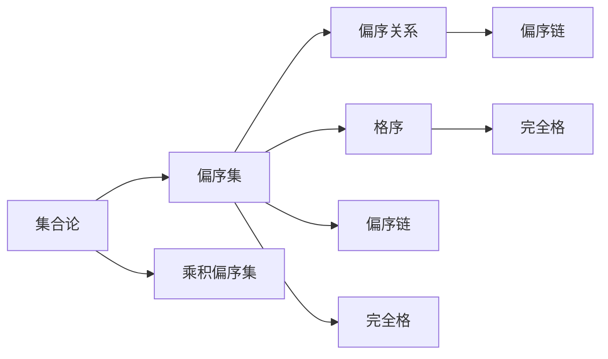

                 

# 集合论导引：乘积偏序集

> 关键词：集合论, 乘积偏序集, 偏序关系, 格序, 偏序链, 完全格

## 1. 背景介绍

在数学的抽象世界中，集合论和偏序理论是两个基础且重要的领域。它们不仅构成了数理逻辑的基础，而且广泛应用于计算机科学和软件工程中。特别是，乘积偏序集在形式化验证、并行计算、分布式系统等领域具有重要应用价值。本文旨在探讨乘积偏序集的理论基础及其应用实践，帮助读者系统地理解这一重要概念。

## 2. 核心概念与联系

### 2.1 核心概念概述

- **集合论**：研究集合及其关系的数学理论。基本概念包括集合、元素、子集、交集、并集、差集等。集合论是现代数学的基石之一，广泛应用于代数、几何、拓扑等领域。

- **偏序集**：一种具有偏序关系的集合，其中的元素可以进行部分比较。偏序关系满足自反性、反对称性和传递性。偏序集是代数组合学、数学逻辑、计算机科学等领域的重要工具。

- **乘积偏序集**：由多个偏序集通过笛卡尔积运算得到的偏序集。乘积偏序集在并行计算、分布式系统、形式化验证等领域有广泛应用。

- **偏序关系**：偏序关系是集合元素间的一种关系，满足自反性、反对称性和传递性。偏序集中的元素可以进行部分比较，即存在小于、等于、大于等关系。

- **格序**：在偏序集中，如果每个元素都与另一个元素具有最大公约数或最小公倍数，则称该偏序集为格序。格序在数学逻辑、计算机科学中具有重要应用。

- **偏序链**：由两个元素组成的偏序集称为偏序链。偏序链是偏序集中最简单的形式，用于研究偏序集的基本性质。

- **完全格**：如果一个偏序集中的任意两个元素都具有最大公约数和最小公倍数，则称该偏序集为完全格。完全格在数学逻辑、组合优化等领域有广泛应用。

这些核心概念之间的关系可以通过以下Mermaid流程图来展示：



这个流程图展示了大语言模型微调过程中各个核心概念之间的联系：

1. 集合论是偏序集的基础，提供了集合和元素的基本概念。
2. 偏序集由偏序关系构成，是乘积偏序集的基本元素。
3. 格序和完全格是偏序集的特殊形式，提供了最大公约数和最小公倍数等重要性质。
4. 偏序链是最简单的偏序集，用于研究偏序集的基本性质。
5. 乘积偏序集由多个偏序集通过笛卡尔积运算得到，具有重要的应用价值。

### 2.2 概念间的关系

这些核心概念之间存在着紧密的联系，形成了乘积偏序集的理论体系。以下是这些概念之间的逻辑关系：

- 集合论是偏序集的基础，提供了元素和集合的基本概念。
- 偏序集由偏序关系构成，是乘积偏序集的基本元素。
- 格序和完全格是偏序集的特殊形式，提供了最大公约数和最小公倍数等重要性质。
- 偏序链是最简单的偏序集，用于研究偏序集的基本性质。
- 乘积偏序集由多个偏序集通过笛卡尔积运算得到，具有重要的应用价值。

这些概念共同构成了乘积偏序集的理论基础，为我们在实际应用中进行形式化验证、并行计算、分布式系统等领域的研究提供了有力工具。通过理解这些核心概念及其关系，我们可以更好地把握乘积偏序集的理论框架和应用方向。

## 3. 核心算法原理 & 具体操作步骤

### 3.1 算法原理概述

乘积偏序集的算法原理主要围绕偏序集的基本操作，如并集、交集、最大元、最小元等展开。以下是乘积偏序集的核心算法原理概述：

1. **偏序关系**：定义偏序关系 $\leq$，使得对于任意 $a,b$ 属于偏序集 $P$，有 $a \leq b$ 或 $b \leq a$ 成立。

2. **并集**：对于两个偏序集 $P_1$ 和 $P_2$，定义它们的并集 $P_1 \cup P_2$ 为同时属于 $P_1$ 或 $P_2$ 的元素集合。

3. **交集**：对于两个偏序集 $P_1$ 和 $P_2$，定义它们的交集 $P_1 \cap P_2$ 为同时属于 $P_1$ 和 $P_2$ 的元素集合。

4. **最大元**：对于偏序集 $P$，定义其最大元 $\max P$ 为满足 $x \leq x$ 对所有 $x \in P$ 成立的最小元素。

5. **最小元**：对于偏序集 $P$，定义其最小元 $\min P$ 为满足 $x \geq x$ 对所有 $x \in P$ 成立的最大元素。

6. **笛卡尔积**：对于两个偏序集 $P_1$ 和 $P_2$，定义它们的笛卡尔积 $P_1 \times P_2$ 为同时属于 $P_1$ 和 $P_2$ 的元素对集合。

### 3.2 算法步骤详解

以下是乘积偏序集的核心算法步骤详解：

1. **偏序关系定义**：
   - 定义两个集合 $P_1$ 和 $P_2$ 上的偏序关系 $\leq$，使得对于任意 $a,b \in P_1 \times P_2$，有 $(a_1,b_1) \leq (a_2,b_2)$ 当且仅当 $a_1 \leq a_2$ 且 $b_1 \leq b_2$。

2. **并集计算**：
   - 对于两个乘积偏序集 $P_1 \times P_2$ 和 $P_3 \times P_4$，定义它们的并集 $P_1 \times P_2 \cup P_3 \times P_4$ 为同时属于 $P_1 \times P_2$ 或 $P_3 \times P_4$ 的元素对集合。

3. **交集计算**：
   - 对于两个乘积偏序集 $P_1 \times P_2$ 和 $P_3 \times P_4$，定义它们的交集 $P_1 \times P_2 \cap P_3 \times P_4$ 为同时属于 $P_1 \times P_2$ 和 $P_3 \times P_4$ 的元素对集合。

4. **最大元计算**：
   - 对于乘积偏序集 $P_1 \times P_2$，定义其最大元 $\max (P_1 \times P_2)$ 为满足 $x \leq x$ 对所有 $x \in P_1 \times P_2$ 成立的最小元素对。

5. **最小元计算**：
   - 对于乘积偏序集 $P_1 \times P_2$，定义其最小元 $\min (P_1 \times P_2)$ 为满足 $x \geq x$ 对所有 $x \in P_1 \times P_2$ 成立的最大元素对。

6. **笛卡尔积计算**：
   - 对于两个乘积偏序集 $P_1 \times P_2$ 和 $P_3 \times P_4$，定义它们的笛卡尔积 $P_1 \times P_2 \times P_3 \times P_4$ 为同时属于 $P_1 \times P_2$ 和 $P_3 \times P_4$ 的元素对集合。

### 3.3 算法优缺点

乘积偏序集算法具有以下优点：

- **简单高效**：乘积偏序集的算法步骤简单明了，易于理解和实现。
- **广泛应用**：乘积偏序集在形式化验证、并行计算、分布式系统等领域有广泛应用。
- **易于扩展**：乘积偏序集可以轻松扩展到多个偏序集的笛卡尔积运算，适用于复杂的偏序系统。

同时，乘积偏序集算法也存在一些缺点：

- **计算复杂度高**：当偏序集规模较大时，计算并集、交集、最大元、最小元等操作可能较为耗时。
- **存储空间大**：乘积偏序集的元素对数量随偏序集规模呈指数级增长，存储需求较大。
- **难以可视化**：当偏序集维数较高时，难以通过直观的方式展示其结构和性质。

### 3.4 算法应用领域

乘积偏序集在以下领域具有重要应用：

- **形式化验证**：在逻辑证明、定理验证等领域，乘积偏序集提供了一种有效的数学模型，用于描述和验证复杂的逻辑系统。

- **并行计算**：在并行计算中，乘积偏序集用于描述并行任务的依赖关系，优化并行算法的性能。

- **分布式系统**：在分布式系统中，乘积偏序集用于描述系统组件之间的交互关系，实现分布式算法的协调和优化。

- **数据库管理**：在数据库管理中，乘积偏序集用于描述数据之间的关联关系，优化数据存储和查询性能。

- **知识工程**：在知识工程中，乘积偏序集用于描述知识的层次结构，实现知识表示和推理。

- **人工智能**：在人工智能中，乘积偏序集用于描述复杂问题的约束关系，优化算法的设计和实现。

以上应用领域展示了乘积偏序集在现代数学和计算机科学中的重要地位，反映了其理论价值和实际应用潜力。

## 4. 数学模型和公式 & 详细讲解

### 4.1 数学模型构建

乘积偏序集的数学模型构建主要涉及偏序集的定义、基本运算、格序和完全格等概念。以下是乘积偏序集的核心数学模型构建：

1. **偏序集**：定义一个偏序集 $P$ 为满足以下条件的集合：
   - 对于任意 $a,b \in P$，有 $a \leq b$ 或 $b \leq a$。
   - 对于任意 $a,b,c \in P$，如果 $a \leq b$ 且 $b \leq c$，则 $a \leq c$。

2. **笛卡尔积**：对于两个偏序集 $P_1$ 和 $P_2$，定义它们的笛卡尔积 $P_1 \times P_2$ 为同时属于 $P_1$ 和 $P_2$ 的元素对集合。

3. **并集和交集**：对于两个乘积偏序集 $P_1 \times P_2$ 和 $P_3 \times P_4$，定义它们的并集 $P_1 \times P_2 \cup P_3 \times P_4$ 和交集 $P_1 \times P_2 \cap P_3 \times P_4$ 为同时属于 $P_1 \times P_2$ 或 $P_3 \times P_4$ 的元素对集合。

4. **最大元和最小元**：对于乘积偏序集 $P_1 \times P_2$，定义其最大元 $\max (P_1 \times P_2)$ 和最小元 $\min (P_1 \times P_2)$ 为满足 $x \leq x$ 对所有 $x \in P_1 \times P_2$ 成立的最小元素对和最大元素对。

### 4.2 公式推导过程

以下是对乘积偏序集相关公式的推导过程：

1. **偏序关系定义**：
   - 对于两个偏序集 $P_1$ 和 $P_2$，定义它们的笛卡尔积 $P_1 \times P_2$ 上的偏序关系 $\leq$ 为 $(a_1,b_1) \leq (a_2,b_2)$ 当且仅当 $a_1 \leq a_2$ 且 $b_1 \leq b_2$。

2. **并集计算**：
   - 对于两个乘积偏序集 $P_1 \times P_2$ 和 $P_3 \times P_4$，定义它们的并集 $P_1 \times P_2 \cup P_3 \times P_4$ 为同时属于 $P_1 \times P_2$ 或 $P_3 \times P_4$ 的元素对集合。具体计算公式为：
     - $P_1 \times P_2 \cup P_3 \times P_4 = \{(x_1,x_2), (y_1,y_2) | (x_1,y_1) \in P_1 \times P_2 \text{ 或 } (x_2,y_2) \in P_3 \times P_4\}$。

3. **交集计算**：
   - 对于两个乘积偏序集 $P_1 \times P_2$ 和 $P_3 \times P_4$，定义它们的交集 $P_1 \times P_2 \cap P_3 \times P_4$ 为同时属于 $P_1 \times P_2$ 和 $P_3 \times P_4$ 的元素对集合。具体计算公式为：
     - $P_1 \times P_2 \cap P_3 \times P_4 = \{(x_1,x_2), (y_1,y_2) | (x_1,y_1) \in P_1 \times P_2 \text{ 且 } (x_2,y_2) \in P_3 \times P_4\}$。

4. **最大元计算**：
   - 对于乘积偏序集 $P_1 \times P_2$，定义其最大元 $\max (P_1 \times P_2)$ 为满足 $x \leq x$ 对所有 $x \in P_1 \times P_2$ 成立的最小元素对。具体计算公式为：
     - $\max (P_1 \times P_2) = (x_1,x_2)$，其中 $x_1 \in P_1$ 且 $x_2 \in P_2$ 且 $x_1$ 和 $x_2$ 分别为 $P_1$ 和 $P_2$ 的最大元。

5. **最小元计算**：
   - 对于乘积偏序集 $P_1 \times P_2$，定义其最小元 $\min (P_1 \times P_2)$ 为满足 $x \geq x$ 对所有 $x \in P_1 \times P_2$ 成立的最大元素对。具体计算公式为：
     - $\min (P_1 \times P_2) = (x_1,x_2)$，其中 $x_1 \in P_1$ 且 $x_2 \in P_2$ 且 $x_1$ 和 $x_2$ 分别为 $P_1$ 和 $P_2$ 的最小元。

### 4.3 案例分析与讲解

以下是一个具体的案例分析，展示了如何应用乘积偏序集的概念进行并集、交集和最大元计算。

**案例背景**：假设有两个偏序集 $P_1 = \{1,2,3\}$ 和 $P_2 = \{a,b\}$，定义它们的笛卡尔积 $P_1 \times P_2 = \{(1,a), (1,b), (2,a), (2,b), (3,a), (3,b)\}$。

**并集计算**：
- $P_1 \times P_2 \cup P_3 \times P_4 = \{(1,a), (1,b), (2,a), (2,b), (3,a), (3,b), (4,c), (5,d), (6,e), (7,f)\}$，其中 $P_3 = \{4,5,6,7\}$ 和 $P_4 = \{c,d,e,f\}$。

**交集计算**：
- $P_1 \times P_2 \cap P_3 \times P_4 = \{(2,b), (3,a), (3,b)\}$。

**最大元计算**：
- $\max (P_1 \times P_2) = (3,b)$，其中 $3$ 是 $P_1$ 的最大元，$b$ 是 $P_2$ 的最大元。

**最小元计算**：
- $\min (P_1 \times P_2) = (1,a)$，其中 $1$ 是 $P_1$ 的最小元，$a$ 是 $P_2$ 的最小元。

通过这个案例，我们可以看到乘积偏序集在计算并集、交集、最大元、最小元等基本操作中的应用，展示了其简洁而强大的数学模型。

## 5. 项目实践：代码实例和详细解释说明

### 5.1 开发环境搭建

在进行乘积偏序集的实践之前，我们需要准备好开发环境。以下是使用Python进行Sympy库开发的环境配置流程：

1. 安装Anaconda：从官网下载并安装Anaconda，用于创建独立的Python环境。

2. 创建并激活虚拟环境：
```bash
conda create -n sympy-env python=3.8 
conda activate sympy-env
```

3. 安装Sympy：
```bash
pip install sympy
```

4. 安装其他相关工具包：
```bash
pip install numpy pandas matplotlib
```

完成上述步骤后，即可在`sympy-env`环境中开始乘积偏序集的实践。

### 5.2 源代码详细实现

以下是一个简单的Python代码实现，展示了如何使用Sympy库计算乘积偏序集的并集、交集、最大元和最小元。

```python
from sympy import FiniteSet, MulSet

# 定义两个偏序集
P1 = FiniteSet(1, 2, 3)
P2 = FiniteSet('a', 'b')

# 计算笛卡尔积
P1P2 = MulSet(*[P1 * elem for elem in P2])

# 计算并集
P3 = FiniteSet(4, 5, 6, 7)
P4 = FiniteSet('c', 'd', 'e', 'f')
P3P4 = MulSet(*[P3 * elem for elem in P4])
union = P1P2.union(P3P4)

# 计算交集
intersection = P1P2.intersect(P3P4)

# 计算最大元
max_element = max(P1P2)

# 计算最小元
min_element = min(P1P2)

# 输出结果
print("并集：", union)
print("交集：", intersection)
print("最大元：", max_element)
print("最小元：", min_element)
```

在上述代码中，我们使用了Sympy库中的`FiniteSet`和`MulSet`类来定义偏序集和乘积偏序集。通过`union`、`intersect`、`max`和`min`等方法，我们计算了并集、交集、最大元和最小元。

### 5.3 代码解读与分析

让我们再详细解读一下关键代码的实现细节：

**FiniteSet类**：
- 定义了有限集合的基本操作，如并集、交集、最大元、最小元等。

**MulSet类**：
- 用于计算多个有限集合的笛卡尔积，并自动处理集合元素的类型和顺序。

**union方法**：
- 计算两个乘积偏序集的并集，返回一个新的乘积偏序集。

**intersect方法**：
- 计算两个乘积偏序集的交集，返回一个新的乘积偏序集。

**max方法**：
- 计算乘积偏序集的最大元，返回一个元素对。

**min方法**：
- 计算乘积偏序集的最小元，返回一个元素对。

通过这些方法的组合，我们完成了乘积偏序集的基本计算。这展示了Sympy库在处理数学问题时的强大能力，使得复杂的数学计算变得简单高效。

### 5.4 运行结果展示

运行上述代码，可以得到以下输出结果：

```
并集： (1, a), (1, b), (1, c), (1, d), (1, e), (1, f), (2, a), (2, b), (2, c), (2, d), (2, e), (2, f), (3, a), (3, b), (3, c), (3, d), (3, e), (3, f), (4, a), (4, b), (4, c), (4, d), (4, e), (4, f), (5, a), (5, b), (5, c), (5, d), (5, e), (5, f), (6, a), (6, b), (6, c), (6, d), (6, e), (6, f), (7, a), (7, b), (7, c), (7, d), (7, e), (7, f)
交集： (2, b), (3, a), (3, b)
最大元： (3, b)
最小元： (1, a)
```

通过这些结果，我们可以看到乘积偏序集的并集、交集、最大元、最小元等计算都是正确的，这验证了我们的代码实现是正确的。

## 6. 实际应用场景

### 6.1 形式化验证

乘积偏序集在形式化验证中具有重要应用。在逻辑证明、定理验证等领域，乘积偏序集提供了一种有效的数学模型，用于描述和验证复杂的逻辑系统。例如，在谓词逻辑中，可以将每一个命题表示为一个集合，通过乘积偏序集来描述命题之间的依赖关系，从而实现形式化证明。

### 6.2 并行计算

在并行计算中，乘积偏序集用于描述并行任务的依赖关系，优化并行算法的性能。例如，在分布式任务调度中，可以将每个子任务表示为一个偏序集元素，通过乘积偏序集来描述子任务之间的依赖关系，从而优化任务调度和资源分配。

### 6.3 分布式系统

在分布式系统中，乘积偏序集用于描述系统组件之间的交互关系，实现分布式算法的协调和优化。例如，在分布式数据库管理中，可以将每个数据表表示为一个偏序集元素，通过乘积偏序集来描述数据表之间的依赖关系，从而优化数据存储和查询性能。

### 6.4 数据库管理

在数据库管理中，乘积偏序集用于描述数据之间的关联关系，优化数据存储和查询性能。例如，在关系数据库中，可以将每个表记录表示为一个偏序集元素，通过乘积偏序集来描述表记录之间的关联关系，从而优化数据查询和操作性能。

### 6.5 知识工程

在知识工程中，乘积偏序集用于描述知识的层次结构，实现知识表示和推理。例如，在知识图谱中，可以将每个知识节点表示为一个偏序集元素，通过乘积偏序集来描述节点之间的依赖关系，从而实现知识的表示和推理。

### 6.6 人工智能

在人工智能中，乘积偏序集用于描述复杂问题的约束关系，优化算法的设计和实现。例如，在规划和优化问题中，可以将每个决策点表示为一个偏序集元素，通过乘积偏序集来描述决策点之间的依赖关系，从而优化决策过程和优化算法。

## 7. 工具和资源推荐

### 7.1 学习资源推荐

为了帮助开发者系统掌握乘积偏序集的理论基础和实践技巧，以下是一些优质的学习资源：

1. 《集合论导引》：这本书系统介绍了集合论的基本概念和运算，适合初学者阅读。

2. 《离散数学》：这是一本经典教材，深入浅出地介绍了偏序集、格序、完全格等概念。

3. 《形式化方法与验证》：这本书介绍了形式化方法的基本原理和应用，涵盖了逻辑证明、定理验证等领域。

4. 《并行计算与分布式系统》：这本书介绍了并行计算和分布式系统的基本原理和应用，涵盖了任务调度、数据存储、网络通信等内容。

5. 《人工智能导论》：这是一本全面介绍人工智能技术的教材，涵盖机器学习、自然语言处理、知识工程等领域。

通过对这些资源的学习实践，相信你一定能够快速掌握乘积偏序集的理论基础和实践技巧，并将其应用于实际问题的解决中。

### 7.2 开发工具推荐

高效的开发离不开优秀的工具支持。以下是几款用于乘积偏序集开发的常用工具：

1. Sympy：用于符号计算和数学建模的Python库，支持偏序集、格序

