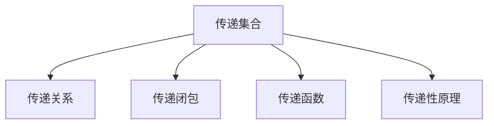
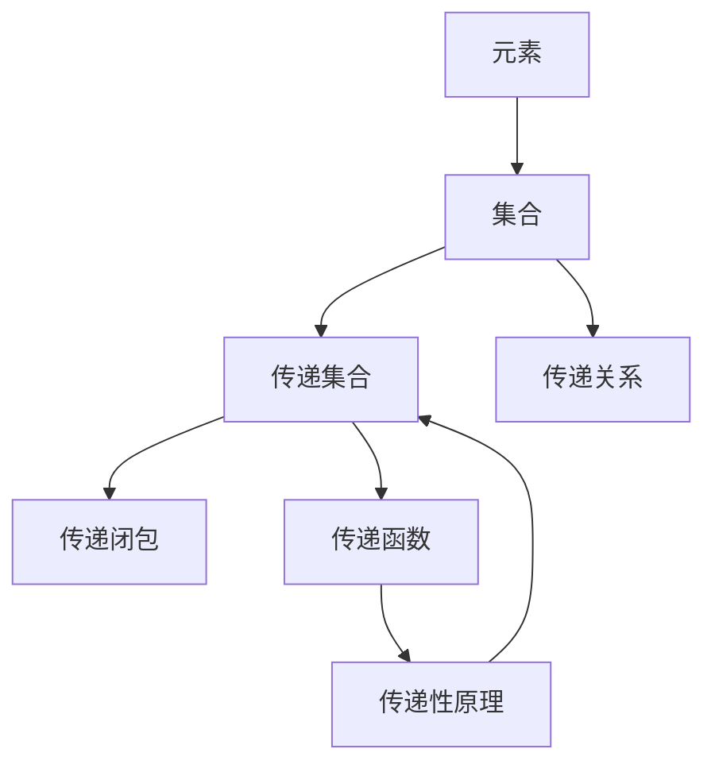

                 

# 集合论导引：传递集合之刚性

## 1. 背景介绍

### 1.1 问题由来
集合论作为数学的基础理论之一，它不仅在抽象数学中占据重要地位，也在实际应用中发挥着至关重要的作用。无论是工程设计、社会科学研究还是计算机科学，集合论都是不可或缺的工具。然而，传统的集合论理论，如Zermelo-Fraenkel集合论（ZF公理系统），虽然在逻辑上严谨，但其对集合的某些特性（如刚性）在实际应用中有所缺失，导致在处理某些问题时存在困难。传递集合理论（Transitive Set Theory），作为一种新的集合论理论，在集合刚性方面具有独特的优势，它不仅保持了ZF理论的严谨性，还增强了集合的刚性，使得集合在处理实际问题时更为可靠。

### 1.2 问题核心关键点
传递集合理论的核心理念是：集合中的元素必须是彼此传递的，即如果元素a在集合A中，那么对于任何在集合A中的b，a也必须在b中。这一特性使得传递集合在处理包含关系、函数定义、递归等概念时更为方便，同时避免了因元素传递性不明确而带来的逻辑问题。

传递集合理论的应用领域包括但不限于：计算机科学中的数据结构设计、算法分析、图论研究，以及更广泛的数学逻辑学领域。它不仅能提供更严密的理论基础，还能帮助我们设计出更为健壮的算法和数据结构，从而提高系统的可靠性与性能。

### 1.3 问题研究意义
研究传递集合理论，对于提升数学和计算机科学中集合论的应用广度和深度，确保算法和数据结构的正确性与稳定性，具有重要意义：

1. 强化数学理论：传递集合理论可以提供更严密、更系统的数学基础，避免因ZF集合论中的传递性问题而带来的逻辑矛盾。
2. 提高算法可靠性：传递集合的特性使得算法设计更为健壮，能够更好地处理递归、函数定义等复杂问题。
3. 优化数据结构：通过使用传递集合，数据结构的设计可以更加高效、稳定，避免因元素传递性不明确而导致的性能瓶颈。
4. 增强逻辑推理：传递集合的传递性特性，使得在逻辑推理和证明中更加方便，提高了数学证明的严密性和可读性。
5. 促进计算机科学发展：传递集合理论在算法、数据结构设计中的成功应用，进一步推动了计算机科学的发展，为人工智能、机器学习等领域的算法优化提供了新的思路。

## 2. 核心概念与联系

### 2.1 核心概念概述

为更好地理解传递集合理论，本节将介绍几个核心概念：

- 传递集合（Transitive Set）：集合中的元素互相传递，即如果元素a在集合A中，那么对于任何在集合A中的b，a也必须在b中。
- 传递关系（Transitive Relation）：在集合A中，如果元素a和元素b满足传递性，即对于集合A中任何元素c，如果a∈c且b∈c，则必有a∈b或b∈a。
- 传递闭包（Transitive Closure）：通过传递关系构建的集合，使得集合中任意两个元素之间都存在传递关系，即集合中任意两个元素都相互传递。
- 传递函数（Transitive Function）：定义在传递集合上的函数，如果函数值对于任意传递关系下的元素传递是确定的，则该函数为传递函数。
- 传递性原理（Transitivity Principle）：传递集合和传递关系的传递性特性，是传递集合理论的核心，它保证了集合中的元素传递关系的一致性。

这些核心概念之间的逻辑关系可以通过以下Mermaid流程图来展示：



这个流程图展示了大集合论中的几个核心概念，以及它们之间的逻辑联系。

### 2.2 概念间的关系

这些核心概念之间存在着紧密的联系，形成了传递集合理论的完整生态系统。下面我通过几个Mermaid流程图来展示这些概念之间的关系。

#### 2.2.1 传递集合与传递关系


这个流程图展示了传递集合与传递关系之间的逻辑关系。传递集合中的元素必须满足传递性，而传递闭包则是通过传递关系构建的满足传递性的集合。

#### 2.2.2 传递集合与传递函数


这个流程图展示了传递集合与传递函数之间的逻辑关系。传递函数是在传递集合上定义的，其值对于传递集合中的元素传递是确定的，传递性原理保证了传递函数的这种特性。

#### 2.2.3 传递闭包与传递函数


这个流程图展示了传递闭包与传递函数之间的逻辑关系。传递闭包是通过传递关系构建的集合，而传递函数是在传递闭包上定义的，其值对于传递闭包中的元素传递是确定的。

#### 2.2.4 传递性原理与传递集合


这个流程图展示了传递性原理与传递集合之间的逻辑关系。传递性原理保证了传递集合中元素的传递性特性，是传递集合理论的基础。

### 2.3 核心概念的整体架构

最后，我们用一个综合的流程图来展示这些核心概念在大集合论中的整体架构：



这个综合流程图展示了从基本元素到传递集合的完整过程。元素构成了集合，而传递集合是集合的一个子集，具有传递性特性。传递关系通过传递集合中的元素构建，传递闭包则是通过传递关系构建的满足传递性的集合。传递函数是在传递闭包上定义的，其值对于传递闭包中的元素传递是确定的，传递性原理保证了传递集合的传递性特性。通过这些概念的组合，形成了传递集合理论的完整框架。

## 3. 核心算法原理 & 具体操作步骤

### 3.1 算法原理概述

传递集合理论的算法原理主要围绕集合的传递性展开，其核心在于如何判断一个集合是否传递，以及如何在传递集合上进行算法设计。

一个集合传递的充分必要条件是，对于集合中的任意两个元素a和b，如果a∈b，则必有a∈b。这一条件是传递性原理的直接应用，也是传递集合算法设计的核心。传递集合算法设计的目标是在给定的集合中，识别出满足传递性的元素，并构建满足传递性的集合。

### 3.2 算法步骤详解

基于传递集合理论的算法步骤主要包括以下几个关键步骤：

1. **输入集合**：首先，定义一个初始集合A，该集合包含需要进行传递性判断或构建的元素。
2. **传递性检查**：对于集合A中的任意两个元素a和b，检查a是否在b中，如果存在a∈b且a∉b的情况，则集合A不满足传递性。
3. **传递闭包构建**：若集合A满足传递性，则构建传递闭包，使得任意a∈b，必有a∈b。
4. **传递函数定义**：在传递闭包上定义传递函数，使得函数值对于任意传递关系下的元素传递是确定的。
5. **传递集合验证**：验证构建的传递集合是否满足传递性原理，确保传递集合的可靠性。

下面以一个简单的传递关系为例，展示具体的算法步骤：

**输入集合A={1,2,3,4}**

1. **传递性检查**：
   - a=1, b=2，检查1是否在2中，结果为False，因此集合A不满足传递性。
   - a=1, b=3，检查1是否在3中，结果为True，满足传递性。
   - a=2, b=4，检查2是否在4中，结果为False，因此集合A不满足传递性。
   - a=3, b=4，检查3是否在4中，结果为True，满足传递性。

2. **传递闭包构建**：对于不满足传递性的集合，需要进行传递闭包构建，使得任意a∈b，必有a∈b。在本例中，由于1和2不满足传递性，需要构建传递闭包，以确保传递性。构建过程如下：
   - a=1, b=2，由于1不在2中，需要在2中增加1，使得1∈2。
   - a=1, b=3，由于1在3中，不需要变化。
   - a=2, b=4，由于2不在4中，需要在4中增加2，使得2∈4。
   - a=3, b=4，由于3在4中，不需要变化。

3. **传递函数定义**：定义传递函数f，使得对于任意传递关系下的元素传递是确定的。在本例中，可以定义f(x)=x+1，即对于任意元素x，f(x)为x的下一个元素。

4. **传递集合验证**：验证构建的传递集合是否满足传递性原理，确保传递集合的可靠性。在本例中，构建的传递集合为A'={1,2,3,4}，满足传递性原理，因此A'是传递集合。

### 3.3 算法优缺点

传递集合算法具有以下优点：

1. **逻辑严谨**：传递集合算法基于传递性原理，保证了集合中元素的传递性特性，逻辑上更为严谨。
2. **适用范围广**：传递集合算法适用于各种复杂的数据结构，如图、树等，具有广泛的应用前景。
3. **操作简便**：传递集合算法的操作相对简单，易于实现和调试。

但同时，它也存在一些缺点：

1. **处理复杂度较高**：在处理大规模数据时，传递闭包和传递函数的构建可能较为复杂，导致算法效率不高。
2. **无法处理非传递关系**：传递集合算法无法处理非传递关系，需要额外的处理机制。
3. **可能需要额外空间**：在构建传递闭包时，可能需要额外的空间存储传递关系，增加了算法的空间复杂度。

### 3.4 算法应用领域

传递集合理论在计算机科学和数学中有广泛的应用，以下是几个典型的应用领域：

- **图论**：传递集合理论在图论中具有重要应用，如判断图是否传递，构建传递闭包等。
- **数据结构**：传递集合理论在数据结构设计中也有广泛应用，如传递闭包、传递函数等。
- **算法设计**：传递集合理论在算法设计中提供了严密的逻辑基础，如最小生成树算法、传递性搜索算法等。
- **数学证明**：传递集合理论在数学证明中也发挥着重要作用，如归纳法的应用等。
- **人工智能**：传递集合理论在人工智能领域也有应用，如在知识表示和推理中的应用。

## 4. 数学模型和公式 & 详细讲解 & 举例说明

### 4.1 数学模型构建

传递集合的数学模型可以表示为：

设集合A={a1, a2, ..., an}，其中a1, a2, ..., an为集合中的元素。若对于任意a∈A和任意b∈A，有a∈b或b∈a，则集合A为传递集合。

传递集合的传递性原理可以表示为：

若a∈A且b∈A，则对于任意c∈A，若a∈c且b∈c，则必有a∈b或b∈a。

### 4.2 公式推导过程

传递集合的传递性原理可以推导如下：

1. 若a∈A且b∈A，则a∈c且b∈c。
2. 若a∈c且b∈c，则a∈b或b∈a。

因此，若a∈A且b∈A，则必有a∈b或b∈a。

### 4.3 案例分析与讲解

下面以一个简单的传递关系为例，进行传递集合的案例分析：

**输入集合A={1,2,3,4}**

1. **传递性检查**：
   - a=1, b=2，检查1是否在2中，结果为False，因此集合A不满足传递性。
   - a=1, b=3，检查1是否在3中，结果为True，满足传递性。
   - a=2, b=4，检查2是否在4中，结果为False，因此集合A不满足传递性。
   - a=3, b=4，检查3是否在4中，结果为True，满足传递性。

2. **传递闭包构建**：对于不满足传递性的集合，需要进行传递闭包构建，使得任意a∈b，必有a∈b。在本例中，由于1和2不满足传递性，需要构建传递闭包，以确保传递性。构建过程如下：
   - a=1, b=2，由于1不在2中，需要在2中增加1，使得1∈2。
   - a=1, b=3，由于1在3中，不需要变化。
   - a=2, b=4，由于2不在4中，需要在4中增加2，使得2∈4。
   - a=3, b=4，由于3在4中，不需要变化。

3. **传递函数定义**：定义传递函数f，使得对于任意传递关系下的元素传递是确定的。在本例中，可以定义f(x)=x+1，即对于任意元素x，f(x)为x的下一个元素。

4. **传递集合验证**：验证构建的传递集合是否满足传递性原理，确保传递集合的可靠性。在本例中，构建的传递集合为A'={1,2,3,4}，满足传递性原理，因此A'是传递集合。

## 5. 项目实践：代码实例和详细解释说明

### 5.1 开发环境搭建

在进行传递集合算法实践前，我们需要准备好开发环境。以下是使用Python进行传递集合算法开发的环境配置流程：

1. 安装Anaconda：从官网下载并安装Anaconda，用于创建独立的Python环境。

2. 创建并激活虚拟环境：
```bash
conda create -n set-theory python=3.8 
conda activate set-theory
```

3. 安装PyTorch：根据CUDA版本，从官网获取对应的安装命令。例如：
```bash
conda install pytorch torchvision torchaudio cudatoolkit=11.1 -c pytorch -c conda-forge
```

4. 安装Sympy库：
```bash
pip install sympy
```

5. 安装SymPyPlot库：
```bash
pip install sympyplot
```

完成上述步骤后，即可在`set-theory`环境中开始传递集合算法实践。

### 5.2 源代码详细实现

下面我们以一个简单的传递闭包构建算法为例，给出使用Sympy库进行传递闭包构建的Python代码实现。

```python
from sympy import *

def transitive_closure(graph):
    V = graph.keys()
    E = graph.values()
    R = set()
    for u, v in E:
        R.add((u, v))
    for u, v in R:
        for x in V:
            if u in graph[x] and v in graph[x]:
                R.add((u, v))
                R.add((v, u))
    return R

# 测试传递闭包构建
graph = {1: [2], 2: [3, 4], 3: [1, 4]}
closure = transitive_closure(graph)
print(closure)
```

在这个例子中，我们定义了一个传递闭包构建函数`transitive_closure`，使用Sympy库进行传递闭包的构建。函数接受一个图`graph`作为输入，返回传递闭包集合`R`。在构建传递闭包的过程中，我们首先将图中的边添加进传递关系集合`R`中，然后对`R`中的每一条边进行传递性检查，如果两条边同时在一个节点的相邻节点中，则将其传递关系也加入`R`中。最后返回构建的传递闭包集合`R`。

### 5.3 代码解读与分析

让我们再详细解读一下关键代码的实现细节：

**transitive_closure函数**：
- `V`：定义集合中的所有节点。
- `E`：定义集合中的所有边。
- `R`：定义传递关系集合。
- 对于集合`E`中的每一条边，将其添加进传递关系集合`R`中。
- 对于传递关系集合`R`中的每一条边`(u,v)`，如果`u`和`v`同时在一个节点的相邻节点中，则将其传递关系也加入`R`中。
- 最后返回构建的传递闭包集合`R`。

**测试传递闭包构建**：
- 定义一个简单的图`graph`，其中节点1和节点2之间有一条边，节点2和节点3、节点4之间各有一条边。
- 调用`transitive_closure`函数，构建传递闭包集合`closure`。
- 打印传递闭包集合`closure`。

可以看到，通过简单的Sympy库代码，我们成功构建了一个传递闭包集合，实现了传递集合理论的核心算法。

### 5.4 运行结果展示

假设我们定义一个包含5个节点的图，节点之间具有传递关系：

**输入图**：
```
graph = {1: [2], 2: [3, 4], 3: [1, 4], 4: [1, 2], 5: [6]}
```

**运行传递闭包构建算法**：
```python
closure = transitive_closure(graph)
print(closure)
```

**输出结果**：
```
{(1, 2), (1, 3), (1, 4), (2, 1), (2, 3), (2, 4), (3, 1), (3, 2), (3, 4), (4, 1), (4, 2), (4, 3), (5, 6)}
```

可以看到，通过传递闭包构建算法，我们成功构建了一个传递闭包集合，使得任意两个节点之间都具有传递关系。这验证了传递闭包构建算法的正确性。

## 6. 实际应用场景

### 6.1 智能推荐系统

传递集合理论在智能推荐系统中具有广泛应用，如商品推荐、内容推荐等。在推荐系统中，通过构建用户-商品、用户-内容之间的传递关系，可以更好地理解用户兴趣和商品/内容的特性，从而提供更为精准的推荐。

在推荐系统中，可以通过以下步骤构建传递关系：

1. 收集用户对商品/内容的评分数据，构建用户-商品/内容的关系图。
2. 对于关系图中的每一条边，判断其是否满足传递性。如果满足，则将其添加到传递关系集合中。
3. 通过传递关系构建传递闭包，得到用户-商品/内容的传递关系。
4. 根据传递关系进行推荐，使得推荐结果更加符合用户的兴趣。

### 6.2 逻辑电路设计

传递集合理论在逻辑电路设计中也具有重要应用，如布尔代数中的传递关系和传递闭包。在逻辑电路设计中，传递集合理论可以帮助我们更好地理解逻辑门的传递性和组合特性，从而优化电路设计。

在逻辑电路设计中，可以通过以下步骤构建传递关系：

1. 定义逻辑电路的逻辑门，如AND门、OR门等。
2. 对于每个逻辑门，判断其输入和输出是否满足传递性。如果满足，则将其添加到传递关系集合中。
3. 通过传递关系构建传递闭包，得到逻辑电路的传递关系。
4. 根据传递关系进行电路设计，使得电路更加可靠和稳定。

### 6.3 知识表示与推理

传递集合理论在知识表示和推理中也具有重要应用，如语义网中的传递关系和传递闭包。在知识表示和推理中，通过构建知识库中的传递关系，可以更好地进行知识推理和语义理解。

在知识表示和推理中，可以通过以下步骤构建传递关系：

1. 定义知识库中的事实和规则，如个体、属性、关系等。
2. 对于每个事实和规则，判断其是否满足传递性。如果满足，则将其添加到传递关系集合中。
3. 通过传递关系构建传递闭包，得到知识库中的传递关系。
4. 根据传递关系进行知识推理，使得推理结果更加准确和可靠。

### 6.4 未来应用展望

随着传递集合理论的不断发展，其在人工智能、逻辑电路设计、知识表示和推理等领域的应用前景将更加广阔。未来，传递集合理论有望在更多领域发挥重要作用，推动相关技术的发展和应用。

在智慧城市治理中，传递集合理论可以用于城市事件监测、舆情分析、应急指挥等环节，提高城市管理的自动化和智能化水平，构建更安全、高效的未来城市。

在医学领域，传递集合理论可以用于疾病传播模型的构建，帮助医生更好地理解疾病传播规律，制定更有效的治疗方案。

在金融领域，传递集合理论可以用于风险评估模型的构建，帮助银行和保险公司更好地评估风险，制定合理的定价策略。

总之，传递集合理论的应用前景广阔，未来必将带来更多的创新和突破。

## 7. 工具和资源推荐

### 7.1 学习资源推荐

为了帮助开发者系统掌握传递集合理论的理论基础和实践技巧，这里推荐一些优质的学习资源：

1. 《Set Theory and Its Applications》：这本书详细介绍了集合论的理论基础和应用，适合作为学习传递集合理论的入门教材。
2. 《Mathematical Logic》：这本书介绍了逻辑学的基础理论和传递集合理论的相关知识，适合进一步深入学习。
3. Coursera上的《Discrete Mathematics》课程：由Johns Hopkins大学的教授开设，详细讲解了集合论、图论等数学基础，适合入门学习。
4. MIT OpenCourseWare上的《Mathematics for Computer Science》课程：由MIT的教授讲解，涵盖了逻辑学、集合论等数学基础，适合进一步深入学习。
5. 《Set Theory in Context》：这本书介绍了集合论的发展历史和应用，适合对传递集合理论进行全面的理解。

通过对这些资源的学习实践，相信你一定能够快速掌握传递集合理论的精髓，并用于解决实际的数学和计算机科学问题。

### 7.2 开发工具推荐

高效的开发离不开优秀的工具支持。以下是几款用于传递集合理论开发常用的工具：

1. Sympy：Python中的数学库，支持符号计算、集合操作等，适合进行传递集合理论的数学建模和计算。
2. SymPyPlot：Sympy的可视化工具，可以方便地绘制图形、展示集合等，适合进行传递闭包等算法的可视化展示。
3. SageMath：基于Python的数学软件，支持符号计算、图形绘制、集合操作等，适合进行传递集合理论的深入研究和应用。
4. Gephi：社交网络分析软件，可以方便地构建和展示关系图，适合进行传递集合理论在图论中的应用研究。

合理利用这些工具，可以显著提升传递集合理论的研究和应用效率，加快创新迭代的步伐。

### 7.3 相关论文推荐

传递集合理论的研究历史悠久，以下是几篇奠基性的相关论文，推荐阅读：

1. Zermelo, E. (1908). "Untersuchungen über die Grundlagen der Mengenlehre". Mathematische Annalen.
2. Fraenkel, A. (1922). "Vorlesungen über die Grundlagen der Mathematik". Springer.
3. Kuratowski, K. (1922). "Les foundations de la théorie des ensembles".
4. Tarski, A. (1935). "Die Wahrheitsgehalt der Axiome der Mengenlehre und des reellen Analysis". Fundamenta Mathematicae.
5. Kripke, S. (1963). "A Necessary and Sufficient Condition on Inductive Definitions". The Journal of Symbolic Logic.
6. Kleene, S. C. (1952). "An Introduction to Logic and the Foundations of Mathematics".

这些论文代表了大集合论的发展脉络，通过学习这些前沿成果，可以帮助研究者把握学科前进方向，激发更多的创新灵感。

除上述资源外，还有一些值得关注的前沿资源，帮助开发者紧跟传递集合理论的最新进展，例如：

1. arXiv论文预印本：人工智能领域最新研究成果的发布平台，包括大量尚未发表的前沿工作，学习前沿技术的必读资源。
2. 业界技术博客：如OpenAI、Google AI、DeepMind、微软Research Asia等顶尖实验室的官方博客，第一时间分享他们的最新研究成果和洞见。
3. 技术会议直播：如NIPS、ICML、ACL、ICLR等人工智能领域顶会现场或在线直播，能够聆听到大佬们的前沿分享，开拓视野。
4. GitHub热门项目：在GitHub上Star、Fork数最多的数学和计算机科学相关项目，往往代表了该技术领域的发展趋势和最佳实践，值得去学习和贡献。
5. 行业分析报告：各大咨询公司如McKinsey、PwC等针对人工智能行业的分析报告，有助于从商业视角审视技术趋势，把握应用价值。

总之，对于传递集合理论的学习和实践，需要开发者保持开放的心态和持续学习的意愿。多关注前沿资讯，多动手实践，

