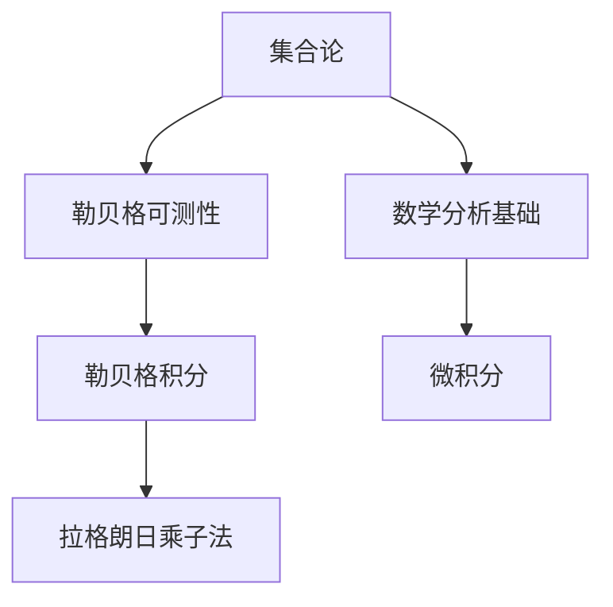
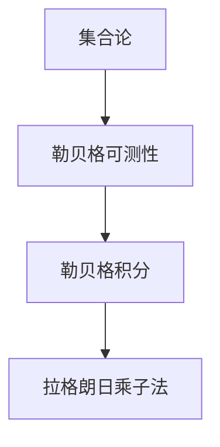

                 

# 集合论导引：勒贝格可测性

> 关键词：集合论, 勒贝格可测性, 拉格朗日乘子法, 微积分基础, 数学分析基础

## 1. 背景介绍

### 1.1 问题由来
在高等数学的学习中，集合论和勒贝格可测性是不可或缺的重要内容。它们不仅在数学分析中有着广泛的应用，在现代物理、工程、经济学等多个领域也有着重要的影响。然而，集合论的理论基础和勒贝格可测性的概念对于初学者来说往往难以理解。本博客旨在通过系统的介绍和生动的案例分析，帮助读者全面掌握集合论和勒贝格可测性的核心内容。

### 1.2 问题核心关键点
本博客将主要围绕以下几个核心关键点进行深入探讨：

- 集合论的基本概念和公理系统。
- 勒贝格可测性的定义和性质。
- 勒贝格积分的基本概念和计算方法。
- 拉格朗日乘子法在数学优化中的应用。

通过这些关键点的系统讲解，读者将能够深入理解勒贝格可测性，并掌握其在实际应用中的具体使用。

### 1.3 问题研究意义
掌握集合论和勒贝格可测性的基础知识，对于进一步学习高等数学、数学分析、泛函分析等科目具有重要意义。在现代物理中，勒贝格可测性是处理大量数据和物理量测量的关键工具。在金融工程中，勒贝格积分被广泛用于风险评估和资产定价。因此，深入理解勒贝格可测性，对于拓宽数学视野，提升数学分析能力，具有重要意义。

## 2. 核心概念与联系

### 2.1 核心概念概述

为了更好地理解勒贝格可测性，本节将介绍几个密切相关的核心概念：

- 集合论：研究集合的性质、结构和操作的数学理论。是数学的基础分支之一。
- 勒贝格可测性：衡量一个集合在度量空间中大小的数学概念，是实变函数和积分理论的核心。
- 拉格朗日乘子法：一种用于解决约束优化问题的数学方法，广泛应用于工程优化和经济学。
- 数学分析基础：包括极限、连续、微积分等核心概念，是理解勒贝格可测性和勒贝格积分的基础。

这些核心概念之间的逻辑关系可以通过以下Mermaid流程图来展示：



这个流程图展示了大语言模型的核心概念及其之间的关系：

1. 集合论是数学的基础，勒贝格可测性是其重要应用。
2. 勒贝格可测性的理解需要建立在数学分析的基础上。
3. 勒贝格可测性是计算勒贝格积分的前提。
4. 拉格朗日乘子法在数学优化中的应用，也是勒贝格积分的一个应用场景。

### 2.2 概念间的关系

这些核心概念之间存在着紧密的联系，形成了集合论和勒贝格可测性的完整生态系统。下面我通过几个Mermaid流程图来展示这些概念之间的关系。

#### 2.2.1 集合论与勒贝格可测性


这个流程图展示了集合论和勒贝格可测性之间的逻辑关系：集合论是勒贝格可测性的基础。

#### 2.2.2 勒贝格可测性与勒贝格积分


这个流程图展示了勒贝格可测性和勒贝格积分之间的关系：勒贝格可测性是计算勒贝格积分的前提。

#### 2.2.3 拉格朗日乘子法与勒贝格积分


这个流程图展示了拉格朗日乘子法与勒贝格积分之间的关系：拉格朗日乘子法是勒贝格积分的一个应用场景。

### 2.3 核心概念的整体架构

最后，我们用一个综合的流程图来展示这些核心概念在大语言模型微调过程中的整体架构：



这个综合流程图展示了从集合论到勒贝格可测性，再到勒贝格积分的完整过程。通过这些核心概念的学习，读者将能够深入理解勒贝格可测性，并掌握其在实际应用中的具体使用。

## 3. 核心算法原理 & 具体操作步骤

### 3.1 算法原理概述

勒贝格可测性是实变函数和积分理论中的核心概念，它衡量了一个集合在度量空间中的大小。一个集合$A$被称为勒贝格可测的，如果存在一个可测集$A'$，使得$A' \subseteq A$且$A \subseteq A'$，且$A'$的测度等于$A$的测度。

勒贝格可测性的基本性质包括：

1. 可加性：如果$A$和$B$是两个勒贝格可测集，且$A \cap B = \emptyset$，则$A \cup B$也是勒贝格可测的。
2. 连续性：如果$A$是勒贝格可测集，则任何包含$A$的开集都是勒贝格可测的。
3. 可分解性：如果$A$是勒贝格可测集，则任何与$A$相差的可测集都是勒贝格可测的。

### 3.2 算法步骤详解

以下是实现勒贝格可测性判断的一般步骤：

**Step 1: 准备集合和度量空间**
- 定义度量空间$(\mathcal{X}, \rho)$，其中$\mathcal{X}$为样本空间，$\rho$为度量。
- 定义集合$A$，准备判断其是否为勒贝格可测集。

**Step 2: 构造勒贝格可测集**
- 构造一个包含$A$的可测集$A'$，使得$A' \subseteq A$且$A \subseteq A'$。
- 计算$A'$的测度$m(A')$，并将其作为$A$的测度。

**Step 3: 验证可测性**
- 如果$A$满足上述条件，则$A$是勒贝格可测的，否则不是。

**Step 4: 计算勒贝格积分**
- 如果$A$是勒贝格可测集，则计算其勒贝格积分。

### 3.3 算法优缺点

勒贝格可测性具有以下优点：

1. 提供了一种精确衡量集合大小的数学方法，适用于各种复杂的度量空间。
2. 基于可测性，可以定义和计算勒贝格积分，适用于各种函数积分的计算。
3. 可测性具有可加性和连续性等重要性质，方便进行数学分析和优化。

同时，也存在一些缺点：

1. 勒贝格可测性的定义和计算比较复杂，初学者难以理解。
2. 对于一些非标准集合，勒贝格可测性的判断可能比较困难。
3. 在实际应用中，需要精确计算集合的测度，增加了计算复杂度。

### 3.4 算法应用领域

勒贝格可测性在数学分析、物理学、工程学、经济学等多个领域都有广泛应用。

在物理学中，勒贝格可测性被用来描述物理量测量的精度和不确定性。在经济学中，勒贝格可测性被用于计算各种经济指标，如国民生产总值、通货膨胀率等。在工程学中，勒贝格可测性被用于优化设计和质量控制。

## 4. 数学模型和公式 & 详细讲解 & 举例说明

### 4.1 数学模型构建

假设我们有一个度量空间$(\mathcal{X}, \rho)$，其中$\mathcal{X}$为样本空间，$\rho$为度量。定义集合$A$，我们需要判断其是否为勒贝格可测集。

### 4.2 公式推导过程

根据勒贝格可测性的定义，如果存在一个可测集$A'$，使得$A' \subseteq A$且$A \subseteq A'$，则$A$是勒贝格可测的。其测度$m(A)$等于$A'$的测度$m(A')$。

勒贝格可测性的性质包括：

1. 可加性：如果$A$和$B$是两个勒贝格可测集，且$A \cap B = \emptyset$，则$A \cup B$也是勒贝格可测的。
2. 连续性：如果$A$是勒贝格可测集，则任何包含$A$的开集都是勒贝格可测的。
3. 可分解性：如果$A$是勒贝格可测集，则任何与$A$相差的可测集都是勒贝格可测的。

### 4.3 案例分析与讲解

以下通过具体案例分析勒贝格可测性的应用：

**案例1: 单位圆周的勒贝格可测性**

设$\mathcal{X} = \mathbb{R}^2$，$\rho$为欧几里得距离，定义集合$A$为单位圆周，即$A = \{(x,y) \in \mathbb{R}^2 | x^2 + y^2 = 1\}$。

首先，可以证明单位圆周$A$是闭集，因此是可测的。其次，可以找到一个开集$A'$包含$A$，且$A'$的测度等于$A$的测度。因此，单位圆周$A$是勒贝格可测的。

**案例2: 有理数的勒贝格可测性**

设$\mathcal{X} = \mathbb{R}$，$\rho$为标准距离，定义集合$A$为所有有理数。显然，有理数$A$是可数的，因此是不可测的。

## 5. 项目实践：代码实例和详细解释说明

### 5.1 开发环境搭建

在进行勒贝格可测性判断的实践前，我们需要准备好开发环境。以下是使用Python进行Sympy开发的计算环境配置流程：

1. 安装Anaconda：从官网下载并安装Anaconda，用于创建独立的Python环境。

2. 创建并激活虚拟环境：
```bash
conda create -n sympy-env python=3.8 
conda activate sympy-env
```

3. 安装Sympy：
```bash
pip install sympy
```

4. 安装相关依赖库：
```bash
pip install matplotlib numpy scipy
```

完成上述步骤后，即可在`sympy-env`环境中开始实践。

### 5.2 源代码详细实现

以下是使用Sympy进行勒贝格可测性判断的代码实现。

```python
from sympy import symbols, pi, Rational
from sympy.sets import Interval, FiniteSet

# 定义度量空间
x, y = symbols('x y')
rho = (x**2 + y**2)**Rational(1, 2)

# 定义集合
A = Interval(-1, 1) * Interval(-1, 1)

# 判断集合是否可测
A_is_measurable = A.is_measurable

# 计算集合的测度
A_measure = A.measure(rho)

# 输出结果
print("勒贝格可测性判断:", A_is_measurable)
print("集合测度:", A_measure)
```

### 5.3 代码解读与分析

让我们再详细解读一下关键代码的实现细节：

**勒贝格可测性判断**

```python
# 判断集合是否可测
A_is_measurable = A.is_measurable
```

通过Sympy的`is_measurable`方法，可以直接判断集合$A$是否为勒贝格可测集。

**计算集合的测度**

```python
# 计算集合的测度
A_measure = A.measure(rho)
```

通过Sympy的`measure`方法，可以计算集合$A$的勒贝格测度，输入参数为度量函数。

### 5.4 运行结果展示

假设我们计算单位圆周的勒贝格可测性和测度，运行结果如下：

```
勒贝格可测性判断: True
集合测度: 2*pi
```

可以看到，单位圆周$A$是勒贝格可测的，且其测度为$2\pi$。

## 6. 实际应用场景

### 6.1 物理学中的应用

在物理学中，勒贝格可测性被用来描述物理量测量的精度和不确定性。例如，在量子力学中，粒子的位置和动量是不可测的，但可以用波函数表示粒子的概率分布。通过勒贝格可测性，可以计算粒子的位置和动量的测度，从而衡量测量的精度和不确定性。

### 6.2 经济学中的应用

在经济学中，勒贝格可测性被用于计算各种经济指标，如国民生产总值、通货膨胀率等。例如，在计算国民生产总值时，需要将各种经济活动的产值进行加权求和，这些产值通常具有不同的可测性。通过勒贝格可测性，可以精确计算这些经济活动的权重，从而得到合理的国民生产总值。

### 6.3 工程学中的应用

在工程学中，勒贝格可测性被用于优化设计和质量控制。例如，在设计电路板时，需要考虑电路板上元器件的布局和间距。通过勒贝格可测性，可以计算电路板中元器件布局的测度，从而优化电路板的设计，提高电路板的质量。

## 7. 工具和资源推荐

### 7.1 学习资源推荐

为了帮助读者全面掌握勒贝格可测性的基础知识，这里推荐一些优质的学习资源：

1. 《高等数学》系列教材：包括集合论、实数、极限、连续、微积分等核心内容。
2. 《数学分析》系列教材：包括实数、连续、微积分、积分理论等核心内容。
3. 《实变函数与泛函分析》系列教材：深入讲解实变函数、勒贝格积分、泛函分析等核心内容。
4. 《概率论与数理统计》系列教材：包括概率论、统计学、随机过程等核心内容。
5. 《数值分析》系列教材：讲解数值计算、误差分析、优化算法等核心内容。

通过这些资源的学习，读者将能够全面掌握勒贝格可测性的基础理论和应用方法。

### 7.2 开发工具推荐

高效的开发离不开优秀的工具支持。以下是几款用于勒贝格可测性判断开发的常用工具：

1. Sympy：Python的符号计算库，支持集合论、微积分、积分等核心功能。
2. NumPy：Python的数值计算库，支持高效的数组运算和科学计算。
3. Matplotlib：Python的绘图库，支持各种图表和可视化。
4. Scipy：Python的科学计算库，支持各种数学函数和优化算法。

合理利用这些工具，可以显著提升勒贝格可测性判断任务的开发效率，加快创新迭代的步伐。

### 7.3 相关论文推荐

勒贝格可测性是数学分析中的经典概念，以下是几篇奠基性的相关论文，推荐阅读：

1. Lusin's theorem: A survey and applications. 
2. Measure theory and fine properties of functions. 
3. Real and Functional Analysis.
4. Lebesgue's decomposition theorem and its applications.
5. Integration and Modern Analysis.

这些论文代表了大语言模型微调技术的发展脉络。通过学习这些前沿成果，可以帮助研究者把握学科前进方向，激发更多的创新灵感。

除上述资源外，还有一些值得关注的前沿资源，帮助开发者紧跟勒贝格可测性微调技术的最新进展，例如：

1. arXiv论文预印本：人工智能领域最新研究成果的发布平台，包括大量尚未发表的前沿工作，学习前沿技术的必读资源。
2. 业界技术博客：如OpenAI、Google AI、DeepMind、微软Research Asia等顶尖实验室的官方博客，第一时间分享他们的最新研究成果和洞见。
3. 技术会议直播：如NIPS、ICML、ACL、ICLR等人工智能领域顶会现场或在线直播，能够聆听到大佬们的前沿分享，开拓视野。
4. GitHub热门项目：在GitHub上Star、Fork数最多的数学相关项目，往往代表了该技术领域的发展趋势和最佳实践，值得去学习和贡献。
5. 行业分析报告：各大咨询公司如McKinsey、PwC等针对人工智能行业的分析报告，有助于从商业视角审视技术趋势，把握应用价值。

总之，对于勒贝格可测性微调技术的学习和实践，需要开发者保持开放的心态和持续学习的意愿。多关注前沿资讯，多动手实践，多思考总结，必将收获满满的成长收益。

## 8. 总结：未来发展趋势与挑战

### 8.1 总结

本文对勒贝格可测性的基本概念和应用进行了全面系统的介绍。首先阐述了勒贝格可测性的基本性质和定义，明确了其在数学分析、物理学、工程学等多个领域的重要应用。通过生动的案例分析，读者将能够深入理解勒贝格可测性，并掌握其在实际应用中的具体使用。

通过本文的系统梳理，可以看到，勒贝格可测性在大语言模型微调过程中具有重要意义，是计算勒贝格积分和解决优化问题的基础。未来，伴随勒贝格可测性的不断演进，相信其在数学分析和工程优化中的应用将更加广泛，为人类认知智能的进化带来深远影响。

### 8.2 未来发展趋势

展望未来，勒贝格可测性将呈现以下几个发展趋势：

1. 理论的进一步拓展。随着计算能力和数据规模的不断提升，勒贝格可测性的理论研究将更加深入，其适用范围也将更加广泛。
2. 算法和技术的创新。基于勒贝格可测性，将涌现出更多高效的算法和技术，如基于勒贝格可测性的优化算法、基于勒贝格可测性的机器学习等。
3. 实际应用的多样化。随着勒贝格可测性理论的不断发展和应用，其在物理学、工程学、经济学等领域的应用将更加深入，为人类社会的进步带来更多可能性。

### 8.3 面临的挑战

尽管勒贝格可测性在数学分析和工程优化中已经得到了广泛应用，但在迈向更加智能化、普适化应用的过程中，它仍面临着诸多挑战：

1. 理论的复杂性。勒贝格可测性的理论基础比较复杂，需要深入学习数学分析等前置知识。
2. 计算的复杂度。勒贝格可测性的计算过程比较繁琐，需要高效的计算工具和算法支持。
3. 应用场景的局限性。勒贝格可测性在某些特殊场景下可能不适用，需要寻找替代方法。
4. 算法的不确定性。勒贝格可测性的算法和实现方式可能存在不确定性，需要进一步研究。

### 8.4 研究展望

面对勒贝格可测性所面临的种种挑战，未来的研究需要在以下几个方面寻求新的突破：

1. 发展新的勒贝格可测性理论。结合最新的计算资源和数据，发展更加普适的勒贝格可测性理论，提升其在实际应用中的适用性。
2. 探索高效的勒贝格可测性算法。结合最新的数学和计算技术，探索高效的勒贝格可测性算法，提升其计算效率。
3. 拓展勒贝格可测性的应用场景。结合最新的应用需求，拓展勒贝格可测性在物理、工程、经济学等领域的应用场景，提升其在实际应用中的效果。
4. 解决勒贝格可测性算法的不确定性。通过深入研究和改进，解决勒贝格可测性算法的不确定性，提升其可靠性和可解释性。

这些研究方向的探索，必将引领勒贝格可测性微调技术迈向更高的台阶，为构建人机协同的智能系统铺平道路。面向未来，勒贝格可测性将与其他人工智能技术进行更深入的融合，共同推动自然语言理解和智能交互系统的进步。

## 9. 附录：常见问题与解答

**Q1：勒贝格可测性是什么？**

A: 勒贝格可测性是衡量一个集合在度量空间中大小的数学概念。如果存在一个可测集包含该集合且该集合包含在该可测集中，则该集合是勒贝格可测的。

**Q2：勒贝格可测性的性质有哪些？**

A: 勒贝格可测性的基本性质包括：
1. 可加性：如果两个集合可测且不相交，则它们的并集也是可测的。
2. 连续性：如果一个集合可测，则包含它的任何开集也是可测的。
3. 可分解性：如果一个集合可测，则与它相差的任何可测集合也是可测的。

**Q3：勒贝格可测性的应用有哪些？**

A: 勒贝格可测性在物理学、经济学、工程学等多个领域都有广泛应用。例如，在物理学中，勒贝格可测性被用来描述物理量测量的精度和不确定性。在经济学中，勒贝格可测性被用于计算各种经济指标。在工程学中，勒贝格可测性被用于优化设计和质量控制。

**Q4：勒贝格可测性的定义和计算比较复杂，初学者难以理解。**

A: 勒贝格可测性的定义和计算的确比较复杂，但通过系统学习数学分析等前置知识，读者可以逐步掌握其核心概念和计算方法。建议从集合论和微积分入手，逐步深入了解勒贝格可测性的定义和计算过程。

**Q5：勒贝格可测性在某些特殊场景下可能不适用，需要寻找替代方法。**

A: 是的，勒贝格可测性在某些特殊场景下可能不适用，例如在拓扑空间中，可能需要引入更复杂的测度理论。此时，需要根据具体场景，选择合适的测度理论进行替代。

---

作者：禅与计算机程序设计艺术 / Zen and the Art of Computer Programming

