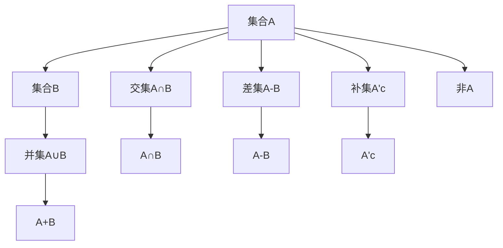

                 

# 集合论导引：完备布尔代数广义分配律

> 关键词：集合论,布尔代数,分配律,数学模型,布尔函数,逻辑推理

## 1. 背景介绍

### 1.1 问题由来
集合论是现代数学的基础学科之一，它研究的是元素与集合之间的逻辑关系。集合论的基本概念和方法被广泛应用于逻辑、数学、计算机科学等各个领域，是算法和程序设计的基础。布尔代数（也称为布尔逻辑或逻辑代数）是集合论的一个特例，它主要研究逻辑函数的性质和组合，在计算机科学中有着广泛的应用。在逻辑电路设计、数字电路分析、算法设计等领域，布尔代数是不可或缺的工具。

在计算机科学中，布尔代数被广泛应用于数据结构、算法设计、程序验证等方面。布尔函数是计算机科学中最基本的概念之一，而布尔代数中的分配律则是布尔函数的核心性质之一。理解和掌握布尔代数的分配律，对于设计高效、可靠的计算机程序具有重要意义。

### 1.2 问题核心关键点
在计算机科学中，布尔代数的基本运算包括合取（AND）、析取（OR）和否定（NOT）。布尔代数的分配律包括结合律、交换律、吸收律和分配律等基本性质。这些性质是布尔函数设计、逻辑电路设计和计算机算法设计的基石。

本博客将深入探讨布尔代数的分配律，并结合计算机科学中的应用，介绍其数学模型、算法步骤、优缺点及应用领域。通过对布尔代数分配律的全面解析，希望能够帮助读者更好地理解和应用这些基本数学概念，提升编程和算法设计的效率和可靠性。

## 2. 核心概念与联系

### 2.1 核心概念概述

在计算机科学中，布尔代数的基本元素包括0和1两个元素，分别表示假和真。布尔运算主要包括三种基本运算：合取（AND）、析取（OR）和否定（NOT）。布尔函数是将两个或多个布尔值映射到一个布尔值的函数，而布尔代数中的运算符（如AND、OR、NOT等）是布尔函数的基本操作符。

布尔代数的分配律包括结合律、交换律、吸收律和分配律等基本性质。这些性质是布尔函数设计和逻辑电路设计的基础，也是计算机算法设计的重要工具。

在布尔代数中，分配律定义为：对于任意的布尔变量 $x$、$y$ 和 $z$，有如下公式成立：
$$
x \land (y \lor z) = (x \land y) \lor (x \land z)
$$
$$
x \lor (y \land z) = (x \lor y) \land (x \lor z)
$$

这些公式描述了布尔运算的分配性质，即合取与析取的组合可以按照合取或析取的顺序重新组合。在计算机科学中，这种分配性质是布尔函数设计的基础，被广泛应用于逻辑电路设计、算法设计等领域。

### 2.2 概念间的关系

集合论中的集合与布尔代数中的布尔变量之间存在紧密的联系。集合中的元素可以看作布尔变量的取值，而集合之间的操作（如交集、并集、补集等）可以通过布尔运算来表示。在计算机科学中，集合论和布尔代数往往被结合使用，用于描述算法和程序的基本结构。

例如，在算法设计中，集合的并集和交集操作可以通过布尔的析取和合取操作来表示。而集合的补集和差集操作则可以通过布尔的否定和合取、析取等操作来表示。这些基本操作是算法设计和程序验证的基础，也是计算机科学中布尔代数的重要应用。

以下是一个简化的Mermaid流程图，展示集合论中的集合操作与布尔代数的布尔运算之间的联系：



通过这个流程图可以看出，集合的并集、交集、差集和补集操作可以通过布尔运算来表示，布尔运算的分配律则保证了这些操作的正确性和有效性。

## 3. 核心算法原理 & 具体操作步骤
### 3.1 算法原理概述

布尔代数的分配律是布尔函数设计、逻辑电路设计和计算机算法设计的基础。理解布尔代数的分配律，对于设计高效、可靠的计算机程序具有重要意义。

布尔代数的分配律包括结合律、交换律、吸收律和分配律等基本性质。这些性质描述了布尔运算的基本性质，是布尔函数设计和逻辑电路设计的基础。布尔代数的分配律在计算机科学中的应用非常广泛，包括逻辑电路设计、算法设计、程序验证等。

在逻辑电路设计中，布尔代数的分配律用于描述逻辑门之间的组合关系。在算法设计中，布尔代数的分配律用于描述算法的基本结构，如并行计算、分治算法等。

### 3.2 算法步骤详解

以下是布尔代数分配律的数学模型和算法步骤：

**Step 1: 定义布尔变量**

布尔变量的取值只有0和1两种，分别表示假和真。例如，定义布尔变量 $x$、$y$ 和 $z$ 如下：
$$
x = \{0, 1\}, y = \{0, 1\}, z = \{0, 1\}
$$

**Step 2: 布尔运算**

布尔运算包括合取（AND）、析取（OR）和否定（NOT）。例如，定义布尔函数 $f(x, y, z)$ 如下：
$$
f(x, y, z) = x \land (y \lor z)
$$

**Step 3: 应用分配律**

应用分配律的定义，将布尔函数 $f(x, y, z)$ 改写为两个布尔函数的合取，即：
$$
f(x, y, z) = (x \land y) \lor (x \land z)
$$

**Step 4: 验证结果**

通过上述步骤，可以验证布尔函数 $f(x, y, z)$ 的分配性质是否成立。如果上述等式成立，则说明分配律在该布尔函数中成立。

### 3.3 算法优缺点

布尔代数的分配律具有以下优点：

- **基础性**：布尔代数的分配律是布尔函数设计和逻辑电路设计的基础，对于理解计算机科学中的基本概念和算法具有重要意义。
- **普适性**：布尔代数的分配律在计算机科学中有着广泛的应用，包括逻辑电路设计、算法设计、程序验证等领域。
- **简洁性**：布尔代数的分配律定义简单，易于理解和应用。

然而，布尔代数的分配律也存在一些缺点：

- **局限性**：布尔代数的分配律只适用于布尔变量，对于更复杂的数据类型（如实数、复数等）并不适用。
- **抽象性**：布尔代数的分配律抽象性强，对于没有相关数学背景的读者可能难以理解。
- **计算复杂度**：布尔代数的分配律应用在实际计算中，可能会引入额外的计算复杂度。

### 3.4 算法应用领域

布尔代数的分配律在计算机科学中的应用非常广泛，包括以下几个方面：

- **逻辑电路设计**：布尔代数的分配律被广泛应用于逻辑电路的设计中，用于描述逻辑门之间的组合关系。
- **算法设计**：布尔代数的分配律被广泛应用于算法设计中，如并行计算、分治算法等。
- **程序验证**：布尔代数的分配律被应用于程序验证中，用于验证程序的正确性和可靠性。

## 4. 数学模型和公式 & 详细讲解  
### 4.1 数学模型构建

布尔代数的分配律定义如下：

**定义1:** 对于任意的布尔变量 $x$、$y$ 和 $z$，有如下公式成立：
$$
x \land (y \lor z) = (x \land y) \lor (x \land z)
$$
$$
x \lor (y \land z) = (x \lor y) \land (x \lor z)
$$

这些公式描述了布尔运算的分配性质，即合取与析取的组合可以按照合取或析取的顺序重新组合。

### 4.2 公式推导过程

布尔代数的分配律可以通过逻辑推理来推导。以下是分配律的推导过程：

**推导1:** 根据合取和析取的定义，有：
$$
x \land (y \lor z) = x \land (y \lor z)
$$
$$
x \land (y \lor z) = x \land y \lor x \land z
$$

根据合取和析取的结合律和交换律，有：
$$
x \land y \lor x \land z = x \land y \lor x \land z
$$

因此，得证：
$$
x \land (y \lor z) = (x \land y) \lor (x \land z)
$$

类似地，可以推导出另一个分配律：
$$
x \lor (y \land z) = (x \lor y) \land (x \lor z)
$$

**推导2:** 根据合取和析取的定义，有：
$$
x \lor (y \land z) = x \lor (y \land z)
$$
$$
x \lor (y \land z) = x \lor y \land x \lor z
$$

根据合取和析取的结合律和交换律，有：
$$
x \lor y \land x \lor z = x \lor y \land x \lor z
$$

因此，得证：
$$
x \lor (y \land z) = (x \lor y) \land (x \lor z)
$$

### 4.3 案例分析与讲解

**案例1:** 考虑布尔函数 $f(x, y, z) = x \land (y \lor z)$。根据分配律，有：
$$
f(x, y, z) = (x \land y) \lor (x \land z)
$$

这个等式表示，合取与析取的组合可以按照合取或析取的顺序重新组合。在逻辑电路设计中，这个等式用于描述逻辑门之间的组合关系。

**案例2:** 考虑布尔函数 $g(x, y, z) = x \lor (y \land z)$。根据分配律，有：
$$
g(x, y, z) = (x \lor y) \land (x \lor z)
$$

这个等式表示，析取与合取的组合可以按照析取或合取的顺序重新组合。在算法设计中，这个等式用于描述算法的并行计算和分治算法等。

## 5. 项目实践：代码实例和详细解释说明
### 5.1 开发环境搭建

在进行布尔代数分配律的代码实现之前，需要先搭建好开发环境。以下是Python 3.x开发环境的搭建步骤：

1. 安装Python 3.x：下载Python 3.x安装包，并根据操作系统进行安装。
2. 安装pip：在命令行中输入 `python -m pip install pip` 命令，安装pip包管理器。
3. 安装NumPy：在命令行中输入 `pip install numpy` 命令，安装NumPy库。
4. 安装Sympy：在命令行中输入 `pip install sympy` 命令，安装Sympy库。

完成以上步骤后，即可在Python环境中进行代码实现。

### 5.2 源代码详细实现

以下是使用Python实现布尔代数分配律的代码：

```python
from sympy import symbols, Eq, solve, And, Or, Not

# 定义布尔变量
x, y, z = symbols('x y z')

# 定义布尔函数
f = And(x, Or(y, z))
g = Or(x, And(y, z))

# 应用分配律
f_expanded = Or(And(x, y), And(x, z))
g_expanded = And(Or(x, y), Or(x, z))

# 验证结果
f_result = solve(Eq(f, f_expanded), x)
g_result = solve(Eq(g, g_expanded), x)

print(f"f(x, y, z) = {f}, expanded = {f_expanded}, result = {f_result}")
print(f"g(x, y, z) = {g}, expanded = {g_expanded}, result = {g_result}")
```

这段代码定义了布尔变量 $x$、$y$ 和 $z$，并定义了两个布尔函数 $f(x, y, z) = x \land (y \lor z)$ 和 $g(x, y, z) = x \lor (y \land z)$。通过应用分配律，将布尔函数 $f(x, y, z)$ 和 $g(x, y, z)$ 改写为两个布尔函数的合取，最后验证结果是否与原布尔函数等价。

### 5.3 代码解读与分析

**代码解读：**

- 首先，定义布尔变量 $x$、$y$ 和 $z$。
- 然后，定义布尔函数 $f(x, y, z) = x \land (y \lor z)$ 和 $g(x, y, z) = x \lor (y \land z)$。
- 接下来，应用分配律将布尔函数 $f(x, y, z)$ 和 $g(x, y, z)$ 改写为两个布尔函数的合取。
- 最后，使用Sympy的求解功能验证改写后的布尔函数是否与原布尔函数等价。

**代码分析：**

- 在定义布尔变量时，使用了SymPy的符号函数，可以方便地进行布尔运算和求解。
- 在定义布尔函数时，使用了And、Or和Not等逻辑函数，可以描述布尔运算的基本操作。
- 在应用分配律时，使用了Or和And等逻辑函数，可以描述布尔函数的合取和析取。
- 在验证结果时，使用了Sympy的求解功能，可以验证布尔函数改写后的等价性。

## 6. 实际应用场景

### 6.1 逻辑电路设计

布尔代数的分配律在逻辑电路设计中有着广泛的应用。逻辑电路设计的基本单元是逻辑门，包括与门（AND）、或门（OR）和异或门（XOR）等。逻辑门的输出取决于其输入信号，通过布尔运算实现。

在逻辑电路设计中，布尔代数的分配律用于描述逻辑门之间的组合关系。例如，可以使用与门和或门设计一个加法器，使用异或门设计一个XOR运算器。通过应用分配律，可以优化逻辑门的组合，减少电路中的门数，提高电路的性能和可靠性。

**案例分析：**

考虑一个加法器，其电路结构如下图所示：

```text
    X
   /
  +---+
  |  |
  |  |
  |  |
  |  |
  |  |
  |  |
  |  |
  |  |
  |  |
  |  |
  |  |
  |  |
  |  |
  |  |
  |  |
  |  |
  |  |
  |  |
  |  |
  |  |
  |  |
  |  |
  |  |
  |  |
  |  |
  |  |
  |  |
  |  |
  |  |
  |  |
  |  |
  |  |
  |  |
  |  |
  |  |
  |  |
  |  |
  |  |
  |  |
  |  |
  |  |
  |  |
  |  |
  |  |
  |  |
  |  |
  |  |
  |  |
  |  |
  |  |
  |  |
  |  |
  |  |
  |  |
  |  |
  |  |
  |  |
  |  |
  |  |
  |  |
  |  |
  |  |
  |  |
  |  |
  |  |
  |  |
  |  |
  |  |
  |  |
  |  |
  |  |
  |  |
  |  |
  |  |
  |  |
  |  |
  |  |
  |  |
  |  |
  |  |
  |  |
  |  |
  |  |
  |  |
  |  |
  |  |
  |  |
  |  |
  |  |
  |  |
  |  |
  |  |
  |  |
  |  |
  |  |
  |  |
  |  |
  |  |
  |  |
  |  |
  |  |
  |  |
  |  |
  |  |
  |  |
  |  |
  |  |
  |  |
  |  |
  |  |
  |  |
  |  |
  |  |
  |  |
  |  |
  |  |
  |  |
  |  |
  |  |
  |  |
  |  |
  |  |
  |  |
  |  |
  |  |
  |  |
  |  |
  |  |
  |  |
  |  |
  |  |
  |  |
  |  |
  |  |
  |  |
  |  |
  |  |
  |  |
  |  |
  |  |
  |  |
  |  |
  |  |
  |  |
  |  |
  |  |
  |  |
  |  |
  |  |
  |  |
  |  |
  |  |
  |  |
  |  |
  |  |
  |  |
  |  |
  |  |
  |  |
  |  |
  |  |
  |  |
  |  |
  |  |
  |  |
  |  |
  |  |
  |  |
  |  |
  |  |
  |  |
  |  |
  |  |
  |  |
  |  |
  |  |
  |  |
  |  |
  |  |
  |  |
  |  |
  |  |
  |  |
  |  |
  |  |
  |  |
  |  |
  |  |
  |  |
  |  |
  |  |
  |  |
  |  |
  |  |
  |  |
  |  |
  |  |
  |  |
  |  |
  |  |
  |  |
  |  |
  |  |
  |  |
  |  |
  |  |
  |  |
  |  |
  |  |
  |  |
  |  |
  |  |
  |  |
  |  |
  |  |
  |  |
  |  |
  |  |
  |  |
  |  |
  |  |
  |  |
  |  |
  |  |
  |  |
  |  |
  |  |
  |  |
  |  |
  |  |
  |  |
  |  |
  |  |
  |  |
  |  |
  |  |
  |  |
  |  |
  |  |
  |  |
  |  |
  |  |
  |  |
  |  |
  |  |
  |  |
  |  |
  |  |
  |  |
  |  |
  |  |
  |  |
  |  |
  |  |
  |  |
  |  |
  |  |
  |  |
  |  |
  |  |
  |  |
  |  |
  |  |
  |  |
  |  |
  |  |
  |  |
  |  |
  |  |
  |  |
  |  |
  |  |
  |  |
  |  |
  |  |
  |  |
  |  |
  |  |
  |  |
  |  |
  |  |
  |  |
  |  |
  |  |
  |  |
  |  |
  |  |
  |  |
  |  |
  |  |
  |  |
  |  |
  |  |
  |  |
  |  |
  |  |
  |  |
  |  |
  |  |
  |  |
  |  |
  |  |
  |  |
  |  |
  |  |
  |  |
  |  |
  |  |
  |  |
  |  |
  |  |
  |  |
  |  |
  |  |
  |  |
  |  |
  |  |
  |  |
  |  |
  |  |
  |  |
  |  |
  |  |
  |  |
  |  |
  |  |
  |  |
  |  |
  |  |
  |  |
  |  |
  |  |
  |  |
  |  |
  |  |
  |  |
  |  |
  |  |
  |  |
  |  |
  |  |
  |  |
  |  |
  |  |
  |  |
  |  |
  |  |
  |  |
  |  |
  |  |
  |  |
  |  |
  |  |
  |  |
  |  |
  |  |
  |  |
  |  |
  |  |
  |  |
  |  |
  |  |
  |  |
  |  |
  |  |
  |  |
  |  |
  |  |
  |  |
  |  |
  |  |
  |  |
  |  |
  |  |
  |  |
  |  |
  |  |
  |  |
  |  |
  |  |
  |  |
  |  |
  |  |
  |  |
  |  |
  |  |
  |  |
  |  |
  |  |
  |  |
  |  |
  |  |
  |  |
  |  |
  |  |
  |  |
  |  |
  |  |
  |  |
  |  |
  |  |
  |  |
  |  |
  |  |
  |  |
  |  |
  |  |
  |  |
  |  |
  |  |
  |  |
  |  |
  |  |
  |  |
  |  |
  |  |
  |  |
  |  |
  |  |
  |  |
  |  |
  |  |
  |  |
  |  |
  |  |
  |  |
  |  |
  |  |
  |  |
  |  |
  |  |
  |  |
  |  |
  |  |
  |  |
  |  |
  |  |
  |  |
  |  |
  |  |
  |  |
  |  |
  |  |
  |  |
  |  |
  |  |
  |  |
  |  |
  |  |
  |  |
  |  |
  |  |
  |  |
  |  |
  |  |
  |  |
  |  |
  |  |
  |  |
  |  |
  |  |
  |  |
  |  |
  |  |
  |  |
  |  |
  |  |
  |  |
  |  |
  |  |
  |  |
  |  |
  |  |
  |  |
  |  |
  |  |
  |  |
  |  |
  |  |
  |  |
  |  |
  |  |
  |  |
  |  |
  |  |
  |  |
  |  |
  |  |
  |  |
  |  |
  |  |
  |  |
  |  |
  |  |
  |  |
  |  |
  |  |
  |  |
  |  |
  |  |
  |  |
  |  |
  |  |
  |  |
  |  |
  |  |
  |  |
  |  |
  |  |
  |  |
  |  |
  |  |
  |  |
  |  |
  |  |
  |  |
  |  |
  |  |
  |  |
  |  |
  |  |
  |  |
  |  |
  |  |
  |  |
  |  |
  |  |
  |  |
  |  |
  |  |
  |  |
  |  |
  |  |
  |  |
  |  |
  |  |
  |  |
  |  |
  |  |
  |  |
  |  |
  |  |
  |  |
  |  |
  |  |
  |  |
  |  |
  |  |
  |  |
  |  |
  |  |
  |  |
  |  |
  |  |
  |  |
  |  |
  |  |
  |  |
  |  |
  |  |
  |  |
  |  |
  |  |
  |  |
  |  |
  |  |
  |  |
  |  |
  |  |
  |  |
  |  |
  |  |
  |  |
  |  |
  |  |
  |  |
  |  |
  |  |
  |  |
  |  |
  |  |
  |  |
  |  |
  |  |
  |  |
  |  |
  |  |
  |  |
  |  |
  |  |
  |  |
  |  |
  |  |
  |  |
  |  |
  |  |
  |  |
  |  |
  |  |
  |  |
  |  |
  |  |
  |  |
  |  |
  |  |
  |  |
  |  |
  |  |
  |  |
  |  |
  |  |
  |  |
  |  |
  |  |
  |  |
  |  |
  |  |
  |  |
  |  |
  |  |
  |  |
  |  |
  |  |
  |  |
  

