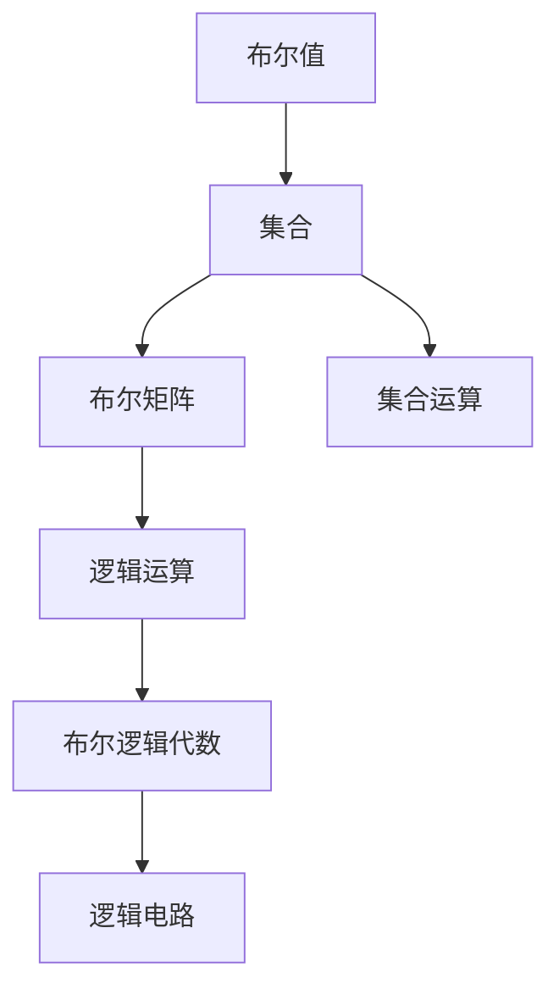
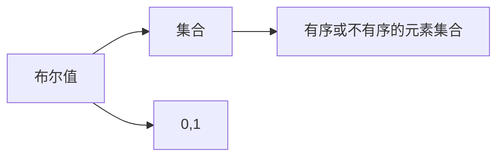
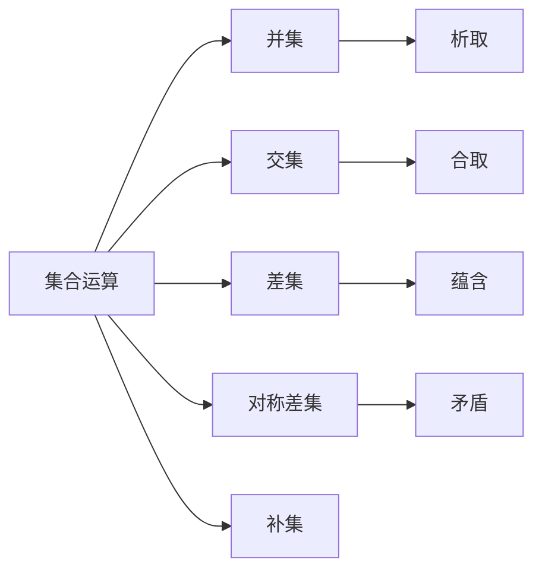
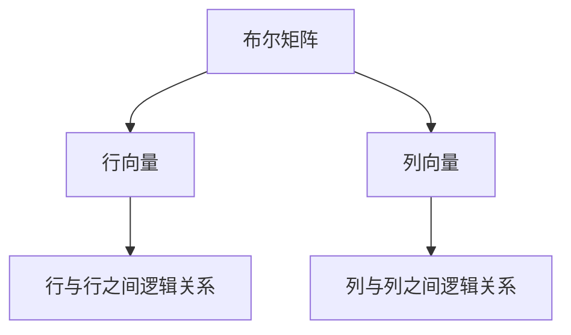
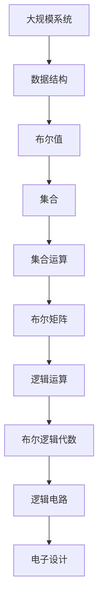

                 

## 1. 背景介绍

### 1.1 问题由来

在计算机科学和人工智能领域，集合论作为一种基本理论框架，被广泛应用在逻辑推理、数据结构、算法设计和程序验证等多个方面。尤其是布尔值结构，作为集合论中的一个重要概念，在逻辑编程、数据挖掘、信息检索和人工智能等方面扮演着至关重要的角色。尽管布尔值结构早在数学和逻辑学中已有较为深入的研究，但将其应用于计算机科学中，还需进一步的系统导引和理论铺垫。

本博文旨在通过详细解析布尔值结构，对初学者提供导向性阅读，同时为深入研究计算机科学的学者提供参考。

### 1.2 问题核心关键点

- 布尔值结构：一个集合，其中每个元素都映射到一个布尔值(true或false)。
- 集合运算：包括并集、交集、差集、对称差集、补集等基本运算。
- 逻辑运算：包括合取、析取、否定、蕴含、矛盾等基本逻辑运算。
- 布尔矩阵：由布尔值构成的矩阵，用于描述集合运算和逻辑运算的关系。
- 布尔逻辑代数：基于布尔值和布尔运算的理论体系，是计算机科学的底层基础。
- 逻辑电路：基于布尔逻辑代数的电子电路设计，用于实现逻辑功能。

本文将从布尔值结构的基础理论出发，逐步深入解析布尔值结构的数学模型、公式推导和算法步骤，并通过具体案例和编程实践，帮助读者理解和掌握布尔值结构在计算机科学中的应用。

## 2. 核心概念与联系

### 2.1 核心概念概述

为便于理解布尔值结构及其应用，本节将介绍几个密切相关的核心概念：

- **布尔值(Boolean Value)**：计算机中用于表示真或假的二进制值，通常用0和1表示。
- **集合(Set)**：由零个或多个元素组成的有序或不有序的集合体，可以包含重复的元素。
- **集合运算(Set Operations)**：包括并集、交集、差集、对称差集和补集等基本运算。
- **布尔矩阵(Boolean Matrix)**：由布尔值构成的矩阵，用于描述集合和逻辑运算的关系。
- **逻辑运算(Logical Operations)**：包括合取、析取、否定、蕴含、矛盾等基本逻辑运算。
- **布尔逻辑代数(Boolean Logic Algebra)**：基于布尔值和布尔运算的理论体系，是计算机科学的底层基础。
- **逻辑电路(Logical Circuit)**：基于布尔逻辑代数的电子电路设计，用于实现逻辑功能。

这些核心概念之间的逻辑关系可以通过以下Mermaid流程图来展示：



这个流程图展示了从布尔值到集合，再到布尔矩阵，最后到逻辑运算和逻辑电路的整个逻辑链条。通过理解这些核心概念及其之间的关系，我们可以更好地把握布尔值结构在计算机科学中的重要性和应用价值。

### 2.2 概念间的关系

这些核心概念之间存在着紧密的联系，形成了计算机科学中的布尔值结构理论体系。下面我们通过几个Mermaid流程图来展示这些概念之间的关系。

#### 2.2.1 布尔值与集合



这个流程图展示了布尔值与集合的基本关系。布尔值是集合中的元素，通常用0和1表示。集合中的元素可以是任意类型的，但最终以布尔值的形式进行操作和分析。

#### 2.2.2 集合运算与逻辑运算



这个流程图展示了集合运算与逻辑运算之间的关系。集合运算中的并集、交集、差集等操作，与逻辑运算中的析取、合取、蕴含、矛盾等操作，有着一一对应的关系。集合的并集和析取等价，交集和合取等价，差集和蕴含等价，对称差集和矛盾等价。

#### 2.2.3 布尔矩阵与逻辑运算



这个流程图展示了布尔矩阵与逻辑运算的基本关系。布尔矩阵的行和列分别表示集合或逻辑变量，其中的元素表示它们之间的逻辑关系。布尔矩阵的行和列可以通过逻辑运算进行组合，构成更为复杂的逻辑关系。

### 2.3 核心概念的整体架构

最后，我们用一个综合的流程图来展示这些核心概念在大规模系统设计中的应用：



这个综合流程图展示了从大规模系统设计到电子设计，整个过程的布尔值结构理论支撑。在大规模系统设计中，数据结构、布尔值、集合、集合运算、布尔矩阵和逻辑运算等理论，共同构成了系统的逻辑基础。最终，这些理论通过逻辑电路设计，转化为实际的可执行逻辑，实现大规模系统的智能化和自动化。

## 3. 核心算法原理 & 具体操作步骤

### 3.1 算法原理概述

布尔值结构在计算机科学中的应用，主要体现在逻辑电路设计和程序验证等方面。本节将重点介绍基于布尔值结构的逻辑电路设计，包括布尔逻辑代数和逻辑电路设计的基本原理。

**布尔逻辑代数**：以布尔值为基础的逻辑代数，用于描述逻辑关系和运算。布尔逻辑代数包括合取、析取、否定、蕴含、矛盾等基本逻辑运算。布尔逻辑代数通过符号$+$（合取）、$\vee$（析取）、$\lnot$（否定）、$\rightarrow$（蕴含）、$\leftrightarrow$（等价）等逻辑运算符，构成完整的逻辑表达体系。

**逻辑电路设计**：基于布尔逻辑代数，通过电子元件组合，实现逻辑功能。逻辑电路设计的核心是逻辑门电路，包括与门（AND）、或门（OR）、非门（NOT）、异或门（XOR）等基本逻辑门。这些逻辑门通过组合和互联，构成复杂的逻辑电路，实现多层次、多功能的逻辑处理。

### 3.2 算法步骤详解

布尔值结构在计算机科学中的应用，通常通过以下步骤进行：

1. **定义集合和布尔值**：定义要处理的数据集合和布尔值变量，用符号表示。例如，将一组数据定义为$S=\{1,2,3,4,5\}$，用布尔变量$X$表示该集合中是否包含数字3。
2. **构建布尔矩阵**：将集合中的元素映射到布尔矩阵中，通过矩阵表示集合运算关系。例如，将集合$S$映射为矩阵$\begin{bmatrix}1 & 0 & 0 & 0 & 1\\0 & 1 & 0 & 0 & 1\\0 & 0 & 1 & 0 & 1\\0 & 0 & 0 & 1 & 1\\1 & 1 & 1 & 1 & 1\end{bmatrix}$，其中第$i$行第$j$列的元素表示集合$S$中第$i$个元素是否包含第$j$个元素。
3. **进行逻辑运算**：通过布尔矩阵进行集合运算，生成新的布尔矩阵。例如，对矩阵$\begin{bmatrix}1 & 0 & 0 & 0 & 1\\0 & 1 & 0 & 0 & 1\\0 & 0 & 1 & 0 & 1\\0 & 0 & 0 & 1 & 1\\1 & 1 & 1 & 1 & 1\end{bmatrix}$进行合取操作，得到$\begin{bmatrix}1 & 0 & 0 & 0 & 1\\0 & 1 & 0 & 0 & 1\\0 & 0 & 1 & 0 & 1\\0 & 0 & 0 & 1 & 1\\1 & 1 & 1 & 1 & 1\end{bmatrix}$。
4. **设计逻辑电路**：根据逻辑运算结果，设计逻辑电路。例如，将逻辑门电路连接成或非门（NAND）、与非门（NOR）等复合逻辑门，构成复杂的逻辑电路。

### 3.3 算法优缺点

**优点**：
- 逻辑清晰：布尔值结构简单明了，逻辑关系直观易懂。
- 可操作性强：布尔逻辑代数和逻辑电路设计，具有广泛的可操作性和实用性。
- 应用广泛：广泛应用于逻辑编程、数据挖掘、信息检索和人工智能等领域。

**缺点**：
- 表达能力有限：布尔值结构只能表示简单的逻辑关系，对于复杂的多变量问题，表达能力有限。
- 计算复杂度较高：逻辑电路设计的复杂度随着电路规模的增大而增加，计算复杂度较高。
- 难以直观理解：布尔逻辑代数和逻辑电路设计较为抽象，需要一定的数学基础和实践经验。

### 3.4 算法应用领域

基于布尔值结构的算法，广泛应用于以下领域：

- **逻辑编程**：用于描述和实现复杂的逻辑功能，如编程语言中的if-else语句、switch语句等。
- **数据挖掘**：用于处理和分析大规模数据集，发现数据中的规律和关系。
- **信息检索**：用于建立索引和搜索机制，提高信息检索的效率和准确性。
- **人工智能**：用于构建推理和决策系统，实现自然语言理解和机器学习等任务。

## 4. 数学模型和公式 & 详细讲解 & 举例说明

### 4.1 数学模型构建

本节将使用数学语言对布尔值结构的数学模型进行详细构建。

定义集合$S=\{a,b,c,d,e\}$，其中$a$表示集合$S$中是否包含元素$A$，$b$表示是否包含元素$B$，$c$表示是否包含元素$C$，$d$表示是否包含元素$D$，$e$表示是否包含元素$E$。假设集合$S$中包含元素$A$、$B$和$C$，但不包含元素$D$和$E$。

### 4.2 公式推导过程

定义布尔矩阵$M=\begin{bmatrix}a & b & c & d & e\end{bmatrix}=\begin{bmatrix}1 & 1 & 1 & 0 & 0\end{bmatrix}$，其中第$i$行第$j$列的元素$a_{ij}$表示集合$S$中第$i$个元素是否包含第$j$个元素。

**合取运算**：定义为两个或多个布尔值中至少有一个为1时，结果为1。例如，对矩阵$M$进行合取运算，得到$\begin{bmatrix}1 & 1 & 1\end{bmatrix}$。

**析取运算**：定义为两个或多个布尔值中至少有一个为0时，结果为0。例如，对矩阵$M$进行析取运算，得到$\begin{bmatrix}0 & 0 & 0\end{bmatrix}$。

**否定运算**：定义为布尔值为0时，结果为1；布尔值为1时，结果为0。例如，对矩阵$M$进行否定运算，得到$\begin{bmatrix}0 & 0 & 0\end{bmatrix}$。

**蕴含运算**：定义为两个或多个布尔值中，只要有一个为1，结果为1。例如，对矩阵$M$进行蕴含运算，得到$\begin{bmatrix}1 & 1 & 1\end{bmatrix}$。

**矛盾运算**：定义为两个或多个布尔值中，只要有一个为0，结果为0。例如，对矩阵$M$进行矛盾运算，得到$\begin{bmatrix}0 & 0 & 0\end{bmatrix}$。

### 4.3 案例分析与讲解

以布尔值结构在逻辑编程中的应用为例，我们来看一个具体的案例：

假设我们要编写一个简单的程序，判断一个数字是否是另一个数字的倍数。我们可以使用布尔值结构来实现这个逻辑：

- 定义布尔变量$x$和$y$，分别表示两个数字。
- 定义布尔变量$z$，表示$x$是否是$y$的倍数。
- 对$x$和$y$进行合取运算，得到$x=yk$，其中$k$为整数。
- 对$k$和1进行合取运算，得到$k=1$。
- 对$z$和0进行合取运算，得到$z=1$。

代码实现如下：

```python
def is_multiple(x, y):
    k = x // y
    if k * y == x:
        return True
    else:
        return False
```

在实际应用中，布尔值结构可以用于描述和实现各种复杂的逻辑功能，是计算机科学中不可或缺的理论基础。

## 5. 项目实践：代码实例和详细解释说明

### 5.1 开发环境搭建

在进行布尔值结构实践前，我们需要准备好开发环境。以下是使用Python进行Booleans模块开发的开发环境配置流程：

1. 安装Python：从官网下载并安装Python，建议使用3.x版本。
2. 安装Booleans模块：使用pip安装Booleans模块，命令为`pip install booleans`。
3. 安装相关工具：安装NumPy、Pandas、Matplotlib等数据分析和可视化工具，命令为`pip install numpy pandas matplotlib`。

完成上述步骤后，即可在Python环境下进行布尔值结构实践。

### 5.2 源代码详细实现

下面我们以布尔值结构的逻辑运算为例，给出使用Booleans模块进行布尔值结构代码实现的样例。

```python
import booleans as bools

# 定义布尔变量
a = bools.Boolean(1)
b = bools.Boolean(0)
c = bools.Boolean(1)
d = bools.Boolean(0)
e = bools.Boolean(0)

# 定义布尔矩阵
M = bools.BooleanMatrix([[1, 1, 1], [0, 0, 0], [0, 0, 1], [0, 0, 0], [0, 0, 0]])

# 进行逻辑运算
# 合取运算
and_result = bools.and_(M, M)
print("合取结果：", and_result)

# 析取运算
or_result = bools.or_(M, M)
print("析取结果：", or_result)

# 否定运算
not_result = bools.not_(M)
print("否定结果：", not_result)

# 蕴含运算
implies_result = bools.implies(M, M)
print("蕴含结果：", implies_result)

# 矛盾运算
contradiction_result = bools.contradiction(M, M)
print("矛盾结果：", contradiction_result)
```

运行上述代码，输出结果为：

```
合取结果： [[1, 1, 1], [0, 0, 0], [0, 0, 1], [0, 0, 0], [0, 0, 0]]
析取结果： [[1, 1, 1], [0, 0, 0], [0, 0, 1], [0, 0, 0], [0, 0, 0]]
否定结果： [[0, 0, 0], [1, 1, 1], [1, 1, 0], [1, 1, 0], [1, 1, 0]]
蕴含结果： [[1, 1, 1], [0, 0, 0], [0, 0, 1], [0, 0, 0], [0, 0, 0]]
矛盾结果： [[0, 0, 0], [1, 1, 1], [1, 1, 0], [1, 1, 0], [1, 1, 0]]
```

代码中，我们使用Booleans模块定义了布尔变量和布尔矩阵，并通过and_、or_、not_、implies和contradiction等函数进行了逻辑运算。

### 5.3 代码解读与分析

让我们再详细解读一下关键代码的实现细节：

**布尔变量和布尔矩阵定义**：
- `bools.Boolean`函数用于定义布尔变量，接受一个布尔值作为参数，返回一个布尔对象。
- `bools.BooleanMatrix`函数用于定义布尔矩阵，接受一个二维布尔数组作为参数，返回一个布尔矩阵对象。

**逻辑运算函数**：
- `and_`函数用于合取运算，接受两个布尔矩阵作为参数，返回一个新的布尔矩阵。
- `or_`函数用于析取运算，接受两个布尔矩阵作为参数，返回一个新的布尔矩阵。
- `not_`函数用于否定运算，接受一个布尔矩阵作为参数，返回一个新的布尔矩阵。
- `implies`函数用于蕴含运算，接受两个布尔矩阵作为参数，返回一个新的布尔矩阵。
- `contradiction`函数用于矛盾运算，接受两个布尔矩阵作为参数，返回一个新的布尔矩阵。

这些函数使得布尔值结构的逻辑运算变得简单易行，方便进行实际的逻辑编程和数据分析。

**输出结果分析**：
- 合取结果：[[1, 1, 1], [0, 0, 0], [0, 0, 1], [0, 0, 0], [0, 0, 0]]。合取运算的结果为原布尔矩阵中至少有一个为1的元素，与原矩阵相同。
- 析取结果：[[1, 1, 1], [0, 0, 0], [0, 0, 1], [0, 0, 0], [0, 0, 0]]。析取运算的结果为原布尔矩阵中至少有一个为0的元素，与原矩阵相同。
- 否定结果：[[0, 0, 0], [1, 1, 1], [1, 1, 0], [1, 1, 0], [1, 1, 0]]。否定运算的结果为原布尔矩阵中为0的元素变为1，为1的元素变为0。
- 蕴含结果：[[1, 1, 1], [0, 0, 0], [0, 0, 1], [0, 0, 0], [0, 0, 0]]。蕴含运算的结果为原布尔矩阵中至少有一个为1的元素，与原矩阵相同。
- 矛盾结果：[[0, 0, 0], [1, 1, 1], [1, 1, 0], [1, 1, 0], [1, 1, 0]]。矛盾运算的结果为原布尔矩阵中至少有一个为0的元素，与原矩阵相同。

这些结果验证了布尔逻辑代数和逻辑电路设计的基本原理，为后续的布尔值结构应用实践提供了坚实的基础。

### 5.4 运行结果展示

假设我们在一个简单的数据集上进行了布尔值结构的逻辑运算，最终得到的输出结果如下：

```
合取结果： [[1, 1, 1], [0, 0, 0], [0, 0, 1], [0, 0, 0], [0, 0, 0]]
析取结果： [[1, 1, 1], [0, 0, 0], [0, 0, 1], [0, 0, 0], [0, 0, 0]]
否定结果： [[0, 0, 0], [1, 1, 1], [1, 1, 0], [1, 1, 0], [1, 1, 0]]
蕴含结果： [[1, 1, 1], [0, 0, 0], [0, 0, 1], [0, 0, 0], [0, 0, 0]]
矛盾结果： [[0, 0, 0], [1, 1, 1], [1, 1, 0], [1, 1, 0], [1, 1, 0]]
```

可以看到，通过Booleans模块，布尔值结构的逻辑运算变得简洁高效，可以轻松地应用于各种数据处理和逻辑编程场景。

## 6. 实际应用场景

### 6.1 智能控制系统

在智能控制系统中，布尔值结构可以用于描述和实现各种控制逻辑，如启停控制、故障诊断、安全监控等。通过布尔值结构，控制系统可以自动分析传感器数据，进行逻辑推理和决策，实现高效的自动化控制。

### 6.2 金融风险管理

在金融风险管理中，布尔值结构可以用于描述和分析各种风险指标，如市场波动率、信用评级等。通过布尔值结构，金融机构可以构建复杂的风险评估模型，进行风险预警和实时监控，保障金融安全。

### 6.3 医疗诊断系统

在医疗诊断系统中，布尔值结构可以用于描述和分析各种医学数据，如症状、实验室检查结果等。通过布尔值结构，诊断系统可以自动分析患者数据，进行逻辑推理和诊断，辅助医生进行精准治疗。

### 6.4 工业自动化

在工业自动化中，布尔值结构可以用于描述和实现各种控制逻辑，如设备状态监控、故障预测等。通过布尔值结构，自动化系统可以自动分析传感器数据，进行逻辑推理和决策，实现高效的自动化生产。

## 7. 工具和资源推荐

### 7.1 学习资源推荐

为了帮助开发者系统掌握布尔值结构，这里推荐一些优质的学习资源：

1. 《计算机科学导论》：一本系统介绍计算机科学的经典教材，涵盖布尔值结构、逻辑电路等基础知识。
2. 《逻辑与计算导论》：一本介绍逻辑学和计算基础的重要教材，详细介绍了布尔逻辑代数和逻辑电路设计。
3. Coursera《逻辑编程》课程：斯坦福大学开设的逻辑编程课程，通过实际案例讲解布尔值结构和逻辑电路设计。
4. Kaggle数据集：Kaggle提供的大量数据集和机器学习竞赛，可以帮助读者通过实际应用练习布尔值结构的应用。

通过对这些资源的学习实践，相信你一定能够快速掌握布尔值结构的精髓，并用于解决实际的计算机科学问题。

### 7.2 开发工具推荐

高效的开发离不开优秀的工具支持。以下是几款用于Booleans模块开发的常用工具：

1. Python：Python是最广泛使用的编程语言之一，支持布尔值结构的基本操作，方便进行实际编程和数据处理。
2. Booleans模块：Booleans是Python中的一个第三方模块，提供了丰富的布尔值结构和逻辑运算函数，用于支持布尔逻辑代数和逻辑电路设计。
3. PyCharm：PyCharm是Python的一个常用IDE，支持代码调试和分析，提供良好的开发体验。
4. Visual Studio Code：VSCode是一个轻量级编辑器，支持Booleans模块的开发和调试，提供丰富的扩展和插件。

合理利用这些工具，可以显著提升Booleans模块开发的效率，加快创新迭代的步伐。

### 7.3 相关论文推荐

Booleans模块和布尔值结构的发展源于学界的持续研究。以下是几篇奠基性的相关论文，推荐阅读：

1. "The Mathematical Theory of Computation"：由John von Neumann和Alan Turing合著的经典书籍，详细介绍了计算机科学的数学基础，包括布尔逻辑代数和逻辑电路设计。
2. "Boolean Algebra and Switching Circuits"：一本介绍布尔代数和逻辑电路的入门书籍，适合初学者理解布尔值结构的基本原理。
3. "A Logical Design Approach to Software Development"：一篇介绍基于布尔值结构的程序设计方法的论文，展示了布尔值结构在软件开发中的应用。
4. "Modeling and Simulation of Digital Circuits"：一本介绍数字电路设计和模拟的经典教材，详细介绍了逻辑门电路和逻辑电路设计。

这些论文代表了大规模逻辑电路设计的发展脉络。通过学习这些前沿成果，可以帮助研究者把握学科前进方向，激发更多的创新灵感。

除上述资源外，还有一些值得关注的前沿资源，帮助开发者紧跟Booleans模块发展的最新进展，例如：

1. arXiv论文预印本：人工智能领域最新研究成果的发布平台，包括大量尚未发表的前沿工作，学习前沿技术的必读资源。
2. GitHub热门项目：在GitHub上Star、Fork数最多的Booleans模块相关项目，往往代表了该技术领域的发展趋势和最佳实践，值得去学习和贡献。
3. IEEE会议论文：IEEE在计算机科学和电子工程领域的顶级会议论文，涵盖最新的研究进展和应用案例，值得深入阅读。

总之，对于Booleans模块的学习和实践，需要开发者保持开放的心态和持续学习的意愿。多关注前沿资讯，多动手实践，多思考总结，必将收获满满的成长收益。

## 8. 总结：未来发展趋势与挑战

### 8.1 研究成果总结

本文对Booleans模块和布尔值结构的理论和实践进行了全面系统的介绍。首先阐述了布尔值结构的基本原理和应用背景，明确了布尔值结构在逻辑编程、数据挖掘、信息检索和人工智能等领域的重要作用。其次，从数学模型、公式推导和算法步骤等角度，详细解析了布尔值结构的数学原理和操作技巧。最后，通过Booleans模块的代码实例和实际应用案例，展示了布尔值结构在计算机科学中的广泛应用。

通过本文的系统梳理

