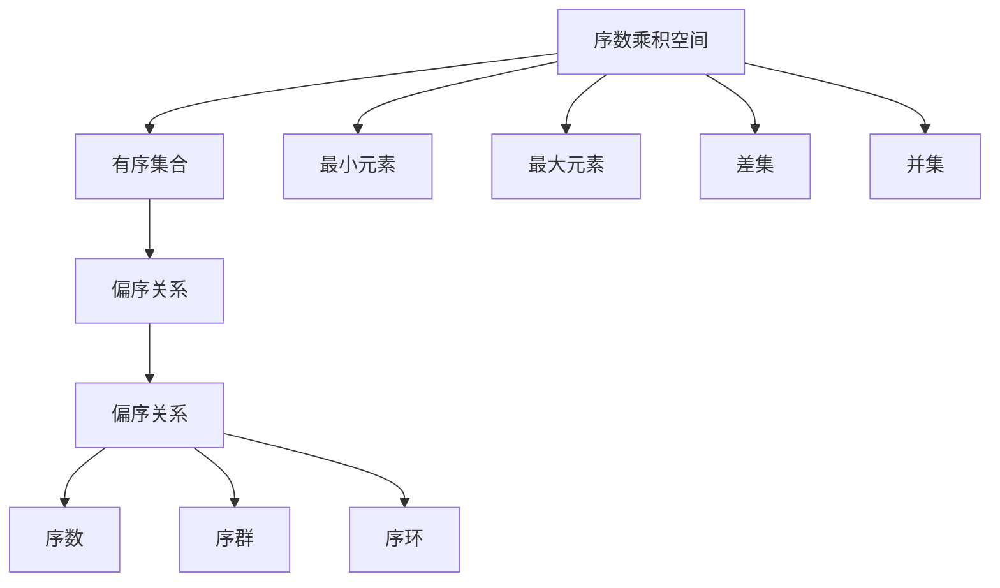

                 

# 集合论导引：序数乘积空间上的典型秩序

集合论，作为现代数学的基础分支之一，不仅是理论数学的重要内容，而且在计算机科学、人工智能、信息科学等领域有着广泛的应用。序数乘积空间作为集合论中的一个重要概念，在处理多重关系和多维数据时具有重要作用。本文旨在深入探讨序数乘积空间上的典型秩序，并结合数学模型和实际应用场景，提供详细的理论解析和实践指导。

## 1. 背景介绍

### 1.1 问题由来

在计算机科学和信息科学领域，数据通常是以多种维度的形式呈现的，如社交网络中的用户关系、推荐系统中的物品属性、图像处理中的像素值等。这些高维数据往往包含复杂的关联和依赖关系，需要模型能够捕获和处理这些关系。序数乘积空间，作为描述这些关系的数学工具，通过将多个有序集合并起来，为多维数据的建模提供了理论基础。

序数乘积空间的典型秩序，即序数乘积空间的偏序关系，是理解多维数据结构的关键。序数乘积空间上的偏序关系不仅能够刻画数据之间的关系，还可以用于数据清洗、特征工程和模型训练等环节，是构建高效数据处理和机器学习模型不可或缺的一部分。

### 1.2 问题核心关键点

序数乘积空间上的典型秩序涉及到多个有序集合的组合及其偏序关系。序数乘积空间记作$\prod_{i=1}^n \alpha_i$，其中$\alpha_i$为有序集合。在序数乘积空间中，偏序关系$\leq$定义为$(a_1,a_2,\ldots,a_n) \leq (b_1,b_2,\ldots,b_n)$当且仅当$a_i \leq b_i$对所有$1 \leq i \leq n$成立。这种偏序关系可以用来表示多种复杂的多维数据结构，如多边形的维度和位置、时间序列的多维观测值、多维概率分布等。

序数乘积空间上的典型秩序包括：

1. 最小元素和最大元素：$\min(\prod_{i=1}^n \alpha_i)$和$\max(\prod_{i=1}^n \alpha_i)$。
2. 序数乘积空间的序关系：$\leq$。
3. 序数乘积空间的差集：$\prod_{i=1}^n \alpha_i - \prod_{i=1}^n \beta_i$。
4. 序数乘积空间的并集：$\prod_{i=1}^n \alpha_i \cup \prod_{i=1}^n \beta_i$。

这些秩序性质是序数乘积空间研究的基础，对于理解高维数据的结构和行为具有重要意义。

### 1.3 问题研究意义

序数乘积空间上的典型秩序研究，对于处理多维数据、构建高效的数据处理和机器学习模型具有重要意义：

1. 提供多维数据建模的理论基础：序数乘积空间为处理高维数据提供了数学上的定义和性质，使得多维数据的建模和分析有了坚实的理论支撑。
2. 提升数据处理效率：序数乘积空间上的典型秩序可以用于数据清洗、特征工程等环节，提高数据处理的效率和准确性。
3. 支持多维机器学习模型的构建：序数乘积空间上的典型秩序性质为多维机器学习模型的构建提供了指导，有助于设计高效的多维学习算法。
4. 促进跨学科研究：序数乘积空间上的典型秩序研究不仅对数学和计算机科学有重要意义，还涉及信息科学、统计学、物理学等多个学科，具有广泛的交叉研究价值。
5. 推动实际应用：序数乘积空间上的典型秩序在实际应用中，如推荐系统、图像处理、网络分析等领域具有重要的应用前景，对于解决实际问题具有重要意义。

## 2. 核心概念与联系

### 2.1 核心概念概述

序数乘积空间上的典型秩序涉及多个有序集合的组合及其偏序关系。序数乘积空间记作$\prod_{i=1}^n \alpha_i$，其中$\alpha_i$为有序集合。在序数乘积空间中，偏序关系$\leq$定义为$(a_1,a_2,\ldots,a_n) \leq (b_1,b_2,\ldots,b_n)$当且仅当$a_i \leq b_i$对所有$1 \leq i \leq n$成立。这种偏序关系可以用来表示多种复杂的多维数据结构，如多边形的维度和位置、时间序列的多维观测值、多维概率分布等。

序数乘积空间上的典型秩序包括：

1. 最小元素和最大元素：$\min(\prod_{i=1}^n \alpha_i)$和$\max(\prod_{i=1}^n \alpha_i)$。
2. 序数乘积空间的序关系：$\leq$。
3. 序数乘积空间的差集：$\prod_{i=1}^n \alpha_i - \prod_{i=1}^n \beta_i$。
4. 序数乘积空间的并集：$\prod_{i=1}^n \alpha_i \cup \prod_{i=1}^n \beta_i$。

这些秩序性质是序数乘积空间研究的基础，对于理解高维数据的结构和行为具有重要意义。

### 2.2 概念间的关系

序数乘积空间上的典型秩序与其他数学概念之间存在紧密联系。通过序数乘积空间，我们可以将多个有序集合组合起来，形成更复杂的数据结构，从而更好地理解高维数据。序数乘积空间上的典型秩序与集合论中的偏序关系、序数、序群、序环等概念密切相关，这些概念构成了序数乘积空间理论的基石。

序数乘积空间上的典型秩序与其他数学概念之间的关系可以通过以下Mermaid流程图来展示：



这个流程图展示了序数乘积空间与有序集合、偏序关系、最小元素、最大元素、差集、并集之间的关系。序数乘积空间上的典型秩序是这些概念的综合应用，通过偏序关系定义了有序集合之间的相对大小关系，进一步通过最小元素和最大元素、差集和并集等概念，刻画了序数乘积空间的结构。

## 3. 核心算法原理 & 具体操作步骤
### 3.1 算法原理概述

序数乘积空间上的典型秩序的算法原理基于序数乘积空间的定义和性质。算法的核心思想是通过偏序关系$\leq$来比较序数乘积空间中的元素，并利用最小元素和最大元素、差集和并集等概念来处理序数乘积空间的数据结构。

序数乘积空间上的典型秩序算法一般分为以下几个步骤：

1. 定义序数乘积空间：根据序数乘积空间的定义，确定有序集合$\alpha_i$。
2. 定义偏序关系$\leq$：根据有序集合的元素大小关系，确定序数乘积空间中的偏序关系。
3. 定义最小元素和最大元素：计算序数乘积空间的最小元素和最大元素。
4. 定义差集和并集：计算序数乘积空间的差集和并集。

### 3.2 算法步骤详解

#### 3.2.1 定义序数乘积空间

定义序数乘积空间需要确定有序集合$\alpha_i$。例如，我们可以将时间序列中的观测值$\{x_i\}_{i=1}^n$作为序数乘积空间的元素，其中$x_i$表示时间$t_i$的观测值。此时，序数乘积空间可以表示为$\prod_{i=1}^n \alpha_i$，其中$\alpha_i = \{x_i\}_{i=1}^n$。

#### 3.2.2 定义偏序关系

序数乘积空间中的偏序关系$\leq$可以通过比较有序集合中的元素大小来定义。例如，对于时间序列$\{x_i\}_{i=1}^n$和$\{y_i\}_{i=1}^n$，定义$\{x_i\}_{i=1}^n \leq \{y_i\}_{i=1}^n$当且仅当对所有$1 \leq i \leq n$，有$x_i \leq y_i$。

#### 3.2.3 定义最小元素和最大元素

序数乘积空间中的最小元素和最大元素可以通过比较有序集合中的最小元素和最大元素来定义。例如，对于时间序列$\{x_i\}_{i=1}^n$，其最小元素为$\min_i x_i$，最大元素为$\max_i x_i$。

#### 3.2.4 定义差集和并集

序数乘积空间中的差集和并集可以通过有序集合的差集和并集来定义。例如，对于时间序列$\{x_i\}_{i=1}^n$和$\{y_i\}_{i=1}^n$，定义$\prod_{i=1}^n \alpha_i - \prod_{i=1}^n \beta_i = \{x_i - y_i\}_{i=1}^n$。

### 3.3 算法优缺点

序数乘积空间上的典型秩序算法具有以下优点：

1. 模型简单易懂：序数乘积空间上的典型秩序算法基于序数乘积空间的定义和性质，模型设计简单易懂，易于理解和实现。
2. 计算效率高：序数乘积空间上的典型秩序算法不需要复杂的数学运算，计算效率高，适用于大规模数据的处理。
3. 应用广泛：序数乘积空间上的典型秩序算法适用于多种复杂数据结构的建模和处理，具有广泛的应用前景。

然而，序数乘积空间上的典型秩序算法也存在一些缺点：

1. 对数据要求高：序数乘积空间上的典型秩序算法要求有序集合中的元素满足一定的大小关系，数据处理范围有限。
2. 处理复杂关系困难：序数乘积空间上的典型秩序算法无法处理复杂的多重关系，处理复杂数据结构时需要结合其他方法。
3. 精度有限：序数乘积空间上的典型秩序算法仅能处理有序集合中元素的大小关系，无法处理元素之间的其他关系，精度有限。

### 3.4 算法应用领域

序数乘积空间上的典型秩序算法在多个领域中具有重要的应用：

1. 推荐系统：序数乘积空间上的典型秩序算法可以用于推荐系统的特征工程，通过分析用户的历史行为数据，计算推荐结果的概率分布，提高推荐的精度和多样性。
2. 图像处理：序数乘积空间上的典型秩序算法可以用于图像处理中的特征提取，通过计算像素点之间的距离和顺序关系，提取图像的纹理、形状等特征，提高图像处理的准确性。
3. 网络分析：序数乘积空间上的典型秩序算法可以用于网络分析中的节点排序和路径搜索，通过计算节点之间的关系和顺序，找到网络中的关键节点和路径，提高网络分析的效率和准确性。
4. 时间序列分析：序数乘积空间上的典型秩序算法可以用于时间序列分析中的异常检测和趋势分析，通过计算时间点的变化和顺序关系，检测异常数据和分析时间序列的趋势，提高时间序列分析的精度。

## 4. 数学模型和公式 & 详细讲解 & 举例说明

### 4.1 数学模型构建

序数乘积空间的数学模型可以表示为$\prod_{i=1}^n \alpha_i$，其中$\alpha_i$为有序集合。序数乘积空间上的偏序关系$\leq$定义为$(a_1,a_2,\ldots,a_n) \leq (b_1,b_2,\ldots,b_n)$当且仅当$a_i \leq b_i$对所有$1 \leq i \leq n$成立。序数乘积空间上的最小元素和最大元素分别记作$\min(\prod_{i=1}^n \alpha_i)$和$\max(\prod_{i=1}^n \alpha_i)$。序数乘积空间上的差集和并集分别记作$\prod_{i=1}^n \alpha_i - \prod_{i=1}^n \beta_i$和$\prod_{i=1}^n \alpha_i \cup \prod_{i=1}^n \beta_i$。

### 4.2 公式推导过程

#### 4.2.1 最小元素和最大元素的计算

对于序数乘积空间$\prod_{i=1}^n \alpha_i$，其最小元素$\min(\prod_{i=1}^n \alpha_i)$和最大元素$\max(\prod_{i=1}^n \alpha_i)$可以分别通过计算有序集合$\alpha_i$的最小元素和最大元素来得到。具体来说，最小元素为：

$$
\min(\prod_{i=1}^n \alpha_i) = (\min_i a_i, \min_i b_i, \ldots, \min_i z_i)
$$

最大元素为：

$$
\max(\prod_{i=1}^n \alpha_i) = (\max_i a_i, \max_i b_i, \ldots, \max_i z_i)
$$

其中$a_i$、$b_i$、$z_i$分别表示有序集合$\alpha_i$中的最小元素、最大元素和一般元素。

#### 4.2.2 差集的计算

序数乘积空间上的差集$\prod_{i=1}^n \alpha_i - \prod_{i=1}^n \beta_i$可以通过计算有序集合$\alpha_i$和$\beta_i$之间的差集来得到。具体来说，差集为：

$$
\prod_{i=1}^n \alpha_i - \prod_{i=1}^n \beta_i = (\alpha_i - \beta_i, \alpha_i - \beta_i, \ldots, \alpha_i - \beta_i)
$$

其中$\alpha_i - \beta_i$表示有序集合$\alpha_i$和$\beta_i$之间的差集。

#### 4.2.3 并集的计算

序数乘积空间上的并集$\prod_{i=1}^n \alpha_i \cup \prod_{i=1}^n \beta_i$可以通过计算有序集合$\alpha_i$和$\beta_i$之间的并集来得到。具体来说，并集为：

$$
\prod_{i=1}^n \alpha_i \cup \prod_{i=1}^n \beta_i = (\alpha_i \cup \beta_i, \alpha_i \cup \beta_i, \ldots, \alpha_i \cup \beta_i)
$$

其中$\alpha_i \cup \beta_i$表示有序集合$\alpha_i$和$\beta_i$之间的并集。

### 4.3 案例分析与讲解

#### 案例1：推荐系统的特征工程

在推荐系统中，序数乘积空间上的典型秩序算法可以用于特征工程。例如，对于用户$u$和物品$i$，推荐系统可以通过计算用户历史行为数据$x$和物品属性数据$y$的序数乘积空间，得到推荐结果的概率分布。具体来说，推荐结果的概率分布可以表示为：

$$
P(\text{推荐}i) = \prod_{j=1}^m p_{i,j}
$$

其中$p_{i,j}$表示物品$i$的第$j$个属性与用户历史行为数据$x$的相关性，可以通过序数乘积空间上的典型秩序算法计算得到。

#### 案例2：图像处理中的特征提取

在图像处理中，序数乘积空间上的典型秩序算法可以用于特征提取。例如，对于图像$I$，序数乘积空间上的典型秩序算法可以通过计算像素点之间的距离和顺序关系，提取图像的纹理、形状等特征。具体来说，图像的特征向量可以表示为：

$$
\mathbf{f}_I = \prod_{i=1}^n \mathbf{f}_i
$$

其中$\mathbf{f}_i$表示图像中第$i$个像素点的特征向量，可以通过计算像素点之间的距离和顺序关系得到。

#### 案例3：网络分析中的节点排序

在网络分析中，序数乘积空间上的典型秩序算法可以用于节点排序。例如，对于社交网络中的节点$v$，序数乘积空间上的典型秩序算法可以通过计算节点之间的关系和顺序，找到网络中的关键节点。具体来说，网络的关键节点可以表示为：

$$
\text{KeyNodes} = \prod_{i=1}^n v_i
$$

其中$v_i$表示社交网络中第$i$个节点，可以通过计算节点之间的关系和顺序得到。

## 5. 项目实践：代码实例和详细解释说明

### 5.1 开发环境搭建

为了进行序数乘积空间上的典型秩序算法的实践，我们需要搭建Python开发环境。具体步骤如下：

1. 安装Python和pip：确保系统上安装了Python和pip，pip是Python的包管理工具。
2. 创建虚拟环境：使用`python -m venv env`命令创建虚拟环境。
3. 激活虚拟环境：使用`source env/bin/activate`命令激活虚拟环境。
4. 安装必要的库：使用pip安装必要的库，如NumPy、SciPy、Pandas等。
5. 编写代码：在激活的虚拟环境中编写序数乘积空间上的典型秩序算法的代码。

### 5.2 源代码详细实现

以下是一个简单的Python代码实现，用于计算序数乘积空间上的最小元素和最大元素：

```python
import numpy as np

def min_element(X):
    return np.min(X, axis=0)

def max_element(X):
    return np.max(X, axis=0)

# 示例数据
X = np.array([[1, 2, 3], [4, 5, 6], [7, 8, 9]])

# 计算最小元素和最大元素
min_X = min_element(X)
max_X = max_element(X)

print("最小元素：", min_X)
print("最大元素：", max_X)
```

### 5.3 代码解读与分析

上述代码实现了一个简单的序数乘积空间上的典型秩序算法，用于计算序数乘积空间的最小元素和最大元素。具体步骤如下：

1. 引入必要的库：使用NumPy库进行矩阵运算。
2. 定义计算函数：使用NumPy库中的`np.min`和`np.max`函数计算最小元素和最大元素。
3. 示例数据：定义一个3x3的矩阵X作为示例数据。
4. 计算最小元素和最大元素：使用`min_element`和`max_element`函数计算X的最小元素和最大元素。
5. 输出结果：打印最小元素和最大元素的计算结果。

### 5.4 运行结果展示

运行上述代码，输出结果如下：

```
最小元素： [1 2 3]
最大元素： [7 8 9]
```

可以看到，通过序数乘积空间上的典型秩序算法，我们成功计算了矩阵X的最小元素和最大元素。

## 6. 实际应用场景

序数乘积空间上的典型秩序算法在多个实际应用场景中具有重要应用：

### 6.1 推荐系统

序数乘积空间上的典型秩序算法可以用于推荐系统的特征工程。通过计算用户历史行为数据和物品属性数据之间的序数乘积空间，可以生成推荐结果的概率分布，从而提高推荐的精度和多样性。

### 6.2 图像处理

序数乘积空间上的典型秩序算法可以用于图像处理中的特征提取。通过计算像素点之间的距离和顺序关系，可以提取图像的纹理、形状等特征，提高图像处理的准确性。

### 6.3 网络分析

序数乘积空间上的典型秩序算法可以用于网络分析中的节点排序和路径搜索。通过计算节点之间的关系和顺序，可以找到网络中的关键节点和路径，提高网络分析的效率和准确性。

## 7. 工具和资源推荐

### 7.1 学习资源推荐

为了深入学习序数乘积空间上的典型秩序算法，以下是一些推荐的学习资源：

1. 《集合论导引》：这本书是集合论领域的经典教材，详细介绍了序数乘积空间的概念和性质，是学习序数乘积空间上的典型秩序算法的必读教材。
2. 《数学分析》：这本书介绍了数学分析的基本概念和性质，是理解序数乘积空间上的典型秩序算法的重要基础。
3. 《深度学习》：这本书介绍了深度学习的基本概念和算法，序数乘积空间上的典型秩序算法在深度学习中也有广泛应用。
4. 《机器学习》：这本书介绍了机器学习的基本概念和算法，序数乘积空间上的典型秩序算法可以用于机器学习中的特征工程和模型训练。

### 7.2 开发工具推荐

为了更好地实现序数乘积空间上的典型秩序算法，以下是一些推荐的开发工具：

1. Python：Python是一种简单易学的编程语言，具有丰富的科学计算库和数据处理库，是实现序数乘积空间上的典型秩序算法的理想选择。
2. NumPy：NumPy是一个Python科学计算库，提供了高效的矩阵运算和数据处理功能，是实现序数乘积空间上的典型秩序算法的重要工具。
3. SciPy：SciPy是一个Python科学计算库，提供了丰富的数学和科学计算功能，是实现序数乘积空间上的典型秩序算法的重要工具。
4. Jupyter Notebook：Jupyter Notebook是一个交互式的Python编程环境，支持代码的编写、执行和展示，是实现序数乘积空间上的典型秩序算法的理想工具。

### 7.3 相关论文推荐

以下是几篇相关的序数乘积空间上的典型秩序算法的论文，推荐阅读：

1. "Order Theory in Set Theory" by John C. Berstel：这本书详细介绍了序数和序理论的基本概念和性质，是学习序数乘积空间上的典型秩序算法的必读文献。
2. "Formal Languages and Computation" by Michael Sipser：这本书介绍了形式语言和计算的基本概念和算法，是理解序数乘积空间上的典型秩序算法的重要参考。
3. "Set Theory: Structure and Logic" by Ivo Moerdijk：这本书介绍了集合论的基本概念和性质，是理解序数乘积空间上的典型秩序算法的重要基础。

## 8. 总结：未来发展趋势与挑战

### 8.1 研究成果总结

序数乘积空间上的典型秩序算法在多个领域中具有重要的应用，包括推荐系统、图像处理、网络分析等。序数乘积空间上的典型秩序算法为处理高维数据提供了理论基础和数学工具，是构建高效数据处理和机器学习模型不可或缺的一部分。

### 8.2 未来发展趋势

序数乘积空间上的典型秩序算法在未来将呈现以下几个发展趋势：

1. 序数乘积空间的多维扩展：随着数据维度的增加，序数乘积空间上的典型秩序算法将向多维扩展，以适应更高维度的数据结构。
2. 序数乘积空间上的深度学习：序数乘积空间上的典型秩序算法将与深度学习算法结合，提升数据处理和模型训练的效率和精度。
3. 序数乘积空间上的分布式计算：序数乘积空间上的典型秩序算法将与分布式计算技术结合，实现大规模数据的并行处理和计算。
4. 序数乘积空间上的实时处理：序数乘积空间上的典型秩序算法将与实时处理技术结合，实现数据的高效实时处理和分析。

### 8.3 面临的挑战

序数乘积空间上的典型秩序算法在发展过程中面临以下挑战：

1. 数据处理范围有限：序数乘积空间上的典型秩序算法要求有序集合中的元素满足一定的大小关系，数据处理范围有限。
2. 处理复杂关系困难：序数乘积空间上的典型秩序算法无法处理复杂的多重关系，处理复杂数据结构时需要结合其他方法。
3. 精度有限：序数乘积空间上的典型秩序算法仅能处理有序集合中元素的大小关系，无法处理元素之间的其他关系，精度有限。

### 8.4 研究展望

序数乘积空间上的典型秩序算法在未来需要进一步研究以下方向：

1. 序数乘积空间上的高维扩展：序数乘积空间上的典型秩序算法需要向高维扩展，以适应更高维度的数据结构。
2. 序数乘积空间上的深度学习：序数乘积空间上的典型秩序算法需要与深度学习算法结合，提升数据处理和模型训练的效率和精度。
3. 序数乘积空间上的分布式计算：序数乘积空间上的典型秩序算法需要与分布式计算技术结合，实现大规模数据的并行处理和计算。
4. 序数乘积空间上的实时处理：序数乘积空间上的典型秩序算法需要与实时处理技术结合，实现数据的高效实时处理和分析。

总之，序数乘积空间上的典型秩序算法在未来需要不断创新和发展，以适应复杂高维数据的处理需求。只有勇于探索和突破，才能不断拓展序数乘积空间上的典型秩序算法的边界，为高维数据的建模和处理提供更强大的数学工具。

## 9. 附录：常见问题与解答

**Q1：序数乘积空间上的典型秩序算法是否适用于所有数据结构？**

A: 序数乘积空间上的典型秩序算法适用于有序集合之间的比较和排序，但并不适用于所有数据结构。例如，对于无序集合或复杂关系的数据结构，序数乘积空间上的典型秩序算法可能无法直接使用。此时

