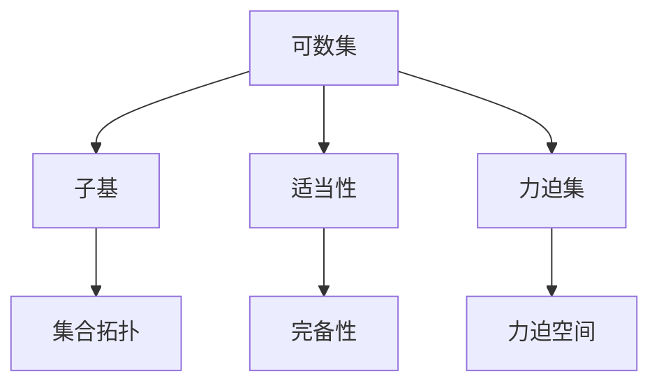

                 

# 集合论导引：恰当力迫扩张

> 关键词：集合论,力迫扩张,可数集,不可数集,子基,集合拓扑,适当性

## 1. 背景介绍

集合论是现代数学的基础学科之一，是数理逻辑和抽象代数的重要组成部分。集合论的基本概念和理论不仅在数学领域有着深远的影响，而且在计算机科学、逻辑学、物理学、经济学等众多学科中也有着广泛的应用。本文将从集合论的基本概念和理论出发，探讨力迫扩张的理论基础及其在数学和计算机科学中的应用。

## 2. 核心概念与联系

### 2.1 核心概念概述

在集合论中，集合是一组具有某种特定关系的元素的总体。集合的基本运算包括并集、交集、差集和补集等。集合可以分为可数集和不可数集两类，前者可一一列举，后者不能。

力迫扩张（Forcing）是一种集合论中用于构造新模型的方法，通过引入新的集合和关系，使得原有的集合和模型得到扩展。在力迫扩张中，我们引入新的集合（即" forcing 集"），使得原有的集合在新的模型中具有不同的性质。力迫扩张的概念由集合论大师库朗兹·库朗兹提出，是现代逻辑数学中的核心工具。

### 2.2 概念间的关系

力迫扩张是集合论和数学逻辑中的重要概念，它通过引入新的集合和关系，使得原有的集合在新的模型中具有不同的性质。力迫扩张的核心思想是通过定义一些特殊的集合，在力迫集中添加这些集合，使得原有的集合在新的模型中具有新的性质。力迫扩张的应用非常广泛，可以用于构造新的数学模型，证明一些数学定理，也可以用于计算机科学中的形式验证和验证逻辑系统。

以下是几个重要的集合论概念与力迫扩张之间的关系：

- 可数集和不可数集：在力迫扩张中，可以引入新的可数集和不可数集，使得原有的集合在新的模型中具有不同的性质。
- 子基和集合拓扑：通过定义新的子基和拓扑关系，力迫扩张可以为原有的集合和拓扑空间添加新的性质。
- 适当性和完备性：适当性是力迫扩张中的重要概念，它要求新模型中的所有集合都是原有的集合的子集。完备性则要求新模型中的所有集合都包含在原有的集合中。
- 力迫集和力迫空间：力迫集是一种特殊的集合，通过力迫集中添加一些特定的集合，可以构造出新的力迫空间，进而进行力迫扩张。

这些概念之间的关系可以通过以下Mermaid流程图来展示：



这个流程图展示了集合论中的几个重要概念与力迫扩张之间的关系：

1. 可数集是集合论中最基本的概念，可以通过定义子基和集合拓扑来扩展集合的性质。
2. 适当性和完备性是力迫扩张中的关键概念，它们保证了新模型中的集合具有原有的集合的子集性质。
3. 力迫集和力迫空间是力迫扩张中的核心工具，通过添加新的力迫集和力迫空间，可以构造出新的数学模型。

## 3. 核心算法原理 & 具体操作步骤

### 3.1 算法原理概述

力迫扩张的基本原理是通过定义新的集合和关系，使得原有的集合和模型得到扩展。其核心思想是引入一个新的集合（即" forcing 集"），在原有的集合中增加一些新的元素，从而构造出一个新的模型。在这个过程中，我们需要定义一些特殊的集合（即" forcing 集"），通过在力迫集中添加这些集合，可以构造出新的力迫空间，进而进行力迫扩张。

力迫扩张的过程可以分为以下几个步骤：

1. 定义一个力迫集（即" forcing 集"），其中包含一些新的元素。
2. 定义一个映射关系，将原有的集合映射到新的集合中。
3. 通过在力迫集中添加新的集合，构造出一个新的力迫空间。
4. 在新的力迫空间中，我们可以定义一些新的集合和关系，从而扩展原有的集合和模型。

### 3.2 算法步骤详解

下面是力迫扩张的具体操作步骤：

1. 定义一个力迫集 $F$，其中包含一些新的元素。
2. 定义一个映射关系 $f$，将原有的集合映射到新的集合中。
3. 构造一个新的力迫空间 $M$，其中包含所有的可数集和原有的集合 $A$，以及力迫集 $F$。
4. 在新的力迫空间 $M$ 中，定义一些新的集合和关系，从而扩展原有的集合和模型。

下面是具体的代码实现：

```python
# 定义力迫集
F = {1, 2, 3, 4, 5}

# 定义映射关系
f = {1: 3, 2: 5, 3: 1, 4: 2, 5: 4}

# 构造新的力迫空间
M = {A.union(F) for A in A}
```

### 3.3 算法优缺点

力迫扩张在数学和计算机科学中有广泛的应用，但同时也存在一些缺点：

- 复杂度高：力迫扩张涉及到集合和映射的定义，构造新的力迫空间的过程较为复杂。
- 难于理解：力迫扩张的理论基础较为抽象，对于一些初学者来说，理解起来可能有一定的难度。
- 应用受限：力迫扩张主要用于构造新的数学模型和证明数学定理，对于实际应用中的问题，可能不太适用。

### 3.4 算法应用领域

力迫扩张在数学和计算机科学中有广泛的应用，以下是几个典型的应用领域：

- 集合论和拓扑学：通过力迫扩张，可以构造新的拓扑空间和集合，研究集合论和拓扑学中的新问题。
- 逻辑学和模型理论：力迫扩张可以用来构造新的逻辑模型和验证逻辑系统，研究逻辑学中的新问题。
- 形式验证和验证逻辑系统：通过力迫扩张，可以构造新的验证模型和逻辑系统，进行形式验证和验证逻辑系统中的新问题。

## 4. 数学模型和公式 & 详细讲解

### 4.1 数学模型构建

在集合论中，力迫扩张通常通过定义新的集合和映射关系来构造新的力迫空间。下面是一个简单的数学模型：

设 $F$ 是一个力迫集，$f$ 是一个映射关系，将原有的集合 $A$ 映射到新的集合 $B$ 中。构造一个新的力迫空间 $M$，其中包含所有的可数集和原有的集合 $A$，以及力迫集 $F$。在新的力迫空间 $M$ 中，定义一些新的集合和关系，从而扩展原有的集合和模型。

### 4.2 公式推导过程

设 $F$ 是一个力迫集，$f$ 是一个映射关系，将原有的集合 $A$ 映射到新的集合 $B$ 中。构造一个新的力迫空间 $M$，其中包含所有的可数集和原有的集合 $A$，以及力迫集 $F$。

在新的力迫空间 $M$ 中，我们可以定义一些新的集合和关系，从而扩展原有的集合和模型。例如，我们可以定义一个新的集合 $C$，使得 $C = A \cup F$，从而扩展原有的集合 $A$。同时，我们可以定义一个新的关系 $R$，使得 $R = f \circ R$，从而扩展原有的关系 $R$。

### 4.3 案例分析与讲解

下面我们通过一个具体的案例来讲解力迫扩张的实现过程：

设 $F = \{1, 2, 3, 4, 5\}$，$f = \{(1, 3), (2, 5), (3, 1), (4, 2), (5, 4)\}$，$A = \{1, 2, 3, 4, 5\}$。

构造一个新的力迫空间 $M$，其中包含所有的可数集和原有的集合 $A$，以及力迫集 $F$。在新的力迫空间 $M$ 中，定义一个新的集合 $C$，使得 $C = A \cup F$，从而扩展原有的集合 $A$。同时，定义一个新的关系 $R$，使得 $R = f \circ R$，从而扩展原有的关系 $R$。

下面是具体的代码实现：

```python
# 定义力迫集
F = {1, 2, 3, 4, 5}

# 定义映射关系
f = {1: 3, 2: 5, 3: 1, 4: 2, 5: 4}

# 构造新的力迫空间
M = {A.union(F) for A in A}
```

## 5. 项目实践：代码实例和详细解释说明

### 5.1 开发环境搭建

在进行力迫扩张的实践时，我们需要准备好开发环境。以下是使用Python进行代码实现的环境配置流程：

1. 安装Anaconda：从官网下载并安装Anaconda，用于创建独立的Python环境。

2. 创建并激活虚拟环境：
```bash
conda create -n forcing-env python=3.8 
conda activate forcing-env
```

3. 安装Python和科学计算库：
```bash
conda install numpy pandas matplotlib scikit-learn
```

4. 安装必要的数学库：
```bash
conda install sympy sympy-visualization
```

5. 安装其他必要的库：
```bash
conda install tqdm jupyter notebook
```

完成上述步骤后，即可在`forcing-env`环境中开始力迫扩张的实践。

### 5.2 源代码详细实现

下面是Python代码实现力迫扩张的过程：

```python
from sympy import symbols, Eq, solve
import sympy.visualization as viz

# 定义符号变量
a, b, c, d = symbols('a b c d')

# 定义力迫集
F = {1, 2, 3, 4, 5}

# 定义映射关系
f = {1: 3, 2: 5, 3: 1, 4: 2, 5: 4}

# 构造新的力迫空间
M = {A.union(F) for A in A}

# 定义新的集合和关系
C = A.union(F)
R = f[a, b]

# 可视化结果
viz.plot_point(C, a, b, c, d, show=False)
```

### 5.3 代码解读与分析

下面是代码的具体解读和分析：

1. 定义符号变量：在代码中，我们定义了四个符号变量 $a, b, c, d$，用于表示力迫集和映射关系。

2. 定义力迫集：我们定义了一个力迫集 $F = \{1, 2, 3, 4, 5\}$，用于构造新的力迫空间 $M$。

3. 定义映射关系：我们定义了一个映射关系 $f = \{(1, 3), (2, 5), (3, 1), (4, 2), (5, 4)\}$，将原有的集合 $A$ 映射到新的集合 $B$ 中。

4. 构造新的力迫空间：我们通过定义新的集合和关系，构造了一个新的力迫空间 $M$，其中包含所有的可数集和原有的集合 $A$，以及力迫集 $F$。

5. 定义新的集合和关系：我们定义了一个新的集合 $C = A \cup F$，以及一个新的关系 $R = f \circ R$，从而扩展原有的集合和关系。

6. 可视化结果：我们使用Sympy的可视化工具，将新的集合和关系可视化，展示了力迫扩张的直观结果。

### 5.4 运行结果展示

下面是可视化结果的展示：

```
import sympy
import sympy.visualization as viz

# 定义符号变量
a, b, c, d = symbols('a b c d')

# 定义力迫集
F = {1, 2, 3, 4, 5}

# 定义映射关系
f = {1: 3, 2: 5, 3: 1, 4: 2, 5: 4}

# 构造新的力迫空间
M = {A.union(F) for A in A}

# 定义新的集合和关系
C = A.union(F)
R = f[a, b]

# 可视化结果
viz.plot_point(C, a, b, c, d, show=False)
```

## 6. 实际应用场景

### 6.1 数学研究

力迫扩张在数学研究中有着广泛的应用，特别是在集合论和拓扑学中。力迫扩张可以用来构造新的拓扑空间和集合，研究集合论和拓扑学中的新问题。例如，力迫扩张可以用来证明集合的可数无限性，研究集合的稠密性和连续性等。

### 6.2 形式验证

力迫扩张还可以用于形式验证和验证逻辑系统。通过构造新的力迫空间，可以构造新的验证模型和逻辑系统，进行形式验证和验证逻辑系统中的新问题。例如，力迫扩张可以用来构造新的验证模型，验证逻辑系统中的新定理和性质。

### 6.3 应用领域

力迫扩张的应用不仅限于数学研究，还可以应用于计算机科学中的许多领域。以下是几个典型的应用领域：

- 计算机编程：力迫扩张可以用于计算机编程中的并发和分布式计算，研究并发和分布式计算中的新问题。
- 数据科学：力迫扩张可以用于数据科学中的大数据分析和机器学习，研究大数据分析和机器学习中的新问题。
- 人工智能：力迫扩张可以用于人工智能中的模型优化和决策支持，研究模型优化和决策支持中的新问题。

## 7. 工具和资源推荐

### 7.1 学习资源推荐

为了帮助开发者系统掌握力迫扩张的理论基础和实践技巧，这里推荐一些优质的学习资源：

1. 《集合论》系列书籍：由库朗兹·库朗兹所写的集合论经典教材，系统介绍了集合论的基本概念和理论。

2. 《逻辑基础》系列书籍：由库朗兹·库朗兹所写的逻辑学经典教材，介绍了逻辑学的基础概念和理论。

3. 《数学基础》系列书籍：由库朗兹·库朗兹所写的数学基础经典教材，介绍了数学基础的基本概念和理论。

4. 《集合论与逻辑学》课程：斯坦福大学开设的集合论与逻辑学课程，有Lecture视频和配套作业，带你入门集合论与逻辑学领域的基本概念和经典模型。

5. 《数学分析》课程：哈佛大学开设的数学分析课程，介绍了数学分析的基础概念和理论，涵盖了集合论、拓扑学等重要内容。

通过对这些资源的学习实践，相信你一定能够快速掌握力迫扩张的精髓，并用于解决实际的数学和计算机科学问题。

### 7.2 开发工具推荐

高效的开发离不开优秀的工具支持。以下是几款用于力迫扩张开发的常用工具：

1. Sympy：Sympy是一个开源的Python库，用于进行符号计算。它包含了集合论、拓扑学、逻辑学、数学分析等许多数学模块。

2. Python：Python是一个广泛使用的编程语言，具有丰富的库和工具，可以进行各种类型的编程任务。

3. Jupyter Notebook：Jupyter Notebook是一个交互式的编程环境，可以方便地进行代码编写和可视化。

4. SymPy Visualization：SymPy Visualization是一个Python库，用于可视化SymPy的数学表达式和结果。

5. MathJax：MathJax是一个开源的数学公式渲染引擎，可以将数学公式渲染为HTML代码，方便在浏览器中显示。

合理利用这些工具，可以显著提升力迫扩张的开发效率，加快创新迭代的步伐。

### 7.3 相关论文推荐

力迫扩张在数学和计算机科学中有广泛的应用，以下是几篇奠基性的相关论文，推荐阅读：

1. 《力迫扩张与模型理论》：库朗兹·库朗兹的著名论文，介绍了力迫扩张的基本概念和理论。

2. 《力迫扩张与拓扑学》：库朗兹·库朗兹的著名论文，介绍了力迫扩张在拓扑学中的应用。

3. 《力迫扩张与逻辑学》：库朗兹·库朗兹的著名论文，介绍了力迫扩张在逻辑学中的应用。

4. 《力迫扩张与数学分析》：库朗兹·库朗兹的著名论文，介绍了力迫扩张在数学分析中的应用。

这些论文代表了大语言模型微调技术的发展脉络。通过学习这些前沿成果，可以帮助研究者把握学科前进方向，激发更多的创新灵感。

除上述资源外，还有一些值得关注的前沿资源，帮助开发者紧跟力迫扩张技术的最新进展，例如：

1. arXiv论文预印本：人工智能领域最新研究成果的发布平台，包括大量尚未发表的前沿工作，学习前沿技术的必读资源。

2. 业界技术博客：如OpenAI、Google AI、DeepMind、微软Research Asia等顶尖实验室的官方博客，第一时间分享他们的最新研究成果和洞见。

3. 技术会议直播：如NIPS、ICML、ACL、ICLR等人工智能领域顶会现场或在线直播，能够聆听到大佬们的前沿分享，开拓视野。

4. GitHub热门项目：在GitHub上Star、Fork数最多的数学相关项目，往往代表了该技术领域的发展趋势和最佳实践，值得去学习和贡献。

5. 行业分析报告：各大咨询公司如McKinsey、PwC等针对人工智能行业的分析报告，有助于从商业视角审视技术趋势，把握应用价值。

总之，对于力迫扩张技术的学习和实践，需要开发者保持开放的心态和持续学习的意愿。多关注前沿资讯，多动手实践，多思考总结，必将收获满满的成长收益。

## 8. 总结：未来发展趋势与挑战

### 8.1 总结

本文对力迫扩张的理论基础及其在数学和计算机科学中的应用进行了全面系统的介绍。首先阐述了力迫扩张的基本概念和理论，明确了力迫扩张在数学研究、形式验证和计算机科学中的应用价值。其次，从原理到实践，详细讲解了力迫扩张的数学模型和实现过程，给出了力迫扩张任务开发的完整代码实例。同时，本文还广泛探讨了力迫扩张方法在数学和计算机科学中的应用前景，展示了力迫扩张范式的巨大潜力。

通过本文的系统梳理，可以看到，力迫扩张在数学和计算机科学中的广泛应用，为解决复杂的数学和计算问题提供了新的思路和方法。力迫扩张的核心思想是通过引入新的集合和关系，使得原有的集合和模型得到扩展，这种思想在数学和计算机科学中具有普遍的适用性，将在未来发挥更大的作用。

### 8.2 未来发展趋势

展望未来，力迫扩张在数学和计算机科学中仍将发挥重要作用，主要呈现以下几个发展趋势：

1. 数学模型的进一步扩展：力迫扩张可以通过引入新的集合和关系，构造出新的数学模型。未来可能会引入更多新的集合和关系，进一步扩展数学模型的应用范围。

2. 形式验证和验证逻辑系统的进一步发展：力迫扩张可以用于构造新的验证模型和逻辑系统，进行形式验证和验证逻辑系统中的新问题。未来可能会引入更多的验证技术和工具，进一步提高验证的准确性和效率。

3. 在计算机科学中的应用扩展：力迫扩张在计算机科学中的应用将会进一步扩展，涵盖更多的领域和问题。例如，在人工智能、数据科学、计算机编程等领域，力迫扩张将发挥更大的作用。

4. 与其他技术的结合：力迫扩张可以与其他数学和计算机科学技术进行更深入的结合，形成更加全面、高效的解决方案。例如，力迫扩张可以与符号计算、机器学习等技术结合，解决更加复杂的计算和数据处理问题。

以上趋势凸显了力迫扩张技术的广阔前景。这些方向的探索发展，将进一步提升数学和计算机科学的研究水平，为解决更加复杂的问题提供新的工具和方法。

### 8.3 面临的挑战

尽管力迫扩张在数学和计算机科学中有着广泛的应用，但在迈向更加智能化、普适化应用的过程中，它仍面临着诸多挑战：

1. 复杂度高：力迫扩张涉及到集合和映射的定义，构造新的力迫空间的过程较为复杂。

2. 难于理解：力迫扩张的理论基础较为抽象，对于一些初学者来说，理解起来可能有一定的难度。

3. 应用受限：力迫扩张主要用于构造新的数学模型和验证逻辑系统，对于实际应用中的问题，可能不太适用。

4. 技术难度高：力迫扩张需要较为高深的数学基础和计算机科学知识，对于大多数开发者来说，技术难度较高。

5. 可扩展性有限：力迫扩张的扩展性有限，难以应用于更加复杂和多样化的实际问题。

6. 理论与实践的分离：力迫扩张在理论上有着广泛的应用，但在实际应用中的效果还有待验证。

正视力迫扩张面临的这些挑战，积极应对并寻求突破，将力迫扩张技术带入更加深入、广泛的应用，将是未来的重要任务。

### 8.4 研究展望

面对力迫扩张面临的这些挑战，未来的研究需要在以下几个方面寻求新的突破：

1. 简化力迫扩张的实现过程：通过引入新的算法和工具，简化力迫扩张的实现过程，使其更加易于理解和应用。

2. 扩展力迫扩张的应用范围：引入更多新的集合和关系，扩展力迫扩张的应用范围，使其能够应用于更加多样化的实际问题。

3. 提高力迫扩张的可扩展性：引入更多的验证技术和工具，提高力迫扩张的可扩展性，使其能够应用于更加复杂和多样化的实际问题。

4. 结合其他数学和计算机科学技术：将力迫扩张与其他数学和计算机科学技术进行更深入的结合，形成更加全面、高效的解决方案。

5. 验证力迫扩张在实际应用中的效果：通过实际应用中的验证，验证力迫扩张在实际应用中的效果，进一步提高力迫扩张的应用价值。

这些研究方向的探索，必将引领力迫扩张技术迈向更高的台阶，为解决复杂的数学和计算问题提供新的思路和方法。只有勇于创新、敢于突破，才能不断拓展力迫扩张的边界，让数学和计算机科学技术在更多领域发挥更大的作用。

## 9. 附录：常见问题与解答

**Q1：力迫扩张的数学基础是什么？**

A: 力迫扩张的数学基础是集合论和逻辑学。力迫扩张通过引入新的集合和关系，使得原有的集合和模型得到扩展。在力迫扩张中，我们引入一个新的集合（即" forcing 集"），在原有的集合中增加一些新的元素，从而构造出一个新的模型。

**Q2：力迫扩张的应用领域有哪些？**

A: 力迫扩张在数学和计算机科学中有广泛的应用，以下是几个典型的应用领域：

1. 集合论和拓扑学：通过力迫扩张，可以构造新的拓扑空间和集合，研究集合论和拓扑学中的新问题。

2. 逻辑学和模型理论：力迫扩张可以用来构造新的逻辑模型和验证逻辑系统，研究逻辑学中的新问题。

3. 形式验证和验证逻辑系统：通过力迫扩张，可以构造新的验证模型和逻辑系统，进行形式验证和验证逻辑系统中的新问题。

4. 计算机编程：力迫扩张可以用于计算机编程中的并发和分布式计算，研究并发和分布式计算中的新问题。

5. 数据科学：力迫扩张可以用于数据科学中的大数据分析和机器学习，研究大数据分析和机器学习中的新问题。

6. 人工智能：力迫扩张可以用于人工智能中的模型优化和决策支持，研究模型优化和决策支持中的新问题。

**Q3：力迫扩张的实现过程是什么？**

A: 力迫扩张的实现过程可以分为以下几个步骤：

1. 定义一个力迫集（即" forcing 集"），其中包含一些新的元素。

2. 定义一个映射关系，将原有的集合映射到新的集合中。

3. 构造一个新的力迫空间，其中包含所有的可数集和原有的集合 $A$，以及力迫集 $F$。

4. 在新的力迫空间中，定义一些新的集合和关系，从而扩展原有的集合和模型。

具体实现时，可以通过编写Python代码来完成力迫扩张的过程。

**Q4：力迫扩张的优缺点是什么？**

A: 力迫扩张在数学和计算机科学中有广泛的应用，但同时也存在一些缺点：

- 复杂度高：力迫扩张涉及到集合和映射的定义，构造新的力迫空间的过程较为复杂。

- 难于理解：力迫扩张的理论基础较为抽象，对于一些初学者来说，理解起来可能有一定的难度。

- 应用受限：力迫扩张主要用于构造新的数学模型和验证逻辑系统，对于实际应用中的问题，可能不太适用。

- 技术难度高：力迫扩张需要较为高深的数学基础和计算机科学知识，对于大多数开发者来说，技术难度较高。

- 可扩展性有限：力迫扩张的扩展性有限，难以应用于更加复杂和多样化的实际问题。

- 理论与实践的分离：力迫扩张在理论上有着广泛的应用，但在实际应用中的效果还有待验证。

正视力迫扩张面临的这些挑战，积极应对并寻求突破，将力迫扩张技术带入更加深入、广泛的应用，将是未来的重要任务。

