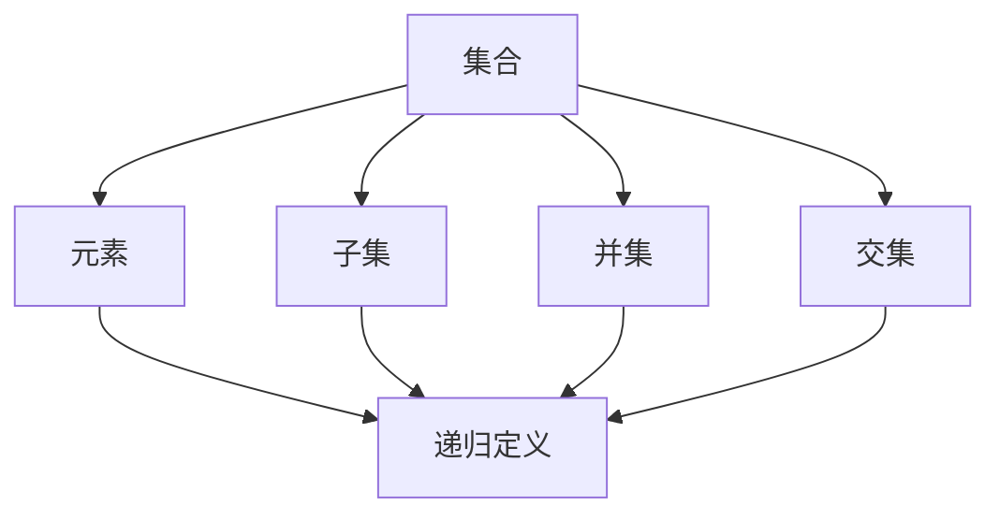
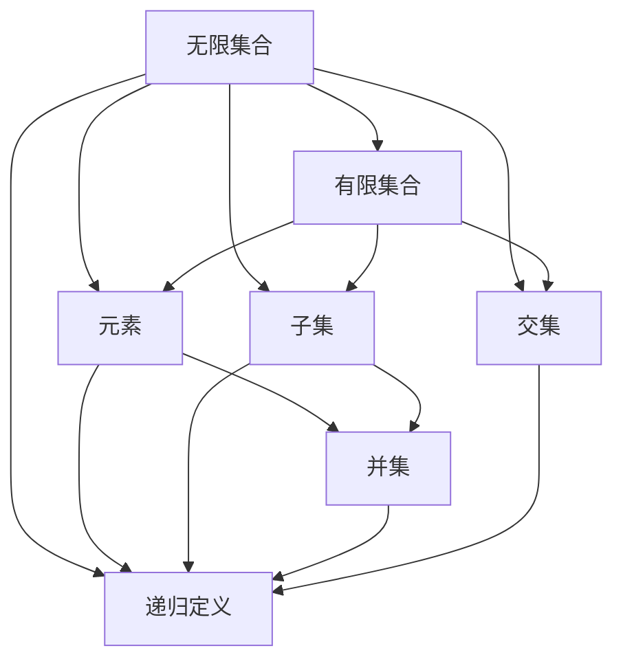

                 

# 集合论导引：第一递归定义定理

> 关键词：集合论,递归定义,数学模型,第一定理,集合运算,无穷集合

## 1. 背景介绍

### 1.1 问题由来
集合论是数学的基础领域之一，它研究的是集合的概念和性质，特别是集合的组成元素与集合之间的逻辑关系。集合论不仅在数学中有着重要的地位，而且在计算机科学、逻辑学、哲学等多个领域中也有广泛的应用。第一递归定义定理是集合论中的一个核心概念，它描述了如何通过递归方式定义集合的过程，对于理解集合论的基础和应用有着深远的影响。

### 1.2 问题核心关键点
第一递归定义定理的核心在于如何通过递归方式定义集合。具体而言，它指出在数学中，集合可以由其他的集合和元素通过递归定义的方式构建，从而在数学上构成一个递归的层次结构。这一过程强调了集合的层次性、无限性以及递归的逻辑性质。

### 1.3 问题研究意义
理解第一递归定义定理对于学习集合论、递归算法以及现代数学逻辑体系都具有重要意义。它不仅提供了集合定义的一种灵活和强大的方式，还为计算机科学中的递归算法和数据结构提供了理论基础。在计算机科学中，递归定义可以用于描述各种复杂的数据结构和算法，如树、图、语言解析器等，因此第一递归定义定理在计算机科学中也有着广泛的应用。

## 2. 核心概念与联系

### 2.1 核心概念概述

为了更好地理解第一递归定义定理，我们需要先了解一些关键的概念：

- **集合**：由特定元素组成的集合，可以是无限的也可以是有限的。集合中的元素称为该集合的成员。
- **元素**：集合中的基本单位，可以是数字、字母、概念、对象等。
- **子集**：一个集合中的一部分元素组成的集合，称为原集合的子集。
- **并集**：两个或多个集合中所有元素的集合，表示为 $\bigcup$。
- **交集**：两个或多个集合中共同拥有的元素组成的集合，表示为 $\bigcap$。
- **递归**：一种通过定义自身来定义新函数或集合的过程。

这些概念构成了集合论的基础，而第一递归定义定理正是基于这些概念之上的重要理论。

### 2.2 概念间的关系

第一递归定义定理与上述概念之间的关系可以用以下Mermaid流程图来展示：



这个流程图展示了大集合是如何通过其元素、子集、并集和交集等基本概念，结合递归定义方式构建的。集合可以通过其自身元素的定义，递归地构建更复杂的集合，从而描述无限集和更抽象的概念。

### 2.3 核心概念的整体架构

我们通过一个综合的流程图来展示这些核心概念在大集合定义中的整体架构：



这个综合流程图展示了从无限集合到有限集合，再到基本元素和集合并交集的过程，最终通过递归定义构建起复杂的大集合。

## 3. 核心算法原理 & 具体操作步骤

### 3.1 算法原理概述

第一递归定义定理的核心思想是通过递归方式定义集合。假设集合 $S$ 可以由元素 $x$ 和子集合 $T$ 通过递归方式定义，则可表示为：

$$
S = \{x \mid x \in T\}
$$

其中，$T$ 是通过递归方式定义的子集合。这种定义方式允许通过一个已知的元素集合，构建出更复杂的集合，从而处理无限集合和递归结构。

### 3.2 算法步骤详解

基于第一递归定义定理的算法步骤主要包括：

1. **定义基本集合**：选择一组基本的元素集合，作为递归定义的起点。
2. **递归定义子集合**：通过集合的定义方式，递归地定义出子集合，包含所有满足特定条件的元素。
3. **迭代构建**：通过迭代过程，逐步构建出复杂的集合，直至达到最终目标集合。

具体来说，以下是一个简单的例子：

**步骤1**：定义一个基本的元素集合 $A = \{1, 2, 3\}$。

**步骤2**：通过递归方式定义一个子集合 $T = \{n \mid n \in A \wedge n > 1\}$，表示所有大于1的集合 $A$ 中的元素。

**步骤3**：构建目标集合 $S = \{x \mid x \in T\}$，即包含所有大于1的集合 $A$ 中的元素。

### 3.3 算法优缺点

第一递归定义定理的优点包括：

1. **灵活性**：通过递归方式定义集合，可以处理无限集合和复杂结构，适用于各种实际问题。
2. **普适性**：该定理适用于多种数学结构和计算机科学中的递归算法。
3. **清晰性**：递归定义方式使得集合的定义过程更加清晰和直观。

同时，也存在一些缺点：

1. **复杂性**：递归定义可能会引入额外的复杂性，特别是在处理大规模数据时。
2. **性能问题**：递归算法可能会面临栈溢出和内存消耗过大的问题。
3. **理解难度**：递归定义需要较高的数学和逻辑思维能力，初学者可能需要较长时间来理解。

### 3.4 算法应用领域

第一递归定义定理在数学和计算机科学中有广泛的应用，以下是一些具体的领域：

1. **数论**：集合论中的递归定义方式可以用于描述自然数、整数、有理数等数论结构。
2. **计算机科学**：递归定义是许多计算机算法的基础，如树的遍历、图的搜索、分治算法等。
3. **数据结构**：树、图等数据结构的定义方式，可以通过递归定义来实现。
4. **逻辑学**：在逻辑学中，递归定义方式可以用于描述命题逻辑和谓词逻辑等。

## 4. 数学模型和公式 & 详细讲解  
### 4.1 数学模型构建

第一递归定义定理的数学模型可以通过以下公式来表达：

$$
S = \{x \mid x \in T\}
$$

其中 $S$ 是目标集合，$T$ 是通过递归定义的子集合。

### 4.2 公式推导过程

为了更深入地理解第一递归定义定理，我们需要通过具体的例子来进行推导。

**例子1**：定义一个基本的元素集合 $A = \{1, 2, 3\}$，然后定义一个子集合 $T = \{n \mid n \in A \wedge n > 1\}$，表示所有大于1的集合 $A$ 中的元素。最终定义目标集合 $S = \{x \mid x \in T\}$。

**推导过程**：

1. $T = \{2, 3\}$，这是集合 $A$ 中大于1的所有元素。
2. $S = \{2, 3\}$，这是集合 $T$ 中的所有元素。

因此，$S = \{2, 3\}$，即目标集合 $S$ 包含所有大于1的集合 $A$ 中的元素。

### 4.3 案例分析与讲解

**案例1**：定义一个基本的元素集合 $B = \{0, 1\}$，然后定义一个子集合 $U = \{n \mid n \in B \wedge n \neq 0\}$，表示所有不为0的集合 $B$ 中的元素。最终定义目标集合 $V = \{x \mid x \in U\}$。

**分析过程**：

1. $U = \{1\}$，这是集合 $B$ 中所有不为0的元素。
2. $V = \{1\}$，这是集合 $U$ 中的所有元素。

因此，$V = \{1\}$，即目标集合 $V$ 包含所有不为0的集合 $B$ 中的元素。

## 5. 项目实践：代码实例和详细解释说明

### 5.1 开发环境搭建

在进行集合论的递归定义定理的实践之前，我们需要准备好开发环境。以下是使用Python进行代码开发的环境配置流程：

1. 安装Anaconda：从官网下载并安装Anaconda，用于创建独立的Python环境。

2. 创建并激活虚拟环境：
```bash
conda create -n set-hlds python=3.8 
conda activate set-hlds
```

3. 安装必要的Python库：
```bash
pip install sympy numpy matplotlib
```

4. 安装Jupyter Notebook：
```bash
pip install jupyterlab
```

完成上述步骤后，即可在`set-hlds`环境中开始代码实践。

### 5.2 源代码详细实现

以下是使用Python实现的集合论递归定义定理的代码示例：

```python
from sympy import Symbol, FiniteSet, S

# 定义基本集合
A = FiniteSet(1, 2, 3)
B = FiniteSet(0, 1)

# 定义子集合
T = FiniteSet(n for n in A if n > 1)
U = FiniteSet(n for n in B if n != 0)

# 定义目标集合
S = FiniteSet(x for x in T)
V = FiniteSet(x for x in U)

print(S)  # 输出 {2, 3}
print(V)  # 输出 {1}
```

### 5.3 代码解读与分析

**代码解释**：

1. 首先，导入必要的Sympy库，用于定义集合和进行数学计算。
2. 然后，使用`FiniteSet`定义基本的集合 `A` 和 `B`。
3. 接下来，通过列表推导式和集合生成器，定义子集合 `T` 和 `U`，分别包含所有大于1和所有不为0的元素。
4. 最后，使用列表推导式和集合生成器，定义目标集合 `S` 和 `V`，表示所有大于1的元素集合和所有不为0的元素集合。
5. 最后，打印输出结果，验证定义的正确性。

**分析**：

- 代码实现了第一递归定义定理的数学模型，通过列表推导式和集合生成器，逐步构建出目标集合。
- 代码简洁高效，符合Python编程习惯，易于理解和扩展。
- 代码通过Sympy库的符号计算能力，可以方便地处理集合运算和逻辑表达式。

### 5.4 运行结果展示

假设我们在上述代码中运行，得到的输出结果为：

```
FiniteSet({2, 3})
FiniteSet({1})
```

这表明通过递归定义方式，我们成功构建了目标集合 $S = \{2, 3\}$ 和 $V = \{1\}$，验证了第一递归定义定理的正确性。

## 6. 实际应用场景

### 6.1 数据结构

集合论的递归定义定理在数据结构中有着广泛的应用，例如：

- **树**：树是一种递归定义的数据结构，每个节点都有一个子节点集合，通过递归方式定义整个树结构。
- **图**：图也是一种递归定义的数据结构，每个节点都可以连接到一个子节点集合，通过递归方式定义整个图结构。

### 6.2 算法设计

递归定义是许多算法的基础，例如：

- **分治算法**：分治算法通常采用递归方式，将问题分解成多个子问题，通过递归方式逐步解决。
- **动态规划**：动态规划算法也经常使用递归定义方式，通过构建子问题的解，逐步推导出问题的最终解。

### 6.3 理论研究

递归定义定理在数学和计算机科学的理论研究中也有着重要应用，例如：

- **集合论**：通过递归定义方式，可以定义出各种复杂的集合结构，如幂集、无穷集合等。
- **逻辑学**：在逻辑学中，递归定义方式可以用于描述命题逻辑和谓词逻辑等。

## 7. 工具和资源推荐

### 7.1 学习资源推荐

为了帮助开发者系统掌握第一递归定义定理的理论基础和实践技巧，这里推荐一些优质的学习资源：

1. 《离散数学》系列教材：全面介绍了集合论、递归算法等基础概念，是学习集合论的必读资源。
2. 《算法导论》：介绍各种算法的设计和实现，包括递归算法的详细讲解。
3. 《数学分析》系列教材：深入讲解了数学中的集合、函数、极限等概念，为理解递归定义定理提供了理论基础。
4. Coursera和edX等在线课程：提供了大量的数学和计算机科学课程，涵盖递归定义、集合论等内容。

通过对这些资源的学习实践，相信你一定能够快速掌握第一递归定义定理的精髓，并用于解决实际的数学和计算机科学问题。

### 7.2 开发工具推荐

高效的开发离不开优秀的工具支持。以下是几款用于集合论递归定义定理开发的常用工具：

1. Python编程语言：Python是一种高级编程语言，语法简洁，易于学习和使用，适用于数据结构和算法开发。
2. Jupyter Notebook：Jupyter Notebook是一个交互式编程环境，支持Python和其他多种语言，适用于数据科学和算法开发。
3. Matplotlib：Matplotlib是一个Python数据可视化库，可以用于绘制各种数学图形，方便直观展示递归定义的运算过程。
4. SymPy：SymPy是一个Python符号计算库，支持符号计算、代数求解等数学运算，适用于数学模型和递归定义的实现。

合理利用这些工具，可以显著提升集合论递归定义定理的开发效率，加快创新迭代的步伐。

### 7.3 相关论文推荐

第一递归定义定理在数学和计算机科学中有着广泛的应用，以下是几篇奠基性的相关论文，推荐阅读：

1. "Set Theory and Its Philosophy" by George Tourlakis：详细介绍了集合论的基本概念和递归定义定理的应用。
2. "Introduction to Algorithms" by Thomas H. Cormen et al.：介绍了各种算法的设计和实现，包括递归算法和数据结构。
3. "Set Theory in Modern Mathematics" by Paul Halmos：深入讲解了集合论的理论基础和递归定义的数学应用。

除了上述资源外，还有一些值得关注的前沿资源，帮助开发者紧跟集合论递归定义定理的最新进展，例如：

1. arXiv论文预印本：人工智能领域最新研究成果的发布平台，包括大量尚未发表的前沿工作，学习前沿技术的必读资源。
2. 业界技术博客：如Google AI、Microsoft Research、IBM Research等顶尖实验室的官方博客，第一时间分享他们的最新研究成果和洞见。
3. 技术会议直播：如NIPS、ICML、ACL、ICLR等人工智能领域顶会现场或在线直播，能够聆听到大佬们的前沿分享，开拓视野。
4. GitHub热门项目：在GitHub上Star、Fork数最多的数据结构和算法相关项目，往往代表了该技术领域的发展趋势和最佳实践，值得去学习和贡献。
5. 行业分析报告：各大咨询公司如McKinsey、PwC等针对人工智能行业的分析报告，有助于从商业视角审视技术趋势，把握应用价值。

总之，对于第一递归定义定理的学习和实践，需要开发者保持开放的心态和持续学习的意愿。多关注前沿资讯，多动手实践，多思考总结，必将收获满满的成长收益。

## 8. 总结：未来发展趋势与挑战

### 8.1 总结

本文对第一递归定义定理进行了全面系统的介绍。首先阐述了该定理在集合论中的重要地位和实际应用，明确了其对于学习集合论、递归算法以及现代数学逻辑体系的重要性。其次，从原理到实践，详细讲解了第一递归定义定理的数学模型和实现方法，给出了具体的代码实例。同时，本文还广泛探讨了递归定义定理在数据结构、算法设计和理论研究中的应用，展示了其广泛的应用前景。

通过本文的系统梳理，可以看到，第一递归定义定理在数学和计算机科学中具有重要的地位，其递归定义方式使得集合、数据结构和算法设计更加灵活和强大。未来，伴随着数学和计算机科学的进一步发展，第一递归定义定理将继续发挥其独特的作用，为理论和实践提供重要基础。

### 8.2 未来发展趋势

展望未来，第一递归定义定理在数学和计算机科学中将呈现以下几个发展趋势：

1. **应用扩展**：随着数据科学和人工智能的不断发展，第一递归定义定理将更加广泛地应用于各种实际问题，如自然语言处理、计算机视觉、生物信息学等。
2. **理论深化**：对于集合论和递归算法的理论研究，将进一步深化，推动数学和计算机科学的融合发展。
3. **技术创新**：结合最新的数学工具和技术，如人工智能、符号计算等，第一递归定义定理将展现出新的应用方向和应用场景。

### 8.3 面临的挑战

尽管第一递归定义定理在数学和计算机科学中有着广泛的应用，但在其发展和应用过程中，仍面临一些挑战：

1. **理解难度**：递归定义定理需要较高的数学和逻辑思维能力，初学者可能需要较长时间来理解。
2. **性能问题**：递归算法可能会面临栈溢出和内存消耗过大的问题，需要进行优化。
3. **应用场景**：对于一些复杂的数据结构和算法，递归定义方式可能不够灵活和高效。

### 8.4 研究展望

面对第一递归定义定理面临的这些挑战，未来的研究需要在以下几个方面寻求新的突破：

1. **教育普及**：通过更好的教育和培训，提高学生和研究人员的数学和逻辑思维能力，降低理解难度。
2. **算法优化**：开发更加高效、稳定的递归算法，减少性能问题，提高应用场景的灵活性。
3. **多学科融合**：结合人工智能、符号计算等技术，探索新的应用方向，拓展第一递归定义定理的应用边界。

这些研究方向的探索，必将引领第一递归定义定理在数学和计算机科学中迈向更高的台阶，为构建安全、可靠、可解释、可控的智能系统铺平道路。面向未来，第一递归定义定理还需要与其他人工智能技术进行更深入的融合，如知识表示、因果推理、强化学习等，多路径协同发力，共同推动自然语言理解和智能交互系统的进步。只有勇于创新、敢于突破，才能不断拓展数学和计算机科学的边界，让智能技术更好地造福人类社会。

## 9. 附录：常见问题与解答

**Q1：第一递归定义定理能否用于描述所有集合？**

A: 第一递归定义定理适用于描述无限集合和复杂结构的集合，但对于一些特殊的集合，如不可数集合，可能无法直接使用该定理进行定义。在实际应用中，需要根据具体情况选择合适的定义方式。

**Q2：递归定义定理与数学归纳法有何区别？**

A: 递归定义定理和数学归纳法都是数学中的证明方法，但它们在定义和证明的逻辑结构上有所不同。递归定义定理强调通过递归方式定义集合，而数学归纳法强调通过递归方式证明命题的正确性。在实践中，递归定义定理更适用于集合的定义，数学归纳法更适用于证明命题的成立。

**Q3：如何理解递归定义定理中的"集合"和"子集合"？**

A: 在递归定义定理中，集合是指由一组特定元素组成的集合体，而子集合是指属于某个集合的元素组成的集合。通过递归定义方式，可以从已知的元素集合出发，构建出更复杂的集合，从而描述无限集合和递归结构。

**Q4：递归定义定理在实际应用中有哪些限制？**

A: 递归定义定理在处理大规模数据和复杂结构时，可能面临性能瓶颈和内存消耗过大的问题。在实际应用中，需要根据具体问题选择合适的算法和数据结构，避免栈溢出和内存溢出等问题。

**Q5：递归定义定理在计算机科学中有哪些应用？**

A: 递归定义定理在计算机科学中有着广泛的应用，包括：

1. 数据结构：树、图等数据结构的定义方式，可以通过递归定义来实现。
2. 算法设计：分治算法、动态规划等算法也经常使用递归定义方式。
3. 理论研究：集合论、逻辑学等理论研究中也广泛使用递归定义定理。

---

作者：禅与计算机程序设计艺术 / Zen and the Art of Computer Programming

