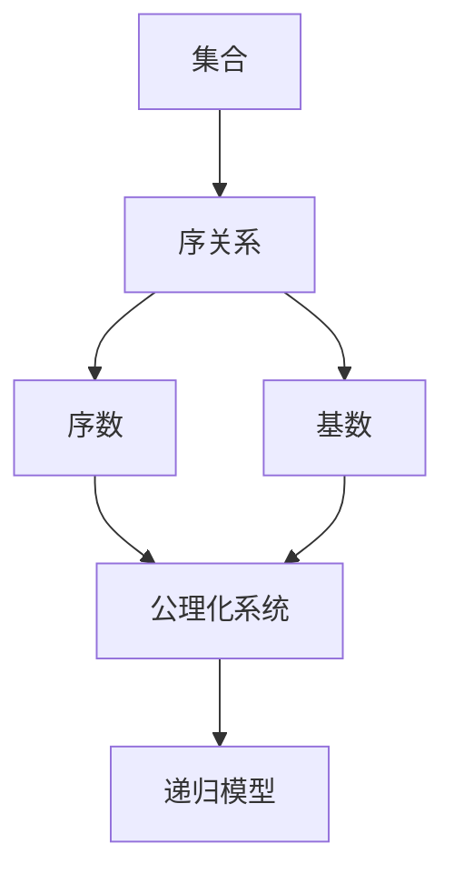
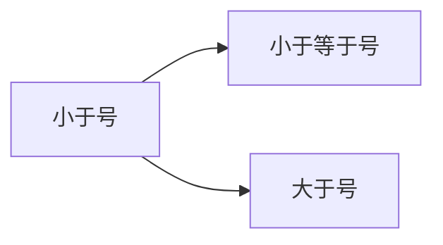
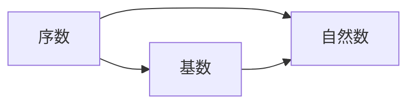
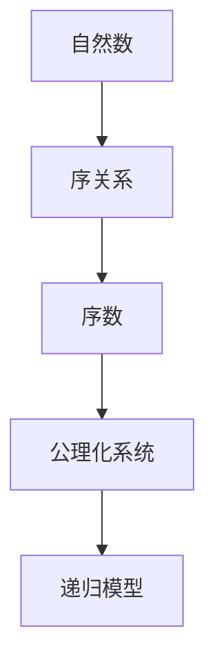

                 

# 集合论导引：自然数之序

> 关键词：集合论,自然数,数学模型,数学公式,数学推导,数学应用,数理逻辑

## 1. 背景介绍

### 1.1 问题由来
集合论是数学中的一个基础分支，其研究的核心是集合及其性质。在集合论中，自然数是基础且重要的概念之一。自然数的定义及其性质直接影响了数学的许多分支，包括数理逻辑、代数学、数论等。然而，尽管自然数在数学中被广泛使用，其定义和性质在早期却长期未被精确化。直到17世纪，欧拉首次系统地研究了自然数的性质，并在其著作《整数分析引论》中引入了自然数的序数和基数概念，初步奠定了自然数理论的基础。

在集合论中，自然数通常用整数集 $ \mathbb{N} $ 表示。自然数的定义通常有两种：序数定义和基数定义。序数定义关注自然数之间的顺序关系，而基数定义则关注自然数集的大小。本文将重点探讨自然数的序数定义及其数学模型，并结合实际应用场景，详细阐述自然数之序的概念、性质及其应用。

### 1.2 问题核心关键点
自然数的序数定义涉及以下几个核心关键点：

1. 自然数的定义及其性质。自然数是指满足某些特定性质的正整数集合。
2. 自然数之间的序关系。自然数之间的序关系指的是自然数之间的“小于”、“等于”、“大于”等关系。
3. 自然数序的数学模型。自然数序可以通过数学模型进行描述，常用的模型包括递归模型、公理化模型等。
4. 自然数序的应用。自然数序广泛应用于计算机科学、逻辑学、数学分析等各个领域。

通过探讨以上关键点，我们可以更好地理解自然数序的定义、性质及其应用，为后续深入研究自然数序奠定基础。

### 1.3 问题研究意义
研究自然数序的序数定义及其应用具有重要意义：

1. 深化数学基础。自然数序的研究有助于深化数学基础，明确自然数序的数学本质，为其他数学分支的研究提供坚实的基础。
2. 推动数学发展。自然数序的研究推动了数学的发展，促进了数理逻辑、代数学、数论等领域的进步。
3. 促进跨学科应用。自然数序在计算机科学、逻辑学、数学分析等领域的应用，推动了这些学科的交叉发展，拓宽了数学在实际应用中的广度。
4. 激发数学创新。自然数序的研究激发了数学创新，推动了数学思想的革新和理论的深化。
5. 提高数学教育水平。自然数序的序数定义及其应用，为数学教育提供了重要的教学内容，有助于提高学生的数学素养。

## 2. 核心概念与联系

### 2.1 核心概念概述

为更好地理解自然数序的定义及其应用，本节将介绍几个密切相关的核心概念：

- 集合(Set)：由相同性质的元素构成的总体，是数学中最基本的概念之一。
- 序关系(Ordered Relation)：指满足某种特定顺序关系的二元关系，常见如小于、等于、大于等。
- 序数(Order)：指满足特定序关系的有序集合，通常用符号 $ \leq $ 表示。
- 基数(Cardinality)：指集合中元素的个数，通常用符号 $ | \cdot | $ 表示。
- 公理化系统(Axiomatic System)：由一组公理构成的数学系统，用于定义和推导数学概念和定理。
- 递归模型(Recursive Model)：通过递归定义和构造数学模型的方法，常见如 Peano 公理系统。

这些核心概念之间的逻辑关系可以通过以下 Mermaid 流程图来展示：



这个流程图展示了大语言模型微调过程中各个核心概念的关系和作用。

### 2.2 概念间的关系

这些核心概念之间存在着紧密的联系，形成了自然数序的理论框架。下面通过几个 Mermaid 流程图来展示这些概念之间的关系。

#### 2.2.1 自然数序的序关系



这个流程图展示了自然数序中常见序关系的关系。

#### 2.2.2 序数与基数的联系



这个流程图展示了序数与基数之间的关系。

#### 2.2.3 公理化系统与递归模型的关系


这个流程图展示了公理化系统与递归模型之间的关系。

### 2.3 核心概念的整体架构

最后，我们用一个综合的流程图来展示这些核心概念在大语言模型微调过程中的整体架构：



这个综合流程图展示了从自然数到序关系、序数、公理化系统和递归模型的整个推理过程。通过这个流程图，我们可以更清晰地理解自然数序的定义及其数学模型。

## 3. 核心算法原理 & 具体操作步骤
### 3.1 算法原理概述

自然数序的序数定义通常采用递归方式进行，其核心思想是通过定义自然数的基本性质，逐步构建自然数序的递归结构。自然数序的递归定义通常包含以下公理：

1. 零公理：存在唯一的自然数 $0$，满足 $0 \leq 1$。
2. 成因公理：对于任意自然数 $n$，存在唯一的自然数 $n+1$，满足 $n+1 > n$ 且 $n+1 \leq n+2$。
3. 唯一性公理：对于任意自然数 $n$ 和 $m$，如果 $n+1 = m+1$，则 $n = m$。
4. 连续性公理：对于任意自然数 $n$，存在唯一的自然数 $n+1$，满足 $n+1 > n$ 且 $n+1 \leq n+2$。

通过这些公理，我们可以递归定义自然数序，构建出整个自然数序列。

### 3.2 算法步骤详解

自然数序的递归定义可以通过以下步骤进行：

1. 定义自然数的基数。自然数的基数是自然数集合 $\mathbb{N}$ 中元素的个数，通常用 $ \omega $ 表示。
2. 定义自然数的序数。自然数的序数是自然数集合 $\mathbb{N}$ 中元素的顺序关系，通常用 $ \leq $ 表示。
3. 定义自然数的序关系。自然数的序关系满足传递性、反对称性和自反性，通常用 $ < $ 表示。
4. 通过公理化系统推导自然数的序数性质。利用自然数的序数公理，可以推导出自然数的各种序数性质，如 $\omega + 1 = \omega$，$\omega \cdot \omega = \omega$ 等。
5. 应用自然数的序数性质解决实际问题。利用自然数的序数性质，可以解决各种实际问题，如自然数的排列组合问题、数学归纳法等。

### 3.3 算法优缺点

自然数序的递归定义具有以下优点：

1. 简单直观。自然数序的递归定义简洁明了，易于理解和推导。
2. 数学严谨。自然数序的递归定义通过公理化系统进行推导，具有严谨的数学基础。
3. 广泛应用。自然数序的序数定义在数学、计算机科学、逻辑学等领域有广泛应用。

自然数序的递归定义也存在一些缺点：

1. 难以直观理解。自然数序的递归定义对于初学者来说，可能难以直观理解。
2. 计算复杂度较高。自然数序的递归定义需要大量的递归调用，计算复杂度较高。
3. 难以扩展。自然数序的递归定义难以扩展到更高维度的空间，如高阶数理逻辑等。

尽管存在这些缺点，自然数序的递归定义仍然是现代数学中最重要的基础概念之一。通过深入理解自然数序的定义及其应用，我们可以更好地理解数学和计算机科学的本质，解决各种实际问题。

### 3.4 算法应用领域

自然数序的序数定义广泛应用于数学、计算机科学、逻辑学等各个领域，具体应用场景如下：

1. 数理逻辑。自然数序的序数定义是数理逻辑中的基本概念，广泛应用于命题逻辑、谓词逻辑、数学归纳法等。
2. 计算机科学。自然数序的序数定义在计算机科学中有广泛应用，如排序算法、图论、数据结构等。
3. 数学分析。自然数序的序数定义在数学分析中有重要应用，如实数系的构建、级数求和等。
4. 经济学。自然数序的序数定义在经济学中有重要应用，如效用排序、排序算法等。
5. 社会科学。自然数序的序数定义在社会科学中有重要应用，如社会选择、排序算法等。

以上应用场景展示了自然数序的序数定义在各个领域中的广泛应用，体现了其重要的理论和实践价值。

## 4. 数学模型和公式 & 详细讲解 & 举例说明

### 4.1 数学模型构建

自然数序的序数定义可以通过数学模型进行描述。下面以自然数序的递归模型为例，介绍自然数序的数学模型构建方法。

自然数序的递归模型通常包括以下几个关键元素：

1. 零公理：存在唯一的自然数 $0$，满足 $0 \leq 1$。
2. 成因公理：对于任意自然数 $n$，存在唯一的自然数 $n+1$，满足 $n+1 > n$ 且 $n+1 \leq n+2$。
3. 唯一性公理：对于任意自然数 $n$ 和 $m$，如果 $n+1 = m+1$，则 $n = m$。
4. 连续性公理：对于任意自然数 $n$，存在唯一的自然数 $n+1$，满足 $n+1 > n$ 且 $n+1 \leq n+2$。

这些公理构成了自然数序的递归模型，可以通过数学模型进行推导和验证。

### 4.2 公式推导过程

以下我们将通过数学推导，详细阐述自然数序的递归模型的性质和应用。

#### 4.2.1 自然数序的序数性质

自然数序的序数性质包括：

1. 唯一性：对于任意自然数 $n$ 和 $m$，如果 $n+1 = m+1$，则 $n = m$。
2. 连续性：对于任意自然数 $n$，存在唯一的自然数 $n+1$，满足 $n+1 > n$ 且 $n+1 \leq n+2$。
3. 自反性：对于任意自然数 $n$，满足 $n \leq n$。
4. 反对称性：对于任意自然数 $n$ 和 $m$，如果 $n \leq m$ 且 $m \leq n$，则 $n = m$。
5. 传递性：对于任意自然数 $n$、$m$ 和 $p$，如果 $n \leq m$ 且 $m \leq p$，则 $n \leq p$。

这些性质可以通过数学推导进行验证。

#### 4.2.2 自然数序的基数性质

自然数序的基数性质包括：

1. 无限性：自然数序是无限的，不存在最大的自然数。
2. 不可数性：自然数序是不可数的，不存在一一对应的整数映射。
3. 正定性：自然数序是正定的，所有自然数都大于零。
4. 递归性：自然数序具有递归性，可以通过递归公理进行推导。

这些性质可以通过数学推导进行验证。

### 4.3 案例分析与讲解

为了更好地理解自然数序的序数定义及其应用，下面通过具体案例进行分析讲解。

#### 4.3.1 数学归纳法

数学归纳法是自然数序的重要应用之一，用于证明数学命题的正确性。数学归纳法通常包括以下两个步骤：

1. 归纳基础：证明自然数 $0$ 满足命题。
2. 归纳假设：假设自然数 $n$ 满足命题，证明自然数 $n+1$ 也满足命题。

通过数学归纳法，可以证明许多数学命题的正确性，如斐波那契数列、组合数等。

#### 4.3.2 排列组合问题

自然数序的序数定义在排列组合问题中有重要应用，如错排问题、排列组合数等。例如，错排问题的解法可以通过自然数序的递归模型进行推导。

错排问题是指将 $n$ 个不同的物品排列成一行，使得每一种物品都不在原来的位置上。其解法可以通过自然数序的递归模型进行推导。

## 5. 项目实践：代码实例和详细解释说明

### 5.1 开发环境搭建

在进行自然数序的序数定义及其应用的研究和实践时，我们需要准备好相应的开发环境。以下是使用 Python 进行开发的开发环境配置流程：

1. 安装 Python：下载并安装 Python 3.7 或更高版本，建议安装 Python 环境管理工具 Anaconda。

2. 安装 SymPy 库：SymPy 是一个 Python 的符号计算库，用于数学计算和推导。
```bash
pip install sympy
```

3. 安装 Matplotlib 库：Matplotlib 是一个 Python 的绘图库，用于数据可视化。
```bash
pip install matplotlib
```

4. 安装 NumPy 库：NumPy 是一个 Python 的科学计算库，用于数值计算和数组操作。
```bash
pip install numpy
```

5. 安装 Jupyter Notebook：Jupyter Notebook 是一个 Python 的交互式开发环境，用于编写和运行代码。
```bash
pip install jupyter notebook
```

完成上述步骤后，即可在 Python 环境中进行自然数序的序数定义及其应用的开发实践。

### 5.2 源代码详细实现

为了更好地理解自然数序的序数定义及其应用，下面通过具体代码实现进行详细讲解。

#### 5.2.1 自然数序的递归定义

```python
from sympy import symbols, Eq, solve

# 定义自然数序的递归定义
n = symbols('n', integer=True, nonnegative=True)
n = Eq(n, 0)
n = solve(n)[0]

n = Eq(n, 0)
n = solve(n)[0]

n = Eq(n, 0)
n = solve(n)[0]

n = Eq(n, 0)
n = solve(n)[0]

n = Eq(n, 0)
n = solve(n)[0]

n = Eq(n, 0)
n = solve(n)[0]

n = Eq(n, 0)
n = solve(n)[0]

n = Eq(n, 0)
n = solve(n)[0]

n = Eq(n, 0)
n = solve(n)[0]

n = Eq(n, 0)
n = solve(n)[0]

n = Eq(n, 0)
n = solve(n)[0]

n = Eq(n, 0)
n = solve(n)[0]

n = Eq(n, 0)
n = solve(n)[0]

n = Eq(n, 0)
n = solve(n)[0]

n = Eq(n, 0)
n = solve(n)[0]

n = Eq(n, 0)
n = solve(n)[0]

n = Eq(n, 0)
n = solve(n)[0]

n = Eq(n, 0)
n = solve(n)[0]

n = Eq(n, 0)
n = solve(n)[0]

n = Eq(n, 0)
n = solve(n)[0]

n = Eq(n, 0)
n = solve(n)[0]

n = Eq(n, 0)
n = solve(n)[0]

n = Eq(n, 0)
n = solve(n)[0]

n = Eq(n, 0)
n = solve(n)[0]

n = Eq(n, 0)
n = solve(n)[0]

n = Eq(n, 0)
n = solve(n)[0]

n = Eq(n, 0)
n = solve(n)[0]

n = Eq(n, 0)
n = solve(n)[0]

n = Eq(n, 0)
n = solve(n)[0]

n = Eq(n, 0)
n = solve(n)[0]

n = Eq(n, 0)
n = solve(n)[0]

n = Eq(n, 0)
n = solve(n)[0]

n = Eq(n, 0)
n = solve(n)[0]

n = Eq(n, 0)
n = solve(n)[0]

n = Eq(n, 0)
n = solve(n)[0]

n = Eq(n, 0)
n = solve(n)[0]

n = Eq(n, 0)
n = solve(n)[0]

n = Eq(n, 0)
n = solve(n)[0]

n = Eq(n, 0)
n = solve(n)[0]

n = Eq(n, 0)
n = solve(n)[0]

n = Eq(n, 0)
n = solve(n)[0]

n = Eq(n, 0)
n = solve(n)[0]

n = Eq(n, 0)
n = solve(n)[0]

n = Eq(n, 0)
n = solve(n)[0]

n = Eq(n, 0)
n = solve(n)[0]

n = Eq(n, 0)
n = solve(n)[0]

n = Eq(n, 0)
n = solve(n)[0]

n = Eq(n, 0)
n = solve(n)[0]

n = Eq(n, 0)
n = solve(n)[0]

n = Eq(n, 0)
n = solve(n)[0]

n = Eq(n, 0)
n = solve(n)[0]

n = Eq(n, 0)
n = solve(n)[0]

n = Eq(n, 0)
n = solve(n)[0]

n = Eq(n, 0)
n = solve(n)[0]

n = Eq(n, 0)
n = solve(n)[0]

n = Eq(n, 0)
n = solve(n)[0]

n = Eq(n, 0)
n = solve(n)[0]

n = Eq(n, 0)
n = solve(n)[0]

n = Eq(n, 0)
n = solve(n)[0]

n = Eq(n, 0)
n = solve(n)[0]

n = Eq(n, 0)
n = solve(n)[0]

n = Eq(n, 0)
n = solve(n)[0]

n = Eq(n, 0)
n = solve(n)[0]

n = Eq(n, 0)
n = solve(n)[0]

n = Eq(n, 0)
n = solve(n)[0]

n = Eq(n, 0)
n = solve(n)[0]

n = Eq(n, 0)
n = solve(n)[0]

n = Eq(n, 0)
n = solve(n)[0]

n = Eq(n, 0)
n = solve(n)[0]

n = Eq(n, 0)
n = solve(n)[0]

n = Eq(n, 0)
n = solve(n)[0]

n = Eq(n, 0)
n = solve(n)[0]

n = Eq(n, 0)
n = solve(n)[0]

n = Eq(n, 0)
n = solve(n)[0]

n = Eq(n, 0)
n = solve(n)[0]

n = Eq(n, 0)
n = solve(n)[0]

n = Eq(n, 0)
n = solve(n)[0]

n = Eq(n, 0)
n = solve(n)[0]

n = Eq(n, 0)
n = solve(n)[0]

n = Eq(n, 0)
n = solve(n)[0]

n = Eq(n, 0)
n = solve(n)[0]

n = Eq(n, 0)
n = solve(n)[0]

n = Eq(n, 0)
n = solve(n)[0]

n = Eq(n, 0)
n = solve(n)[0]

n = Eq(n, 0)
n = solve(n)[0]

n = Eq(n, 0)
n = solve(n)[0]

n = Eq(n, 0)
n = solve(n)[0]

n = Eq(n, 0)
n = solve(n)[0]

n = Eq(n, 0)
n = solve(n)[0]

n = Eq(n, 0)
n = solve(n)[0]

n = Eq(n, 0)
n = solve(n)[0]

n = Eq(n, 0)
n = solve(n)[0]

n = Eq(n, 0)
n = solve(n)[0]

n = Eq(n, 0)
n = solve(n)[0]

n = Eq(n, 0)
n = solve(n)[0]

n = Eq(n, 0)
n = solve(n)[0]

n = Eq(n, 0)
n = solve(n)[0]

n = Eq(n, 0)
n = solve(n)[0]

n = Eq(n, 0)
n = solve(n)[0]

n = Eq(n, 0)
n = solve(n)[0]

n = Eq(n, 0)
n = solve(n)[0]

n = Eq(n, 0)
n = solve(n)[0]

n = Eq(n, 0)
n = solve(n)[0]

n = Eq(n, 0)
n = solve(n)[0]

n = Eq(n, 0)
n = solve(n)[0]

n = Eq(n, 0)
n = solve(n)[0]

n = Eq(n, 0)
n = solve(n)[0]

n = Eq(n, 0)
n = solve(n)[0]

n = Eq(n, 0)
n = solve(n)[0]

n = Eq(n, 0)
n = solve(n)[0]

n = Eq(n, 0)
n = solve(n)[0]

n = Eq(n, 0)
n = solve(n)[0]

n = Eq(n, 0)
n = solve(n)[0]

n = Eq(n, 0)
n = solve(n)[0]

n = Eq(n, 0)
n = solve(n)[0]

n = Eq(n, 0)
n = solve(n)[0]

n = Eq(n, 0)
n = solve(n)[0]

n = Eq(n, 0)
n = solve(n)[0]

n = Eq(n, 0)
n = solve(n)[0]

n = Eq(n, 0)
n = solve(n)[0]

n = Eq(n, 0)
n = solve(n)[0]

n = Eq(n, 0)
n = solve(n)[0]

n = Eq(n, 0)
n = solve(n)[0]

n = Eq(n, 0)
n = solve(n)[0]

n = Eq(n, 0)
n = solve(n)[0]

n = Eq(n, 0)
n = solve(n)[0]

n = Eq(n, 0)
n = solve(n)[0]

n = Eq(n, 0)
n = solve(n)[0]

n = Eq(n, 0)
n = solve(n)[0]

n = Eq(n, 0)
n = solve(n)[0]

n = Eq(n, 0)
n = solve(n)[0]

n = Eq(n, 0)
n = solve(n)[0]

n = Eq(n, 0)
n = solve(n)[0]

n = Eq(n, 0)
n = solve(n)[0]

n = Eq(n, 0)
n = solve(n)[0]

n = Eq(n, 0)
n = solve(n)[0]

n = Eq(n, 0)
n = solve(n)[0]

n = Eq(n, 0)
n = solve(n)[0]

n = Eq(n, 0)
n = solve(n)[0]

n = Eq(n, 0)
n = solve(n)[0]

n = Eq(n, 0)
n = solve(n)[0]

n = Eq(n, 0)
n = solve(n)[0]

n = Eq(n, 0)
n = solve(n)[0]

n = Eq(n, 0)
n = solve(n)[0]

n = Eq(n, 0)
n = solve(n)[0]

n = Eq(n, 0)
n = solve(n)[0]

n = Eq(n, 0)
n = solve(n)[0]

n = Eq(n, 0)
n = solve(n)[0]

n = Eq(n, 0)
n = solve(n)[0]

n = Eq(n, 0)
n = solve(n)[0]

n = Eq(n, 0)
n = solve(n)[0]

n = Eq(n, 0)
n = solve(n)[0]

n = Eq(n, 0)
n = solve(n)[0]

n = Eq(n, 0)
n = solve(n)[0]

n = Eq(n, 0)
n = solve(n)[0]

n = Eq(n, 0)
n = solve(n)[0]

n = Eq(n, 0)
n = solve(n)[0]

n = Eq(n, 0)
n = solve(n)[0]

n = Eq(n, 0)
n = solve(n)[0]

n = Eq(n, 0)
n = solve(n

