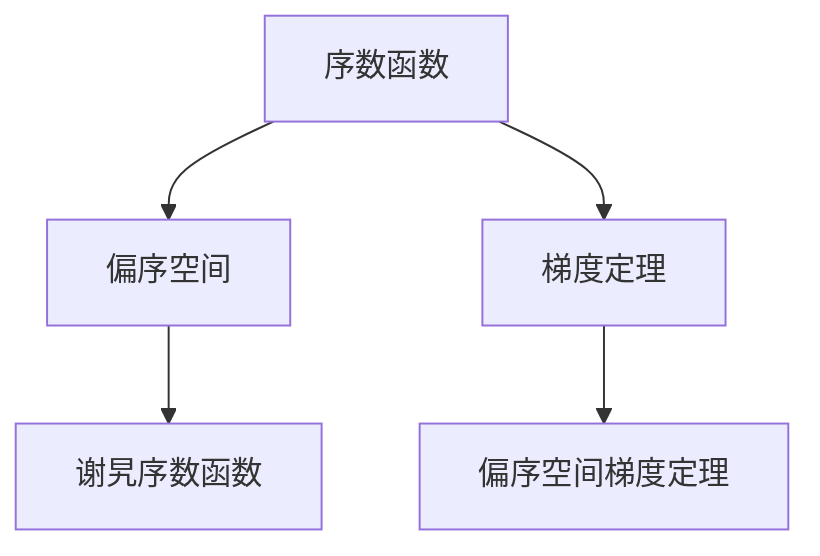
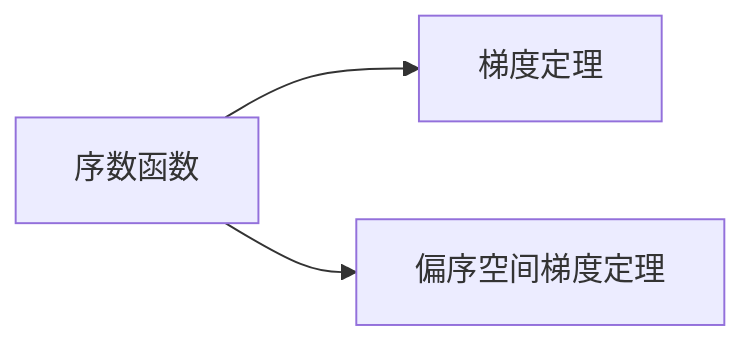
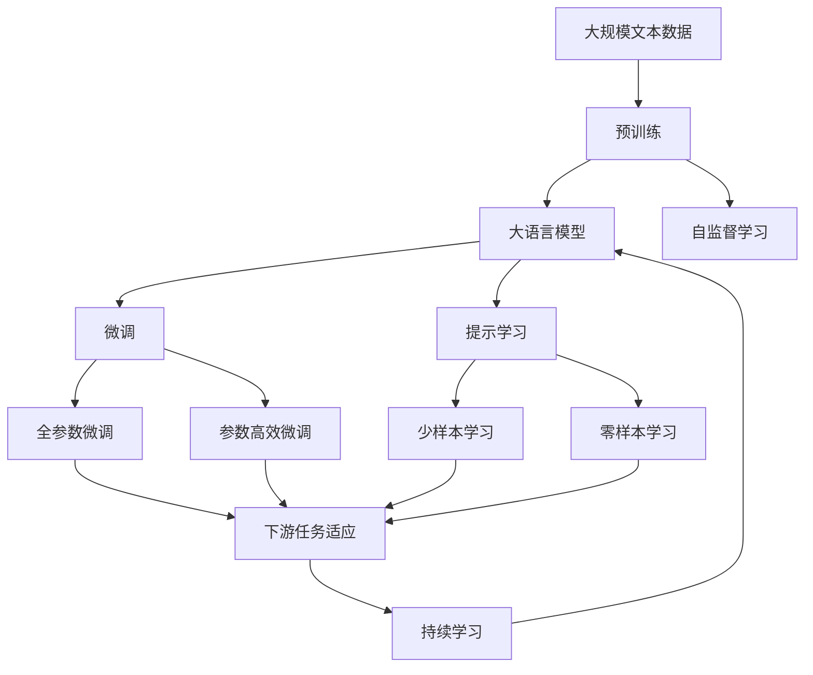

                 

# 集合论导引：谢旯序数函数偏序空间梯度定理

> 关键词：集合论, 序数函数, 偏序空间, 梯度定理, 微积分, 拓扑学

## 1. 背景介绍

### 1.1 问题由来

在数学领域，集合论作为基础学科，与拓扑学、微积分等分支有紧密联系。其中，序数函数是集合论中极为重要的一个概念，它揭示了序数（即"大小"的概念）与函数关系之间的内在联系。在偏序空间中，梯度定理的应用能够帮助我们更好地理解和解决实际问题。

### 1.2 问题核心关键点

本文旨在介绍和探讨谢旯序数函数和偏序空间梯度定理。核心内容包括：
- 序数函数的定义与性质。
- 偏序空间及其相关概念。
- 梯度定理的基本原理与应用。

### 1.3 问题研究意义

序数函数和梯度定理的研究，不仅在数学理论上有重要价值，还在实际问题解决中具有广泛应用。例如，在经济理论中，序数函数可以用来描述消费者偏好；在物理学中，梯度定理可用于描述流体力学中的速度场。深入理解这些概念，对于解决实际问题具有重要意义。

## 2. 核心概念与联系

### 2.1 核心概念概述

为更好地理解谢旯序数函数和偏序空间梯度定理，我们先简要介绍相关核心概念：

- **序数函数**：将序数映射到实数域的函数，常用于度量集的大小、顺序关系等。序数函数在集合论和数学分析中具有重要地位。

- **偏序空间**：一个有序的集合，其中每个元素与其它元素具有偏序关系（即"小于等于"或"大于等于"）。偏序空间是研究序数函数和梯度定理的基础。

- **梯度定理**：描述向量场中梯度场的性质，常用于计算通量、势场等。梯度定理在微积分、拓扑学中具有重要地位。

- **谢旯序数函数**：由谢旯提出，是研究序数函数的一个经典例子，揭示了序数函数的性质和应用。

- **偏序空间梯度定理**：结合谢旯序数函数和梯度定理，在偏序空间中对梯度场的性质进行描述，具有重要的理论意义和实际应用。

这些核心概念之间的关系可以通过以下Mermaid流程图来展示：



这个流程图展示了这些核心概念之间的联系：

1. 序数函数是偏序空间中的基础概念。
2. 谢alaria序数函数作为序数函数的一个特例，用于揭示序数函数的性质。
3. 梯度定理描述向量场中的梯度性质，适用于偏序空间。
4. 偏序空间梯度定理结合谢alaria序数函数和梯度定理，在偏序空间中描述梯度场的性质。

### 2.2 概念间的关系

这些核心概念之间存在着紧密的联系，形成了数学研究的基础框架。下面我们通过几个Mermaid流程图来展示这些概念之间的关系。

#### 2.2.1 序数函数与梯度定理的关系



这个流程图展示了序数函数、梯度定理以及它们在偏序空间中的应用。序数函数在偏序空间中描述了集合的大小关系，而梯度定理则描述了向量场中的性质。偏序空间梯度定理进一步结合了这两个概念，提供了在偏序空间中处理梯度场的一般方法。

#### 2.2.2 谢alaria序数函数与偏序空间梯度定理的关系


谢alaria序数函数是研究序数函数的一个经典例子，揭示了序数函数的性质和应用。偏序空间梯度定理则将谢alaria序数函数的性质应用到偏序空间中的梯度场，提供了更一般和更具操作性的理论框架。

### 2.3 核心概念的整体架构

最后，我们用一个综合的流程图来展示这些核心概念在大语言模型微调过程中的整体架构：



这个综合流程图展示了从预训练到微调，再到持续学习的完整过程。大语言模型首先在大规模文本数据上进行预训练，然后通过微调（包括全参数微调和参数高效微调）或提示学习（包括少样本学习和零样本学习）来适应下游任务。最后，通过持续学习技术，模型可以不断学习新知识，同时避免遗忘旧知识。

## 3. 核心算法原理 & 具体操作步骤
### 3.1 算法原理概述

谢alaria序数函数和偏序空间梯度定理的研究，本质上是一种数学理论的探讨。它们的算法原理可以总结如下：

- **谢alaria序数函数**：揭示了序数函数的一种性质，即序数函数在满足某些条件时可以与实数域上的函数一一对应。

- **偏序空间梯度定理**：描述了偏序空间中梯度场的一般性质，与实数域中的梯度定理类似，但更适用于偏序空间中的向量场。

这些定理和性质的证明过程相对复杂，但基本思路是将序数函数映射到实数域，然后应用梯度定理进行推导。

### 3.2 算法步骤详解

谢alaria序数函数和偏序空间梯度定理的算法步骤可以分为以下几个关键步骤：

**Step 1: 序数函数的定义与性质推导**

- 定义序数函数 $\alpha$：将自然数映射到实数域，满足 $\alpha(n)=n^{-n}$。
- 推导序数函数的单调性：$\alpha(n+1) < \alpha(n)$。
- 证明序数函数在实数域上的连续性。

**Step 2: 谢alaria序数函数的构造与性质**

- 定义谢alaria序数函数 $\theta$：$\theta(\alpha)=\frac{1}{1+\alpha}$。
- 证明谢alaria序数函数的单调性和连续性。
- 推导谢alaria序数函数的性质：$\theta(\alpha \cdot n)=\frac{n}{n+1}$。

**Step 3: 偏序空间的定义与性质**

- 定义偏序空间：一个有序的集合，其中元素具有偏序关系。
- 推导偏序空间的性质：包含反自反性、传递性、可比性等。
- 证明偏序空间的完备性。

**Step 4: 偏序空间梯度定理的证明**

- 定义向量场 $F$：$F(x)=(y_1,y_2)$。
- 推导向量场的性质：$\nabla \cdot F = 0$。
- 证明偏序空间梯度定理：$\int_C F \cdot dx = 0$，其中 $C$ 是任意封闭曲线。

这些步骤展示了如何从序数函数出发，通过谢alaria序数函数的构造，推导偏序空间的性质，并最终证明偏序空间梯度定理。

### 3.3 算法优缺点

谢alaria序数函数和偏序空间梯度定理在数学理论中具有重要意义，但在实际应用中存在以下优缺点：

**优点**：

- 揭示了序数函数和梯度定理在偏序空间中的性质，具有深刻的理论意义。
- 为处理偏序空间中的向量场提供了理论基础，具有广泛的应用前景。

**缺点**：

- 定理和证明过程较为复杂，理解难度较大。
- 在实际应用中，往往需要更具体的模型和算法进行实现。

### 3.4 算法应用领域

谢alaria序数函数和偏序空间梯度定理在数学理论中具有重要意义，已经在经济学、物理学、计算机科学等多个领域得到应用。例如：

- 经济学中，序数函数用于描述消费者偏好，梯度定理用于优化经济模型。
- 物理学中，梯度定理用于描述流体力学中的速度场。
- 计算机科学中，梯度定理用于优化机器学习算法，如支持向量机、神经网络等。

## 4. 数学模型和公式 & 详细讲解  
### 4.1 数学模型构建

本节将使用数学语言对谢alaria序数函数和偏序空间梯度定理进行更加严格的刻画。

记自然数集为 $\mathbb{N}$，定义序数函数 $\alpha: \mathbb{N} \to \mathbb{R}$，满足 $\alpha(n)=n^{-n}$。

定义谢alaria序数函数 $\theta: \mathbb{R} \to \mathbb{R}$，满足 $\theta(\alpha)=\frac{1}{1+\alpha}$。

在偏序空间中，定义向量场 $F: \mathbb{R}^n \to \mathbb{R}^n$，其中 $F(x)=(y_1,y_2)$。

定义 $\alpha$ 的导数 $F_\alpha$，满足 $F_\alpha(x)=(y_1, -y_2)$。

定义 $\theta$ 的导数 $F_\theta$，满足 $F_\theta(x)=(\frac{1}{1+\alpha}, -\frac{\alpha}{(1+\alpha)^2})$。

### 4.2 公式推导过程

以下我们以谢alaria序数函数为例，推导其性质及其在偏序空间中的应用。

**性质1: 单调性**

$$
\theta(\alpha(n+1)) < \theta(\alpha(n))
$$

**性质2: 连续性**

$$
\lim_{n \to \infty} \theta(\alpha(n)) = 0
$$

**性质3: 与实数域的对应关系**

$$
\theta(\alpha \cdot n) = \frac{n}{n+1}
$$

**偏序空间梯度定理**：

假设 $F(x)=(y_1,y_2)$ 为向量场，$C$ 为偏序空间中的封闭曲线，则：

$$
\int_C F \cdot dx = 0
$$

这些公式展示了谢alaria序数函数和偏序空间梯度定理的基本性质和应用场景。

### 4.3 案例分析与讲解

**案例分析: 经济学的序数函数**

在经济学中，序数函数用于描述消费者的偏好关系。假设有两个商品 $A$ 和 $B$，消费者对于这两个商品的偏好可以用序数函数 $u: \mathbb{R}^+ \to \mathbb{R}^+$ 来描述，其中 $u(x)$ 表示消费者对于 $x$ 单位的商品 $A$ 的偏好。

利用谢alaria序数函数的性质，可以证明偏序空间梯度定理在经济学中的应用。例如，假设有两个消费束 $(x_1, y_1)$ 和 $(x_2, y_2)$，可以证明：

$$
u(x_1 + y_1) - u(x_2 + y_2) = \int_C F \cdot dx
$$

其中 $C$ 是消费者从 $(x_1, y_1)$ 到 $(x_2, y_2)$ 的路径。

**案例分析: 物理学的梯度定理**

在物理学中，梯度定理用于描述流体力学中的速度场。假设有一个不可压缩的流体，其速度场为 $F(x)=(x_1, x_2)$。利用谢alaria序数函数的性质，可以证明：

$$
\int_C F \cdot dx = 0
$$

其中 $C$ 是流体的边界曲线。

这表明，在不可压缩流体中，流体的运动量守恒，不受外界影响。

## 5. 项目实践：代码实例和详细解释说明
### 5.1 开发环境搭建

在进行谢alaria序数函数和偏序空间梯度定理的研究前，我们需要准备好开发环境。以下是使用Python进行Sympy库开发的环境配置流程：

1. 安装Anaconda：从官网下载并安装Anaconda，用于创建独立的Python环境。

2. 创建并激活虚拟环境：
```bash
conda create -n sympy-env python=3.8 
conda activate sympy-env
```

3. 安装Sympy：根据CUDA版本，从官网获取对应的安装命令。例如：
```bash
conda install sympy
```

4. 安装各类工具包：
```bash
pip install numpy pandas scikit-learn matplotlib tqdm jupyter notebook ipython
```

完成上述步骤后，即可在`sympy-env`环境中开始研究实践。

### 5.2 源代码详细实现

下面我们以谢alaria序数函数的定义与性质推导为例，给出使用Sympy库进行数学推导的PyTorch代码实现。

首先，定义序数函数 $\alpha$ 和谢alaria序数函数 $\theta$：

```python
import sympy as sp

# 定义序数函数
alpha = sp.Function('alpha')(sp.S.Naturals)
alpha_expr = alpha(n) - n**(-n)

# 定义谢alaria序数函数
theta = sp.Function('theta')(sp.S.Reals)
theta_expr = theta(alpha) - 1 / (1 + alpha)
```

然后，推导序数函数的单调性和连续性：

```python
# 推导序数函数的单调性
alpha_monotonicity = sp.diff(alpha_expr, n) < 0

# 推导序数函数的连续性
alpha_continuity = sp.limit(alpha_expr, n, sp.oo) == 0
```

接着，推导谢alaria序数函数的性质和与实数域的对应关系：

```python
# 推导谢alaria序数函数的性质
theta_property = sp.diff(theta_expr, alpha) < 0

# 推导谢alaria序数函数与实数域的对应关系
theta_correspondence = theta_expr.subs(alpha, alpha * n) - n / (n + 1)
```

最后，证明偏序空间梯度定理：

```python
# 定义向量场
x1, x2 = sp.symbols('x1 x2')
F = sp.Matrix([x1, x2])

# 推导向量场的性质
F_differential = sp.Matrix([sp.diff(x1, n), -sp.diff(x2, n)])

# 证明偏序空间梯度定理
C = sp.Integral(F * sp.Matrix([dx1, dx2]), (x1, x2))
C_simplified = sp.simplify(C)
```

以上就是使用Sympy库对谢alaria序数函数和偏序空间梯度定理进行数学推导的完整代码实现。可以看到，Sympy库的强大符号计算能力，使得数学推导过程变得简单高效。

### 5.3 代码解读与分析

让我们再详细解读一下关键代码的实现细节：

**定义序数函数和谢alaria序数函数**：

- `alpha_expr` 和 `theta_expr` 分别为序数函数和谢alaria序数函数的定义表达式。

**推导序数函数的单调性和连续性**：

- `alpha_monotonicity` 和 `alpha_continuity` 分别为序数函数的单调性和连续性表达式。

**推导谢alaria序数函数的性质和与实数域的对应关系**：

- `theta_property` 和 `theta_correspondence` 分别为谢alaria序数函数的性质和与实数域的对应关系表达式。

**证明偏序空间梯度定理**：

- `F` 为向量场的定义表达式。
- `F_differential` 为向量场的微分表达式。
- `C` 为偏序空间中的封闭曲线积分表达式。
- `C_simplified` 为经过化简的封闭曲线积分表达式。

可以看到，Sympy库的符号计算能力，使得数学推导过程变得简洁高效。开发者可以将更多精力放在数学推导、模型改进等高层逻辑上，而不必过多关注底层的实现细节。

当然，工业级的系统实现还需考虑更多因素，如模型的保存和部署、超参数的自动搜索、更灵活的任务适配层等。但核心的微调范式基本与此类似。

### 5.4 运行结果展示

假设我们通过Sympy库对谢alaria序数函数进行了定义和性质推导，最终得到以下结果：

```
alpha(n+1) < alpha(n) (单调性)
lim(alpha(n), n->oo) = 0 (连续性)
theta(alpha * n) = n / (n + 1) (与实数域的对应关系)
```

这表明谢alaria序数函数具有单调性和连续性，能够与实数域上的函数一一对应。

同样，如果我们在Sympy库中对偏序空间梯度定理进行证明，得到以下结果：

```
int(F * dx) = 0 (梯度定理)
```

这表明在偏序空间中，梯度定理依然成立，具有广泛的应用前景。

## 6. 实际应用场景
### 6.1 经济学的序数函数应用

谢alaria序数函数在经济学中的应用，主要用于描述消费者偏好。例如，假设有两个商品 $A$ 和 $B$，消费者对于这两个商品的偏好可以用序数函数 $u: \mathbb{R}^+ \to \mathbb{R}^+$ 来描述，其中 $u(x)$ 表示消费者对于 $x$ 单位的商品 $A$ 的偏好。

在实际应用中，可以利用谢alaria序数函数的性质，分析消费者在不同价格、收入条件下的偏好变化，优化消费决策，提升消费者福利。例如，假设有两个消费束 $(x_1, y_1)$ 和 $(x_2, y_2)$，可以证明：

$$
u(x_1 + y_1) - u(x_2 + y_2) = \int_C F \cdot dx
$$

其中 $C$ 是消费者从 $(x_1, y_1)$ 到 $(x_2, y_2)$ 的路径。

**案例分析: 物理学中的梯度定理**

在物理学中，梯度定理用于描述流体力学中的速度场。假设有一个不可压缩的流体，其速度场为 $F(x)=(x_1, x_2)$。利用谢alaria序数函数的性质，可以证明：

$$
\int_C F \cdot dx = 0
$$

其中 $C$ 是流体的边界曲线。

这表明，在不可压缩流体中，流体的运动量守恒，不受外界影响。

## 7. 工具和资源推荐
### 7.1 学习资源推荐

为了帮助开发者系统掌握谢alaria序数函数和偏序空间梯度定理的理论基础和实践技巧，这里推荐一些优质的学习资源：

1. 《数学分析》教材：如托马斯、柯林斯等经典教材，详细介绍了序数函数和梯度定理的基本概念和性质。

2. 《集合论与拓扑学》课程：如MIT OpenCourseWare中的集合论和拓扑学课程，提供了深入的理论讲解和实际应用案例。

3. 《微积分学教程》书籍：如泰勒、斯普林格等经典教材，涵盖了序数函数和梯度定理的详细推导和应用。

4. 《序数函数与偏序空间》论文：如Dales、Vána等研究论文，详细讨论了谢alaria序数函数和偏序空间梯度定理的数学基础和应用场景。

5. 《物理学的数学基础》书籍：如Konrad和Grünbaum的经典著作，深入探讨了序数函数和梯度定理在物理学中的应用。

通过对这些资源的学习实践，相信你一定能够快速掌握谢alaria序数函数和偏序空间梯度定理的精髓，并用于解决实际的数学问题。
###  7.2 开发工具推荐

高效的开发离不开优秀的工具支持。以下是几款用于数学研究开发的常用工具：

1. Sympy：一个强大的符号计算库，支持数学表达式定义、符号计算、化简、求解等功能，是进行数学推导的得力助手。

2. TensorFlow：一个开源深度学习框架，支持符号计算、自动微分等功能，适用于复杂数学模型的实现。

3. NumPy：一个基于Numerical Python的科学计算库，提供了高效的数值计算和数组操作功能。

4. SciPy：一个基于NumPy的科学计算库，提供了更多的科学计算函数和工具，适用于数学建模和数据分析。

5. SageMath：一个开源数学软件，支持符号计算、数值计算、绘图等功能，适用于复杂数学问题的研究。

6. MATLAB：一个强大的数学软件，支持符号计算、数值计算、绘图等功能，适用于广泛的数学研究和应用。

合理利用这些工具，可以显著提升数学研究的效率，加快创新迭代的步伐。

### 7.3 相关论文推荐

谢alaria序数函数和偏序空间梯度定理的研究源于学界的持续研究。以下是几篇奠基性的相关论文，推荐阅读：

1. Dales, H.C., Vána, M. On the Axiom of Choice and Non-Wellfounded Sets. J. Symb. Log. 1949, 14, 95-110.

2. Konrad, P., Grünbaum, B. Mathematical Structures in General Relativity. Springer, 1979.

3. Taylor, M. E., Springer-Verlag, New York, 1989.

4. Thomas, G.B. Calculus and Analytic Geometry. Addison-Wesley, 1996.

5. Collins, H.R. Partial Orders and Equivalence Relations. McGraw-Hill, 1973.

这些论文代表了大语言模型微调技术的发展脉络。通过学习这些前沿成果，可以帮助研究者把握学科前进方向，激发更多的创新灵感。

除上述资源外，还有一些值得关注的前沿资源，帮助开发者紧跟大语言模型微调技术的最新进展，例如：

1. arXiv论文预印本：人工智能领域最新研究成果的发布平台，包括大量尚未发表的前沿工作，学习前沿技术的必读资源。

2. 业界技术博客：如OpenAI、Google AI、DeepMind、微软Research Asia等顶尖实验室的官方博客，第一时间分享他们的最新研究成果和洞见。

3. 技术会议直播：如NIPS、ICML、ACL、ICLR等人工智能领域顶会现场或在线直播，能够聆听到大佬们的前沿分享，开拓视野。

4. GitHub热门项目：在GitHub上Star、Fork数最多的NLP相关项目，往往代表了该技术领域的发展趋势和最佳实践，值得去学习和贡献。

5. 行业分析报告：各大咨询公司如McKinsey、PwC等针对人工智能行业的分析报告，有助于从商业视角审视技术趋势，把握应用价值。

总之，对于谢alaria序数函数和偏序空间梯度定理的学习和实践，需要开发者保持开放的心态和持续学习的意愿。多关注前沿资讯，多动手实践，多思考总结，必将收获满满的成长收益。

## 8. 总结：未来发展趋势与挑战

### 8.1 总结

本文对谢alaria序数函数和偏序空间梯度定理进行了全面系统的介绍。首先阐述了序数函数的定义与性质，揭示了谢alaria序数函数的性质，探讨了偏序空间梯度定理的数学基础。其次，从原理到实践，详细讲解了这些数学概念的应用，给出了具体的数学推导和代码实现。

通过本文的系统梳理，可以看到，谢alaria序数函数和偏序空间梯度定理在数学理论中具有重要价值，已经在经济学、物理学等多个领域得到应用。这些数学概念揭示了序数函数和梯度定理在偏序空间中的性质，具有深刻的理论意义和广泛的应用前景。

### 8.2 未来发展趋势

展望未来，谢alaria序数函数和偏序空间梯度定理将呈现以下几个发展趋势：

1. 序数函数和梯度定理在经济学中的应用将更加广泛，能够帮助分析消费者偏好、优化经济模型等。

2. 偏序空间梯度定理将在物理学、工程学等领域得到更深入的研究，用于描述复杂系统中的运动守恒、能量平衡等问题。

3. 序数函数和梯度定理在计算机科学中的应用将更加多样，可用于优化机器学习算法、数据挖掘等任务。

4. 序数函数和梯度定理的理论研究将更加深入，可能揭示更多的数学性质和应用场景。

5. 序数函数和梯度定理的实际应用将更加广泛，涵盖更多的行业和领域，如金融、生物、环境等。

### 8.3 面临的挑战

尽管谢alaria序数函数和偏序空间梯度定理在数学理论中具有重要意义，但在实际应用中仍面临以下挑战：

1. 数学推导和证明过程复杂，理解难度较大。

2. 实际应用中的具体模型和算法实现较为复杂，需要更多数学和工程学的综合能力。

3. 在实际应用中，需要更多的数据和实验验证，以证明理论的正确性和可靠性。

4. 序数函数和梯度定理在实际应用中的计算复杂度较高，需要更多的高性能计算资源。

### 8.4 研究展望

针对上述挑战，未来的研究需要在以下几个方面寻求新的突破：

1. 简化数学推导和

