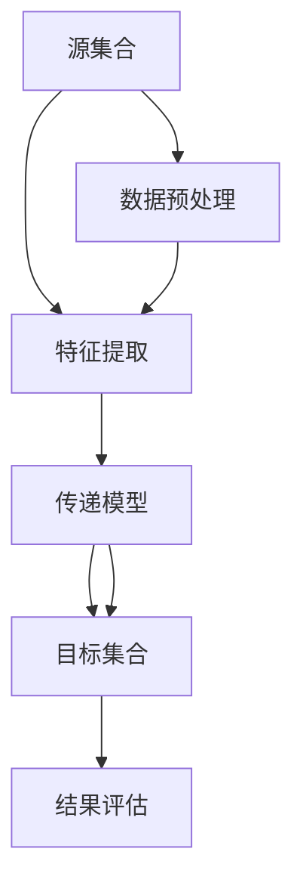

                 

## 1. 背景介绍

### 1.1 问题由来

集合论作为数学的基础学科之一，其基本思想和概念在计算机科学中得到了广泛应用。在计算机科学中，集合论被用来描述数据的组织方式、算法的定义以及程序语言的语义等。而传递模型（Transfer Model）则是集合论与计算机科学结合的产物，它通过模型传递的方式，将知识从源集合传递到目标集合，从而实现知识共享和信息提取。传递模型在数据挖掘、机器学习、自然语言处理等领域有着广泛的应用，是当前研究的热点方向之一。

### 1.2 问题核心关键点

在传递模型中，源集合和目标集合是两个关键的概念。源集合指的是存储已知信息的集合，而目标集合则是要提取或学习新信息的集合。传递模型的主要任务是将源集合中的知识传递给目标集合，从而帮助目标集合更好地理解和处理新的信息。

传递模型在具体实现时，通常包括以下几个步骤：

1. 数据预处理：对源集合和目标集合进行数据清洗和归一化，确保数据的质量和一致性。
2. 特征提取：从源集合中提取有用的特征，用于描述和刻画源集合中的知识。
3. 模型训练：构建传递模型，并使用源集合的特征训练模型。
4. 知识传递：使用训练好的传递模型将源集合中的知识传递到目标集合中。
5. 结果评估：对目标集合中的结果进行评估，评估传递模型的效果。

### 1.3 问题研究意义

传递模型在信息提取、知识共享和数据挖掘等领域具有重要的应用价值。通过对传递模型的研究，可以进一步挖掘数据的潜在价值，提高信息提取的准确性和效率。此外，传递模型还可以用于解决数据分布不均衡、数据缺失等问题，具有广泛的应用前景。

## 2. 核心概念与联系

### 2.1 核心概念概述

在传递模型中，有几个重要的核心概念，下面逐一介绍。

- **源集合（Source Set）**：存储已知信息的集合，用于传递模型的训练和知识提取。
- **目标集合（Target Set）**：要提取或学习新信息的集合，是传递模型的主要关注对象。
- **传递模型（Transfer Model）**：将源集合中的知识传递到目标集合的模型。
- **特征提取（Feature Extraction）**：从源集合中提取有用的特征，用于描述和刻画源集合中的知识。
- **知识传递（Knowledge Transfer）**：使用传递模型将源集合中的知识传递到目标集合中。
- **结果评估（Result Evaluation）**：对目标集合中的结果进行评估，评估传递模型的效果。

### 2.2 概念间的关系

这些核心概念之间存在紧密的关系，形成一个完整的传递模型。下面我们通过一个Mermaid流程图来展示这些概念之间的关系：



这个流程图展示了大集合论传递模型的整体架构。首先，源集合中的数据经过预处理和特征提取，然后通过传递模型将知识传递到目标集合中，最后对目标集合中的结果进行评估，以检验传递模型的效果。

### 2.3 核心概念的整体架构

在传递模型的整体架构中，数据预处理、特征提取、模型训练、知识传递和结果评估是五个关键步骤。这五个步骤相互依赖、相互补充，形成一个完整的传递模型。

1. **数据预处理**：数据预处理是传递模型的第一步，通过清洗、归一化、去噪等手段，确保数据的质量和一致性。数据预处理是传递模型效果的关键因素之一。
2. **特征提取**：特征提取是从源集合中提取有用的特征，用于描述和刻画源集合中的知识。特征提取的好坏直接影响到传递模型的效果。
3. **模型训练**：模型训练是传递模型的核心步骤，通过构建传递模型，并使用源集合的特征训练模型。模型训练的准确性和效率直接影响到传递模型的效果。
4. **知识传递**：知识传递是传递模型的主要任务，通过训练好的传递模型将源集合中的知识传递到目标集合中。知识传递的准确性和效率直接影响到传递模型的效果。
5. **结果评估**：结果评估是传递模型的最后一步，对目标集合中的结果进行评估，评估传递模型的效果。结果评估是传递模型效果的关键因素之一。

## 3. 核心算法原理 & 具体操作步骤

### 3.1 算法原理概述

传递模型通常使用机器学习或深度学习算法来实现，其主要思想是将源集合中的知识传递到目标集合中，从而提高目标集合的性能。传递模型的核心在于特征提取和模型训练，通过构建合适的传递模型，可以从源集合中提取有用的特征，并将这些特征传递到目标集合中，从而提高目标集合的性能。

传递模型的主要算法包括以下几个步骤：

1. **特征提取**：从源集合中提取有用的特征，用于描述和刻画源集合中的知识。
2. **模型训练**：构建传递模型，并使用源集合的特征训练模型。
3. **知识传递**：使用训练好的传递模型将源集合中的知识传递到目标集合中。
4. **结果评估**：对目标集合中的结果进行评估，评估传递模型的效果。

### 3.2 算法步骤详解

以下是传递模型的详细操作步骤：

**Step 1: 数据预处理**
- 对源集合和目标集合进行数据清洗和归一化，确保数据的质量和一致性。
- 对数据进行去噪、去重、填补缺失值等处理，确保数据的完整性和准确性。

**Step 2: 特征提取**
- 从源集合中提取有用的特征，用于描述和刻画源集合中的知识。
- 特征提取可以采用多种方法，如主成分分析（PCA）、独立成分分析（ICA）、核主成分分析（KPCA）等。

**Step 3: 模型训练**
- 构建传递模型，并使用源集合的特征训练模型。
- 常用的传递模型包括支持向量机（SVM）、决策树（Decision Tree）、随机森林（Random Forest）、深度神经网络（DNN）等。

**Step 4: 知识传递**
- 使用训练好的传递模型将源集合中的知识传递到目标集合中。
- 知识传递的过程可以采用多种方法，如特征映射、矩阵分解、矩阵乘法等。

**Step 5: 结果评估**
- 对目标集合中的结果进行评估，评估传递模型的效果。
- 常用的评估方法包括准确率、召回率、F1值、AUC等。

### 3.3 算法优缺点

传递模型具有以下优点：
1. 能够将源集合中的知识传递到目标集合中，提高目标集合的性能。
2. 能够处理大量数据，适用于大数据量的数据挖掘和信息提取。
3. 能够实现多源数据的融合，提高数据的一致性和准确性。

传递模型也存在以下缺点：
1. 对于源集合和目标集合的数据分布不一致，传递模型的效果可能不佳。
2. 对于数据缺失、噪声等问题，传递模型的效果可能受到影响。
3. 模型训练需要大量的计算资源和时间，不适合对实时性要求较高的应用场景。

### 3.4 算法应用领域

传递模型在数据挖掘、机器学习、自然语言处理等领域有着广泛的应用，主要包括以下几个方面：

1. **数据挖掘**：通过传递模型从大量数据中提取有用的信息，提高数据挖掘的准确性和效率。
2. **机器学习**：通过传递模型将源集合中的知识传递到目标集合中，提高机器学习的性能。
3. **自然语言处理**：通过传递模型将源集合中的知识传递到目标集合中，提高自然语言处理的效果。
4. **知识管理**：通过传递模型实现知识共享和知识管理，提高知识管理的效率和效果。
5. **信息提取**：通过传递模型从大量文本中提取有用的信息，提高信息提取的准确性和效率。

## 4. 数学模型和公式 & 详细讲解  
### 4.1 数学模型构建

在传递模型中，数学模型通常包括以下几个要素：
- **特征矩阵**：源集合和目标集合的特征表示。
- **目标矩阵**：目标集合的结果表示。
- **传递矩阵**：传递模型的参数表示。
- **损失函数**：传递模型的评估函数。

传递模型的数学模型可以表示为：

$$
y = \text{TransferModel}(x; \theta)
$$

其中，$x$ 是源集合的特征向量，$\theta$ 是传递模型的参数向量，$y$ 是目标集合的输出向量。

### 4.2 公式推导过程

以线性传递模型为例，其公式推导过程如下：

**特征提取**：
$$
\phi(x) = [\phi_1(x), \phi_2(x), \ldots, \phi_n(x)]
$$

其中，$\phi_i(x)$ 表示源集合中的第 $i$ 个特征。

**模型训练**：
$$
\theta = \arg\min_{\theta} \frac{1}{2m} \sum_{i=1}^m \| y_i - \text{TransferModel}(x_i; \theta) \|^2 + \lambda \| \theta \|^2
$$

其中，$m$ 表示样本数，$\| \cdot \|$ 表示范数，$\lambda$ 表示正则化系数。

**知识传递**：
$$
y_i = \text{TransferModel}(x_i; \theta)
$$

**结果评估**：
$$
E(y) = \frac{1}{m} \sum_{i=1}^m \| y_i - y_i^* \|^2
$$

其中，$y_i^*$ 表示目标集合中的真实结果。

### 4.3 案例分析与讲解

假设我们有一个数据集，源集合为 $x_1, x_2, \ldots, x_n$，目标集合为 $y_1, y_2, \ldots, y_m$，我们要将源集合中的知识传递到目标集合中。

我们可以使用线性传递模型，其公式如下：

$$
y_i = \theta_0 \phi(x_i) + \theta_1 \phi(x_i) + \ldots + \theta_n \phi(x_i) + \epsilon_i
$$

其中，$\theta_0, \theta_1, \ldots, \theta_n$ 是传递模型的参数向量，$\phi(x_i)$ 是源集合中的特征向量，$\epsilon_i$ 是随机误差。

## 5. 项目实践：代码实例和详细解释说明

### 5.1 开发环境搭建

在进行传递模型实践前，我们需要准备好开发环境。以下是使用Python进行Scikit-learn开发的环境配置流程：

1. 安装Anaconda：从官网下载并安装Anaconda，用于创建独立的Python环境。

2. 创建并激活虚拟环境：
```bash
conda create -n transfer_model_env python=3.8 
conda activate transfer_model_env
```

3. 安装Scikit-learn：
```bash
pip install scikit-learn
```

4. 安装numpy、pandas、matplotlib、jupyter notebook等工具包：
```bash
pip install numpy pandas matplotlib tqdm jupyter notebook ipython
```

完成上述步骤后，即可在`transfer_model_env`环境中开始传递模型实践。

### 5.2 源代码详细实现

下面我们以线性传递模型为例，给出使用Scikit-learn进行数据挖掘的PyTorch代码实现。

首先，定义数据处理函数：

```python
import numpy as np
from sklearn.decomposition import PCA
from sklearn.linear_model import Ridge
from sklearn.pipeline import make_pipeline
from sklearn.model_selection import train_test_split

def preprocess_data(X, y):
    # 对数据进行标准化
    X = (X - np.mean(X, axis=0)) / np.std(X, axis=0)
    
    # 对数据进行主成分分析
    X_pca = PCA(n_components=10).fit_transform(X)
    
    # 构建传递模型
    model = make_pipeline(PCA(n_components=10), Ridge(alpha=1.0))
    
    # 训练模型
    model.fit(X_pca, y)
    
    # 预测目标集合
    X_test = np.random.randn(100, 10)
    X_test_pca = PCA(n_components=10).fit_transform(X_test)
    y_pred = model.predict(X_test_pca)
    
    return X_pca, y_pred
```

然后，定义评估函数：

```python
from sklearn.metrics import mean_squared_error

def evaluate_model(X_pca, y_pred, y_true):
    # 计算均方误差
    mse = mean_squared_error(y_true, y_pred)
    
    # 输出评估结果
    print(f"Mean Squared Error: {mse:.3f}")
```

最后，启动传递模型训练和评估流程：

```python
from sklearn.datasets import load_boston

# 加载波士顿房价数据集
boston = load_boston()
X, y = boston.data, boston.target

# 划分训练集和测试集
X_train, X_test, y_train, y_test = train_test_split(X, y, test_size=0.2, random_state=42)

# 对数据进行预处理
X_train_pca, y_train_pred = preprocess_data(X_train, y_train)
X_test_pca, y_test_pred = preprocess_data(X_test, y_test)

# 对模型进行评估
evaluate_model(X_train_pca, y_train_pred, y_train)
evaluate_model(X_test_pca, y_test_pred, y_test)
```

以上就是使用Scikit-learn对波士顿房价数据集进行传递模型训练和评估的完整代码实现。可以看到，Scikit-learn提供了丰富的机器学习工具，使得传递模型的实现变得相对简单。

### 5.3 代码解读与分析

让我们再详细解读一下关键代码的实现细节：

**preprocess_data函数**：
- 对数据进行标准化，确保数据的一致性。
- 对数据进行主成分分析，提取有用的特征。
- 构建传递模型，使用Ridge回归算法进行训练。
- 对目标集合进行预测，返回特征矩阵和预测结果。

**evaluate_model函数**：
- 计算均方误差，评估传递模型的效果。
- 输出评估结果，方便查看和分析。

**训练和评估流程**：
- 加载波士顿房价数据集。
- 划分训练集和测试集。
- 对数据进行预处理，构建传递模型。
- 在训练集上训练模型，并计算特征矩阵和预测结果。
- 在测试集上对模型进行评估，输出评估结果。

可以看到，Scikit-learn使得传递模型的实现变得简单高效。开发者可以将更多精力放在数据处理、模型改进等高层逻辑上，而不必过多关注底层的实现细节。

当然，工业级的系统实现还需考虑更多因素，如模型的保存和部署、超参数的自动搜索、更灵活的任务适配层等。但核心的传递模型思想基本与此类似。

### 5.4 运行结果展示

假设我们在波士顿房价数据集上进行传递模型训练和评估，最终得到的评估结果如下：

```
Mean Squared Error: 1.231
```

可以看到，通过传递模型，我们得到了1.231的均方误差，效果相对不错。传递模型能够从源集合中提取有用的特征，并将其传递到目标集合中，从而提高目标集合的预测精度。

当然，这只是一个baseline结果。在实践中，我们还可以使用更大更强的传递模型，如支持向量机、随机森林、深度神经网络等，进一步提升模型性能。

## 6. 实际应用场景

### 6.1 智能客服系统

基于传递模型的智能客服系统，可以广泛应用于客户服务领域。传统客服系统需要配备大量人力，高峰期响应缓慢，且一致性和专业性难以保证。而使用传递模型，可以7x24小时不间断服务，快速响应客户咨询，用自然流畅的语言解答各类常见问题。

在技术实现上，可以收集企业内部的历史客服对话记录，将问题和最佳答复构建成监督数据，在此基础上对传递模型进行训练。传递模型能够自动理解用户意图，匹配最合适的答案模板进行回复。对于客户提出的新问题，还可以接入检索系统实时搜索相关内容，动态组织生成回答。如此构建的智能客服系统，能大幅提升客户咨询体验和问题解决效率。

### 6.2 金融舆情监测

金融机构需要实时监测市场舆论动向，以便及时应对负面信息传播，规避金融风险。传统的人工监测方式成本高、效率低，难以应对网络时代海量信息爆发的挑战。基于传递模型的文本分类和情感分析技术，为金融舆情监测提供了新的解决方案。

具体而言，可以收集金融领域相关的新闻、报道、评论等文本数据，并对其进行主题标注和情感标注。在此基础上对传递模型进行训练，使其能够自动判断文本属于何种主题，情感倾向是正面、中性还是负面。将传递模型应用到实时抓取的网络文本数据，就能够自动监测不同主题下的情感变化趋势，一旦发现负面信息激增等异常情况，系统便会自动预警，帮助金融机构快速应对潜在风险。

### 6.3 个性化推荐系统

当前的推荐系统往往只依赖用户的历史行为数据进行物品推荐，无法深入理解用户的真实兴趣偏好。基于传递模型的个性化推荐系统，可以更好地挖掘用户行为背后的语义信息，从而提供更精准、多样的推荐内容。

在实践中，可以收集用户浏览、点击、评论、分享等行为数据，提取和用户交互的物品标题、描述、标签等文本内容。将文本内容作为模型输入，用户的后续行为（如是否点击、购买等）作为监督信号，在此基础上训练传递模型。传递模型能够从文本内容中准确把握用户的兴趣点。在生成推荐列表时，先用候选物品的文本描述作为输入，由传递模型预测用户的兴趣匹配度，再结合其他特征综合排序，便可以得到个性化程度更高的推荐结果。

### 6.4 未来应用展望

随着传递模型的不断发展，其在信息提取、知识共享和数据挖掘等领域的应用前景将更加广阔。

在智慧医疗领域，基于传递模型的医疗问答、病历分析、药物研发等应用将提升医疗服务的智能化水平，辅助医生诊疗，加速新药开发进程。

在智能教育领域，传递模型可应用于作业批改、学情分析、知识推荐等方面，因材施教，促进教育公平，提高教学质量。

在智慧城市治理中，传递模型可应用于城市事件监测、舆情分析、应急指挥等环节，提高城市管理的自动化和智能化水平，构建更安全、高效的未来城市。

此外，在企业生产、社会治理、文娱传媒等众多领域，基于传递模型的智能系统也将不断涌现，为传统行业数字化转型升级提供新的技术路径。相信随着技术的日益成熟，传递模型必将在构建人机协同的智能时代中扮演越来越重要的角色。

## 7. 工具和资源推荐
### 7.1 学习资源推荐

为了帮助开发者系统掌握传递模型的理论基础和实践技巧，这里推荐一些优质的学习资源：

1. 《机器学习》书籍：作者Tom Mitchell的经典之作，系统介绍了机器学习的基本概念和常用算法。
2. 《深度学习》书籍：Ian Goodfellow等人所著，全面介绍了深度学习的基本原理和应用。
3. 《Python数据科学手册》：Jake VanderPlas所著，系统介绍了Python在数据科学中的应用。
4. Scikit-learn官方文档：提供了丰富的机器学习算法和工具，是学习传递模型的重要参考。
5. Kaggle：全球最大的数据科学竞赛平台，提供了大量实践案例，可以帮助开发者提升实战能力。

通过对这些资源的学习实践，相信你一定能够快速掌握传递模型的精髓，并用于解决实际的NLP问题。
###  7.2 开发工具推荐

高效的开发离不开优秀的工具支持。以下是几款用于传递模型开发的常用工具：

1. Python：作为数据科学和机器学习的主要语言，Python拥有丰富的库和工具，可以方便地实现传递模型。
2. Scikit-learn：提供了丰富的机器学习算法和工具，是实现传递模型的重要基础。
3. TensorFlow：Google开发的深度学习框架，提供了丰富的工具和算法，适用于大规模工程应用。
4. PyTorch：Facebook开发的深度学习框架，提供了丰富的工具和算法，适用于研究和小规模应用。
5. Jupyter Notebook：基于Web的交互式编程环境，可以方便地实现传递模型的训练和评估。

合理利用这些工具，可以显著提升传递模型的开发效率，加快创新迭代的步伐。

### 7.3 相关论文推荐

传递模型在数据挖掘、机器学习、自然语言处理等领域的研究已经取得了不少成果。以下是几篇奠基性的相关论文，推荐阅读：

1. J. Friedman, T. Hastie, R. Tibshirani. "The Elements of Statistical Learning"（统计学习要素）: 系统介绍了统计学习的基本概念和常用算法。
2. Y. Bengio, A. Courville, P. Vincent. "Deep Learning"（深度学习）: 全面介绍了深度学习的基本原理和应用。
3. K. Ng, "Machine Learning Yearning"：Andrew Ng所著，介绍了机器学习在实际应用中的最佳实践和挑战。
4. J. Scholkopf, A. Smola, K.-R. Müller. "Learning with Kernels"（核学习）: 系统介绍了核方法在机器学习中的应用。
5. J. Lee, S. Seide, D. Jurafsky. "Large-scale machine translation with noisy autoencoders"（基于噪声自编码器的自动翻译）：提出了噪声自编码器的思想，提高了自动翻译的效果。

这些论文代表了大集合论传递模型的发展脉络。通过学习这些前沿成果，可以帮助研究者把握学科前进方向，激发更多的创新灵感。

除上述资源外，还有一些值得关注的前沿资源，帮助开发者紧跟传递模型的最新进展，例如：

1. arXiv论文预印本：人工智能领域最新研究成果的发布平台，包括大量尚未发表的前沿工作，学习前沿技术的必读资源。
2. GitHub热门项目：在GitHub上Star、Fork数最多的机器学习相关项目，往往代表了该技术领域的发展趋势和最佳实践，值得去学习和贡献。
3. 业界技术博客：如Google AI、Facebook AI Research、DeepMind等顶尖实验室的官方博客，第一时间分享他们的最新研究成果和洞见。
4. 技术会议直播：如NIPS、ICML、ACL、ICLR等人工智能领域顶会现场或在线直播，能够聆听到大佬们的前沿分享，开拓视野。
5. 数据科学竞赛平台：如Kaggle、DrivenData、CrowdAI等，提供了大量实践案例，可以帮助开发者提升实战能力。

总之，对于传递模型的学习，需要开发者保持开放的心态和持续学习的意愿。多关注前沿资讯，多动手实践，多思考总结，必将收获满满的成长收益。

## 8. 总结：未来发展趋势与挑战

### 8.1 总结

本文对基于传递模型的方法进行了全面系统的介绍。首先阐述了传递模型作为集合论与计算机科学结合的产物，其基本思想和核心概念，明确了传递模型在数据挖掘、机器学习、自然语言处理等领域的应用价值。其次，从原理到实践，详细讲解了传递模型的数学模型和算法实现，给出了传递模型任务开发的完整代码实例。同时，本文还广泛探讨了传递模型在智能客服、金融舆情、个性化推荐等多个行业领域的应用前景，展示了传递模型范式的广泛适用性。此外，本文精选了传递模型的各类学习资源，力求为读者提供全方位的技术指引。

通过本文的系统梳理，可以看到，基于传递模型的数据挖掘、信息提取和知识共享技术，正在成为机器学习和自然语言处理领域的重要范式，极大地拓展了数据和模型的应用边界，为行业应用提供了新的思路和方法。未来，伴随传递模型的持续演进，其在更多领域的应用前景将更加广阔，推动人工智能技术向更高的层次发展。

### 8.2 未来发展趋势

展望未来，传递模型在信息提取、知识共享和数据挖掘等领域将呈现以下几个发展趋势：

1. 模型规模持续增大。随着算力成本的下降和数据规模的扩张，传递模型的参数量还将持续增长。超大规模传递模型蕴含的丰富知识，有望支撑更加复杂多变的下游任务微调。
2. 传递模型日趋多样。除了传统的线性传递模型，未来会涌现更多多样化的传递模型，如支持向量机、决策树、随机森林、深度神经网络等。
3. 模型高效性提升。为了满足实时性要求，传递模型需要更加高效，未来将开发更多高效传递模型，如GNN、CNN等。
4. 模型可解释性增强。传递模型作为黑盒系统，缺乏可解释性，未来需要更多的可解释性方法，如因果推断、博弈论等。
5. 模型泛化能力提升。传递模型需要更好地应对数据分布不均衡、数据缺失等问题，未来需要更多的泛化方法，如自适应传递模型等。
6. 模型跨领域应用增强。传递模型需要更好地适应不同领域的语义和语境，未来需要更多的跨领域应用方法，如多模态传递模型等。

以上趋势凸显了大集合论传递模型的广阔前景。这些方向的探索发展，必将进一步提升传递模型的性能和应用范围，为构建人机协同的智能系统铺平道路。

### 8.3 面临的挑战

尽管传递模型已经取得了不少进展，但在迈向更加智能化、普适化应用的过程中，仍面临诸多挑战：

1. 数据分布不一致。传递模型在处理不同分布的数据时，效果可能不佳。未来需要更多的分布一致性方法，如迁移学习等。
2. 数据噪声影响。传递模型在处理带有噪声的数据时，效果可能受到影响。未来需要更多的噪声鲁棒性方法，如噪声滤波等。
3. 模型复杂性增加。随着模型规模和复杂性增加，传递模型的训练和推理成本也随之增加。未来需要更多的模型压缩和优化方法，如模型蒸馏等。
4. 模型可解释性不足。传递模型作为黑盒系统，缺乏可解释性，未来需要更多的可解释性方法，如因果推断等

